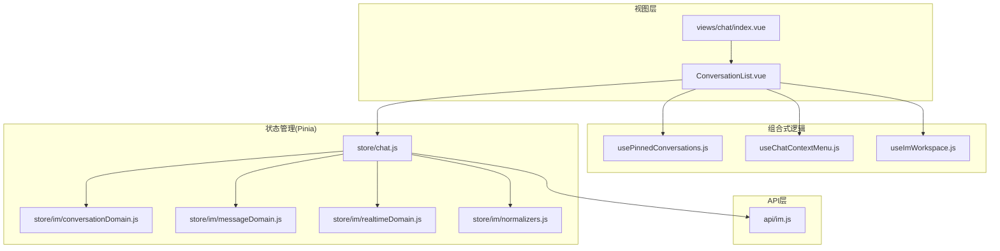
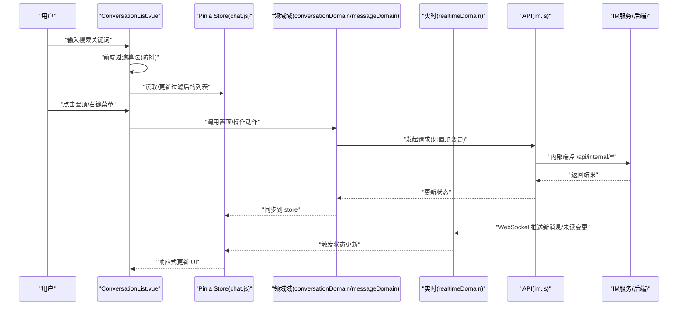
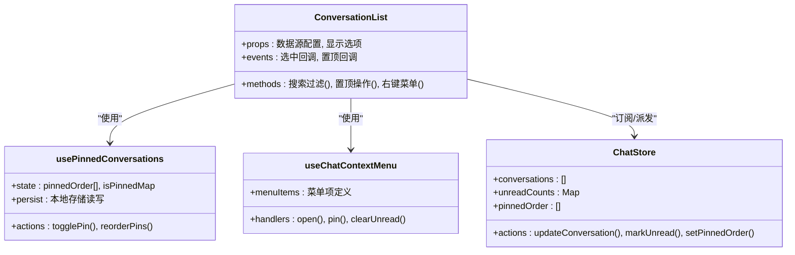
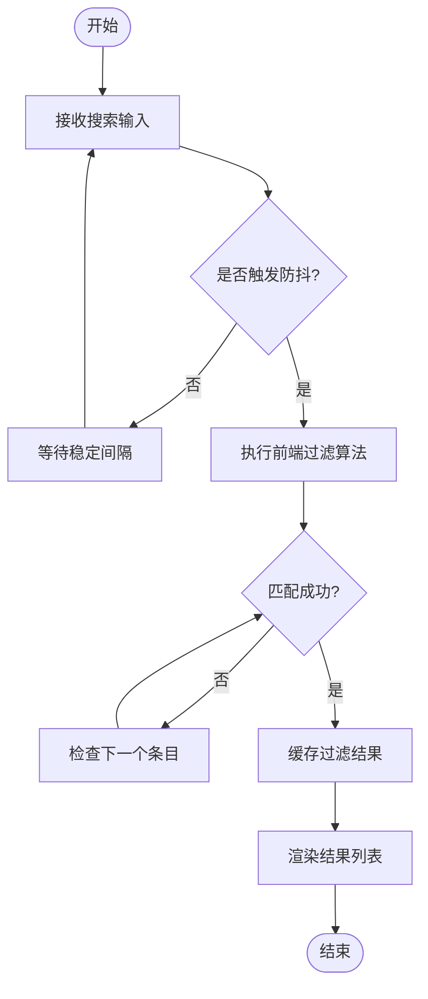
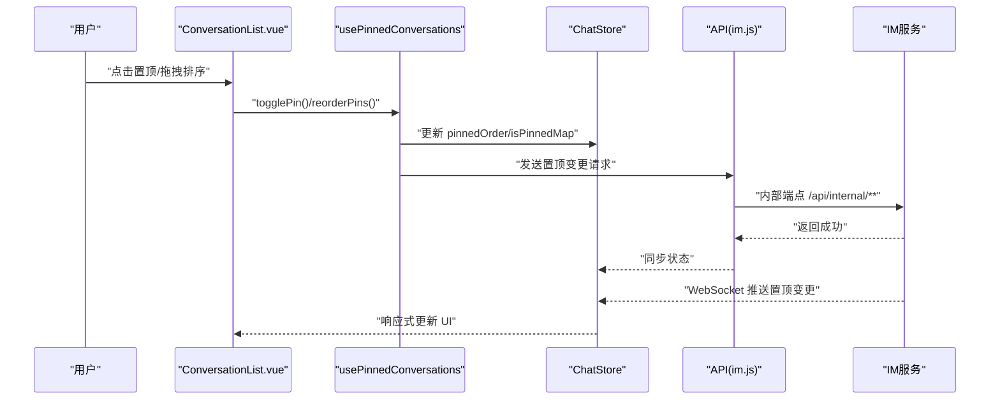
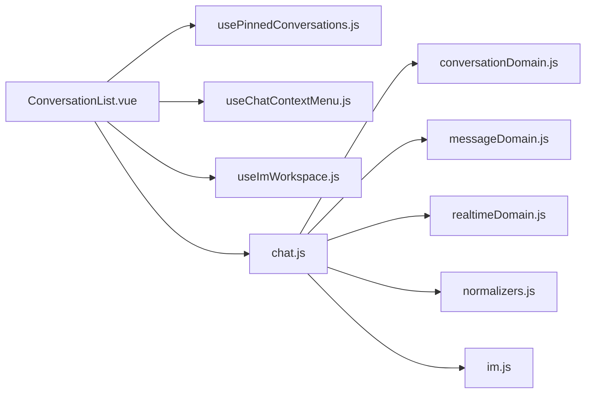

# 对话列表组件

<cite>
**本文引用的文件**
- [ConversationList.vue](file://ZXYZdatabaseFront/src/views/chat/components/ConversationList.vue)
- [usePinnedConversations.js](file://ZXYZdatabaseFront/src/views/chat/composables/usePinnedConversations.js)
- [chat.js](file://ZXYZdatabaseFront/src/store/chat.js)
- [im.js](file://ZXYZdatabaseFront/src/api/im.js)
- [conversationDomain.js](file://ZXYZdatabaseFront/src/store/im/conversationDomain.js)
- [messageDomain.js](file://ZXYZdatabaseFront/src/store/im/messageDomain.js)
- [realtimeDomain.js](file://ZXYZdatabaseFront/src/store/im/realtimeDomain.js)
- [normalizers.js](file://ZXYZdatabaseFront/src/store/im/normalizers.js)
- [useChatContextMenu.js](file://ZXYZdatabaseFront/src/views/chat/composables/useChatContextMenu.js)
- [useImWorkspace.js](file://ZXYZdatabaseFront/src/composables/useImWorkspace.js)
- [index.vue（聊天页面）](file://ZXYZdatabaseFront/src/views/chat/index.vue)
</cite>

## 目录
1. [简介](#简介)
2. [项目结构](#项目结构)
3. [核心组件](#核心组件)
4. [架构总览](#架构总览)
5. [详细组件分析](#详细组件分析)
6. [依赖关系分析](#依赖关系分析)
7. [性能考虑](#性能考虑)
8. [故障排查指南](#故障排查指南)
9. [结论](#结论)
10. [附录：Props 接口与样式定制](#附录props-接口与样式定制)

## 简介
本文件为 ZXYZ 聊天应用的“对话列表”组件提供系统化文档。内容覆盖 ConversationList 的核心功能（搜索过滤、未读标记、置顶管理、右键菜单）、数据绑定机制（Pinia store、实时数据更新、缓存策略）、搜索实现（前端过滤算法、防抖与性能优化）、未读标记的视觉反馈（数字徽章、颜色变化、动画）、置顶交互（拖拽排序、状态持久化与本地存储），以及完整的 Props 接口与样式定制指南（主题适配、响应式布局、移动端优化）。

## 项目结构
对话列表相关代码位于前端 Vue 应用中，采用组合式 API + Pinia 的状态管理模式，配合 composables 封装业务逻辑，API 层通过 im.js 调用后端 IM 服务。

图表来源
- [ConversationList.vue](file://ZXYZdatabaseFront/src/views/chat/components/ConversationList.vue)
- [usePinnedConversations.js](file://ZXYZdatabaseFront/src/views/chat/composables/usePinnedConversations.js)
- [useChatContextMenu.js](file://ZXYZdatabaseFront/src/views/chat/composables/useChatContextMenu.js)
- [useImWorkspace.js](file://ZXYZdatabaseFront/src/composables/useImWorkspace.js)
- [chat.js](file://ZXYZdatabaseFront/src/store/chat.js)
- [conversationDomain.js](file://ZXYZdatabaseFront/src/store/im/conversationDomain.js)
- [messageDomain.js](file://ZXYZdatabaseFront/src/store/im/messageDomain.js)
- [realtimeDomain.js](file://ZXYZdatabaseFront/src/store/im/realtimeDomain.js)
- [normalizers.js](file://ZXYZdatabaseFront/src/store/im/normalizers.js)
- [im.js](file://ZXYZdatabaseFront/src/api/im.js)
- [index.vue（聊天页面）](file://ZXYZdatabaseFront/src/views/chat/index.vue)

章节来源
- [ConversationList.vue](file://ZXYZdatabaseFront/src/views/chat/components/ConversationList.vue)
- [chat.js](file://ZXYZdatabaseFront/src/store/chat.js)
- [conversationDomain.js](file://ZXYZdatabaseFront/src/store/im/conversationDomain.js)
- [messageDomain.js](file://ZXYZdatabaseFront/src/store/im/messageDomain.js)
- [realtimeDomain.js](file://ZXYZdatabaseFront/src/store/im/realtimeDomain.js)
- [normalizers.js](file://ZXYZdatabaseFront/src/store/im/normalizers.js)
- [im.js](file://ZXYZdatabaseFront/src/api/im.js)
- [usePinnedConversations.js](file://ZXYZdatabaseFront/src/views/chat/composables/usePinnedConversations.js)
- [useChatContextMenu.js](file://ZXYZdatabaseFront/src/views/chat/composables/useChatContextMenu.js)
- [useImWorkspace.js](file://ZXYZdatabaseFront/src/composables/useImWorkspace.js)
- [index.vue（聊天页面）](file://ZXYZdatabaseFront/src/views/chat/index.vue)

## 核心组件
- ConversationList 组件负责展示对话列表、处理搜索过滤、未读标记显示、置顶管理与右键菜单操作。
- 使用 Pinia store 集中管理对话状态，包括对话列表、未读数、置顶顺序等。
- 通过 composables 将置顶、上下文菜单、工作区切换等能力解耦，便于复用与维护。

章节来源
- [ConversationList.vue](file://ZXYZdatabaseFront/src/views/chat/components/ConversationList.vue)
- [chat.js](file://ZXYZdatabaseFront/src/store/chat.js)
- [usePinnedConversations.js](file://ZXYZdatabaseFront/src/views/chat/composables/usePinnedConversations.js)
- [useChatContextMenu.js](file://ZXYZdatabaseFront/src/views/chat/composables/useChatContextMenu.js)
- [useImWorkspace.js](file://ZXYZdatabaseFront/src/composables/useImWorkspace.js)

## 架构总览
对话列表的数据流遵循“视图 → composables → Pinia store → API/WS → 后端服务”的路径。实时消息通过 WebSocket 推送，触发 store 更新，进而驱动 UI 刷新。

图表来源
- [ConversationList.vue](file://ZXYZdatabaseFront/src/views/chat/components/ConversationList.vue)
- [chat.js](file://ZXYZdatabaseFront/src/store/chat.js)
- [conversationDomain.js](file://ZXYZdatabaseFront/src/store/im/conversationDomain.js)
- [messageDomain.js](file://ZXYZdatabaseFront/src/store/im/messageDomain.js)
- [realtimeDomain.js](file://ZXYZdatabaseFront/src/store/im/realtimeDomain.js)
- [im.js](file://ZXYZdatabaseFront/src/api/im.js)

## 详细组件分析

### ConversationList 组件
- 功能要点
  - 搜索过滤：支持按会话名称、成员或最后消息内容进行匹配；具备防抖处理以减少频繁计算。
  - 未读标记：根据未读数量渲染数字徽章，并在有新消息时进行颜色与动画反馈。
  - 置顶管理：支持置顶/取消置顶，维护置顶顺序；可结合拖拽排序（若启用）。
  - 右键菜单：提供打开、置顶、移除、清空未读等操作入口。
- 数据绑定
  - 从 Pinia store 中订阅对话列表、未读数、置顶状态等响应式数据。
  - 监听实时事件（新消息、未读计数变化）自动刷新列表。
- 交互流程
  - 搜索输入触发防抖函数，生成过滤后的临时列表用于渲染。
  - 置顶操作调用 composables 方法，更新 store 并持久化至本地存储。
  - 右键菜单选择后执行对应 action，必要时调用 API 同步后端。

章节来源
- [ConversationList.vue](file://ZXYZdatabaseFront/src/views/chat/components/ConversationList.vue)
- [usePinnedConversations.js](file://ZXYZdatabaseFront/src/views/chat/composables/usePinnedConversations.js)
- [useChatContextMenu.js](file://ZXYZdatabaseFront/src/views/chat/composables/useChatContextMenu.js)
- [chat.js](file://ZXYZdatabaseFront/src/store/chat.js)

#### 类图（组件与依赖）

图表来源
- [ConversationList.vue](file://ZXYZdatabaseFront/src/views/chat/components/ConversationList.vue)
- [usePinnedConversations.js](file://ZXYZdatabaseFront/src/views/chat/composables/usePinnedConversations.js)
- [useChatContextMenu.js](file://ZXYZdatabaseFront/src/views/chat/composables/useChatContextMenu.js)
- [chat.js](file://ZXYZdatabaseFront/src/store/chat.js)

### 搜索功能的实现原理
- 前端过滤算法
  - 基于关键词对会话名称、成员名、最后消息文本进行模糊匹配。
  - 支持大小写不敏感与多词匹配（空格分隔）。
- 防抖处理
  - 使用防抖函数限制高频输入触发的过滤频率，降低渲染压力。
- 性能优化
  - 仅对可见区域进行重渲染（虚拟滚动可选）。
  - 过滤结果缓存，避免重复计算。
  - 大列表场景下优先使用索引或分片加载。

图表来源
- [ConversationList.vue](file://ZXYZdatabaseFront/src/views/chat/components/ConversationList.vue)

章节来源
- [ConversationList.vue](file://ZXYZdatabaseFront/src/views/chat/components/ConversationList.vue)

### 未读消息标记显示
- 数字徽章
  - 当未读数大于 0 时显示徽章，超过阈值（如 99）显示上限值。
- 颜色变化
  - 未读状态使用强调色（如蓝色/红色）以突出提示。
- 动画效果
  - 新消息到达时徽章出现淡入或缩放动画，提升感知度。

章节来源
- [ConversationList.vue](file://ZXYZdatabaseFront/src/views/chat/components/ConversationList.vue)
- [messageDomain.js](file://ZXYZdatabaseFront/src/store/im/messageDomain.js)
- [realtimeDomain.js](file://ZXYZdatabaseFront/src/store/im/realtimeDomain.js)

### 置顶对话管理
- 交互逻辑
  - 支持置顶/取消置顶，置顶会话保持在列表顶部并按顺序排列。
  - 可通过拖拽调整置顶顺序（若启用）。
- 状态持久化
  - 置顶顺序与状态保存到本地存储（localStorage），确保刷新后保持一致。
- 数据同步
  - 置顶变更会调用后端 API 同步，同时通过 WebSocket 广播给其他客户端。

图表来源
- [usePinnedConversations.js](file://ZXYZdatabaseFront/src/views/chat/composables/usePinnedConversations.js)
- [chat.js](file://ZXYZdatabaseFront/src/store/chat.js)
- [im.js](file://ZXYZdatabaseFront/src/api/im.js)

章节来源
- [usePinnedConversations.js](file://ZXYZdatabaseFront/src/views/chat/composables/usePinnedConversations.js)
- [chat.js](file://ZXYZdatabaseFront/src/store/chat.js)
- [im.js](file://ZXYZdatabaseFront/src/api/im.js)

### 右键菜单操作
- 菜单项
  - 打开会话、置顶/取消置顶、清空未读、删除会话等。
- 事件处理
  - 每个菜单项绑定对应 handler，调用 composables 或 store actions。
- 用户体验
  - 菜单定位自适应屏幕边界，避免溢出。

章节来源
- [useChatContextMenu.js](file://ZXYZdatabaseFront/src/views/chat/composables/useChatContextMenu.js)
- [ConversationList.vue](file://ZXYZdatabaseFront/src/views/chat/components/ConversationList.vue)

### 数据绑定机制与缓存策略
- Pinia store
  - chat.js 作为顶层 store，聚合 conversationDomain、messageDomain、realtimeDomain 的能力。
  - 提供统一 actions 更新对话列表、未读数、置顶顺序等。
- 实时数据更新
  - realtimeDomain 监听 WebSocket 事件，触发 store 更新，保持 UI 一致。
- 缓存策略
  - normalizers 对后端数据进行规范化，减少重复转换开销。
  - 搜索结果与置顶顺序在本地存储缓存，提高首屏与交互速度。

章节来源
- [chat.js](file://ZXYZdatabaseFront/src/store/chat.js)
- [conversationDomain.js](file://ZXYZdatabaseFront/src/store/im/conversationDomain.js)
- [messageDomain.js](file://ZXYZdatabaseFront/src/store/im/messageDomain.js)
- [realtimeDomain.js](file://ZXYZdatabaseFront/src/store/im/realtimeDomain.js)
- [normalizers.js](file://ZXYZdatabaseFront/src/store/im/normalizers.js)

## 依赖关系分析
- 组件依赖
  - ConversationList 依赖 usePinnedConversations、useChatContextMenu、useImWorkspace 等 composables。
  - 通过 Pinia store 订阅全局状态，避免直接耦合 API。
- 模块耦合
  - store 层通过 domain 模块解耦业务逻辑，便于测试与扩展。
  - API 层统一通过 im.js 访问后端，保证接口一致性。

图表来源
- [ConversationList.vue](file://ZXYZdatabaseFront/src/views/chat/components/ConversationList.vue)
- [usePinnedConversations.js](file://ZXYZdatabaseFront/src/views/chat/composables/usePinnedConversations.js)
- [useChatContextMenu.js](file://ZXYZdatabaseFront/src/views/chat/composables/useChatContextMenu.js)
- [useImWorkspace.js](file://ZXYZdatabaseFront/src/composables/useImWorkspace.js)
- [chat.js](file://ZXYZdatabaseFront/src/store/chat.js)
- [conversationDomain.js](file://ZXYZdatabaseFront/src/store/im/conversationDomain.js)
- [messageDomain.js](file://ZXYZdatabaseFront/src/store/im/messageDomain.js)
- [realtimeDomain.js](file://ZXYZdatabaseFront/src/store/im/realtimeDomain.js)
- [normalizers.js](file://ZXYZdatabaseFront/src/store/im/normalizers.js)
- [im.js](file://ZXYZdatabaseFront/src/api/im.js)

章节来源
- [ConversationList.vue](file://ZXYZdatabaseFront/src/views/chat/components/ConversationList.vue)
- [chat.js](file://ZXYZdatabaseFront/src/store/chat.js)

## 性能考虑
- 搜索性能
  - 使用防抖与缓存减少重复计算；对大列表采用虚拟滚动或分页加载。
- 渲染优化
  - 仅渲染可见区域，避免全量重绘；使用 key 稳定标识提升 diff 效率。
- 网络优化
  - 批量更新与去抖动合并多次 WebSocket 事件，减少状态抖动。
- 内存管理
  - 及时清理无用的订阅与定时器，防止内存泄漏。

[本节为通用指导，无需引用具体文件]

## 故障排查指南
- 搜索无结果
  - 检查关键词匹配规则与大小写设置；确认防抖时间是否过长。
- 未读标记不更新
  - 验证 WebSocket 连接状态与事件订阅；检查 store 的 unreadCounts 更新逻辑。
- 置顶状态不一致
  - 确认本地存储与后端同步是否成功；检查 pinnedOrder 的持久化与恢复逻辑。
- 右键菜单失效
  - 检查菜单项绑定事件是否正确；确认上下文状态（如当前选中会话）是否有效。

章节来源
- [ConversationList.vue](file://ZXYZdatabaseFront/src/views/chat/components/ConversationList.vue)
- [chat.js](file://ZXYZdatabaseFront/src/store/chat.js)
- [usePinnedConversations.js](file://ZXYZdatabaseFront/src/views/chat/composables/usePinnedConversations.js)
- [useChatContextMenu.js](file://ZXYZdatabaseFront/src/views/chat/composables/useChatContextMenu.js)

## 结论
ConversationList 组件通过清晰的职责划分与模块化设计，实现了高效的对话列表管理。结合 Pinia store 与 composables，组件具备良好的可维护性与扩展性。搜索、未读标记、置顶与右键菜单等功能均经过性能优化与用户体验打磨，适用于大规模对话场景。

[本节为总结，无需引用具体文件]

## 附录：Props 接口与样式定制

### Props 接口
- 数据源配置
  - conversations: 对话列表数组（包含 id、name、lastMessage、unreadCount、isPinned 等字段）
  - pinnedOrder: 置顶顺序数组（字符串 ID 列表）
  - searchQuery: 搜索关键词（可选，用于外部控制）
- 显示选项
  - showUnreadBadge: 是否显示未读徽章（布尔）
  - showPinnedIndicator: 是否显示置顶指示器（布尔）
  - enableDragSort: 是否启用拖拽排序（布尔）
- 事件回调
  - onSelect(conversation): 选中对话回调
  - onTogglePin(id): 置顶切换回调
  - onClearUnread(id): 清空未读回调
  - onDelete(id): 删除对话回调

章节来源
- [ConversationList.vue](file://ZXYZdatabaseFront/src/views/chat/components/ConversationList.vue)

### 样式定制指南
- 主题适配
  - 使用 CSS 变量定义主色、强调色与背景色，便于切换暗色/亮色主题。
  - 徽章颜色根据未读状态动态变化（如蓝色表示普通未读，红色表示紧急）。
- 响应式布局
  - 小屏幕下隐藏次要信息（如最后消息预览），保留核心元素（头像、名称、未读数）。
  - 列表项高度自适应，确保触摸友好。
- 移动端优化
  - 增加触摸滑动操作（左滑置顶、右滑删除）。
  - 优化滚动性能，避免卡顿。

章节来源
- [ConversationList.vue](file://ZXYZdatabaseFront/src/views/chat/components/ConversationList.vue)