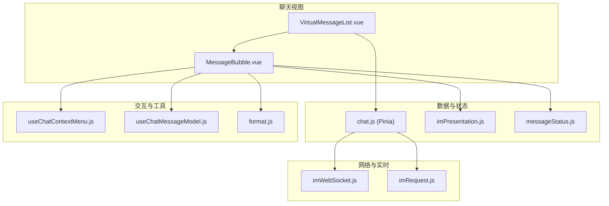
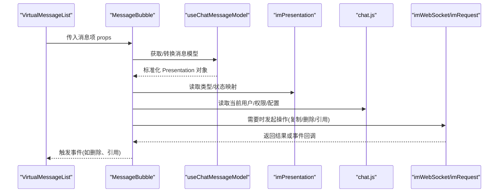
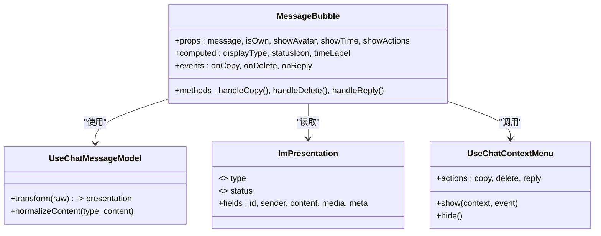
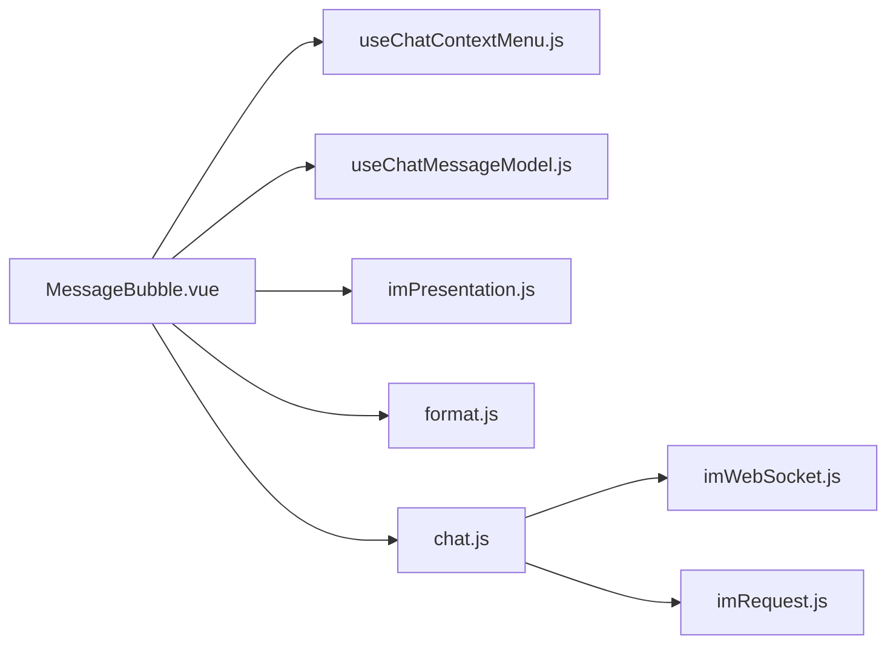

# 消息气泡组件

<cite>
**本文引用的文件**   
- [MessageBubble.vue](file://ZXYZdatabaseFront/src/views/chat/components/MessageBubble.vue)
- [VirtualMessageList.vue](file://ZXYZdatabaseFront/src/views/chat/components/VirtualMessageList.vue)
- [messageStatus.js](file://ZXYZdatabaseFront/src/constants/messageStatus.js)
- [imPresentation.js](file://ZXYZdatabaseFront/src/models/imPresentation.js)
- [useChatMessageModel.js](file://ZXYZdatabaseFront/src/views/chat/composables/useChatMessageModel.js)
- [useChatContextMenu.js](file://ZXYZdatabaseFront/src/views/chat/composables/useChatContextMenu.js)
- [format.js](file://ZXYZdatabaseFront/src/utils/format.js)
- [chat.js](file://ZXYZdatabaseFront/src/store/chat.js)
- [imWebSocket.js](file://ZXYZdatabaseFront/src/utils/imWebSocket.js)
- [imRequest.js](file://ZXYZdatabaseFront/src/utils/imRequest.js)
</cite>

## 目录
1. [简介](#简介)
2. [项目结构](#项目结构)
3. [核心组件](#核心组件)
4. [架构总览](#架构总览)
5. [详细组件分析](#详细组件分析)
6. [依赖分析](#依赖分析)
7. [性能考虑](#性能考虑)
8. [故障排查指南](#故障排查指南)
9. [结论](#结论)
10. [附录：API 与扩展指南](#附录api-与扩展指南)

## 简介
本文件为 ZXYZ 聊天应用的消息气泡组件（MessageBubble）提供全面文档。内容覆盖多类型消息渲染、消息状态指示器、时间戳显示逻辑、用户头像与昵称展示机制、消息操作功能，以及完整的 API 文档和自定义扩展指南。目标是帮助开发者快速理解并高效集成该组件，同时保证可维护性与可扩展性。

## 项目结构
与消息气泡相关的代码主要位于前端 Vue 应用中：
- 视图层组件：MessageBubble.vue、VirtualMessageList.vue
- 常量与模型：messageStatus.js、imPresentation.js
- Composables：useChatMessageModel.js、useChatContextMenu.js
- 工具函数：format.js（格式化、相对时间等）
- 状态与网络：chat.js（Pinia store）、imWebSocket.js（实时通信）、imRequest.js（HTTP 请求封装）

**图表来源** 
- [VirtualMessageList.vue](file://ZXYZdatabaseFront/src/views/chat/components/VirtualMessageList.vue)
- [MessageBubble.vue](file://ZXYZdatabaseFront/src/views/chat/components/MessageBubble.vue)
- [chat.js](file://ZXYZdatabaseFront/src/store/chat.js)
- [imPresentation.js](file://ZXYZdatabaseFront/src/models/imPresentation.js)
- [messageStatus.js](file://ZXYZdatabaseFront/src/constants/messageStatus.js)
- [useChatContextMenu.js](file://ZXYZdatabaseFront/src/views/chat/composables/useChatContextMenu.js)
- [useChatMessageModel.js](file://ZXYZdatabaseFront/src/views/chat/composables/useChatMessageModel.js)
- [format.js](file://ZXYZdatabaseFront/src/utils/format.js)
- [imWebSocket.js](file://ZXYZdatabaseFront/src/utils/imWebSocket.js)
- [imRequest.js](file://ZXYZdatabaseFront/src/utils/imRequest.js)

**章节来源**
- [VirtualMessageList.vue](file://ZXYZdatabaseFront/src/views/chat/components/VirtualMessageList.vue)
- [MessageBubble.vue](file://ZXYZdatabaseFront/src/views/chat/components/MessageBubble.vue)
- [chat.js](file://ZXYZdatabaseFront/src/store/chat.js)
- [imPresentation.js](file://ZXYZdatabaseFront/src/models/imPresentation.js)
- [messageStatus.js](file://ZXYZdatabaseFront/src/constants/messageStatus.js)
- [useChatContextMenu.js](file://ZXYZdatabaseFront/src/views/chat/composables/useChatContextMenu.js)
- [useChatMessageModel.js](file://ZXYZdatabaseFront/src/views/chat/composables/useChatMessageModel.js)
- [format.js](file://ZXYZdatabaseFront/src/utils/format.js)
- [imWebSocket.js](file://ZXYZdatabaseFront/src/utils/imWebSocket.js)
- [imRequest.js](file://ZXYZdatabaseFront/src/utils/imRequest.js)

## 核心组件
- MessageBubble.vue：负责单条消息的渲染与交互，包括文本、富文本、图片、文件附件、系统通知、文件卡片等类型的差异化展示；承载消息状态指示器、时间戳、头像与昵称、操作菜单等。
- VirtualMessageList.vue：虚拟滚动列表容器，批量渲染消息项，提升长列表性能。
- useChatMessageModel.js：消息数据模型与转换逻辑，将后端消息转换为 UI 友好的 Presentation 对象。
- useChatContextMenu.js：右键菜单能力，统一处理复制、删除、引用回复等操作。
- imPresentation.js：消息呈现模型定义，包含类型枚举、状态映射、字段规范等。
- messageStatus.js：消息状态常量定义（发送中、发送成功、发送失败、已读）。
- format.js：时间格式化、相对时间计算、文件大小格式化等工具方法。
- chat.js：Pinia 状态管理，集中管理会话、消息、成员、权限等。
- imWebSocket.js / imRequest.js：实时消息推送与 HTTP 接口调用封装。

**章节来源**
- [MessageBubble.vue](file://ZXYZdatabaseFront/src/views/chat/components/MessageBubble.vue)
- [VirtualMessageList.vue](file://ZXYZdatabaseFront/src/views/chat/components/VirtualMessageList.vue)
- [useChatMessageModel.js](file://ZXYZdatabaseFront/src/views/chat/composables/useChatMessageModel.js)
- [useChatContextMenu.js](file://ZXYZdatabaseFront/src/views/chat/composables/useChatContextMenu.js)
- [imPresentation.js](file://ZXYZdatabaseFront/src/models/imPresentation.js)
- [messageStatus.js](file://ZXYZdatabaseFront/src/constants/messageStatus.js)
- [format.js](file://ZXYZdatabaseFront/src/utils/format.js)
- [chat.js](file://ZXYZdatabaseFront/src/store/chat.js)
- [imWebSocket.js](file://ZXYZdatabaseFront/src/utils/imWebSocket.js)
- [imRequest.js](file://ZXYZdatabaseFront/src/utils/imRequest.js)

## 架构总览
消息气泡组件处于“视图层”，向上承接列表容器（VirtualMessageList），向下依赖数据模型（imPresentation）、状态（chat.js）、工具（format.js）与交互（useChatContextMenu.js、useChatMessageModel.js），并通过 WebSocket/HTTP 与后端服务交互。

**图表来源** 
- [VirtualMessageList.vue](file://ZXYZdatabaseFront/src/views/chat/components/VirtualMessageList.vue)
- [MessageBubble.vue](file://ZXYZdatabaseFront/src/views/chat/components/MessageBubble.vue)
- [useChatMessageModel.js](file://ZXYZdatabaseFront/src/views/chat/composables/useChatMessageModel.js)
- [imPresentation.js](file://ZXYZdatabaseFront/src/models/imPresentation.js)
- [chat.js](file://ZXYZdatabaseFront/src/store/chat.js)
- [imWebSocket.js](file://ZXYZdatabaseFront/src/utils/imWebSocket.js)
- [imRequest.js](file://ZXYZdatabaseFront/src/utils/imRequest.js)

## 详细组件分析

### MessageBubble 组件
- 支持的渲染类型
  - 纯文本：直接渲染文本内容，支持换行与基础样式。
  - 富文本：基于安全策略渲染 HTML/Markdown（需白名单过滤）。
  - 图片：缩略图预览、点击放大查看、懒加载。
  - 文件附件：文件名、大小、类型图标、下载入口。
  - 系统通知：特殊样式区分，不可复制/删除。
  - 文件卡片：展示文件元信息、预览链接、分享入口。
- 消息状态指示器
  - 发送中：旋转图标或进度提示。
  - 发送成功：对勾图标。
  - 发送失败：感叹号图标，支持重试。
  - 已读：双勾或特定标记。
- 时间戳显示逻辑
  - 相对时间：根据当前时间与消息时间差计算“刚刚”、“几分钟前”、“几小时前”、“昨天”等。
  - 日期格式化：按本地时区输出标准格式（如 YYYY-MM-DD HH:mm:ss）。
  - 时区处理：优先使用浏览器时区，必要时回退到服务端时间。
- 用户头像与昵称
  - 头像缓存：本地缓存头像 URL，避免重复请求。
  - 默认头像：当用户未设置头像时显示占位图。
  - 权限控制：仅允许可见范围内的用户头像与昵称展示。
- 消息操作功能
  - 复制内容：支持文本与富文本片段复制。
  - 删除消息：仅本人消息可删除，二次确认。
  - 引用回复：生成引用块并进入编辑态。
  - 右键菜单：统一入口，组合上述操作。
- 事件与方法
  - 事件：onCopy、onDelete、onReply、onRetry、onOpenFileCard 等。
  - 方法：refreshStatus、forceRender、openPreview 等。

**图表来源** 
- [MessageBubble.vue](file://ZXYZdatabaseFront/src/views/chat/components/MessageBubble.vue)
- [useChatMessageModel.js](file://ZXYZdatabaseFront/src/views/chat/composables/useChatMessageModel.js)
- [imPresentation.js](file://ZXYZdatabaseFront/src/models/imPresentation.js)
- [useChatContextMenu.js](file://ZXYZdatabaseFront/src/views/chat/composables/useChatContextMenu.js)

**章节来源**
- [MessageBubble.vue](file://ZXYZdatabaseFront/src/views/chat/components/MessageBubble.vue)
- [useChatMessageModel.js](file://ZXYZdatabaseFront/src/views/chat/composables/useChatMessageModel.js)
- [imPresentation.js](file://ZXYZdatabaseFront/src/models/imPresentation.js)
- [useChatContextMenu.js](file://ZXYZdatabaseFront/src/views/chat/composables/useChatContextMenu.js)

### VirtualMessageList 组件
- 职责：虚拟滚动渲染消息列表，按需渲染可视区域消息项，降低内存占用。
- 关键特性：高度估算、滚动位置同步、批量更新优化。
- 与 MessageBubble 的关系：作为容器传递 props 给每个气泡实例，监听气泡事件并转发至上层。

**章节来源**
- [VirtualMessageList.vue](file://ZXYZdatabaseFront/src/views/chat/components/VirtualMessageList.vue)

### 消息模型与呈现（imPresentation.js）
- 定义消息类型枚举（text、richText、image、file、system、fileCard）。
- 定义消息状态枚举（sending、sent、failed、read）。
- 提供字段规范与校验规则，确保 UI 一致性。

**章节来源**
- [imPresentation.js](file://ZXYZdatabaseFront/src/models/imPresentation.js)
- [messageStatus.js](file://ZXYZdatabaseFront/src/constants/messageStatus.js)

### 时间格式化（format.js）
- relativeTime：计算相对时间字符串。
- formatDate：按本地时区格式化日期时间。
- formatFileSize：人类可读的文件大小。

**章节来源**
- [format.js](file://ZXYZdatabaseFront/src/utils/format.js)

### 状态管理与网络（chat.js、imWebSocket.js、imRequest.js）
- chat.js：集中管理会话、消息、成员、权限等状态，提供订阅与派发能力。
- imWebSocket.js：建立 WebSocket 连接，接收实时消息与状态更新。
- imRequest.js：封装 HTTP 请求，统一错误处理与鉴权头注入。

**章节来源**
- [chat.js](file://ZXYZdatabaseFront/src/store/chat.js)
- [imWebSocket.js](file://ZXYZdatabaseFront/src/utils/imWebSocket.js)
- [imRequest.js](file://ZXYZdatabaseFront/src/utils/imRequest.js)

## 依赖分析
- 组件内聚性：MessageBubble 高内聚地封装了渲染、状态、交互逻辑，低耦合地依赖模型、工具与网络层。
- 外部依赖：
  - Pinia（chat.js）用于状态共享。
  - WebSocket（imWebSocket.js）用于实时通信。
  - 工具库（format.js）用于格式化。
- 潜在循环依赖：通过 composables 与 models 解耦，避免组件与模型之间的直接循环引用。

**图表来源** 
- [MessageBubble.vue](file://ZXYZdatabaseFront/src/views/chat/components/MessageBubble.vue)
- [useChatContextMenu.js](file://ZXYZdatabaseFront/src/views/chat/composables/useChatContextMenu.js)
- [useChatMessageModel.js](file://ZXYZdatabaseFront/src/views/chat/composables/useChatMessageModel.js)
- [imPresentation.js](file://ZXYZdatabaseFront/src/models/imPresentation.js)
- [format.js](file://ZXYZdatabaseFront/src/utils/format.js)
- [chat.js](file://ZXYZdatabaseFront/src/store/chat.js)
- [imWebSocket.js](file://ZXYZdatabaseFront/src/utils/imWebSocket.js)
- [imRequest.js](file://ZXYZdatabaseFront/src/utils/imRequest.js)

**章节来源**
- [MessageBubble.vue](file://ZXYZdatabaseFront/src/views/chat/components/MessageBubble.vue)
- [useChatContextMenu.js](file://ZXYZdatabaseFront/src/views/chat/composables/useChatContextMenu.js)
- [useChatMessageModel.js](file://ZXYZdatabaseFront/src/views/chat/composables/useChatMessageModel.js)
- [imPresentation.js](file://ZXYZdatabaseFront/src/models/imPresentation.js)
- [format.js](file://ZXYZdatabaseFront/src/utils/format.js)
- [chat.js](file://ZXYZdatabaseFront/src/store/chat.js)
- [imWebSocket.js](file://ZXYZdatabaseFront/src/utils/imWebSocket.js)
- [imRequest.js](file://ZXYZdatabaseFront/src/utils/imRequest.js)

## 性能考虑
- 虚拟滚动：使用 VirtualMessageList 减少 DOM 节点数量，提升长列表渲染性能。
- 图片懒加载：仅在可视区域内加载图片资源，降低带宽与内存压力。
- 状态更新最小化：通过 Pinia 局部订阅与 diff 更新，避免全量重渲染。
- 文本与富文本渲染优化：对富文本进行片段化渲染与缓存，避免频繁解析。

[本节为通用指导，不直接分析具体文件]

## 故障排查指南
- 消息状态异常
  - 现象：发送中长时间不结束或失败状态无法恢复。
  - 排查：检查 WebSocket 连接状态与心跳；确认 imRequest 的错误码映射；查看 chat.js 的状态派发逻辑。
- 时间显示不正确
  - 现象：相对时间或日期格式不符合预期。
  - 排查：确认浏览器时区设置；检查 format.js 的相对时间算法与边界条件。
- 头像与昵称不显示
  - 现象：头像为空或昵称被隐藏。
  - 排查：检查头像缓存键值；确认权限控制逻辑；验证默认头像路径。
- 操作菜单无效
  - 现象：复制/删除/引用无响应。
  - 排查：检查 useChatContextMenu.js 的事件绑定；确认权限与消息归属判断。

**章节来源**
- [imWebSocket.js](file://ZXYZdatabaseFront/src/utils/imWebSocket.js)
- [imRequest.js](file://ZXYZdatabaseFront/src/utils/imRequest.js)
- [chat.js](file://ZXYZdatabaseFront/src/store/chat.js)
- [format.js](file://ZXYZdatabaseFront/src/utils/format.js)
- [useChatContextMenu.js](file://ZXYZdatabaseFront/src/views/chat/composables/useChatContextMenu.js)

## 结论
MessageBubble 组件在 ZXYZ 聊天应用中承担核心渲染与交互职责，通过清晰的模块划分与依赖关系，实现了多类型消息渲染、状态指示、时间格式化、用户信息与操作功能的完整闭环。结合虚拟滚动与状态管理，保证了良好的性能与用户体验。开发者可依据本文档快速集成与扩展，满足多样化业务需求。

[本节为总结，不直接分析具体文件]

## 附录：API 与扩展指南

### Props 配置
- message：消息对象（遵循 imPresentation 规范）
- isOwn：是否当前用户发送
- showAvatar：是否显示头像
- showTime：是否显示时间
- showActions：是否显示操作按钮
- theme：主题配置（颜色、圆角、阴影等）
- locale：国际化语言代码

### 事件监听
- onCopy：复制内容回调
- onDelete：删除消息回调
- onReply：引用回复回调
- onRetry：重试发送回调
- onOpenFileCard：打开文件卡片回调

### 方法调用
- refreshStatus：刷新消息状态
- forceRender：强制重新渲染
- openPreview：打开媒体预览

### 自定义扩展指南
- 新增消息类型
  - 在 imPresentation.js 中添加类型枚举与渲染分支。
  - 在 MessageBubble.vue 中实现对应模板与交互逻辑。
- 样式主题定制
  - 通过 theme props 覆盖默认样式变量。
  - 使用 CSS 变量或样式类名进行主题切换。
- 国际化配置
  - 在 locale 中指定语言包，提供翻译键值。
  - 在 format.js 中扩展本地化工具方法。

**章节来源**
- [MessageBubble.vue](file://ZXYZdatabaseFront/src/views/chat/components/MessageBubble.vue)
- [imPresentation.js](file://ZXYZdatabaseFront/src/models/imPresentation.js)
- [format.js](file://ZXYZdatabaseFront/src/utils/format.js)