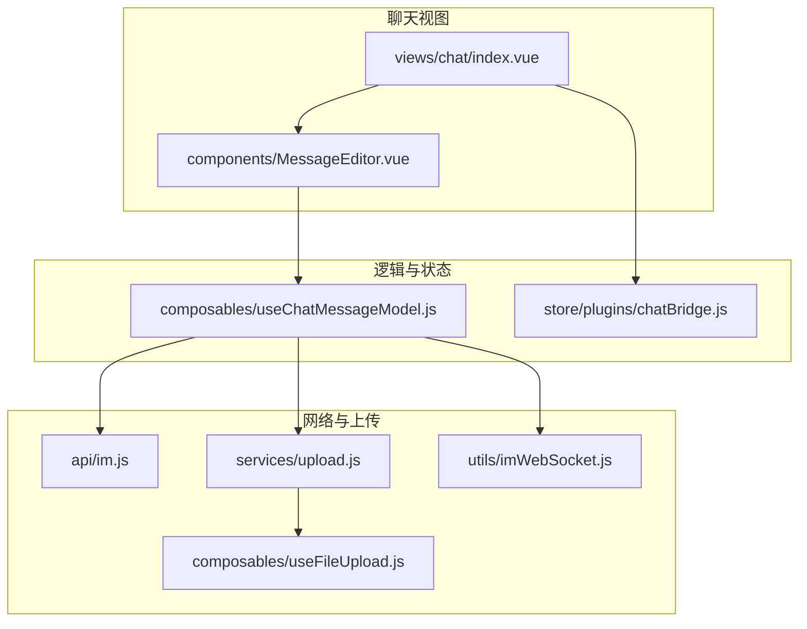
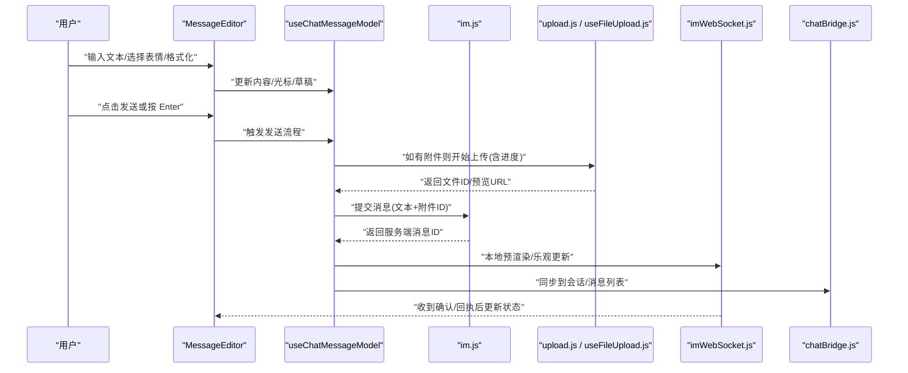
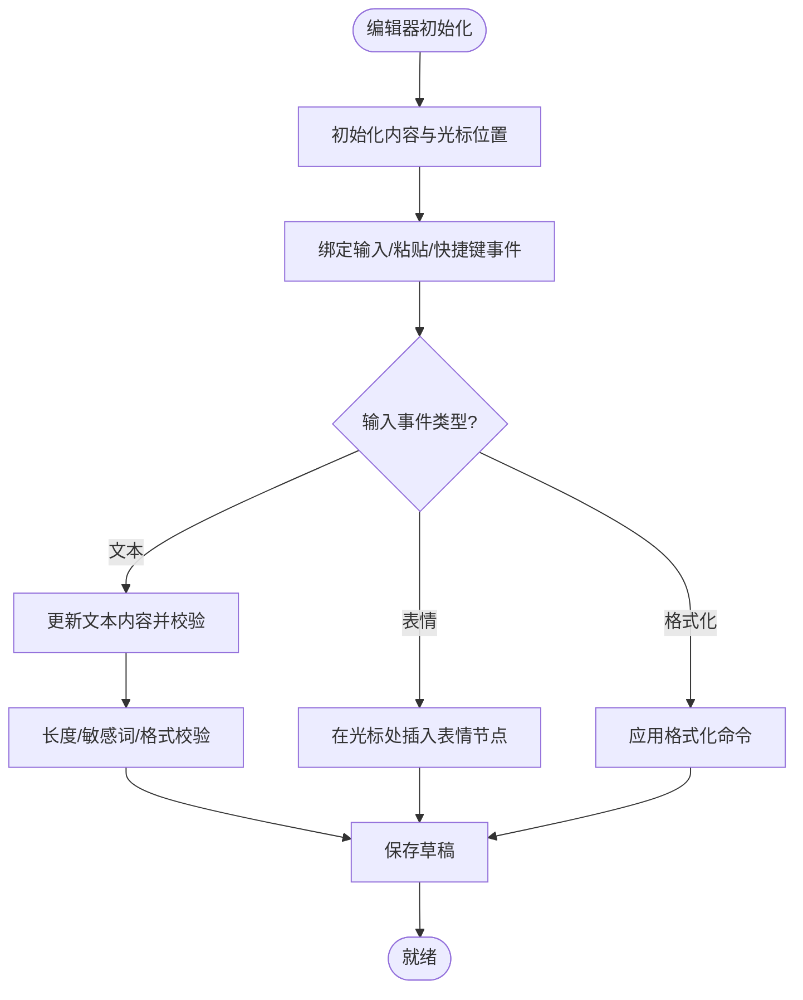
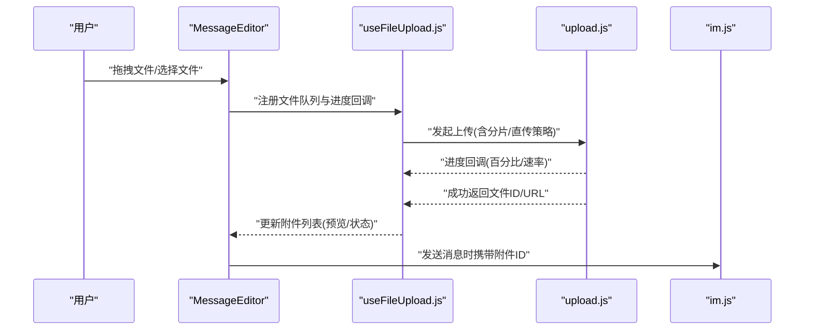
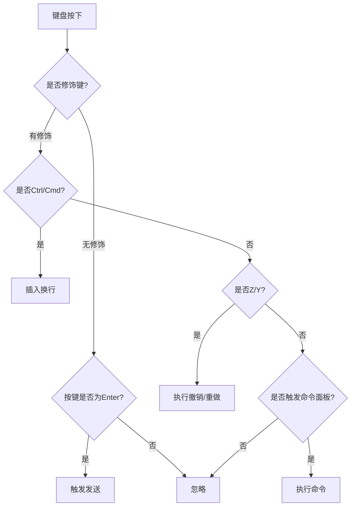
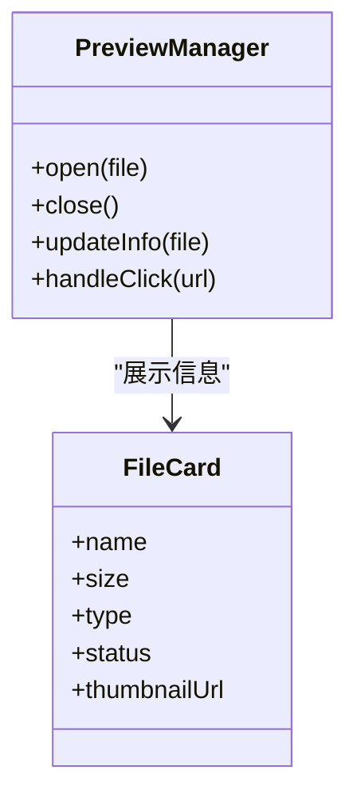
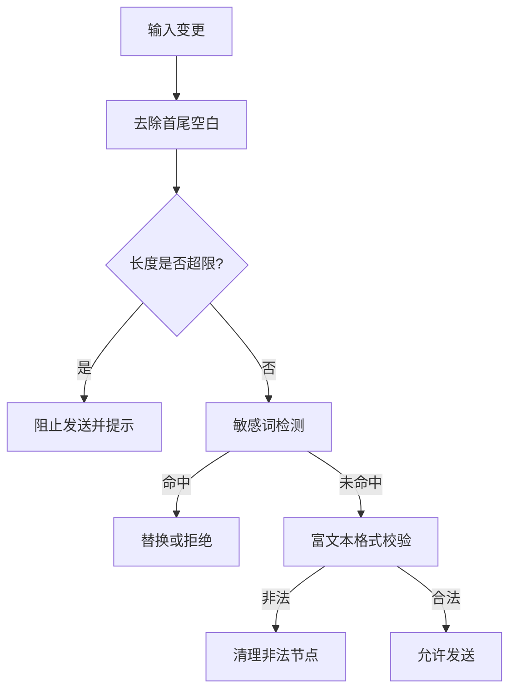
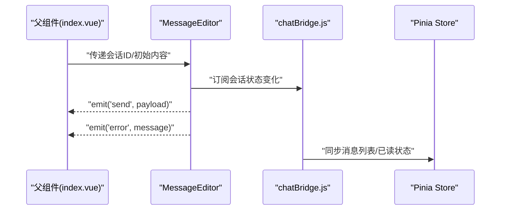
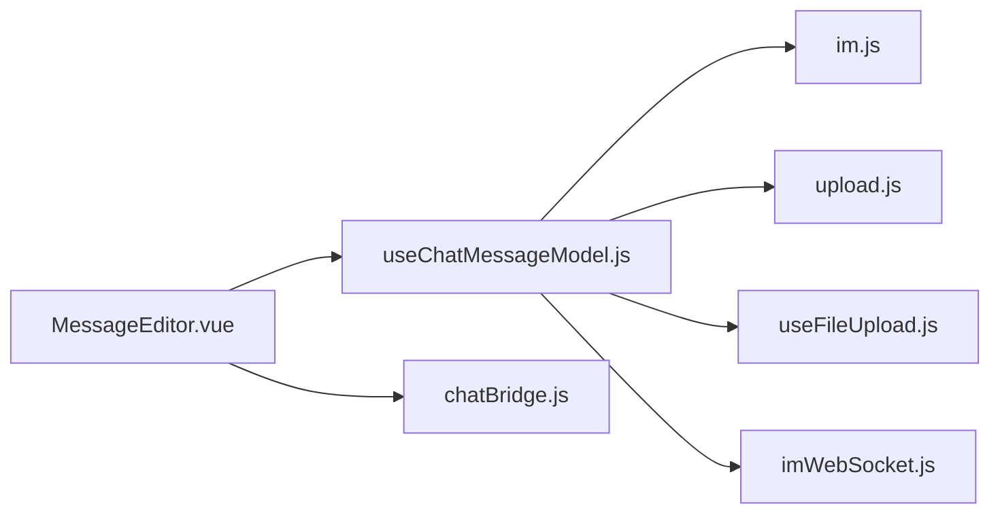

# 消息编辑器组件

<cite>
**本文引用的文件**   
- [MessageEditor.vue](file://ZXYZdatabaseFront/src/views/chat/components/MessageEditor.vue)
- [useChatMessageModel.js](file://ZXYZdatabaseFront/src/views/chat/composables/useChatMessageModel.js)
- [im.js](file://ZXYZdatabaseFront/src/api/im.js)
- [upload.js](file://ZXYZdatabaseFront/src/services/upload.js)
- [useFileUpload.js](file://ZXYZdatabaseFront/src/composables/useFileUpload.js)
- [messageStatus.js](file://ZXYZdatabaseFront/src/constants/messageStatus.js)
- [imWebSocket.js](file://ZXYZdatabaseFront/src/utils/imWebSocket.js)
- [chatBridge.js](file://ZXYZdatabaseFront/src/store/plugins/chatBridge.js)
- [index.vue](file://ZXYZdatabaseFront/src/views/chat/index.vue)
</cite>

## 目录
1. [简介](#简介)
2. [项目结构](#项目结构)
3. [核心组件](#核心组件)
4. [架构总览](#架构总览)
5. [详细组件分析](#详细组件分析)
6. [依赖关系分析](#依赖关系分析)
7. [性能考量](#性能考量)
8. [故障排查指南](#故障排查指南)
9. [结论](#结论)
10. [附录](#附录)

## 简介
本文件为 ZXYZ 聊天应用的消息编辑器组件（MessageEditor）开发文档，聚焦富文本编辑、表情符号插入、格式化选项、文件上传（拖拽、进度、错误处理与取消）、快捷键支持（Enter 发送、Ctrl+Enter 换行、撤销重做、命令面板）、预览能力（图片预览、文件信息展示、链接跳转）、输入验证（长度限制、敏感词过滤、格式检查）、集成方式（数据绑定、事件处理、状态同步）、样式定制（主题切换、字体设置、布局调整）以及移动端适配（软键盘处理、手势支持与触摸优化）。

## 项目结构
消息编辑器位于前端聊天视图的 components 目录下，并通过 composables 提供状态与行为封装，API 调用通过 im.js 暴露，文件上传由 upload.js 与 useFileUpload.js 协同完成，实时通信依赖 imWebSocket.js，状态桥接使用 chatBridge.js。

图表来源
- [MessageEditor.vue](file://ZXYZdatabaseFront/src/views/chat/components/MessageEditor.vue)
- [useChatMessageModel.js](file://ZXYZdatabaseFront/src/views/chat/composables/useChatMessageModel.js)
- [im.js](file://ZXYZdatabaseFront/src/api/im.js)
- [upload.js](file://ZXYZdatabaseFront/src/services/upload.js)
- [useFileUpload.js](file://ZXYZdatabaseFront/src/composables/useFileUpload.js)
- [imWebSocket.js](file://ZXYZdatabaseFront/src/utils/imWebSocket.js)
- [chatBridge.js](file://ZXYZdatabaseFront/src/store/plugins/chatBridge.js)
- [index.vue](file://ZXYZdatabaseFront/src/views/chat/index.vue)

章节来源
- [MessageEditor.vue](file://ZXYZdatabaseFront/src/views/chat/components/MessageEditor.vue)
- [useChatMessageModel.js](file://ZXYZdatabaseFront/src/views/chat/composables/useChatMessageModel.js)
- [im.js](file://ZXYZdatabaseFront/src/api/im.js)
- [upload.js](file://ZXYZdatabaseFront/src/services/upload.js)
- [useFileUpload.js](file://ZXYZdatabaseFront/src/composables/useFileUpload.js)
- [imWebSocket.js](file://ZXYZdatabaseFront/src/utils/imWebSocket.js)
- [chatBridge.js](file://ZXYZdatabaseFront/src/store/plugins/chatBridge.js)
- [index.vue](file://ZXYZdatabaseFront/src/views/chat/index.vue)

## 核心组件
- MessageEditor：负责富文本编辑区、工具栏（粗体/斜体等）、表情面板、附件上传入口、快捷键监听、预览弹窗与输入校验提示。
- useChatMessageModel：封装编辑器内容、光标位置、草稿持久化、发送流程、撤销/重做栈、命令面板触发与执行。
- API 层（im.js）：统一发送消息接口，包含文本、富文本片段、附件引用等。
- 上传服务（upload.js + useFileUpload.js）：封装分片/直传、进度回调、错误重试、取消上传、生成可预览链接。
- WebSocket（imWebSocket.js）：消息推送、已读回执、在线状态等。
- 状态桥接（chatBridge.js）：将编辑器状态与 Pinia store 中的会话/消息列表进行双向同步。

章节来源
- [MessageEditor.vue](file://ZXYZdatabaseFront/src/views/chat/components/MessageEditor.vue)
- [useChatMessageModel.js](file://ZXYZdatabaseFront/src/views/chat/composables/useChatMessageModel.js)
- [im.js](file://ZXYZdatabaseFront/src/api/im.js)
- [upload.js](file://ZXYZdatabaseFront/src/services/upload.js)
- [useFileUpload.js](file://ZXYZdatabaseFront/src/composables/useFileUpload.js)
- [imWebSocket.js](file://ZXYZdatabaseFront/src/utils/imWebSocket.js)
- [chatBridge.js](file://ZXYZdatabaseFront/src/store/plugins/chatBridge.js)

## 架构总览
消息编辑器采用“视图-组合式逻辑-服务-基础设施”的分层模式：
- 视图层：MessageEditor 渲染 UI，响应交互。
- 组合式层：useChatMessageModel 管理编辑器状态机与业务流程。
- 服务层：im.js 负责 HTTP 请求；upload.js/useFileUpload.js 负责文件上传生命周期。
- 基础设施层：imWebSocket.js 提供实时通道；chatBridge.js 桥接 Store。

图表来源
- [MessageEditor.vue](file://ZXYZdatabaseFront/src/views/chat/components/MessageEditor.vue)
- [useChatMessageModel.js](file://ZXYZdatabaseFront/src/views/chat/composables/useChatMessageModel.js)
- [im.js](file://ZXYZdatabaseFront/src/api/im.js)
- [upload.js](file://ZXYZdatabaseFront/src/services/upload.js)
- [useFileUpload.js](file://ZXYZdatabaseFront/src/composables/useFileUpload.js)
- [imWebSocket.js](file://ZXYZdatabaseFront/src/utils/imWebSocket.js)
- [chatBridge.js](file://ZXYZdatabaseFront/src/store/plugins/chatBridge.js)

## 详细组件分析

### 富文本编辑与格式化
- 基础文本输入：支持多行输入、自动高度扩展、粘贴富文本清洗。
- 表情符号插入：打开表情面板，选择后在光标处插入占位符或渲染节点。
- 格式化选项：粗体、斜体、下划线、代码块、有序/无序列表等，通过命令模式统一处理。
- 撤销/重做：维护操作历史栈，支持 Ctrl/Cmd+Z/Y。

图表来源
- [MessageEditor.vue](file://ZXYZdatabaseFront/src/views/chat/components/MessageEditor.vue)
- [useChatMessageModel.js](file://ZXYZdatabaseFront/src/views/chat/composables/useChatMessageModel.js)

章节来源
- [MessageEditor.vue](file://ZXYZdatabaseFront/src/views/chat/components/MessageEditor.vue)
- [useChatMessageModel.js](file://ZXYZdatabaseFront/src/views/chat/composables/useChatMessageModel.js)

### 文件上传功能
- 拖拽上传：支持拖拽文件到编辑器区域，显示拖拽高亮与提示信息。
- 进度显示：上传过程中实时更新进度条与百分比。
- 错误处理：网络异常、大小超限、类型不支持等错误提示与重试。
- 取消操作：中断上传并清理临时状态。
- 预览：图片缩略图、文件名/大小/类型展示，点击可跳转预览。

图表来源
- [MessageEditor.vue](file://ZXYZdatabaseFront/src/views/chat/components/MessageEditor.vue)
- [useFileUpload.js](file://ZXYZdatabaseFront/src/composables/useFileUpload.js)
- [upload.js](file://ZXYZdatabaseFront/src/services/upload.js)
- [im.js](file://ZXYZdatabaseFront/src/api/im.js)

章节来源
- [MessageEditor.vue](file://ZXYZdatabaseFront/src/views/chat/components/MessageEditor.vue)
- [useFileUpload.js](file://ZXYZdatabaseFront/src/composables/useFileUpload.js)
- [upload.js](file://ZXYZdatabaseFront/src/services/upload.js)
- [im.js](file://ZXYZdatabaseFront/src/api/im.js)

### 快捷键支持
- Enter 发送：默认回车发送消息。
- Ctrl/Cmd+Enter 换行：在编辑器内插入换行而不发送。
- 撤销/重做：Ctrl/Cmd+Z/Y。
- 命令面板：触发命令面板（如 /emoji、/bold），快速插入格式化或表情。

图表来源
- [MessageEditor.vue](file://ZXYZdatabaseFront/src/views/chat/components/MessageEditor.vue)
- [useChatMessageModel.js](file://ZXYZdatabaseFront/src/views/chat/composables/useChatMessageModel.js)

章节来源
- [MessageEditor.vue](file://ZXYZdatabaseFront/src/views/chat/components/MessageEditor.vue)
- [useChatMessageModel.js](file://ZXYZdatabaseFront/src/views/chat/composables/useChatMessageModel.js)

### 预览功能
- 图片预览：点击缩略图打开大图预览，支持缩放与关闭。
- 文件信息展示：文件名、大小、类型、上传状态。
- 链接跳转：外部链接在新窗口打开，内部路由跳转。

图表来源
- [MessageEditor.vue](file://ZXYZdatabaseFront/src/views/chat/components/MessageEditor.vue)

章节来源
- [MessageEditor.vue](file://ZXYZdatabaseFront/src/views/chat/components/MessageEditor.vue)

### 输入验证机制
- 长度限制：最大字符数限制，超出时禁用发送并提示。
- 敏感词过滤：本地或远程过滤，命中后替换或拒绝发送。
- 格式检查：富文本节点合法性校验，非法节点移除或警告。

图表来源
- [useChatMessageModel.js](file://ZXYZdatabaseFront/src/views/chat/composables/useChatMessageModel.js)

章节来源
- [useChatMessageModel.js](file://ZXYZdatabaseFront/src/views/chat/composables/useChatMessageModel.js)

### 集成指南
- 数据绑定：通过 props 传入当前会话上下文与初始值，内部维护草稿与发送状态。
- 事件处理：对外暴露 send、clear、error、attachmentChange 等事件。
- 状态同步：通过 chatBridge 将编辑器状态与 store 中的会话/消息列表同步，确保 UI 一致性。

图表来源
- [MessageEditor.vue](file://ZXYZdatabaseFront/src/views/chat/components/MessageEditor.vue)
- [chatBridge.js](file://ZXYZdatabaseFront/src/store/plugins/chatBridge.js)
- [index.vue](file://ZXYZdatabaseFront/src/views/chat/index.vue)

章节来源
- [MessageEditor.vue](file://ZXYZdatabaseFront/src/views/chat/components/MessageEditor.vue)
- [chatBridge.js](file://ZXYZdatabaseFront/src/store/plugins/chatBridge.js)
- [index.vue](file://ZXYZdatabaseFront/src/views/chat/index.vue)

### 样式定制
- 主题切换：通过 CSS 变量或主题类名切换明暗主题。
- 字体设置：支持自定义字体族、字号、行高。
- 布局调整：编辑器宽度、工具栏位置、附件卡片布局可配置。

章节来源
- [MessageEditor.vue](file://ZXYZdatabaseFront/src/views/chat/components/MessageEditor.vue)

### 移动端适配
- 软键盘处理：输入框自适应高度，避免被键盘遮挡。
- 手势支持：长按复制、滑动删除草稿、捏合缩放预览。
- 触摸优化：增大点击热区、延迟点击以区分滚动与点击。

章节来源
- [MessageEditor.vue](file://ZXYZdatabaseFront/src/views/chat/components/MessageEditor.vue)

## 依赖关系分析
- MessageEditor 依赖 useChatMessageModel 管理编辑器状态与发送流程。
- useChatMessageModel 依赖 im.js 发送消息、upload.js/useFileUpload.js 处理附件、imWebSocket.js 接收实时状态。
- chatBridge.js 作为中间件将编辑器状态与 Pinia store 同步。

图表来源
- [MessageEditor.vue](file://ZXYZdatabaseFront/src/views/chat/components/MessageEditor.vue)
- [useChatMessageModel.js](file://ZXYZdatabaseFront/src/views/chat/composables/useChatMessageModel.js)
- [im.js](file://ZXYZdatabaseFront/src/api/im.js)
- [upload.js](file://ZXYZdatabaseFront/src/services/upload.js)
- [useFileUpload.js](file://ZXYZdatabaseFront/src/composables/useFileUpload.js)
- [imWebSocket.js](file://ZXYZdatabaseFront/src/utils/imWebSocket.js)
- [chatBridge.js](file://ZXYZdatabaseFront/src/store/plugins/chatBridge.js)

章节来源
- [MessageEditor.vue](file://ZXYZdatabaseFront/src/views/chat/components/MessageEditor.vue)
- [useChatMessageModel.js](file://ZXYZdatabaseFront/src/views/chat/composables/useChatMessageModel.js)
- [im.js](file://ZXYZdatabaseFront/src/api/im.js)
- [upload.js](file://ZXYZdatabaseFront/src/services/upload.js)
- [useFileUpload.js](file://ZXYZdatabaseFront/src/composables/useFileUpload.js)
- [imWebSocket.js](file://ZXYZdatabaseFront/src/utils/imWebSocket.js)
- [chatBridge.js](file://ZXYZdatabaseFront/src/store/plugins/chatBridge.js)

## 性能考量
- 虚拟滚动与懒加载：长消息列表使用虚拟滚动减少 DOM 压力。
- 防抖与节流：输入与搜索防抖，上传进度节流更新。
- 增量更新：仅更新变化的节点，避免全量重渲染。
- 资源优化：图片压缩、WebP 格式、CDN 缓存。

[本节为通用指导，不直接分析具体文件]

## 故障排查指南
- 发送失败：检查 im.js 的错误码与重试策略，查看 WebSocket 连接状态。
- 上传中断：确认 useFileUpload.js 的取消逻辑与进度回调是否正常。
- 预览异常：检查文件 URL 有效性、跨域策略与 MIME 类型。
- 输入法冲突：在移动端检查软键盘事件与焦点管理。

章节来源
- [im.js](file://ZXYZdatabaseFront/src/api/im.js)
- [upload.js](file://ZXYZdatabaseFront/src/services/upload.js)
- [useFileUpload.js](file://ZXYZdatabaseFront/src/composables/useFileUpload.js)
- [imWebSocket.js](file://ZXYZdatabaseFront/src/utils/imWebSocket.js)

## 结论
MessageEditor 组件通过清晰的层次结构与组合式逻辑封装，提供了完整的富文本编辑、附件上传、快捷键与预览能力，并与实时通信和状态管理无缝集成。遵循本文档的集成与定制指南，可在不同场景下灵活扩展与维护。

[本节为总结性内容，不直接分析具体文件]

## 附录
- 常用快捷键速查：Enter 发送、Ctrl/Cmd+Enter 换行、Ctrl/Cmd+Z/Y 撤销重做。
- 上传限制建议：单文件大小、并发数、超时时间、重试次数。
- 主题变量清单：颜色、字体、间距、圆角等。

[本节为补充信息，不直接分析具体文件]