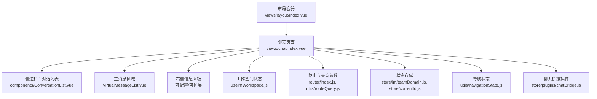
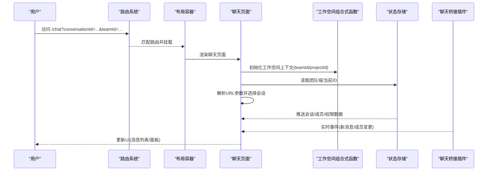
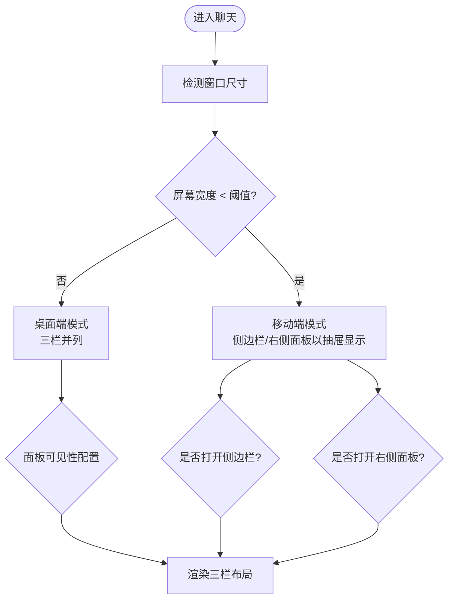
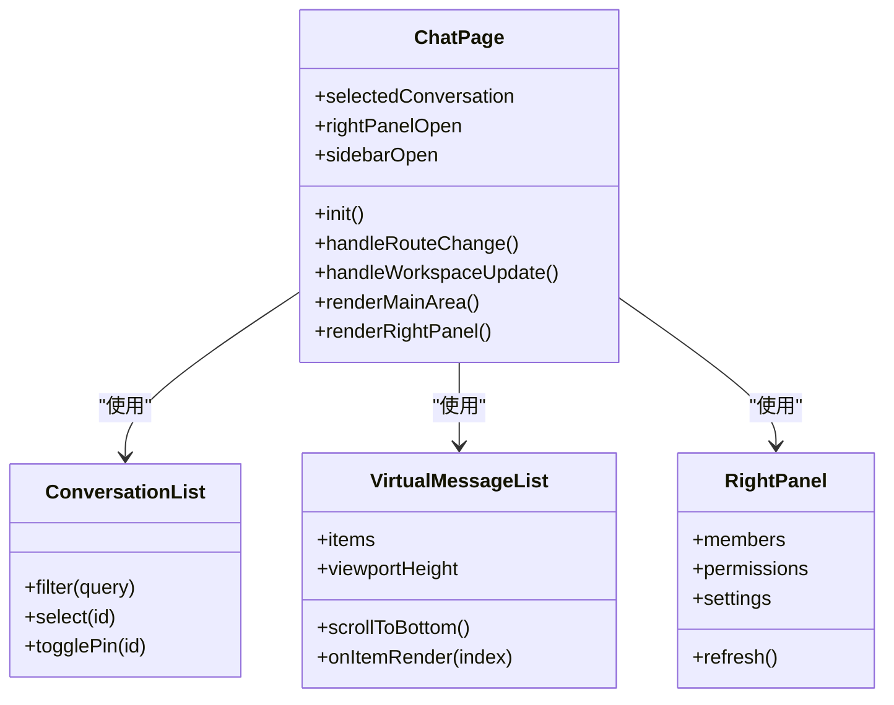
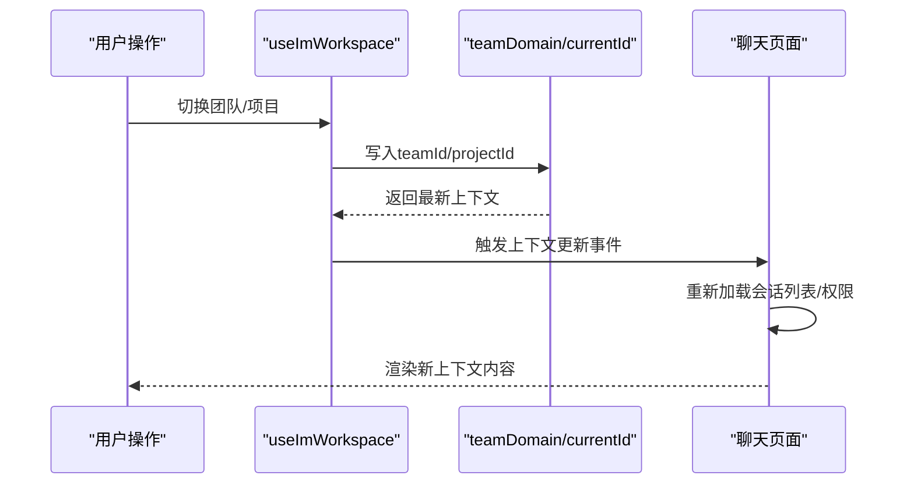
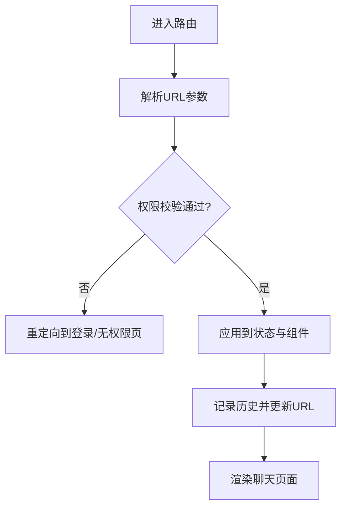
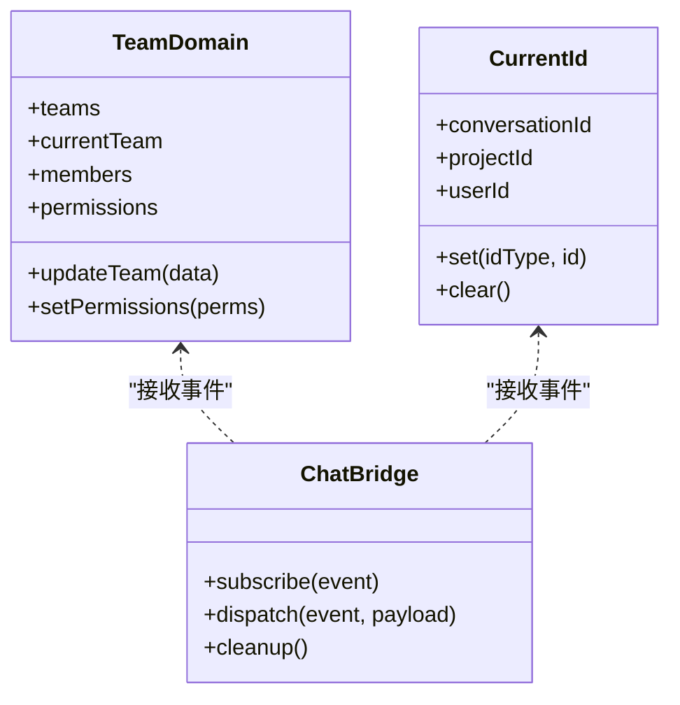
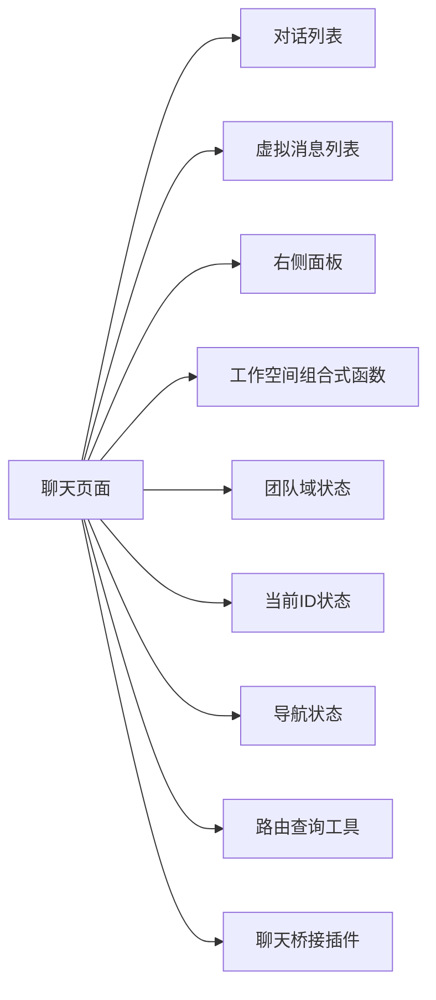

# 聊天布局容器

<cite>
**本文引用的文件**   
- [ZXYZdatabaseFront/src/views/layout/index.vue](file://ZXYZdatabaseFront/src/views/layout/index.vue)
- [ZXYZdatabaseFront/src/views/chat/index.vue](file://ZXYZdatabaseFront/src/views/chat/index.vue)
- [ZXYZdatabaseFront/src/views/chat/components/ConversationList.vue](file://ZXYZdatabaseFront/src/views/chat/components/ConversationList.vue)
- [ZXYZdatabaseFront/src/views/chat/components/VirtualMessageList.vue](file://ZXYZdatabaseFront/src/views/chat/components/VirtualMessageList.vue)
- [ZXYZdatabaseFront/src/views/chat/composables/useImWorkspace.js](file://ZXYZdatabaseFront/src/views/chat/composables/useImWorkspace.js)
- [ZXYZdatabaseFront/src/router/index.js](file://ZXYZdatabaseFront/src/router/index.js)
- [ZXYZdatabaseFront/src/store/im/teamDomain.js](file://ZXYZdatabaseFront/src/store/im/teamDomain.js)
- [ZXYZdatabaseFront/src/store/currentId.js](file://ZXYZdatabaseFront/src/store/currentId.js)
- [ZXYZdatabaseFront/src/utils/navigationState.js](file://ZXYZdatabaseFront/src/utils/navigationState.js)
- [ZXYZdatabaseFront/src/utils/routeQuery.js](file://ZXYZdatabaseFront/src/utils/routeQuery.js)
- [ZXYZdatabaseFront/src/store/plugins/chatBridge.js](file://ZXYZdatabaseFront/src/store/plugins/chatBridge.js)
</cite>

## 目录
1. [简介](#简介)
2. [项目结构](#项目结构)
3. [核心组件](#核心组件)
4. [架构总览](#架构总览)
5. [详细组件分析](#详细组件分析)
6. [依赖关系分析](#依赖关系分析)
7. [性能考量](#性能考量)
8. [故障排查指南](#故障排查指南)
9. [结论](#结论)
10. [附录](#附录)

## 简介
本文件面向 ZXYZ 聊天应用的“布局容器”与主聊天界面，系统性说明整体布局结构（侧边栏对话列表、主消息区域、右侧信息面板）、响应式适配、状态管理（折叠展开、窗口尺寸适配、多设备支持）、路由集成（URL 参数解析、历史记录、导航守卫）、工作空间切换（团队切换、项目上下文、用户状态同步），以及性能优化策略（懒加载、虚拟滚动、内存管理）和扩展开发指南（新增面板、工具栏定制、功能模块集成）。

## 项目结构
前端采用 Vue 3 Composition API + Pinia 状态管理。聊天布局由顶层布局容器承载，内部包含：
- 左侧：对话列表（可折叠）
- 中间：消息区域（含输入区与消息列表）
- 右侧：信息面板（成员、设置等，可折叠）

图表来源
- [ZXYZdatabaseFront/src/views/layout/index.vue](file://ZXYZdatabaseFront/src/views/layout/index.vue)
- [ZXYZdatabaseFront/src/views/chat/index.vue](file://ZXYZdatabaseFront/src/views/chat/index.vue)
- [ZXYZdatabaseFront/src/views/chat/components/ConversationList.vue](file://ZXYZdatabaseFront/src/views/chat/components/ConversationList.vue)
- [ZXYZdatabaseFront/src/views/chat/components/VirtualMessageList.vue](file://ZXYZdatabaseFront/src/views/chat/components/VirtualMessageList.vue)
- [ZXYZdatabaseFront/src/views/chat/composables/useImWorkspace.js](file://ZXYZdatabaseFront/src/views/chat/composables/useImWorkspace.js)
- [ZXYZdatabaseFront/src/router/index.js](file://ZXYZdatabaseFront/src/router/index.js)
- [ZXYZdatabaseFront/src/store/im/teamDomain.js](file://ZXYZdatabaseFront/src/store/im/teamDomain.js)
- [ZXYZdatabaseFront/src/store/currentId.js](file://ZXYZdatabaseFront/src/store/currentId.js)
- [ZXYZdatabaseFront/src/utils/navigationState.js](file://ZXYZdatabaseFront/src/utils/navigationState.js)
- [ZXYZdatabaseFront/src/utils/routeQuery.js](file://ZXYZdatabaseFront/src/utils/routeQuery.js)
- [ZXYZdatabaseFront/src/store/plugins/chatBridge.js](file://ZXYZdatabaseFront/src/store/plugins/chatBridge.js)

章节来源
- [ZXYZdatabaseFront/src/views/layout/index.vue](file://ZXYZdatabaseFront/src/views/layout/index.vue)
- [ZXYZdatabaseFront/src/views/chat/index.vue](file://ZXYZdatabaseFront/src/views/chat/index.vue)

## 核心组件
- 布局容器：负责三栏布局、响应式断点控制、面板折叠/展开状态、全屏与移动端抽屉模式。
- 聊天页面：组织侧边栏、主消息区、右侧面板的渲染与交互；订阅工作空间与路由变化。
- 对话列表：展示会话条目、搜索过滤、选中态、未读标记、置顶逻辑。
- 虚拟消息列表：基于可视区域渲染消息项，支持长列表滚动性能优化。
- 工作空间组合式函数：维护当前团队/项目上下文、用户状态同步、跨组件共享。
- 路由与查询：解析 URL 参数（如 conversationId、teamId、projectId），驱动视图与状态更新。
- 状态存储：团队域、当前 ID、导航历史、聊天桥接事件。

章节来源
- [ZXYZdatabaseFront/src/views/chat/index.vue](file://ZXYZdatabaseFront/src/views/chat/index.vue)
- [ZXYZdatabaseFront/src/views/chat/components/ConversationList.vue](file://ZXYZdatabaseFront/src/views/chat/components/ConversationList.vue)
- [ZXYZdatabaseFront/src/views/chat/components/VirtualMessageList.vue](file://ZXYZdatabaseFront/src/views/chat/components/VirtualMessageList.vue)
- [ZXYZdatabaseFront/src/views/chat/composables/useImWorkspace.js](file://ZXYZdatabaseFront/src/views/chat/composables/useImWorkspace.js)
- [ZXYZdatabaseFront/src/utils/routeQuery.js](file://ZXYZdatabaseFront/src/utils/routeQuery.js)
- [ZXYZdatabaseFront/src/store/im/teamDomain.js](file://ZXYZdatabaseFront/src/store/im/teamDomain.js)
- [ZXYZdatabaseFront/src/store/currentId.js](file://ZXYZdatabaseFront/src/store/currentId.js)
- [ZXYZdatabaseFront/src/utils/navigationState.js](file://ZXYZdatabaseFront/src/utils/navigationState.js)
- [ZXYZdatabaseFront/src/store/plugins/chatBridge.js](file://ZXYZdatabaseFront/src/store/plugins/chatBridge.js)

## 架构总览
聊天布局容器通过“布局容器 → 聊天页面 → 子组件/组合式函数/Store/路由”的分层组织，实现高内聚低耦合。关键数据流：
- 路由变更触发 URL 参数解析，驱动选择会话与工作空间上下文。
- 工作空间组合式函数统一维护团队/项目/用户状态，供各组件订阅。
- 状态存储集中管理团队域、当前 ID、导航历史等。
- 聊天桥接插件在 Store 层桥接 WebSocket/后端事件到 UI 状态。

图表来源
- [ZXYZdatabaseFront/src/router/index.js](file://ZXYZdatabaseFront/src/router/index.js)
- [ZXYZdatabaseFront/src/views/layout/index.vue](file://ZXYZdatabaseFront/src/views/layout/index.vue)
- [ZXYZdatabaseFront/src/views/chat/index.vue](file://ZXYZdatabaseFront/src/views/chat/index.vue)
- [ZXYZdatabaseFront/src/views/chat/composables/useImWorkspace.js](file://ZXYZdatabaseFront/src/views/chat/composables/useImWorkspace.js)
- [ZXYZdatabaseFront/src/store/im/teamDomain.js](file://ZXYZdatabaseFront/src/store/im/teamDomain.js)
- [ZXYZdatabaseFront/src/store/plugins/chatBridge.js](file://ZXYZdatabaseFront/src/store/plugins/chatBridge.js)

## 详细组件分析

### 布局容器（三栏布局与响应式）
- 布局结构：左侧对话列表、中间消息区、右侧信息面板。
- 响应式策略：根据窗口宽度自动切换为单栏/双栏/三栏；移动端将侧边栏与右侧面板以抽屉形式呈现。
- 折叠/展开：提供按钮或手势控制面板显隐，状态持久化至本地存储或全局状态。
- 键盘与无障碍：支持 Tab 导航、Esc 关闭抽屉、焦点管理。

章节来源
- [ZXYZdatabaseFront/src/views/layout/index.vue](file://ZXYZdatabaseFront/src/views/layout/index.vue)

### 聊天页面（主消息区域与交互编排）
- 职责：协调侧边栏、消息区、右侧面板的数据与交互；监听路由与工作空间变化。
- 消息区：集成虚拟滚动列表、输入编辑器、发送/撤回/转发等操作。
- 右侧面板：展示成员列表、权限、设置等，支持动态加载与缓存。
- 错误处理：网络异常、权限不足、数据缺失时的降级与提示。

图表来源
- [ZXYZdatabaseFront/src/views/chat/index.vue](file://ZXYZdatabaseFront/src/views/chat/index.vue)
- [ZXYZdatabaseFront/src/views/chat/components/ConversationList.vue](file://ZXYZdatabaseFront/src/views/chat/components/ConversationList.vue)
- [ZXYZdatabaseFront/src/views/chat/components/VirtualMessageList.vue](file://ZXYZdatabaseFront/src/views/chat/components/VirtualMessageList.vue)

章节来源
- [ZXYZdatabaseFront/src/views/chat/index.vue](file://ZXYZdatabaseFront/src/views/chat/index.vue)

### 工作空间切换（团队/项目上下文与用户状态同步）
- 上下文模型：teamId、projectId、userId、role、permissions。
- 切换流程：选择团队/项目 → 校验权限 → 更新 Store → 刷新会话列表与消息权限 → 同步用户状态。
- 持久化：将最近使用的团队/项目写入本地存储，下次进入快速恢复。
- 冲突处理：并发切换时保证幂等性与最终一致性。

图表来源
- [ZXYZdatabaseFront/src/views/chat/composables/useImWorkspace.js](file://ZXYZdatabaseFront/src/views/chat/composables/useImWorkspace.js)
- [ZXYZdatabaseFront/src/store/im/teamDomain.js](file://ZXYZdatabaseFront/src/store/im/teamDomain.js)
- [ZXYZdatabaseFront/src/store/currentId.js](file://ZXYZdatabaseFront/src/store/currentId.js)
- [ZXYZdatabaseFront/src/views/chat/index.vue](file://ZXYZdatabaseFront/src/views/chat/index.vue)

章节来源
- [ZXYZdatabaseFront/src/views/chat/composables/useImWorkspace.js](file://ZXYZdatabaseFront/src/views/chat/composables/useImWorkspace.js)
- [ZXYZdatabaseFront/src/store/im/teamDomain.js](file://ZXYZdatabaseFront/src/store/im/teamDomain.js)
- [ZXYZdatabaseFront/src/store/currentId.js](file://ZXYZdatabaseFront/src/store/currentId.js)

### 路由集成（URL 参数解析、历史记录、导航守卫）
- 参数解析：从 query/hash 中解析 conversationId、teamId、projectId、tab 等，映射到组件 props/state。
- 历史记录：push/replace 路由时保留上下文，支持前进后退恢复。
- 导航守卫：鉴权检查、团队/项目权限校验、未登录重定向。

图表来源
- [ZXYZdatabaseFront/src/router/index.js](file://ZXYZdatabaseFront/src/router/index.js)
- [ZXYZdatabaseFront/src/utils/routeQuery.js](file://ZXYZdatabaseFront/src/utils/routeQuery.js)
- [ZXYZdatabaseFront/src/utils/navigationState.js](file://ZXYZdatabaseFront/src/utils/navigationState.js)

章节来源
- [ZXYZdatabaseFront/src/router/index.js](file://ZXYZdatabaseFront/src/router/index.js)
- [ZXYZdatabaseFront/src/utils/routeQuery.js](file://ZXYZdatabaseFront/src/utils/routeQuery.js)
- [ZXYZdatabaseFront/src/utils/navigationState.js](file://ZXYZdatabaseFront/src/utils/navigationState.js)

### 状态管理与桥接（Store 与事件）
- teamDomain：团队元数据、成员、权限、配置。
- currentId：当前选中的会话/项目/用户 ID。
- chatBridge：桥接后端事件（WebSocket/HTTP）到 Store，确保 UI 一致。
- 事件总线：组件间通信与副作用清理。

图表来源
- [ZXYZdatabaseFront/src/store/im/teamDomain.js](file://ZXYZdatabaseFront/src/store/im/teamDomain.js)
- [ZXYZdatabaseFront/src/store/currentId.js](file://ZXYZdatabaseFront/src/store/currentId.js)
- [ZXYZdatabaseFront/src/store/plugins/chatBridge.js](file://ZXYZdatabaseFront/src/store/plugins/chatBridge.js)

章节来源
- [ZXYZdatabaseFront/src/store/im/teamDomain.js](file://ZXYZdatabaseFront/src/store/im/teamDomain.js)
- [ZXYZdatabaseFront/src/store/currentId.js](file://ZXYZdatabaseFront/src/store/currentId.js)
- [ZXYZdatabaseFront/src/store/plugins/chatBridge.js](file://ZXYZdatabaseFront/src/store/plugins/chatBridge.js)

## 依赖关系分析
- 组件依赖：聊天页面依赖对话列表、虚拟消息列表、右侧面板与工作空间组合式函数。
- 状态依赖：聊天页面依赖 teamDomain、currentId、navigationState、routeQuery。
- 外部依赖：路由系统、浏览器 API（ResizeObserver、LocalStorage）、WebSocket/HTTP 客户端。

图表来源
- [ZXYZdatabaseFront/src/views/chat/index.vue](file://ZXYZdatabaseFront/src/views/chat/index.vue)
- [ZXYZdatabaseFront/src/views/chat/components/ConversationList.vue](file://ZXYZdatabaseFront/src/views/chat/components/ConversationList.vue)
- [ZXYZdatabaseFront/src/views/chat/components/VirtualMessageList.vue](file://ZXYZdatabaseFront/src/views/chat/components/VirtualMessageList.vue)
- [ZXYZdatabaseFront/src/views/chat/composables/useImWorkspace.js](file://ZXYZdatabaseFront/src/views/chat/composables/useImWorkspace.js)
- [ZXYZdatabaseFront/src/store/im/teamDomain.js](file://ZXYZdatabaseFront/src/store/im/teamDomain.js)
- [ZXYZdatabaseFront/src/store/currentId.js](file://ZXYZdatabaseFront/src/store/currentId.js)
- [ZXYZdatabaseFront/src/utils/navigationState.js](file://ZXYZdatabaseFront/src/utils/navigationState.js)
- [ZXYZdatabaseFront/src/utils/routeQuery.js](file://ZXYZdatabaseFront/src/utils/routeQuery.js)
- [ZXYZdatabaseFront/src/store/plugins/chatBridge.js](file://ZXYZdatabaseFront/src/store/plugins/chatBridge.js)

章节来源
- [ZXYZdatabaseFront/src/views/chat/index.vue](file://ZXYZdatabaseFront/src/views/chat/index.vue)

## 性能考量
- 组件懒加载：路由级与组件级按需加载，减少首屏体积。
- 虚拟滚动：长消息列表仅渲染可视区域项，降低 DOM 压力。
- 内存管理：及时解绑事件监听、取消未完成的请求、清理定时器。
- 缓存策略：会话列表、成员信息、权限数据短期缓存，避免重复请求。
- 防抖节流：搜索、滚动、窗口尺寸变化等高频操作进行节流/防抖。

[本节为通用指导，不直接分析具体文件]

## 故障排查指南
- 路由参数异常：检查 URL 解析逻辑与默认值处理，确认必填参数存在。
- 工作空间切换失败：验证团队/项目权限、Store 更新顺序、事件派发是否正确。
- 消息列表卡顿：确认虚拟滚动配置（项高度、缓冲区大小）、渲染函数开销。
- 面板无法折叠：检查状态绑定与事件监听，确认移动端抽屉模式样式。
- 实时事件丢失：核查 WebSocket 连接状态、重连机制、事件去重。

章节来源
- [ZXYZdatabaseFront/src/utils/routeQuery.js](file://ZXYZdatabaseFront/src/utils/routeQuery.js)
- [ZXYZdatabaseFront/src/views/chat/composables/useImWorkspace.js](file://ZXYZdatabaseFront/src/views/chat/composables/useImWorkspace.js)
- [ZXYZdatabaseFront/src/views/chat/components/VirtualMessageList.vue](file://ZXYZdatabaseFront/src/views/chat/components/VirtualMessageList.vue)
- [ZXYZdatabaseFront/src/store/plugins/chatBridge.js](file://ZXYZdatabaseFront/src/store/plugins/chatBridge.js)

## 结论
聊天布局容器通过清晰的层次结构与状态管理，实现了灵活的三栏布局、响应式适配与高效的消息渲染。结合工作空间切换、路由集成与性能优化策略，可为多设备用户提供一致的聊天体验。扩展新面板与工具栏时，建议遵循现有组合式函数与 Store 模式，保持低耦合与高可维护性。

[本节为总结，不直接分析具体文件]

## 附录
- 配置选项建议：
  - 布局预设：默认三栏、紧凑模式、移动端抽屉开关。
  - 主题设置：明暗主题、字体大小、消息气泡样式。
  - 行为配置：自动滚动到底、未读标记策略、消息过期清理。
- 扩展开发指南：
  - 新增面板：在聊天页面注册面板插槽，定义数据源与渲染逻辑。
  - 工具栏定制：通过配置项注入按钮与菜单，绑定动作回调。
  - 功能模块集成：使用组合式函数封装业务逻辑，通过 Store 暴露状态与事件。

[本节为概念性内容，不直接分析具体文件]