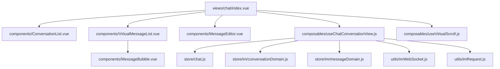
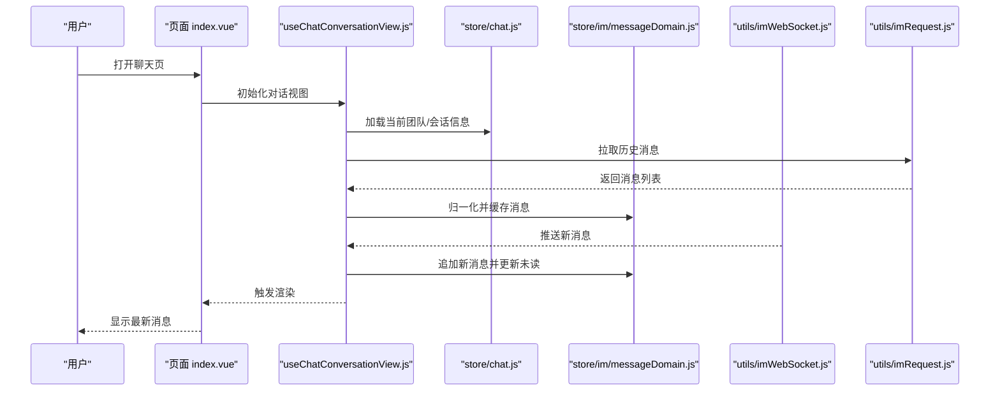
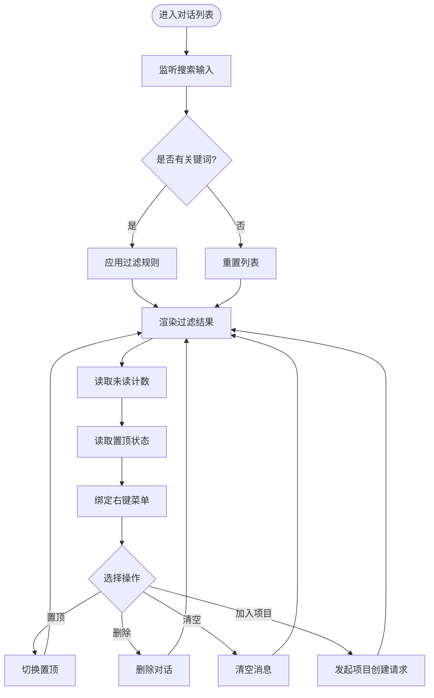
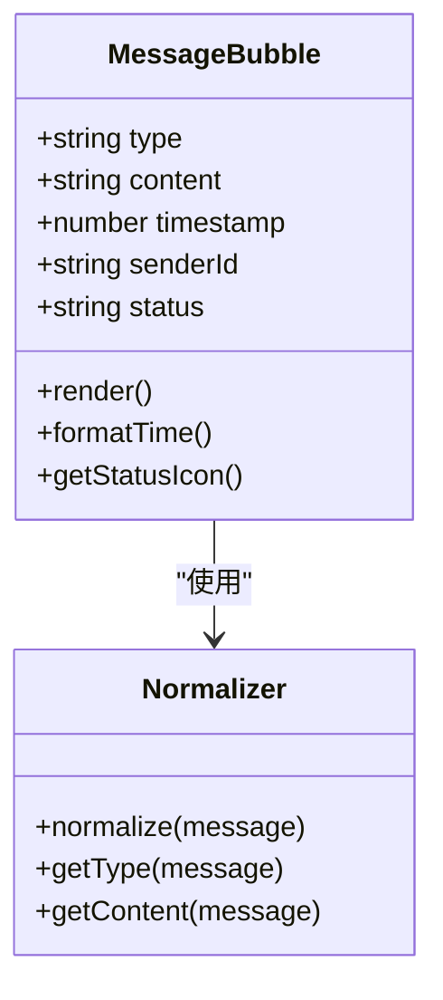
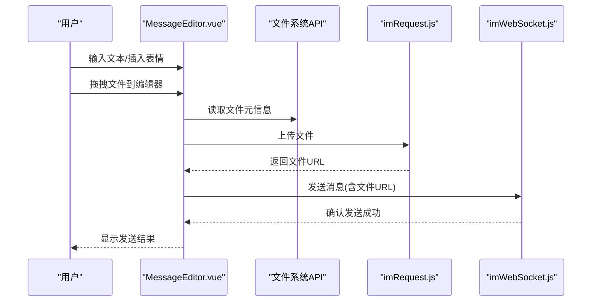
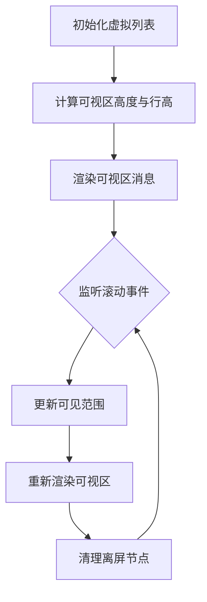
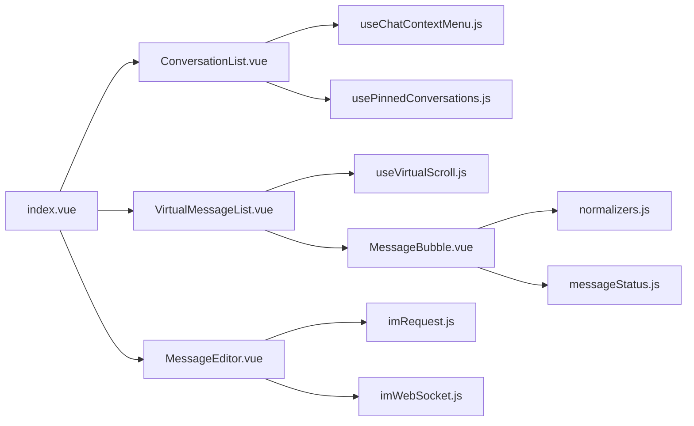

# 聊天界面组件

<cite>
**本文引用的文件**   
- [index.vue](file://ZXYZdatabaseFront/src/views/chat/index.vue)
- [ConversationList.vue](file://ZXYZdatabaseFront/src/views/chat/components/ConversationList.vue)
- [MessageBubble.vue](file://ZXYZdatabaseFront/src/views/chat/components/MessageBubble.vue)
- [MessageEditor.vue](file://ZXYZdatabaseFront/src/views/chat/components/MessageEditor.vue)
- [VirtualMessageList.vue](file://ZXYZdatabaseFront/src/views/chat/components/VirtualMessageList.vue)
- [useChatContextMenu.js](file://ZXYZdatabaseFront/src/views/chat/composables/useChatContextMenu.js)
- [useChatConversationView.js](file://ZXYZdatabaseFront/src/views/chat/composables/useChatConversationView.js)
- [useChatFileCardActions.js](file://ZXYZdatabaseFront/src/views/chat/composables/useChatFileCardActions.js)
- [useChatMembers.js](file://ZXYZdatabaseFront/src/views/chat/composables/useChatMembers.js)
- [useChatMessageModel.js](file://ZXYZdatabaseFront/src/views/chat/composables/useChatMessageModel.js)
- [useChatPageActions.js](file://ZXYZdatabaseFront/src/views/chat/composables/useChatPageActions.js)
- [useChatProjectCreateRequests.js](file://ZXYZdatabaseFront/src/views/chat/composables/useChatProjectCreateRequests.js)
- [useChatVisibilitySync.js](file://ZXYZdatabaseFront/src/views/chat/composables/useChatVisibilitySync.js)
- [usePinnedConversations.js](file://ZXYZdatabaseFront/src/views/chat/composables/usePinnedConversations.js)
- [useVirtualScroll.js](file://ZXYZdatabaseFront/src/views/chat/composables/useVirtualScroll.js)
- [chat.js](file://ZXYZdatabaseFront/src/store/chat.js)
- [conversationDomain.js](file://ZXYZdatabaseFront/src/store/im/conversationDomain.js)
- [messageDomain.js](file://ZXYZdatabaseFront/src/store/im/messageDomain.js)
- [normalizers.js](file://ZXYZdatabaseFront/src/store/im/normalizers.js)
- [imWebSocket.js](file://ZXYZdatabaseFront/src/utils/imWebSocket.js)
- [imRequest.js](file://ZXYZdatabaseFront/src/utils/imRequest.js)
- [conversationTypes.js](file://ZXYZdatabaseFront/src/constants/conversationTypes.js)
- [messageStatus.js](file://ZXYZdatabaseFront/src/constants/messageStatus.js)
</cite>

## 目录
1. [简介](#简介)
2. [项目结构](#项目结构)
3. [核心组件](#核心组件)
4. [架构总览](#架构总览)
5. [详细组件分析](#详细组件分析)
6. [依赖关系分析](#依赖关系分析)
7. [性能考虑](#性能考虑)
8. [故障排查指南](#故障排查指南)
9. [结论](#结论)
10. [附录](#附录)

## 简介
本文件为 ZXYZ 前端聊天界面组件的开发文档，聚焦于主聊天界面的布局与交互、对话列表、消息气泡、编辑器、虚拟滚动优化以及样式定制。文档面向不同技术背景的读者，提供从高层架构到代码级细节的渐进式说明，并附带可操作的示例与排错建议。

## 项目结构
聊天功能位于前端视图 chat 目录下，采用“页面 + 组件 + 组合式函数（composables）+ Pinia Store + 工具库”的分层组织方式：
- 页面入口：views/chat/index.vue 负责整体布局与路由状态管理
- 组件：components 下包含 ConversationList、MessageBubble、MessageEditor、VirtualMessageList 等
- 组合式函数：composables 封装业务逻辑，如上下文菜单、对话视图、消息模型、虚拟滚动等
- 状态管理：store/chat.js 与 store/im/* 领域模块协同维护会话与消息数据
- 工具与协议：utils/imWebSocket.js、utils/imRequest.js 负责实时通信与请求封装
- 常量：constants 定义对话类型、消息状态等枚举

图表来源 
- [index.vue](file://ZXYZdatabaseFront/src/views/chat/index.vue)
- [ConversationList.vue](file://ZXYZdatabaseFront/src/views/chat/components/ConversationList.vue)
- [VirtualMessageList.vue](file://ZXYZdatabaseFront/src/views/chat/components/VirtualMessageList.vue)
- [MessageBubble.vue](file://ZXYZdatabaseFront/src/views/chat/components/MessageBubble.vue)
- [MessageEditor.vue](file://ZXYZdatabaseFront/src/views/chat/components/MessageEditor.vue)
- [useChatConversationView.js](file://ZXYZdatabaseFront/src/views/chat/composables/useChatConversationView.js)
- [useVirtualScroll.js](file://ZXYZdatabaseFront/src/views/chat/composables/useVirtualScroll.js)
- [chat.js](file://ZXYZdatabaseFront/src/store/chat.js)
- [conversationDomain.js](file://ZXYZdatabaseFront/src/store/im/conversationDomain.js)
- [messageDomain.js](file://ZXYZdatabaseFront/src/store/im/messageDomain.js)
- [imWebSocket.js](file://ZXYZdatabaseFront/src/utils/imWebSocket.js)
- [imRequest.js](file://ZXYZdatabaseFront/src/utils/imRequest.js)

章节来源
- [index.vue](file://ZXYZdatabaseFront/src/views/chat/index.vue)
- [conversationTypes.js](file://ZXYZdatabaseFront/src/constants/conversationTypes.js)
- [messageStatus.js](file://ZXYZdatabaseFront/src/constants/messageStatus.js)

## 核心组件
- 主聊天界面布局（index.vue）
  - 响应式三栏：左侧对话列表、中间消息区域、右侧成员/设置抽屉（按需展开）
  - 移动端自适应：小屏隐藏侧边栏，通过抽屉或全屏模式切换
  - 事件总线：监听消息发送、滚动、右键菜单、置顶等操作事件
- ConversationList 组件
  - 搜索过滤：按名称/关键词匹配对话
  - 未读标记：基于消息域计算未读数并高亮显示
  - 置顶功能：支持置顶/取消置顶，排序优先展示置顶项
  - 右键菜单：删除、清空、置顶、加入项目等扩展操作
- MessageBubble 组件
  - 多类型渲染：文本、图片、文件、卡片（项目/分享/文件）
  - 时间戳与头像：显示发送时间与用户头像
  - 状态指示器：发送中、成功、失败等状态图标
- MessageEditor 组件
  - 富文本编辑：支持基础格式与表情插入
  - 文件拖拽上传：拖入文件自动上传并生成预览
  - 快捷键：Enter 发送、Shift+Enter 换行、Ctrl/Cmd+K 插入链接等
- VirtualMessageList 组件
  - 虚拟滚动：仅渲染可视区消息，降低大列表内存占用
  - 滚动体验：平滑滚动、锚点定位、新消息自动滚动到底部

章节来源
- [ConversationList.vue](file://ZXYZdatabaseFront/src/views/chat/components/ConversationList.vue)
- [MessageBubble.vue](file://ZXYZdatabaseFront/src/views/chat/components/MessageBubble.vue)
- [MessageEditor.vue](file://ZXYZdatabaseFront/src/views/chat/components/MessageEditor.vue)
- [VirtualMessageList.vue](file://ZXYZdatabaseFront/src/views/chat/components/VirtualMessageList.vue)

## 架构总览
聊天界面采用“页面编排 + 组合式函数 + 领域 Store + WebSocket/HTTP”的架构：
- 页面编排：index.vue 协调各组件与组合式函数
- 组合式函数：封装具体业务逻辑（对话视图、消息模型、虚拟滚动、上下文菜单等）
- 领域 Store：conversationDomain 与 messageDomain 分别管理对话与消息状态
- 通信层：imWebSocket.js 处理实时消息推送，imRequest.js 封装 REST 请求
- 常量与模型：conversationTypes.js、messageStatus.js 统一枚举与状态码

图表来源 
- [index.vue](file://ZXYZdatabaseFront/src/views/chat/index.vue)
- [useChatConversationView.js](file://ZXYZdatabaseFront/src/views/chat/composables/useChatConversationView.js)
- [chat.js](file://ZXYZdatabaseFront/src/store/chat.js)
- [messageDomain.js](file://ZXYZdatabaseFront/src/store/im/messageDomain.js)
- [imWebSocket.js](file://ZXYZdatabaseFront/src/utils/imWebSocket.js)
- [imRequest.js](file://ZXYZdatabaseFront/src/utils/imRequest.js)

## 详细组件分析

### 主聊天界面布局（index.vue）
- 布局策略：使用弹性布局实现左右分栏；移动端通过媒体查询切换为单栏
- 状态同步：通过 useChatConversationView 订阅对话切换、消息更新、未读计数变化
- 事件处理：集中处理发送消息、滚动到底部、右键菜单显示/隐藏
- 可访问性：为关键按钮添加 aria-label，确保键盘导航可用

章节来源
- [index.vue](file://ZXYZdatabaseFront/src/views/chat/index.vue)
- [useChatConversationView.js](file://ZXYZdatabaseFront/src/views/chat/composables/useChatConversationView.js)

### ConversationList 组件
- 搜索过滤：输入框变更时触发过滤逻辑，支持大小写不敏感匹配
- 未读标记：根据 messageDomain 中的未读计数动态渲染角标
- 置顶功能：调用 usePinnedConversations 进行置顶状态切换与排序
- 右键菜单：结合 useChatContextMenu 实现删除、清空、置顶、加入项目等动作

图表来源 
- [ConversationList.vue](file://ZXYZdatabaseFront/src/views/chat/components/ConversationList.vue)
- [useChatContextMenu.js](file://ZXYZdatabaseFront/src/views/chat/composables/useChatContextMenu.js)
- [usePinnedConversations.js](file://ZXYZdatabaseFront/src/views/chat/composables/usePinnedConversations.js)

章节来源
- [ConversationList.vue](file://ZXYZdatabaseFront/src/views/chat/components/ConversationList.vue)
- [useChatContextMenu.js](file://ZXYZdatabaseFront/src/views/chat/composables/useChatContextMenu.js)
- [usePinnedConversations.js](file://ZXYZdatabaseFront/src/views/chat/composables/usePinnedConversations.js)

### MessageBubble 组件
- 消息类型渲染：根据消息类型字段判断渲染文本、图片、文件或卡片
- 时间戳显示：格式化时间并显示相对时间（如“刚刚”、“5分钟前”）
- 用户头像：从用户信息或默认头像源获取头像
- 状态指示器：根据 messageStatus 枚举显示发送中、成功、失败等状态图标

图表来源 
- [MessageBubble.vue](file://ZXYZdatabaseFront/src/views/chat/components/MessageBubble.vue)
- [normalizers.js](file://ZXYZdatabaseFront/src/store/im/normalizers.js)
- [messageStatus.js](file://ZXYZdatabaseFront/src/constants/messageStatus.js)

章节来源
- [MessageBubble.vue](file://ZXYZdatabaseFront/src/views/chat/components/MessageBubble.vue)
- [normalizers.js](file://ZXYZdatabaseFront/src/store/im/normalizers.js)
- [messageStatus.js](file://ZXYZdatabaseFront/src/constants/messageStatus.js)

### MessageEditor 组件
- 富文本编辑：集成轻量富文本能力，支持加粗、斜体、列表等
- 表情插入：弹出表情面板，插入 Unicode 表情字符
- 文件拖拽上传：监听 dragover/drop 事件，调用上传接口并生成预览
- 快捷键支持：Enter 发送、Shift+Enter 换行、Ctrl/Cmd+K 插入链接

图表来源 
- [MessageEditor.vue](file://ZXYZdatabaseFront/src/views/chat/components/MessageEditor.vue)
- [imRequest.js](file://ZXYZdatabaseFront/src/utils/imRequest.js)
- [imWebSocket.js](file://ZXYZdatabaseFront/src/utils/imWebSocket.js)

章节来源
- [MessageEditor.vue](file://ZXYZdatabaseFront/src/views/chat/components/MessageEditor.vue)
- [imRequest.js](file://ZXYZdatabaseFront/src/utils/imRequest.js)
- [imWebSocket.js](file://ZXYZdatabaseFront/src/utils/imWebSocket.js)

### 虚拟滚动优化（VirtualMessageList.vue）
- 大列表渲染：仅渲染可视区内的消息节点，避免 DOM 爆炸
- 内存管理：复用节点、清理离屏节点，防止内存泄漏
- 滚动体验：保持滚动位置稳定，新消息到达时智能滚动到底部

图表来源 
- [VirtualMessageList.vue](file://ZXYZdatabaseFront/src/views/chat/components/VirtualMessageList.vue)
- [useVirtualScroll.js](file://ZXYZdatabaseFront/src/views/chat/composables/useVirtualScroll.js)

章节来源
- [VirtualMessageList.vue](file://ZXYZdatabaseFront/src/views/chat/components/VirtualMessageList.vue)
- [useVirtualScroll.js](file://ZXYZdatabaseFront/src/views/chat/composables/useVirtualScroll.js)

### 组合式函数与状态管理
- useChatConversationView：管理对话切换、消息加载、未读计数、置顶状态
- useChatMessageModel：将后端消息模型转换为前端展示模型
- useChatFileCardActions：处理文件卡片点击、预览、下载等行为
- useChatMembers：管理成员列表与权限
- useChatProjectCreateRequests：处理项目创建请求流程
- useChatVisibilitySync：同步对话可见性与权限
- usePinnedConversations：管理置顶对话的增删改查
- useVirtualScroll：提供虚拟滚动能力

章节来源
- [useChatConversationView.js](file://ZXYZdatabaseFront/src/views/chat/composables/useChatConversationView.js)
- [useChatMessageModel.js](file://ZXYZdatabaseFront/src/views/chat/composables/useChatMessageModel.js)
- [useChatFileCardActions.js](file://ZXYZdatabaseFront/src/views/chat/composables/useChatFileCardActions.js)
- [useChatMembers.js](file://ZXYZdatabaseFront/src/views/chat/composables/useChatMembers.js)
- [useChatProjectCreateRequests.js](file://ZXYZdatabaseFront/src/views/chat/composables/useChatProjectCreateRequests.js)
- [useChatVisibilitySync.js](file://ZXYZdatabaseFront/src/views/chat/composables/useChatVisibilitySync.js)
- [usePinnedConversations.js](file://ZXYZdatabaseFront/src/views/chat/composables/usePinnedConversations.js)
- [useVirtualScroll.js](file://ZXYZdatabaseFront/src/views/chat/composables/useVirtualScroll.js)
- [chat.js](file://ZXYZdatabaseFront/src/store/chat.js)
- [conversationDomain.js](file://ZXYZdatabaseFront/src/store/im/conversationDomain.js)
- [messageDomain.js](file://ZXYZdatabaseFront/src/store/im/messageDomain.js)

## 依赖关系分析
聊天界面组件之间的依赖关系如下：
- index.vue 依赖所有子组件与组合式函数
- ConversationList 依赖 useChatContextMenu 与 usePinnedConversations
- MessageBubble 依赖 normalizers 与 messageStatus
- MessageEditor 依赖 imRequest 与 imWebSocket
- VirtualMessageList 依赖 useVirtualScroll

图表来源 
- [index.vue](file://ZXYZdatabaseFront/src/views/chat/index.vue)
- [ConversationList.vue](file://ZXYZdatabaseFront/src/views/chat/components/ConversationList.vue)
- [VirtualMessageList.vue](file://ZXYZdatabaseFront/src/views/chat/components/VirtualMessageList.vue)
- [MessageBubble.vue](file://ZXYZdatabaseFront/src/views/chat/components/MessageBubble.vue)
- [MessageEditor.vue](file://ZXYZdatabaseFront/src/views/chat/components/MessageEditor.vue)
- [useChatContextMenu.js](file://ZXYZdatabaseFront/src/views/chat/composables/useChatContextMenu.js)
- [usePinnedConversations.js](file://ZXYZdatabaseFront/src/views/chat/composables/usePinnedConversations.js)
- [useVirtualScroll.js](file://ZXYZdatabaseFront/src/views/chat/composables/useVirtualScroll.js)
- [normalizers.js](file://ZXYZdatabaseFront/src/store/im/normalizers.js)
- [messageStatus.js](file://ZXYZdatabaseFront/src/constants/messageStatus.js)
- [imRequest.js](file://ZXYZdatabaseFront/src/utils/imRequest.js)
- [imWebSocket.js](file://ZXYZdatabaseFront/src/utils/imWebSocket.js)

章节来源
- [index.vue](file://ZXYZdatabaseFront/src/views/chat/index.vue)
- [ConversationList.vue](file://ZXYZdatabaseFront/src/views/chat/components/ConversationList.vue)
- [VirtualMessageList.vue](file://ZXYZdatabaseFront/src/views/chat/components/VirtualMessageList.vue)
- [MessageBubble.vue](file://ZXYZdatabaseFront/src/views/chat/components/MessageBubble.vue)
- [MessageEditor.vue](file://ZXYZdatabaseFront/src/views/chat/components/MessageEditor.vue)
- [useChatContextMenu.js](file://ZXYZdatabaseFront/src/views/chat/composables/useChatContextMenu.js)
- [usePinnedConversations.js](file://ZXYZdatabaseFront/src/views/chat/composables/usePinnedConversations.js)
- [useVirtualScroll.js](file://ZXYZdatabaseFront/src/views/chat/composables/useVirtualScroll.js)
- [normalizers.js](file://ZXYZdatabaseFront/src/store/im/normalizers.js)
- [messageStatus.js](file://ZXYZdatabaseFront/src/constants/messageStatus.js)
- [imRequest.js](file://ZXYZdatabaseFront/src/utils/imRequest.js)
- [imWebSocket.js](file://ZXYZdatabaseFront/src/utils/imWebSocket.js)

## 性能考虑
- 虚拟滚动：通过 VirtualMessageList 与 useVirtualScroll 实现只渲染可视区，显著降低内存占用与重绘开销
- 消息去重与缓存：messageDomain 对消息进行哈希去重与本地缓存，减少重复渲染
- WebSocket 节流：对高频消息推送进行合并与节流，避免频繁更新 UI
- 图片懒加载：图片资源按需加载，减少初始加载时间
- 组件拆分：将大组件拆分为小组件，提升可维护性与渲染效率

[本节为通用性能指导，无需特定文件引用]

## 故障排查指南
- 消息不显示：检查 messageDomain 是否正确归一化消息，确认 WebSocket 连接状态
- 未读计数异常：核对 conversationDomain 中的未读计数逻辑，确保新消息到达时正确累加
- 文件上传失败：查看 imRequest 的错误处理，确认网络状态与服务器响应
- 虚拟滚动卡顿：检查行高计算与可视区更新逻辑，确保无阻塞操作
- 右键菜单不生效：确认 useChatContextMenu 的事件绑定与 z-index 层级

章节来源
- [messageDomain.js](file://ZXYZdatabaseFront/src/store/im/messageDomain.js)
- [conversationDomain.js](file://ZXYZdatabaseFront/src/store/im/conversationDomain.js)
- [imRequest.js](file://ZXYZdatabaseFront/src/utils/imRequest.js)
- [useVirtualScroll.js](file://ZXYZdatabaseFront/src/views/chat/composables/useVirtualScroll.js)
- [useChatContextMenu.js](file://ZXYZdatabaseFront/src/views/chat/composables/useChatContextMenu.js)

## 结论
ZXYZ 聊天界面组件采用清晰的模块化设计与组合式函数封装，实现了高性能的消息渲染与丰富的交互功能。通过虚拟滚动、WebSocket 实时通信与领域驱动的状态管理，提供了流畅的用户体验。开发者可基于本文档快速理解组件结构与扩展点，进行二次开发与样式定制。

[本节为总结性内容，无需特定文件引用]

## 附录
- Props 配置示例：参考各组件的 props 定义，如 ConversationList 的 searchKeyword、MessageBubble 的 messageData、MessageEditor 的 placeholder 等
- 事件监听示例：监听发送消息、滚动到底部、右键菜单选择等事件
- 方法调用示例：调用置顶、删除、清空、上传文件等方法
- 样式定制指南：
  - 主题切换：通过 CSS 变量或主题类名切换明暗主题
  - 暗黑模式适配：使用 prefers-color-scheme 媒体查询自动适配
  - 移动端优化：调整间距、字体大小与触摸目标尺寸

[本节为通用指导，无需特定文件引用]