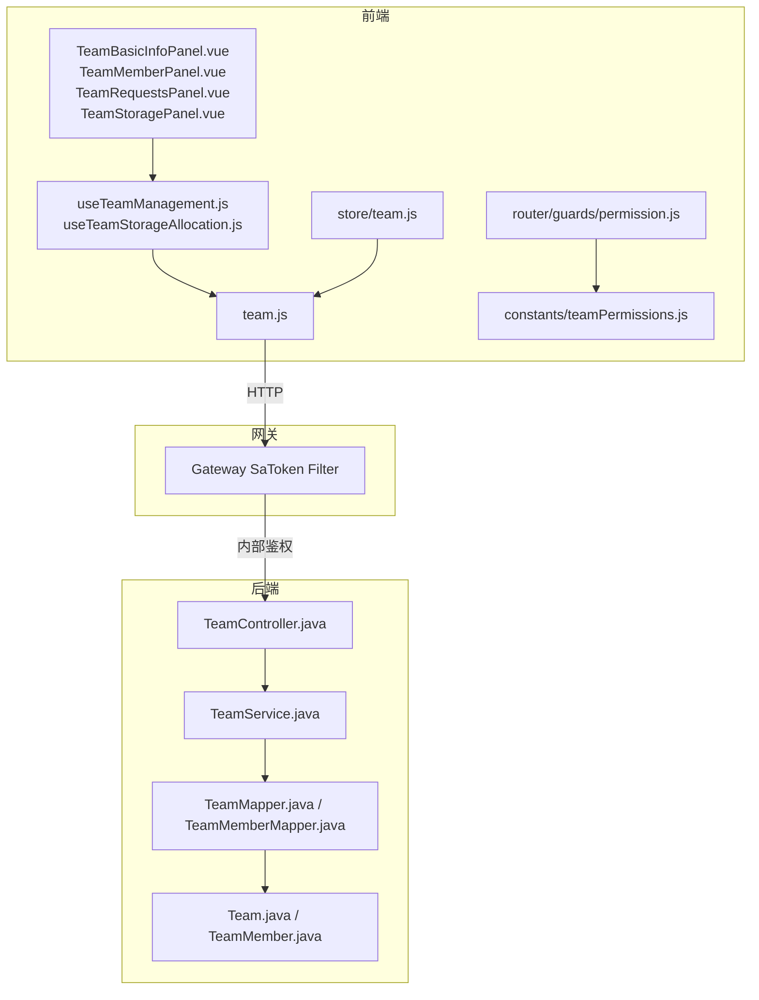
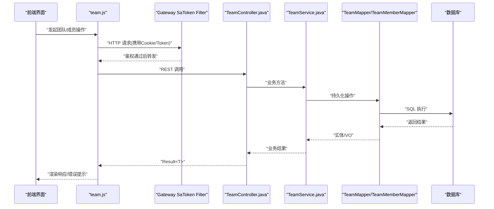
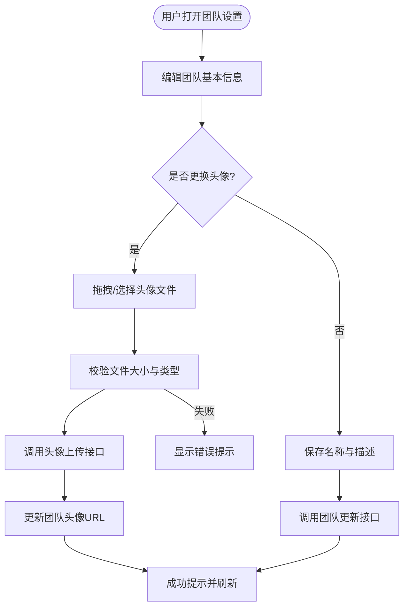
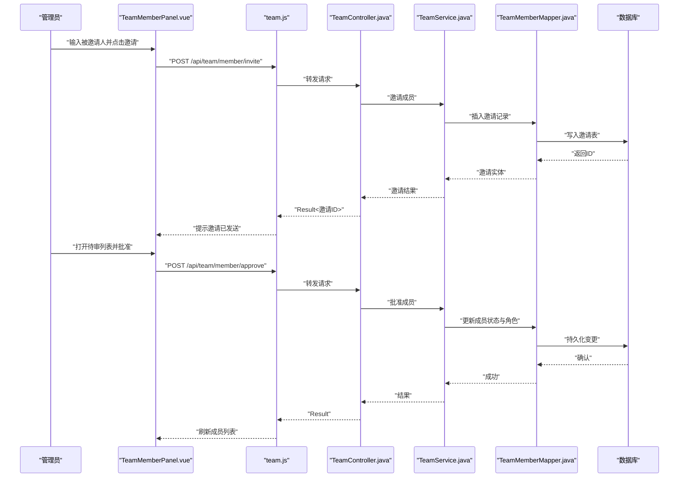
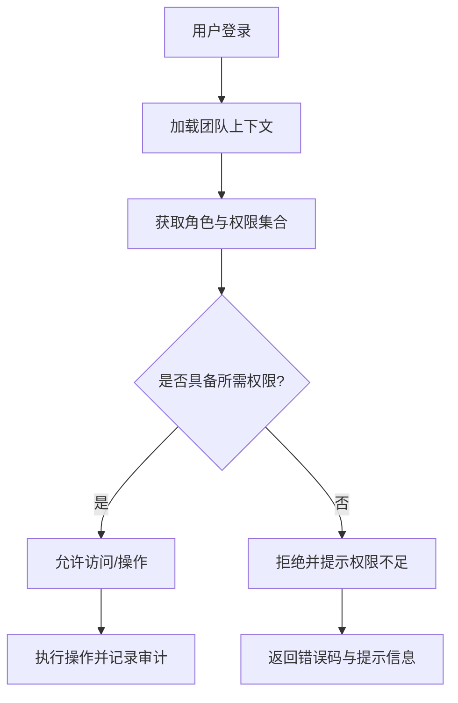
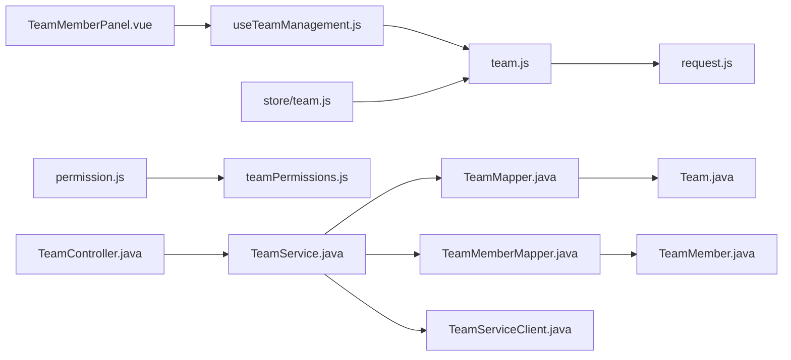

# 团队协作模块

<cite>
**本文引用的文件**
- [zxyz-team-service/src/main/java/uno/acloud/team/controller/TeamController.java](file://ZXYZdatabaseBack/zxyz-team-service/src/main/java/uno/acloud/team/controller/TeamController.java)
- [zxyz-team-service/src/main/java/uno/acloud/team/service/TeamService.java](file://ZXYZdatabaseBack/zxyz-team-service/src/main/java/uno/acloud/team/service/TeamService.java)
- [zxyz-team-service/src/main/java/uno/acloud/team/entity/Team.java](file://ZXYZdatabaseBack/zxyz-team-service/src/main/java/uno/acloud/team/entity/Team.java)
- [zxyz-team-service/src/main/java/uno/acloud/team/entity/TeamMember.java](file://ZXYZdatabaseBack/zxyz-team-service/src/main/java/uno/acloud/team/entity/TeamMember.java)
- [zxyz-team-service/src/main/java/uno/acloud/team/mapper/TeamMapper.java](file://ZXYZdatabaseBack/zxyz-team-service/src/main/java/uno/acloud/team/mapper/TeamMapper.java)
- [zxyz-team-service/src/main/java/uno/acloud/team/mapper/TeamMemberMapper.java](file://ZXYZdatabaseBack/zxyz-team-service/src/main/java/uno/acloud/team/mapper/TeamMemberMapper.java)
- [zxyz-common/src/main/java/uno/acloud/client/TeamServiceClient.java](file://ZXYZdatabaseBack/zxyz-common/src/main/java/uno/acloud/client/TeamServiceClient.java)
- [ZXYZdatabaseFront/src/api/team.js](file://ZXYZdatabaseFront/src/api/team.js)
- [ZXYZdatabaseFront/src/components/team-settings/TeamBasicInfoPanel.vue](file://ZXYZdatabaseFront/src/components/team-settings/TeamBasicInfoPanel.vue)
- [ZXYZdatabaseFront/src/components/team-settings/TeamMemberPanel.vue](file://ZXYZdatabaseFront/src/components/team-settings/TeamMemberPanel.vue)
- [ZXYZdatabaseFront/src/components/team-settings/TeamRequestsPanel.vue](file://ZXYZdatabaseFront/src/components/team-settings/TeamRequestsPanel.vue)
- [ZXYZdatabaseFront/src/components/team-settings/TeamStoragePanel.vue](file://ZXYZdatabaseFront/src/components/team-settings/TeamStoragePanel.vue)
- [ZXYZdatabaseFront/src/composables/team/useTeamManagement.js](file://ZXYZdatabaseFront/src/composables/team/useTeamManagement.js)
- [ZXYZdatabaseFront/src/composables/team/useTeamStorageAllocation.js](file://ZXYZdatabaseFront/src/composables/team/useTeamStorageAllocation.js)
- [ZXYZdatabaseFront/src/constants/teamPermissions.js](file://ZXYZdatabaseFront/src/constants/teamPermissions.js)
- [ZXYZdatabaseFront/src/store/team.js](file://ZXYZdatabaseFront/src/store/team.js)
- [ZXYZdatabaseFront/src/router/guards/permission.js](file://ZXYZdatabaseFront/src/router/guards/permission.js)
- [ZXYZdatabaseFront/src/utils/error.js](file://ZXYZdatabaseFront/src/utils/error.js)
- [ZXYZdatabaseFront/src/utils/request.js](file://ZXYZdatabaseFront/src/utils/request.js)
- [ZXYZdatabaseBack/sql/schema_team.sql](file://ZXYZdatabaseBack/sql/schema_team.sql)
- [ZXYZdatabaseBack/nacos-config/zxyz-team-service.yml](file://ZXYZdatabaseBack/nacos-config/zxyz-team-service.yml)
</cite>

## 目录
1. [简介](#简介)
2. [项目结构](#项目结构)
3. [核心组件](#核心组件)
4. [架构总览](#架构总览)
5. [详细组件分析](#详细组件分析)
6. [依赖关系分析](#依赖关系分析)
7. [性能考量](#性能考量)
8. [故障排查指南](#故障排查指南)
9. [结论](#结论)
10. [附录](#附录)

## 简介
本文件为 ZXYZ 前端团队协作模块的开发文档，聚焦以下目标：
- 团队基本信息管理：创建、编辑、头像上传与描述设置
- 成员管理：邀请、审批、角色分配与权限控制
- 团队设置面板：存储配额、访问控制与高级配置
- 权限管理系统：RBAC 模型、自定义角色、权限继承与实时同步
- API 调用示例：团队成员 CRUD、权限分配与审计日志查询
- 用户体验优化：拖拽排序、批量操作与实时状态更新
- 错误处理策略：权限不足提示、操作冲突解决与数据一致性保证

## 项目结构
协作模块由前端与后端两部分组成：
- 前端（Vue 3 + Element Plus + Pinia）
  - 页面与面板：团队基本信息、成员列表、请求审批、存储配额
  - 组合式函数：团队管理与存储配额分配
  - API 层：team.js 封装 HTTP 调用
  - 权限常量与守卫：teamPermissions.js、permission.js
  - 状态管理：store/team.js
- 后端（Spring Boot 微服务）
  - team-service：团队与成员领域逻辑、控制器、服务、实体与映射
  - common：跨服务客户端 TeamServiceClient
  - SQL：schema_team.sql 定义团队与成员表结构
  - Nacos：zxyz-team-service.yml 配置项



**图表来源**
- [ZXYZdatabaseFront/src/api/team.js](file://ZXYZdatabaseFront/src/api/team.js)
- [ZXYZdatabaseFront/src/components/team-settings/TeamBasicInfoPanel.vue](file://ZXYZdatabaseFront/src/components/team-settings/TeamBasicInfoPanel.vue)
- [ZXYZdatabaseFront/src/components/team-settings/TeamMemberPanel.vue](file://ZXYZdatabaseFront/src/components/team-settings/TeamMemberPanel.vue)
- [ZXYZdatabaseFront/src/components/team-settings/TeamRequestsPanel.vue](file://ZXYZdatabaseFront/src/components/team-settings/TeamRequestsPanel.vue)
- [ZXYZdatabaseFront/src/components/team-settings/TeamStoragePanel.vue](file://ZXYZdatabaseFront/src/components/team-settings/TeamStoragePanel.vue)
- [ZXYZdatabaseFront/src/composables/team/useTeamManagement.js](file://ZXYZdatabaseFront/src/composables/team/useTeamManagement.js)
- [ZXYZdatabaseFront/src/composables/team/useTeamStorageAllocation.js](file://ZXYZdatabaseFront/src/composables/team/useTeamStorageAllocation.js)
- [ZXYZdatabaseFront/src/store/team.js](file://ZXYZdatabaseFront/src/store/team.js)
- [ZXYZdatabaseFront/src/router/guards/permission.js](file://ZXYZdatabaseFront/src/router/guards/permission.js)
- [ZXYZdatabaseFront/src/constants/teamPermissions.js](file://ZXYZdatabaseFront/src/constants/teamPermissions.js)
- [ZXYZdatabaseBack/zxyz-team-service/src/main/java/uno/acloud/team/controller/TeamController.java](file://ZXYZdatabaseBack/zxyz-team-service/src/main/java/uno/acloud/team/controller/TeamController.java)
- [ZXYZdatabaseBack/zxyz-team-service/src/main/java/uno/acloud/team/service/TeamService.java](file://ZXYZdatabaseBack/zxyz-team-service/src/main/java/uno/acloud/team/service/TeamService.java)
- [ZXYZdatabaseBack/zxyz-team-service/src/main/java/uno/acloud/team/mapper/TeamMapper.java](file://ZXYZdatabaseBack/zxyz-team-service/src/main/java/uno/acloud/team/mapper/TeamMapper.java)
- [ZXYZdatabaseBack/zxyz-team-service/src/main/java/uno/acloud/team/mapper/TeamMemberMapper.java](file://ZXYZdatabaseBack/zxyz-team-service/src/main/java/uno/acloud/team/mapper/TeamMemberMapper.java)
- [ZXYZdatabaseBack/zxyz-team-service/src/main/java/uno/acloud/team/entity/Team.java](file://ZXYZdatabaseBack/zxyz-team-service/src/main/java/uno/acloud/team/entity/Team.java)
- [ZXYZdatabaseBack/zxyz-team-service/src/main/java/uno/acloud/team/entity/TeamMember.java](file://ZXYZdatabaseBack/zxyz-team-service/src/main/java/uno/acloud/team/entity/TeamMember.java)

**章节来源**
- [ZXYZdatabaseFront/src/api/team.js](file://ZXYZdatabaseFront/src/api/team.js)
- [ZXYZdatabaseBack/zxyz-team-service/src/main/java/uno/acloud/team/controller/TeamController.java](file://ZXYZdatabaseBack/zxyz-team-service/src/main/java/uno/acloud/team/controller/TeamController.java)
- [ZXYZdatabaseBack/zxyz-team-service/src/main/java/uno/acloud/team/service/TeamService.java](file://ZXYZdatabaseBack/zxyz-team-service/src/main/java/uno/acloud/team/service/TeamService.java)
- [ZXYZdatabaseBack/sql/schema_team.sql](file://ZXYZdatabaseBack/sql/schema_team.sql)

## 核心组件
- 前端面板
  - TeamBasicInfoPanel.vue：团队名称、描述、头像上传与保存
  - TeamMemberPanel.vue：成员列表、搜索、批量操作、角色变更
  - TeamRequestsPanel.vue：加入申请、审批通过/拒绝
  - TeamStoragePanel.vue：存储配额查看与分配
- 组合式函数
  - useTeamManagement.js：封装团队 CRUD、成员邀请、审批、角色分配等流程
  - useTeamStorageAllocation.js：存储配额读取、分配与校验
- API 层
  - team.js：统一封装团队相关接口调用，包含错误处理与结果解析
- 权限与守卫
  - teamPermissions.js：定义团队权限常量
  - permission.js：路由级权限校验
- 状态管理
  - store/team.js：当前团队上下文、成员缓存、配额信息

**章节来源**
- [ZXYZdatabaseFront/src/components/team-settings/TeamBasicInfoPanel.vue](file://ZXYZdatabaseFront/src/components/team-settings/TeamBasicInfoPanel.vue)
- [ZXYZdatabaseFront/src/components/team-settings/TeamMemberPanel.vue](file://ZXYZdatabaseFront/src/components/team-settings/TeamMemberPanel.vue)
- [ZXYZdatabaseFront/src/components/team-settings/TeamRequestsPanel.vue](file://ZXYZdatabaseFront/src/components/team-settings/TeamRequestsPanel.vue)
- [ZXYZdatabaseFront/src/components/team-settings/TeamStoragePanel.vue](file://ZXYZdatabaseFront/src/components/team-settings/TeamStoragePanel.vue)
- [ZXYZdatabaseFront/src/composables/team/useTeamManagement.js](file://ZXYZdatabaseFront/src/composables/team/useTeamManagement.js)
- [ZXYZdatabaseFront/src/composables/team/useTeamStorageAllocation.js](file://ZXYZdatabaseFront/src/composables/team/useTeamStorageAllocation.js)
- [ZXYZdatabaseFront/src/api/team.js](file://ZXYZdatabaseFront/src/api/team.js)
- [ZXYZdatabaseFront/src/constants/teamPermissions.js](file://ZXYZdatabaseFront/src/constants/teamPermissions.js)
- [ZXYZdatabaseFront/src/router/guards/permission.js](file://ZXYZdatabaseFront/src/router/guards/permission.js)
- [ZXYZdatabaseFront/src/store/team.js](file://ZXYZdatabaseFront/src/store/team.js)

## 架构总览
协作模块采用前后端分离与微服务架构。前端通过 team.js 发起 HTTP 请求，经 Gateway 的 SaToken 过滤器进行鉴权后进入 team-service。team-service 使用 Service 层编排业务，通过 Mapper 访问数据库实体。跨服务调用通过 TeamServiceClient 完成，遵循窄端点与投影模式。



**图表来源**
- [ZXYZdatabaseFront/src/api/team.js](file://ZXYZdatabaseFront/src/api/team.js)
- [ZXYZdatabaseBack/zxyz-team-service/src/main/java/uno/acloud/team/controller/TeamController.java](file://ZXYZdatabaseBack/zxyz-team-service/src/main/java/uno/acloud/team/controller/TeamController.java)
- [ZXYZdatabaseBack/zxyz-team-service/src/main/java/uno/acloud/team/service/TeamService.java](file://ZXYZdatabaseBack/zxyz-team-service/src/main/java/uno/acloud/team/service/TeamService.java)
- [ZXYZdatabaseBack/zxyz-team-service/src/main/java/uno/acloud/team/mapper/TeamMapper.java](file://ZXYZdatabaseBack/zxyz-team-service/src/main/java/uno/acloud/team/mapper/TeamMapper.java)
- [ZXYZdatabaseBack/zxyz-team-service/src/main/java/uno/acloud/team/mapper/TeamMemberMapper.java](file://ZXYZdatabaseBack/zxyz-team-service/src/main/java/uno/acloud/team/mapper/TeamMemberMapper.java)

## 详细组件分析

### 团队基本信息管理
- 功能要点
  - 创建团队：填写名称、描述，选择或上传头像
  - 编辑团队：修改名称、描述、头像
  - 头像上传：支持拖拽与预览，提交至后端并回写团队信息
- 实现路径
  - 前端面板：TeamBasicInfoPanel.vue 负责表单与上传交互
  - 组合式函数：useTeamManagement.js 封装创建/更新调用
  - API 层：team.js 提供 create/update/头像上传接口
  - 后端控制器与服务：TeamController.java、TeamService.java 处理业务
  - 实体与映射：Team.java、TeamMapper.java 持久化团队信息



**图表来源**
- [ZXYZdatabaseFront/src/components/team-settings/TeamBasicInfoPanel.vue](file://ZXYZdatabaseFront/src/components/team-settings/TeamBasicInfoPanel.vue)
- [ZXYZdatabaseFront/src/composables/team/useTeamManagement.js](file://ZXYZdatabaseFront/src/composables/team/useTeamManagement.js)
- [ZXYZdatabaseFront/src/api/team.js](file://ZXYZdatabaseFront/src/api/team.js)
- [ZXYZdatabaseBack/zxyz-team-service/src/main/java/uno/acloud/team/controller/TeamController.java](file://ZXYZdatabaseBack/zxyz-team-service/src/main/java/uno/acloud/team/controller/TeamController.java)
- [ZXYZdatabaseBack/zxyz-team-service/src/main/java/uno/acloud/team/service/TeamService.java](file://ZXYZdatabaseBack/zxyz-team-service/src/main/java/uno/acloud/team/service/TeamService.java)
- [ZXYZdatabaseBack/zxyz-team-service/src/main/java/uno/acloud/team/entity/Team.java](file://ZXYZdatabaseBack/zxyz-team-service/src/main/java/uno/acloud/team/entity/Team.java)
- [ZXYZdatabaseBack/zxyz-team-service/src/main/java/uno/acloud/team/mapper/TeamMapper.java](file://ZXYZdatabaseBack/zxyz-team-service/src/main/java/uno/acloud/team/mapper/TeamMapper.java)

**章节来源**
- [ZXYZdatabaseFront/src/components/team-settings/TeamBasicInfoPanel.vue](file://ZXYZdatabaseFront/src/components/team-settings/TeamBasicInfoPanel.vue)
- [ZXYZdatabaseFront/src/composables/team/useTeamManagement.js](file://ZXYZdatabaseFront/src/composables/team/useTeamManagement.js)
- [ZXYZdatabaseFront/src/api/team.js](file://ZXYZdatabaseFront/src/api/team.js)
- [ZXYZdatabaseBack/zxyz-team-service/src/main/java/uno/acloud/team/controller/TeamController.java](file://ZXYZdatabaseBack/zxyz-team-service/src/main/java/uno/acloud/team/controller/TeamController.java)
- [ZXYZdatabaseBack/zxyz-team-service/src/main/java/uno/acloud/team/service/TeamService.java](file://ZXYZdatabaseBack/zxyz-team-service/src/main/java/uno/acloud/team/service/TeamService.java)
- [ZXYZdatabaseBack/zxyz-team-service/src/main/java/uno/acloud/team/entity/Team.java](file://ZXYZdatabaseBack/zxyz-team-service/src/main/java/uno/acloud/team/entity/Team.java)
- [ZXYZdatabaseBack/zxyz-team-service/src/main/java/uno/acloud/team/mapper/TeamMapper.java](file://ZXYZdatabaseBack/zxyz-team-service/src/main/java/uno/acloud/team/mapper/TeamMapper.java)

### 成员管理（邀请、审批、角色与权限）
- 功能要点
  - 邀请成员：输入邮箱/用户名，发送邀请链接或站内通知
  - 审批流程：待审列表展示，管理员可批准或拒绝
  - 角色分配：为成员分配角色（如管理员、普通成员），影响权限
  - 权限控制：基于 RBAC，角色决定资源访问能力
- 实现路径
  - 前端面板：TeamMemberPanel.vue、TeamRequestsPanel.vue
  - 组合式函数：useTeamManagement.js 封装邀请、审批、角色变更
  - API 层：team.js 提供成员 CRUD、邀请与审批接口
  - 后端控制器与服务：TeamController.java、TeamService.java
  - 实体与映射：TeamMember.java、TeamMemberMapper.java



**图表来源**
- [ZXYZdatabaseFront/src/components/team-settings/TeamMemberPanel.vue](file://ZXYZdatabaseFront/src/components/team-settings/TeamMemberPanel.vue)
- [ZXYZdatabaseFront/src/components/team-settings/TeamRequestsPanel.vue](file://ZXYZdatabaseFront/src/components/team-settings/TeamRequestsPanel.vue)
- [ZXYZdatabaseFront/src/composables/team/useTeamManagement.js](file://ZXYZdatabaseFront/src/composables/team/useTeamManagement.js)
- [ZXYZdatabaseFront/src/api/team.js](file://ZXYZdatabaseFront/src/api/team.js)
- [ZXYZdatabaseBack/zxyz-team-service/src/main/java/uno/acloud/team/controller/TeamController.java](file://ZXYZdatabaseBack/zxyz-team-service/src/main/java/uno/acloud/team/controller/TeamController.java)
- [ZXYZdatabaseBack/zxyz-team-service/src/main/java/uno/acloud/team/service/TeamService.java](file://ZXYZdatabaseBack/zxyz-team-service/src/main/java/uno/acloud/team/service/TeamService.java)
- [ZXYZdatabaseBack/zxyz-team-service/src/main/java/uno/acloud/team/mapper/TeamMemberMapper.java](file://ZXYZdatabaseBack/zxyz-team-service/src/main/java/uno/acloud/team/mapper/TeamMemberMapper.java)
- [ZXYZdatabaseBack/zxyz-team-service/src/main/java/uno/acloud/team/entity/TeamMember.java](file://ZXYZdatabaseBack/zxyz-team-service/src/main/java/uno/acloud/team/entity/TeamMember.java)

**章节来源**
- [ZXYZdatabaseFront/src/components/team-settings/TeamMemberPanel.vue](file://ZXYZdatabaseFront/src/components/team-settings/TeamMemberPanel.vue)
- [ZXYZdatabaseFront/src/components/team-settings/TeamRequestsPanel.vue](file://ZXYZdatabaseFront/src/components/team-settings/TeamRequestsPanel.vue)
- [ZXYZdatabaseFront/src/composables/team/useTeamManagement.js](file://ZXYZdatabaseFront/src/composables/team/useTeamManagement.js)
- [ZXYZdatabaseFront/src/api/team.js](file://ZXYZdatabaseFront/src/api/team.js)
- [ZXYZdatabaseBack/zxyz-team-service/src/main/java/uno/acloud/team/controller/TeamController.java](file://ZXYZdatabaseBack/zxyz-team-service/src/main/java/uno/acloud/team/controller/TeamController.java)
- [ZXYZdatabaseBack/zxyz-team-service/src/main/java/uno/acloud/team/service/TeamService.java](file://ZXYZdatabaseBack/zxyz-team-service/src/main/java/uno/acloud/team/service/TeamService.java)
- [ZXYZdatabaseBack/zxyz-team-service/src/main/java/uno/acloud/team/mapper/TeamMemberMapper.java](file://ZXYZdatabaseBack/zxyz-team-service/src/main/java/uno/acloud/team/mapper/TeamMemberMapper.java)
- [ZXYZdatabaseBack/zxyz-team-service/src/main/java/uno/acloud/team/entity/TeamMember.java](file://ZXYZdatabaseBack/zxyz-team-service/src/main/java/uno/acloud/team/entity/TeamMember.java)

### 团队设置面板（存储配额、访问控制、高级配置）
- 功能要点
  - 存储配额：查看团队总配额与已用空间，按成员分配额度
  - 访问控制：限制外部访问、启用白名单、设置过期时间
  - 高级配置：开启审计、消息保留策略、文件压缩选项
- 实现路径
  - 前端面板：TeamStoragePanel.vue 负责配额展示与分配
  - 组合式函数：useTeamStorageAllocation.js 封装配额读取与分配
  - API 层：team.js 提供配额查询与分配接口
  - 后端控制器与服务：TeamController.java、TeamService.java
  - 配置：nacos zxyz-team-service.yml 管理开关与阈值

```mermaid
classDiagram
class TeamStoragePanel {
+render()
+loadQuota()
+allocate(memberId, quota)
+validate(quota)
}
class UseTeamStorageAllocation {
+fetchQuota(teamId)
+assignQuota(teamId, memberId, amount)
+checkLimit(amount)
}
class TeamController {
+getQuota(teamId)
+allocateQuota(request)
}
class TeamService {
+queryQuota(teamId)
+assignQuota(teamId, memberId, amount)
+validateLimit(amount)
}
class TeamStoragePanel --> UseTeamStorageAllocation : "调用"
class UseTeamStorageAllocation --> TeamController : "HTTP 调用"
class TeamController --> TeamService : "业务编排"
```

**图表来源**
- [ZXYZdatabaseFront/src/components/team-settings/TeamStoragePanel.vue](file://ZXYZdatabaseFront/src/components/team-settings/TeamStoragePanel.vue)
- [ZXYZdatabaseFront/src/composables/team/useTeamStorageAllocation.js](file://ZXYZdatabaseFront/src/composables/team/useTeamStorageAllocation.js)
- [ZXYZdatabaseFront/src/api/team.js](file://ZXYZdatabaseFront/src/api/team.js)
- [ZXYZdatabaseBack/zxyz-team-service/src/main/java/uno/acloud/team/controller/TeamController.java](file://ZXYZdatabaseBack/zxyz-team-service/src/main/java/uno/acloud/team/controller/TeamController.java)
- [ZXYZdatabaseBack/zxyz-team-service/src/main/java/uno/acloud/team/service/TeamService.java](file://ZXYZdatabaseBack/zxyz-team-service/src/main/java/uno/acloud/team/service/TeamService.java)
- [ZXYZdatabaseBack/nacos-config/zxyz-team-service.yml](file://ZXYZdatabaseBack/nacos-config/zxyz-team-service.yml)

**章节来源**
- [ZXYZdatabaseFront/src/components/team-settings/TeamStoragePanel.vue](file://ZXYZdatabaseFront/src/components/team-settings/TeamStoragePanel.vue)
- [ZXYZdatabaseFront/src/composables/team/useTeamStorageAllocation.js](file://ZXYZdatabaseFront/src/composables/team/useTeamStorageAllocation.js)
- [ZXYZdatabaseFront/src/api/team.js](file://ZXYZdatabaseFront/src/api/team.js)
- [ZXYZdatabaseBack/zxyz-team-service/src/main/java/uno/acloud/team/controller/TeamController.java](file://ZXYZdatabaseBack/zxyz-team-service/src/main/java/uno/acloud/team/controller/TeamController.java)
- [ZXYZdatabaseBack/zxyz-team-service/src/main/java/uno/acloud/team/service/TeamService.java](file://ZXYZdatabaseBack/zxyz-team-service/src/main/java/uno/acloud/team/service/TeamService.java)
- [ZXYZdatabaseBack/nacos-config/zxyz-team-service.yml](file://ZXYZdatabaseBack/nacos-config/zxyz-team-service.yml)

### 权限管理系统（RBAC、自定义角色、继承与实时同步）
- 模型说明
  - RBAC：角色-权限映射，成员继承角色权限
  - 自定义角色：允许扩展内置角色，叠加额外权限
  - 权限继承：子角色继承父角色权限集合
  - 实时同步：前端通过事件或轮询保持权限状态一致
- 实现路径
  - 前端常量：teamPermissions.js 定义权限键
  - 守卫：permission.js 在路由级检查权限
  - 状态：store/team.js 维护当前用户权限集
  - 后端：TeamService.java 提供权限计算与校验



**图表来源**
- [ZXYZdatabaseFront/src/constants/teamPermissions.js](file://ZXYZdatabaseFront/src/constants/teamPermissions.js)
- [ZXYZdatabaseFront/src/router/guards/permission.js](file://ZXYZdatabaseFront/src/router/guards/permission.js)
- [ZXYZdatabaseFront/src/store/team.js](file://ZXYZdatabaseFront/src/store/team.js)
- [ZXYZdatabaseBack/zxyz-team-service/src/main/java/uno/acloud/team/service/TeamService.java](file://ZXYZdatabaseBack/zxyz-team-service/src/main/java/uno/acloud/team/service/TeamService.java)

**章节来源**
- [ZXYZdatabaseFront/src/constants/teamPermissions.js](file://ZXYZdatabaseFront/src/constants/teamPermissions.js)
- [ZXYZdatabaseFront/src/router/guards/permission.js](file://ZXYZdatabaseFront/src/router/guards/permission.js)
- [ZXYZdatabaseFront/src/store/team.js](file://ZXYZdatabaseFront/src/store/team.js)
- [ZXYZdatabaseBack/zxyz-team-service/src/main/java/uno/acloud/team/service/TeamService.java](file://ZXYZdatabaseBack/zxyz-team-service/src/main/java/uno/acloud/team/service/TeamService.java)

### API 调用示例（团队成员 CRUD、权限分配、审计日志）
- 团队成员 CRUD
  - 创建成员：POST /api/team/member/create
  - 更新成员：PUT /api/team/member/update
  - 删除成员：DELETE /api/team/member/delete
  - 查询成员：GET /api/team/member/list?teamId=...
- 权限分配
  - 分配角色：POST /api/team/member/role/assign
  - 撤销角色：POST /api/team/member/role/revoke
- 审计日志查询
  - 查询操作日志：GET /api/audit/operate-log?entityType=TEAM&entityId=...

注意：以上为常见 REST 风格示例，实际端点以 team.js 与 TeamController.java 定义为准。所有响应遵循 Result<T> 结构，code:1 表示成功。

**章节来源**
- [ZXYZdatabaseFront/src/api/team.js](file://ZXYZdatabaseFront/src/api/team.js)
- [ZXYZdatabaseBack/zxyz-team-service/src/main/java/uno/acloud/team/controller/TeamController.java](file://ZXYZdatabaseBack/zxyz-team-service/src/main/java/uno/acloud/team/controller/TeamController.java)

### 用户体验优化（拖拽排序、批量操作、实时状态更新）
- 拖拽排序：在成员列表中支持拖拽调整顺序，前端本地排序并可选同步后端
- 批量操作：多选成员进行批量角色变更或删除，减少多次请求
- 实时状态更新：通过事件或轮询刷新成员列表与配额信息，提升交互流畅度

**章节来源**
- [ZXYZdatabaseFront/src/components/team-settings/TeamMemberPanel.vue](file://ZXYZdatabaseFront/src/components/team-settings/TeamMemberPanel.vue)
- [ZXYZdatabaseFront/src/composables/team/useTeamManagement.js](file://ZXYZdatabaseFront/src/composables/team/useTeamManagement.js)

## 依赖关系分析
- 前端依赖
  - team.js 依赖 request.js 进行 HTTP 封装与错误处理
  - 面板组件依赖组合式函数，组合式函数依赖 API 层
  - 权限常量与守卫依赖 store/team.js 提供的权限集
- 后端依赖
  - TeamController 依赖 TeamService
  - TeamService 依赖 TeamMapper/TeamMemberMapper
  - 实体 Team/TeamMember 作为持久化对象
  - 跨服务调用通过 TeamServiceClient



**图表来源**
- [ZXYZdatabaseFront/src/components/team-settings/TeamMemberPanel.vue](file://ZXYZdatabaseFront/src/components/team-settings/TeamMemberPanel.vue)
- [ZXYZdatabaseFront/src/composables/team/useTeamManagement.js](file://ZXYZdatabaseFront/src/composables/team/useTeamManagement.js)
- [ZXYZdatabaseFront/src/api/team.js](file://ZXYZdatabaseFront/src/api/team.js)
- [ZXYZdatabaseFront/src/utils/request.js](file://ZXYZdatabaseFront/src/utils/request.js)
- [ZXYZdatabaseFront/src/store/team.js](file://ZXYZdatabaseFront/src/store/team.js)
- [ZXYZdatabaseFront/src/router/guards/permission.js](file://ZXYZdatabaseFront/src/router/guards/permission.js)
- [ZXYZdatabaseFront/src/constants/teamPermissions.js](file://ZXYZdatabaseFront/src/constants/teamPermissions.js)
- [ZXYZdatabaseBack/zxyz-team-service/src/main/java/uno/acloud/team/controller/TeamController.java](file://ZXYZdatabaseBack/zxyz-team-service/src/main/java/uno/acloud/team/controller/TeamController.java)
- [ZXYZdatabaseBack/zxyz-team-service/src/main/java/uno/acloud/team/service/TeamService.java](file://ZXYZdatabaseBack/zxyz-team-service/src/main/java/uno/acloud/team/service/TeamService.java)
- [ZXYZdatabaseBack/zxyz-team-service/src/main/java/uno/acloud/team/mapper/TeamMapper.java](file://ZXYZdatabaseBack/zxyz-team-service/src/main/java/uno/acloud/team/mapper/TeamMapper.java)
- [ZXYZdatabaseBack/zxyz-team-service/src/main/java/uno/acloud/team/mapper/TeamMemberMapper.java](file://ZXYZdatabaseBack/zxyz-team-service/src/main/java/uno/acloud/team/mapper/TeamMemberMapper.java)
- [ZXYZdatabaseBack/zxyz-team-service/src/main/java/uno/acloud/team/entity/Team.java](file://ZXYZdatabaseBack/zxyz-team-service/src/main/java/uno/acloud/team/entity/Team.java)
- [ZXYZdatabaseBack/zxyz-team-service/src/main/java/uno/acloud/team/entity/TeamMember.java](file://ZXYZdatabaseBack/zxyz-team-service/src/main/java/uno/acloud/team/entity/TeamMember.java)
- [ZXYZdatabaseBack/zxyz-common/src/main/java/uno/acloud/client/TeamServiceClient.java](file://ZXYZdatabaseBack/zxyz-common/src/main/java/uno/acloud/client/TeamServiceClient.java)

**章节来源**
- [ZXYZdatabaseFront/src/api/team.js](file://ZXYZdatabaseFront/src/api/team.js)
- [ZXYZdatabaseFront/src/utils/request.js](file://ZXYZdatabaseFront/src/utils/request.js)
- [ZXYZdatabaseFront/src/store/team.js](file://ZXYZdatabaseFront/src/store/team.js)
- [ZXYZdatabaseFront/src/router/guards/permission.js](file://ZXYZdatabaseFront/src/router/guards/permission.js)
- [ZXYZdatabaseFront/src/constants/teamPermissions.js](file://ZXYZdatabaseFront/src/constants/teamPermissions.js)
- [ZXYZdatabaseBack/zxyz-team-service/src/main/java/uno/acloud/team/controller/TeamController.java](file://ZXYZdatabaseBack/zxyz-team-service/src/main/java/uno/acloud/team/controller/TeamController.java)
- [ZXYZdatabaseBack/zxyz-team-service/src/main/java/uno/acloud/team/service/TeamService.java](file://ZXYZdatabaseBack/zxyz-team-service/src/main/java/uno/acloud/team/service/TeamService.java)
- [ZXYZdatabaseBack/zxyz-team-service/src/main/java/uno/acloud/team/mapper/TeamMapper.java](file://ZXYZdatabaseBack/zxyz-team-service/src/main/java/uno/acloud/team/mapper/TeamMapper.java)
- [ZXYZdatabaseBack/zxyz-team-service/src/main/java/uno/acloud/team/mapper/TeamMemberMapper.java](file://ZXYZdatabaseBack/zxyz-team-service/src/main/java/uno/acloud/team/mapper/TeamMemberMapper.java)
- [ZXYZdatabaseBack/zxyz-team-service/src/main/java/uno/acloud/team/entity/Team.java](file://ZXYZdatabaseBack/zxyz-team-service/src/main/java/uno/acloud/team/entity/Team.java)
- [ZXYZdatabaseBack/zxyz-team-service/src/main/java/uno/acloud/team/entity/TeamMember.java](file://ZXYZdatabaseBack/zxyz-team-service/src/main/java/uno/acloud/team/entity/TeamMember.java)
- [ZXYZdatabaseBack/zxyz-common/src/main/java/uno/acloud/client/TeamServiceClient.java](file://ZXYZdatabaseBack/zxyz-common/src/main/java/uno/acloud/client/TeamServiceClient.java)

## 性能考量
- 前端
  - 列表虚拟化与分页：避免一次性渲染大量成员
  - 批量操作合并请求：减少网络往返
  - 防抖与节流：搜索与输入场景优化
- 后端
  - 索引优化：对 teamId、memberId、status 建立索引
  - 事务边界：邀请与审批操作使用事务保证一致性
  - 缓存策略：热点团队信息与权限集缓存

[本节为通用指导，不直接分析具体文件]

## 故障排查指南
- 权限不足
  - 前端：permission.js 拦截并提示；检查 store/team.js 权限集是否正确加载
  - 后端：TeamService.java 权限校验失败返回错误码
- 操作冲突
  - 并发邀请：后端需加锁或唯一约束防止重复
  - 配额超限：校验逻辑应返回明确错误并提示调整
- 数据一致性
  - 事务回滚：异常时确保邀请与成员状态一致
  - 审计日志：关键操作记录 before/after 值便于追踪

**章节来源**
- [ZXYZdatabaseFront/src/router/guards/permission.js](file://ZXYZdatabaseFront/src/router/guards/permission.js)
- [ZXYZdatabaseFront/src/store/team.js](file://ZXYZdatabaseFront/src/store/team.js)
- [ZXYZdatabaseFront/src/utils/error.js](file://ZXYZdatabaseFront/src/utils/error.js)
- [ZXYZdatabaseBack/zxyz-team-service/src/main/java/uno/acloud/team/service/TeamService.java](file://ZXYZdatabaseBack/zxyz-team-service/src/main/java/uno/acloud/team/service/TeamService.java)

## 结论
团队协作模块通过清晰的前后端分层与微服务架构，实现了团队信息管理、成员生命周期管理、存储配额与权限控制的完整闭环。结合 RBAC 与实时同步机制，保障权限一致性与用户体验。建议持续优化并发与一致性策略，完善审计与监控，提升系统稳定性与可观测性。

[本节为总结，不直接分析具体文件]

## 附录
- 数据库表结构参考：schema_team.sql
- 配置项参考：zxyz-team-service.yml

**章节来源**
- [ZXYZdatabaseBack/sql/schema_team.sql](file://ZXYZdatabaseBack/sql/schema_team.sql)
- [ZXYZdatabaseBack/nacos-config/zxyz-team-service.yml](file://ZXYZdatabaseBack/nacos-config/zxyz-team-service.yml)