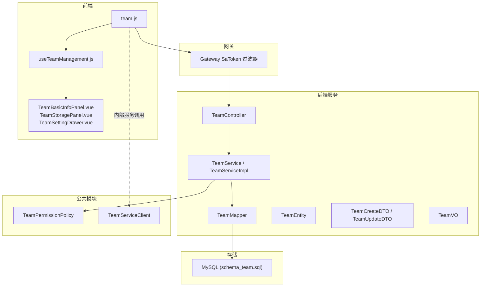
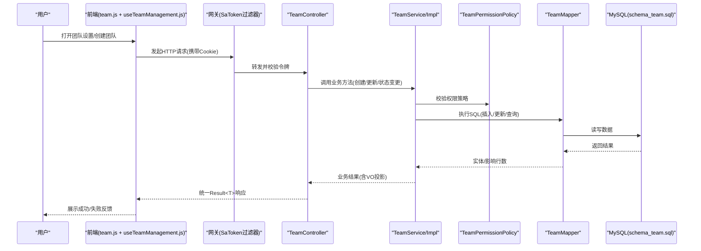
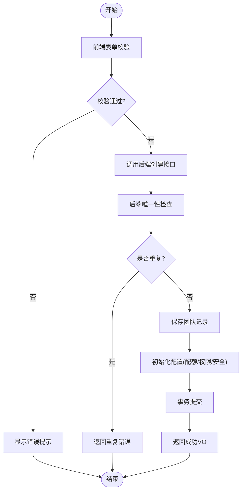
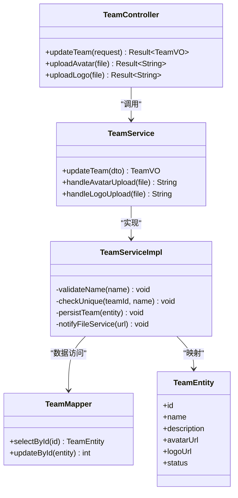
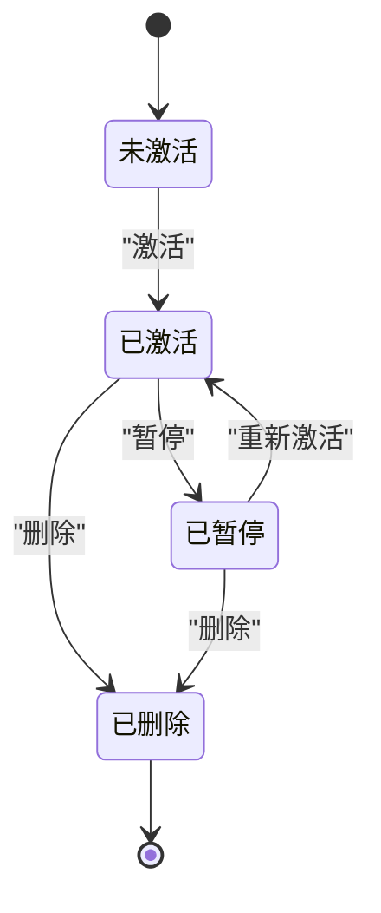
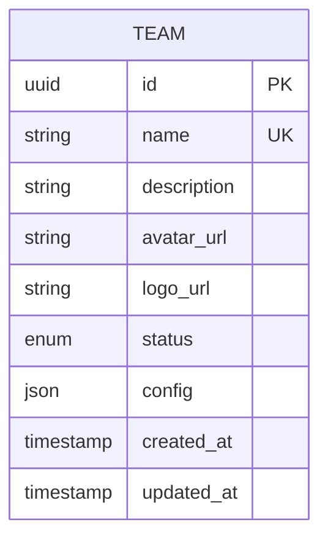
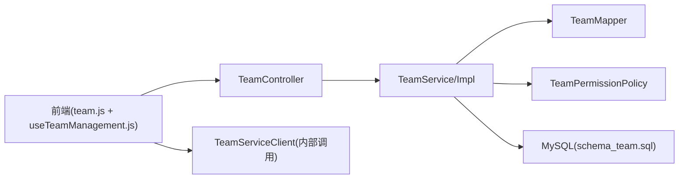

# 团队基础管理

<cite>
**本文引用的文件**   
- [schema_team.sql](file://ZXYZdatabaseBack/sql/schema_team.sql)
- [zxyz-team-service/pom.xml](file://ZXYZdatabaseBack/zxyz-team-service/pom.xml)
- [ZxyzTeamServiceApplication.java](file://ZXYZdatabaseBack/zxyz-team-service/src/main/java/uno/acloud/team/ZxyzTeamServiceApplication.java)
- [application.yml](file://ZXYZdatabaseBack/zxyz-team-service/src/main/resources/application.yml)
- [application-dev.yml](file://ZXYZdatabaseBack/zxyz-team-service/src/main/resources/application-dev.yml)
- [application-prod.yml](file://ZXYZdatabaseBack/zxyz-team-service/src/main/resources/application-prod.yml)
- [TeamController.java](file://ZXYZdatabaseBack/zxyz-team-service/src/main/java/uno/acloud/team/controller/TeamController.java)
- [TeamService.java](file://ZXYZdatabaseBack/zxyz-team-service/src/main/java/uno/acloud/team/service/TeamService.java)
- [TeamServiceImpl.java](file://ZXYZdatabaseBack/zxyz-team-service/src/main/java/uno/acloud/team/service/impl/TeamServiceImpl.java)
- [TeamMapper.java](file://ZXYZdatabaseBack/zxyz-team-service/src/main/java/uno/acloud/team/mapper/TeamMapper.java)
- [TeamEntity.java](file://ZXYZdatabaseBack/zxyz-team-service/src/main/java/uno/acloud/team/entity/TeamEntity.java)
- [TeamCreateDTO.java](file://ZXYZdatabaseBack/zxyz-team-service/src/main/java/uno/acloud/team/dto/request/TeamCreateDTO.java)
- [TeamUpdateDTO.java](file://ZXYZdatabaseBack/zxyz-team-service/src/main/java/uno/acloud/team/dto/request/TeamUpdateDTO.java)
- [TeamVO.java](file://ZXYZdatabaseBack/zxyz-team-service/src/main/java/uno/acloud/team/vo/TeamVO.java)
- [TeamPermissionPolicy.java](file://ZXYZdatabaseBack/zxyz-common/src/main/java/uno/acloud/common/permission/TeamPermissionPolicy.java)
- [TeamServiceClient.java](file://ZXYZdatabaseBack/zxyz-common/src/main/java/uno/acloud/client/TeamServiceClient.java)
- [team.js](file://ZXYZdatabaseFront/src/api/team.js)
- [useTeamManagement.js](file://ZXYZdatabaseFront/src/composables/team/useTeamManagement.js)
- [TeamBasicInfoPanel.vue](file://ZXYZdatabaseFront/src/components/team-settings/TeamBasicInfoPanel.vue)
- [TeamStoragePanel.vue](file://ZXYZdatabaseFront/src/components/team-settings/TeamStoragePanel.vue)
- [TeamSettingDrawer.vue](file://ZXYZdatabaseFront/src/components/TeamSettingDrawer.vue)
- [team.spec.js](file://ZXYZdatabaseFront/src/api/__tests__/team.spec.js)
- [nacos zxyz-team-service.yml](file://nacos-config/zxyz-team-service.yml)
</cite>

## 目录
1. [简介](#简介)
2. [项目结构](#项目结构)
3. [核心组件](#核心组件)
4. [架构总览](#架构总览)
5. [详细组件分析](#详细组件分析)
6. [依赖关系分析](#依赖关系分析)
7. [性能考虑](#性能考虑)
8. [故障排查指南](#故障排查指南)
9. [结论](#结论)
10. [附录](#附录)

## 简介
本文件面向“团队基础管理”功能，覆盖团队创建、编辑、状态管理与配置项，以及前后端交互与错误处理策略。目标读者包括后端开发、前端开发与产品/运维人员，力求以循序渐进的方式呈现系统设计与实现要点，并提供可操作的API调用示例与排错建议。

## 项目结构
围绕团队管理的代码分布在以下模块：
- 数据库层：团队表结构与迁移脚本
- 后端服务：zxyz-team-service（控制器、服务、数据访问、实体、DTO/VO）
- 公共能力：权限策略、服务间客户端
- 前端：API封装、组合式逻辑、设置面板与抽屉、测试用例
- 配置：Nacos 配置与服务本地应用配置

图表来源
- [TeamController.java](file://ZXYZdatabaseBack/zxyz-team-service/src/main/java/uno/acloud/team/controller/TeamController.java)
- [TeamService.java](file://ZXYZdatabaseBack/zxyz-team-service/src/main/java/uno/acloud/team/service/TeamService.java)
- [TeamServiceImpl.java](file://ZXYZdatabaseBack/zxyz-team-service/src/main/java/uno/acloud/team/service/impl/TeamServiceImpl.java)
- [TeamMapper.java](file://ZXYZdatabaseBack/zxyz-team-service/src/main/java/uno/acloud/team/mapper/TeamMapper.java)
- [TeamEntity.java](file://ZXYZdatabaseBack/zxyz-team-service/src/main/java/uno/acloud/team/entity/TeamEntity.java)
- [TeamCreateDTO.java](file://ZXYZdatabaseBack/zxyz-team-service/src/main/java/uno/acloud/team/dto/request/TeamCreateDTO.java)
- [TeamUpdateDTO.java](file://ZXYZdatabaseBack/zxyz-team-service/src/main/java/uno/acloud/team/dto/request/TeamUpdateDTO.java)
- [TeamVO.java](file://ZXYZdatabaseBack/zxyz-team-service/src/main/java/uno/acloud/team/vo/TeamVO.java)
- [TeamPermissionPolicy.java](file://ZXYZdatabaseBack/zxyz-common/src/main/java/uno/acloud/common/permission/TeamPermissionPolicy.java)
- [TeamServiceClient.java](file://ZXYZdatabaseBack/zxyz-common/src/main/java/uno/acloud/client/TeamServiceClient.java)
- [schema_team.sql](file://ZXYZdatabaseBack/sql/schema_team.sql)
- [team.js](file://ZXYZdatabaseFront/src/api/team.js)
- [useTeamManagement.js](file://ZXYZdatabaseFront/src/composables/team/useTeamManagement.js)
- [TeamBasicInfoPanel.vue](file://ZXYZdatabaseFront/src/components/team-settings/TeamBasicInfoPanel.vue)
- [TeamStoragePanel.vue](file://ZXYZdatabaseFront/src/components/team-settings/TeamStoragePanel.vue)
- [TeamSettingDrawer.vue](file://ZXYZdatabaseFront/src/components/TeamSettingDrawer.vue)

章节来源
- [ZxyzTeamServiceApplication.java](file://ZXYZdatabaseBack/zxyz-team-service/src/main/java/uno/acloud/team/ZxyzTeamServiceApplication.java)
- [application.yml](file://ZXYZdatabaseBack/zxyz-team-service/src/main/resources/application.yml)
- [application-dev.yml](file://ZXYZdatabaseBack/zxyz-team-service/src/main/resources/application-dev.yml)
- [application-prod.yml](file://ZXYZdatabaseBack/zxyz-team-service/src/main/resources/application-prod.yml)
- [nacos zxyz-team-service.yml](file://nacos-config/zxyz-team-service.yml)

## 核心组件
- 控制器层：对外暴露团队CRUD与状态变更的REST接口，统一鉴权与参数校验入口
- 服务层：业务编排，包含唯一性检查、权限策略校验、初始配置注入、头像/Logo上传协调
- 数据访问层：MyBatis Mapper 映射团队实体与查询条件
- 实体与模型：TeamEntity（持久化）、TeamCreateDTO/TeamUpdateDTO（入参）、TeamVO（出参投影）
- 权限策略：TeamPermissionPolicy 定义团队级权限判定规则
- 服务间客户端：TeamServiceClient 用于其他服务通过内部端点调用团队能力
- 前端API与组合式逻辑：team.js 封装请求，useTeamManagement.js 组织表单、校验与操作流
- 前端UI：TeamBasicInfoPanel.vue（基本信息编辑）、TeamStoragePanel.vue（存储配额）、TeamSettingDrawer.vue（设置入口）

章节来源
- [TeamController.java](file://ZXYZdatabaseBack/zxyz-team-service/src/main/java/uno/acloud/team/controller/TeamController.java)
- [TeamService.java](file://ZXYZdatabaseBack/zxyz-team-service/src/main/java/uno/acloud/team/service/TeamService.java)
- [TeamServiceImpl.java](file://ZXYZdatabaseBack/zxyz-team-service/src/main/java/uno/acloud/team/service/impl/TeamServiceImpl.java)
- [TeamMapper.java](file://ZXYZdatabaseBack/zxyz-team-service/src/main/java/uno/acloud/team/mapper/TeamMapper.java)
- [TeamEntity.java](file://ZXYZdatabaseBack/zxyz-team-service/src/main/java/uno/acloud/team/entity/TeamEntity.java)
- [TeamCreateDTO.java](file://ZXYZdatabaseBack/zxyz-team-service/src/main/java/uno/acloud/team/dto/request/TeamCreateDTO.java)
- [TeamUpdateDTO.java](file://ZXYZdatabaseBack/zxyz-team-service/src/main/java/uno/acloud/team/dto/request/TeamUpdateDTO.java)
- [TeamVO.java](file://ZXYZdatabaseBack/zxyz-team-service/src/main/java/uno/acloud/team/vo/TeamVO.java)
- [TeamPermissionPolicy.java](file://ZXYZdatabaseBack/zxyz-common/src/main/java/uno/acloud/common/permission/TeamPermissionPolicy.java)
- [TeamServiceClient.java](file://ZXYZdatabaseBack/zxyz-common/src/main/java/uno/acloud/client/TeamServiceClient.java)
- [team.js](file://ZXYZdatabaseFront/src/api/team.js)
- [useTeamManagement.js](file://ZXYZdatabaseFront/src/composables/team/useTeamManagement.js)
- [TeamBasicInfoPanel.vue](file://ZXYZdatabaseFront/src/components/team-settings/TeamBasicInfoPanel.vue)
- [TeamStoragePanel.vue](file://ZXYZdatabaseFront/src/components/team-settings/TeamStoragePanel.vue)
- [TeamSettingDrawer.vue](file://ZXYZdatabaseFront/src/components/TeamSettingDrawer.vue)

## 架构总览
团队管理采用传统分层架构（controller → service → mapper → entity），配合统一的鉴权与响应封装。前端通过Vue组合式API与Element Plus构建界面，使用Pinia进行状态管理，并通过HttpOnly Cookie完成认证。

图表来源
- [TeamController.java](file://ZXYZdatabaseBack/zxyz-team-service/src/main/java/uno/acloud/team/controller/TeamController.java)
- [TeamService.java](file://ZXYZdatabaseBack/zxyz-team-service/src/main/java/uno/acloud/team/service/TeamService.java)
- [TeamServiceImpl.java](file://ZXYZdatabaseBack/zxyz-team-service/src/main/java/uno/acloud/team/service/impl/TeamServiceImpl.java)
- [TeamPermissionPolicy.java](file://ZXYZdatabaseBack/zxyz-common/src/main/java/uno/acloud/common/permission/TeamPermissionPolicy.java)
- [TeamMapper.java](file://ZXYZdatabaseBack/zxyz-team-service/src/main/java/uno/acloud/team/mapper/TeamMapper.java)
- [schema_team.sql](file://ZXYZdatabaseBack/sql/schema_team.sql)

## 详细组件分析

### 团队创建流程
- 表单验证：前端在提交前对名称长度、字符集、描述长度等进行校验；后端在DTO层做二次校验
- 唯一性检查：服务层在保存前查询是否存在同名团队，若存在则返回冲突错误
- 初始配置设置：创建成功后写入默认存储配额、访问控制与安全策略等配置项
- 事务与一致性：创建过程保证团队记录与初始配置的一致性

图表来源
- [TeamCreateDTO.java](file://ZXYZdatabaseBack/zxyz-team-service/src/main/java/uno/acloud/team/dto/request/TeamCreateDTO.java)
- [TeamServiceImpl.java](file://ZXYZdatabaseBack/zxyz-team-service/src/main/java/uno/acloud/team/service/impl/TeamServiceImpl.java)
- [TeamMapper.java](file://ZXYZdatabaseBack/zxyz-team-service/src/main/java/uno/acloud/team/mapper/TeamMapper.java)
- [schema_team.sql](file://ZXYZdatabaseBack/sql/schema_team.sql)

章节来源
- [TeamController.java](file://ZXYZdatabaseBack/zxyz-team-service/src/main/java/uno/acloud/team/controller/TeamController.java)
- [TeamService.java](file://ZXYZdatabaseBack/zxyz-team-service/src/main/java/uno/acloud/team/service/TeamService.java)
- [TeamServiceImpl.java](file://ZXYZdatabaseBack/zxyz-team-service/src/main/java/uno/acloud/team/service/impl/TeamServiceImpl.java)
- [TeamCreateDTO.java](file://ZXYZdatabaseBack/zxyz-team-service/src/main/java/uno/acloud/team/dto/request/TeamCreateDTO.java)
- [TeamMapper.java](file://ZXYZdatabaseBack/zxyz-team-service/src/main/java/uno/acloud/team/mapper/TeamMapper.java)
- [schema_team.sql](file://ZXYZdatabaseBack/sql/schema_team.sql)

### 团队信息编辑（名称、描述、头像、Logo）
- 名称修改：支持部分字段更新，服务层校验名称合法性与唯一性
- 描述更新：文本长度与内容清洗
- 头像上传与Logo管理：通过文件服务上传，生成URL并回写至团队记录；支持预览与替换
- 并发与幂等：避免重复提交导致的多次覆盖

图表来源
- [TeamController.java](file://ZXYZdatabaseBack/zxyz-team-service/src/main/java/uno/acloud/team/controller/TeamController.java)
- [TeamService.java](file://ZXYZdatabaseBack/zxyz-team-service/src/main/java/uno/acloud/team/service/TeamService.java)
- [TeamServiceImpl.java](file://ZXYZdatabaseBack/zxyz-team-service/src/main/java/uno/acloud/team/service/impl/TeamServiceImpl.java)
- [TeamMapper.java](file://ZXYZdatabaseBack/zxyz-team-service/src/main/java/uno/acloud/team/mapper/TeamMapper.java)
- [TeamEntity.java](file://ZXYZdatabaseBack/zxyz-team-service/src/main/java/uno/acloud/team/entity/TeamEntity.java)

章节来源
- [TeamController.java](file://ZXYZdatabaseBack/zxyz-team-service/src/main/java/uno/acloud/team/controller/TeamController.java)
- [TeamService.java](file://ZXYZdatabaseBack/zxyz-team-service/src/main/java/uno/acloud/team/service/TeamService.java)
- [TeamServiceImpl.java](file://ZXYZdatabaseBack/zxyz-team-service/src/main/java/uno/acloud/team/service/impl/TeamServiceImpl.java)
- [TeamMapper.java](file://ZXYZdatabaseBack/zxyz-team-service/src/main/java/uno/acloud/team/mapper/TeamMapper.java)
- [TeamEntity.java](file://ZXYZdatabaseBack/zxyz-team-service/src/main/java/uno/acloud/team/entity/TeamEntity.java)

### 团队状态管理（激活、暂停、删除）
- 激活：将状态置为活跃，允许成员访问与资源操作
- 暂停：限制新操作，保留历史数据，便于恢复
- 删除：软删除或硬删除策略，需确保关联资源清理或归档
- 生命周期：状态变更需记录审计日志，防止非法切换

图表来源
- [TeamServiceImpl.java](file://ZXYZdatabaseBack/zxyz-team-service/src/main/java/uno/acloud/team/service/impl/TeamServiceImpl.java)
- [TeamMapper.java](file://ZXYZdatabaseBack/zxyz-team-service/src/main/java/uno/acloud/team/mapper/TeamMapper.java)
- [schema_team.sql](file://ZXYZdatabaseBack/sql/schema_team.sql)

章节来源
- [TeamController.java](file://ZXYZdatabaseBack/zxyz-team-service/src/main/java/uno/acloud/team/controller/TeamController.java)
- [TeamService.java](file://ZXYZdatabaseBack/zxyz-team-service/src/main/java/uno/acloud/team/service/TeamService.java)
- [TeamServiceImpl.java](file://ZXYZdatabaseBack/zxyz-team-service/src/main/java/uno/acloud/team/service/impl/TeamServiceImpl.java)
- [TeamMapper.java](file://ZXYZdatabaseBack/zxyz-team-service/src/main/java/uno/acloud/team/mapper/TeamMapper.java)
- [schema_team.sql](file://ZXYZdatabaseBack/sql/schema_team.sql)

### 团队配置文件结构（存储配额、访问控制、安全策略）
- 存储配额：默认容量、上限阈值、告警阈值
- 访问控制：成员角色、权限矩阵、外部共享开关
- 安全策略：密码复杂度、会话超时、IP白名单、审计开关
- 配置生效：热更新或重启后生效，提供预览与回滚

图表来源
- [schema_team.sql](file://ZXYZdatabaseBack/sql/schema_team.sql)

章节来源
- [schema_team.sql](file://ZXYZdatabaseBack/sql/schema_team.sql)

### API 调用示例（CRUD）
以下为典型请求与响应格式说明（基于统一Result<T>结构，code=1表示成功）：
- 创建团队
  - 请求：POST /api/internal/team/create
  - 请求体：{ name, description, initialConfig }
  - 响应：{ code, message, data: TeamVO }
- 更新团队信息
  - 请求：PUT /api/internal/team/update
  - 请求体：{ id, name?, description?, avatarUrl?, logoUrl? }
  - 响应：{ code, message, data: TeamVO }
- 获取团队详情
  - 请求：GET /api/internal/team/{id}
  - 响应：{ code, message, data: TeamVO }
- 状态变更（激活/暂停/删除）
  - 请求：PATCH /api/internal/team/status
  - 请求体：{ id, status }
  - 响应：{ code, message, data: TeamVO }

章节来源
- [TeamController.java](file://ZXYZdatabaseBack/zxyz-team-service/src/main/java/uno/acloud/team/controller/TeamController.java)
- [TeamVO.java](file://ZXYZdatabaseBack/zxyz-team-service/src/main/java/uno/acloud/team/vo/TeamVO.java)
- [team.js](file://ZXYZdatabaseFront/src/api/team.js)

### 错误处理策略
- 重复团队名检测：唯一性校验失败时返回明确错误码与消息
- 权限验证失败：无操作权限时拒绝并提示所需角色
- 资源不存在：ID无效或已被删除时返回相应错误
- 统一异常处理：全局拦截器捕获异常并转换为标准Result结构

章节来源
- [TeamServiceImpl.java](file://ZXYZdatabaseBack/zxyz-team-service/src/main/java/uno/acloud/team/service/impl/TeamServiceImpl.java)
- [TeamPermissionPolicy.java](file://ZXYZdatabaseBack/zxyz-common/src/main/java/uno/acloud/common/permission/TeamPermissionPolicy.java)

### 用户体验优化
- 实时预览：头像/Logo上传后立即预览
- 自动保存：输入防抖与草稿缓存，减少重复提交
- 批量操作：支持多选团队的批量状态变更与导出
- 反馈机制：成功/失败提示与操作历史

章节来源
- [TeamBasicInfoPanel.vue](file://ZXYZdatabaseFront/src/components/team-settings/TeamBasicInfoPanel.vue)
- [TeamStoragePanel.vue](file://ZXYZdatabaseFront/src/components/team-settings/TeamStoragePanel.vue)
- [TeamSettingDrawer.vue](file://ZXYZdatabaseFront/src/components/TeamSettingDrawer.vue)
- [useTeamManagement.js](file://ZXYZdatabaseFront/src/composables/team/useTeamManagement.js)
- [team.spec.js](file://ZXYZdatabaseFront/src/api/__tests__/team.spec.js)

## 依赖关系分析
- 控制器依赖服务层，服务层依赖Mapper与权限策略
- 前端依赖API封装与组合式逻辑，组合式逻辑再调用API
- 服务间调用通过TeamServiceClient访问内部端点
- 配置由Nacos集中管理，服务启动加载

图表来源
- [team.js](file://ZXYZdatabaseFront/src/api/team.js)
- [useTeamManagement.js](file://ZXYZdatabaseFront/src/composables/team/useTeamManagement.js)
- [TeamController.java](file://ZXYZdatabaseBack/zxyz-team-service/src/main/java/uno/acloud/team/controller/TeamController.java)
- [TeamService.java](file://ZXYZdatabaseBack/zxyz-team-service/src/main/java/uno/acloud/team/service/TeamService.java)
- [TeamServiceImpl.java](file://ZXYZdatabaseBack/zxyz-team-service/src/main/java/uno/acloud/team/service/impl/TeamServiceImpl.java)
- [TeamMapper.java](file://ZXYZdatabaseBack/zxyz-team-service/src/main/java/uno/acloud/team/mapper/TeamMapper.java)
- [TeamPermissionPolicy.java](file://ZXYZdatabaseBack/zxyz-common/src/main/java/uno/acloud/common/permission/TeamPermissionPolicy.java)
- [TeamServiceClient.java](file://ZXYZdatabaseBack/zxyz-common/src/main/java/uno/acloud/client/TeamServiceClient.java)
- [schema_team.sql](file://ZXYZdatabaseBack/sql/schema_team.sql)

章节来源
- [nacos zxyz-team-service.yml](file://nacos-config/zxyz-team-service.yml)
- [application.yml](file://ZXYZdatabaseBack/zxyz-team-service/src/main/resources/application.yml)
- [application-dev.yml](file://ZXYZdatabaseBack/zxyz-team-service/src/main/resources/application-dev.yml)
- [application-prod.yml](file://ZXYZdatabaseBack/zxyz-team-service/src/main/resources/application-prod.yml)

## 性能考虑
- 数据库索引：对团队名称、状态等高频查询字段建立索引
- 缓存策略：团队详情与配置项可短期缓存，降低热点读取压力
- 异步处理：头像/Logo上传与通知发送采用异步队列
- 限流与熔断：对内部端点实施限流，避免雪崩

[本节为通用指导，不直接分析具体文件]

## 故障排查指南
- 常见错误
  - 重复团队名：检查唯一性校验与数据库约束
  - 权限不足：确认当前用户角色与TeamPermissionPolicy规则
  - 资源不存在：核对ID有效性及软删除状态
- 调试步骤
  - 查看网关日志与SaToken校验结果
  - 检查服务层异常堆栈与事务回滚情况
  - 验证Mapper SQL与数据库约束
- 工具与命令
  - 使用本地/测试环境快速复现
  - 开启详细日志级别定位问题

章节来源
- [TeamServiceImpl.java](file://ZXYZdatabaseBack/zxyz-team-service/src/main/java/uno/acloud/team/service/impl/TeamServiceImpl.java)
- [TeamPermissionPolicy.java](file://ZXYZdatabaseBack/zxyz-common/src/main/java/uno/acloud/common/permission/TeamPermissionPolicy.java)
- [TeamMapper.java](file://ZXYZdatabaseBack/zxyz-team-service/src/main/java/uno/acloud/team/mapper/TeamMapper.java)
- [application.yml](file://ZXYZdatabaseBack/zxyz-team-service/src/main/resources/application.yml)

## 结论
团队基础管理功能通过清晰的分层架构与严格的权限策略，实现了从创建到编辑、状态变更与配置管理的完整闭环。前端提供了良好的交互体验与错误反馈，后端保证了数据一致性与安全性。建议在后续迭代中持续优化性能与可用性，完善监控与审计能力。

[本节为总结，不直接分析具体文件]

## 附录
- 相关模块与入口
  - 后端服务入口：ZxyzTeamServiceApplication.java
  - 服务配置：application.yml、application-dev.yml、application-prod.yml
  - Nacos配置：zxyz-team-service.yml
- 前端测试与用例
  - team.spec.js 覆盖主要API场景

章节来源
- [ZxyzTeamServiceApplication.java](file://ZXYZdatabaseBack/zxyz-team-service/src/main/java/uno/acloud/team/ZxyzTeamServiceApplication.java)
- [application.yml](file://ZXYZdatabaseBack/zxyz-team-service/src/main/resources/application.yml)
- [application-dev.yml](file://ZXYZdatabaseBack/zxyz-team-service/src/main/resources/application-dev.yml)
- [application-prod.yml](file://ZXYZdatabaseBack/zxyz-team-service/src/main/resources/application-prod.yml)
- [nacos zxyz-team-service.yml](file://nacos-config/zxyz-team-service.yml)
- [team.spec.js](file://ZXYZdatabaseFront/src/api/__tests__/team.spec.js)