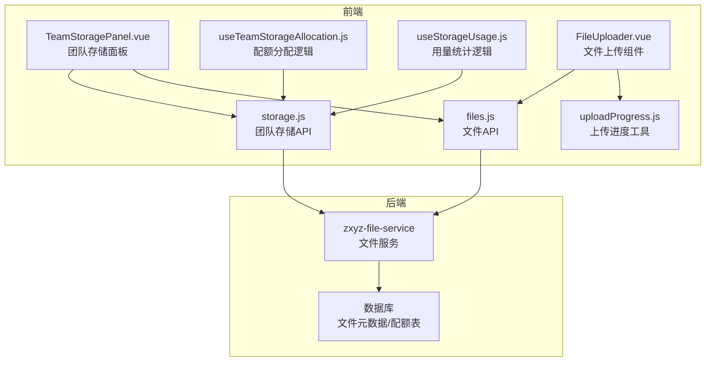
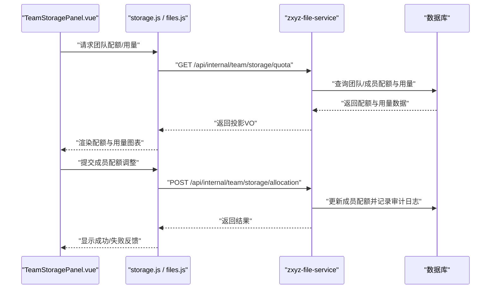
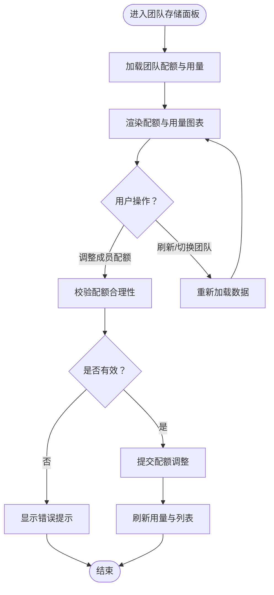
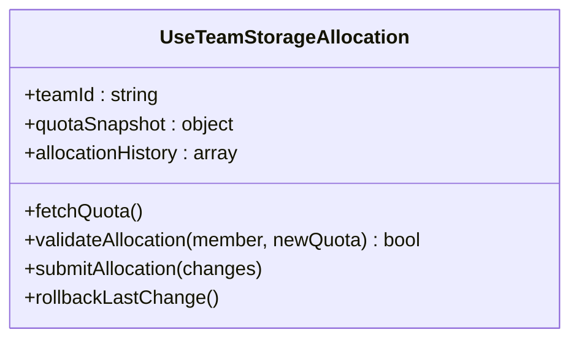
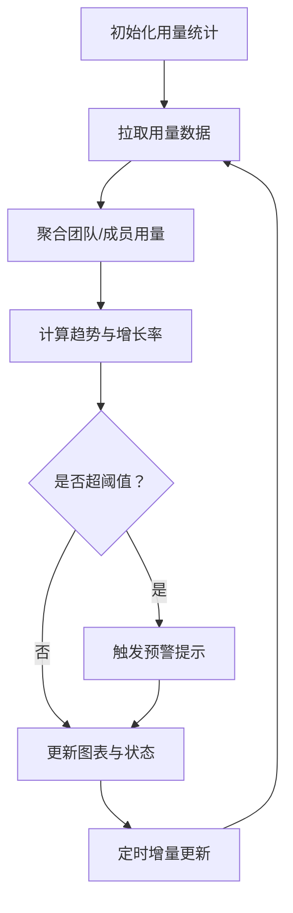
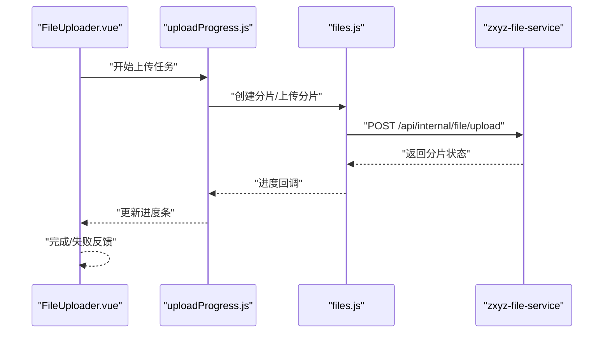
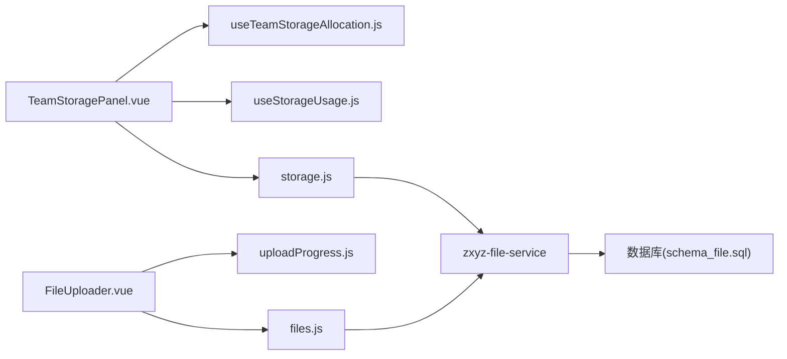

# 团队存储管理

<cite>
**本文引用的文件**   
- [storage.js](file://ZXYZdatabaseFront/src/api/storage.js)
- [TeamStoragePanel.vue](file://ZXYZdatabaseFront/src/components/team-settings/TeamStoragePanel.vue)
- [useTeamStorageAllocation.js](file://ZXYZdatabaseFront/src/composables/team/useTeamStorageAllocation.js)
- [useStorageUsage.js](file://ZXYZdatabaseFront/src/composables/useStorageUsage.js)
- [files.js](file://ZXYZdatabaseFront/src/api/files.js)
- [FileUploader.vue](file://ZXYZdatabaseFront/src/components/uploader/FileUploader.vue)
- [uploadProgress.js](file://ZXYZdatabaseFront/src/utils/uploadProgress.js)
- [application.yml](file://ZXYZdatabaseBack/zxyz-file-service/src/main/resources/application.yml)
- [schema_file.sql](file://ZXYZdatabaseBack/sql/schema_file.sql)
- [api-contract.md](file://docs/api-contract.md)
- [architecture.md](file://docs/architecture.md)
</cite>

## 目录
1. [简介](#简介)
2. [项目结构](#项目结构)
3. [核心组件](#核心组件)
4. [架构总览](#架构总览)
5. [详细组件分析](#详细组件分析)
6. [依赖关系分析](#依赖关系分析)
7. [性能考虑](#性能考虑)
8. [故障排查指南](#故障排查指南)
9. [结论](#结论)
10. [附录](#附录)

## 简介
本文件面向“团队存储管理”功能，覆盖以下目标：
- 存储配额管理：总配额设置、成员配额分配与使用量统计
- 存储监控：实时使用率、增长趋势分析与容量预警
- 存储分配策略：固定配额、弹性扩容与回收机制
- 存储审计：大文件分析、热点文件识别与清理建议
- API 调用示例：配额查询、分配调整与统计报表的请求/响应格式
- 性能优化：异步计算、增量更新与缓存策略
- 用户体验：可视化图表、进度提示与操作反馈

## 项目结构
围绕团队存储的前后端关键位置如下：
- 前端 API 层：storage.js（团队存储相关接口）、files.js（文件上传/下载等）
- 前端页面与交互：TeamStoragePanel.vue（团队存储面板）、FileUploader.vue（上传组件）
- 前端逻辑封装：useTeamStorageAllocation.js（配额分配组合式函数）、useStorageUsage.js（用量统计组合式函数）、uploadProgress.js（上传进度）
- 后端配置与数据模型：application.yml（文件服务配置）、schema_file.sql（文件表结构）
- 文档：api-contract.md（API 契约）、architecture.md（架构说明）

**图示来源** 
- [TeamStoragePanel.vue](file://ZXYZdatabaseFront/src/components/team-settings/TeamStoragePanel.vue)
- [useTeamStorageAllocation.js](file://ZXYZdatabaseFront/src/composables/team/useTeamStorageAllocation.js)
- [useStorageUsage.js](file://ZXYZdatabaseFront/src/composables/useStorageUsage.js)
- [FileUploader.vue](file://ZXYZdatabaseFront/src/components/uploader/FileUploader.vue)
- [uploadProgress.js](file://ZXYZdatabaseFront/src/utils/uploadProgress.js)
- [storage.js](file://ZXYZdatabaseFront/src/api/storage.js)
- [files.js](file://ZXYZdatabaseFront/src/api/files.js)
- [application.yml](file://ZXYZdatabaseBack/zxyz-file-service/src/main/resources/application.yml)
- [schema_file.sql](file://ZXYZdatabaseBack/sql/schema_file.sql)

**章节来源**
- [storage.js](file://ZXYZdatabaseFront/src/api/storage.js)
- [TeamStoragePanel.vue](file://ZXYZdatabaseFront/src/components/team-settings/TeamStoragePanel.vue)
- [useTeamStorageAllocation.js](file://ZXYZdatabaseFront/src/composables/team/useTeamStorageAllocation.js)
- [useStorageUsage.js](file://ZXYZdatabaseFront/src/composables/useStorageUsage.js)
- [files.js](file://ZXYZdatabaseFront/src/api/files.js)
- [FileUploader.vue](file://ZXYZdatabaseFront/src/components/uploader/FileUploader.vue)
- [uploadProgress.js](file://ZXYZdatabaseFront/src/utils/uploadProgress.js)
- [application.yml](file://ZXYZdatabaseBack/zxyz-file-service/src/main/resources/application.yml)
- [schema_file.sql](file://ZXYZdatabaseBack/sql/schema_file.sql)

## 核心组件
- 团队存储面板（TeamStoragePanel.vue）：提供总配额设置、成员配额分配、用量概览与操作入口。
- 配额分配组合式（useTeamStorageAllocation.js）：封装配额查询、分配、校验与本地状态同步。
- 用量统计组合式（useStorageUsage.js）：聚合团队/成员用量、计算占比与趋势指标。
- 文件上传（FileUploader.vue + uploadProgress.js）：实现分片/断点续传、进度展示与失败重试。
- 存储 API（storage.js）：团队维度配额与统计接口；文件 API（files.js）：文件上传/下载/删除等。

**章节来源**
- [TeamStoragePanel.vue](file://ZXYZdatabaseFront/src/components/team-settings/TeamStoragePanel.vue)
- [useTeamStorageAllocation.js](file://ZXYZdatabaseFront/src/composables/team/useTeamStorageAllocation.js)
- [useStorageUsage.js](file://ZXYZdatabaseFront/src/composables/useStorageUsage.js)
- [FileUploader.vue](file://ZXYZdatabaseFront/src/components/uploader/FileUploader.vue)
- [uploadProgress.js](file://ZXYZdatabaseFront/src/utils/uploadProgress.js)
- [storage.js](file://ZXYZdatabaseFront/src/api/storage.js)
- [files.js](file://ZXYZdatabaseFront/src/api/files.js)

## 架构总览
整体采用前后端分离与微服务架构：
- 前端通过 storage.js 与 files.js 调用后端文件服务（zxyz-file-service）。
- 文件服务负责配额校验、用量统计、文件元数据管理与与对象存储的集成。
- 数据库持久化文件与配额相关元数据。

**图示来源** 
- [TeamStoragePanel.vue](file://ZXYZdatabaseFront/src/components/team-settings/TeamStoragePanel.vue)
- [storage.js](file://ZXYZdatabaseFront/src/api/storage.js)
- [files.js](file://ZXYZdatabaseFront/src/api/files.js)
- [application.yml](file://ZXYZdatabaseBack/zxyz-file-service/src/main/resources/application.yml)
- [schema_file.sql](file://ZXYZdatabaseBack/sql/schema_file.sql)

## 详细组件分析

### 团队存储面板（TeamStoragePanel.vue）
- 职责：展示团队总配额、已用/剩余空间、成员配额列表与调整表单；触发配额调整与刷新用量。
- 交互流程：
  - 初始化时拉取团队配额与用量汇总。
  - 用户修改成员配额后，进行合法性校验（不超过团队剩余可分配额度）。
  - 提交调整后刷新用量与成员配额列表。
- 错误处理：对网络异常与业务错误进行统一提示，支持重试。

**图示来源** 
- [TeamStoragePanel.vue](file://ZXYZdatabaseFront/src/components/team-settings/TeamStoragePanel.vue)
- [useTeamStorageAllocation.js](file://ZXYZdatabaseFront/src/composables/team/useTeamStorageAllocation.js)
- [useStorageUsage.js](file://ZXYZdatabaseFront/src/composables/useStorageUsage.js)

**章节来源**
- [TeamStoragePanel.vue](file://ZXYZdatabaseFront/src/components/team-settings/TeamStoragePanel.vue)
- [useTeamStorageAllocation.js](file://ZXYZdatabaseFront/src/composables/team/useTeamStorageAllocation.js)
- [useStorageUsage.js](file://ZXYZdatabaseFront/src/composables/useStorageUsage.js)

### 配额分配组合式（useTeamStorageAllocation.js）
- 职责：封装配额查询、分配、校验与状态同步；维护本地配额快照与变更历史。
- 关键点：
  - 分配前检查团队剩余可分配额度与成员当前用量。
  - 支持批量调整与回滚。
  - 与后端投影 VO 映射，避免胖 DTO。

**图示来源** 
- [useTeamStorageAllocation.js](file://ZXYZdatabaseFront/src/composables/team/useTeamStorageAllocation.js)

**章节来源**
- [useTeamStorageAllocation.js](file://ZXYZdatabaseFront/src/composables/team/useTeamStorageAllocation.js)

### 用量统计组合式（useStorageUsage.js）
- 职责：聚合团队与成员用量，计算占比、趋势与预警阈值。
- 关键点：
  - 增量更新：基于事件或轮询差异更新用量。
  - 趋势分析：按时间窗口计算增长率与峰值。
  - 预警：超过阈值时触发告警提示。

**图示来源** 
- [useStorageUsage.js](file://ZXYZdatabaseFront/src/composables/useStorageUsage.js)

**章节来源**
- [useStorageUsage.js](file://ZXYZdatabaseFront/src/composables/useStorageUsage.js)

### 文件上传（FileUploader.vue + uploadProgress.js）
- 职责：实现文件上传、进度展示、失败重试与断点续传。
- 关键点：
  - 分片上传与并发控制。
  - 上传进度实时更新到 UI。
  - 失败自动重试与用户可取消。

**图示来源** 
- [FileUploader.vue](file://ZXYZdatabaseFront/src/components/uploader/FileUploader.vue)
- [uploadProgress.js](file://ZXYZdatabaseFront/src/utils/uploadProgress.js)
- [files.js](file://ZXYZdatabaseFront/src/api/files.js)
- [application.yml](file://ZXYZdatabaseBack/zxyz-file-service/src/main/resources/application.yml)

**章节来源**
- [FileUploader.vue](file://ZXYZdatabaseFront/src/components/uploader/FileUploader.vue)
- [uploadProgress.js](file://ZXYZdatabaseFront/src/utils/uploadProgress.js)
- [files.js](file://ZXYZdatabaseFront/src/api/files.js)

## 依赖关系分析
- 前端模块依赖：
  - TeamStoragePanel.vue 依赖 useTeamStorageAllocation.js 与 useStorageUsage.js。
  - FileUploader.vue 依赖 uploadProgress.js 与 files.js。
  - storage.js 与 files.js 作为 API 层，统一封装 HTTP 请求。
- 后端依赖：
  - zxyz-file-service 依赖数据库（schema_file.sql）与对象存储（由 application.yml 配置）。
  - 内部端点通过网关鉴权，禁止公网访问。

**图示来源** 
- [TeamStoragePanel.vue](file://ZXYZdatabaseFront/src/components/team-settings/TeamStoragePanel.vue)
- [useTeamStorageAllocation.js](file://ZXYZdatabaseFront/src/composables/team/useTeamStorageAllocation.js)
- [useStorageUsage.js](file://ZXYZdatabaseFront/src/composables/useStorageUsage.js)
- [FileUploader.vue](file://ZXYZdatabaseFront/src/components/uploader/FileUploader.vue)
- [uploadProgress.js](file://ZXYZdatabaseFront/src/utils/uploadProgress.js)
- [storage.js](file://ZXYZdatabaseFront/src/api/storage.js)
- [files.js](file://ZXYZdatabaseFront/src/api/files.js)
- [application.yml](file://ZXYZdatabaseBack/zxyz-file-service/src/main/resources/application.yml)
- [schema_file.sql](file://ZXYZdatabaseBack/sql/schema_file.sql)

**章节来源**
- [architecture.md](file://docs/architecture.md)
- [api-contract.md](file://docs/api-contract.md)

## 性能考虑
- 异步计算：用量统计与趋势计算在后台执行，避免阻塞主线程。
- 增量更新：基于事件或差异对比减少全量刷新频率。
- 缓存策略：对静态配置与热点配额数据进行短期缓存，降低重复请求。
- 上传优化：分片并发、断点续传与失败重试提升大文件上传稳定性。

[本节为通用指导，不直接分析具体文件]

## 故障排查指南
- 配额调整失败：
  - 检查团队剩余可分配额度与成员用量是否超限。
  - 查看后端日志与数据库事务是否回滚。
- 用量不更新：
  - 确认增量更新任务是否正常调度。
  - 检查事件队列与消费者是否消费成功。
- 上传失败：
  - 验证分片大小与并发限制配置。
  - 查看网络超时与对象存储连接状态。

**章节来源**
- [application.yml](file://ZXYZdatabaseBack/zxyz-file-service/src/main/resources/application.yml)
- [schema_file.sql](file://ZXYZdatabaseBack/sql/schema_file.sql)

## 结论
团队存储管理通过前后端协作实现了配额分配、用量统计、上传监控与审计能力。结合异步计算、增量更新与缓存策略，系统在可用性与性能上达到平衡。后续可进一步引入弹性扩容与自动化回收机制，提升资源利用率与管理效率。

[本节为总结性内容，不直接分析具体文件]

## 附录

### API 调用示例（配额查询、分配调整、统计报表）
以下为典型请求/响应结构说明（字段以类型与含义描述为主，不包含具体代码片段）：

- 配额查询
  - 方法：GET
  - 路径：/api/internal/team/storage/quota
  - 请求参数：teamId（团队ID）
  - 响应体：包含团队总配额、已用空间、剩余空间、成员配额列表（成员ID、名称、配额、已用、占比）

- 配额调整
  - 方法：POST
  - 路径：/api/internal/team/storage/allocation
  - 请求体：changes（数组，每项含 memberIds、newQuota、reason）
  - 响应体：code（状态码）、message（消息）、data（调整结果摘要）

- 统计报表
  - 方法：GET
  - 路径：/api/internal/team/storage/report
  - 请求参数：teamId、timeRange（时间范围）、granularity（粒度：日/周/月）
  - 响应体：usageTrend（时间序列用量）、topFiles（大文件TopN）、hotFiles（热点文件TopN）、recommendations（清理建议）

**章节来源**
- [api-contract.md](file://docs/api-contract.md)
- [storage.js](file://ZXYZdatabaseFront/src/api/storage.js)
- [files.js](file://ZXYZdatabaseFront/src/api/files.js)