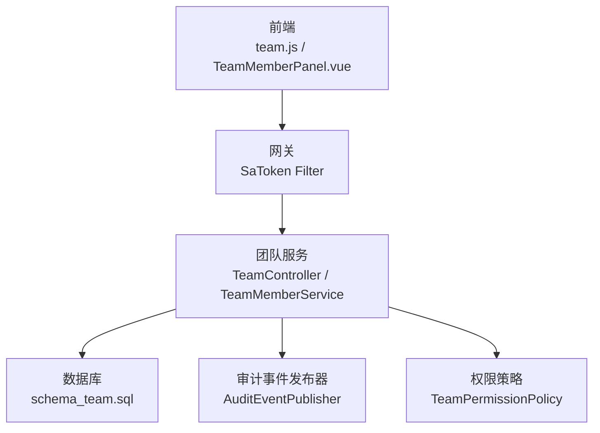
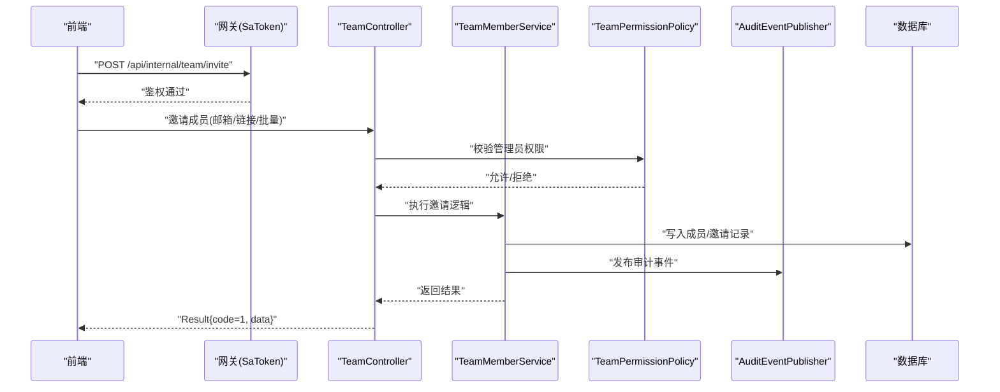
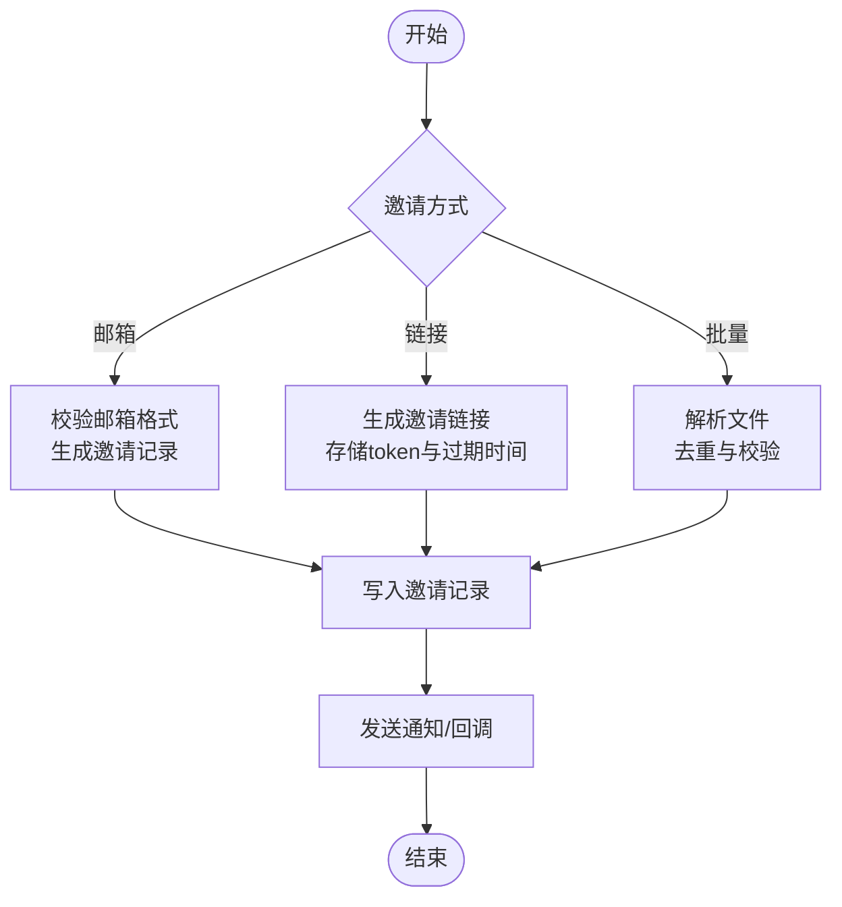
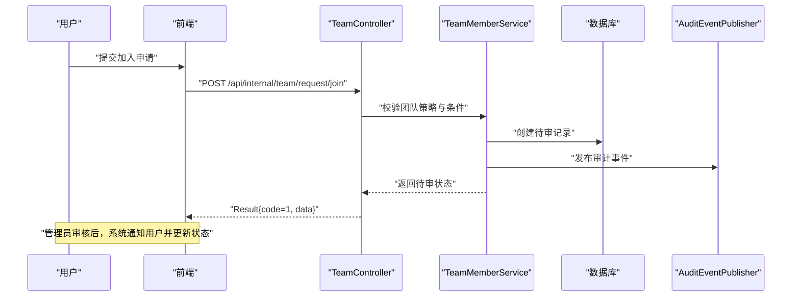
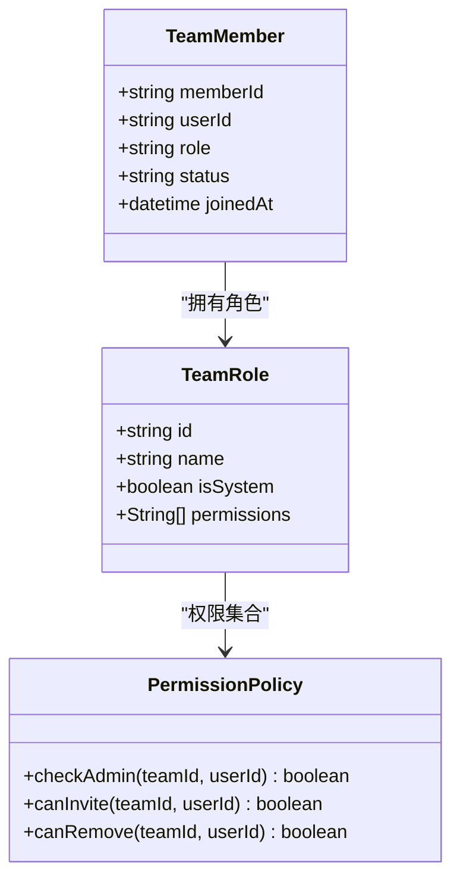
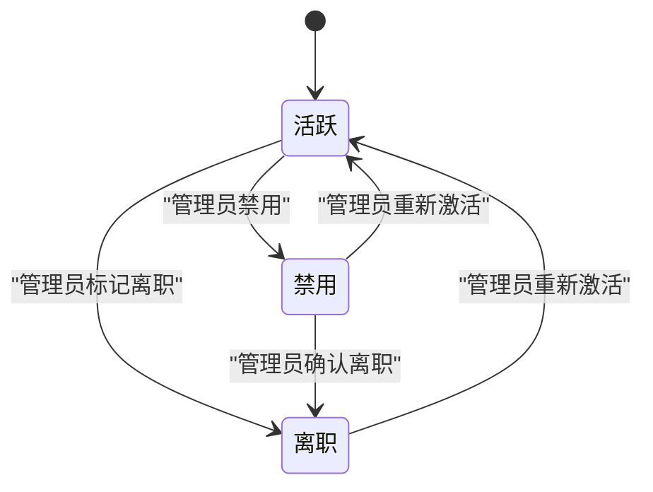
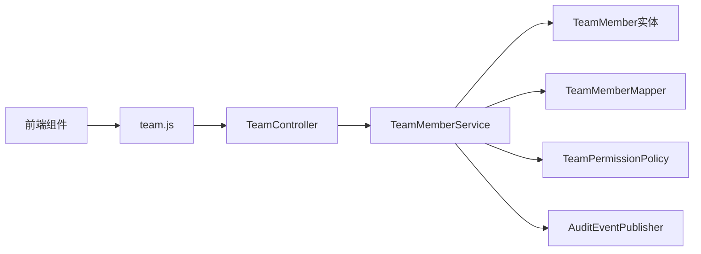

# 团队成员管理

<cite>
**本文引用的文件**   
- [zxyz-team-service/src/main/java/uno/acloud/team/controller/TeamController.java](file://ZXYZdatabaseBack/zxyz-team-service/src/main/java/uno/acloud/team/controller/TeamController.java)
- [zxyz-team-service/src/main/java/uno/acloud/team/service/impl/TeamMemberService.java](file://ZXYZdatabaseBack/zxyz-team-service/src/main/java/uno/acloud/team/service/impl/TeamMemberService.java)
- [zxyz-team-service/src/main/java/uno/acloud/team/entity/TeamMember.java](file://ZXYZdatabaseBack/zxyz-team-service/src/main/java/uno/acloud/team/entity/TeamMember.java)
- [zxyz-team-service/src/main/java/uno/acloud/team/mapper/TeamMemberMapper.java](file://ZXYZdatabaseBack/zxyz-team-service/src/main/java/uno/acloud/team/mapper/TeamMemberMapper.java)
- [zxyz-common/src/main/java/uno/acloud/common/permission/TeamPermissionPolicy.java](file://ZXYZdatabaseBack/zxyz-common/src/main/java/uno/acloud/common/permission/TeamPermissionPolicy.java)
- [zxyz-common/src/main/java/uno/acloud/common/event/AuditEventPublisher.java](file://ZXYZdatabaseBack/zxyz-common/src/main/java/uno/acloud/common/event/AuditEventPublisher.java)
- [ZXYZdatabaseFront/src/api/team.js](file://ZXYZdatabaseFront/src/api/team.js)
- [ZXYZdatabaseFront/src/components/team-settings/TeamMemberPanel.vue](file://ZXYZdatabaseFront/src/components/team-settings/TeamMemberPanel.vue)
- [ZXYZdatabaseFront/src/composables/team/useTeamManagement.js](file://ZXYZdatabaseFront/src/composables/team/useTeamManagement.js)
- [ZXYZdatabaseBack/sql/schema_team.sql](file://ZXYZdatabaseBack/sql/schema_team.sql)
</cite>

## 目录
1. [简介](#简介)
2. [项目结构](#项目结构)
3. [核心组件](#核心组件)
4. [架构总览](#架构总览)
5. [详细组件分析](#详细组件分析)
6. [依赖关系分析](#依赖关系分析)
7. [性能考虑](#性能考虑)
8. [故障排查指南](#故障排查指南)
9. [结论](#结论)
10. [附录：API 调用示例与数据模型](#附录api-调用示例与数据模型)

## 简介
本文件面向“团队成员管理”功能，覆盖成员邀请（邮箱邀请、链接邀请、批量导入）、成员审批流程（申请审核、条件判断、通知机制）、角色分配（预设角色、自定义角色、权限继承）、成员状态管理（活跃、禁用、离职、重新激活），以及完整的 API 调用示例、权限控制策略（管理员权限检查、操作审计日志、数据隔离）和用户体验优化（拖拽排序、搜索过滤、实时状态同步）。文档基于后端团队服务、通用权限与审计模块、前端团队设置面板与组合式逻辑进行系统化说明。

## 项目结构
- 后端采用微服务架构，团队相关能力由 zxyz-team-service 提供，权限与审计由 zxyz-common 提供；前端通过 Vue 3 + Element Plus 实现团队设置界面与交互。
- 数据库脚本位于 sql/schema_team.sql，定义团队、成员、角色等核心表结构。
- 前端 API 封装在 ZXYZdatabaseFront/src/api/team.js，页面组件集中在 components/team-settings，业务逻辑封装在 composables/team/useTeamManagement.js。

图表来源
- [zxyz-team-service/src/main/java/uno/acloud/team/controller/TeamController.java](file://ZXYZdatabaseBack/zxyz-team-service/src/main/java/uno/acloud/team/controller/TeamController.java)
- [zxyz-team-service/src/main/java/uno/acloud/team/service/impl/TeamMemberService.java](file://ZXYZdatabaseBack/zxyz-team-service/src/main/java/uno/acloud/team/service/impl/TeamMemberService.java)
- [zxyz-common/src/main/java/uno/acloud/common/event/AuditEventPublisher.java](file://ZXYZdatabaseBack/zxyz-common/src/main/java/uno/acloud/common/event/AuditEventPublisher.java)
- [zxyz-common/src/main/java/uno/acloud/common/permission/TeamPermissionPolicy.java](file://ZXYZdatabaseBack/zxyz-common/src/main/java/uno/acloud/common/permission/TeamPermissionPolicy.java)
- [ZXYZdatabaseBack/sql/schema_team.sql](file://ZXYZdatabaseBack/sql/schema_team.sql)
- [ZXYZdatabaseFront/src/api/team.js](file://ZXYZdatabaseFront/src/api/team.js)
- [ZXYZdatabaseFront/src/components/team-settings/TeamMemberPanel.vue](file://ZXYZdatabaseFront/src/components/team-settings/TeamMemberPanel.vue)

章节来源
- [ZXYZdatabaseBack/sql/schema_team.sql](file://ZXYZdatabaseBack/sql/schema_team.sql)
- [ZXYZdatabaseFront/src/api/team.js](file://ZXYZdatabaseFront/src/api/team.js)
- [ZXYZdatabaseFront/src/components/team-settings/TeamMemberPanel.vue](file://ZXYZdatabaseFront/src/components/team-settings/TeamMemberPanel.vue)
- [ZXYZdatabaseFront/src/composables/team/useTeamManagement.js](file://ZXYZdatabaseFront/src/composables/team/useTeamManagement.js)

## 核心组件
- 控制器层：对外暴露团队与成员的 REST 接口，负责参数校验、权限检查、结果封装。
- 服务层：实现成员邀请、审批、角色分配、状态变更、批量导入等核心业务逻辑。
- 实体与映射：TeamMember 实体及 Mapper 用于持久化成员信息。
- 权限策略：TeamPermissionPolicy 提供团队维度权限判定（如是否管理员、是否可邀请/移除成员）。
- 审计事件：AuditEventPublisher 统一发布操作审计事件，供审计服务消费。
- 前端 API：team.js 封装 HTTP 请求，返回统一 Result<T> 结构。
- 前端组件：TeamMemberPanel.vue 提供成员列表、邀请、审批、批量操作 UI。
- 组合式逻辑：useTeamManagement.js 封装成员管理的状态与行为（搜索、过滤、拖拽、分页等）。

章节来源
- [zxyz-team-service/src/main/java/uno/acloud/team/controller/TeamController.java](file://ZXYZdatabaseBack/zxyz-team-service/src/main/java/uno/acloud/team/controller/TeamController.java)
- [zxyz-team-service/src/main/java/uno/acloud/team/service/impl/TeamMemberService.java](file://ZXYZdatabaseBack/zxyz-team-service/src/main/java/uno/acloud/team/service/impl/TeamMemberService.java)
- [zxyz-team-service/src/main/java/uno/acloud/team/entity/TeamMember.java](file://ZXYZdatabaseBack/zxyz-team-service/src/main/java/uno/acloud/team/entity/TeamMember.java)
- [zxyz-team-service/src/main/java/uno/acloud/team/mapper/TeamMemberMapper.java](file://ZXYZdatabaseBack/zxyz-team-service/src/main/java/uno/acloud/team/mapper/TeamMemberMapper.java)
- [zxyz-common/src/main/java/uno/acloud/common/permission/TeamPermissionPolicy.java](file://ZXYZdatabaseBack/zxyz-common/src/main/java/uno/acloud/common/permission/TeamPermissionPolicy.java)
- [zxyz-common/src/main/java/uno/acloud/common/event/AuditEventPublisher.java](file://ZXYZdatabaseBack/zxyz-common/src/main/java/uno/acloud/common/event/AuditEventPublisher.java)
- [ZXYZdatabaseFront/src/api/team.js](file://ZXYZdatabaseFront/src/api/team.js)
- [ZXYZdatabaseFront/src/components/team-settings/TeamMemberPanel.vue](file://ZXYZdatabaseFront/src/components/team-settings/TeamMemberPanel.vue)
- [ZXYZdatabaseFront/src/composables/team/useTeamManagement.js](file://ZXYZdatabaseFront/src/composables/team/useTeamManagement.js)

## 架构总览
团队管理涉及前后端协作与跨服务集成：
- 前端通过 team.js 发起请求，调用团队服务内部端点（/api/internal/**），由网关 SaToken 过滤器鉴权。
- 团队服务控制器接收请求后，调用服务层执行业务逻辑，必要时调用权限策略与审计事件发布器。
- 数据持久化通过 Mapper 访问数据库，遵循 schema_team.sql 定义的表结构。
- 异步通知（如邮件邀请、审批结果）可通过消息队列或外部邮件服务完成（本项目中邮件能力由 email-service 提供，但团队服务仅通过事件或客户端间接触发）。

图表来源
- [zxyz-team-service/src/main/java/uno/acloud/team/controller/TeamController.java](file://ZXYZdatabaseBack/zxyz-team-service/src/main/java/uno/acloud/team/controller/TeamController.java)
- [zxyz-team-service/src/main/java/uno/acloud/team/service/impl/TeamMemberService.java](file://ZXYZdatabaseBack/zxyz-team-service/src/main/java/uno/acloud/team/service/impl/TeamMemberService.java)
- [zxyz-common/src/main/java/uno/acloud/common/permission/TeamPermissionPolicy.java](file://ZXYZdatabaseBack/zxyz-common/src/main/java/uno/acloud/common/permission/TeamPermissionPolicy.java)
- [zxyz-common/src/main/java/uno/acloud/common/event/AuditEventPublisher.java](file://ZXYZdatabaseBack/zxyz-common/src/main/java/uno/acloud/common/event/AuditEventPublisher.java)
- [ZXYZdatabaseBack/sql/schema_team.sql](file://ZXYZdatabaseBack/sql/schema_team.sql)

## 详细组件分析

### 成员邀请机制（邮箱邀请、链接邀请、批量导入）
- 邮箱邀请：输入邮箱列表，生成邀请记录并发送邀请邮件（由邮件服务处理），成员接受后加入团队。
- 链接邀请：生成带 token 的邀请链接，用户点击后进入注册/登录流程，再自动加入团队。
- 批量导入：支持上传 CSV/Excel，解析后进行去重、校验、批量写入，失败项返回明细。

图表来源
- [zxyz-team-service/src/main/java/uno/acloud/team/service/impl/TeamMemberService.java](file://ZXYZdatabaseBack/zxyz-team-service/src/main/java/uno/acloud/team/service/impl/TeamMemberService.java)
- [zxyz-team-service/src/main/java/uno/acloud/team/mapper/TeamMemberMapper.java](file://ZXYZdatabaseBack/zxyz-team-service/src/main/java/uno/acloud/team/mapper/TeamMemberMapper.java)
- [ZXYZdatabaseBack/sql/schema_team.sql](file://ZXYZdatabaseBack/sql/schema_team.sql)

章节来源
- [zxyz-team-service/src/main/java/uno/acloud/team/service/impl/TeamMemberService.java](file://ZXYZdatabaseBack/zxyz-team-service/src/main/java/uno/acloud/team/service/impl/TeamMemberService.java)
- [zxyz-team-service/src/main/java/uno/acloud/team/mapper/TeamMemberMapper.java](file://ZXYZdatabaseBack/zxyz-team-service/src/main/java/uno/acloud/team/mapper/TeamMemberMapper.java)
- [ZXYZdatabaseBack/sql/schema_team.sql](file://ZXYZdatabaseBack/sql/schema_team.sql)

### 成员审批流程（申请审核、条件判断、通知机制）
- 申请审核：成员提交加入申请后，系统创建待审记录，管理员在后台进行审核。
- 条件判断：根据团队策略（如是否需要邀请码、是否开放注册）决定是否允许直接加入或需审批。
- 通知机制：审批通过后，向申请人发送通知（站内信/邮件），并更新成员状态为“活跃”。

图表来源
- [zxyz-team-service/src/main/java/uno/acloud/team/controller/TeamController.java](file://ZXYZdatabaseBack/zxyz-team-service/src/main/java/uno/acloud/team/controller/TeamController.java)
- [zxyz-team-service/src/main/java/uno/acloud/team/service/impl/TeamMemberService.java](file://ZXYZdatabaseBack/zxyz-team-service/src/main/java/uno/acloud/team/service/impl/TeamMemberService.java)
- [zxyz-common/src/main/java/uno/acloud/common/event/AuditEventPublisher.java](file://ZXYZdatabaseBack/zxyz-common/src/main/java/uno/acloud/common/event/AuditEventPublisher.java)
- [ZXYZdatabaseBack/sql/schema_team.sql](file://ZXYZdatabaseBack/sql/schema_team.sql)

章节来源
- [zxyz-team-service/src/main/java/uno/acloud/team/controller/TeamController.java](file://ZXYZdatabaseBack/zxyz-team-service/src/main/java/uno/acloud/team/controller/TeamController.java)
- [zxyz-team-service/src/main/java/uno/acloud/team/service/impl/TeamMemberService.java](file://ZXYZdatabaseBack/zxyz-team-service/src/main/java/uno/acloud/team/service/impl/TeamMemberService.java)
- [zxyz-common/src/main/java/uno/acloud/common/event/AuditEventPublisher.java](file://ZXYZdatabaseBack/zxyz-common/src/main/java/uno/acloud/common/event/AuditEventPublisher.java)
- [ZXYZdatabaseBack/sql/schema_team.sql](file://ZXYZdatabaseBack/sql/schema_team.sql)

### 成员角色分配（预设角色、自定义角色、权限继承）
- 预设角色：系统内置角色（如管理员、编辑者、观察者），具备不同权限集合。
- 自定义角色：管理员可创建自定义角色，配置具体权限项。
- 权限继承：成员角色继承团队级别权限，同时可叠加个人角色权限，最终权限取并集。

图表来源
- [zxyz-team-service/src/main/java/uno/acloud/team/entity/TeamMember.java](file://ZXYZdatabaseBack/zxyz-team-service/src/main/java/uno/acloud/team/entity/TeamMember.java)
- [zxyz-common/src/main/java/uno/acloud/common/permission/TeamPermissionPolicy.java](file://ZXYZdatabaseBack/zxyz-common/src/main/java/uno/acloud/common/permission/TeamPermissionPolicy.java)

章节来源
- [zxyz-team-service/src/main/java/uno/acloud/team/entity/TeamMember.java](file://ZXYZdatabaseBack/zxyz-team-service/src/main/java/uno/acloud/team/entity/TeamMember.java)
- [zxyz-common/src/main/java/uno/acloud/common/permission/TeamPermissionPolicy.java](file://ZXYZdatabaseBack/zxyz-common/src/main/java/uno/acloud/common/permission/TeamPermissionPolicy.java)

### 成员状态管理（活跃、禁用、离职、重新激活）
- 活跃：正常参与团队协作。
- 禁用：暂时限制访问，保留历史数据。
- 离职：永久移除协作权限，保留审计记录。
- 重新激活：从禁用或离职状态恢复为活跃（需管理员权限）。

图表来源
- [zxyz-team-service/src/main/java/uno/acloud/team/service/impl/TeamMemberService.java](file://ZXYZdatabaseBack/zxyz-team-service/src/main/java/uno/acloud/team/service/impl/TeamMemberService.java)
- [zxyz-common/src/main/java/uno/acloud/common/permission/TeamPermissionPolicy.java](file://ZXYZdatabaseBack/zxyz-common/src/main/java/uno/acloud/common/permission/TeamPermissionPolicy.java)

章节来源
- [zxyz-team-service/src/main/java/uno/acloud/team/service/impl/TeamMemberService.java](file://ZXYZdatabaseBack/zxyz-team-service/src/main/java/uno/acloud/team/service/impl/TeamMemberService.java)
- [zxyz-common/src/main/java/uno/acloud/common/permission/TeamPermissionPolicy.java](file://ZXYZdatabaseBack/zxyz-common/src/main/java/uno/acloud/common/permission/TeamPermissionPolicy.java)

### 前端体验优化（拖拽排序、搜索过滤、实时状态同步）
- 拖拽排序：成员列表支持拖拽调整顺序，前端维护本地排序状态，必要时同步至后端。
- 搜索过滤：支持按姓名、邮箱、角色、状态筛选，前端缓存查询结果提升响应速度。
- 实时状态同步：通过 WebSocket 或轮询机制，实时更新成员状态变化（如审批通过、被禁用）。

章节来源
- [ZXYZdatabaseFront/src/components/team-settings/TeamMemberPanel.vue](file://ZXYZdatabaseFront/src/components/team-settings/TeamMemberPanel.vue)
- [ZXYZdatabaseFront/src/composables/team/useTeamManagement.js](file://ZXYZdatabaseFront/src/composables/team/useTeamManagement.js)

## 依赖关系分析
- 控制器依赖服务层，服务层依赖实体与映射，权限策略与审计事件作为横切关注点。
- 前端依赖 team.js 提供的 API，组件使用 useTeamManagement.js 管理状态与交互。

图表来源
- [zxyz-team-service/src/main/java/uno/acloud/team/controller/TeamController.java](file://ZXYZdatabaseBack/zxyz-team-service/src/main/java/uno/acloud/team/controller/TeamController.java)
- [zxyz-team-service/src/main/java/uno/acloud/team/service/impl/TeamMemberService.java](file://ZXYZdatabaseBack/zxyz-team-service/src/main/java/uno/acloud/team/service/impl/TeamMemberService.java)
- [zxyz-team-service/src/main/java/uno/acloud/team/entity/TeamMember.java](file://ZXYZdatabaseBack/zxyz-team-service/src/main/java/uno/acloud/team/entity/TeamMember.java)
- [zxyz-team-service/src/main/java/uno/acloud/team/mapper/TeamMemberMapper.java](file://ZXYZdatabaseBack/zxyz-team-service/src/main/java/uno/acloud/team/mapper/TeamMemberMapper.java)
- [zxyz-common/src/main/java/uno/acloud/common/permission/TeamPermissionPolicy.java](file://ZXYZdatabaseBack/zxyz-common/src/main/java/uno/acloud/common/permission/TeamPermissionPolicy.java)
- [zxyz-common/src/main/java/uno/acloud/common/event/AuditEventPublisher.java](file://ZXYZdatabaseBack/zxyz-common/src/main/java/uno/acloud/common/event/AuditEventPublisher.java)
- [ZXYZdatabaseFront/src/api/team.js](file://ZXYZdatabaseFront/src/api/team.js)
- [ZXYZdatabaseFront/src/components/team-settings/TeamMemberPanel.vue](file://ZXYZdatabaseFront/src/components/team-settings/TeamMemberPanel.vue)

章节来源
- [zxyz-team-service/src/main/java/uno/acloud/team/controller/TeamController.java](file://ZXYZdatabaseBack/zxyz-team-service/src/main/java/uno/acloud/team/controller/TeamController.java)
- [zxyz-team-service/src/main/java/uno/acloud/team/service/impl/TeamMemberService.java](file://ZXYZdatabaseBack/zxyz-team-service/src/main/java/uno/acloud/team/service/impl/TeamMemberService.java)
- [ZXYZdatabaseFront/src/api/team.js](file://ZXYZdatabaseFront/src/api/team.js)

## 性能考虑
- 批量导入：建议分片处理与异步任务，避免长事务阻塞。
- 搜索过滤：前端缓存与后端索引结合，减少重复查询。
- 实时同步：优先使用 WebSocket，降级为短轮询。
- 权限检查：缓存团队角色与权限映射，降低频繁计算开销。

[本节为通用指导，不直接分析具体文件]

## 故障排查指南
- 权限错误：检查 SaToken 会话与团队管理员权限。
- 邀请失败：核对邮箱格式、邀请链接有效期、邮件服务配置。
- 审批卡住：查看待审记录与审计日志，确认状态流转。
- 前端状态不同步：检查 WebSocket 连接与轮询间隔。

章节来源
- [zxyz-common/src/main/java/uno/acloud/common/event/AuditEventPublisher.java](file://ZXYZdatabaseBack/zxyz-common/src/main/java/uno/acloud/common/event/AuditEventPublisher.java)
- [ZXYZdatabaseFront/src/composables/team/useTeamManagement.js](file://ZXYZdatabaseFront/src/composables/team/useTeamManagement.js)

## 结论
团队成员管理功能通过清晰的分层架构、严格的权限控制与完善的审计机制，实现了安全的成员邀请、审批、角色分配与状态管理。前端注重用户体验，提供拖拽、搜索与实时同步能力。建议在后续迭代中进一步优化批量操作性能与实时通信稳定性。

[本节为总结性内容，不直接分析具体文件]

## 附录：API 调用示例与数据模型

### API 调用示例（CRUD、角色分配、批量管理）
- 新增成员（邮箱邀请）
  - 方法：POST
  - 路径：/api/internal/team/invite/email
  - 请求体：包含 teamId、emails[]、role
  - 响应：Result{code=1, data={invitationIds}}
- 生成链接邀请
  - 方法：POST
  - 路径：/api/internal/team/invite/link
  - 请求体：包含 teamId、expiresIn、role
  - 响应：Result{code=1, data={link}}
- 批量导入成员
  - 方法：POST
  - 路径：/api/internal/team/import/batch
  - 请求体：multipart/form-data，文件字段 file
  - 响应：Result{code=1, data={successCount, failedItems}}
- 更新成员角色
  - 方法：PUT
  - 路径：/api/internal/team/member/{memberId}/role
  - 请求体：包含 role
  - 响应：Result{code=1}
- 删除成员
  - 方法：DELETE
  - 路径：/api/internal/team/member/{memberId}
  - 响应：Result{code=1}

章节来源
- [ZXYZdatabaseFront/src/api/team.js](file://ZXYZdatabaseFront/src/api/team.js)
- [zxyz-team-service/src/main/java/uno/acloud/team/controller/TeamController.java](file://ZXYZdatabaseBack/zxyz-team-service/src/main/java/uno/acloud/team/controller/TeamController.java)

### 数据模型（成员与角色）
- TeamMember
  - 字段：id、teamId、userId、role、status、joinedAt、updatedAt
- TeamRole
  - 字段：id、name、isSystem、permissions[]

章节来源
- [ZXYZdatabaseBack/sql/schema_team.sql](file://ZXYZdatabaseBack/sql/schema_team.sql)
- [zxyz-team-service/src/main/java/uno/acloud/team/entity/TeamMember.java](file://ZXYZdatabaseBack/zxyz-team-service/src/main/java/uno/acloud/team/entity/TeamMember.java)