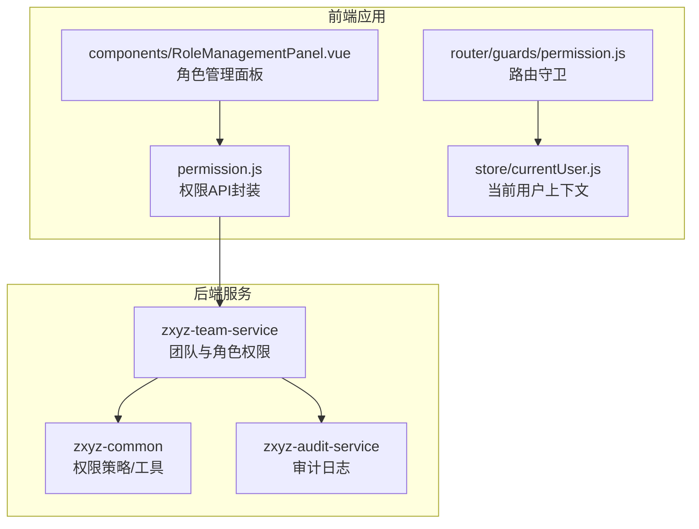
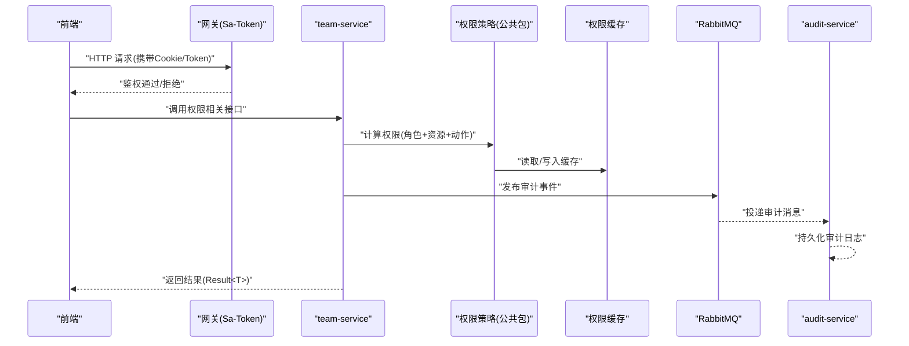
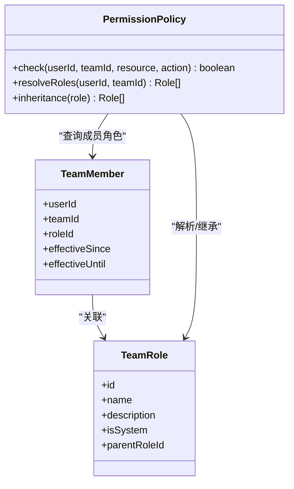
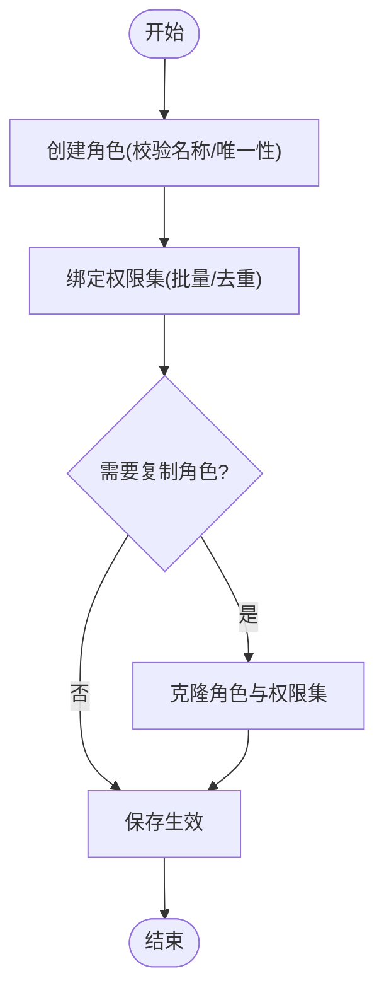
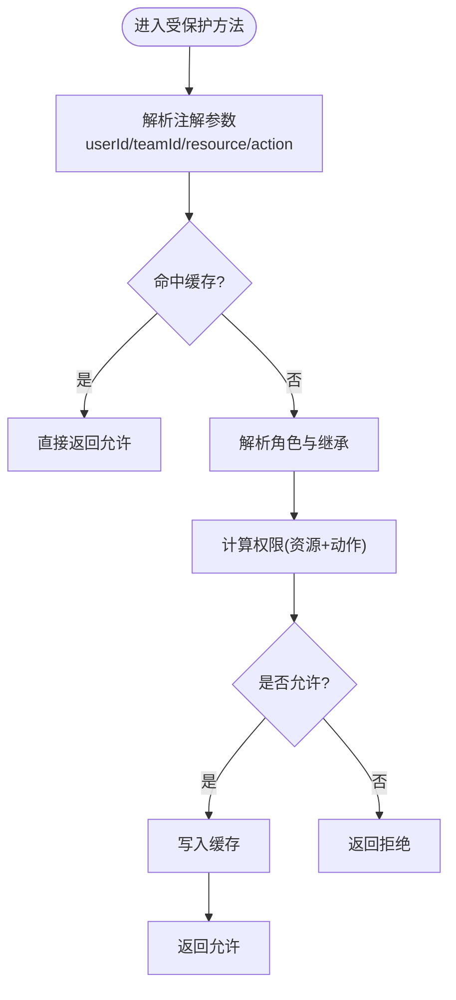
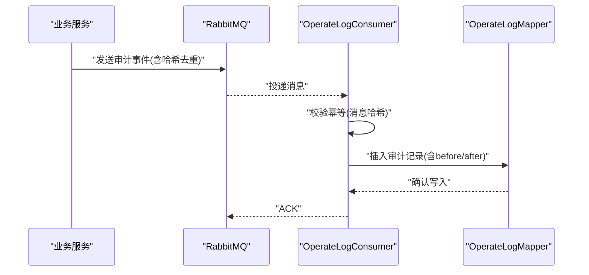
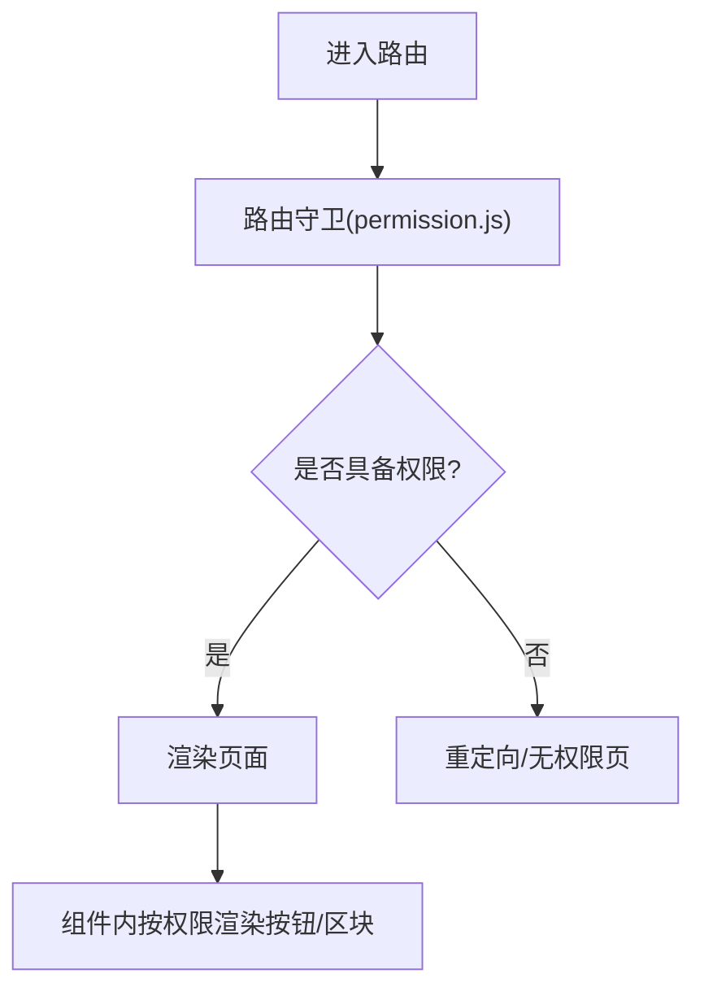
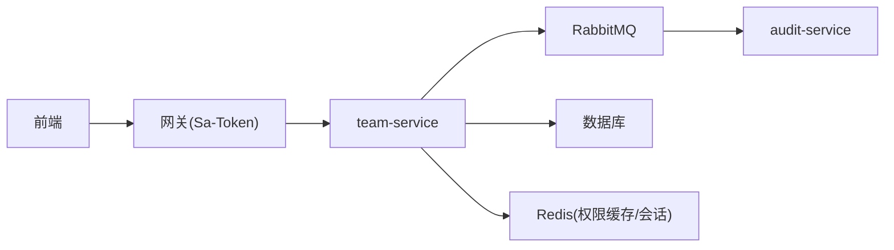

# 团队权限系统

<cite>
**本文引用的文件**   
- [zxyz-team-service/.../ZxyzTeamServiceApplication.java](file://ZXYZdatabaseBack/zxyz-team-service/src/main/java/uno/acloud/team/ZxyzTeamServiceApplication.java)
- [zxyz-team-service/.../controller/TeamController.java](file://ZXYZdatabaseBack/zxyz-team-service/src/main/java/uno/acloud/team/controller/TeamController.java)
- [zxyz-team-service/.../service/impl/TeamServiceImpl.java](file://ZXYZdatabaseBack/zxyz-team-service/src/main/java/uno/acloud/team/service/impl/TeamServiceImpl.java)
- [zxyz-team-service/.../entity/TeamRole.java](file://ZXYZdatabaseBack/zxyz-team-service/src/main/java/uno/acloud/team/entity/TeamRole.java)
- [zxyz-team-service/.../entity/TeamMember.java](file://ZXYZdatabaseBack/zxyz-team-service/src/main/java/uno/acloud/team/entity/TeamMember.java)
- [zxyz-common/.../permission/TeamPermissionPolicy.java](file://ZXYZdatabaseBack/zxyz-common/src/main/java/uno/acloud/common/permission/TeamPermissionPolicy.java)
- [zxyz-common/.../permission/PermissionCheck.java](file://ZXYZdatabaseBack/zxyz-common/src/main/java/uno/acloud/common/permission/PermissionCheck.java)
- [zxyz-common/.../permission/PermissionCache.java](file://ZXYZdatabaseBack/zxyz-common/src/main/java/uno/acloud/common/permission/PermissionCache.java)
- [zxyz-audit-service/.../mq/OperateLogConsumer.java](file://ZXYZdatabaseBack/zxyz-audit-service/src/main/java/uno/acloud/audit/mq/OperateLogConsumer.java)
- [zxyz-audit-service/.../mapper/OperateLogMapper.java](file://ZXYZdatabaseBack/zxyz-audit-service/src/main/java/uno/acloud/audit/mapper/OperateLogMapper.java)
- [sql/schema_audit.sql](file://ZXYZdatabaseBack/sql/schema_audit.sql)
- [nacos-config/zxyz-team-service.yml](file://nacos-config/zxyz-team-service.yml)
- [nacos-config/zxyz-static.yml](file://nacos-config/zxyz-static.yml)
- [ZXYZdatabaseFront/src/api/permission.js](file://ZXYZdatabaseFront/src/api/permission.js)
- [ZXYZdatabaseFront/src/router/guards/permission.js](file://ZXYZdatabaseFront/src/router/guards/permission.js)
- [ZXYZdatabaseFront/src/constants/teamPermissions.js](file://ZXYZdatabaseFront/src/constants/teamPermissions.js)
- [ZXYZdatabaseFront/src/components/RoleManagementPanel.vue](file://ZXYZdatabaseFront/src/components/RoleManagementPanel.vue)
- [ZXYZdatabaseFront/src/store/currentUser.js](file://ZXYZdatabaseFront/src/store/currentUser.js)
</cite>

## 目录
1. [简介](#简介)
2. [项目结构](#项目结构)
3. [核心组件](#核心组件)
4. [架构总览](#架构总览)
5. [详细组件分析](#详细组件分析)
6. [依赖关系分析](#依赖关系分析)
7. [性能考虑](#性能考虑)
8. [故障排查指南](#故障排查指南)
9. [结论](#结论)
10. [附录：API 调用示例与最佳实践](#附录api-调用示例与最佳实践)

## 简介
本文件面向团队权限系统的研发与运维人员，系统性阐述 RBAC（角色-权限）模型在系统中的落地方案，包括用户-角色-权限三层关系、权限继承机制、自定义角色管理（创建、绑定、复制）、注解式与动态权限检查、缓存策略、审计能力（操作记录、变更追踪、合规报告），以及前后端协同的权限控制实践（按钮级、路由守卫、组件渲染）。文档同时给出安全建议与常见问题的排障指引。

## 项目结构
后端采用多模块微服务架构，其中 zxyz-team-service 负责团队与角色权限的核心能力；zxyz-common 提供跨服务的权限策略与工具；zxyz-audit-service 负责审计日志的异步消费与持久化；前端通过 API 层、路由守卫与状态管理实现 UI 侧权限控制。

图表来源
- [zxyz-team-service/.../ZxyzTeamServiceApplication.java](file://ZXYZdatabaseBack/zxyz-team-service/src/main/java/uno/acloud/team/ZxyzTeamServiceApplication.java)
- [zxyz-common/.../permission/TeamPermissionPolicy.java](file://ZXYZdatabaseBack/zxyz-common/src/main/java/uno/acloud/common/permission/TeamPermissionPolicy.java)
- [zxyz-audit-service/.../mq/OperateLogConsumer.java](file://ZXYZdatabaseBack/zxyz-audit-service/src/main/java/uno/acloud/audit/mq/OperateLogConsumer.java)
- [ZXYZdatabaseFront/src/api/permission.js](file://ZXYZdatabaseFront/src/api/permission.js)
- [ZXYZdatabaseFront/src/router/guards/permission.js](file://ZXYZdatabaseFront/src/router/guards/permission.js)
- [ZXYZdatabaseFront/src/store/currentUser.js](file://ZXYZdatabaseFront/src/store/currentUser.js)
- [ZXYZdatabaseFront/src/components/RoleManagementPanel.vue](file://ZXYZdatabaseFront/src/components/RoleManagementPanel.vue)

章节来源
- [zxyz-team-service/.../ZxyzTeamServiceApplication.java](file://ZXYZdatabaseBack/zxyz-team-service/src/main/java/uno/acloud/team/ZxyzTeamServiceApplication.java)
- [nacos-config/zxyz-team-service.yml](file://nacos-config/zxyz-team-service.yml)
- [nacos-config/zxyz-static.yml](file://nacos-config/zxyz-static.yml)

## 核心组件
- 权限模型与实体
  - TeamRole：团队内角色定义，承载角色名、描述、是否内置等元信息。
  - TeamMember：团队成员与角色的关联，支持成员-角色-资源维度的权限判定。
- 权限策略与检查
  - TeamPermissionPolicy：基于 RBAC 的策略计算，支持角色继承与资源维度判断。
  - PermissionCheck：注解式权限校验入口，结合 Sa-Token 完成鉴权拦截。
  - PermissionCache：权限结果缓存，降低重复计算开销。
- 审计能力
  - OperateLogConsumer：监听审计消息并落库。
  - OperateLogMapper：审计日志持久化接口。
  - schema_audit.sql：审计表结构与索引设计。

章节来源
- [zxyz-team-service/.../entity/TeamRole.java](file://ZXYZdatabaseBack/zxyz-team-service/src/main/java/uno/acloud/team/entity/TeamRole.java)
- [zxyz-team-service/.../entity/TeamMember.java](file://ZXYZdatabaseBack/zxyz-team-service/src/main/java/uno/acloud/team/entity/TeamMember.java)
- [zxyz-common/.../permission/TeamPermissionPolicy.java](file://ZXYZdatabaseBack/zxyz-common/src/main/java/uno/acloud/common/permission/TeamPermissionPolicy.java)
- [zxyz-common/.../permission/PermissionCheck.java](file://ZXYZdatabaseBack/zxyz-common/src/main/java/uno/acloud/common/permission/PermissionCheck.java)
- [zxyz-common/.../permission/PermissionCache.java](file://ZXYZdatabaseBack/zxyz-common/src/main/java/uno/acloud/common/permission/PermissionCache.java)
- [zxyz-audit-service/.../mq/OperateLogConsumer.java](file://ZXYZdatabaseBack/zxyz-audit-service/src/main/java/uno/acloud/audit/mq/OperateLogConsumer.java)
- [zxyz-audit-service/.../mapper/OperateLogMapper.java](file://ZXYZdatabaseBack/zxyz-audit-service/src/main/java/uno/acloud/audit/mapper/OperateLogMapper.java)
- [sql/schema_audit.sql](file://ZXYZdatabaseBack/sql/schema_audit.sql)

## 架构总览
RBAC 权限体系贯穿“网关鉴权 → 业务服务策略 → 审计记录”的全链路。Sa-Token 在网关或过滤器层完成会话与令牌校验，业务层通过注解式与动态策略进行细粒度授权，审计服务异步收集关键操作事件，形成可追溯的合规基线。

图表来源
- [zxyz-team-service/.../controller/TeamController.java](file://ZXYZdatabaseBack/zxyz-team-service/src/main/java/uno/acloud/team/controller/TeamController.java)
- [zxyz-common/.../permission/TeamPermissionPolicy.java](file://ZXYZdatabaseBack/zxyz-common/src/main/java/uno/acloud/common/permission/TeamPermissionPolicy.java)
- [zxyz-common/.../permission/PermissionCache.java](file://ZXYZdatabaseBack/zxyz-common/src/main/java/uno/acloud/common/permission/PermissionCache.java)
- [zxyz-audit-service/.../mq/OperateLogConsumer.java](file://ZXYZdatabaseBack/zxyz-audit-service/src/main/java/uno/acloud/audit/mq/OperateLogConsumer.java)

## 详细组件分析

### RBAC 数据模型与继承机制
- 角色与成员关系
  - TeamRole 定义角色元数据，TeamMember 维护成员与角色的映射，支持多角色叠加。
- 权限继承
  - 通过角色层级或标签组合实现继承，策略层在计算时聚合父角色权限，避免硬编码分支。
- 资源与动作
  - 以“资源:动作”形式表达，如“team:member:add”，便于统一枚举与前端常量对齐。

图表来源
- [zxyz-team-service/.../entity/TeamRole.java](file://ZXYZdatabaseBack/zxyz-team-service/src/main/java/uno/acloud/team/entity/TeamRole.java)
- [zxyz-team-service/.../entity/TeamMember.java](file://ZXYZdatabaseBack/zxyz-team-service/src/main/java/uno/acloud/team/entity/TeamMember.java)
- [zxyz-common/.../permission/TeamPermissionPolicy.java](file://ZXYZdatabaseBack/zxyz-common/src/main/java/uno/acloud/common/permission/TeamPermissionPolicy.java)

章节来源
- [zxyz-team-service/.../entity/TeamRole.java](file://ZXYZdatabaseBack/zxyz-team-service/src/main/java/uno/acloud/team/entity/TeamRole.java)
- [zxyz-team-service/.../entity/TeamMember.java](file://ZXYZdatabaseBack/zxyz-team-service/src/main/java/uno/acloud/team/entity/TeamMember.java)
- [zxyz-common/.../permission/TeamPermissionPolicy.java](file://ZXYZdatabaseBack/zxyz-common/src/main/java/uno/acloud/common/permission/TeamPermissionPolicy.java)

### 自定义角色管理（创建、绑定、复制）
- 角色创建
  - 由管理员发起，校验角色名唯一性与命名规范，生成角色标识与默认权限集。
- 权限绑定
  - 将“资源:动作”集合绑定到角色，支持批量导入与冲突检测。
- 角色复制
  - 克隆角色及其权限集，用于快速构建相似角色模板。

图表来源
- [zxyz-team-service/.../controller/TeamController.java](file://ZXYZdatabaseBack/zxyz-team-service/src/main/java/uno/acloud/team/controller/TeamController.java)
- [zxyz-team-service/.../service/impl/TeamServiceImpl.java](file://ZXYZdatabaseBack/zxyz-team-service/src/main/java/uno/acloud/team/service/impl/TeamServiceImpl.java)

章节来源
- [zxyz-team-service/.../controller/TeamController.java](file://ZXYZdatabaseBack/zxyz-team-service/src/main/java/uno/acloud/team/controller/TeamController.java)
- [zxyz-team-service/.../service/impl/TeamServiceImpl.java](file://ZXYZdatabaseBack/zxyz-team-service/src/main/java/uno/acloud/team/service/impl/TeamServiceImpl.java)

### 权限检查机制（注解式、动态计算、缓存）
- 注解式控制
  - 使用 @PermissionCheck 标注方法，框架自动解析参数中的 userId/teamId/resource/action，执行策略校验。
- 动态权限计算
  - 策略层根据成员角色、角色继承、资源范围与动作类型综合判定，支持白名单/黑名单规则扩展。
- 缓存策略
  - 对高频判定的“用户-团队-资源-动作”键值进行缓存，设置合理过期时间，并在角色/权限变更时主动失效。

图表来源
- [zxyz-common/.../permission/PermissionCheck.java](file://ZXYZdatabaseBack/zxyz-common/src/main/java/uno/acloud/common/permission/PermissionCheck.java)
- [zxyz-common/.../permission/TeamPermissionPolicy.java](file://ZXYZdatabaseBack/zxyz-common/src/main/java/uno/acloud/common/permission/TeamPermissionPolicy.java)
- [zxyz-common/.../permission/PermissionCache.java](file://ZXYZdatabaseBack/zxyz-common/src/main/java/uno/acloud/common/permission/PermissionCache.java)

章节来源
- [zxyz-common/.../permission/PermissionCheck.java](file://ZXYZdatabaseBack/zxyz-common/src/main/java/uno/acloud/common/permission/PermissionCheck.java)
- [zxyz-common/.../permission/TeamPermissionPolicy.java](file://ZXYZdatabaseBack/zxyz-common/src/main/java/uno/acloud/common/permission/TeamPermissionPolicy.java)
- [zxyz-common/.../permission/PermissionCache.java](file://ZXYZdatabaseBack/zxyz-common/src/main/java/uno/acloud/common/permission/PermissionCache.java)

### 权限审计（操作记录、变更追踪、合规报告）
- 事件采集
  - 关键操作（角色创建、权限绑定、成员变更）通过消息队列异步上报。
- 消费与落库
  - OperateLogConsumer 消费消息，经幂等校验后写入审计表，保留变更前后的快照字段。
- 合规报告
  - 基于审计表统计变更趋势、敏感操作频次，导出报表供审计与合规审查。

图表来源
- [zxyz-audit-service/.../mq/OperateLogConsumer.java](file://ZXYZdatabaseBack/zxyz-audit-service/src/main/java/uno/acloud/audit/mq/OperateLogConsumer.java)
- [zxyz-audit-service/.../mapper/OperateLogMapper.java](file://ZXYZdatabaseBack/zxyz-audit-service/src/main/java/uno/acloud/audit/mapper/OperateLogMapper.java)
- [sql/schema_audit.sql](file://ZXYZdatabaseBack/sql/schema_audit.sql)

章节来源
- [zxyz-audit-service/.../mq/OperateLogConsumer.java](file://ZXYZdatabaseBack/zxyz-audit-service/src/main/java/uno/acloud/audit/mq/OperateLogConsumer.java)
- [zxyz-audit-service/.../mapper/OperateLogMapper.java](file://ZXYZdatabaseBack/zxyz-audit-service/src/main/java/uno/acloud/audit/mapper/OperateLogMapper.java)
- [sql/schema_audit.sql](file://ZXYZdatabaseBack/sql/schema_audit.sql)

### 前端权限控制（按钮级、路由守卫、组件渲染）
- 常量与模型
  - teamPermissions.js 定义资源与动作常量，permission.js 封装 API 调用。
- 路由守卫
  - router/guards/permission.js 在进入路由前校验用户是否具备访问权限，未通过则跳转或提示。
- 组件级渲染
  - RoleManagementPanel.vue 等组件依据当前用户权限决定是否渲染特定按钮或功能区块。
- 用户上下文
  - store/currentUser.js 维护登录态与权限快照，配合 HttpOnly Cookie 与 Sa-Token 会话。

图表来源
- [ZXYZdatabaseFront/src/router/guards/permission.js](file://ZXYZdatabaseFront/src/router/guards/permission.js)
- [ZXYZdatabaseFront/src/api/permission.js](file://ZXYZdatabaseFront/src/api/permission.js)
- [ZXYZdatabaseFront/src/constants/teamPermissions.js](file://ZXYZdatabaseFront/src/constants/teamPermissions.js)
- [ZXYZdatabaseFront/src/components/RoleManagementPanel.vue](file://ZXYZdatabaseFront/src/components/RoleManagementPanel.vue)
- [ZXYZdatabaseFront/src/store/currentUser.js](file://ZXYZdatabaseFront/src/store/currentUser.js)

章节来源
- [ZXYZdatabaseFront/src/router/guards/permission.js](file://ZXYZdatabaseFront/src/router/guards/permission.js)
- [ZXYZdatabaseFront/src/api/permission.js](file://ZXYZdatabaseFront/src/api/permission.js)
- [ZXYZdatabaseFront/src/constants/teamPermissions.js](file://ZXYZdatabaseFront/src/constants/teamPermissions.js)
- [ZXYZdatabaseFront/src/components/RoleManagementPanel.vue](file://ZXYZdatabaseFront/src/components/RoleManagementPanel.vue)
- [ZXYZdatabaseFront/src/store/currentUser.js](file://ZXYZdatabaseFront/src/store/currentUser.js)

## 依赖关系分析
- 服务间调用
  - 内部端点 /api/internal/** 通过 ServiceClient + X-Internal-Service-Token 鉴权，被 Gateway SaToken 过滤器拒绝公网访问。
- 配置中心
  - Nacos 集中管理各服务配置，静态与动态配置分离，敏感项使用 Jasypt 加密。
- 外部依赖
  - RabbitMQ 用于审计事件异步处理；Redis 用于会话与权限缓存；数据库用于实体与审计持久化。

图表来源
- [nacos-config/zxyz-team-service.yml](file://nacos-config/zxyz-team-service.yml)
- [nacos-config/zxyz-static.yml](file://nacos-config/zxyz-static.yml)

章节来源
- [nacos-config/zxyz-team-service.yml](file://nacos-config/zxyz-team-service.yml)
- [nacos-config/zxyz-static.yml](file://nacos-config/zxyz-static.yml)

## 性能考虑
- 权限缓存
  - 对高频判定的键值进行缓存，合理设置 TTL，并在角色/权限变更时主动失效，避免雪崩。
- 异步审计
  - 审计事件走 MQ 异步落库，降低主流程延迟，保证最终一致性。
- 最小查询面
  - 策略层按需加载成员角色与继承链，避免全量扫描；投影 VO 仅返回必要字段。
- 连接与限流
  - 合理配置数据库连接池与 Redis 连接数，必要时对敏感接口做限流与熔断。

## 故障排查指南
- 鉴权失败
  - 检查 Sa-Token 会话是否有效、Cookie 是否传递、网关过滤器是否放行。
- 权限计算异常
  - 核对角色继承配置、资源与动作常量是否一致、缓存是否过期或脏读。
- 审计缺失
  - 查看 MQ 消费者是否运行、消息是否堆积、幂等键是否重复导致丢弃。
- 性能问题
  - 监控缓存命中率、数据库慢查询、MQ 消费延迟，定位瓶颈。

章节来源
- [zxyz-audit-service/.../mq/OperateLogConsumer.java](file://ZXYZdatabaseBack/zxyz-audit-service/src/main/java/uno/acloud/audit/mq/OperateLogConsumer.java)
- [zxyz-common/.../permission/PermissionCache.java](file://ZXYZdatabaseBack/zxyz-common/src/main/java/uno/acloud/common/permission/PermissionCache.java)

## 结论
本权限体系以 RBAC 为核心，结合注解式与动态策略、缓存优化与异步审计，实现了高内聚、低耦合、可扩展的团队权限管理能力。前后端协同确保从路由到按钮级的精细化控制，满足合规与安全要求。建议在迭代中持续完善角色继承模型、权限常量治理与审计报表能力。

## 附录：API 调用示例与最佳实践
- 权限分配
  - 为成员分配角色：POST /api/internal/team/member/assign-role
    - 请求体包含 userId、teamId、roleId
    - 响应 Result<T>，code=1 表示成功
- 角色管理
  - 创建角色：POST /api/internal/team/role/create
    - 请求体包含 name、description、permissions[]
  - 绑定权限：PUT /api/internal/team/role/bind-permissions
    - 请求体包含 roleId、permissions[]
  - 复制角色：POST /api/internal/team/role/copy
    - 请求体包含 sourceRoleId、targetName
- 权限查询
  - 查询用户权限：GET /api/internal/user/permissions?userId=&teamId=
    - 响应包含资源与动作列表
- 最佳实践
  - 最小权限原则：仅授予完成任务所需的最小权限集合。
  - 权限提升防护：禁止用户自行修改自身角色或越权绑定；所有变更需管理员审批。
  - 会话安全：使用 HttpOnly Cookie 存储 Token，启用 CSRF 防护与短生命周期刷新。
  - 审计合规：关键操作必须产生审计事件，定期导出合规报告。

章节来源
- [ZXYZdatabaseFront/src/api/permission.js](file://ZXYZdatabaseFront/src/api/permission.js)
- [ZXYZdatabaseFront/src/router/guards/permission.js](file://ZXYZdatabaseFront/src/router/guards/permission.js)
- [ZXYZdatabaseFront/src/constants/teamPermissions.js](file://ZXYZdatabaseFront/src/constants/teamPermissions.js)
- [ZXYZdatabaseFront/src/components/RoleManagementPanel.vue](file://ZXYZdatabaseFront/src/components/RoleManagementPanel.vue)
- [ZXYZdatabaseFront/src/store/currentUser.js](file://ZXYZdatabaseFront/src/store/currentUser.js)