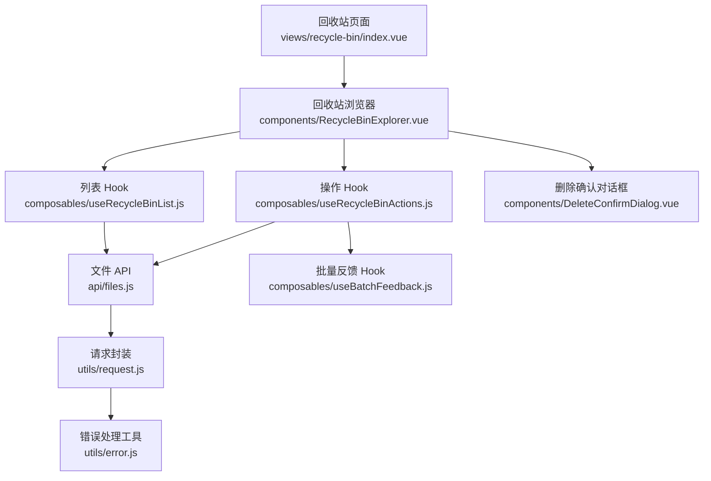
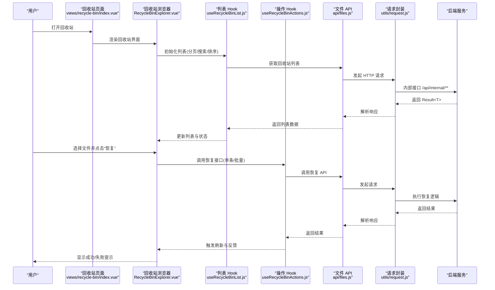
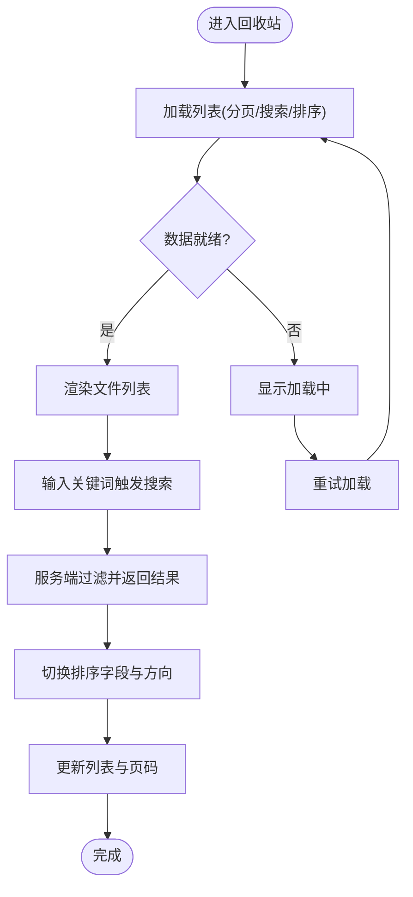
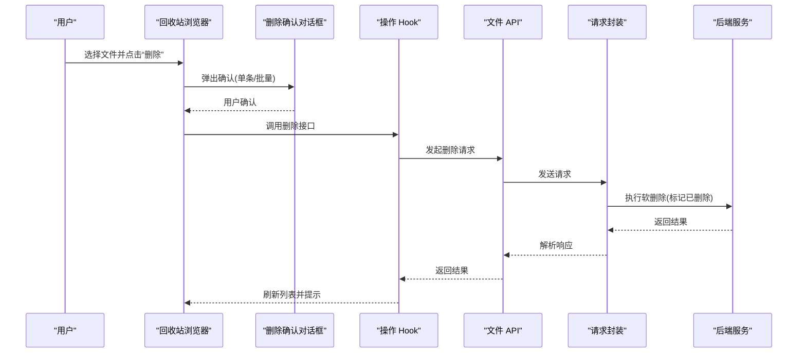
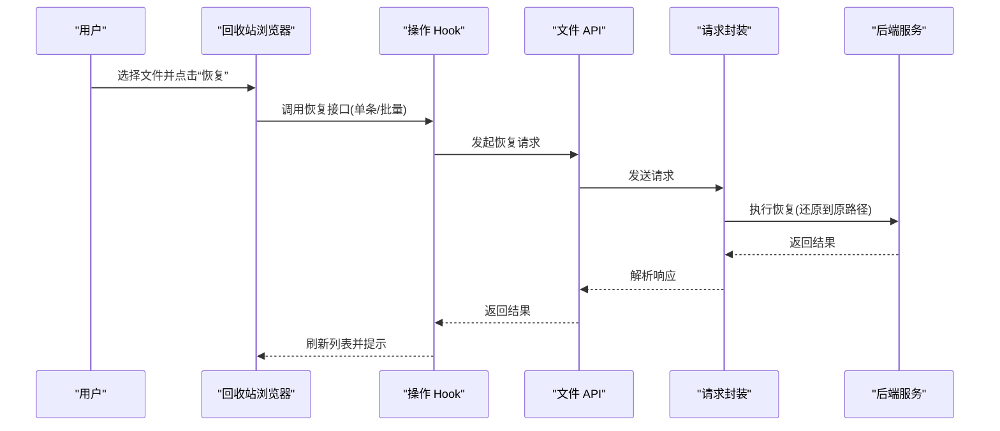
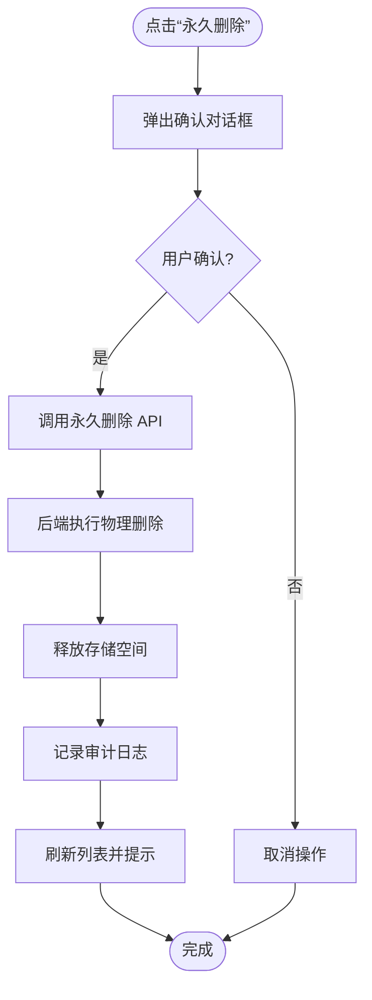
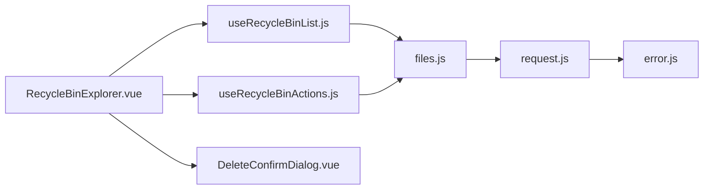

# 回收站管理

<cite>
**本文引用的文件**   
- [RecycleBinExplorer.vue](file://ZXYZdatabaseFront/src/components/RecycleBinExplorer.vue)
- [index.vue（回收站页面）](file://ZXYZdatabaseFront/src/views/recycle-bin/index.vue)
- [useRecycleBinList.js](file://ZXYZdatabaseFront/src/composables/useRecycleBinList.js)
- [useRecycleBinActions.js](file://ZXYZdatabaseFront/src/composables/useRecycleBinActions.js)
- [files.js（文件 API）](file://ZXYZdatabaseFront/src/api/files.js)
- [DeleteConfirmDialog.vue](file://ZXYZdatabaseFront/src/components/DeleteConfirmDialog.vue)
- [useBatchFeedback.js](file://ZXYZdatabaseFront/src/composables/useBatchFeedback.js)
- [error.js（错误处理工具）](file://ZXYZdatabaseFront/src/utils/error.js)
- [request.js（请求封装）](file://ZXYZdatabaseFront/src/utils/request.js)
- [schema_file.sql（文件表结构）](file://ZXYZdatabaseBack/sql/schema_file.sql)
</cite>

## 目录
1. [简介](#简介)
2. [项目结构](#项目结构)
3. [核心组件](#核心组件)
4. [架构总览](#架构总览)
5. [详细组件分析](#详细组件分析)
6. [依赖关系分析](#依赖关系分析)
7. [性能考虑](#性能考虑)
8. [故障排查指南](#故障排查指南)
9. [结论](#结论)
10. [附录：组件使用示例与事件处理](#附录组件使用示例与事件处理)

## 简介
本文件面向 ZXYZ 前端回收站管理功能，系统性说明界面设计、数据流、交互流程与最佳实践。重点覆盖：
- 回收站界面：文件列表展示、搜索过滤、排序
- 软删除机制：删除确认、延迟删除、批量删除
- 数据恢复：单文件恢复、批量恢复、路径恢复
- 物理删除：永久删除确认、容量释放、审计记录
- 组件使用：RecycleBinExplorer 配置与事件处理
- 用户体验：操作反馈、错误处理、状态同步

## 项目结构
回收站相关的前端代码主要位于以下位置：
- 视图层：views/recycle-bin/index.vue
- 组件层：components/RecycleBinExplorer.vue
- 组合式逻辑：composables/useRecycleBinList.js、useRecycleBinActions.js
- API 层：api/files.js
- 通用能力：DeleteConfirmDialog.vue、useBatchFeedback.js、utils/error.js、utils/request.js
- 后端数据模型参考：sql/schema_file.sql

图表来源
- [index.vue（回收站页面）](file://ZXYZdatabaseFront/src/views/recycle-bin/index.vue)
- [RecycleBinExplorer.vue](file://ZXYZdatabaseFront/src/components/RecycleBinExplorer.vue)
- [useRecycleBinList.js](file://ZXYZdatabaseFront/src/composables/useRecycleBinList.js)
- [useRecycleBinActions.js](file://ZXYZdatabaseFront/src/composables/useRecycleBinActions.js)
- [files.js（文件 API）](file://ZXYZdatabaseFront/src/api/files.js)
- [DeleteConfirmDialog.vue](file://ZXYZdatabaseFront/src/components/DeleteConfirmDialog.vue)
- [useBatchFeedback.js](file://ZXYZdatabaseFront/src/composables/useBatchFeedback.js)
- [error.js（错误处理工具）](file://ZXYZdatabaseFront/src/utils/error.js)
- [request.js（请求封装）](file://ZXYZdatabaseFront/src/utils/request.js)

章节来源
- [index.vue（回收站页面）](file://ZXYZdatabaseFront/src/views/recycle-bin/index.vue)
- [RecycleBinExplorer.vue](file://ZXYZdatabaseFront/src/components/RecycleBinExplorer.vue)
- [useRecycleBinList.js](file://ZXYZdatabaseFront/src/composables/useRecycleBinList.js)
- [useRecycleBinActions.js](file://ZXYZdatabaseFront/src/composables/useRecycleBinActions.js)
- [files.js（文件 API）](file://ZXYZdatabaseFront/src/api/files.js)
- [DeleteConfirmDialog.vue](file://ZXYZdatabaseFront/src/components/DeleteConfirmDialog.vue)
- [useBatchFeedback.js](file://ZXYZdatabaseFront/src/composables/useBatchFeedback.js)
- [error.js（错误处理工具）](file://ZXYZdatabaseFront/src/utils/error.js)
- [request.js（请求封装）](file://ZXYZdatabaseFront/src/utils/request.js)
- [schema_file.sql（文件表结构）](file://ZXYZdatabaseBack/sql/schema_file.sql)

## 核心组件
- RecycleBinExplorer：回收站主界面组件，负责渲染文件列表、搜索框、排序控制、批量选择与操作按钮，并订阅列表与操作结果事件。
- useRecycleBinList：封装回收站列表的数据获取、分页、搜索过滤、排序、刷新与缓存策略。
- useRecycleBinActions：封装回收站相关操作（恢复、永久删除、批量恢复、批量删除），包含确认弹窗、进度反馈、错误处理与状态同步。
- DeleteConfirmDialog：通用删除确认对话框，支持单条与批量场景的二次确认。
- useBatchFeedback：统一批量操作的反馈（成功/失败计数、错误汇总）。
- files.js：回收站相关 API 调用（列表、恢复、永久删除等）。
- request.js / error.js：HTTP 请求封装与错误归一化。

章节来源
- [RecycleBinExplorer.vue](file://ZXYZdatabaseFront/src/components/RecycleBinExplorer.vue)
- [useRecycleBinList.js](file://ZXYZdatabaseFront/src/composables/useRecycleBinList.js)
- [useRecycleBinActions.js](file://ZXYZdatabaseFront/src/composables/useRecycleBinActions.js)
- [DeleteConfirmDialog.vue](file://ZXYZdatabaseFront/src/components/DeleteConfirmDialog.vue)
- [useBatchFeedback.js](file://ZXYZdatabaseFront/src/composables/useBatchFeedback.js)
- [files.js（文件 API）](file://ZXYZdatabaseFront/src/api/files.js)
- [request.js（请求封装）](file://ZXYZdatabaseFront/src/utils/request.js)
- [error.js（错误处理工具）](file://ZXYZdatabaseFront/src/utils/error.js)

## 架构总览
回收站功能的整体交互链路如下：用户操作触发 UI 事件 → 组件调用组合式 Hook → Hook 调用 API → 请求封装进行鉴权与重试 → 服务端执行软删除/恢复/物理删除 → 返回统一响应 → 前端更新列表与状态 → 通过反馈组件提示用户。

图表来源
- [index.vue（回收站页面）](file://ZXYZdatabaseFront/src/views/recycle-bin/index.vue)
- [RecycleBinExplorer.vue](file://ZXYZdatabaseFront/src/components/RecycleBinExplorer.vue)
- [useRecycleBinList.js](file://ZXYZdatabaseFront/src/composables/useRecycleBinList.js)
- [useRecycleBinActions.js](file://ZXYZdatabaseFront/src/composables/useRecycleBinActions.js)
- [files.js（文件 API）](file://ZXYZdatabaseFront/src/api/files.js)
- [request.js（请求封装）](file://ZXYZdatabaseFront/src/utils/request.js)

## 详细组件分析

### 回收站界面与数据展示
- 列表展示：分页加载、行选择、文件类型图标、大小与时间信息。
- 搜索过滤：按文件名模糊匹配，支持清空与回车触发。
- 排序：按名称、大小、时间升/降序切换，保持选中状态。
- 空态与加载：骨架屏或占位提示，错误时提供重试入口。

章节来源
- [RecycleBinExplorer.vue](file://ZXYZdatabaseFront/src/components/RecycleBinExplorer.vue)
- [useRecycleBinList.js](file://ZXYZdatabaseFront/src/composables/useRecycleBinList.js)

### 软删除机制（确认、延迟、批量）
- 删除确认：通过 DeleteConfirmDialog 弹出确认，支持单条与批量。
- 延迟删除：标记为“已删除”状态，保留在回收站中，支持恢复。
- 批量删除：勾选多条后统一提交，失败项单独记录并反馈。

图表来源
- [RecycleBinExplorer.vue](file://ZXYZdatabaseFront/src/components/RecycleBinExplorer.vue)
- [DeleteConfirmDialog.vue](file://ZXYZdatabaseFront/src/components/DeleteConfirmDialog.vue)
- [useRecycleBinActions.js](file://ZXYZdatabaseFront/src/composables/useRecycleBinActions.js)
- [files.js（文件 API）](file://ZXYZdatabaseFront/src/api/files.js)
- [request.js（请求封装）](file://ZXYZdatabaseFront/src/utils/request.js)

章节来源
- [DeleteConfirmDialog.vue](file://ZXYZdatabaseFront/src/components/DeleteConfirmDialog.vue)
- [useRecycleBinActions.js](file://ZXYZdatabaseFront/src/composables/useRecycleBinActions.js)
- [files.js（文件 API）](file://ZXYZdatabaseFront/src/api/files.js)

### 数据恢复流程（单文件、批量、路径恢复）
- 单文件恢复：选中单个文件，调用恢复接口，成功后从回收站移除并回到原路径。
- 批量恢复：多选后统一恢复，部分失败需逐条反馈。
- 路径恢复：恢复时保持原始路径；若冲突则提示重命名或覆盖策略。

图表来源
- [RecycleBinExplorer.vue](file://ZXYZdatabaseFront/src/components/RecycleBinExplorer.vue)
- [useRecycleBinActions.js](file://ZXYZdatabaseFront/src/composables/useRecycleBinActions.js)
- [files.js（文件 API）](file://ZXYZdatabaseFront/src/api/files.js)
- [request.js（请求封装）](file://ZXYZdatabaseFront/src/utils/request.js)

章节来源
- [useRecycleBinActions.js](file://ZXYZdatabaseFront/src/composables/useRecycleBinActions.js)
- [files.js（文件 API）](file://ZXYZdatabaseFront/src/api/files.js)

### 物理删除（永久删除、容量释放、审计记录）
- 永久删除确认：二次确认，明确告知不可恢复。
- 容量释放：后端执行物理删除并释放存储空间。
- 审计记录：操作写入审计日志，便于追溯。

章节来源
- [DeleteConfirmDialog.vue](file://ZXYZdatabaseFront/src/components/DeleteConfirmDialog.vue)
- [useRecycleBinActions.js](file://ZXYZdatabaseFront/src/composables/useRecycleBinActions.js)
- [files.js（文件 API）](file://ZXYZdatabaseFront/src/api/files.js)
- [schema_file.sql（文件表结构）](file://ZXYZdatabaseBack/sql/schema_file.sql)

### 组件使用示例与事件处理
- 配置项：列表分页参数、搜索字段、排序字段、是否启用批量操作、是否显示路径信息等。
- 事件：onRefresh（刷新）、onSelectChange（选择变化）、onDelete（删除回调）、onRestore（恢复回调）、onPermanentDelete（永久删除回调）。
- 集成方式：在回收站页面中引入 RecycleBinExplorer，绑定配置与事件处理器，结合 useRecycleBinList 与 useRecycleBinActions 实现数据与操作逻辑。

章节来源
- [RecycleBinExplorer.vue](file://ZXYZdatabaseFront/src/components/RecycleBinExplorer.vue)
- [index.vue（回收站页面）](file://ZXYZdatabaseFront/src/views/recycle-bin/index.vue)
- [useRecycleBinList.js](file://ZXYZdatabaseFront/src/composables/useRecycleBinList.js)
- [useRecycleBinActions.js](file://ZXYZdatabaseFront/src/composables/useRecycleBinActions.js)

## 依赖关系分析
- 组件依赖：RecycleBinExplorer 依赖 useRecycleBinList（数据）与 useRecycleBinActions（操作），并通过 DeleteConfirmDialog 进行确认。
- API 依赖：所有回收站操作通过 files.js 暴露的接口访问后端，底层由 request.js 统一处理鉴权、重试与错误。
- 错误处理：error.js 对网络异常、业务错误进行归一化，便于统一提示与重试。
- 数据模型：后端 schema_file.sql 定义了文件实体与状态字段，支撑软删除与恢复语义。

图表来源
- [RecycleBinExplorer.vue](file://ZXYZdatabaseFront/src/components/RecycleBinExplorer.vue)
- [useRecycleBinList.js](file://ZXYZdatabaseFront/src/composables/useRecycleBinList.js)
- [useRecycleBinActions.js](file://ZXYZdatabaseFront/src/composables/useRecycleBinActions.js)
- [DeleteConfirmDialog.vue](file://ZXYZdatabaseFront/src/components/DeleteConfirmDialog.vue)
- [files.js（文件 API）](file://ZXYZdatabaseFront/src/api/files.js)
- [request.js（请求封装）](file://ZXYZdatabaseFront/src/utils/request.js)
- [error.js（错误处理工具）](file://ZXYZdatabaseFront/src/utils/error.js)

章节来源
- [RecycleBinExplorer.vue](file://ZXYZdatabaseFront/src/components/RecycleBinExplorer.vue)
- [useRecycleBinList.js](file://ZXYZdatabaseFront/src/composables/useRecycleBinList.js)
- [useRecycleBinActions.js](file://ZXYZdatabaseFront/src/composables/useRecycleBinActions.js)
- [files.js（文件 API）](file://ZXYZdatabaseFront/src/api/files.js)
- [request.js（请求封装）](file://ZXYZdatabaseFront/src/utils/request.js)
- [error.js（错误处理工具）](file://ZXYZdatabaseFront/src/utils/error.js)
- [schema_file.sql（文件表结构）](file://ZXYZdatabaseBack/sql/schema_file.sql)

## 性能考虑
- 列表分页与服务端过滤：避免一次性拉取大量数据，提升首屏与滚动性能。
- 防抖搜索：输入关键词时进行防抖，减少频繁请求。
- 批量操作分片：大批量恢复/删除时分批提交，降低单次负载与超时风险。
- 缓存与去重：对相同查询条件进行短期缓存，避免重复请求。
- 懒加载与虚拟滚动：长列表采用虚拟滚动，减少 DOM 节点数量。

[本节为通用指导，不直接分析具体文件]

## 故障排查指南
- 网络错误：检查 request.js 的重试与超时配置，查看 error.js 的错误分类与提示。
- 权限问题：确认用户具备回收站操作权限，检查网关与安全过滤器拦截情况。
- 数据不一致：核对后端软删除状态与前端列表状态，必要时手动刷新或重新登录。
- 批量失败：查看 useBatchFeedback 的失败汇总，定位失败条目并单独重试。
- 审计缺失：确认后端审计服务正常，检查消息队列与消费者消费情况。

章节来源
- [request.js（请求封装）](file://ZXYZdatabaseFront/src/utils/request.js)
- [error.js（错误处理工具）](file://ZXYZdatabaseFront/src/utils/error.js)
- [useBatchFeedback.js](file://ZXYZdatabaseFront/src/composables/useBatchFeedback.js)

## 结论
回收站管理功能通过清晰的组件分层与组合式逻辑，实现了完整的软删除、恢复与物理删除流程。配合统一的请求封装与错误处理，保证了良好的用户体验与可维护性。建议在生产环境中加强批量操作的分片与监控，确保高并发下的稳定性与可观测性。

[本节为总结，不直接分析具体文件]

## 附录：组件使用示例与事件处理
- 基本用法：在回收站页面引入 RecycleBinExplorer，传入分页、搜索、排序等配置，并监听 onRefresh、onSelectChange、onDelete、onRestore、onPermanentDelete 等事件。
- 事件处理：在页面级实现事件回调，调用 useRecycleBinList 刷新列表，使用 useRecycleBinActions 执行恢复与删除操作，结合 useBatchFeedback 展示批量结果。
- 最佳实践：统一错误提示、保持选择状态、避免重复请求、合理设置分页大小与搜索防抖间隔。

章节来源
- [RecycleBinExplorer.vue](file://ZXYZdatabaseFront/src/components/RecycleBinExplorer.vue)
- [index.vue（回收站页面）](file://ZXYZdatabaseFront/src/views/recycle-bin/index.vue)
- [useRecycleBinList.js](file://ZXYZdatabaseFront/src/composables/useRecycleBinList.js)
- [useRecycleBinActions.js](file://ZXYZdatabaseFront/src/composables/useRecycleBinActions.js)
- [useBatchFeedback.js](file://ZXYZdatabaseFront/src/composables/useBatchFeedback.js)