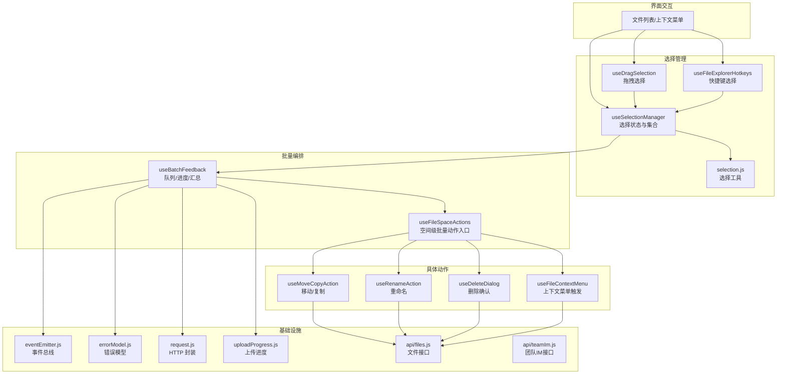
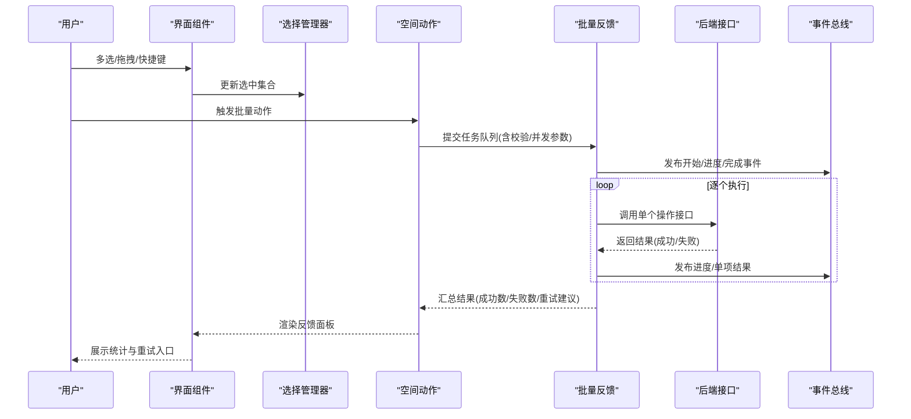
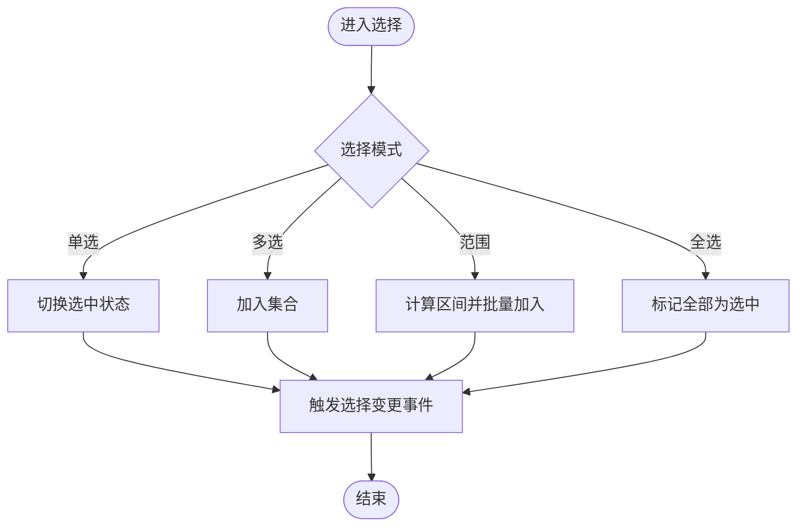
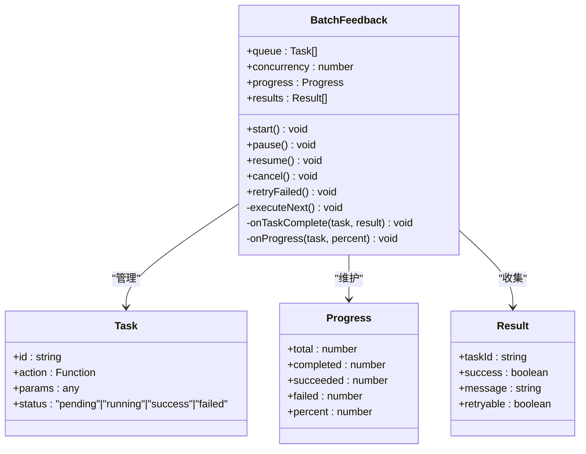
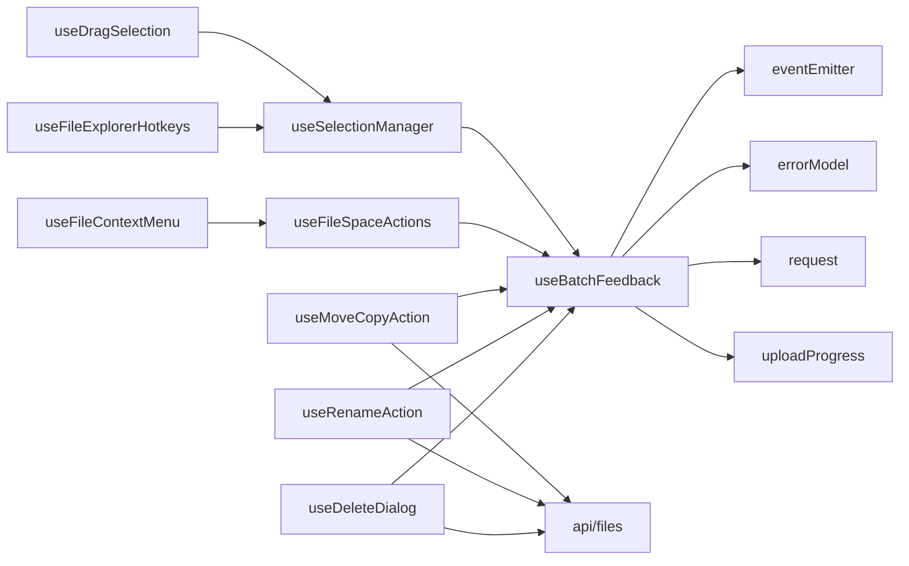

# 批量操作

<cite>
**本文引用的文件**   
- [useBatchFeedback.js](file://ZXYZdatabaseFront/src/composables/useBatchFeedback.js)
- [useSelectionManager.js](file://ZXYZdatabaseFront/src/composables/useSelectionManager.js)
- [useDragSelection.js](file://ZXYZdatabaseFront/src/composables/useDragSelection.js)
- [useFileExplorerHotkeys.js](file://ZXYZdatabaseFront/src/composables/useFileExplorerHotkeys.js)
- [useFileSpaceActions.js](file://ZXYZdatabaseFront/src/composables/useFileSpaceActions.js)
- [useMoveCopyAction.js](file://ZXYZdatabaseFront/src/composables/useMoveCopyAction.js)
- [useRenameAction.js](file://ZXYZdatabaseFront/src/composables/useRenameAction.js)
- [useDeleteDialog.js](file://ZXYZdatabaseFront/src/composables/useDeleteDialog.js)
- [useFileContextMenu.js](file://ZXYZdatabaseFront/src/composables/useFileContextMenu.js)
- [selection.js](file://ZXYZdatabaseFront/src/utils/selection.js)
- [eventEmitter.js](file://ZXYZdatabaseFront/src/utils/eventEmitter.js)
- [errorModel.js](file://ZXYZdatabaseFront/src/utils/errorModel.js)
- [request.js](file://ZXYZdatabaseFront/src/utils/request.js)
- [uploadProgress.js](file://ZXYZdatabaseFront/src/utils/uploadProgress.js)
- [files.js](file://ZXYZdatabaseFront/src/api/files.js)
- [teamIm.js](file://ZXYZdatabaseFront/src/api/teamIm.js)
</cite>

## 目录
1. [简介](#简介)
2. [项目结构](#项目结构)
3. [核心组件](#核心组件)
4. [架构总览](#架构总览)
5. [详细组件分析](#详细组件分析)
6. [依赖关系分析](#依赖关系分析)
7. [性能考量](#性能考量)
8. [故障排查指南](#故障排查指南)
9. [结论](#结论)
10. [附录：自定义批量操作实现示例](#附录自定义批量操作实现示例)

## 简介
本文件面向 ZXYZ 前端批量操作能力，系统性阐述其设计模式与实现要点，覆盖以下方面：
- 批量操作的设计模式：操作队列、进度跟踪、结果汇总
- 批量选择机制：多选框、快捷键支持、智能选择（全选/反选/范围选择）
- 批量执行流程：操作验证、并发控制、错误处理
- 批量反馈系统：实时进度、成功统计、失败重试
- 用户体验优化：操作确认、取消机制、错误提示
- 完整使用示例：如何扩展并接入自定义批量操作

## 项目结构
批量操作相关的前端代码主要集中在 composables 与 utils 层，采用组合式函数封装业务逻辑，通过事件总线进行跨组件通信，统一错误模型与请求封装。

图表来源
- [useSelectionManager.js](file://ZXYZdatabaseFront/src/composables/useSelectionManager.js)
- [useDragSelection.js](file://ZXYZdatabaseFront/src/composables/useDragSelection.js)
- [useFileExplorerHotkeys.js](file://ZXYZdatabaseFront/src/composables/useFileExplorerHotkeys.js)
- [useBatchFeedback.js](file://ZXYZdatabaseFront/src/composables/useBatchFeedback.js)
- [useFileSpaceActions.js](file://ZXYZdatabaseFront/src/composables/useFileSpaceActions.js)
- [useMoveCopyAction.js](file://ZXYZdatabaseFront/src/composables/useMoveCopyAction.js)
- [useRenameAction.js](file://ZXYZdatabaseFront/src/composables/useRenameAction.js)
- [useDeleteDialog.js](file://ZXYZdatabaseFront/src/composables/useDeleteDialog.js)
- [useFileContextMenu.js](file://ZXYZdatabaseFront/src/composables/useFileContextMenu.js)
- [selection.js](file://ZXYZdatabaseFront/src/utils/selection.js)
- [eventEmitter.js](file://ZXYZdatabaseFront/src/utils/eventEmitter.js)
- [errorModel.js](file://ZXYZdatabaseFront/src/utils/errorModel.js)
- [request.js](file://ZXYZdatabaseFront/src/utils/request.js)
- [uploadProgress.js](file://ZXYZdatabaseFront/src/utils/uploadProgress.js)
- [files.js](file://ZXYZdatabaseFront/src/api/files.js)
- [teamIm.js](file://ZXYZdatabaseFront/src/api/teamIm.js)

章节来源
- [useBatchFeedback.js](file://ZXYZdatabaseFront/src/composables/useBatchFeedback.js)
- [useSelectionManager.js](file://ZXYZdatabaseFront/src/composables/useSelectionManager.js)
- [useDragSelection.js](file://ZXYZdatabaseFront/src/composables/useDragSelection.js)
- [useFileExplorerHotkeys.js](file://ZXYZdatabaseFront/src/composables/useFileExplorerHotkeys.js)
- [useFileSpaceActions.js](file://ZXYZdatabaseFront/src/composables/useFileSpaceActions.js)
- [useMoveCopyAction.js](file://ZXYZdatabaseFront/src/composables/useMoveCopyAction.js)
- [useRenameAction.js](file://ZXYZdatabaseFront/src/composables/useRenameAction.js)
- [useDeleteDialog.js](file://ZXYZdatabaseFront/src/composables/useDeleteDialog.js)
- [useFileContextMenu.js](file://ZXYZdatabaseFront/src/composables/useFileContextMenu.js)
- [selection.js](file://ZXYZdatabaseFront/src/utils/selection.js)
- [eventEmitter.js](file://ZXYZdatabaseFront/src/utils/eventEmitter.js)
- [errorModel.js](file://ZXYZdatabaseFront/src/utils/errorModel.js)
- [request.js](file://ZXYZdatabaseFront/src/utils/request.js)
- [uploadProgress.js](file://ZXYZdatabaseFront/src/utils/uploadProgress.js)
- [files.js](file://ZXYZdatabaseFront/src/api/files.js)
- [teamIm.js](file://ZXYZdatabaseFront/src/api/teamIm.js)

## 核心组件
- 选择管理器（useSelectionManager）：维护选中项集合、全选/反选/清空、范围选择、与数据源同步等。
- 拖拽选择（useDragSelection）：支持鼠标拖拽框选区域内的条目。
- 快捷键（useFileExplorerHotkeys）：支持 Ctrl/Cmd+A 全选、Shift+点击范围选择、Esc 取消选择等。
- 批量反馈（useBatchFeedback）：提供任务队列、并发控制、进度上报、结果汇总、失败重试与取消。
- 空间动作（useFileSpaceActions）：聚合批量操作的入口，协调选择与执行。
- 具体动作（useMoveCopyAction / useRenameAction / useDeleteDialog / useFileContextMenu）：将用户意图转化为可执行的批量任务。
- 工具库（selection.js / eventEmitter.js / errorModel.js / request.js / uploadProgress.js）：选择计算、事件广播、错误建模、HTTP 封装、上传进度。

章节来源
- [useSelectionManager.js](file://ZXYZdatabaseFront/src/composables/useSelectionManager.js)
- [useDragSelection.js](file://ZXYZdatabaseFront/src/composables/useDragSelection.js)
- [useFileExplorerHotkeys.js](file://ZXYZdatabaseFront/src/composables/useFileExplorerHotkeys.js)
- [useBatchFeedback.js](file://ZXYZdatabaseFront/src/composables/useBatchFeedback.js)
- [useFileSpaceActions.js](file://ZXYZdatabaseFront/src/composables/useFileSpaceActions.js)
- [useMoveCopyAction.js](file://ZXYZdatabaseFront/src/composables/useMoveCopyAction.js)
- [useRenameAction.js](file://ZXYZdatabaseFront/src/composables/useRenameAction.js)
- [useDeleteDialog.js](file://ZXYZdatabaseFront/src/composables/useDeleteDialog.js)
- [useFileContextMenu.js](file://ZXYZdatabaseFront/src/composables/useFileContextMenu.js)
- [selection.js](file://ZXYZdatabaseFront/src/utils/selection.js)
- [eventEmitter.js](file://ZXYZdatabaseFront/src/utils/eventEmitter.js)
- [errorModel.js](file://ZXYZdatabaseFront/src/utils/errorModel.js)
- [request.js](file://ZXYZdatabaseFront/src/utils/request.js)
- [uploadProgress.js](file://ZXYZdatabaseFront/src/utils/uploadProgress.js)

## 架构总览
批量操作的整体流程遵循“选择 → 编排 → 执行 → 反馈”的闭环：
- 选择阶段：由选择管理器统一管理选中项，支持多选框、拖拽、快捷键等多种输入方式。
- 编排阶段：空间动作根据用户意图生成批量任务，交由批量反馈模块进行队列化与并发控制。
- 执行阶段：按策略顺序或并行执行单个操作，期间持续上报进度与中间结果。
- 反馈阶段：汇总成功/失败统计，支持失败重试与取消，最终向 UI 推送结果。

图表来源
- [useSelectionManager.js](file://ZXYZdatabaseFront/src/composables/useSelectionManager.js)
- [useFileSpaceActions.js](file://ZXYZdatabaseFront/src/composables/useFileSpaceActions.js)
- [useBatchFeedback.js](file://ZXYZdatabaseFront/src/composables/useBatchFeedback.js)
- [eventEmitter.js](file://ZXYZdatabaseFront/src/utils/eventEmitter.js)
- [files.js](file://ZXYZdatabaseFront/src/api/files.js)

## 详细组件分析

### 选择管理器（useSelectionManager）
- 职责：维护选中项集合、全选/反选/清空、范围选择、与数据源同步、选择变更事件。
- 关键行为：
  - 多选框联动：勾选行时更新集合，并触发选择变更事件。
  - 智能选择：Ctrl/Cmd+A 全选；Shift+点击范围选择；点击已选项切换状态。
  - 去重与稳定性：基于唯一标识维护集合，保证大数据量下的性能。
- 复杂度：集合操作近似 O(1)，范围选择为 O(n) 扫描。

图表来源
- [useSelectionManager.js](file://ZXYZdatabaseFront/src/composables/useSelectionManager.js)
- [selection.js](file://ZXYZdatabaseFront/src/utils/selection.js)

章节来源
- [useSelectionManager.js](file://ZXYZdatabaseFront/src/composables/useSelectionManager.js)
- [selection.js](file://ZXYZdatabaseFront/src/utils/selection.js)

### 拖拽选择（useDragSelection）
- 职责：监听鼠标拖拽事件，计算拖拽矩形与可见项交集，批量更新选中集合。
- 关键点：防抖与节流避免频繁更新；边界检测防止越界；与滚动联动保持可视区一致。

章节来源
- [useDragSelection.js](file://ZXYZdatabaseFront/src/composables/useDragSelection.js)

### 快捷键（useFileExplorerHotkeys）
- 职责：绑定全局/局部快捷键，驱动选择与批量动作。
- 常见键位：
  - Ctrl/Cmd+A：全选
  - Shift+点击：范围选择
  - Esc：取消选择
  - Delete/Backspace：触发删除批量动作
  - F2：触发重命名批量动作

章节来源
- [useFileExplorerHotkeys.js](file://ZXYZdatabaseFront/src/composables/useFileExplorerHotkeys.js)

### 批量反馈（useBatchFeedback）
- 职责：任务队列、并发控制、进度上报、结果汇总、失败重试、取消机制。
- 关键特性：
  - 队列：支持 FIFO 与优先级；支持暂停/恢复。
  - 并发：可配置最大并发数，避免阻塞 UI 与后端压力。
  - 进度：按任务粒度上报百分比与累计统计。
  - 结果：记录每项成功/失败原因，支持一键重试失败项。
  - 取消：支持整体取消与单项跳过。
  - 事件：通过事件总线发布开始、进度、完成、失败等事件。

图表来源
- [useBatchFeedback.js](file://ZXYZdatabaseFront/src/composables/useBatchFeedback.js)
- [eventEmitter.js](file://ZXYZdatabaseFront/src/utils/eventEmitter.js)

章节来源
- [useBatchFeedback.js](file://ZXYZdatabaseFront/src/composables/useBatchFeedback.js)
- [eventEmitter.js](file://ZXYZdatabaseFront/src/utils/eventEmitter.js)

### 空间动作（useFileSpaceActions）
- 职责：聚合批量动作入口，协调选择与执行，提供统一的批量操作 API。
- 典型方法：
  - batchMove(items, target)
  - batchCopy(items, target)
  - batchRename(items, newNameFn)
  - batchDelete(items)
- 内部流程：校验选择 → 构建任务 → 提交批量反馈 → 订阅事件 → 渲染结果。

章节来源
- [useFileSpaceActions.js](file://ZXYZdatabaseFront/src/composables/useFileSpaceActions.js)

### 具体动作（移动/复制、重命名、删除、上下文菜单）
- 移动/复制（useMoveCopyAction）：
  - 目标校验（权限、路径合法性）
  - 分片与并发限制（大文件/大批量场景）
  - 失败重试与断点续传（结合上传进度）
- 重命名（useRenameAction）：
  - 名称冲突检测与自动后缀策略
  - 批量前缀/后缀替换
- 删除（useDeleteDialog）：
  - 二次确认与软删除/硬删除策略
  - 回收站恢复与彻底删除
- 上下文菜单（useFileContextMenu）：
  - 右键菜单触发批量动作
  - 动态禁用不可用项（权限/状态）

章节来源
- [useMoveCopyAction.js](file://ZXYZdatabaseFront/src/composables/useMoveCopyAction.js)
- [useRenameAction.js](file://ZXYZdatabaseFront/src/composables/useRenameAction.js)
- [useDeleteDialog.js](file://ZXYZdatabaseFront/src/composables/useDeleteDialog.js)
- [useFileContextMenu.js](file://ZXYZdatabaseFront/src/composables/useFileContextMenu.js)

### 工具库（选择、事件、错误、请求、上传进度）
- selection.js：选择集合计算、范围选择算法、去重与排序。
- eventEmitter.js：轻量事件总线，支持 on/off/emit，用于跨组件通信。
- errorModel.js：统一错误模型，区分网络错误、业务错误、权限错误等。
- request.js：HTTP 封装，统一拦截器、重试、超时、鉴权头注入。
- uploadProgress.js：上传进度追踪，支持分块进度合并与取消。

章节来源
- [selection.js](file://ZXYZdatabaseFront/src/utils/selection.js)
- [eventEmitter.js](file://ZXYZdatabaseFront/src/utils/eventEmitter.js)
- [errorModel.js](file://ZXYZdatabaseFront/src/utils/errorModel.js)
- [request.js](file://ZXYZdatabaseFront/src/utils/request.js)
- [uploadProgress.js](file://ZXYZdatabaseFront/src/utils/uploadProgress.js)

## 依赖关系分析
- 低耦合高内聚：选择管理与批量编排解耦，通过事件总线通信。
- 明确边界：具体动作仅关注自身业务逻辑，不直接操作选择集合。
- 外部依赖：HTTP 请求与上传进度通过工具层抽象，便于替换与测试。

图表来源
- [useSelectionManager.js](file://ZXYZdatabaseFront/src/composables/useSelectionManager.js)
- [useDragSelection.js](file://ZXYZdatabaseFront/src/composables/useDragSelection.js)
- [useFileExplorerHotkeys.js](file://ZXYZdatabaseFront/src/composables/useFileExplorerHotkeys.js)
- [useBatchFeedback.js](file://ZXYZdatabaseFront/src/composables/useBatchFeedback.js)
- [useFileSpaceActions.js](file://ZXYZdatabaseFront/src/composables/useFileSpaceActions.js)
- [useMoveCopyAction.js](file://ZXYZdatabaseFront/src/composables/useMoveCopyAction.js)
- [useRenameAction.js](file://ZXYZdatabaseFront/src/composables/useRenameAction.js)
- [useDeleteDialog.js](file://ZXYZdatabaseFront/src/composables/useDeleteDialog.js)
- [useFileContextMenu.js](file://ZXYZdatabaseFront/src/composables/useFileContextMenu.js)
- [eventEmitter.js](file://ZXYZdatabaseFront/src/utils/eventEmitter.js)
- [errorModel.js](file://ZXYZdatabaseFront/src/utils/errorModel.js)
- [request.js](file://ZXYZdatabaseFront/src/utils/request.js)
- [uploadProgress.js](file://ZXYZdatabaseFront/src/utils/uploadProgress.js)
- [files.js](file://ZXYZdatabaseFront/src/api/files.js)

章节来源
- [useBatchFeedback.js](file://ZXYZdatabaseFront/src/composables/useBatchFeedback.js)
- [useSelectionManager.js](file://ZXYZdatabaseFront/src/composables/useSelectionManager.js)
- [useFileSpaceActions.js](file://ZXYZdatabaseFront/src/composables/useFileSpaceActions.js)
- [eventEmitter.js](file://ZXYZdatabaseFront/src/utils/eventEmitter.js)
- [errorModel.js](file://ZXYZdatabaseFront/src/utils/errorModel.js)
- [request.js](file://ZXYZdatabaseFront/src/utils/request.js)
- [uploadProgress.js](file://ZXYZdatabaseFront/src/utils/uploadProgress.js)
- [files.js](file://ZXYZdatabaseFront/src/api/files.js)

## 性能考量
- 选择集合优化：使用 Map/Set 存储唯一标识，避免重复与 O(n^2) 比较。
- 批量并发控制：合理设置并发上限，避免浏览器线程与后端限流。
- 增量更新：仅在选中集合变化时触发最小化重渲染。
- 事件节流：拖拽与滚动事件需节流，减少高频更新。
- 失败重试退避：指数退避避免雪崩效应。
- 内存管理：及时释放事件监听与定时器，避免泄漏。

[本节为通用指导，无需引用具体文件]

## 故障排查指南
- 常见问题定位：
  - 选择异常：检查选择管理器初始化、事件绑定与去重逻辑。
  - 批量无响应：查看事件总线是否订阅、队列是否被正确提交。
  - 进度不更新：确认进度上报事件是否触发，UI 是否正确消费。
  - 失败重试无效：检查错误模型中的 retryable 标志与重试策略。
- 调试建议：
  - 在事件总线中打印关键事件序列。
  - 临时降低并发数，观察瓶颈。
  - 使用浏览器开发者工具监控网络请求与错误堆栈。

章节来源
- [eventEmitter.js](file://ZXYZdatabaseFront/src/utils/eventEmitter.js)
- [errorModel.js](file://ZXYZdatabaseFront/src/utils/errorModel.js)
- [request.js](file://ZXYZdatabaseFront/src/utils/request.js)

## 结论
ZXYZ 前端的批量操作以选择管理器为核心，结合批量反馈模块实现了可扩展、可观测、可控制的批量执行体系。通过事件总线与统一错误模型，保证了组件间的松耦合与一致的体验。未来可在异步任务持久化、分布式队列与更细粒度的权限校验上进一步演进。

[本节为总结性内容，无需引用具体文件]

## 附录：自定义批量操作实现示例
以下步骤演示如何实现一个自定义批量操作（例如批量打标签）：
- 定义动作入口：在空间动作中添加 batchTag(items, tags)。
- 构建任务：对每个 item 生成一个任务，包含标签写入逻辑。
- 提交队列：调用批量反馈的 start(queue, options)，设置并发与重试策略。
- 订阅事件：监听开始、进度、完成、失败事件，更新 UI。
- 错误处理：根据错误模型判断是否可重试，并提供重试入口。
- 取消机制：支持中途取消，清理未完成任务与资源。

章节来源
- [useFileSpaceActions.js](file://ZXYZdatabaseFront/src/composables/useFileSpaceActions.js)
- [useBatchFeedback.js](file://ZXYZdatabaseFront/src/composables/useBatchFeedback.js)
- [eventEmitter.js](file://ZXYZdatabaseFront/src/utils/eventEmitter.js)
- [errorModel.js](file://ZXYZdatabaseFront/src/utils/errorModel.js)
- [request.js](file://ZXYZdatabaseFront/src/utils/request.js)