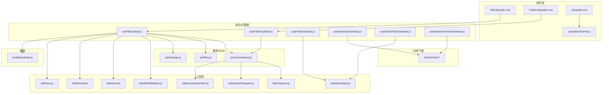
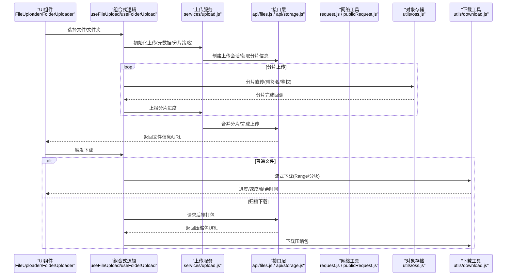
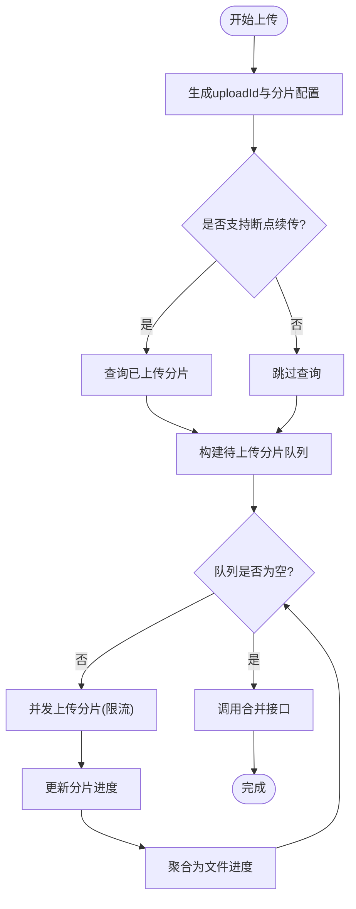
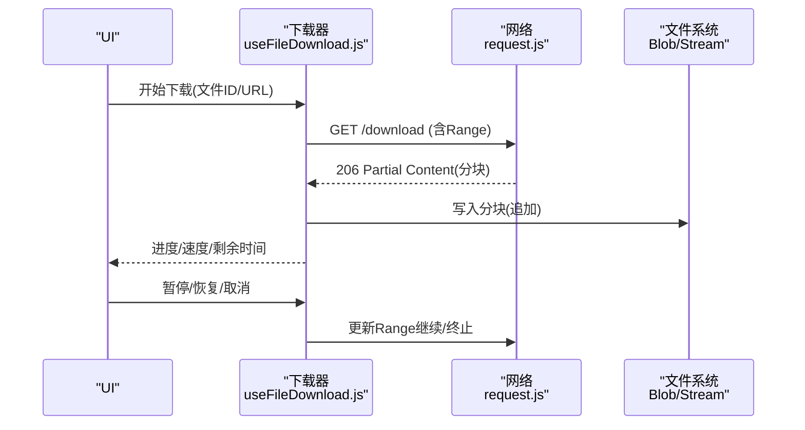
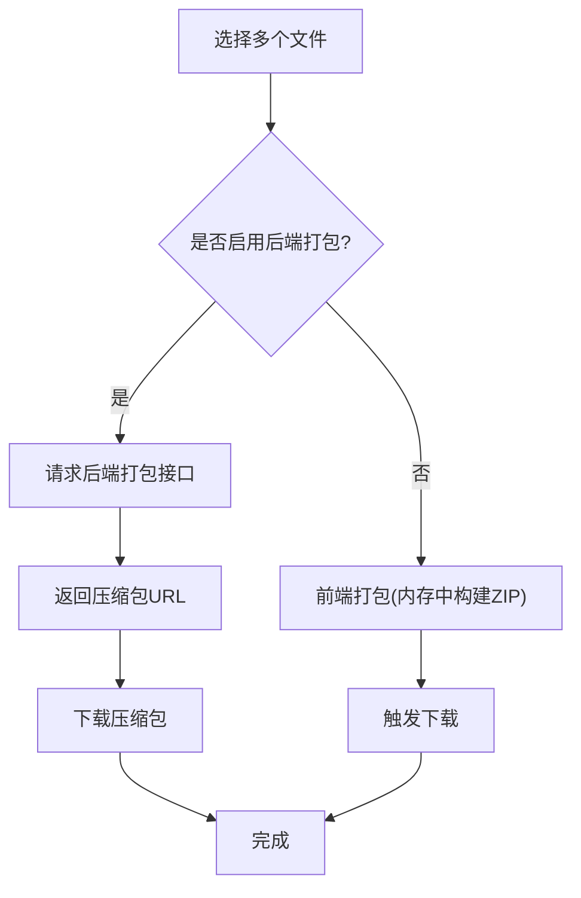
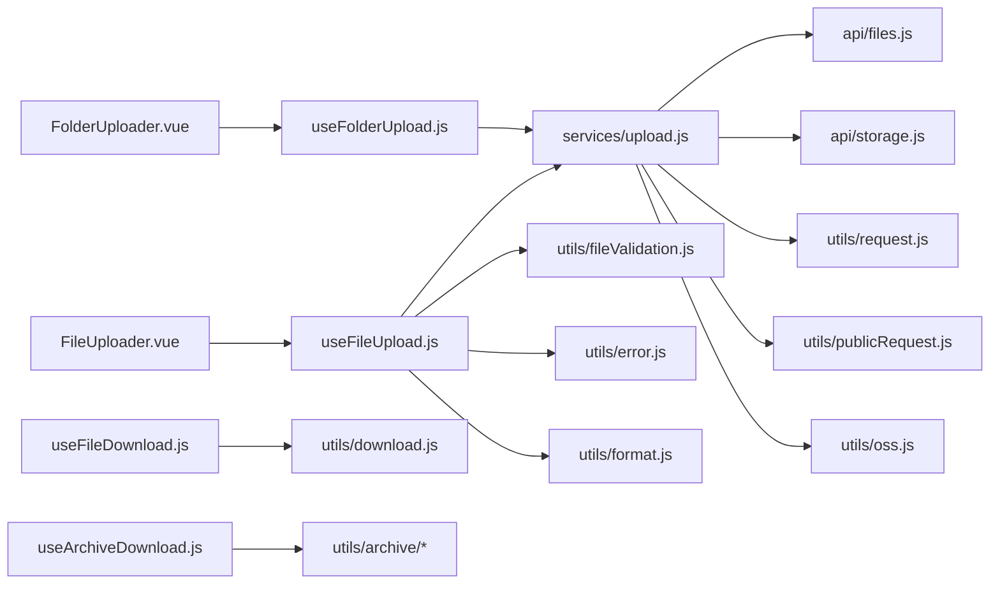

# 文件上传下载

<cite>
**本文引用的文件**   
- [FileUploader.vue](file://ZXYZdatabaseFront/src/components/FileUploader.vue)
- [FolderUploader.vue](file://ZXYZdatabaseFront/src/components/FolderUploader.vue)
- [Uploader.vue](file://ZXYZdatabaseFront/src/components/Uploader.vue)
- [shared.js](file://ZXYZdatabaseFront/src/components/uploader/shared.js)
- [useFileUpload.js](file://ZXYZdatabaseFront/src/composables/useFileUpload.js)
- [useFolderUpload.js](file://ZXYZdatabaseFront/src/composables/useFolderUpload.js)
- [upload.js](file://ZXYZdatabaseFront/src/services/upload.js)
- [files.js](file://ZXYZdatabaseFront/src/api/files.js)
- [storage.js](file://ZXYZdatabaseFront/src/api/storage.js)
- [download.js](file://ZXYZdatabaseFront/src/utils/download.js)
- [archiveDownloadRunner.js](file://ZXYZdatabaseFront/src/utils/archive/archiveDownloadRunner.js)
- [backendArchive.js](file://ZXYZdatabaseFront/src/utils/archive/backendArchive.js)
- [frontendArchive.js](file://ZXYZdatabaseFront/src/utils/archive/frontendArchive.js)
- [shareArchive.js](file://ZXYZdatabaseFront/src/utils/archive/shareArchive.js)
- [useFileDownload.js](file://ZXYZdatabaseFront/src/composables/useFileDownload.js)
- [useShareFileDownload.js](file://ZXYZdatabaseFront/src/composables/useShareFileDownload.js)
- [useArchiveDownload.js](file://ZXYZdatabaseFront/src/composables/useArchiveDownload.js)
- [useShareArchiveDownload.js](file://ZXYZdatabaseFront/src/composables/useShareArchiveDownload.js)
- [oss.js](file://ZXYZdatabaseFront/src/utils/oss.js)
- [error.js](file://ZXYZdatabaseFront/src/utils/error.js)
- [format.js](file://ZXYZdatabaseFront/src/utils/format.js)
- [fileValidation.js](file://ZXYZdatabaseFront/src/utils/fileValidation.js)
- [request.js](file://ZXYZdatabaseFront/src/utils/request.js)
- [publicRequest.js](file://ZXYZdatabaseFront/src/utils/publicRequest.js)
- [createApiClient.js](file://ZXYZdatabaseFront/src/utils/createApiClient.js)
- [models/upload.js](file://ZXYZdatabaseFront/src/models/upload.js)
</cite>

## 目录
1. [简介](#简介)
2. [项目结构](#项目结构)
3. [核心组件](#核心组件)
4. [架构总览](#架构总览)
5. [详细组件分析](#详细组件分析)
6. [依赖关系分析](#依赖关系分析)
7. [性能考虑](#性能考虑)
8. [故障排查指南](#故障排查指南)
9. [结论](#结论)
10. [附录](#附录)

## 简介
本文件面向 ZXYZ 前端“文件上传与下载”能力，系统性说明分片上传机制（分片策略、并发控制、断点续传、进度显示）、大文件下载优化（流式处理、下载队列、暂停恢复），以及上传组件的使用方式（Uploader 属性与事件、自定义校验与错误处理）。同时给出上传进度跟踪的实现要点（实时进度、速度计算、剩余时间预估）和集成示例路径，并提供压缩预处理、缓存策略与内存管理等性能优化建议。

## 项目结构
前端上传下载相关代码主要分布在以下位置：
- 组件层：FileUploader.vue、FolderUploader.vue、Uploader.vue 及 uploader/shared.js
- 组合式逻辑：useFileUpload.js、useFolderUpload.js、useFileDownload.js、useArchiveDownload.js 等
- 服务与 API：services/upload.js、api/files.js、api/storage.js
- 工具库：utils/download.js、utils/oss.js、utils/error.js、utils/format.js、utils/fileValidation.js、utils/request.js、utils/publicRequest.js、utils/createApiClient.js
- 归档下载：utils/archive/*（后端打包、前端打包、分享场景）
- 模型：models/upload.js

图表来源
- [FileUploader.vue](file://ZXYZdatabaseFront/src/components/FileUploader.vue)
- [FolderUploader.vue](file://ZXYZdatabaseFront/src/components/FolderUploader.vue)
- [Uploader.vue](file://ZXYZdatabaseFront/src/components/Uploader.vue)
- [shared.js](file://ZXYZdatabaseFront/src/components/uploader/shared.js)
- [useFileUpload.js](file://ZXYZdatabaseFront/src/composables/useFileUpload.js)
- [useFolderUpload.js](file://ZXYZdatabaseFront/src/composables/useFolderUpload.js)
- [upload.js](file://ZXYZdatabaseFront/src/services/upload.js)
- [files.js](file://ZXYZdatabaseFront/src/api/files.js)
- [storage.js](file://ZXYZdatabaseFront/src/api/storage.js)
- [download.js](file://ZXYZdatabaseFront/src/utils/download.js)
- [archiveDownloadRunner.js](file://ZXYZdatabaseFront/src/utils/archive/archiveDownloadRunner.js)
- [backendArchive.js](file://ZXYZdatabaseFront/src/utils/archive/backendArchive.js)
- [frontendArchive.js](file://ZXYZdatabaseFront/src/utils/archive/frontendArchive.js)
- [shareArchive.js](file://ZXYZdatabaseFront/src/utils/archive/shareArchive.js)
- [useFileDownload.js](file://ZXYZdatabaseFront/src/composables/useFileDownload.js)
- [useShareFileDownload.js](file://ZXYZdatabaseFront/src/composables/useShareFileDownload.js)
- [useArchiveDownload.js](file://ZXYZdatabaseFront/src/composables/useArchiveDownload.js)
- [useShareArchiveDownload.js](file://ZXYZdatabaseFront/src/composables/useShareArchiveDownload.js)
- [oss.js](file://ZXYZdatabaseFront/src/utils/oss.js)
- [error.js](file://ZXYZdatabaseFront/src/utils/error.js)
- [format.js](file://ZXYZdatabaseFront/src/utils/format.js)
- [fileValidation.js](file://ZXYZdatabaseFront/src/utils/fileValidation.js)
- [request.js](file://ZXYZdatabaseFront/src/utils/request.js)
- [publicRequest.js](file://ZXYZdatabaseFront/src/utils/publicRequest.js)
- [createApiClient.js](file://ZXYZdatabaseFront/src/utils/createApiClient.js)
- [models/upload.js](file://ZXYZdatabaseFront/src/models/upload.js)

章节来源
- [FileUploader.vue](file://ZXYZdatabaseFront/src/components/FileUploader.vue)
- [FolderUploader.vue](file://ZXYZdatabaseFront/src/components/FolderUploader.vue)
- [Uploader.vue](file://ZXYZdatabaseFront/src/components/Uploader.vue)
- [shared.js](file://ZXYZdatabaseFront/src/components/uploader/shared.js)
- [useFileUpload.js](file://ZXYZdatabaseFront/src/composables/useFileUpload.js)
- [useFolderUpload.js](file://ZXYZdatabaseFront/src/composables/useFolderUpload.js)
- [upload.js](file://ZXYZdatabaseFront/src/services/upload.js)
- [files.js](file://ZXYZdatabaseFront/src/api/files.js)
- [storage.js](file://ZXYZdatabaseFront/src/api/storage.js)
- [download.js](file://ZXYZdatabaseFront/src/utils/download.js)
- [archiveDownloadRunner.js](file://ZXYZdatabaseFront/src/utils/archive/archiveDownloadRunner.js)
- [backendArchive.js](file://ZXYZdatabaseFront/src/utils/archive/backendArchive.js)
- [frontendArchive.js](file://ZXYZdatabaseFront/src/utils/archive/frontendArchive.js)
- [shareArchive.js](file://ZXYZdatabaseFront/src/utils/archive/shareArchive.js)
- [useFileDownload.js](file://ZXYZdatabaseFront/src/composables/useFileDownload.js)
- [useShareFileDownload.js](file://ZXYZdatabaseFront/src/composables/useShareFileDownload.js)
- [useArchiveDownload.js](file://ZXYZdatabaseFront/src/composables/useArchiveDownload.js)
- [useShareArchiveDownload.js](file://ZXYZdatabaseFront/src/composables/useShareArchiveDownload.js)
- [oss.js](file://ZXYZdatabaseFront/src/utils/oss.js)
- [error.js](file://ZXYZdatabaseFront/src/utils/error.js)
- [format.js](file://ZXYZdatabaseFront/src/utils/format.js)
- [fileValidation.js](file://ZXYZdatabaseFront/src/utils/fileValidation.js)
- [request.js](file://ZXYZdatabaseFront/src/utils/request.js)
- [publicRequest.js](file://ZXYZdatabaseFront/src/utils/publicRequest.js)
- [createApiClient.js](file://ZXYZdatabaseFront/src/utils/createApiClient.js)
- [models/upload.js](file://ZXYZdatabaseFront/src/models/upload.js)

## 核心组件
- FileUploader.vue：单文件上传入口，负责选择文件、触发上传流程、展示进度与结果。
- FolderUploader.vue：文件夹上传入口，递归收集文件并批量提交。
- Uploader.vue：通用上传容器，封装上传状态、事件分发与 UI 交互。
- shared.js：上传共享逻辑（如分片参数、重试策略、进度聚合等）。

章节来源
- [FileUploader.vue](file://ZXYZdatabaseFront/src/components/FileUploader.vue)
- [FolderUploader.js](file://ZXYZdatabaseFront/src/components/FolderUploader.vue)
- [Uploader.vue](file://ZXYZdatabaseFront/src/components/Uploader.vue)
- [shared.js](file://ZXYZdatabaseFront/src/components/uploader/shared.js)

## 架构总览
上传下载整体流程由“组件 → 组合式逻辑 → 服务/API → 工具库/存储”构成。上传走分片直传或服务端中转，下载支持流式直下与归档打包下载。

图表来源
- [useFileUpload.js](file://ZXYZdatabaseFront/src/composables/useFileUpload.js)
- [useFolderUpload.js](file://ZXYZdatabaseFront/src/composables/useFolderUpload.js)
- [upload.js](file://ZXYZdatabaseFront/src/services/upload.js)
- [files.js](file://ZXYZdatabaseFront/src/api/files.js)
- [storage.js](file://ZXYZdatabaseFront/src/api/storage.js)
- [request.js](file://ZXYZdatabaseFront/src/utils/request.js)
- [publicRequest.js](file://ZXYZdatabaseFront/src/utils/publicRequest.js)
- [oss.js](file://ZXYZdatabaseFront/src/utils/oss.js)
- [download.js](file://ZXYZdatabaseFront/src/utils/download.js)

## 详细组件分析

### 分片上传机制
- 分片策略
  - 按固定大小切分（例如 5MB/10MB），根据文件大小动态调整并发数与分片大小。
  - 通过唯一标识（如文件名+大小+修改时间哈希）生成 uploadId，用于断点续传与会话恢复。
- 并发控制
  - 使用任务队列与信号量限制并发，避免浏览器线程与带宽拥塞。
  - 失败分片自动重试，支持指数退避与最大重试次数。
- 断点续传
  - 上传前查询已上传分片列表，跳过已完成分片；刷新页面后从本地记录恢复进度。
  - 会话信息持久化（IndexedDB/LocalStorage），跨刷新恢复。
- 进度显示
  - 分片级进度聚合为文件级进度，实时更新百分比、速度、剩余时间。
  - 支持多文件并发时的总体进度与单个文件进度分离。

图表来源
- [useFileUpload.js](file://ZXYZdatabaseFront/src/composables/useFileUpload.js)
- [shared.js](file://ZXYZdatabaseFront/src/components/uploader/shared.js)
- [upload.js](file://ZXYZdatabaseFront/src/services/upload.js)

章节来源
- [useFileUpload.js](file://ZXYZdatabaseFront/src/composables/useFileUpload.js)
- [shared.js](file://ZXYZdatabaseFront/src/components/uploader/shared.js)
- [upload.js](file://ZXYZdatabaseFront/src/services/upload.js)

### 大文件下载优化
- 流式处理
  - 使用 Fetch/ReadableStream 或 XMLHttpRequest 分块读取，边下边写，降低内存峰值。
  - 支持 Range 头实现断点续传与暂停恢复。
- 下载队列管理
  - 统一队列调度，限制并发下载数，支持优先级与取消。
  - 失败自动重试，支持指数退避。
- 暂停恢复
  - 记录已下载字节范围，下次继续从断点处拉取。
  - 页面刷新后从本地状态恢复下载任务。

图表来源
- [useFileDownload.js](file://ZXYZdatabaseFront/src/composables/useFileDownload.js)
- [download.js](file://ZXYZdatabaseFront/src/utils/download.js)
- [request.js](file://ZXYZdatabaseFront/src/utils/request.js)

章节来源
- [useFileDownload.js](file://ZXYZdatabaseFront/src/composables/useFileDownload.js)
- [download.js](file://ZXYZdatabaseFront/src/utils/download.js)
- [request.js](file://ZXYZdatabaseFront/src/utils/request.js)

### 上传组件使用方式（Uploader）
- 属性配置
  - 文件类型与大小限制、分片大小、并发数、直传开关、是否允许覆盖、目标路径等。
  - 支持自定义校验规则（扩展 fileValidation.js）。
- 事件配置
  - 开始、分片进度、文件进度、成功、失败、取消等事件回调。
- 错误处理
  - 统一错误模型（error.js），区分网络错误、权限错误、配额不足等。
  - 用户友好提示与重试引导。

章节来源
- [Uploader.vue](file://ZXYZdatabaseFront/src/components/Uploader.vue)
- [shared.js](file://ZXYZdatabaseFront/src/components/uploader/shared.js)
- [fileValidation.js](file://ZXYZdatabaseFront/src/utils/fileValidation.js)
- [error.js](file://ZXYZdatabaseFront/src/utils/error.js)

### 上传进度跟踪实现
- 实时进度更新
  - 监听分片上传的 onprogress，聚合为文件级百分比。
- 速度计算
  - 滑动窗口统计最近 N 秒的字节增量，计算瞬时/平均速度。
- 剩余时间预估
  - 基于当前速度与剩余字节估算 ETA，平滑抖动采用指数移动平均。

章节来源
- [useFileUpload.js](file://ZXYZdatabaseFront/src/composables/useFileUpload.js)
- [shared.js](file://ZXYZdatabaseFront/src/components/uploader/shared.js)
- [format.js](file://ZXYZdatabaseFront/src/utils/format.js)

### 归档下载（批量/分享）
- 后端打包：请求后端生成压缩包 URL，前端直接下载。
- 前端打包：在浏览器端使用 JSZip 等库打包多个文件。
- 分享场景：通过分享链接获取临时访问令牌后下载。

图表来源
- [archiveDownloadRunner.js](file://ZXYZdatabaseFront/src/utils/archive/archiveDownloadRunner.js)
- [backendArchive.js](file://ZXYZdatabaseFront/src/utils/archive/backendArchive.js)
- [frontendArchive.js](file://ZXYZdatabaseFront/src/utils/archive/frontendArchive.js)
- [shareArchive.js](file://ZXYZdatabaseFront/src/utils/archive/shareArchive.js)
- [useArchiveDownload.js](file://ZXYZdatabaseFront/src/composables/useArchiveDownload.js)
- [useShareArchiveDownload.js](file://ZXYZdatabaseFront/src/composables/useShareArchiveDownload.js)

章节来源
- [archiveDownloadRunner.js](file://ZXYZdatabaseFront/src/utils/archive/archiveDownloadRunner.js)
- [backendArchive.js](file://ZXYZdatabaseFront/src/utils/archive/backendArchive.js)
- [frontendArchive.js](file://ZXYZdatabaseFront/src/utils/archive/frontendArchive.js)
- [shareArchive.js](file://ZXYZdatabaseFront/src/utils/archive/shareArchive.js)
- [useArchiveDownload.js](file://ZXYZdatabaseFront/src/composables/useArchiveDownload.js)
- [useShareArchiveDownload.js](file://ZXYZdatabaseFront/src/composables/useShareArchiveDownload.js)

## 依赖关系分析
- 组件依赖组合式逻辑（useFileUpload/useFolderUpload），组合式逻辑再依赖服务层与 API 层。
- 服务层封装网络请求（request.js/publicRequest.js）与对象存储直传（oss.js）。
- 下载模块依赖 download.js 与 request.js，归档下载依赖 archive/* 工具。
- 错误与格式化由 error.js、format.js 提供统一能力。

图表来源
- [FileUploader.vue](file://ZXYZdatabaseFront/src/components/FileUploader.vue)
- [FolderUploader.vue](file://ZXYZdatabaseFront/src/components/FolderUploader.vue)
- [useFileUpload.js](file://ZXYZdatabaseFront/src/composables/useFileUpload.js)
- [useFolderUpload.js](file://ZXYZdatabaseFront/src/composables/useFolderUpload.js)
- [upload.js](file://ZXYZdatabaseFront/src/services/upload.js)
- [files.js](file://ZXYZdatabaseFront/src/api/files.js)
- [storage.js](file://ZXYZdatabaseFront/src/api/storage.js)
- [request.js](file://ZXYZdatabaseFront/src/utils/request.js)
- [publicRequest.js](file://ZXYZdatabaseFront/src/utils/publicRequest.js)
- [oss.js](file://ZXYZdatabaseFront/src/utils/oss.js)
- [download.js](file://ZXYZdatabaseFront/src/utils/download.js)
- [archiveDownloadRunner.js](file://ZXYZdatabaseFront/src/utils/archive/archiveDownloadRunner.js)
- [backendArchive.js](file://ZXYZdatabaseFront/src/utils/archive/backendArchive.js)
- [frontendArchive.js](file://ZXYZdatabaseFront/src/utils/archive/frontendArchive.js)
- [shareArchive.js](file://ZXYZdatabaseFront/src/utils/archive/shareArchive.js)
- [useFileDownload.js](file://ZXYZdatabaseFront/src/composables/useFileDownload.js)
- [useArchiveDownload.js](file://ZXYZdatabaseFront/src/composables/useArchiveDownload.js)
- [fileValidation.js](file://ZXYZdatabaseFront/src/utils/fileValidation.js)
- [error.js](file://ZXYZdatabaseFront/src/utils/error.js)
- [format.js](file://ZXYZdatabaseFront/src/utils/format.js)

章节来源
- [upload.js](file://ZXYZdatabaseFront/src/services/upload.js)
- [files.js](file://ZXYZdatabaseFront/src/api/files.js)
- [storage.js](file://ZXYZdatabaseFront/src/api/storage.js)
- [request.js](file://ZXYZdatabaseFront/src/utils/request.js)
- [publicRequest.js](file://ZXYZdatabaseFront/src/utils/publicRequest.js)
- [oss.js](file://ZXYZdatabaseFront/src/utils/oss.js)
- [download.js](file://ZXYZdatabaseFront/src/utils/download.js)
- [archiveDownloadRunner.js](file://ZXYZdatabaseFront/src/utils/archive/archiveDownloadRunner.js)
- [backendArchive.js](file://ZXYZdatabaseFront/src/utils/archive/backendArchive.js)
- [frontendArchive.js](file://ZXYZdatabaseFront/src/utils/archive/frontendArchive.js)
- [shareArchive.js](file://ZXYZdatabaseFront/src/utils/archive/shareArchive.js)
- [useFileDownload.js](file://ZXYZdatabaseFront/src/composables/useFileDownload.js)
- [useArchiveDownload.js](file://ZXYZdatabaseFront/src/composables/useArchiveDownload.js)
- [fileValidation.js](file://ZXYZdatabaseFront/src/utils/fileValidation.js)
- [error.js](file://ZXYZdatabaseFront/src/utils/error.js)
- [format.js](file://ZXYZdatabaseFront/src/utils/format.js)

## 性能考虑
- 压缩预处理
  - 对图片/文档进行客户端压缩或转码，减少传输体积。
  - 使用 Web Worker 执行耗时操作，避免阻塞主线程。
- 缓存策略
  - 分片元数据与上传会话缓存到 IndexedDB，提升刷新恢复速度。
  - 重复文件快速去重（基于内容哈希）。
- 内存管理
  - 下载使用流式写入，避免一次性加载大文件到内存。
  - 及时释放 Blob/ArrayBuffer 引用，防止内存泄漏。
- 网络优化
  - 合理设置分片大小与并发度，适配不同网络环境。
  - 使用 CDN 与对象存储直传，降低服务器压力。

[本节为通用指导，不直接分析具体文件]

## 故障排查指南
- 常见问题定位
  - 上传失败：检查网络错误、鉴权失败、分片合并异常。
  - 进度不更新：确认 onprogress 回调与聚合逻辑是否正常。
  - 下载中断：验证 Range 头与服务器支持情况。
- 调试建议
  - 开启日志输出（logger），记录关键节点与错误堆栈。
  - 使用浏览器开发者工具监控网络请求与资源占用。
- 错误分类与提示
  - 网络错误：超时、DNS 解析失败、连接中断。
  - 业务错误：权限不足、空间不足、文件被占用。
  - 系统错误：服务不可用、内部错误。

章节来源
- [error.js](file://ZXYZdatabaseFront/src/utils/error.js)
- [request.js](file://ZXYZdatabaseFront/src/utils/request.js)
- [publicRequest.js](file://ZXYZdatabaseFront/src/utils/publicRequest.js)
- [createApiClient.js](file://ZXYZdatabaseFront/src/utils/createApiClient.js)

## 结论
ZXYZ 前端的文件上传下载功能以组件 + 组合式逻辑 + 服务层的分层设计，实现了高可靠的分片上传与大文件下载能力。通过断点续传、并发控制、流式处理与归档下载，兼顾了用户体验与系统性能。结合压缩预处理、缓存策略与内存管理，可进一步提升稳定性与效率。

[本节为总结性内容，不直接分析具体文件]

## 附录
- 集成示例参考路径
  - 单文件上传：[FileUploader.vue](file://ZXYZdatabaseFront/src/components/FileUploader.vue)
  - 文件夹上传：[FolderUploader.vue](file://ZXYZdatabaseFront/src/components/FolderUploader.js)
  - 通用上传容器：[Uploader.vue](file://ZXYZdatabaseFront/src/components/Uploader.vue)
  - 上传组合式逻辑：[useFileUpload.js](file://ZXYZdatabaseFront/src/composables/useFileUpload.js)
  - 下载组合式逻辑：[useFileDownload.js](file://ZXYZdatabaseFront/src/composables/useFileDownload.js)
  - 归档下载：[useArchiveDownload.js](file://ZXYZdatabaseFront/src/composables/useArchiveDownload.js)
- 关键工具与 API
  - 上传服务：[upload.js](file://ZXYZdatabaseFront/src/services/upload.js)
  - 文件 API：[files.js](file://ZXYZdatabaseFront/src/api/files.js)、[storage.js](file://ZXYZdatabaseFront/src/api/storage.js)
  - 下载工具：[download.js](file://ZXYZdatabaseFront/src/utils/download.js)
  - 对象存储直传：[oss.js](file://ZXYZdatabaseFront/src/utils/oss.js)
  - 错误与格式化工具：[error.js](file://ZXYZdatabaseFront/src/utils/error.js)、[format.js](file://ZXYZdatabaseFront/src/utils/format.js)
  - 文件校验：[fileValidation.js](file://ZXYZdatabaseFront/src/utils/fileValidation.js)
  - 网络请求：[request.js](file://ZXYZdatabaseFront/src/utils/request.js)、[publicRequest.js](file://ZXYZdatabaseFront/src/utils/publicRequest.js)、[createApiClient.js](file://ZXYZdatabaseFront/src/utils/createApiClient.js)
  - 上传模型：[models/upload.js](file://ZXYZdatabaseFront/src/models/upload.js)

[本节为索引性内容，不直接分析具体文件]