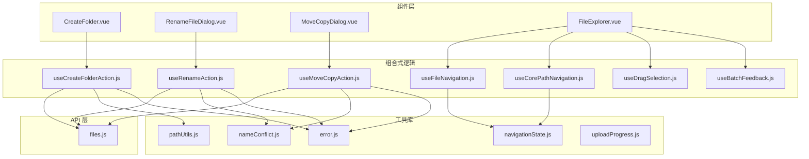
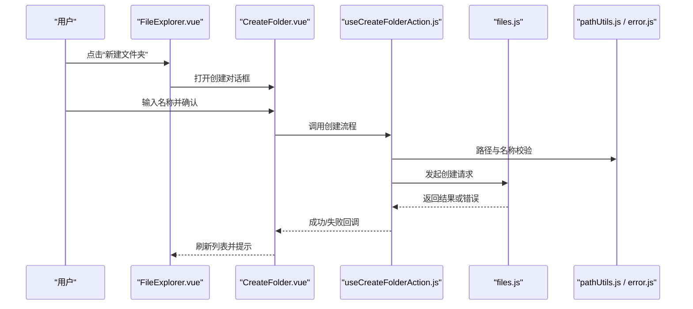
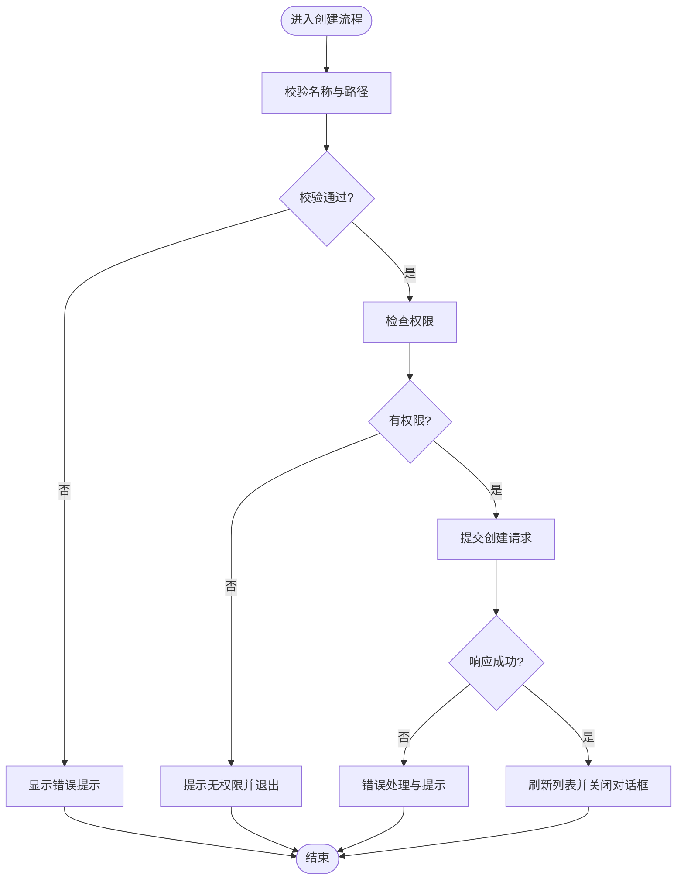
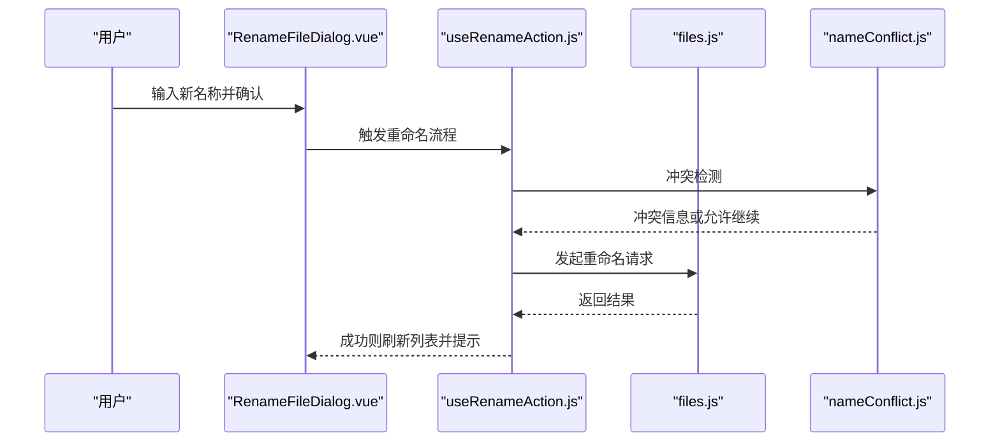
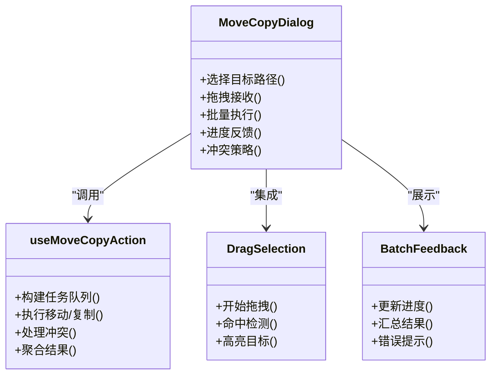
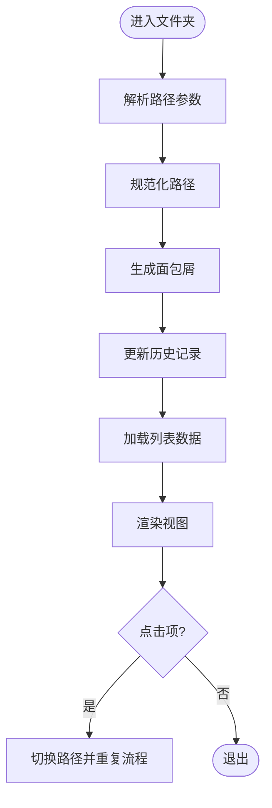
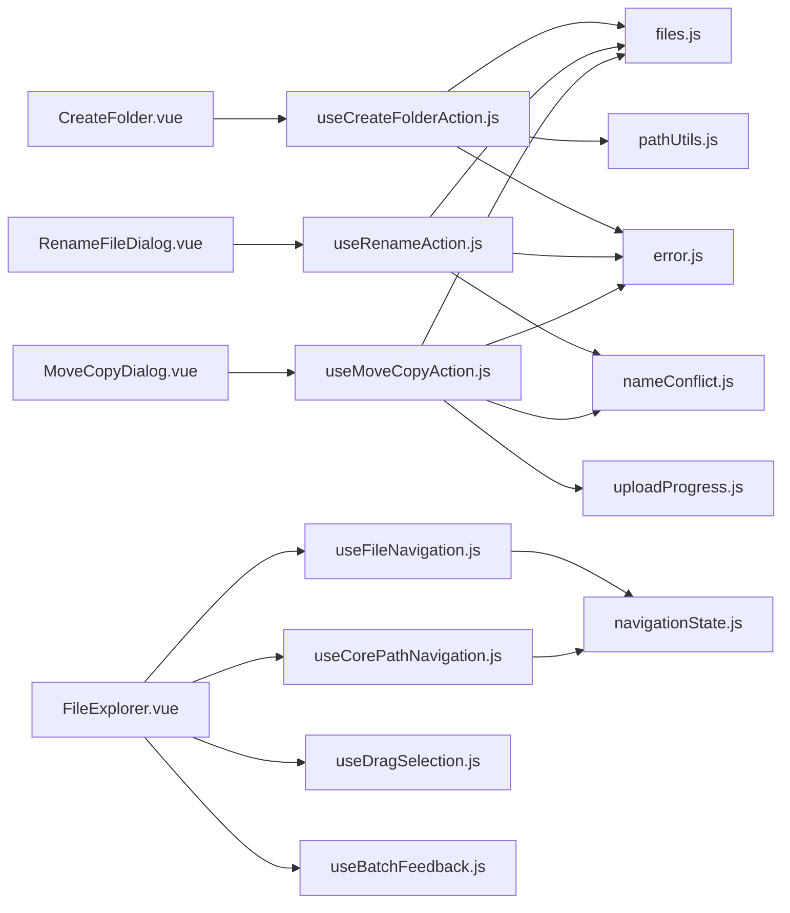

# 文件夹操作

<cite>
**本文引用的文件**   
- [CreateFolder.vue](file://ZXYZdatabaseFront/src/components/CreateFolder.vue)
- [RenameFileDialog.vue](file://ZXYZdatabaseFront/src/components/RenameFileDialog.vue)
- [MoveCopyDialog.vue](file://ZXYZdatabaseFront/src/components/MoveCopyDialog.vue)
- [FileExplorer.vue](file://ZXYZdatabaseFront/src/components/FileExplorer.vue)
- [useCreateFolderAction.js](file://ZXYZdatabaseFront/src/composables/useCreateFolderAction.js)
- [useRenameAction.js](file://ZXYZdatabaseFront/src/composables/useRenameAction.js)
- [useMoveCopyAction.js](file://ZXYZdatabaseFront/src/composables/useMoveCopyAction.js)
- [useFileNavigation.js](file://ZXYZdatabaseFront/src/composables/useFileNavigation.js)
- [useCorePathNavigation.js](file://ZXYZdatabaseFront/src/composables/useCorePathNavigation.js)
- [useDragSelection.js](file://ZXYZdatabaseFront/src/composables/useDragSelection.js)
- [useBatchFeedback.js](file://ZXYZdatabaseFront/src/composables/useBatchFeedback.js)
- [files.js](file://ZXYZdatabaseFront/src/api/files.js)
- [pathUtils.js](file://ZXYZdatabaseFront/src/utils/pathUtils.js)
- [nameConflict.js](file://ZXYZdatabaseFront/src/utils/nameConflict.js)
- [error.js](file://ZXYZdatabaseFront/src/utils/error.js)
- [navigationState.js](file://ZXYZdatabaseFront/src/utils/navigationState.js)
- [uploadProgress.js](file://ZXYZdatabaseFront/src/utils/uploadProgress.js)
</cite>

## 目录
1. [简介](#简介)
2. [项目结构](#项目结构)
3. [核心组件与能力](#核心组件与能力)
4. [架构总览](#架构总览)
5. [详细组件分析](#详细组件分析)
6. [依赖关系分析](#依赖关系分析)
7. [性能考量](#性能考量)
8. [故障排查指南](#故障排查指南)
9. [结论](#结论)
10. [附录：使用示例](#附录使用示例)

## 简介
本文件面向 ZXYZ 前端“文件夹操作”能力，覆盖以下关键场景：
- 文件夹创建：CreateFolder 组件、路径校验、权限检查、交互反馈
- 文件夹重命名：输入校验、冲突检测、实时提示与更新
- 移动/复制：拖拽支持、批量操作、进度反馈与错误处理
- 导航逻辑：路径解析、面包屑导航、历史记录管理
- 用户体验：确认对话框、错误提示、成功反馈与可访问性建议

## 项目结构
与文件夹操作相关的前端代码主要分布在以下位置：
- 组件层：CreateFolder、RenameFileDialog、MoveCopyDialog、FileExplorer
- 组合式逻辑（composables）：useCreateFolderAction、useRenameAction、useMoveCopyAction、useFileNavigation、useCorePathNavigation、useDragSelection、useBatchFeedback
- API 层：files.js
- 工具库：pathUtils、nameConflict、error、navigationState、uploadProgress

图表来源 
- [CreateFolder.vue](file://ZXYZdatabaseFront/src/components/CreateFolder.vue)
- [RenameFileDialog.vue](file://ZXYZdatabaseFront/src/components/RenameFileDialog.vue)
- [MoveCopyDialog.vue](file://ZXYZdatabaseFront/src/components/MoveCopyDialog.vue)
- [FileExplorer.vue](file://ZXYZdatabaseFront/src/components/FileExplorer.vue)
- [useCreateFolderAction.js](file://ZXYZdatabaseFront/src/composables/useCreateFolderAction.js)
- [useRenameAction.js](file://ZXYZdatabaseFront/src/composables/useRenameAction.js)
- [useMoveCopyAction.js](file://ZXYZdatabaseFront/src/composables/useMoveCopyAction.js)
- [useFileNavigation.js](file://ZXYZdatabaseFront/src/composables/useFileNavigation.js)
- [useCorePathNavigation.js](file://ZXYZdatabaseFront/src/composables/useCorePathNavigation.js)
- [useDragSelection.js](file://ZXYZdatabaseFront/src/composables/useDragSelection.js)
- [useBatchFeedback.js](file://ZXYZdatabaseFront/src/composables/useBatchFeedback.js)
- [files.js](file://ZXYZdatabaseFront/src/api/files.js)
- [pathUtils.js](file://ZXYZdatabaseFront/src/utils/pathUtils.js)
- [nameConflict.js](file://ZXYZdatabaseFront/src/utils/nameConflict.js)
- [error.js](file://ZXYZdatabaseFront/src/utils/error.js)
- [navigationState.js](file://ZXYZdatabaseFront/src/utils/navigationState.js)
- [uploadProgress.js](file://ZXYZdatabaseFront/src/utils/uploadProgress.js)

章节来源
- [CreateFolder.vue](file://ZXYZdatabaseFront/src/components/CreateFolder.vue)
- [RenameFileDialog.vue](file://ZXYZdatabaseFront/src/components/RenameFileDialog.vue)
- [MoveCopyDialog.vue](file://ZXYZdatabaseFront/src/components/MoveCopyDialog.vue)
- [FileExplorer.vue](file://ZXYZdatabaseFront/src/components/FileExplorer.vue)
- [useCreateFolderAction.js](file://ZXYZdatabaseFront/src/composables/useCreateFolderAction.js)
- [useRenameAction.js](file://ZXYZdatabaseFront/src/composables/useRenameAction.js)
- [useMoveCopyAction.js](file://ZXYZdatabaseFront/src/composables/useMoveCopyAction.js)
- [useFileNavigation.js](file://ZXYZdatabaseFront/src/composables/useFileNavigation.js)
- [useCorePathNavigation.js](file://ZXYZdatabaseFront/src/composables/useCorePathNavigation.js)
- [useDragSelection.js](file://ZXYZdatabaseFront/src/composables/useDragSelection.js)
- [useBatchFeedback.js](file://ZXYZdatabaseFront/src/composables/useBatchFeedback.js)
- [files.js](file://ZXYZdatabaseFront/src/api/files.js)
- [pathUtils.js](file://ZXYZdatabaseFront/src/utils/pathUtils.js)
- [nameConflict.js](file://ZXYZdatabaseFront/src/utils/nameConflict.js)
- [error.js](file://ZXYZdatabaseFront/src/utils/error.js)
- [navigationState.js](file://ZXYZdatabaseFront/src/utils/navigationState.js)
- [uploadProgress.js](file://ZXYZdatabaseFront/src/utils/uploadProgress.js)

## 核心组件与能力
- CreateFolder：负责新建文件夹的表单、路径校验、权限检查、提交与结果反馈
- RenameFileDialog：负责重命名输入、冲突检测、确认与刷新列表
- MoveCopyDialog：负责选择目标路径、拖拽目标、批量移动/复制、进度与失败重试
- FileExplorer：承载上述能力，提供列表展示、上下文菜单、键盘快捷键、历史与面包屑

章节来源
- [CreateFolder.vue](file://ZXYZdatabaseFront/src/components/CreateFolder.vue)
- [RenameFileDialog.vue](file://ZXYZdatabaseFront/src/components/RenameFileDialog.vue)
- [MoveCopyDialog.vue](file://ZXYZdatabaseFront/src/components/MoveCopyDialog.vue)
- [FileExplorer.vue](file://ZXYZdatabaseFront/src/components/FileExplorer.vue)

## 架构总览
整体采用“组件 + composables + API + 工具库”的分层模式。组件仅负责 UI 与用户交互；业务编排集中在 composables；数据请求通过 files.js 统一封装；通用逻辑由工具库提供。

图表来源 
- [FileExplorer.vue](file://ZXYZdatabaseFront/src/components/FileExplorer.vue)
- [CreateFolder.vue](file://ZXYZdatabaseFront/src/components/CreateFolder.vue)
- [useCreateFolderAction.js](file://ZXYZdatabaseFront/src/composables/useCreateFolderAction.js)
- [files.js](file://ZXYZdatabaseFront/src/api/files.js)
- [pathUtils.js](file://ZXYZdatabaseFront/src/utils/pathUtils.js)
- [error.js](file://ZXYZdatabaseFront/src/utils/error.js)

## 详细组件分析

### 文件夹创建（CreateFolder + useCreateFolderAction）
- 输入校验：名称非空、长度限制、非法字符过滤、路径合法性检查
- 权限检查：基于当前空间/团队权限策略，无权限时禁用提交或提示
- 提交与反馈：提交中禁用按钮，成功后自动刷新列表，失败显示错误原因
- 错误处理：网络异常、服务端错误码映射、用户友好提示

图表来源 
- [CreateFolder.vue](file://ZXYZdatabaseFront/src/components/CreateFolder.vue)
- [useCreateFolderAction.js](file://ZXYZdatabaseFront/src/composables/useCreateFolderAction.js)
- [pathUtils.js](file://ZXYZdatabaseFront/src/utils/pathUtils.js)
- [error.js](file://ZXYZdatabaseFront/src/utils/error.js)

章节来源
- [CreateFolder.vue](file://ZXYZdatabaseFront/src/components/CreateFolder.vue)
- [useCreateFolderAction.js](file://ZXYZdatabaseFront/src/composables/useCreateFolderAction.js)
- [pathUtils.js](file://ZXYZdatabaseFront/src/utils/pathUtils.js)
- [error.js](file://ZXYZdatabaseFront/src/utils/error.js)

### 文件夹重命名（RenameFileDialog + useRenameAction）
- 输入验证：名称唯一性、非法字符、长度与格式限制
- 冲突检测：在目标路径下预检同名项，必要时给出建议名或阻止提交
- 实时更新：成功后立即更新列表项名称，保持选中状态
- 错误处理：区分网络错误与服务端业务错误，提供明确提示

图表来源 
- [RenameFileDialog.vue](file://ZXYZdatabaseFront/src/components/RenameFileDialog.vue)
- [useRenameAction.js](file://ZXYZdatabaseFront/src/composables/useRenameAction.js)
- [files.js](file://ZXYZdatabaseFront/src/api/files.js)
- [nameConflict.js](file://ZXYZdatabaseFront/src/utils/nameConflict.js)

章节来源
- [RenameFileDialog.vue](file://ZXYZdatabaseFront/src/components/RenameFileDialog.vue)
- [useRenameAction.js](file://ZXYZdatabaseFront/src/composables/useRenameAction.js)
- [nameConflict.js](file://ZXYZdatabaseFront/src/utils/nameConflict.js)
- [files.js](file://ZXYZdatabaseFront/src/api/files.js)

### 移动/复制（MoveCopyDialog + useMoveCopyAction）
- 拖拽支持：将文件或文件夹拖入目标节点，高亮可用区域，禁止非法目标
- 批量操作：支持多选后统一移动/复制，分片执行与并发控制
- 进度反馈：全局进度条、单项进度、失败重试与跳过
- 冲突处理：目标存在同名项时的策略（覆盖/跳过/重命名）

图表来源 
- [MoveCopyDialog.vue](file://ZXYZdatabaseFront/src/components/MoveCopyDialog.vue)
- [useMoveCopyAction.js](file://ZXYZdatabaseFront/src/composables/useMoveCopyAction.js)
- [useDragSelection.js](file://ZXYZdatabaseFront/src/composables/useDragSelection.js)
- [useBatchFeedback.js](file://ZXYZdatabaseFront/src/composables/useBatchFeedback.js)

章节来源
- [MoveCopyDialog.vue](file://ZXYZdatabaseFront/src/components/MoveCopyDialog.vue)
- [useMoveCopyAction.js](file://ZXYZdatabaseFront/src/composables/useMoveCopyAction.js)
- [useDragSelection.js](file://ZXYZdatabaseFront/src/composables/useDragSelection.js)
- [useBatchFeedback.js](file://ZXYZdatabaseFront/src/composables/useBatchFeedback.js)

### 导航逻辑（FileExplorer + useFileNavigation + useCorePathNavigation）
- 路径解析：标准化路径、拼接层级、处理相对/绝对路径
- 面包屑导航：动态生成层级路径，支持点击跳转与回退
- 历史记录：前进/后退、去重、最大长度限制、跨会话持久化
- 状态同步：路由查询参数与内部状态双向同步

图表来源 
- [FileExplorer.vue](file://ZXYZdatabaseFront/src/components/FileExplorer.vue)
- [useFileNavigation.js](file://ZXYZdatabaseFront/src/composables/useFileNavigation.js)
- [useCorePathNavigation.js](file://ZXYZdatabaseFront/src/composables/useCorePathNavigation.js)
- [navigationState.js](file://ZXYZdatabaseFront/src/utils/navigationState.js)

章节来源
- [FileExplorer.vue](file://ZXYZdatabaseFront/src/components/FileExplorer.vue)
- [useFileNavigation.js](file://ZXYZdatabaseFront/src/composables/useFileNavigation.js)
- [useCorePathNavigation.js](file://ZXYZdatabaseFront/src/composables/useCorePathNavigation.js)
- [navigationState.js](file://ZXYZdatabaseFront/src/utils/navigationState.js)

## 依赖关系分析
- 组件对 composables 的依赖：UI 层不直接处理业务规则，所有校验、请求编排、状态更新均下沉至 composables
- composables 对 API 的依赖：统一通过 files.js 发起请求，保证接口契约一致
- 工具库复用：pathUtils 用于路径处理，nameConflict 用于冲突检测，error 用于错误归一化，navigationState 用于历史与状态管理，uploadProgress 用于上传/批量操作的进度

图表来源 
- [CreateFolder.vue](file://ZXYZdatabaseFront/src/components/CreateFolder.vue)
- [RenameFileDialog.vue](file://ZXYZdatabaseFront/src/components/RenameFileDialog.vue)
- [MoveCopyDialog.vue](file://ZXYZdatabaseFront/src/components/MoveCopyDialog.vue)
- [FileExplorer.vue](file://ZXYZdatabaseFront/src/components/FileExplorer.vue)
- [useCreateFolderAction.js](file://ZXYZdatabaseFront/src/composables/useCreateFolderAction.js)
- [useRenameAction.js](file://ZXYZdatabaseFront/src/composables/useRenameAction.js)
- [useMoveCopyAction.js](file://ZXYZdatabaseFront/src/composables/useMoveCopyAction.js)
- [useFileNavigation.js](file://ZXYZdatabaseFront/src/composables/useFileNavigation.js)
- [useCorePathNavigation.js](file://ZXYZdatabaseFront/src/composables/useCorePathNavigation.js)
- [useDragSelection.js](file://ZXYZdatabaseFront/src/composables/useDragSelection.js)
- [useBatchFeedback.js](file://ZXYZdatabaseFront/src/composables/useBatchFeedback.js)
- [files.js](file://ZXYZdatabaseFront/src/api/files.js)
- [pathUtils.js](file://ZXYZdatabaseFront/src/utils/pathUtils.js)
- [nameConflict.js](file://ZXYZdatabaseFront/src/utils/nameConflict.js)
- [error.js](file://ZXYZdatabaseFront/src/utils/error.js)
- [navigationState.js](file://ZXYZdatabaseFront/src/utils/navigationState.js)
- [uploadProgress.js](file://ZXYZdatabaseFront/src/utils/uploadProgress.js)

章节来源
- [files.js](file://ZXYZdatabaseFront/src/api/files.js)
- [pathUtils.js](file://ZXYZdatabaseFront/src/utils/pathUtils.js)
- [nameConflict.js](file://ZXYZdatabaseFront/src/utils/nameConflict.js)
- [error.js](file://ZXYZdatabaseFront/src/utils/error.js)
- [navigationState.js](file://ZXYZdatabaseFront/src/utils/navigationState.js)
- [uploadProgress.js](file://ZXYZdatabaseFront/src/utils/uploadProgress.js)

## 性能考量
- 批量操作并发控制：限制同时执行的移动/复制任务数，避免阻塞 UI 与后端
- 增量更新：重命名成功后仅更新受影响节点，减少全量刷新
- 防抖与节流：输入框变更与搜索时进行节流，降低不必要的请求
- 懒加载与虚拟滚动：大列表场景按需渲染，提升滚动性能
- 错误快速失败：网络错误即时提示，避免长时间等待

[本节为通用指导，无需特定文件引用]

## 故障排查指南
- 常见错误类型
  - 网络错误：超时、断网、跨域等，需检查网关与 CORS 配置
  - 权限不足：无写入权限导致创建/重命名/移动失败，需检查团队/空间权限策略
  - 名称冲突：目标路径已存在同名项，需调整名称或选择覆盖策略
  - 路径非法：包含非法字符或层级过深，需规范化路径
- 定位方法
  - 查看浏览器控制台日志与网络面板请求/响应
  - 检查 composables 中的错误处理分支与提示文案
  - 核对 pathUtils 的路径规范化逻辑与 nameConflict 的冲突检测结果
- 恢复建议
  - 重试机制：对幂等操作（如重命名）提供重试入口
  - 降级策略：批量操作中失败项跳过并记录，完成后汇总报告
  - 用户引导：根据错误类型给出明确的修复步骤

章节来源
- [error.js](file://ZXYZdatabaseFront/src/utils/error.js)
- [pathUtils.js](file://ZXYZdatabaseFront/src/utils/pathUtils.js)
- [nameConflict.js](file://ZXYZdatabaseFront/src/utils/nameConflict.js)
- [useCreateFolderAction.js](file://ZXYZdatabaseFront/src/composables/useCreateFolderAction.js)
- [useRenameAction.js](file://ZXYZdatabaseFront/src/composables/useRenameAction.js)
- [useMoveCopyAction.js](file://ZXYZdatabaseFront/src/composables/useMoveCopyAction.js)

## 结论
ZXYZ 前端的文件夹操作以清晰的组件—组合式逻辑—API—工具库分层实现，具备完善的输入校验、权限检查、冲突检测、拖拽与批量操作、进度反馈与错误处理。通过标准化的路径解析与导航状态管理，保证了良好的用户体验与可维护性。建议在后续迭代中持续优化并发控制、错误恢复与可观测性。

[本节为总结性内容，无需特定文件引用]

## 附录：使用示例
以下为在不同场景下调用文件夹操作 API 的典型用法说明（以路径与行为描述为主，不展示具体代码）：

- 创建文件夹
  - 触发方式：在 FileExplorer 中点击“新建文件夹”，弹出 CreateFolder 对话框
  - 输入要求：填写合法名称，系统自动校验非法字符与长度
  - 权限检查：若当前用户无写入权限，按钮禁用或提交时报错
  - 提交流程：调用 useCreateFolderAction → files.js → 后端服务
  - 结果反馈：成功则刷新列表并提示；失败则显示错误原因

- 重命名文件夹
  - 触发方式：在列表中选择文件夹，点击“重命名”或双击编辑
  - 输入要求：新名称不能为空且不与目标路径下的现有项冲突
  - 冲突检测：nameConflict 预检并给出建议名或阻止提交
  - 提交流程：调用 useRenameAction → files.js → 后端服务
  - 结果反馈：成功则就地更新名称并保持选中；失败则提示错误

- 移动/复制文件夹
  - 触发方式：多选后点击“移动/复制”，或在列表中拖拽到目标节点
  - 目标校验：仅允许移动到有写入权限的目录，非法目标不可放置
  - 批量执行：按任务队列顺序执行，支持并发控制与失败重试
  - 进度反馈：使用 uploadProgress 展示总体与单项进度
  - 结果反馈：汇总成功/失败数量，失败项提供重试或跳过选项

- 导航与历史
  - 路径解析：从路由查询参数或内部状态解析并规范化路径
  - 面包屑：自动生成层级路径，点击任意层级可跳转
  - 历史记录：支持前进/后退，限制最大长度，跨页面保持一致

章节来源
- [CreateFolder.vue](file://ZXYZdatabaseFront/src/components/CreateFolder.vue)
- [RenameFileDialog.vue](file://ZXYZdatabaseFront/src/components/RenameFileDialog.vue)
- [MoveCopyDialog.vue](file://ZXYZdatabaseFront/src/components/MoveCopyDialog.vue)
- [FileExplorer.vue](file://ZXYZdatabaseFront/src/components/FileExplorer.vue)
- [useCreateFolderAction.js](file://ZXYZdatabaseFront/src/composables/useCreateFolderAction.js)
- [useRenameAction.js](file://ZXYZdatabaseFront/src/composables/useRenameAction.js)
- [useMoveCopyAction.js](file://ZXYZdatabaseFront/src/composables/useMoveCopyAction.js)
- [useFileNavigation.js](file://ZXYZdatabaseFront/src/composables/useFileNavigation.js)
- [useCorePathNavigation.js](file://ZXYZdatabaseFront/src/composables/useCorePathNavigation.js)
- [files.js](file://ZXYZdatabaseFront/src/api/files.js)
- [pathUtils.js](file://ZXYZdatabaseFront/src/utils/pathUtils.js)
- [nameConflict.js](file://ZXYZdatabaseFront/src/utils/nameConflict.js)
- [uploadProgress.js](file://ZXYZdatabaseFront/src/utils/uploadProgress.js)