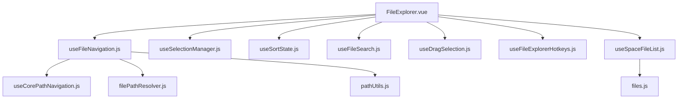
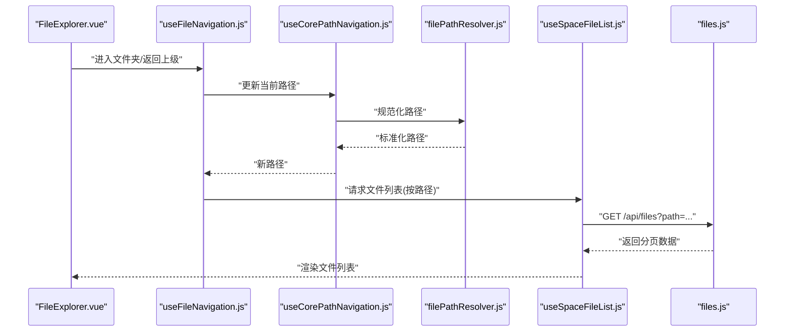
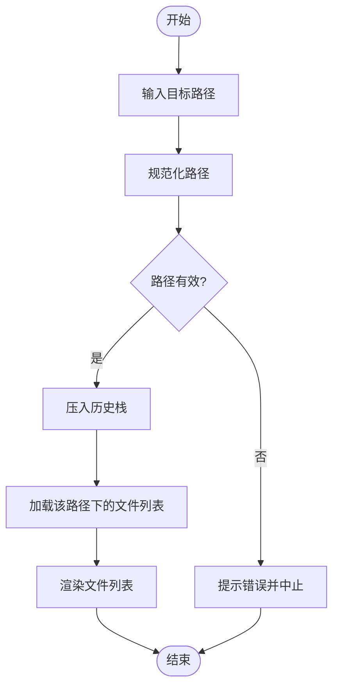
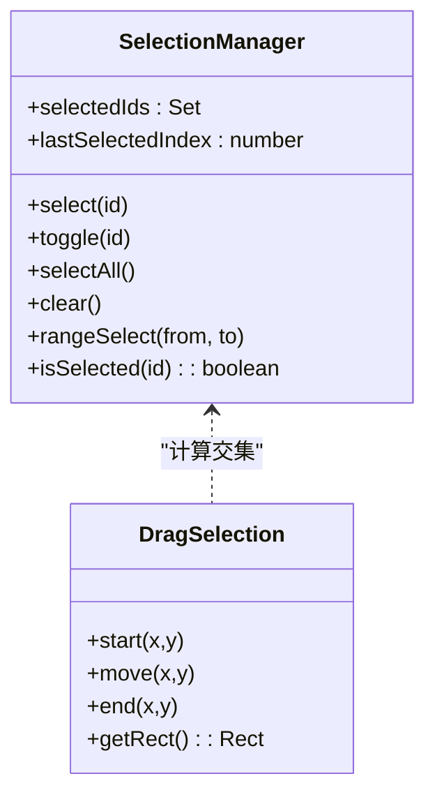
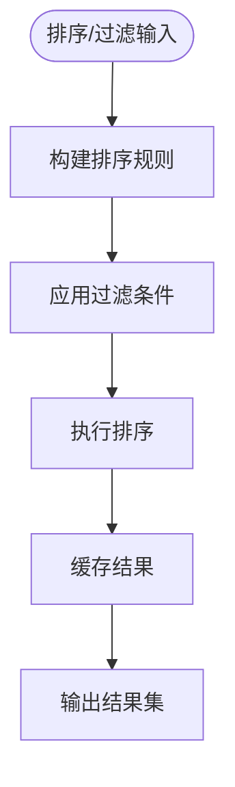
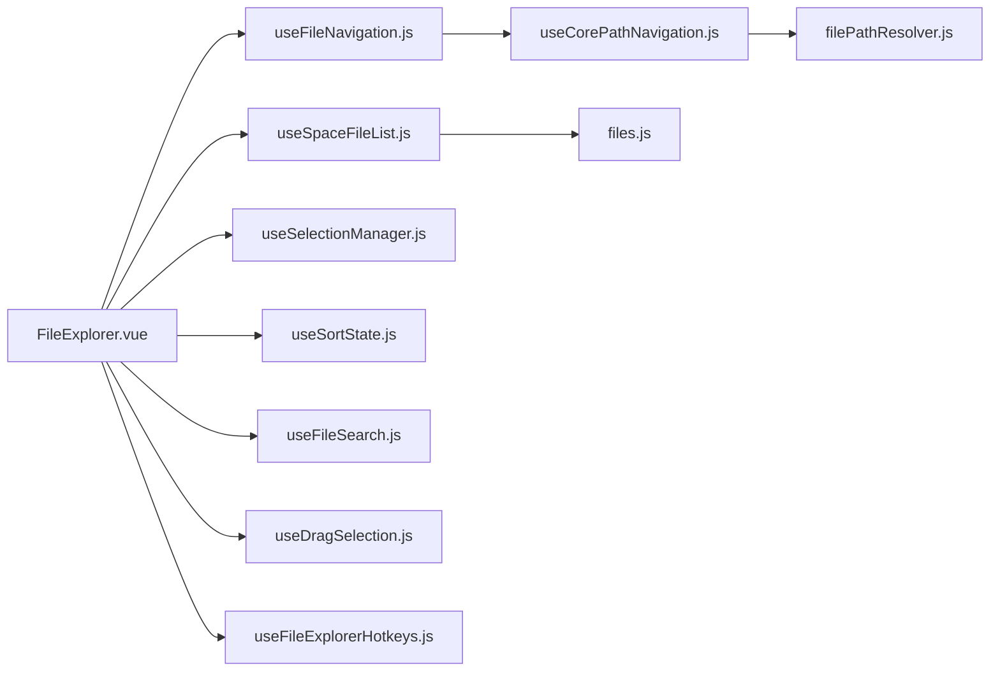

# 文件浏览器组件

<cite>
**本文引用的文件**
- [FileExplorer.vue](file://ZXYZdatabaseFront/src/components/FileExplorer.vue)
- [useFileNavigation.js](file://ZXYZdatabaseFront/src/composables/useFileNavigation.js)
- [useCorePathNavigation.js](file://ZXYZdatabaseFront/src/composables/useCorePathNavigation.js)
- [useSelectionManager.js](file://ZXYZdatabaseFront/src/composables/useSelectionManager.js)
- [useSortState.js](file://ZXYZdatabaseFront/src/composables/useSortState.js)
- [useFileSearch.js](file://ZXYZdatabaseFront/src/composables/useFileSearch.js)
- [useSpaceFileList.js](file://ZXYZdatabaseFront/src/composables/useSpaceFileList.js)
- [useDragSelection.js](file://ZXYZdatabaseFront/src/composables/useDragSelection.js)
- [useFileExplorerHotkeys.js](file://ZXYZdatabaseFront/src/composables/useFileExplorerHotkeys.js)
- [filePathResolver.js](file://ZXYZdatabaseFront/src/services/filePathResolver.js)
- [pathUtils.js](file://ZXYZdatabaseFront/src/utils/pathUtils.js)
- [selection.js](file://ZXYZdatabaseFront/src/utils/selection.js)
- [files.js](file://ZXYZdatabaseFront/src/api/files.js)
</cite>

## 目录
1. [简介](#简介)
2. [项目结构](#项目结构)
3. [核心组件](#核心组件)
4. [架构总览](#架构总览)
5. [详细组件分析](#详细组件分析)
6. [依赖关系分析](#依赖关系分析)
7. [性能考虑](#性能考虑)
8. [故障排查指南](#故障排查指南)
9. [结论](#结论)
10. [附录](#附录)

## 简介
本文件为 ZXYZ 前端“文件浏览器”组件的详细技术文档，聚焦 FileExplorer 组件及其相关组合式函数（composables）与工具服务。内容覆盖：
- 文件列表展示、网格视图与列表视图切换
- 文件导航逻辑（路径管理、历史记录、快速跳转）
- 文件选择机制（单选、多选、全选、范围选择）
- 排序与过滤（多字段排序、条件过滤、自定义规则）
- 完整配置示例（属性、事件、方法）
- 性能优化策略（虚拟滚动、分页加载、缓存机制）

## 项目结构
文件浏览器功能由一个主组件与多个组合式函数协同实现，遵循 Vue 3 Composition API + <script setup> 模式，并通过 Pinia 或本地状态管理数据流。关键文件组织如下：
- 组件层：FileExplorer.vue
- 交互逻辑层：useFileNavigation.js、useSelectionManager.js、useSortState.js、useFileSearch.js、useDragSelection.js、useFileExplorerHotkeys.js
- 数据与路径层：useSpaceFileList.js、useCorePathNavigation.js、filePathResolver.js、pathUtils.js
- 接口层：files.js

图表来源
- [FileExplorer.vue](file://ZXYZdatabaseFront/src/components/FileExplorer.vue)
- [useFileNavigation.js](file://ZXYZdatabaseFront/src/composables/useFileNavigation.js)
- [useSelectionManager.js](file://ZXYZdatabaseFront/src/composables/useSelectionManager.js)
- [useSortState.js](file://ZXYZdatabaseFront/src/composables/useSortState.js)
- [useFileSearch.js](file://ZXYZdatabaseFront/src/composables/useFileSearch.js)
- [useDragSelection.js](file://ZXYZdatabaseFront/src/composables/useDragSelection.js)
- [useFileExplorerHotkeys.js](file://ZXYZdatabaseFront/src/composables/useFileExplorerHotkeys.js)
- [useCorePathNavigation.js](file://ZXYZdatabaseFront/src/composables/useCorePathNavigation.js)
- [filePathResolver.js](file://ZXYZdatabaseFront/src/services/filePathResolver.js)
- [pathUtils.js](file://ZXYZdatabaseFront/src/utils/pathUtils.js)
- [useSpaceFileList.js](file://ZXYZdatabaseFront/src/composables/useSpaceFileList.js)
- [files.js](file://ZXYZdatabaseFront/src/api/files.js)

章节来源
- [FileExplorer.vue](file://ZXYZdatabaseFront/src/components/FileExplorer.vue)
- [useFileNavigation.js](file://ZXYZdatabaseFront/src/composables/useFileNavigation.js)
- [useSpaceFileList.js](file://ZXYZdatabaseFront/src/composables/useSpaceFileList.js)
- [files.js](file://ZXYZdatabaseFront/src/api/files.js)

## 核心组件
- FileExplorer.vue：文件浏览器的入口组件，负责视图渲染（网格/列表）、用户交互（点击、拖拽、快捷键）、以及调用各组合式函数完成导航、选择、排序、搜索等能力。
- useFileNavigation.js：封装文件导航的核心逻辑，包括路径解析、历史栈管理、进入/返回文件夹、面包屑导航等。
- useSelectionManager.js：统一管理文件选择状态，支持单选、多选、全选、范围选择及反选。
- useSortState.js：维护排序状态与排序算法，支持按名称、大小、时间等多字段排序。
- useFileSearch.js：提供关键词搜索与过滤能力，支持模糊匹配与结果高亮。
- useSpaceFileList.js：负责文件列表数据的获取、分页、缓存与刷新。
- useDragSelection.js：处理鼠标拖拽框选区域的选择行为。
- useFileExplorerHotkeys.js：绑定键盘快捷键（如 Ctrl+A、Shift+Click、方向键导航）。
- filePathResolver.js / pathUtils.js：路径解析与工具函数，确保路径规范化与跨平台兼容。
- files.js：后端文件相关 API 的封装。

章节来源
- [FileExplorer.vue](file://ZXYZdatabaseFront/src/components/FileExplorer.vue)
- [useFileNavigation.js](file://ZXYZdatabaseFront/src/composables/useFileNavigation.js)
- [useSelectionManager.js](file://ZXYZdatabaseFront/src/composables/useSelectionManager.js)
- [useSortState.js](file://ZXYZdatabaseFront/src/composables/useSortState.js)
- [useFileSearch.js](file://ZXYZdatabaseFront/src/composables/useFileSearch.js)
- [useSpaceFileList.js](file://ZXYZdatabaseFront/src/composables/useSpaceFileList.js)
- [useDragSelection.js](file://ZXYZdatabaseFront/src/composables/useDragSelection.js)
- [useFileExplorerHotkeys.js](file://ZXYZdatabaseFront/src/composables/useFileExplorerHotkeys.js)
- [filePathResolver.js](file://ZXYZdatabaseFront/src/services/filePathResolver.js)
- [pathUtils.js](file://ZXYZdatabaseFront/src/utils/pathUtils.js)
- [files.js](file://ZXYZdatabaseFront/src/api/files.js)

## 架构总览
下图展示了 FileExplorer 组件与其依赖的组合式函数之间的调用关系与数据流向。

图表来源
- [FileExplorer.vue](file://ZXYZdatabaseFront/src/components/FileExplorer.vue)
- [useFileNavigation.js](file://ZXYZdatabaseFront/src/composables/useFileNavigation.js)
- [useCorePathNavigation.js](file://ZXYZdatabaseFront/src/composables/useCorePathNavigation.js)
- [filePathResolver.js](file://ZXYZdatabaseFront/src/services/filePathResolver.js)
- [useSpaceFileList.js](file://ZXYZdatabaseFront/src/composables/useSpaceFileList.js)
- [files.js](file://ZXYZdatabaseFront/src/api/files.js)

## 详细组件分析

### 文件列表展示与视图切换
- 列表展示：通过 useSpaceFileList.js 拉取并缓存文件数据，结合分页参数控制加载。
- 视图切换：在 FileExplorer.vue 中根据视图模式（grid/list）渲染不同布局；切换时保持选中状态与排序/过滤状态一致。
- 性能要点：对大列表启用虚拟滚动（按需渲染可视区域），减少 DOM 节点数量。

章节来源
- [FileExplorer.vue](file://ZXYZdatabaseFront/src/components/FileExplorer.vue)
- [useSpaceFileList.js](file://ZXYZdatabaseFront/src/composables/useSpaceFileList.js)

### 文件导航逻辑（路径管理、历史记录、快速跳转）
- 路径管理：使用 useCorePathNavigation.js 维护当前路径，filePathResolver.js 进行路径规范化，pathUtils.js 提供拼接与分割工具。
- 历史记录：useFileNavigation.js 维护历史栈，支持前进/后退与面包屑跳转。
- 快速跳转：支持输入路径直接跳转，自动校验路径合法性与权限。

图表来源
- [useFileNavigation.js](file://ZXYZdatabaseFront/src/composables/useFileNavigation.js)
- [useCorePathNavigation.js](file://ZXYZdatabaseFront/src/composables/useCorePathNavigation.js)
- [filePathResolver.js](file://ZXYZdatabaseFront/src/services/filePathResolver.js)
- [pathUtils.js](file://ZXYZdatabaseFront/src/utils/pathUtils.js)

章节来源
- [useFileNavigation.js](file://ZXYZdatabaseFront/src/composables/useFileNavigation.js)
- [useCorePathNavigation.js](file://ZXYZdatabaseFront/src/composables/useCorePathNavigation.js)
- [filePathResolver.js](file://ZXYZdatabaseFront/src/services/filePathResolver.js)
- [pathUtils.js](file://ZXYZdatabaseFront/src/utils/pathUtils.js)

### 文件选择机制（单选、多选、全选、范围选择）
- 单选：点击单个文件项，清空其他选择并选中该项。
- 多选：按住 Ctrl/Cmd 点击，累加选择集合。
- 全选：Ctrl/Cmd+A 或按钮触发，选中当前页所有可见项。
- 范围选择：Shift+点击，基于上次选中项与当前项之间区间选择。
- 拖拽框选：useDragSelection.js 监听鼠标拖拽区域，计算落点与项交集。

图表来源
- [useSelectionManager.js](file://ZXYZdatabaseFront/src/composables/useSelectionManager.js)
- [useDragSelection.js](file://ZXYZdatabaseFront/src/composables/useDragSelection.js)
- [selection.js](file://ZXYZdatabaseFront/src/utils/selection.js)

章节来源
- [useSelectionManager.js](file://ZXYZdatabaseFront/src/composables/useSelectionManager.js)
- [useDragSelection.js](file://ZXYZdatabaseFront/src/composables/useDragSelection.js)
- [selection.js](file://ZXYZdatabaseFront/src/utils/selection.js)

### 排序与过滤（多字段排序、条件过滤、自定义规则）
- 多字段排序：支持按名称、大小、修改时间等字段升/降序排列，可组合优先级。
- 条件过滤：支持类型、扩展名、大小范围等过滤条件。
- 自定义规则：允许传入比较函数或规则对象，动态调整排序与过滤逻辑。

图表来源
- [useSortState.js](file://ZXYZdatabaseFront/src/composables/useSortState.js)
- [useFileSearch.js](file://ZXYZdatabaseFront/src/composables/useFileSearch.js)

章节来源
- [useSortState.js](file://ZXYZdatabaseFront/src/composables/useSortState.js)
- [useFileSearch.js](file://ZXYZdatabaseFront/src/composables/useFileSearch.js)

### 快捷键与交互增强
- 快捷键：Ctrl/Cmd+A 全选、Delete 删除、Enter 打开、Backspace 返回上级、方向键移动焦点。
- 交互增强：右键菜单、拖拽重命名/移动、双击打开、长按预览等。

章节来源
- [useFileExplorerHotkeys.js](file://ZXYZdatabaseFront/src/composables/useFileExplorerHotkeys.js)
- [FileExplorer.vue](file://ZXYZdatabaseFront/src/components/FileExplorer.vue)

## 依赖关系分析
- 组件与组合式函数解耦：FileExplorer.vue 仅负责视图与事件分发，业务逻辑下沉至组合式函数，提升可测试性与复用性。
- 数据流单向：从 API → useSpaceFileList.js → FileExplorer.vue，避免双向绑定带来的状态不一致。
- 路径与导航分离：useCorePathNavigation.js 专注路径状态，useFileNavigation.js 专注导航动作，职责清晰。

图表来源
- [FileExplorer.vue](file://ZXYZdatabaseFront/src/components/FileExplorer.vue)
- [useSpaceFileList.js](file://ZXYZdatabaseFront/src/composables/useSpaceFileList.js)
- [useFileNavigation.js](file://ZXYZdatabaseFront/src/composables/useFileNavigation.js)
- [useCorePathNavigation.js](file://ZXYZdatabaseFront/src/composables/useCorePathNavigation.js)
- [filePathResolver.js](file://ZXYZdatabaseFront/src/services/filePathResolver.js)
- [useSelectionManager.js](file://ZXYZdatabaseFront/src/composables/useSelectionManager.js)
- [useSortState.js](file://ZXYZdatabaseFront/src/composables/useSortState.js)
- [useFileSearch.js](file://ZXYZdatabaseFront/src/composables/useFileSearch.js)
- [useDragSelection.js](file://ZXYZdatabaseFront/src/composables/useDragSelection.js)
- [useFileExplorerHotkeys.js](file://ZXYZdatabaseFront/src/composables/useFileExplorerHotkeys.js)
- [files.js](file://ZXYZdatabaseFront/src/api/files.js)

章节来源
- [FileExplorer.vue](file://ZXYZdatabaseFront/src/components/FileExplorer.vue)
- [useSpaceFileList.js](file://ZXYZdatabaseFront/src/composables/useSpaceFileList.js)
- [useFileNavigation.js](file://ZXYZdatabaseFront/src/composables/useFileNavigation.js)
- [useCorePathNavigation.js](file://ZXYZdatabaseFront/src/composables/useCorePathNavigation.js)
- [filePathResolver.js](file://ZXYZdatabaseFront/src/services/filePathResolver.js)
- [useSelectionManager.js](file://ZXYZdatabaseFront/src/composables/useSelectionManager.js)
- [useSortState.js](file://ZXYZdatabaseFront/src/composables/useSortState.js)
- [useFileSearch.js](file://ZXYZdatabaseFront/src/composables/useFileSearch.js)
- [useDragSelection.js](file://ZXYZdatabaseFront/src/composables/useDragSelection.js)
- [useFileExplorerHotkeys.js](file://ZXYZdatabaseFront/src/composables/useFileExplorerHotkeys.js)
- [files.js](file://ZXYZdatabaseFront/src/api/files.js)

## 性能考虑
- 虚拟滚动：对长列表采用虚拟滚动，仅渲染可视区域元素，显著降低内存占用与重排开销。
- 分页加载：useSpaceFileList.js 支持分页参数，按需加载下一页，避免一次性拉取大量数据。
- 缓存机制：对相同路径与查询条件的结果进行缓存，命中则直接返回，减少重复请求。
- 防抖与节流：搜索输入与窗口 resize 事件使用防抖/节流，降低频繁计算与渲染。
- 懒加载缩略图：图片类文件延迟加载缩略图，优先显示文本信息。

[本节为通用性能建议，不直接分析具体文件]

## 故障排查指南
- 路径异常：检查 filePathResolver.js 的路径规范化逻辑与 pathUtils.js 的工具函数是否正确处理相对/绝对路径与分隔符。
- 选择状态错乱：确认 useSelectionManager.js 的 selectedIds 与 lastSelectedIndex 更新时机，避免并发操作导致状态不一致。
- 排序/过滤失效：验证 useSortState.js 的规则构建与 useFileSearch.js 的过滤条件是否生效，必要时打印中间结果。
- 网络请求失败：查看 files.js 的错误处理与重试策略，确认后端接口返回码与消息体结构。

章节来源
- [filePathResolver.js](file://ZXYZdatabaseFront/src/services/filePathResolver.js)
- [pathUtils.js](file://ZXYZdatabaseFront/src/utils/pathUtils.js)
- [useSelectionManager.js](file://ZXYZdatabaseFront/src/composables/useSelectionManager.js)
- [useSortState.js](file://ZXYZdatabaseFront/src/composables/useSortState.js)
- [useFileSearch.js](file://ZXYZdatabaseFront/src/composables/useFileSearch.js)
- [files.js](file://ZXYZdatabaseFront/src/api/files.js)

## 结论
FileExplorer 组件通过清晰的职责划分与组合式函数协作，实现了完整的文件浏览体验。其导航、选择、排序、过滤与性能优化策略共同保障了在大文件量场景下的流畅交互。建议在后续迭代中继续完善错误边界、无障碍支持与国际化能力。

[本节为总结性内容，不直接分析具体文件]

## 附录
- 组件配置示例（属性、事件、方法）
  - 属性：viewMode（grid/list）、pageSize、enableVirtualScroll、allowMultiSelect、defaultSortField、filterRules
  - 事件：onNavigate(path)、onSelect(ids)、onSort(field, order)、onSearch(keyword)、onRefresh()
  - 方法：goTo(path)、back()、forward()、selectAll()、clearSelection()、setFilter(rules)
- 最佳实践
  - 将路径与导航状态集中管理，避免分散更新
  - 对大数据集启用虚拟滚动与分页
  - 使用统一的错误处理与日志记录
  - 对敏感操作增加二次确认与权限校验

[本节为补充说明，不直接分析具体文件]