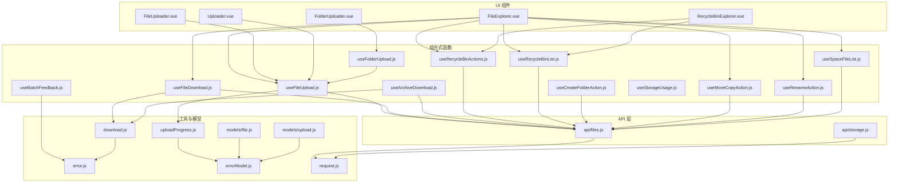
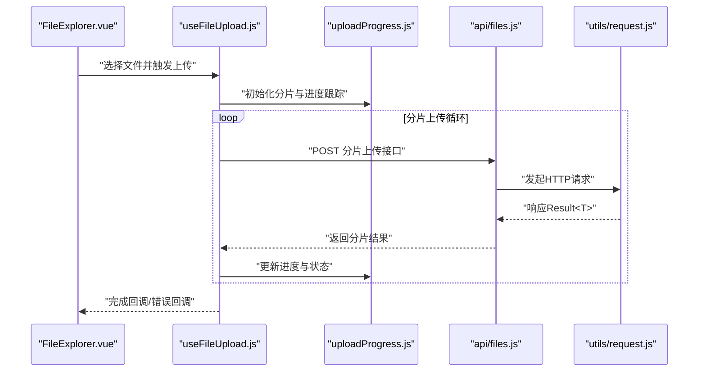
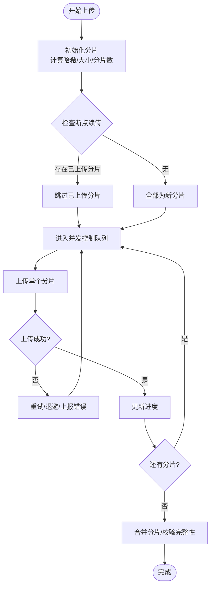
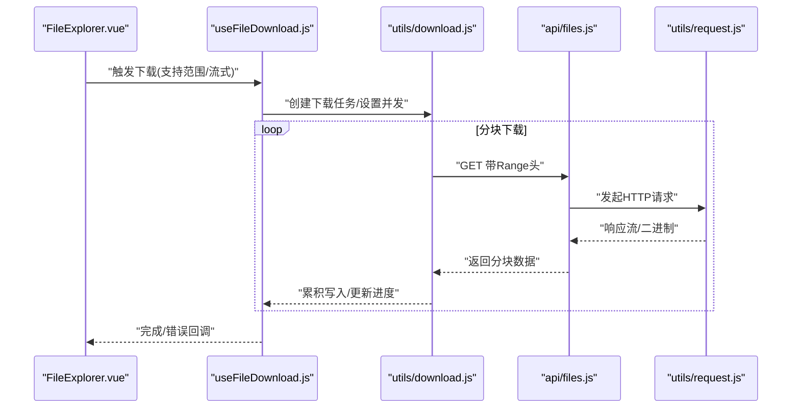
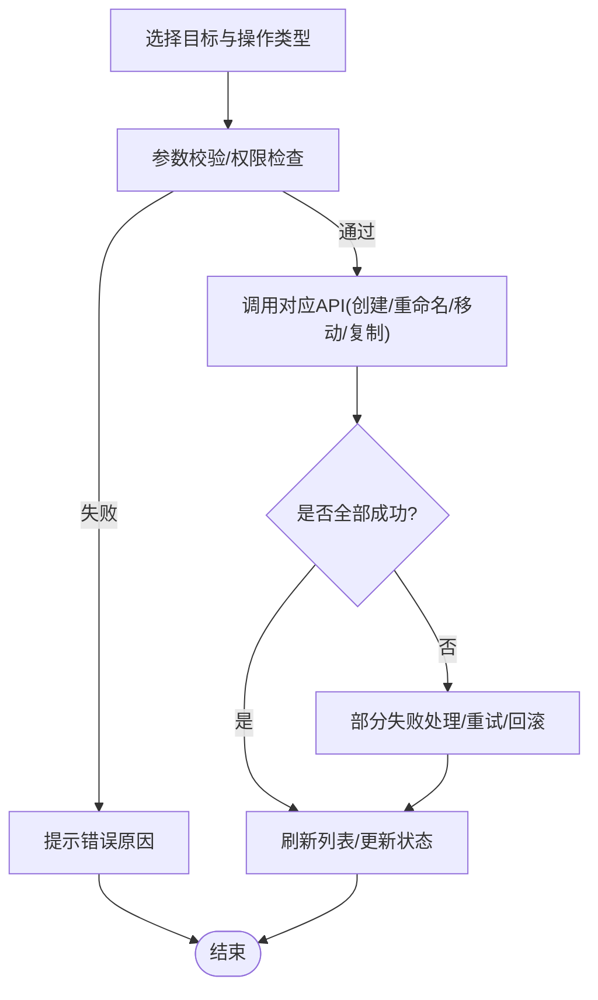
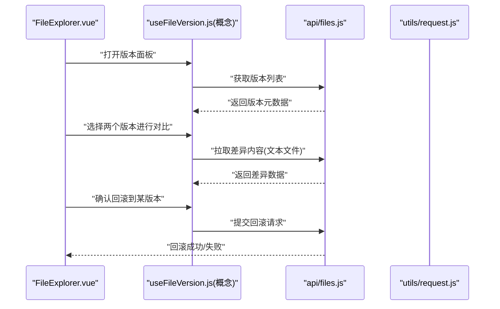
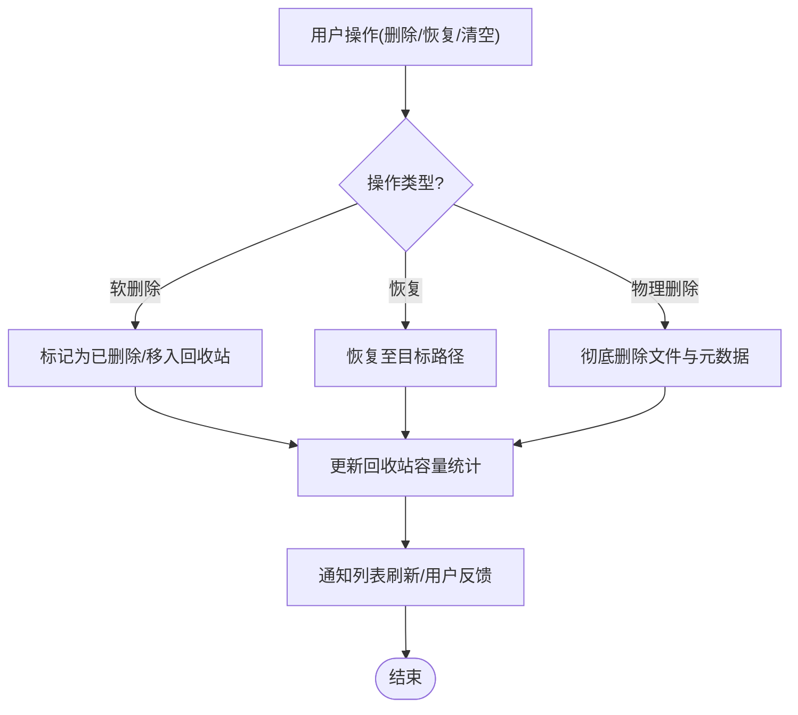
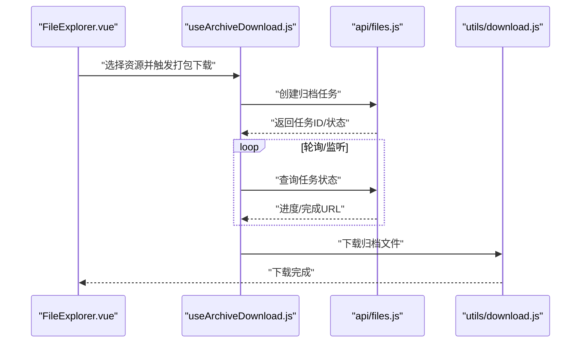
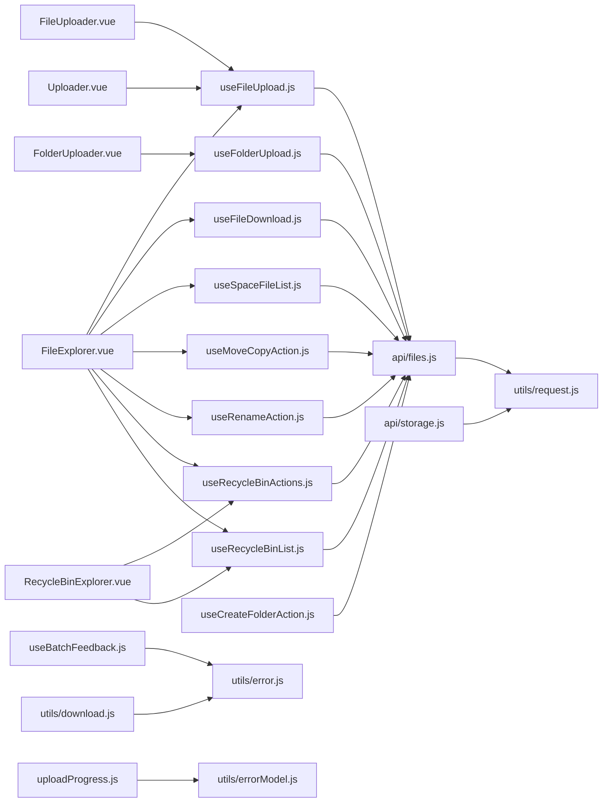

# 文件管理器模块

<cite>
**本文引用的文件**   
- [FileExplorer.vue](file://ZXYZdatabaseFront/src/components/FileExplorer.vue)
- [FileUploader.vue](file://ZXYZdatabaseFront/src/components/FileUploader.vue)
- [FolderUploader.vue](file://ZXYZdatabaseFront/src/components/FolderUploader.vue)
- [Uploader.vue](file://ZXYZdatabaseFront/src/components/Uploader.vue)
- [shared.js](file://ZXYZdatabaseFront/src/components/uploader/shared.js)
- [useFileUpload.js](file://ZXYZdatabaseFront/src/composables/useFileUpload.js)
- [useFolderUpload.js](file://ZXYZdatabaseFront/src/composables/useFolderUpload.js)
- [useFileDownload.js](file://ZXYZdatabaseFront/src/composables/useFileDownload.js)
- [useArchiveDownload.js](file://ZXYZdatabaseFront/src/composables/useArchiveDownload.js)
- [useRecycleBinActions.js](file://ZXYZdatabaseFront/src/composables/useRecycleBinActions.js)
- [useRecycleBinList.js](file://ZXYZdatabaseFront/src/composables/useRecycleBinList.js)
- [useCreateFolderAction.js](file://ZXYZdatabaseFront/src/composables/useCreateFolderAction.js)
- [useMoveCopyAction.js](file://ZXYZdatabaseFront/src/composables/useMoveCopyAction.js)
- [useRenameAction.js](file://ZXYZdatabaseFront/src/composables/useRenameAction.js)
- [useSpaceFileList.js](file://ZXYZdatabaseFront/src/composables/useSpaceFileList.js)
- [useBatchFeedback.js](file://ZXYZdatabaseFront/src/composables/useBatchFeedback.js)
- [useStorageUsage.js](file://ZXYZdatabaseFront/src/composables/useStorageUsage.js)
- [uploadProgress.js](file://ZXYZdatabaseFront/src/utils/uploadProgress.js)
- [download.js](file://ZXYZdatabaseFront/src/utils/download.js)
- [error.js](file://ZXYZdatabaseFront/src/utils/error.js)
- [errorModel.js](file://ZXYZdatabaseFront/src/utils/errorModel.js)
- [request.js](file://ZXYZdatabaseFront/src/utils/request.js)
- [files.js](file://ZXYZdatabaseFront/src/api/files.js)
- [storage.js](file://ZXYZdatabaseFront/src/api/storage.js)
- [RecycleBinExplorer.vue](file://ZXYZdatabaseFront/src/components/RecycleBinExplorer.vue)
- [index.vue（回收站）](file://ZXYZdatabaseFront/src/views/recycle-bin/index.vue)
- [models/file.js](file://ZXYZdatabaseFront/src/models/file.js)
- [models/upload.js](file://ZXYZdatabaseFront/src/models/upload.js)
</cite>

## 目录
1. [简介](#简介)
2. [项目结构](#项目结构)
3. [核心组件与能力](#核心组件与能力)
4. [架构总览](#架构总览)
5. [详细组件分析](#详细组件分析)
6. [依赖关系分析](#依赖关系分析)
7. [性能优化策略](#性能优化策略)
8. [故障排查指南](#故障排查指南)
9. [结论](#结论)
10. [附录：组件使用示例](#附录组件使用示例)

## 简介
本文件为 ZXYZ 前端文件管理器模块的开发文档，聚焦以下能力：
- 文件上传：分片上传、断点续传、进度显示、并发控制
- 文件下载：大文件下载优化、流式处理、下载队列管理
- 文件夹操作：创建、重命名、移动复制、批量操作
- 版本控制：版本历史、差异对比、回滚恢复（前端展示与交互）
- 回收站：软删除、物理删除、数据恢复、容量统计
- 组件使用：FileExplorer、Uploader 等核心组件的属性与事件配置
- 性能优化：虚拟滚动、懒加载、图片预览
- 错误处理：上传失败重试、网络异常处理、用户反馈

## 项目结构
前端文件管理相关代码主要分布在 components、composables、utils、api、models 等目录。整体采用 Vue 3 Composition API + <script setup>，通过 composables 封装业务逻辑，components 负责 UI 呈现，utils 提供通用工具，api 层对接后端服务。

图表来源
- [FileExplorer.vue](file://ZXYZdatabaseFront/src/components/FileExplorer.vue)
- [FileUploader.vue](file://ZXYZdatabaseFront/src/components/FileUploader.vue)
- [FolderUploader.vue](file://ZXYZdatabaseFront/src/components/FolderUploader.vue)
- [Uploader.vue](file://ZXYZdatabaseFront/src/components/Uploader.vue)
- [RecycleBinExplorer.vue](file://ZXYZdatabaseFront/src/components/RecycleBinExplorer.vue)
- [useFileUpload.js](file://ZXYZdatabaseFront/src/composables/useFileUpload.js)
- [useFolderUpload.js](file://ZXYZdatabaseFront/src/composables/useFolderUpload.js)
- [useFileDownload.js](file://ZXYZdatabaseFront/src/composables/useFileDownload.js)
- [useArchiveDownload.js](file://ZXYZdatabaseFront/src/composables/useArchiveDownload.js)
- [useRecycleBinActions.js](file://ZXYZdatabaseFront/src/composables/useRecycleBinActions.js)
- [useRecycleBinList.js](file://ZXYZdatabaseFront/src/composables/useRecycleBinList.js)
- [useCreateFolderAction.js](file://ZXYZdatabaseFront/src/composables/useCreateFolderAction.js)
- [useMoveCopyAction.js](file://ZXYZdatabaseFront/src/composables/useMoveCopyAction.js)
- [useRenameAction.js](file://ZXYZdatabaseFront/src/composables/useRenameAction.js)
- [useSpaceFileList.js](file://ZXYZdatabaseFront/src/composables/useSpaceFileList.js)
- [useBatchFeedback.js](file://ZXYZdatabaseFront/src/composables/useBatchFeedback.js)
- [useStorageUsage.js](file://ZXYZdatabaseFront/src/composables/useStorageUsage.js)
- [uploadProgress.js](file://ZXYZdatabaseFront/src/utils/uploadProgress.js)
- [download.js](file://ZXYZdatabaseFront/src/utils/download.js)
- [error.js](file://ZXYZdatabaseFront/src/utils/error.js)
- [errorModel.js](file://ZXYZdatabaseFront/src/utils/errorModel.js)
- [request.js](file://ZXYZdatabaseFront/src/utils/request.js)
- [files.js](file://ZXYZdatabaseFront/src/api/files.js)
- [storage.js](file://ZXYZdatabaseFront/src/api/storage.js)
- [models/file.js](file://ZXYZdatabaseFront/src/models/file.js)
- [models/upload.js](file://ZXYZdatabaseFront/src/models/upload.js)

章节来源
- [FileExplorer.vue](file://ZXYZdatabaseFront/src/components/FileExplorer.vue)
- [useFileUpload.js](file://ZXYZdatabaseFront/src/composables/useFileUpload.js)
- [useFileDownload.js](file://ZXYZdatabaseFront/src/composables/useFileDownload.js)
- [files.js](file://ZXYZdatabaseFront/src/api/files.js)
- [request.js](file://ZXYZdatabaseFront/src/utils/request.js)

## 核心组件与能力
- FileExplorer：文件列表展示、导航、上下文菜单、批量操作、搜索排序、分页/虚拟滚动
- FileUploader / FolderUploader / Uploader：单文件/文件夹上传、分片、断点续传、并发控制、进度展示
- RecycleBinExplorer：回收站列表、恢复、彻底删除、容量统计
- 组合式函数：封装上传、下载、文件夹操作、回收站、空间列表、批量反馈、存储用量等能力
- 工具与模型：上传进度、下载、错误模型、请求封装、文件与上传状态模型

章节来源
- [FileExplorer.vue](file://ZXYZdatabaseFront/src/components/FileExplorer.vue)
- [FileUploader.vue](file://ZXYZdatabaseFront/src/components/FileUploader.vue)
- [FolderUploader.vue](file://ZXYZdatabaseFront/src/components/FolderUploader.vue)
- [Uploader.vue](file://ZXYZdatabaseFront/src/components/Uploader.vue)
- [RecycleBinExplorer.vue](file://ZXYZdatabaseFront/src/components/RecycleBinExplorer.vue)
- [useFileUpload.js](file://ZXYZdatabaseFront/src/composables/useFileUpload.js)
- [useFileDownload.js](file://ZXYZdatabaseFront/src/composables/useFileDownload.js)
- [useRecycleBinActions.js](file://ZXYZdatabaseFront/src/composables/useRecycleBinActions.js)
- [useSpaceFileList.js](file://ZXYZdatabaseFront/src/composables/useSpaceFileList.js)

## 架构总览
前端文件管理遵循“组件 → 组合式函数 → API 层 → 请求工具”的分层模式。上传与下载流程由组合式函数统一编排，组件仅关注交互与展示；错误与进度通过工具层抽象，保证可复用性与一致性。

图表来源
- [FileExplorer.vue](file://ZXYZdatabaseFront/src/components/FileExplorer.vue)
- [useFileUpload.js](file://ZXYZdatabaseFront/src/composables/useFileUpload.js)
- [uploadProgress.js](file://ZXYZdatabaseFront/src/utils/uploadProgress.js)
- [files.js](file://ZXYZdatabaseFront/src/api/files.js)
- [request.js](file://ZXYZdatabaseFront/src/utils/request.js)

## 详细组件分析

### 文件上传：分片、断点续传、进度与并发
- 分片上传：将大文件切分为固定大小的分片，逐个或并发上传，支持合并校验
- 断点续传：记录已上传分片索引，网络中断后从断点继续
- 进度显示：实时计算已上传字节数与百分比，支持多任务聚合进度
- 并发控制：限制同时上传的分片数量，避免阻塞浏览器线程与带宽

图表来源
- [useFileUpload.js](file://ZXYZdatabaseFront/src/composables/useFileUpload.js)
- [uploadProgress.js](file://ZXYZdatabaseFront/src/utils/uploadProgress.js)
- [files.js](file://ZXYZdatabaseFront/src/api/files.js)
- [models/upload.js](file://ZXYZdatabaseFront/src/models/upload.js)

章节来源
- [useFileUpload.js](file://ZXYZdatabaseFront/src/composables/useFileUpload.js)
- [uploadProgress.js](file://ZXYZdatabaseFront/src/utils/uploadProgress.js)
- [models/upload.js](file://ZXYZdatabaseFront/src/models/upload.js)
- [files.js](file://ZXYZdatabaseFront/src/api/files.js)

### 文件下载：大文件优化、流式处理与队列管理
- 大文件优化：按范围请求分块下载，边下边写，降低内存峰值
- 流式处理：使用 ReadableStream 或 Blob 流式写入，提升首屏速度
- 下载队列：限制并发下载数，支持暂停/恢复/取消，失败自动重试

图表来源
- [useFileDownload.js](file://ZXYZdatabaseFront/src/composables/useFileDownload.js)
- [download.js](file://ZXYZdatabaseFront/src/utils/download.js)
- [files.js](file://ZXYZdatabaseFront/src/api/files.js)
- [request.js](file://ZXYZdatabaseFront/src/utils/request.js)

章节来源
- [useFileDownload.js](file://ZXYZdatabaseFront/src/composables/useFileDownload.js)
- [download.js](file://ZXYZdatabaseFront/src/utils/download.js)
- [files.js](file://ZXYZdatabaseFront/src/api/files.js)

### 文件夹操作：创建、重命名、移动复制与批量操作
- 创建文件夹：调用创建接口，成功后刷新列表
- 重命名：校验名称冲突，提交后更新本地缓存
- 移动/复制：支持目标路径选择，批量执行，失败项单独回滚
- 批量操作：多选后统一执行删除/移动/复制/重命名等

图表来源
- [useCreateFolderAction.js](file://ZXYZdatabaseFront/src/composables/useCreateFolderAction.js)
- [useRenameAction.js](file://ZXYZdatabaseFront/src/composables/useRenameAction.js)
- [useMoveCopyAction.js](file://ZXYZdatabaseFront/src/composables/useMoveCopyAction.js)
- [useBatchFeedback.js](file://ZXYZdatabaseFront/src/composables/useBatchFeedback.js)
- [files.js](file://ZXYZdatabaseFront/src/api/files.js)

章节来源
- [useCreateFolderAction.js](file://ZXYZdatabaseFront/src/composables/useCreateFolderAction.js)
- [useRenameAction.js](file://ZXYZdatabaseFront/src/composables/useRenameAction.js)
- [useMoveCopyAction.js](file://ZXYZdatabaseFront/src/composables/useMoveCopyAction.js)
- [useBatchFeedback.js](file://ZXYZdatabaseFront/src/composables/useBatchFeedback.js)
- [files.js](file://ZXYZdatabaseFront/src/api/files.js)

### 版本控制：历史、差异对比与回滚
- 版本历史：列出文件的各版本元信息（时间、作者、大小等）
- 差异对比：对文本类文件进行行级差异展示（前端渲染）
- 回滚恢复：选择指定版本作为当前版本，触发服务端切换

图表来源
- [files.js](file://ZXYZdatabaseFront/src/api/files.js)
- [request.js](file://ZXYZdatabaseFront/src/utils/request.js)

说明：差异对比与回滚的具体实现以实际组合式函数为准，若未独立封装，则直接在组件内调用 files API 完成。

章节来源
- [files.js](file://ZXYZdatabaseFront/src/api/files.js)

### 回收站：软删除、物理删除、恢复与容量统计
- 软删除：移动到回收站，保留元数据与版本历史
- 物理删除：彻底清除文件及关联数据
- 数据恢复：从回收站恢复到原路径或新路径
- 容量统计：统计回收站占用空间，辅助清理决策

图表来源
- [useRecycleBinActions.js](file://ZXYZdatabaseFront/src/composables/useRecycleBinActions.js)
- [useRecycleBinList.js](file://ZXYZdatabaseFront/src/composables/useRecycleBinList.js)
- [useStorageUsage.js](file://ZXYZdatabaseFront/src/composables/useStorageUsage.js)
- [files.js](file://ZXYZdatabaseFront/src/api/files.js)

章节来源
- [useRecycleBinActions.js](file://ZXYZdatabaseFront/src/composables/useRecycleBinActions.js)
- [useRecycleBinList.js](file://ZXYZdatabaseFront/src/composables/useRecycleBinList.js)
- [useStorageUsage.js](file://ZXYZdatabaseFront/src/composables/useStorageUsage.js)
- [files.js](file://ZXYZdatabaseFront/src/api/files.js)

### 打包下载与归档
- 支持将多个文件或文件夹打包为压缩包下载
- 后台生成包时提供进度与状态查询，前端轮询或长连接推送

图表来源
- [useArchiveDownload.js](file://ZXYZdatabaseFront/src/composables/useArchiveDownload.js)
- [files.js](file://ZXYZdatabaseFront/src/api/files.js)
- [download.js](file://ZXYZdatabaseFront/src/utils/download.js)

章节来源
- [useArchiveDownload.js](file://ZXYZdatabaseFront/src/composables/useArchiveDownload.js)
- [files.js](file://ZXYZdatabaseFront/src/api/files.js)
- [download.js](file://ZXYZdatabaseFront/src/utils/download.js)

## 依赖关系分析
- 组件依赖组合式函数：FileExplorer、FileUploader、FolderUploader、Uploader、RecycleBinExplorer 分别依赖对应的 use* 组合式函数
- 组合式函数依赖 API 层：所有业务动作最终通过 api/files.js、api/storage.js 发起请求
- 请求层统一封装：utils/request.js 提供统一的请求拦截、鉴权、错误转换
- 错误与进度：utils/error.js、utils/errorModel.js、utils/uploadProgress.js 提供一致的错误与进度模型

图表来源
- [FileExplorer.vue](file://ZXYZdatabaseFront/src/components/FileExplorer.vue)
- [FileUploader.vue](file://ZXYZdatabaseFront/src/components/FileUploader.vue)
- [FolderUploader.vue](file://ZXYZdatabaseFront/src/components/FolderUploader.vue)
- [Uploader.vue](file://ZXYZdatabaseFront/src/components/Uploader.vue)
- [RecycleBinExplorer.vue](file://ZXYZdatabaseFront/src/components/RecycleBinExplorer.vue)
- [useFileUpload.js](file://ZXYZdatabaseFront/src/composables/useFileUpload.js)
- [useFolderUpload.js](file://ZXYZdatabaseFront/src/composables/useFolderUpload.js)
- [useFileDownload.js](file://ZXYZdatabaseFront/src/composables/useFileDownload.js)
- [useRecycleBinActions.js](file://ZXYZdatabaseFront/src/composables/useRecycleBinActions.js)
- [useRecycleBinList.js](file://ZXYZdatabaseFront/src/composables/useRecycleBinList.js)
- [useCreateFolderAction.js](file://ZXYZdatabaseFront/src/composables/useCreateFolderAction.js)
- [useMoveCopyAction.js](file://ZXYZdatabaseFront/src/composables/useMoveCopyAction.js)
- [useRenameAction.js](file://ZXYZdatabaseFront/src/composables/useRenameAction.js)
- [useSpaceFileList.js](file://ZXYZdatabaseFront/src/composables/useSpaceFileList.js)
- [useBatchFeedback.js](file://ZXYZdatabaseFront/src/composables/useBatchFeedback.js)
- [uploadProgress.js](file://ZXYZdatabaseFront/src/utils/uploadProgress.js)
- [download.js](file://ZXYZdatabaseFront/src/utils/download.js)
- [error.js](file://ZXYZdatabaseFront/src/utils/error.js)
- [errorModel.js](file://ZXYZdatabaseFront/src/utils/errorModel.js)
- [request.js](file://ZXYZdatabaseFront/src/utils/request.js)
- [files.js](file://ZXYZdatabaseFront/src/api/files.js)
- [storage.js](file://ZXYZdatabaseFront/src/api/storage.js)

章节来源
- [FileExplorer.vue](file://ZXYZdatabaseFront/src/components/FileExplorer.vue)
- [useFileUpload.js](file://ZXYZdatabaseFront/src/composables/useFileUpload.js)
- [files.js](file://ZXYZdatabaseFront/src/api/files.js)
- [request.js](file://ZXYZdatabaseFront/src/utils/request.js)

## 性能优化策略
- 虚拟滚动：在文件列表中使用虚拟滚动减少 DOM 节点数量，提升渲染性能
- 懒加载：按需加载缩略图与详情，减少初始负载
- 图片预览：使用轻量级预览器，延迟加载大图，支持缩放与全屏
- 分片与并发：合理设置分片大小与并发度，平衡速度与稳定性
- 流式下载：避免一次性加载大文件，降低内存峰值
- 去抖与节流：搜索与滚动场景使用防抖/节流减少重复请求与重排

[本节为通用指导，不直接分析具体文件]

## 故障排查指南
- 上传失败重试：根据错误码区分网络错误与服务端错误，实施指数退避重试
- 网络异常处理：超时、断开、跨域等问题统一捕获并提示用户
- 用户反馈：通过全局消息或局部提示告知失败原因与解决建议
- 进度卡住：检查分片索引与断点记录，必要时重置任务
- 下载中断：支持断点续传与重新建立连接

章节来源
- [error.js](file://ZXYZdatabaseFront/src/utils/error.js)
- [errorModel.js](file://ZXYZdatabaseFront/src/utils/errorModel.js)
- [uploadProgress.js](file://ZXYZdatabaseFront/src/utils/uploadProgress.js)
- [download.js](file://ZXYZdatabaseFront/src/utils/download.js)
- [request.js](file://ZXYZdatabaseFront/src/utils/request.js)

## 结论
本模块通过清晰的层次划分与组合式函数封装，实现了稳定高效的文件管理与传输能力。分片上传、断点续传、流式下载与批量操作覆盖了常见场景；回收站与版本控制增强了数据安全性与可追溯性。配合虚拟滚动、懒加载与图片预览等优化手段，可在大规模文件场景下保持良好体验。

[本节为总结，不直接分析具体文件]

## 附录：组件使用示例
- FileExplorer
  - 属性：spaceId、path、permissions、showVersion、showRecycleBin、virtualScroll、lazyLoad、imagePreview
  - 事件：onUpload、onDownload、onRename、onMoveCopy、onDelete、onRefresh、onNavigate
- FileUploader / FolderUploader / Uploader
  - 属性：maxConcurrent、chunkSize、resumeEnabled、progressCallback、onSuccess、onError
  - 事件：onProgress、onComplete、onAbort、onRetry
- RecycleBinExplorer
  - 属性：spaceId、showCapacity、autoRefresh
  - 事件：onRestore、onPurge、onRefresh

章节来源
- [FileExplorer.vue](file://ZXYZdatabaseFront/src/components/FileExplorer.vue)
- [FileUploader.vue](file://ZXYZdatabaseFront/src/components/FileUploader.vue)
- [FolderUploader.vue](file://ZXYZdatabaseFront/src/components/FolderUploader.vue)
- [Uploader.vue](file://ZXYZdatabaseFront/src/components/Uploader.vue)
- [RecycleBinExplorer.vue](file://ZXYZdatabaseFront/src/components/RecycleBinExplorer.vue)