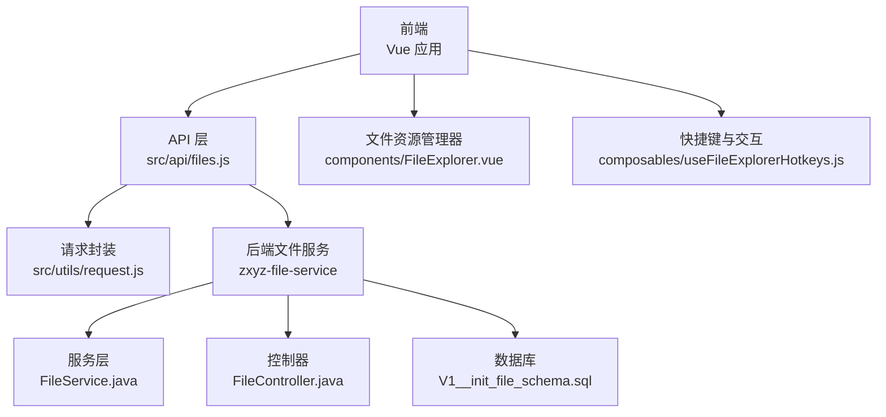
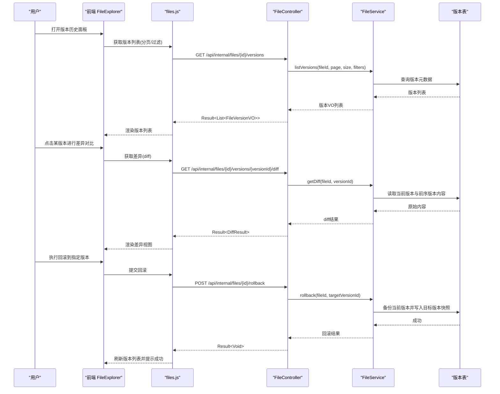
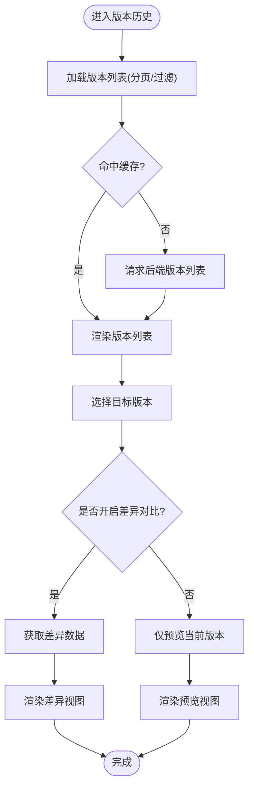
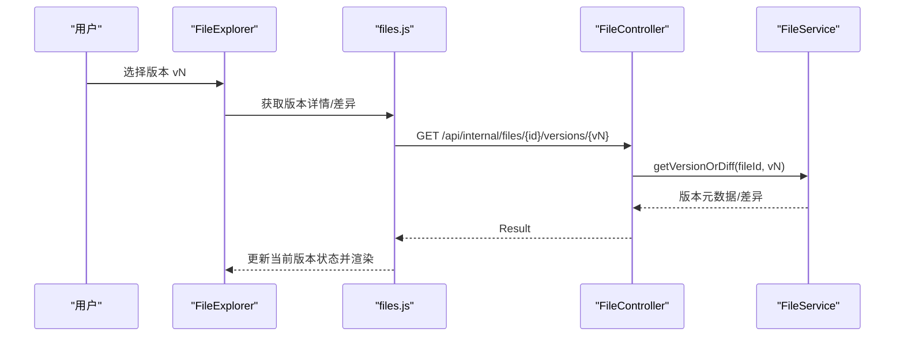
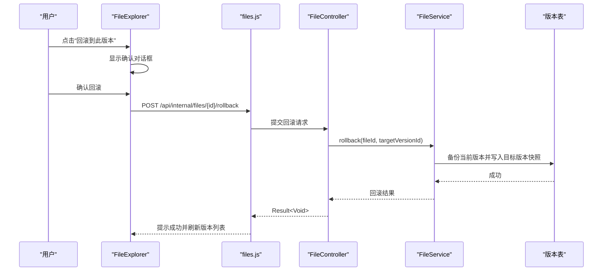
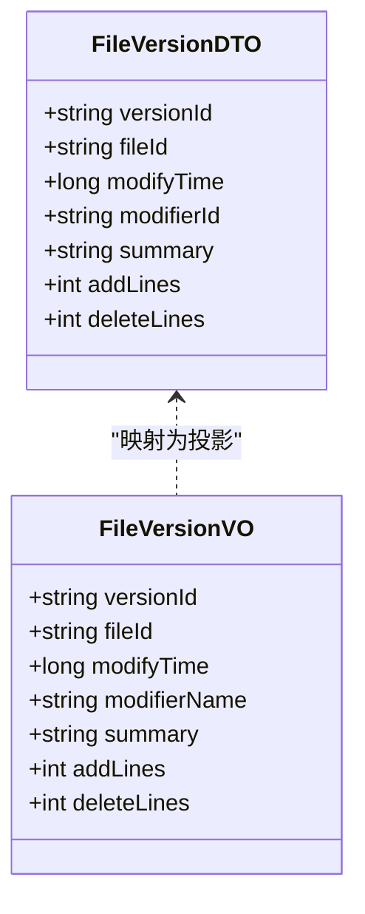
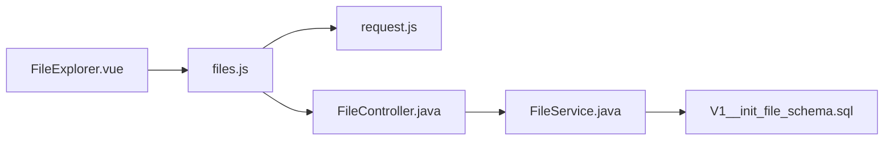

# 版本控制

<cite>
**本文引用的文件**   
- [ZXYZdatabaseFront/src/api/files.js](file://ZXYZdatabaseFront/src/api/files.js)
- [ZXYZdatabaseFront/src/components/FileExplorer.vue](file://ZXYZdatabaseFront/src/components/FileExplorer.vue)
- [ZXYZdatabaseFront/src/composables/useFileExplorerHotkeys.js](file://ZXYZdatabaseFront/src/composables/useFileExplorerHotkeys.js)
- [ZXYZdatabaseFront/src/utils/request.js](file://ZXYZdatabaseFront/src/utils/request.js)
- [ZXYZdatabaseBack/zxyz-file-service/src/main/java/uno/acloud/file/controller/FileController.java](file://ZXYZdatabaseBack/zxyz-file-service/src/main/java/uno/acloud/file/controller/FileController.java)
- [ZXYZdatabaseBack/zxyz-file-service/src/main/java/uno/acloud/file/service/FileService.java](file://ZXYZdatabaseBack/zxyz-file-service/src/main/java/uno/acloud/file/service/FileService.java)
- [ZXYZdatabaseBack/zxyz-file-service/src/main/java/uno/acloud/file/dto/FileVersionDTO.java](file://ZXYZdatabaseBack/zxyz-file-service/src/main/java/uno/acloud/file/dto/FileVersionDTO.java)
- [ZXYZdatabaseBack/zxyz-file-service/src/main/java/uno/acloud/file/vo/FileVersionVO.java](file://ZXYZdatabaseBack/zxyz-file-service/src/main/java/uno/acloud/file/vo/FileVersionVO.java)
- [ZXYZdatabaseBack/zxyz-file-service/src/main/resources/db/migration/V1__init_file_schema.sql](file://ZXYZdatabaseBack/zxyz-file-service/src/main/resources/db/migration/V1__init_file_schema.sql)
</cite>

## 目录
1. [简介](#简介)
2. [项目结构](#项目结构)
3. [核心组件](#核心组件)
4. [架构总览](#架构总览)
5. [详细组件分析](#详细组件分析)
6. [依赖分析](#依赖分析)
7. [性能考虑](#性能考虑)
8. [故障排查指南](#故障排查指南)
9. [结论](#结论)
10. [附录](#附录)

## 简介
本文件面向 ZXYZ 前端“文件版本控制”能力，聚焦版本历史查看界面与交互、版本切换机制、版本回滚流程、版本信息展示以及完整的 API 调用示例。文档同时给出性能优化策略（懒加载、缓存、增量更新），帮助开发者快速理解并正确实现版本相关功能。

## 项目结构
前端采用 Vue 3 + Composition API，状态管理使用 Pinia，API 封装在 src/api 下，业务逻辑通过 composables 组织，视图与交互集中在 components 与 views。后端为微服务架构，文件版本相关能力由 zxyz-file-service 提供，数据库迁移脚本位于 resources/db/migration。

**图表来源** 
- [ZXYZdatabaseFront/src/api/files.js](file://ZXYZdatabaseFront/src/api/files.js)
- [ZXYZdatabaseFront/src/utils/request.js](file://ZXYZdatabaseFront/src/utils/request.js)
- [ZXYZdatabaseFront/src/components/FileExplorer.vue](file://ZXYZdatabaseFront/src/components/FileExplorer.vue)
- [ZXYZdatabaseFront/src/composables/useFileExplorerHotkeys.js](file://ZXYZdatabaseFront/src/composables/useFileExplorerHotkeys.js)
- [ZXYZdatabaseBack/zxyz-file-service/src/main/java/uno/acloud/file/controller/FileController.java](file://ZXYZdatabaseBack/zxyz-file-service/src/main/java/uno/acloud/file/controller/FileController.java)
- [ZXYZdatabaseBack/zxyz-file-service/src/main/java/uno/acloud/file/service/FileService.java](file://ZXYZdatabaseBack/zxyz-file-service/src/main/java/uno/acloud/file/service/FileService.java)
- [ZXYZdatabaseBack/zxyz-file-service/src/main/resources/db/migration/V1__init_file_schema.sql](file://ZXYZdatabaseBack/zxyz-file-service/src/main/resources/db/migration/V1__init_file_schema.sql)

**章节来源**
- [ZXYZdatabaseFront/src/api/files.js](file://ZXYZdatabaseFront/src/api/files.js)
- [ZXYZdatabaseFront/src/components/FileExplorer.vue](file://ZXYZdatabaseFront/src/components/FileExplorer.vue)
- [ZXYZdatabaseFront/src/composables/useFileExplorerHotkeys.js](file://ZXYZdatabaseFront/src/composables/useFileExplorerHotkeys.js)
- [ZXYZdatabaseFront/src/utils/request.js](file://ZXYZdatabaseFront/src/utils/request.js)
- [ZXYZdatabaseBack/zxyz-file-service/src/main/java/uno/acloud/file/controller/FileController.java](file://ZXYZdatabaseBack/zxyz-file-service/src/main/java/uno/acloud/file/controller/FileController.java)
- [ZXYZdatabaseBack/zxyz-file-service/src/main/java/uno/acloud/file/service/FileService.java](file://ZXYZdatabaseBack/zxyz-file-service/src/main/java/uno/acloud/file/service/FileService.java)
- [ZXYZdatabaseBack/zxyz-file-service/src/main/resources/db/migration/V1__init_file_schema.sql](file://ZXYZdatabaseBack/zxyz-file-service/src/main/resources/db/migration/V1__init_file_schema.sql)

## 核心组件
- 前端 API 模块：统一封装版本列表、差异对比、预览、回滚等接口调用。
- 文件资源管理器：承载版本历史面板、版本选择、差异对比与预览的 UI。
- 快捷键与交互：支持键盘操作版本列表与回滚确认。
- 后端控制器与服务：暴露版本查询、差异获取、预览与回滚端点，处理权限校验与数据一致性。
- 数据模型：版本 DTO/VO 定义版本元信息与投影字段。
- 数据库迁移：版本表结构与索引设计。

**章节来源**
- [ZXYZdatabaseFront/src/api/files.js](file://ZXYZdatabaseFront/src/api/files.js)
- [ZXYZdatabaseFront/src/components/FileExplorer.vue](file://ZXYZdatabaseFront/src/components/FileExplorer.vue)
- [ZXYZdatabaseFront/src/composables/useFileExplorerHotkeys.js](file://ZXYZdatabaseFront/src/composables/useFileExplorerHotkeys.js)
- [ZXYZdatabaseBack/zxyz-file-service/src/main/java/uno/acloud/file/controller/FileController.java](file://ZXYZdatabaseBack/zxyz-file-service/src/main/java/uno/acloud/file/controller/FileController.java)
- [ZXYZdatabaseBack/zxyz-file-service/src/main/java/uno/acloud/file/service/FileService.java](file://ZXYZdatabaseBack/zxyz-file-service/src/main/java/uno/acloud/file/service/FileService.java)
- [ZXYZdatabaseBack/zxyz-file-service/src/main/java/uno/acloud/file/dto/FileVersionDTO.java](file://ZXYZdatabaseBack/zxyz-file-service/src/main/java/uno/acloud/file/dto/FileVersionDTO.java)
- [ZXYZdatabaseBack/zxyz-file-service/src/main/java/uno/acloud/file/vo/FileVersionVO.java](file://ZXYZdatabaseBack/zxyz-file-service/src/main/java/uno/acloud/file/vo/FileVersionVO.java)
- [ZXYZdatabaseBack/zxyz-file-service/src/main/resources/db/migration/V1__init_file_schema.sql](file://ZXYZdatabaseBack/zxyz-file-service/src/main/resources/db/migration/V1__init_file_schema.sql)

## 架构总览
版本控制的前后端交互遵循“窄端点 + 投影模式”，前端按需拉取版本元数据与差异片段，避免一次性传输大对象；后端以控制器接收请求，服务层执行业务逻辑，持久化层访问版本表。鉴权通过网关 SaToken 过滤器拦截内部端点，确保仅内网可访问。

**图表来源** 
- [ZXYZdatabaseFront/src/components/FileExplorer.vue](file://ZXYZdatabaseFront/src/components/FileExplorer.vue)
- [ZXYZdatabaseFront/src/api/files.js](file://ZXYZdatabaseFront/src/api/files.js)
- [ZXYZdatabaseBack/zxyz-file-service/src/main/java/uno/acloud/file/controller/FileController.java](file://ZXYZdatabaseBack/zxyz-file-service/src/main/java/uno/acloud/file/controller/FileController.java)
- [ZXYZdatabaseBack/zxyz-file-service/src/main/java/uno/acloud/file/service/FileService.java](file://ZXYZdatabaseBack/zxyz-file-service/src/main/java/uno/acloud/file/service/FileService.java)
- [ZXYZdatabaseBack/zxyz-file-service/src/main/resources/db/migration/V1__init_file_schema.sql](file://ZXYZdatabaseBack/zxyz-file-service/src/main/resources/db/migration/V1__init_file_schema.sql)

## 详细组件分析

### 版本历史查看界面
- 版本列表展示：支持分页、按时间排序、按修改人筛选；命中缓存时优先返回本地缓存。
- 差异对比：选择两个版本后计算差异，支持行级高亮与侧边对照。
- 预览功能：对文本类文件直接渲染预览，二进制文件提供下载入口。

**图表来源** 
- [ZXYZdatabaseFront/src/components/FileExplorer.vue](file://ZXYZdatabaseFront/src/components/FileExplorer.vue)
- [ZXYZdatabaseFront/src/api/files.js](file://ZXYZdatabaseFront/src/api/files.js)

**章节来源**
- [ZXYZdatabaseFront/src/components/FileExplorer.vue](file://ZXYZdatabaseFront/src/components/FileExplorer.vue)
- [ZXYZdatabaseFront/src/api/files.js](file://ZXYZdatabaseFront/src/api/files.js)

### 版本切换机制
- 版本选择：用户在列表中点击或键盘导航选中目标版本。
- 数据加载：根据选中的版本 ID 触发差异或预览请求，必要时并行拉取元数据。
- 状态同步：切换后更新当前版本状态，保持列表滚动位置与筛选条件一致。

**图表来源** 
- [ZXYZdatabaseFront/src/components/FileExplorer.vue](file://ZXYZdatabaseFront/src/components/FileExplorer.vue)
- [ZXYZdatabaseFront/src/api/files.js](file://ZXYZdatabaseFront/src/api/files.js)
- [ZXYZdatabaseBack/zxyz-file-service/src/main/java/uno/acloud/file/controller/FileController.java](file://ZXYZdatabaseBack/zxyz-file-service/src/main/java/uno/acloud/file/controller/FileController.java)
- [ZXYZdatabaseBack/zxyz-file-service/src/main/java/uno/acloud/file/service/FileService.java](file://ZXYZdatabaseBack/zxyz-file-service/src/main/java/uno/acloud/file/service/FileService.java)

**章节来源**
- [ZXYZdatabaseFront/src/components/FileExplorer.vue](file://ZXYZdatabaseFront/src/components/FileExplorer.vue)
- [ZXYZdatabaseFront/src/api/files.js](file://ZXYZdatabaseFront/src/api/files.js)
- [ZXYZdatabaseBack/zxyz-file-service/src/main/java/uno/acloud/file/controller/FileController.java](file://ZXYZdatabaseBack/zxyz-file-service/src/main/java/uno/acloud/file/controller/FileController.java)
- [ZXYZdatabaseBack/zxyz-file-service/src/main/java/uno/acloud/file/service/FileService.java](file://ZXYZdatabaseBack/zxyz-file-service/src/main/java/uno/acloud/file/service/FileService.java)

### 版本回滚操作
- 回滚确认：弹出二次确认对话框，显示目标版本信息与影响范围。
- 数据备份：回滚前自动创建当前版本的备份快照。
- 恢复流程：将目标版本内容写回当前文件，生成新的版本记录，并刷新列表。

**图表来源** 
- [ZXYZdatabaseFront/src/components/FileExplorer.vue](file://ZXYZdatabaseFront/src/components/FileExplorer.vue)
- [ZXYZdatabaseFront/src/api/files.js](file://ZXYZdatabaseFront/src/api/files.js)
- [ZXYZdatabaseBack/zxyz-file-service/src/main/java/uno/acloud/file/controller/FileController.java](file://ZXYZdatabaseBack/zxyz-file-service/src/main/java/uno/acloud/file/controller/FileController.java)
- [ZXYZdatabaseBack/zxyz-file-service/src/main/java/uno/acloud/file/service/FileService.java](file://ZXYZdatabaseBack/zxyz-file-service/src/main/java/uno/acloud/file/service/FileService.java)
- [ZXYZdatabaseBack/zxyz-file-service/src/main/resources/db/migration/V1__init_file_schema.sql](file://ZXYZdatabaseBack/zxyz-file-service/src/main/resources/db/migration/V1__init_file_schema.sql)

**章节来源**
- [ZXYZdatabaseFront/src/components/FileExplorer.vue](file://ZXYZdatabaseFront/src/components/FileExplorer.vue)
- [ZXYZdatabaseFront/src/api/files.js](file://ZXYZdatabaseFront/src/api/files.js)
- [ZXYZdatabaseBack/zxyz-file-service/src/main/java/uno/acloud/file/controller/FileController.java](file://ZXYZdatabaseBack/zxyz-file-service/src/main/java/uno/acloud/file/controller/FileController.java)
- [ZXYZdatabaseBack/zxyz-file-service/src/main/java/uno/acloud/file/service/FileService.java](file://ZXYZdatabaseBack/zxyz-file-service/src/main/java/uno/acloud/file/service/FileService.java)
- [ZXYZdatabaseBack/zxyz-file-service/src/main/resources/db/migration/V1__init_file_schema.sql](file://ZXYZdatabaseBack/zxyz-file-service/src/main/resources/db/migration/V1__init_file_schema.sql)

### 版本信息展示
- 修改时间：精确到秒的时间戳，支持本地时区格式化。
- 修改人：用户名与头像，来自用户服务投影 VO。
- 变更摘要：基于差异统计生成的简短描述（如新增行数、删除行数）。

**图表来源** 
- [ZXYZdatabaseBack/zxyz-file-service/src/main/java/uno/acloud/file/dto/FileVersionDTO.java](file://ZXYZdatabaseBack/zxyz-file-service/src/main/java/uno/acloud/file/dto/FileVersionDTO.java)
- [ZXYZdatabaseBack/zxyz-file-service/src/main/java/uno/acloud/file/vo/FileVersionVO.java](file://ZXYZdatabaseBack/zxyz-file-service/src/main/java/uno/acloud/file/vo/FileVersionVO.java)

**章节来源**
- [ZXYZdatabaseBack/zxyz-file-service/src/main/java/uno/acloud/file/dto/FileVersionDTO.java](file://ZXYZdatabaseBack/zxyz-file-service/src/main/java/uno/acloud/file/dto/FileVersionDTO.java)
- [ZXYZdatabaseBack/zxyz-file-service/src/main/java/uno/acloud/file/vo/FileVersionVO.java](file://ZXYZdatabaseBack/zxyz-file-service/src/main/java/uno/acloud/file/vo/FileVersionVO.java)

### API 调用示例
以下为常见版本操作的请求路径与参数说明（实际字段以接口契约为准）：
- 获取版本列表
  - 方法：GET
  - 路径：/api/internal/files/{fileId}/versions
  - 查询参数：page、size、sort=modify_time、order=desc、modifierId（可选）
  - 响应：Result<List<FileVersionVO>>
- 获取版本详情或差异
  - 方法：GET
  - 路径：/api/internal/files/{fileId}/versions/{versionId}
  - 查询参数：type=detail|diff（默认 detail）、baseVersionId（当 type=diff 时必填）
  - 响应：Result<FileVersionVO | DiffResult>
- 预览版本内容
  - 方法：GET
  - 路径：/api/internal/files/{fileId}/versions/{versionId}/preview
  - 响应：Result<PreviewContent>（文本预览或下载链接）
- 执行回滚
  - 方法：POST
  - 路径：/api/internal/files/{fileId}/rollback
  - 请求体：{ "targetVersionId": "..." }
  - 响应：Result<Void>

注意：所有内部端点均受网关 SaToken 过滤器保护，需携带有效会话令牌。

**章节来源**
- [ZXYZdatabaseFront/src/api/files.js](file://ZXYZdatabaseFront/src/api/files.js)
- [ZXYZdatabaseBack/zxyz-file-service/src/main/java/uno/acloud/file/controller/FileController.java](file://ZXYZdatabaseBack/zxyz-file-service/src/main/java/uno/acloud/file/controller/FileController.java)

## 依赖分析
- 前端依赖：
  - files.js 负责版本相关 API 调用，被 FileExplorer 与快捷键钩子使用。
  - request.js 统一处理请求头、错误码与重试策略。
- 后端依赖：
  - FileController 暴露版本查询、差异与回滚端点。
  - FileService 编排版本元数据、差异计算与回滚事务。
  - 数据库迁移脚本定义版本表结构与索引。

**图表来源** 
- [ZXYZdatabaseFront/src/components/FileExplorer.vue](file://ZXYZdatabaseFront/src/components/FileExplorer.vue)
- [ZXYZdatabaseFront/src/api/files.js](file://ZXYZdatabaseFront/src/api/files.js)
- [ZXYZdatabaseFront/src/utils/request.js](file://ZXYZdatabaseFront/src/utils/request.js)
- [ZXYZdatabaseBack/zxyz-file-service/src/main/java/uno/acloud/file/controller/FileController.java](file://ZXYZdatabaseBack/zxyz-file-service/src/main/java/uno/acloud/file/controller/FileController.java)
- [ZXYZdatabaseBack/zxyz-file-service/src/main/java/uno/acloud/file/service/FileService.java](file://ZXYZdatabaseBack/zxyz-file-service/src/main/java/uno/acloud/file/service/FileService.java)
- [ZXYZdatabaseBack/zxyz-file-service/src/main/resources/db/migration/V1__init_file_schema.sql](file://ZXYZdatabaseBack/zxyz-file-service/src/main/resources/db/migration/V1__init_file_schema.sql)

**章节来源**
- [ZXYZdatabaseFront/src/components/FileExplorer.vue](file://ZXYZdatabaseFront/src/components/FileExplorer.vue)
- [ZXYZdatabaseFront/src/api/files.js](file://ZXYZdatabaseFront/src/api/files.js)
- [ZXYZdatabaseFront/src/utils/request.js](file://ZXYZdatabaseFront/src/utils/request.js)
- [ZXYZdatabaseBack/zxyz-file-service/src/main/java/uno/acloud/file/controller/FileController.java](file://ZXYZdatabaseBack/zxyz-file-service/src/main/java/uno/acloud/file/controller/FileController.java)
- [ZXYZdatabaseBack/zxyz-file-service/src/main/java/uno/acloud/file/service/FileService.java](file://ZXYZdatabaseBack/zxyz-file-service/src/main/java/uno/acloud/file/service/FileService.java)
- [ZXYZdatabaseBack/zxyz-file-service/src/main/resources/db/migration/V1__init_file_schema.sql](file://ZXYZdatabaseBack/zxyz-file-service/src/main/resources/db/migration/V1__init_file_schema.sql)

## 性能考虑
- 懒加载：版本列表采用分页与虚拟滚动，仅在可视区域渲染条目；差异内容按需拉取。
- 缓存机制：对版本元数据与常用差异结果做短期缓存（内存 + 可选 localStorage），减少重复请求。
- 增量更新：监听版本变更事件，仅推送新增版本元数据，避免全量刷新。
- 并发控制：差异与预览请求去重与取消，避免竞态导致的状态不一致。
- 服务端优化：差异计算采用流式比对与分块返回，限制单次返回大小；预览内容压缩传输。

[本节为通用指导，不直接分析具体文件]

## 故障排查指南
- 常见问题
  - 版本列表为空：检查 file_id 是否正确、权限是否足够、分页参数是否合理。
  - 差异对比失败：确认 baseVersionId 存在且与目标版本相邻；检查网络与网关鉴权。
  - 回滚失败：确认目标版本可回滚（未被覆盖）、事务未冲突；查看后端日志定位异常。
- 调试建议
  - 前端：打开浏览器开发者工具，查看 Network 面板的请求与响应；检查 request.js 的错误处理分支。
  - 后端：查看 FileController 与 FileService 的日志输出，定位异常堆栈与数据库锁等待。
- 恢复步骤
  - 若回滚部分失败，使用备份快照恢复；重新执行回滚并监控事务状态。

**章节来源**
- [ZXYZdatabaseFront/src/utils/request.js](file://ZXYZdatabaseFront/src/utils/request.js)
- [ZXYZdatabaseBack/zxyz-file-service/src/main/java/uno/acloud/file/controller/FileController.java](file://ZXYZdatabaseBack/zxyz-file-service/src/main/java/uno/acloud/file/controller/FileController.java)
- [ZXYZdatabaseBack/zxyz-file-service/src/main/java/uno/acloud/file/service/FileService.java](file://ZXYZdatabaseBack/zxyz-file-service/src/main/java/uno/acloud/file/service/FileService.java)

## 结论
ZXYZ 前端版本控制功能围绕“版本历史查看、差异对比、预览与回滚”构建，前后端协作清晰、职责分明。通过懒加载、缓存与增量更新等策略，保障在大文件与高频操作场景下的用户体验。建议持续完善错误提示与回滚幂等性，提升系统健壮性与可维护性。

[本节为总结性内容，不直接分析具体文件]

## 附录
- 快捷键支持：使用 useFileExplorerHotkeys.js 绑定上下键移动、回车选择、Esc 关闭确认框等操作，提升效率。
- 数据模型演进：版本 VO/DTO 独立演进，避免耦合；投影字段按需扩展，保持接口稳定。

**章节来源**
- [ZXYZdatabaseFront/src/composables/useFileExplorerHotkeys.js](file://ZXYZdatabaseFront/src/composables/useFileExplorerHotkeys.js)
- [ZXYZdatabaseBack/zxyz-file-service/src/main/java/uno/acloud/file/dto/FileVersionDTO.java](file://ZXYZdatabaseBack/zxyz-file-service/src/main/java/uno/acloud/file/dto/FileVersionDTO.java)
- [ZXYZdatabaseBack/zxyz-file-service/src/main/java/uno/acloud/file/vo/FileVersionVO.java](file://ZXYZdatabaseBack/zxyz-file-service/src/main/java/uno/acloud/file/vo/FileVersionVO.java)