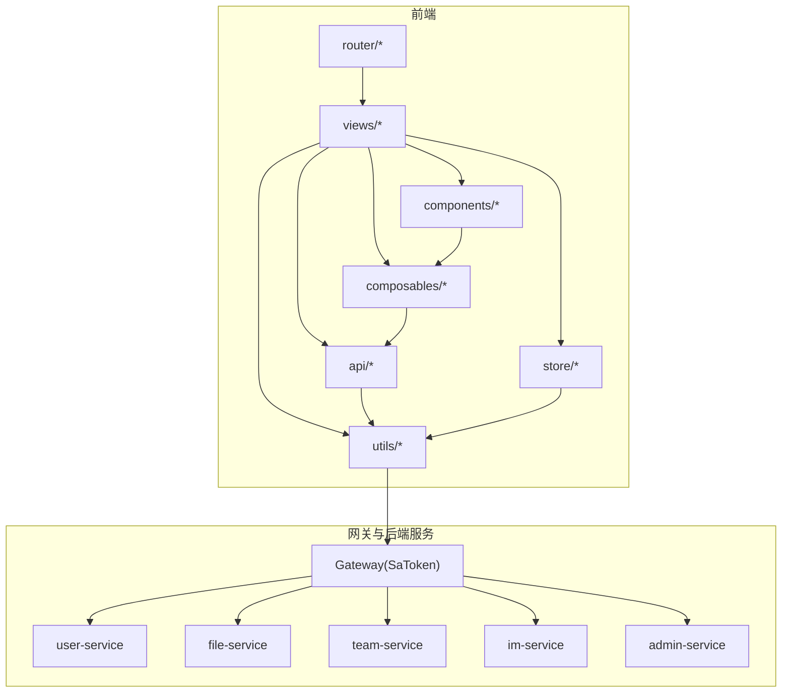
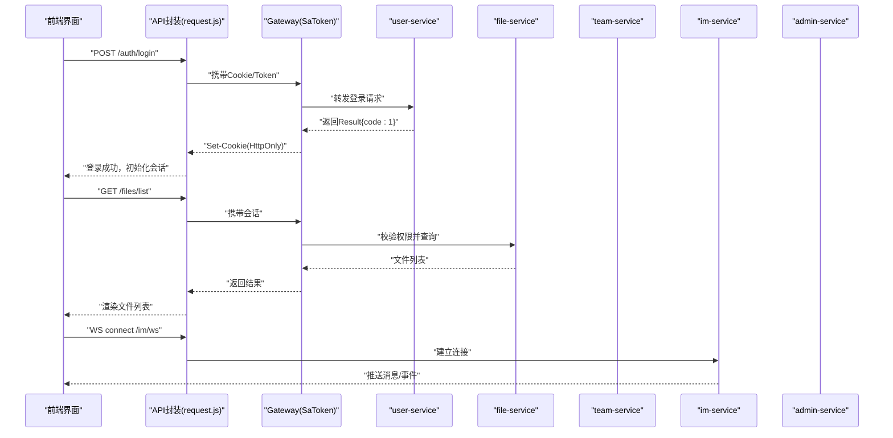
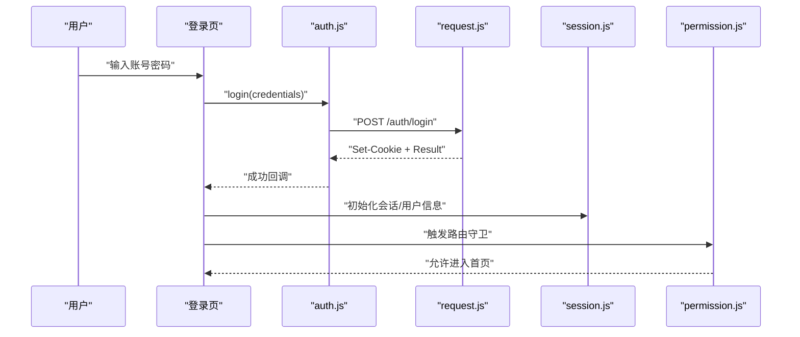
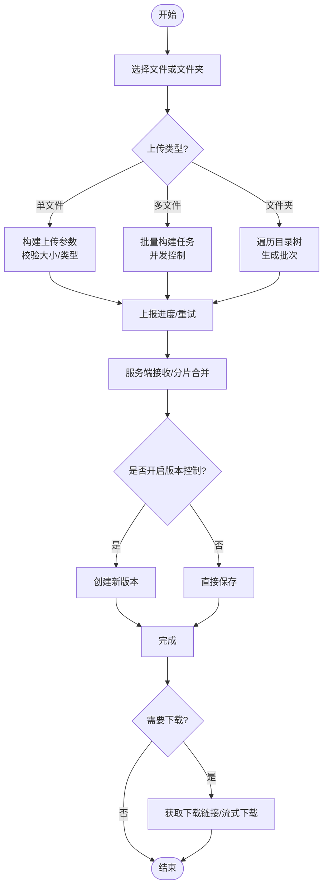
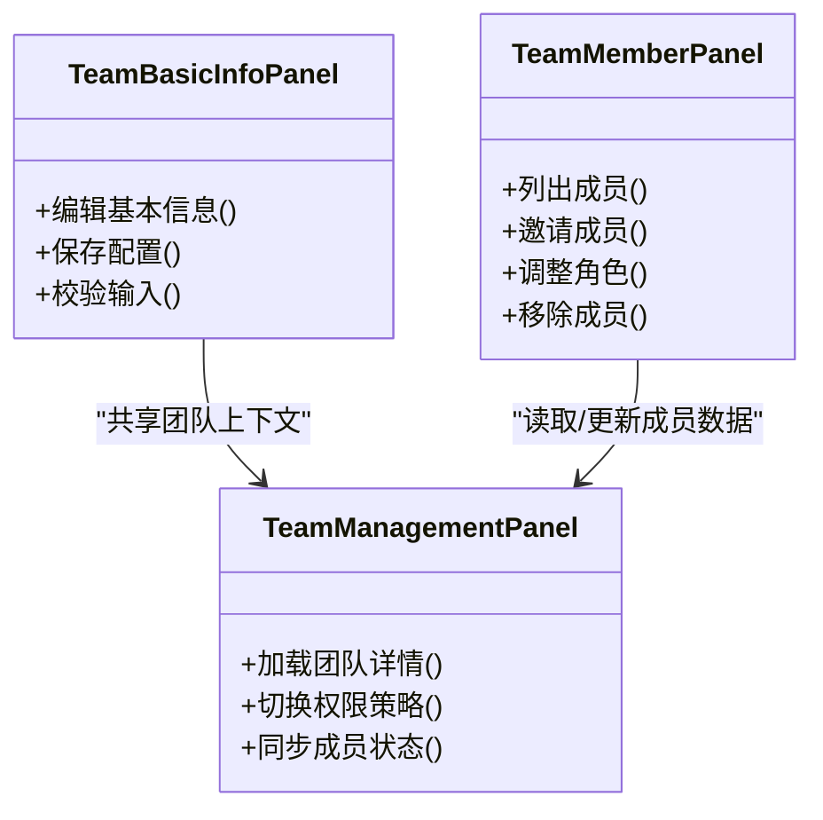
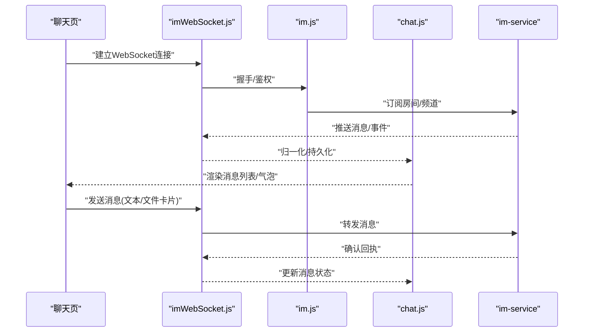
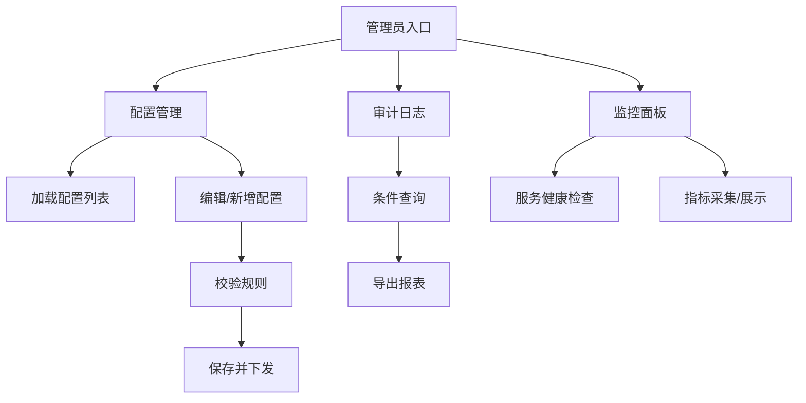
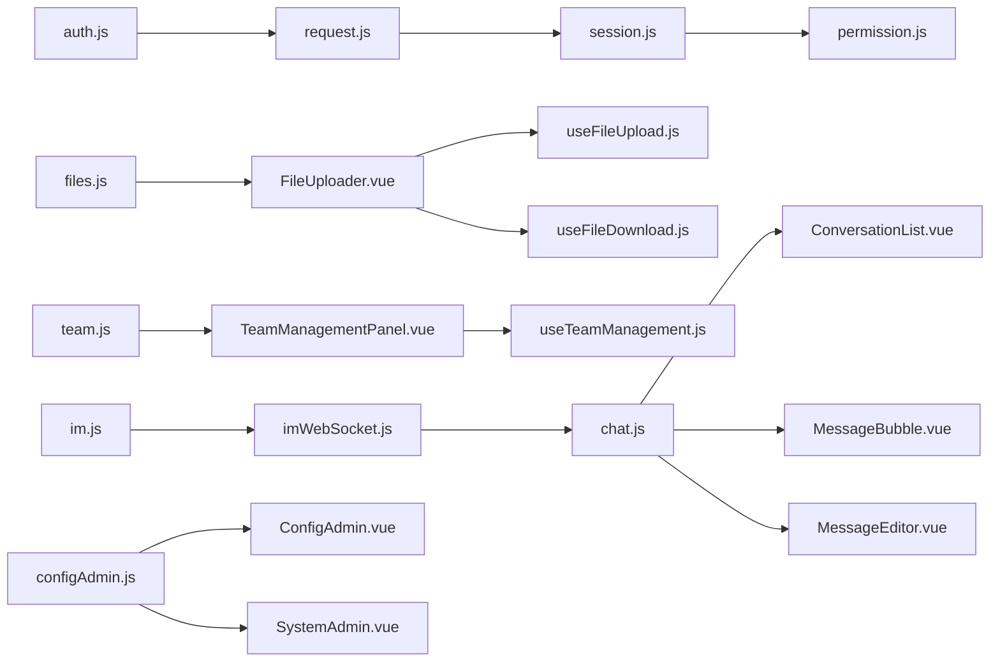

# 核心功能模块

<cite>
**本文引用的文件**   
- [ZXYZdatabaseFront/src/api/auth.js](file://ZXYZdatabaseFront/src/api/auth.js)
- [ZXYZdatabaseFront/src/api/files.js](file://ZXYZdatabaseFront/src/api/files.js)
- [ZXYZdatabaseFront/src/api/team.js](file://ZXYZdatabaseFront/src/api/team.js)
- [ZXYZdatabaseFront/src/api/im.js](file://ZXYZdatabaseFront/src/api/im.js)
- [ZXYZdatabaseFront/src/views/login/index.vue](file://ZXYZdatabaseFront/src/views/login/index.vue)
- [ZXYZdatabaseFront/src/views/register/index.vue](file://ZXYZdatabaseFront/src/views/register/index.vue)
- [ZXYZdatabaseFront/src/composables/useLoginForm.js](file://ZXYZdatabaseFront/src/composables/useLoginForm.js)
- [ZXYZdatabaseFront/src/store/session.js](file://ZXYZdatabaseFront/src/store/session.js)
- [ZXYZdatabaseFront/src/utils/request.js](file://ZXYZdatabaseFront/src/utils/request.js)
- [ZXYZdatabaseFront/src/components/FileExplorer.vue](file://ZXYZdatabaseFront/src/components/FileExplorer.vue)
- [ZXYZdatabaseFront/src/components/FileUploader.vue](file://ZXYZdatabaseFront/src/components/FileUploader.vue)
- [ZXYZdatabaseFront/src/components/RecycleBinExplorer.vue](file://ZXYZdatabaseFront/src/components/RecycleBinExplorer.vue)
- [ZXYZdatabaseFront/src/composables/useFileUpload.js](file://ZXYZdatabaseFront/src/composables/useFileUpload.js)
- [ZXYZdatabaseFront/src/composables/useFileDownload.js](file://ZXYZdatabaseFront/src/composables/useFileDownload.js)
- [ZXYZdatabaseFront/src/composables/useRecycleBinList.js](file://ZXYZdatabaseFront/src/composables/useRecycleBinList.js)
- [ZXYZdatabaseFront/src/composables/useRecycleBinActions.js](file://ZXYZdatabaseFront/src/composables/useRecycleBinActions.js)
- [ZXYZdatabaseFront/src/components/team-settings/TeamBasicInfoPanel.vue](file://ZXYZdatabaseFront/src/components/team-settings/TeamBasicInfoPanel.vue)
- [ZXYZdatabaseFront/src/components/team-settings/TeamMemberPanel.vue](file://ZXYZdatabaseFront/src/components/team-settings/TeamMemberPanel.vue)
- [ZXYZdatabaseFront/src/components/team-settings/TeamManagementPanel.vue](file://ZXYZdatabaseFront/src/components/team-settings/TeamManagementPanel.vue)
- [ZXYZdatabaseFront/src/composables/team/useTeamManagement.js](file://ZXYZdatabaseFront/src/composables/team/useTeamManagement.js)
- [ZXYZdatabaseFront/src/views/chat/index.vue](file://ZXYZdatabaseFront/src/views/chat/index.vue)
- [ZXYZdatabaseFront/src/views/chat/components/ConversationList.vue](file://ZXYZdatabaseFront/src/views/chat/components/ConversationList.vue)
- [ZXYZdatabaseFront/src/views/chat/components/MessageBubble.vue](file://ZXYZdatabaseFront/src/views/chat/components/MessageBubble.vue)
- [ZXYZdatabaseFront/src/views/chat/components/MessageEditor.vue](file://ZXYZdatabaseFront/src/views/chat/components/MessageEditor.vue)
- [ZXYZdatabaseFront/src/composables/useImWorkspace.js](file://ZXYZdatabaseFront/src/composables/useImWorkspace.js)
- [ZXYZdatabaseFront/src/store/chat.js](file://ZXYZdatabaseFront/src/store/chat.js)
- [ZXYZdatabaseFront/src/utils/imWebSocket.js](file://ZXYZdatabaseFront/src/utils/imWebSocket.js)
- [ZXYZdatabaseFront/src/utils/imRequest.js](file://ZXYZdatabaseFront/src/utils/imRequest.js)
- [ZXYZdatabaseFront/src/views/setting/index.vue](file://ZXYZdatabaseFront/src/views/setting/index.vue)
- [ZXYZdatabaseFront/src/views/setting/ConfigAdmin.vue](file://ZXYZdatabaseFront/src/views/setting/ConfigAdmin.vue)
- [ZXYZdatabaseFront/src/views/setting/SystemAdmin.vue](file://ZXYZdatabaseFront/src/views/setting/SystemAdmin.vue)
- [ZXYZdatabaseFront/src/api/configAdmin.js](file://ZXYZdatabaseFront/src/api/configAdmin.js)
- [ZXYZdatabaseFront/src/router/guards/permission.js](file://ZXYZdatabaseFront/src/router/guards/permission.js)
</cite>

## 目录
1. [简介](#简介)
2. [项目结构](#项目结构)
3. [核心组件](#核心组件)
4. [架构总览](#架构总览)
5. [详细组件分析](#详细组件分析)
6. [依赖关系分析](#依赖关系分析)
7. [性能考虑](#性能考虑)
8. [故障排查指南](#故障排查指南)
9. [结论](#结论)
10. [附录](#附录)

## 简介
本文件面向 ZXYZ 前端核心功能模块的开发与维护，覆盖用户认证、文件管理、团队协作界面、即时通讯聊天以及系统设置面板五大模块。文档从系统架构、数据流、处理逻辑与集成点出发，提供 API 调用示例、错误处理策略与用户交互流程说明，帮助开发者快速理解并高效扩展各模块能力。

## 项目结构
前端采用 Vue 3 Composition API + <script setup>，状态管理使用 Pinia，API 封装在 src/api，业务逻辑下沉到 composables，视图集中在 views，通用组件位于 components，工具函数与网络层在 utils。认证通过 HttpOnly Cookie（Sa-Token UUID token + Redis session）完成，API 响应统一 Result<T> 结构（code:1 表示成功）。

图表来源
- [ZXYZdatabaseFront/src/router/guards/permission.js](file://ZXYZdatabaseFront/src/router/guards/permission.js)
- [ZXYZdatabaseFront/src/utils/request.js](file://ZXYZdatabaseFront/src/utils/request.js)

章节来源
- [ZXYZdatabaseFront/src/router/guards/permission.js](file://ZXYZdatabaseFront/src/router/guards/permission.js)
- [ZXYZdatabaseFront/src/utils/request.js](file://ZXYZdatabaseFront/src/utils/request.js)

## 核心组件
- 用户认证：登录/注册表单、会话初始化、权限守卫、路由跳转引导
- 文件管理：文件上传下载、文件夹操作、版本控制、回收站管理
- 团队协作：团队设置、成员管理、权限分配
- 即时通讯：实时通信、消息处理、房间管理
- 系统设置：配置管理、审计日志查看、监控功能

章节来源
- [ZXYZdatabaseFront/src/api/auth.js](file://ZXYZdatabaseFront/src/api/auth.js)
- [ZXYZdatabaseFront/src/api/files.js](file://ZXYZdatabaseFront/src/api/files.js)
- [ZXYZdatabaseFront/src/api/team.js](file://ZXYZdatabaseFront/src/api/team.js)
- [ZXYZdatabaseFront/src/api/im.js](file://ZXYZdatabaseFront/src/api/im.js)
- [ZXYZdatabaseFront/src/api/configAdmin.js](file://ZXYZdatabaseFront/src/api/configAdmin.js)

## 架构总览
前端通过统一的请求封装发起 HTTP/WebSocket 请求，经 Gateway 鉴权后路由至对应微服务。认证与会话由 Sa-Token + Redis 维护；IM 使用 WebSocket 实现实时通信；文件上传走分片直传或服务端中转；回收站与版本控制由 file-service 提供；团队与权限由 team-service 提供；系统设置由 admin-service 提供。

图表来源
- [ZXYZdatabaseFront/src/utils/request.js](file://ZXYZdatabaseFront/src/utils/request.js)
- [ZXYZdatabaseFront/src/utils/imWebSocket.js](file://ZXYZdatabaseFront/src/utils/imWebSocket.js)
- [ZXYZdatabaseFront/src/api/auth.js](file://ZXYZdatabaseFront/src/api/auth.js)
- [ZXYZdatabaseFront/src/api/files.js](file://ZXYZdatabaseFront/src/api/files.js)
- [ZXYZdatabaseFront/src/api/im.js](file://ZXYZdatabaseFront/src/api/im.js)

## 详细组件分析

### 用户认证模块
- 登录/注册流程：表单校验 → 提交到 auth 接口 → 后端签发 Sa-Token 并 Set-Cookie → 前端初始化会话与用户信息 → 路由守卫放行
- 权限验证：基于 Sa-Token 的会话校验，结合路由守卫进行页面级权限控制
- 会话管理：HttpOnly Cookie 存储 Token，Pinia store 维护当前用户与团队上下文

图表来源
- [ZXYZdatabaseFront/src/views/login/index.vue](file://ZXYZdatabaseFront/src/views/login/index.vue)
- [ZXYZdatabaseFront/src/composables/useLoginForm.js](file://ZXYZdatabaseFront/src/composables/useLoginForm.js)
- [ZXYZdatabaseFront/src/api/auth.js](file://ZXYZdatabaseFront/src/api/auth.js)
- [ZXYZdatabaseFront/src/store/session.js](file://ZXYZdatabaseFront/src/store/session.js)
- [ZXYZdatabaseFront/src/utils/request.js](file://ZXYZdatabaseFront/src/utils/request.js)
- [ZXYZdatabaseFront/src/router/guards/permission.js](file://ZXYZdatabaseFront/src/router/guards/permission.js)

章节来源
- [ZXYZdatabaseFront/src/views/login/index.vue](file://ZXYZdatabaseFront/src/views/login/index.vue)
- [ZXYZdatabaseFront/src/views/register/index.vue](file://ZXYZdatabaseFront/src/views/register/index.vue)
- [ZXYZdatabaseFront/src/composables/useLoginForm.js](file://ZXYZdatabaseFront/src/composables/useLoginForm.js)
- [ZXYZdatabaseFront/src/store/session.js](file://ZXYZdatabaseFront/src/store/session.js)
- [ZXYZdatabaseFront/src/utils/request.js](file://ZXYZdatabaseFront/src/utils/request.js)
- [ZXYZdatabaseFront/src/router/guards/permission.js](file://ZXYZdatabaseFront/src/router/guards/permission.js)

### 文件管理器模块
- 文件上传下载：支持单文件/多文件/文件夹上传，进度跟踪，断点续传（可选），下载直链或流式下载
- 文件夹操作：创建、重命名、移动、复制、删除
- 版本控制：文件更新生成新版本，支持历史版本回滚
- 回收站管理：软删除、恢复、彻底删除、清空回收站

图表来源
- [ZXYZdatabaseFront/src/components/FileUploader.vue](file://ZXYZdatabaseFront/src/components/FileUploader.vue)
- [ZXYZdatabaseFront/src/composables/useFileUpload.js](file://ZXYZdatabaseFront/src/composables/useFileUpload.js)
- [ZXYZdatabaseFront/src/api/files.js](file://ZXYZdatabaseFront/src/api/files.js)
- [ZXYZdatabaseFront/src/composables/useFileDownload.js](file://ZXYZdatabaseFront/src/composables/useFileDownload.js)

章节来源
- [ZXYZdatabaseFront/src/components/FileExplorer.vue](file://ZXYZdatabaseFront/src/components/FileExplorer.vue)
- [ZXYZdatabaseFront/src/components/FileUploader.vue](file://ZXYZdatabaseFront/src/components/FileUploader.vue)
- [ZXYZdatabaseFront/src/composables/useFileUpload.js](file://ZXYZdatabaseFront/src/composables/useFileUpload.js)
- [ZXYZdatabaseFront/src/composables/useFileDownload.js](file://ZXYZdatabaseFront/src/composables/useFileDownload.js)
- [ZXYZdatabaseFront/src/api/files.js](file://ZXYZdatabaseFront/src/api/files.js)

### 团队协作界面模块
- 团队设置：基本信息编辑、存储空间配额、域名/白名单等
- 成员管理：邀请加入、角色变更、移除成员、申请审批
- 权限分配：按资源维度（文件/项目/空间）授予读/写/管理等权限

图表来源
- [ZXYZdatabaseFront/src/components/team-settings/TeamBasicInfoPanel.vue](file://ZXYZdatabaseFront/src/components/team-settings/TeamBasicInfoPanel.vue)
- [ZXYZdatabaseFront/src/components/team-settings/TeamMemberPanel.vue](file://ZXYZdatabaseFront/src/components/team-settings/TeamMemberPanel.vue)
- [ZXYZdatabaseFront/src/components/team-settings/TeamManagementPanel.vue](file://ZXYZdatabaseFront/src/components/team-settings/TeamManagementPanel.vue)
- [ZXYZdatabaseFront/src/composables/team/useTeamManagement.js](file://ZXYZdatabaseFront/src/composables/team/useTeamManagement.js)
- [ZXYZdatabaseFront/src/api/team.js](file://ZXYZdatabaseFront/src/api/team.js)

章节来源
- [ZXYZdatabaseFront/src/components/team-settings/TeamBasicInfoPanel.vue](file://ZXYZdatabaseFront/src/components/team-settings/TeamBasicInfoPanel.vue)
- [ZXYZdatabaseFront/src/components/team-settings/TeamMemberPanel.vue](file://ZXYZdatabaseFront/src/components/team-settings/TeamMemberPanel.vue)
- [ZXYZdatabaseFront/src/components/team-settings/TeamManagementPanel.vue](file://ZXYZdatabaseFront/src/components/team-settings/TeamManagementPanel.vue)
- [ZXYZdatabaseFront/src/composables/team/useTeamManagement.js](file://ZXYZdatabaseFront/src/composables/team/useTeamManagement.js)
- [ZXYZdatabaseFront/src/api/team.js](file://ZXYZdatabaseFront/src/api/team.js)

### 即时通讯聊天模块
- 实时通信机制：WebSocket 长连接，心跳保活，断线重连，消息去重
- 消息处理：本地缓存、虚拟滚动、已读回执、消息状态同步
- 房间管理：创建/加入/退出房间，成员列表、权限控制、置顶会话

图表来源
- [ZXYZdatabaseFront/src/views/chat/index.vue](file://ZXYZdatabaseFront/src/views/chat/index.vue)
- [ZXYZdatabaseFront/src/views/chat/components/ConversationList.vue](file://ZXYZdatabaseFront/src/views/chat/components/ConversationList.vue)
- [ZXYZdatabaseFront/src/views/chat/components/MessageBubble.vue](file://ZXYZdatabaseFront/src/views/chat/components/MessageBubble.vue)
- [ZXYZdatabaseFront/src/views/chat/components/MessageEditor.vue](file://ZXYZdatabaseFront/src/views/chat/components/MessageEditor.vue)
- [ZXYZdatabaseFront/src/composables/useImWorkspace.js](file://ZXYZdatabaseFront/src/composables/useImWorkspace.js)
- [ZXYZdatabaseFront/src/store/chat.js](file://ZXYZdatabaseFront/src/store/chat.js)
- [ZXYZdatabaseFront/src/utils/imWebSocket.js](file://ZXYZdatabaseFront/src/utils/imWebSocket.js)
- [ZXYZdatabaseFront/src/utils/imRequest.js](file://ZXYZdatabaseFront/src/utils/imRequest.js)
- [ZXYZdatabaseFront/src/api/im.js](file://ZXYZdatabaseFront/src/api/im.js)

章节来源
- [ZXYZdatabaseFront/src/views/chat/index.vue](file://ZXYZdatabaseFront/src/views/chat/index.vue)
- [ZXYZdatabaseFront/src/views/chat/components/ConversationList.vue](file://ZXYZdatabaseFront/src/views/chat/components/ConversationList.vue)
- [ZXYZdatabaseFront/src/views/chat/components/MessageBubble.vue](file://ZXYZdatabaseFront/src/views/chat/components/MessageBubble.vue)
- [ZXYZdatabaseFront/src/views/chat/components/MessageEditor.vue](file://ZXYZdatabaseFront/src/views/chat/components/MessageEditor.vue)
- [ZXYZdatabaseFront/src/composables/useImWorkspace.js](file://ZXYZdatabaseFront/src/composables/useImWorkspace.js)
- [ZXYZdatabaseFront/src/store/chat.js](file://ZXYZdatabaseFront/src/store/chat.js)
- [ZXYZdatabaseFront/src/utils/imWebSocket.js](file://ZXYZdatabaseFront/src/utils/imWebSocket.js)
- [ZXYZdatabaseFront/src/utils/imRequest.js](file://ZXYZdatabaseFront/src/utils/imRequest.js)
- [ZXYZdatabaseFront/src/api/im.js](file://ZXYZdatabaseFront/src/api/im.js)

### 系统设置面板
- 配置管理：动态配置项增删改查、热更新、灰度发布
- 审计日志查看：操作记录检索、导出、告警联动
- 监控功能：服务健康检查、资源使用概览、关键指标展示

图表来源
- [ZXYZdatabaseFront/src/views/setting/index.vue](file://ZXYZdatabaseFront/src/views/setting/index.vue)
- [ZXYZdatabaseFront/src/views/setting/ConfigAdmin.vue](file://ZXYZdatabaseFront/src/views/setting/ConfigAdmin.vue)
- [ZXYZdatabaseFront/src/views/setting/SystemAdmin.vue](file://ZXYZdatabaseFront/src/views/setting/SystemAdmin.vue)
- [ZXYZdatabaseFront/src/api/configAdmin.js](file://ZXYZdatabaseFront/src/api/configAdmin.js)

章节来源
- [ZXYZdatabaseFront/src/views/setting/index.vue](file://ZXYZdatabaseFront/src/views/setting/index.vue)
- [ZXYZdatabaseFront/src/views/setting/ConfigAdmin.vue](file://ZXYZdatabaseFront/src/views/setting/ConfigAdmin.vue)
- [ZXYZdatabaseFront/src/views/setting/SystemAdmin.vue](file://ZXYZdatabaseFront/src/views/setting/SystemAdmin.vue)
- [ZXYZdatabaseFront/src/api/configAdmin.js](file://ZXYZdatabaseFront/src/api/configAdmin.js)

## 依赖关系分析
- 认证与会话：auth.js → request.js → session.js → permission.js（路由守卫）
- 文件管理：files.js → FileUploader.vue → useFileUpload.js → useFileDownload.js
- 团队协作：team.js → TeamManagementPanel.vue → useTeamManagement.js
- 即时通讯：im.js → imWebSocket.js → chat.js → ConversationList/MessageBubble/MessageEditor
- 系统设置：configAdmin.js → ConfigAdmin.vue/SystemAdmin.vue

图表来源
- [ZXYZdatabaseFront/src/api/auth.js](file://ZXYZdatabaseFront/src/api/auth.js)
- [ZXYZdatabaseFront/src/utils/request.js](file://ZXYZdatabaseFront/src/utils/request.js)
- [ZXYZdatabaseFront/src/store/session.js](file://ZXYZdatabaseFront/src/store/session.js)
- [ZXYZdatabaseFront/src/router/guards/permission.js](file://ZXYZdatabaseFront/src/router/guards/permission.js)
- [ZXYZdatabaseFront/src/api/files.js](file://ZXYZdatabaseFront/src/api/files.js)
- [ZXYZdatabaseFront/src/components/FileUploader.vue](file://ZXYZdatabaseFront/src/components/FileUploader.vue)
- [ZXYZdatabaseFront/src/composables/useFileUpload.js](file://ZXYZdatabaseFront/src/composables/useFileUpload.js)
- [ZXYZdatabaseFront/src/composables/useFileDownload.js](file://ZXYZdatabaseFront/src/composables/useFileDownload.js)
- [ZXYZdatabaseFront/src/api/team.js](file://ZXYZdatabaseFront/src/api/team.js)
- [ZXYZdatabaseFront/src/components/team-settings/TeamManagementPanel.vue](file://ZXYZdatabaseFront/src/components/team-settings/TeamManagementPanel.vue)
- [ZXYZdatabaseFront/src/composables/team/useTeamManagement.js](file://ZXYZdatabaseFront/src/composables/team/useTeamManagement.js)
- [ZXYZdatabaseFront/src/api/im.js](file://ZXYZdatabaseFront/src/api/im.js)
- [ZXYZdatabaseFront/src/utils/imWebSocket.js](file://ZXYZdatabaseFront/src/utils/imWebSocket.js)
- [ZXYZdatabaseFront/src/store/chat.js](file://ZXYZdatabaseFront/src/store/chat.js)
- [ZXYZdatabaseFront/src/views/chat/components/ConversationList.vue](file://ZXYZdatabaseFront/src/views/chat/components/ConversationList.vue)
- [ZXYZdatabaseFront/src/views/chat/components/MessageBubble.vue](file://ZXYZdatabaseFront/src/views/chat/components/MessageBubble.vue)
- [ZXYZdatabaseFront/src/views/chat/components/MessageEditor.vue](file://ZXYZdatabaseFront/src/views/chat/components/MessageEditor.vue)
- [ZXYZdatabaseFront/src/api/configAdmin.js](file://ZXYZdatabaseFront/src/api/configAdmin.js)
- [ZXYZdatabaseFront/src/views/setting/ConfigAdmin.vue](file://ZXYZdatabaseFront/src/views/setting/ConfigAdmin.vue)
- [ZXYZdatabaseFront/src/views/setting/SystemAdmin.vue](file://ZXYZdatabaseFront/src/views/setting/SystemAdmin.vue)

## 性能考虑
- 文件上传：分片并发、断点续传、进度节流、失败重试；大文件优先直传对象存储，减少服务端压力
- 消息渲染：虚拟滚动、增量更新、消息去重与幂等；避免全量重绘
- 网络请求：统一拦截器处理错误与重试；合理分页与懒加载；WebSocket 心跳与指数退避重连
- 状态管理：按需加载 store 模块，避免全局状态膨胀；局部状态优先于全局

## 故障排查指南
- 认证失败：检查 Cookie/Token 是否生效、跨域与网关过滤规则、后端会话是否过期
- 文件上传失败：核对文件大小/类型限制、分片顺序与合并逻辑、对象存储凭证与桶权限
- 聊天消息丢失：确认 WebSocket 连接状态、消息序列号与去重键、服务端推送队列积压
- 权限不足：检查路由守卫与接口权限校验、团队/资源权限模型是否正确绑定
- 配置不生效：确认动态配置刷新机制、缓存失效与灰度策略

章节来源
- [ZXYZdatabaseFront/src/utils/request.js](file://ZXYZdatabaseFront/src/utils/request.js)
- [ZXYZdatabaseFront/src/utils/imWebSocket.js](file://ZXYZdatabaseFront/src/utils/imWebSocket.js)
- [ZXYZdatabaseFront/src/router/guards/permission.js](file://ZXYZdatabaseFront/src/router/guards/permission.js)

## 结论
ZXYZ 前端以模块化与组合式 API 为核心，围绕认证、文件、团队、IM 与系统设置五大模块构建了清晰的数据流与职责边界。通过统一的请求封装、WebSocket 实时通道与 Pinia 状态管理，实现了高内聚、低耦合的前端架构。建议持续优化大文件传输、消息渲染与网络容错，提升用户体验与系统稳定性。

## 附录
- API 调用示例（路径参考）
  - 登录：[ZXYZdatabaseFront/src/api/auth.js](file://ZXYZdatabaseFront/src/api/auth.js)
  - 文件列表/上传/下载：[ZXYZdatabaseFront/src/api/files.js](file://ZXYZdatabaseFront/src/api/files.js)
  - 团队管理：[ZXYZdatabaseFront/src/api/team.js](file://ZXYZdatabaseFront/src/api/team.js)
  - 即时通讯：[ZXYZdatabaseFront/src/api/im.js](file://ZXYZdatabaseFront/src/api/im.js)
  - 系统配置：[ZXYZdatabaseFront/src/api/configAdmin.js](file://ZXYZdatabaseFront/src/api/configAdmin.js)
- 错误处理策略
  - 统一 Result 结构与错误码映射
  - 请求拦截器集中处理超时、网络异常与业务错误
  - WebSocket 断线重连与消息幂等性保障
- 用户交互流程
  - 登录/注册：表单校验 → 提交 → 会话初始化 → 路由放行
  - 文件操作：选择 → 上传/下载 → 进度反馈 → 结果提示
  - 团队管理：加载 → 编辑/邀请 → 权限分配 → 同步状态
  - 聊天：连接 → 订阅房间 → 消息收发 → 状态同步
  - 系统设置：加载配置 → 编辑保存 → 刷新生效