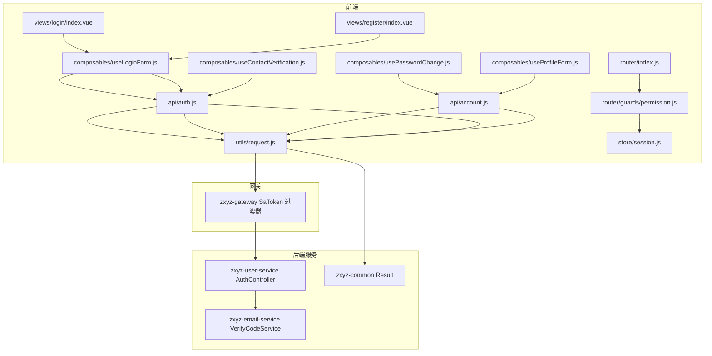
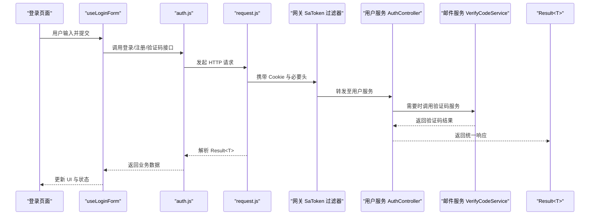
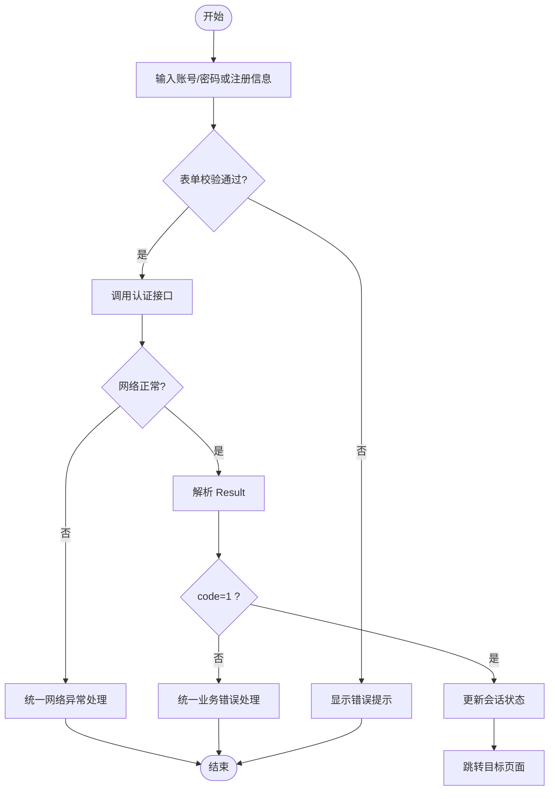
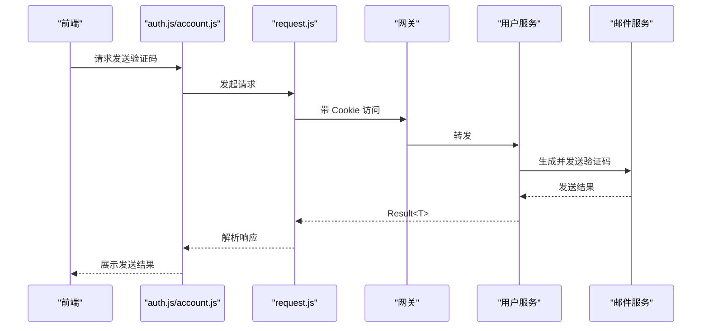
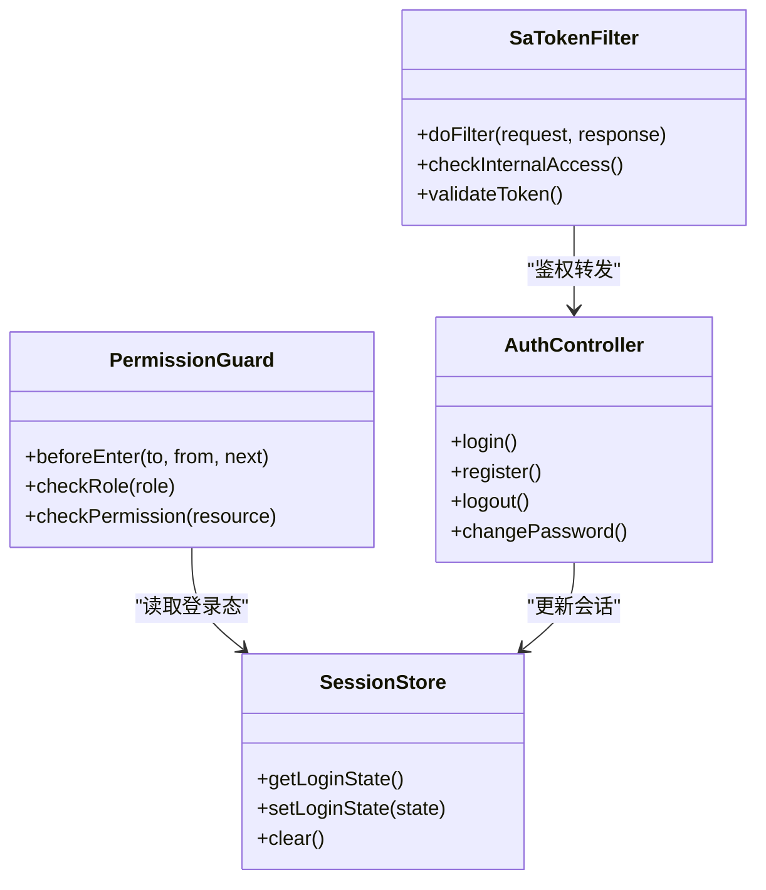
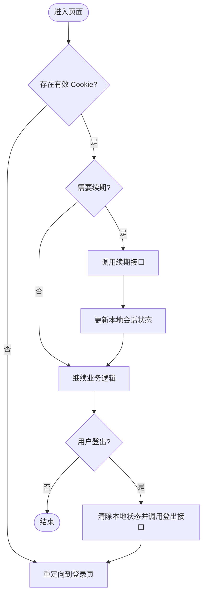
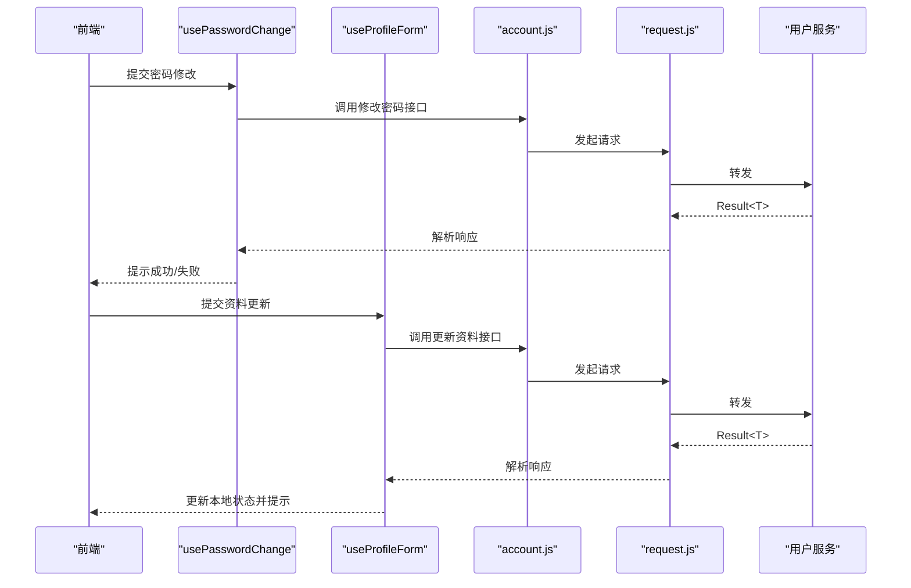
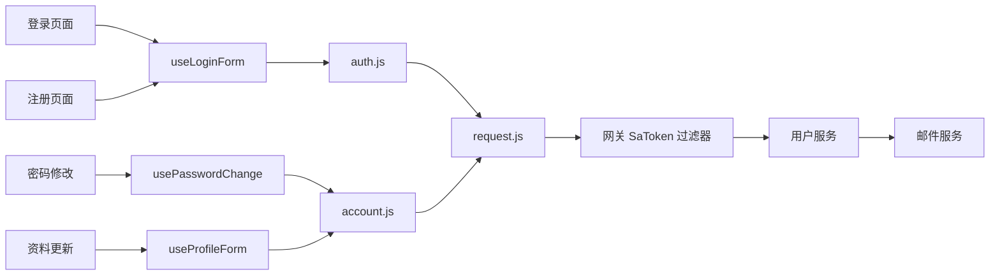

# 用户认证模块

<cite>
**本文引用的文件**   
- [ZXYZdatabaseFront/src/api/auth.js](file://ZXYZdatabaseFront/src/api/auth.js)
- [ZXYZdatabaseFront/src/api/account.js](file://ZXYZdatabaseFront/src/api/account.js)
- [ZXYZdatabaseFront/src/utils/request.js](file://ZXYZdatabaseFront/src/utils/request.js)
- [ZXYZdatabaseFront/src/utils/error.js](file://ZXYZdatabaseFront/src/utils/error.js)
- [ZXYZdatabaseFront/src/utils/createApiClient.js](file://ZXYZdatabaseFront/src/utils/createApiClient.js)
- [ZXYZdatabaseFront/src/store/session.js](file://ZXYZdatabaseFront/src/store/session.js)
- [ZXYZdatabaseFront/src/router/index.js](file://ZXYZdatabaseFront/src/router/index.js)
- [ZXYZdatabaseFront/src/router/guards/permission.js](file://ZXYZdatabaseFront/src/router/guards/permission.js)
- [ZXYZdatabaseFront/src/views/login/index.vue](file://ZXYZdatabaseFront/src/views/login/index.vue)
- [ZXYZdatabaseFront/src/views/register/index.vue](file://ZXYZdatabaseFront/src/views/register/index.vue)
- [ZXYZdatabaseFront/src/composables/useLoginForm.js](file://ZXYZdatabaseFront/src/composables/useLoginForm.js)
- [ZXYZdatabaseFront/src/composables/usePasswordChange.js](file://ZXYZdatabaseFront/src/composables/usePasswordChange.js)
- [ZXYZdatabaseFront/src/composables/useProfileForm.js](file://ZXYZdatabaseFront/src/composables/useProfileForm.js)
- [ZXYZdatabaseFront/src/composables/useContactVerification.js](file://ZXYZdatabaseFront/src/composables/useContactVerification.js)
- [ZXYZdatabaseFront/src/utils/sanitizeRedirect.js](file://ZXYZdatabaseFront/src/utils/sanitizeRedirect.js)
- [ZXYZdatabaseBack/zxyz-gateway/src/main/java/uno/acloud/gateway/filter/SaTokenFilterConfig.java](file://ZXYZdatabaseBack/zxyz-gateway/src/main/java/uno/acloud/gateway/filter/SaTokenFilterConfig.java)
- [ZXYZdatabaseBack/zxyz-common/src/main/java/uno/acloud/common/web/Result.java](file://ZXYZdatabaseBack/zxyz-common/src/main/java/uno/acloud/common/web/Result.java)
- [ZXYZdatabaseBack/zxyz-user-service/src/main/java/uno/acloud/user/controller/AuthController.java](file://ZXYZdatabaseBack/zxyz-user-service/src/main/java/uno/acloud/user/controller/AuthController.java)
- [ZXYZdatabaseBack/zxyz-email-service/src/main/java/uno/acloud/email/application/VerifyCodeService.java](file://ZXYZdatabaseBack/zxyz-email-service/src/main/java/uno/acloud/email/application/VerifyCodeService.java)
</cite>

## 目录
1. [简介](#简介)
2. [项目结构](#项目结构)
3. [核心组件](#核心组件)
4. [架构总览](#架构总览)
5. [详细组件分析](#详细组件分析)
6. [依赖分析](#依赖分析)
7. [性能考虑](#性能考虑)
8. [故障排查指南](#故障排查指南)
9. [结论](#结论)
10. [附录](#附录)

## 简介
本文件面向 ZXYZ 前端用户认证模块，系统化说明登录、注册、验证码发送、邮箱绑定、密码修改与个人资料更新等流程的实现要点；阐述权限验证机制（Sa-Token 集成、JWT 令牌管理、角色权限控制、路由守卫）；解释会话管理策略（HttpOnly Cookie、Redis 会话存储、自动续期、登出清理）；提供完整 API 调用示例；给出错误处理策略与安全最佳实践。文档同时覆盖前后端协作点，帮助开发者快速理解并正确实现认证相关功能。

## 项目结构
前端认证相关代码主要分布在以下目录：
- API 层：封装认证与账户相关的接口调用
- 工具层：HTTP 请求封装、错误统一处理、客户端创建
- 状态层：会话与用户信息持久化
- 路由层：全局路由与权限守卫
- 视图与组合式函数：登录/注册页面、表单校验、业务逻辑复用
- 后端网关与用户服务：鉴权过滤器、认证控制器、验证码服务

图表来源
- [ZXYZdatabaseFront/src/views/login/index.vue](file://ZXYZdatabaseFront/src/views/login/index.vue)
- [ZXYZdatabaseFront/src/views/register/index.vue](file://ZXYZdatabaseFront/src/views/register/index.vue)
- [ZXYZdatabaseFront/src/composables/useLoginForm.js](file://ZXYZdatabaseFront/src/composables/useLoginForm.js)
- [ZXYZdatabaseFront/src/composables/usePasswordChange.js](file://ZXYZdatabaseFront/src/composables/usePasswordChange.js)
- [ZXYZdatabaseFront/src/composables/useProfileForm.js](file://ZXYZdatabaseFront/src/composables/useProfileForm.js)
- [ZXYZdatabaseFront/src/composables/useContactVerification.js](file://ZXYZdatabaseFront/src/composables/useContactVerification.js)
- [ZXYZdatabaseFront/src/api/auth.js](file://ZXYZdatabaseFront/src/api/auth.js)
- [ZXYZdatabaseFront/src/api/account.js](file://ZXYZdatabaseFront/src/api/account.js)
- [ZXYZdatabaseFront/src/utils/request.js](file://ZXYZdatabaseFront/src/utils/request.js)
- [ZXYZdatabaseFront/src/store/session.js](file://ZXYZdatabaseFront/src/store/session.js)
- [ZXYZdatabaseFront/src/router/index.js](file://ZXYZdatabaseFront/src/router/index.js)
- [ZXYZdatabaseFront/src/router/guards/permission.js](file://ZXYZdatabaseFront/src/router/guards/permission.js)
- [ZXYZdatabaseBack/zxyz-gateway/src/main/java/uno/acloud/gateway/filter/SaTokenFilterConfig.java](file://ZXYZdatabaseBack/zxyz-gateway/src/main/java/uno/acloud/gateway/filter/SaTokenFilterConfig.java)
- [ZXYZdatabaseBack/zxyz-user-service/src/main/java/uno/acloud/user/controller/AuthController.java](file://ZXYZdatabaseBack/zxyz-user-service/src/main/java/uno/acloud/user/controller/AuthController.java)
- [ZXYZdatabaseBack/zxyz-email-service/src/main/java/uno/acloud/email/application/VerifyCodeService.java](file://ZXYZdatabaseBack/zxyz-email-service/src/main/java/uno/acloud/email/application/VerifyCodeService.java)
- [ZXYZdatabaseBack/zxyz-common/src/main/java/uno/acloud/common/web/Result.java](file://ZXYZdatabaseBack/zxyz-common/src/main/java/uno/acloud/common/web/Result.java)

章节来源
- [ZXYZdatabaseFront/src/api/auth.js](file://ZXYZdatabaseFront/src/api/auth.js)
- [ZXYZdatabaseFront/src/api/account.js](file://ZXYZdatabaseFront/src/api/account.js)
- [ZXYZdatabaseFront/src/utils/request.js](file://ZXYZdatabaseFront/src/utils/request.js)
- [ZXYZdatabaseFront/src/store/session.js](file://ZXYZdatabaseFront/src/store/session.js)
- [ZXYZdatabaseFront/src/router/index.js](file://ZXYZdatabaseFront/src/router/index.js)
- [ZXYZdatabaseFront/src/router/guards/permission.js](file://ZXYZdatabaseFront/src/router/guards/permission.js)

## 核心组件
- 认证 API 封装：集中定义登录、注册、验证码、邮箱绑定、密码修改等接口调用方法
- 请求与错误处理：基于 Axios 的拦截器，统一处理网络异常、认证失败与业务错误，适配后端 Result<T> 结构
- 会话管理：通过 HttpOnly Cookie 维持会话，前端不直接操作敏感 token，使用 store/session.js 维护本地可见状态
- 路由守卫：在路由进入前检查登录态与角色权限，未登录或无权限时重定向到登录页或提示
- 表单与校验：登录/注册/密码修改/资料更新等表单校验逻辑封装在 composables 中，提升复用性
- 验证码与邮箱绑定：验证码发送与校验由 email-service 提供，前端通过 auth/account 接口触发

章节来源
- [ZXYZdatabaseFront/src/api/auth.js](file://ZXYZdatabaseFront/src/api/auth.js)
- [ZXYZdatabaseFront/src/api/account.js](file://ZXYZdatabaseFront/src/api/account.js)
- [ZXYZdatabaseFront/src/utils/request.js](file://ZXYZdatabaseFront/src/utils/request.js)
- [ZXYZdatabaseFront/src/store/session.js](file://ZXYZdatabaseFront/src/store/session.js)
- [ZXYZdatabaseFront/src/router/guards/permission.js](file://ZXYZdatabaseFront/src/router/guards/permission.js)
- [ZXYZdatabaseFront/src/composables/useLoginForm.js](file://ZXYZdatabaseFront/src/composables/useLoginForm.js)
- [ZXYZdatabaseFront/src/composables/usePasswordChange.js](file://ZXYZdatabaseFront/src/composables/usePasswordChange.js)
- [ZXYZdatabaseFront/src/composables/useProfileForm.js](file://ZXYZdatabaseFront/src/composables/useProfileForm.js)
- [ZXYZdatabaseFront/src/composables/useContactVerification.js](file://ZXYZdatabaseFront/src/composables/useContactVerification.js)

## 架构总览
前端认证流程贯穿“视图 → 组合式函数 → API 层 → 请求拦截器 → 网关鉴权 → 用户服务 → 邮件服务”，并通过 Result<T> 统一响应结构。

图表来源
- [ZXYZdatabaseFront/src/views/login/index.vue](file://ZXYZdatabaseFront/src/views/login/index.vue)
- [ZXYZdatabaseFront/src/composables/useLoginForm.js](file://ZXYZdatabaseFront/src/composables/useLoginForm.js)
- [ZXYZdatabaseFront/src/api/auth.js](file://ZXYZdatabaseFront/src/api/auth.js)
- [ZXYZdatabaseFront/src/utils/request.js](file://ZXYZdatabaseFront/src/utils/request.js)
- [ZXYZdatabaseBack/zxyz-gateway/src/main/java/uno/acloud/gateway/filter/SaTokenFilterConfig.java](file://ZXYZdatabaseBack/zxyz-gateway/src/main/java/uno/acloud/gateway/filter/SaTokenFilterConfig.java)
- [ZXYZdatabaseBack/zxyz-user-service/src/main/java/uno/acloud/user/controller/AuthController.java](file://ZXYZdatabaseBack/zxyz-user-service/src/main/java/uno/acloud/user/controller/AuthController.java)
- [ZXYZdatabaseBack/zxyz-email-service/src/main/java/uno/acloud/email/application/VerifyCodeService.java](file://ZXYZdatabaseBack/zxyz-email-service/src/main/java/uno/acloud/email/application/VerifyCodeService.java)
- [ZXYZdatabaseBack/zxyz-common/src/main/java/uno/acloud/common/web/Result.java](file://ZXYZdatabaseBack/zxyz-common/src/main/java/uno/acloud/common/web/Result.java)

## 详细组件分析

### 登录与注册流程
- 登录流程
  - 用户在登录页面输入账号与密码，提交后由 useLoginForm 进行表单校验
  - 调用 auth.js 的登录接口，经 request.js 发起请求
  - 网关 SaToken 过滤器校验会话，用户服务完成认证并写入 Redis 会话
  - 前端根据 Result<T> 判断成功与否，成功则更新 session 状态并跳转
- 注册流程
  - 注册页面收集用户名、邮箱、密码等信息，useLoginForm 执行规则校验
  - 调用注册接口，必要时先发送验证码（email-service）
  - 成功后引导用户登录

图表来源
- [ZXYZdatabaseFront/src/views/login/index.vue](file://ZXYZdatabaseFront/src/views/login/index.vue)
- [ZXYZdatabaseFront/src/views/register/index.vue](file://ZXYZdatabaseFront/src/views/register/index.vue)
- [ZXYZdatabaseFront/src/composables/useLoginForm.js](file://ZXYZdatabaseFront/src/composables/useLoginForm.js)
- [ZXYZdatabaseFront/src/api/auth.js](file://ZXYZdatabaseFront/src/api/auth.js)
- [ZXYZdatabaseFront/src/utils/request.js](file://ZXYZdatabaseFront/src/utils/request.js)
- [ZXYZdatabaseBack/zxyz-common/src/main/java/uno/acloud/common/web/Result.java](file://ZXYZdatabaseBack/zxyz-common/src/main/java/uno/acloud/common/web/Result.java)

章节来源
- [ZXYZdatabaseFront/src/views/login/index.vue](file://ZXYZdatabaseFront/src/views/login/index.vue)
- [ZXYZdatabaseFront/src/views/register/index.vue](file://ZXYZdatabaseFront/src/views/register/index.vue)
- [ZXYZdatabaseFront/src/composables/useLoginForm.js](file://ZXYZdatabaseFront/src/composables/useLoginForm.js)
- [ZXYZdatabaseFront/src/api/auth.js](file://ZXYZdatabaseFront/src/api/auth.js)
- [ZXYZdatabaseFront/src/utils/request.js](file://ZXYZdatabaseFront/src/utils/request.js)

### 验证码发送与邮箱绑定
- 验证码发送
  - 前端通过 auth.js 或 account.js 触发验证码发送
  - 后端 email-service 的 VerifyCodeService 生成并发送验证码，支持频率限制与过期时间
- 邮箱绑定
  - 用户提交新邮箱与验证码，account.js 调用绑定接口
  - 成功后刷新用户资料，确保前端状态一致

图表来源
- [ZXYZdatabaseFront/src/api/auth.js](file://ZXYZdatabaseFront/src/api/auth.js)
- [ZXYZdatabaseFront/src/api/account.js](file://ZXYZdatabaseFront/src/api/account.js)
- [ZXYZdatabaseFront/src/utils/request.js](file://ZXYZdatabaseFront/src/utils/request.js)
- [ZXYZdatabaseBack/zxyz-email-service/src/main/java/uno/acloud/email/application/VerifyCodeService.java](file://ZXYZdatabaseBack/zxyz-email-service/src/main/java/uno/acloud/email/application/VerifyCodeService.java)

章节来源
- [ZXYZdatabaseFront/src/api/auth.js](file://ZXYZdatabaseFront/src/api/auth.js)
- [ZXYZdatabaseFront/src/api/account.js](file://ZXYZdatabaseFront/src/api/account.js)
- [ZXYZdatabaseBack/zxyz-email-service/src/main/java/uno/acloud/email/application/VerifyCodeService.java](file://ZXYZdatabaseBack/zxyz-email-service/src/main/java/uno/acloud/email/application/VerifyCodeService.java)

### 权限验证机制（Sa-Token、JWT、角色与路由守卫）
- Sa-Token 集成
  - 网关层配置 SaToken 过滤器，对内部端点进行鉴权，拒绝公网访问
  - 用户服务通过 Sa-Token 管理会话与权限
- JWT 令牌管理
  - 前端不直接持有敏感 token，依赖 HttpOnly Cookie 维持会话
  - 服务端签发与校验 JWT，前端通过 Cookie 透明传递
- 角色权限控制
  - 路由守卫在进入前检查用户角色与资源权限，未授权时重定向或提示
- 路由守卫实现
  - 全局前置守卫统一处理登录态检查与权限校验
  - 结合 sanitizeRedirect 防止恶意重定向

图表来源
- [ZXYZdatabaseBack/zxyz-gateway/src/main/java/uno/acloud/gateway/filter/SaTokenFilterConfig.java](file://ZXYZdatabaseBack/zxyz-gateway/src/main/java/uno/acloud/gateway/filter/SaTokenFilterConfig.java)
- [ZXYZdatabaseBack/zxyz-user-service/src/main/java/uno/acloud/user/controller/AuthController.java](file://ZXYZdatabaseBack/zxyz-user-service/src/main/java/uno/acloud/user/controller/AuthController.java)
- [ZXYZdatabaseFront/src/router/guards/permission.js](file://ZXYZdatabaseFront/src/router/guards/permission.js)
- [ZXYZdatabaseFront/src/store/session.js](file://ZXYZdatabaseFront/src/store/session.js)

章节来源
- [ZXYZdatabaseBack/zxyz-gateway/src/main/java/uno/acloud/gateway/filter/SaTokenFilterConfig.java](file://ZXYZdatabaseBack/zxyz-gateway/src/main/java/uno/acloud/gateway/filter/SaTokenFilterConfig.java)
- [ZXYZdatabaseFront/src/router/guards/permission.js](file://ZXYZdatabaseFront/src/router/guards/permission.js)
- [ZXYZdatabaseFront/src/store/session.js](file://ZXYZdatabaseFront/src/store/session.js)

### 会话管理策略（HttpOnly Cookie、Redis 会话、自动续期、登出清理）
- HttpOnly Cookie
  - 前端不直接读写敏感 token，避免 XSS 窃取
  - 所有受保护请求自动携带 Cookie
- Redis 会话存储
  - 服务端将会话信息存入 Redis，支持分布式共享与过期策略
- 自动续期
  - 前端在关键操作或定时任务中触发续期，保持会话活跃
- 登出清理
  - 调用登出接口清除服务端会话与本地状态，重定向到登录页

图表来源
- [ZXYZdatabaseFront/src/store/session.js](file://ZXYZdatabaseFront/src/store/session.js)
- [ZXYZdatabaseFront/src/utils/request.js](file://ZXYZdatabaseFront/src/utils/request.js)
- [ZXYZdatabaseBack/zxyz-user-service/src/main/java/uno/acloud/user/controller/AuthController.java](file://ZXYZdatabaseBack/zxyz-user-service/src/main/java/uno/acloud/user/controller/AuthController.java)

章节来源
- [ZXYZdatabaseFront/src/store/session.js](file://ZXYZdatabaseFront/src/store/session.js)
- [ZXYZdatabaseFront/src/utils/request.js](file://ZXYZdatabaseFront/src/utils/request.js)
- [ZXYZdatabaseBack/zxyz-user-service/src/main/java/uno/acloud/user/controller/AuthController.java](file://ZXYZdatabaseBack/zxyz-user-service/src/main/java/uno/acloud/user/controller/AuthController.java)

### 密码修改与个人资料更新
- 密码修改
  - 使用 usePasswordChange 组合式函数，校验新旧密码与确认密码
  - 调用 account.js 的密码修改接口，成功后提示并刷新状态
- 个人资料更新
  - 使用 useProfileForm 组合式函数，校验字段格式与长度
  - 调用 account.js 的资料更新接口，成功后同步到 session

图表来源
- [ZXYZdatabaseFront/src/composables/usePasswordChange.js](file://ZXYZdatabaseFront/src/composables/usePasswordChange.js)
- [ZXYZdatabaseFront/src/composables/useProfileForm.js](file://ZXYZdatabaseFront/src/composables/useProfileForm.js)
- [ZXYZdatabaseFront/src/api/account.js](file://ZXYZdatabaseFront/src/api/account.js)
- [ZXYZdatabaseFront/src/utils/request.js](file://ZXYZdatabaseFront/src/utils/request.js)
- [ZXYZdatabaseBack/zxyz-user-service/src/main/java/uno/acloud/user/controller/AuthController.java](file://ZXYZdatabaseBack/zxyz-user-service/src/main/java/uno/acloud/user/controller/AuthController.java)

章节来源
- [ZXYZdatabaseFront/src/composables/usePasswordChange.js](file://ZXYZdatabaseFront/src/composables/usePasswordChange.js)
- [ZXYZdatabaseFront/src/composables/useProfileForm.js](file://ZXYZdatabaseFront/src/composables/useProfileForm.js)
- [ZXYZdatabaseFront/src/api/account.js](file://ZXYZdatabaseFront/src/api/account.js)

### 安全最佳实践（CSRF、XSS、敏感信息保护）
- CSRF 防护
  - 使用 HttpOnly Cookie 避免前端脚本访问 token
  - 网关层对内部端点进行严格鉴权，禁止公网访问
- XSS 防护
  - 前端对用户输入进行转义与校验，避免注入
  - 使用 sanitizeRedirect 防止恶意重定向
- 敏感信息保护
  - 不在前端日志中打印敏感字段
  - 最小化返回数据，仅暴露必要字段

章节来源
- [ZXYZdatabaseFront/src/utils/sanitizeRedirect.js](file://ZXYZdatabaseFront/src/utils/sanitizeRedirect.js)
- [ZXYZdatabaseBack/zxyz-gateway/src/main/java/uno/acloud/gateway/filter/SaTokenFilterConfig.java](file://ZXYZdatabaseBack/zxyz-gateway/src/main/java/uno/acloud/gateway/filter/SaTokenFilterConfig.java)

## 依赖分析
前端认证模块依赖关系如下：
- 视图与组合式函数依赖 API 层
- API 层依赖请求工具与错误处理
- 路由守卫依赖会话存储
- 网关过滤器依赖用户服务与邮件服务

图表来源
- [ZXYZdatabaseFront/src/views/login/index.vue](file://ZXYZdatabaseFront/src/views/login/index.vue)
- [ZXYZdatabaseFront/src/views/register/index.vue](file://ZXYZdatabaseFront/src/views/register/index.vue)
- [ZXYZdatabaseFront/src/composables/useLoginForm.js](file://ZXYZdatabaseFront/src/composables/useLoginForm.js)
- [ZXYZdatabaseFront/src/composables/usePasswordChange.js](file://ZXYZdatabaseFront/src/composables/usePasswordChange.js)
- [ZXYZdatabaseFront/src/composables/useProfileForm.js](file://ZXYZdatabaseFront/src/composables/useProfileForm.js)
- [ZXYZdatabaseFront/src/api/auth.js](file://ZXYZdatabaseFront/src/api/auth.js)
- [ZXYZdatabaseFront/src/api/account.js](file://ZXYZdatabaseFront/src/api/account.js)
- [ZXYZdatabaseFront/src/utils/request.js](file://ZXYZdatabaseFront/src/utils/request.js)
- [ZXYZdatabaseBack/zxyz-gateway/src/main/java/uno/acloud/gateway/filter/SaTokenFilterConfig.java](file://ZXYZdatabaseBack/zxyz-gateway/src/main/java/uno/acloud/gateway/filter/SaTokenFilterConfig.java)
- [ZXYZdatabaseBack/zxyz-user-service/src/main/java/uno/acloud/user/controller/AuthController.java](file://ZXYZdatabaseBack/zxyz-user-service/src/main/java/uno/acloud/user/controller/AuthController.java)
- [ZXYZdatabaseBack/zxyz-email-service/src/main/java/uno/acloud/email/application/VerifyCodeService.java](file://ZXYZdatabaseBack/zxyz-email-service/src/main/java/uno/acloud/email/application/VerifyCodeService.java)

章节来源
- [ZXYZdatabaseFront/src/api/auth.js](file://ZXYZdatabaseFront/src/api/auth.js)
- [ZXYZdatabaseFront/src/api/account.js](file://ZXYZdatabaseFront/src/api/account.js)
- [ZXYZdatabaseFront/src/utils/request.js](file://ZXYZdatabaseFront/src/utils/request.js)
- [ZXYZdatabaseBack/zxyz-gateway/src/main/java/uno/acloud/gateway/filter/SaTokenFilterConfig.java](file://ZXYZdatabaseBack/zxyz-gateway/src/main/java/uno/acloud/gateway/filter/SaTokenFilterConfig.java)

## 性能考虑
- 减少不必要的请求：合并表单提交与状态更新，避免重复调用
- 缓存策略：对非敏感查询结果进行短期缓存，降低服务器压力
- 超时与重试：合理设置请求超时与重试次数，提升用户体验
- 会话续期：仅在必要时触发续期，避免频繁请求

[本节为通用指导，无需引用具体文件]

## 故障排查指南
- 网络异常
  - 检查 request.js 的拦截器是否捕获网络错误
  - 查看浏览器控制台与后端日志定位问题
- 认证失败
  - 确认 Cookie 是否正确携带
  - 检查网关 SaToken 过滤器配置与用户服务认证逻辑
- 业务错误
  - 根据 Result<T> 的 code 与 message 定位错误原因
  - 在前端 error.js 中统一处理并提示用户

章节来源
- [ZXYZdatabaseFront/src/utils/request.js](file://ZXYZdatabaseFront/src/utils/request.js)
- [ZXYZdatabaseFront/src/utils/error.js](file://ZXYZdatabaseFront/src/utils/error.js)
- [ZXYZdatabaseBack/zxyz-common/src/main/java/uno/acloud/common/web/Result.java](file://ZXYZdatabaseBack/zxyz-common/src/main/java/uno/acloud/common/web/Result.java)

## 结论
ZXYZ 前端用户认证模块以 Sa-Token 为核心，结合 HttpOnly Cookie 与 Redis 会话，实现了安全的登录、注册、验证码、邮箱绑定、密码修改与资料更新等功能。通过统一的请求与错误处理、路由守卫与会话管理，保障了系统的安全性与可维护性。建议在生产环境中持续监控会话状态与错误率，优化性能与用户体验。

[本节为总结，无需引用具体文件]

## 附录
- API 调用示例（参考路径）
  - 用户注册：[ZXYZdatabaseFront/src/api/auth.js](file://ZXYZdatabaseFront/src/api/auth.js)
  - 登录验证：[ZXYZdatabaseFront/src/api/auth.js](file://ZXYZdatabaseFront/src/api/auth.js)
  - 密码修改：[ZXYZdatabaseFront/src/api/account.js](file://ZXYZdatabaseFront/src/api/account.js)
  - 个人资料更新：[ZXYZdatabaseFront/src/api/account.js](file://ZXYZdatabaseFront/src/api/account.js)
- 错误处理策略
  - 网络异常：[ZXYZdatabaseFront/src/utils/request.js](file://ZXYZdatabaseFront/src/utils/request.js)
  - 业务错误：[ZXYZdatabaseFront/src/utils/error.js](file://ZXYZdatabaseFront/src/utils/error.js)
- 安全最佳实践
  - CSRF/XSS 防护：[ZXYZdatabaseFront/src/utils/sanitizeRedirect.js](file://ZXYZdatabaseFront/src/utils/sanitizeRedirect.js)
  - 网关鉴权：[ZXYZdatabaseBack/zxyz-gateway/src/main/java/uno/acloud/gateway/filter/SaTokenFilterConfig.java](file://ZXYZdatabaseBack/zxyz-gateway/src/main/java/uno/acloud/gateway/filter/SaTokenFilterConfig.java)