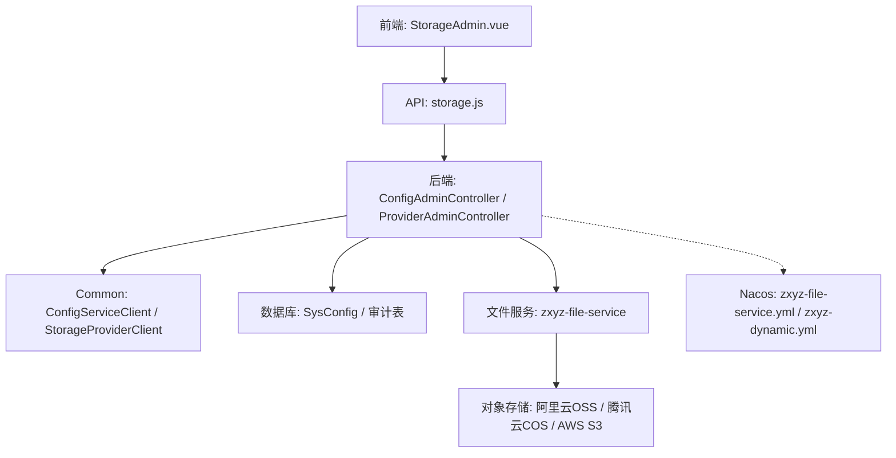
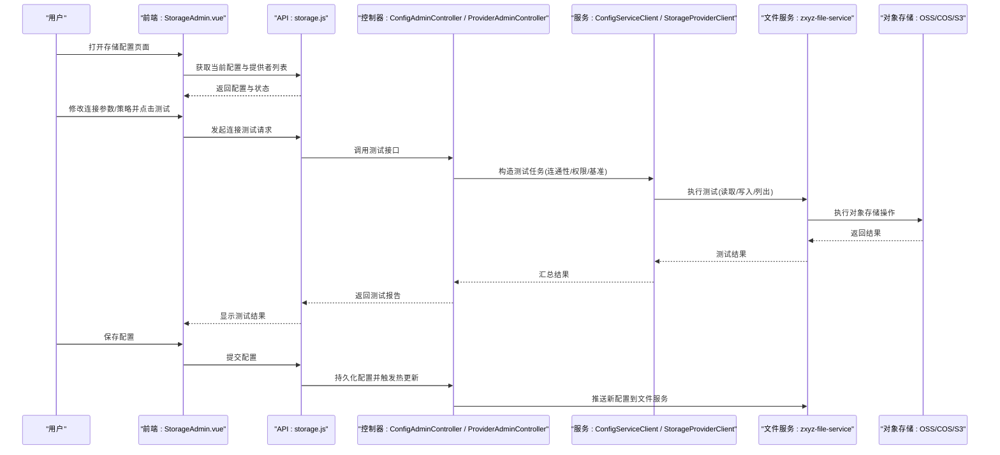
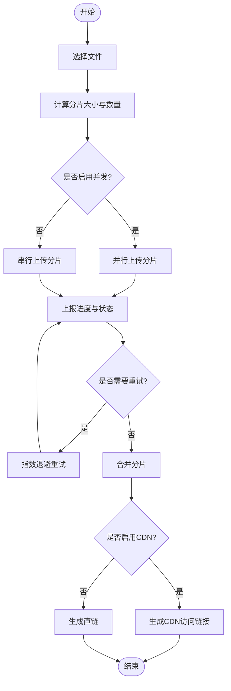
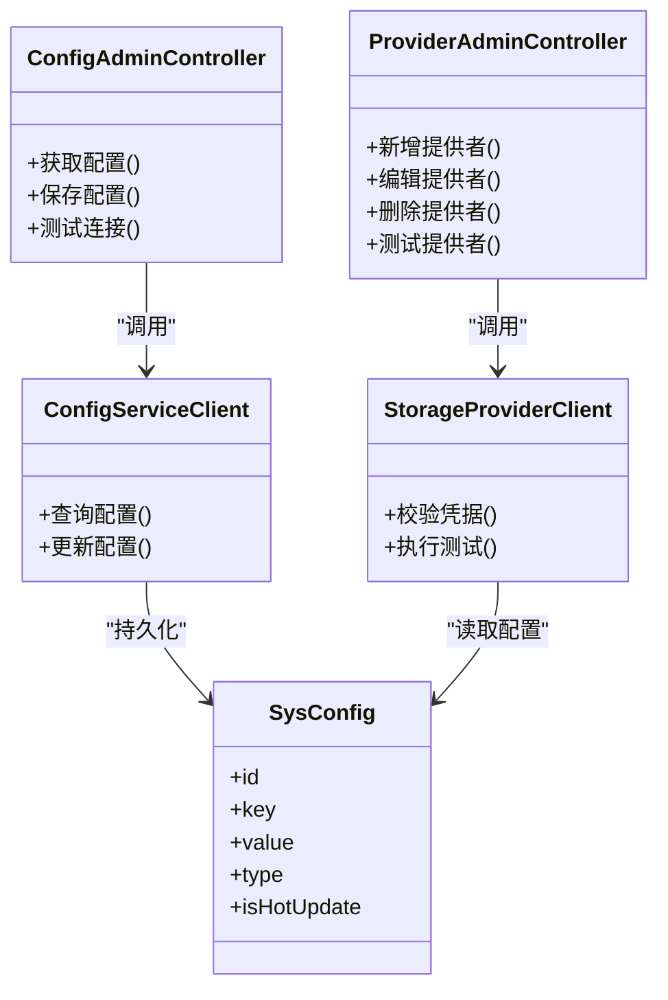
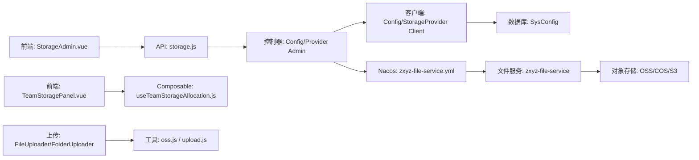

# 存储提供商配置

<cite>
**本文引用的文件**
- [StorageAdmin.vue](file://ZXYZdatabaseFront/src/views/setting/StorageAdmin.vue)
- [storage.js](file://ZXYZdatabaseFront/src/api/storage.js)
- [TeamStoragePanel.vue](file://ZXYZdatabaseFront/src/components/team-settings/TeamStoragePanel.vue)
- [useTeamStorageAllocation.js](file://ZXYZdatabaseFront/src/composables/team/useTeamStorageAllocation.js)
- [oss.js](file://ZXYZdatabaseFront/src/utils/oss.js)
- [upload.js](file://ZXYZdatabaseFront/src/services/upload.js)
- [FileUploader.vue](file://ZXYZdatabaseFront/src/components/FileUploader.vue)
- [FolderUploader.vue](file://ZXYZdatabaseFront/src/components/FolderUploader.vue)
- [zxyz-file-service.yml](file://nacos-config/zxyz-file-service.yml)
- [application-dev.yml](file://ZXYZdatabaseBack/zxyz-file-service/src/main/resources/application-dev.yml)
- [application-prod.yml](file://ZXYZdatabaseBack/zxyz-file-service/src/main/resources/application-prod.yml)
- [ConfigServiceClient.java](file://ZXYZdatabaseBack/zxyz-common/src/main/java/uno/acloud/client/ConfigServiceClient.java)
- [StorageProviderClient.java](file://ZXYZdatabaseBack/zxyz-admin-service/src/main/java/uno/acloud/admin/client/StorageProviderClient.java)
- [ConfigAdminController.java](file://ZXYZdatabaseBack/zxyz-admin-service/src/main/java/uno/acloud/admin/controller/ConfigAdminController.java)
- [ProviderAdminController.java](file://ZXYZdatabaseBack/zxyz-admin-service/src/main/java/uno/acloud/admin/controller/ProviderAdminController.java)
- [SysConfig.java](file://ZXYZdatabaseBack/zxyz-admin-service/src/main/java/uno/acloud/admin/domain/SysConfig.java)
- [V1__init_config_schema.sql](file://ZXYZdatabaseBack/zxyz-admin-service/src/main/resources/db/migration/V1__init_config_schema.sql)
- [V2__hot_config_keys.sql](file://ZXYZdatabaseBack/zxyz-admin-service/src/main/resources/db/migration/V2__hot_config_keys.sql)
- [V3__fix_config_keys.sql](file://ZXYZdatabaseBack/zxyz-admin-service/src/main/resources/db/migration/V3__fix_config_keys.sql)
</cite>

## 目录
1. [简介](#简介)
2. [项目结构](#项目结构)
3. [核心组件](#核心组件)
4. [架构总览](#架构总览)
5. [详细组件分析](#详细组件分析)
6. [依赖关系分析](#依赖关系分析)
7. [性能考虑](#性能考虑)
8. [故障排查指南](#故障排查指南)
9. [结论](#结论)
10. [附录](#附录)

## 简介
本文件面向 ZXYZ 前端“存储提供商配置”界面的开发与维护，覆盖云存储服务（阿里云 OSS、腾讯云 COS、AWS S3）的连接与认证配置、存储策略管理（分片上传、缓存策略、CDN 加速）、连接测试（连通性检测、权限验证、性能基准）、故障转移（主备切换、负载均衡、容灾策略）、配置校验与错误诊断、存储配额管理（容量限制、使用统计、费用监控），以及性能调优（并发连接数、超时配置、带宽限制）。文档以代码级为依据，结合前后端交互流程与 Nacos 配置，提供可操作的实施指引。

## 项目结构
前端通过设置页的“存储管理员”入口进入存储提供商配置界面，调用后端配置与提供者管理接口，完成参数校验、连接测试与持久化。后端由 admin-service 暴露配置与提供者管理 API，common 模块提供统一的客户端封装；文件服务 zxyz-file-service 负责实际存储读写与策略执行。Nacos 集中管理运行时配置，Jasypt 加密敏感项。

图表来源
- [StorageAdmin.vue](file://ZXYZdatabaseFront/src/views/setting/StorageAdmin.vue)
- [storage.js](file://ZXYZdatabaseFront/src/api/storage.js)
- [ConfigAdminController.java](file://ZXYZdatabaseBack/zxyz-admin-service/src/main/java/uno/acloud/admin/controller/ConfigAdminController.java)
- [ProviderAdminController.java](file://ZXYZdatabaseBack/zxyz-admin-service/src/main/java/uno/acloud/admin/controller/ProviderAdminController.java)
- [ConfigServiceClient.java](file://ZXYZdatabaseBack/zxyz-common/src/main/java/uno/acloud/client/ConfigServiceClient.java)
- [StorageProviderClient.java](file://ZXYZdatabaseBack/zxyz-admin-service/src/main/java/uno/acloud/admin/client/StorageProviderClient.java)
- [SysConfig.java](file://ZXYZdatabaseBack/zxyz-admin-service/src/main/java/uno/acloud/admin/domain/SysConfig.java)
- [zxyz-file-service.yml](file://nacos-config/zxyz-file-service.yml)

章节来源
- [StorageAdmin.vue](file://ZXYZdatabaseFront/src/views/setting/StorageAdmin.vue)
- [storage.js](file://ZXYZdatabaseFront/src/api/storage.js)
- [ConfigAdminController.java](file://ZXYZdatabaseBack/zxyz-admin-service/src/main/java/uno/acloud/admin/controller/ConfigAdminController.java)
- [ProviderAdminController.java](file://ZXYZdatabaseBack/zxyz-admin-service/src/main/java/uno/acloud/admin/controller/ProviderAdminController.java)
- [ConfigServiceClient.java](file://ZXYZdatabaseBack/zxyz-common/src/main/java/uno/acloud/client/ConfigServiceClient.java)
- [StorageProviderClient.java](file://ZXYZdatabaseBack/zxyz-admin-service/src/main/java/uno/acloud/admin/client/StorageProviderClient.java)
- [SysConfig.java](file://ZXYZdatabaseBack/zxyz-admin-service/src/main/java/uno/acloud/admin/domain/SysConfig.java)
- [zxyz-file-service.yml](file://nacos-config/zxyz-file-service.yml)

## 核心组件
- 前端配置界面：StorageAdmin.vue 提供多厂商连接表单、策略面板、测试与保存操作。
- 前端 API 层：storage.js 封装配置查询、保存、测试等 HTTP 请求。
- 团队存储分配：TeamStoragePanel.vue 与 useTeamStorageAllocation.js 展示与编辑团队维度的配额与限额。
- 上传能力：oss.js、upload.js、FileUploader.vue、FolderUploader.vue 实现分片上传、断点续传、进度回调与失败重试。
- 后端配置与提供者管理：ConfigAdminController、ProviderAdminController 暴露配置与提供者管理接口；ConfigServiceClient、StorageProviderClient 作为内部客户端。
- 配置持久化：SysConfig 实体与 Flyway 脚本 V1/V2/V3 定义配置键、热更新键与修复迁移。
- 运行时配置：Nacos 的 zxyz-file-service.yml 与 application-dev/prod.yml 管理连接参数、策略与性能调优。

章节来源
- [StorageAdmin.vue](file://ZXYZdatabaseFront/src/views/setting/StorageAdmin.vue)
- [storage.js](file://ZXYZdatabaseFront/src/api/storage.js)
- [TeamStoragePanel.vue](file://ZXYZdatabaseFront/src/components/team-settings/TeamStoragePanel.vue)
- [useTeamStorageAllocation.js](file://ZXYZdatabaseFront/src/composables/team/useTeamStorageAllocation.js)
- [oss.js](file://ZXYZdatabaseFront/src/utils/oss.js)
- [upload.js](file://ZXYZdatabaseFront/src/services/upload.js)
- [FileUploader.vue](file://ZXYZdatabaseFront/src/components/FileUploader.vue)
- [FolderUploader.vue](file://ZXYZdatabaseFront/src/components/FolderUploader.vue)
- [ConfigAdminController.java](file://ZXYZdatabaseBack/zxyz-admin-service/src/main/java/uno/acloud/admin/controller/ConfigAdminController.java)
- [ProviderAdminController.java](file://ZXYZdatabaseBack/zxyz-admin-service/src/main/java/uno/acloud/admin/controller/ProviderAdminController.java)
- [ConfigServiceClient.java](file://ZXYZdatabaseBack/zxyz-common/src/main/java/uno/acloud/client/ConfigServiceClient.java)
- [StorageProviderClient.java](file://ZXYZdatabaseBack/zxyz-admin-service/src/main/java/uno/acloud/admin/client/StorageProviderClient.java)
- [SysConfig.java](file://ZXYZdatabaseBack/zxyz-admin-service/src/main/java/uno/acloud/admin/domain/SysConfig.java)
- [V1__init_config_schema.sql](file://ZXYZdatabaseBack/zxyz-admin-service/src/main/resources/db/migration/V1__init_config_schema.sql)
- [V2__hot_config_keys.sql](file://ZXYZdatabaseBack/zxyz-admin-service/src/main/resources/db/migration/V2__hot_config_keys.sql)
- [V3__fix_config_keys.sql](file://ZXYZdatabaseBack/zxyz-admin-service/src/main/resources/db/migration/V3__fix_config_keys.sql)
- [zxyz-file-service.yml](file://nacos-config/zxyz-file-service.yml)
- [application-dev.yml](file://ZXYZdatabaseBack/zxyz-file-service/src/main/resources/application-dev.yml)
- [application-prod.yml](file://ZXYZdatabaseBack/zxyz-file-service/src/main/resources/application-prod.yml)

## 架构总览
存储提供商配置涉及“前端界面 → API 层 → 配置与提供者管理 → 文件服务 → 对象存储”的全链路。配置变更通过 Nacos 动态下发，敏感信息经 Jasypt 加密存储。上传路径支持直传或服务端中转，策略（分片大小、并发、缓存、CDN）在文件服务中生效。

图表来源
- [StorageAdmin.vue](file://ZXYZdatabaseFront/src/views/setting/StorageAdmin.vue)
- [storage.js](file://ZXYZdatabaseFront/src/api/storage.js)
- [ConfigAdminController.java](file://ZXYZdatabaseBack/zxyz-admin-service/src/main/java/uno/acloud/admin/controller/ConfigAdminController.java)
- [ProviderAdminController.java](file://ZXYZdatabaseBack/zxyz-admin-service/src/main/java/uno/acloud/admin/controller/ProviderAdminController.java)
- [ConfigServiceClient.java](file://ZXYZdatabaseBack/zxyz-common/src/main/java/uno/acloud/client/ConfigServiceClient.java)
- [StorageProviderClient.java](file://ZXYZdatabaseBack/zxyz-admin-service/src/main/java/uno/acloud/admin/client/StorageProviderClient.java)
- [zxyz-file-service.yml](file://nacos-config/zxyz-file-service.yml)

## 详细组件分析

### 前端存储配置界面（StorageAdmin.vue）
- 功能要点
  - 多厂商连接表单：Endpoint、Bucket、AccessKey、SecretKey、Region、签名版本、HTTPS、自定义域名等。
  - 策略面板：分片大小、并发上传数、重试次数、缓存策略、CDN 域名与回源规则。
  - 连接测试：连通性检测（列举 Bucket/根目录）、权限验证（读/写/删除）、性能基准（小文件吞吐、大文件分片速度）。
  - 保存与热更新：提交后调用后端保存接口，触发 Nacos 动态配置刷新。
- 交互流程
  - 初始化加载：调用 storage.js 获取当前配置与提供者状态。
  - 测试流程：组装测试参数，调用后端测试接口，渲染结果与错误详情。
  - 保存流程：参数校验通过后提交，成功后提示并刷新状态。

章节来源
- [StorageAdmin.vue](file://ZXYZdatabaseFront/src/views/setting/StorageAdmin.vue)
- [storage.js](file://ZXYZdatabaseFront/src/api/storage.js)

### 团队存储配额与分配（TeamStoragePanel.vue + useTeamStorageAllocation.js）
- 功能要点
  - 团队维度容量限制：总配额、已用空间、剩余空间、超限告警阈值。
  - 使用统计：按团队/成员/项目维度统计用量，支持导出。
  - 费用监控：对接计费指标（如对象存储账单），展示趋势与预警。
- 交互流程
  - 加载团队配额与用量数据。
  - 编辑配额上限与阈值，提交后同步至后端配置。
  - 实时刷新用量与费用指标。

章节来源
- [TeamStoragePanel.vue](file://ZXYZdatabaseFront/src/components/team-settings/TeamStoragePanel.vue)
- [useTeamStorageAllocation.js](file://ZXYZdatabaseFront/src/composables/team/useTeamStorageAllocation.js)

### 上传能力与分片策略（oss.js + upload.js + FileUploader.vue + FolderUploader.vue）
- 功能要点
  - 分片上传：根据文件大小自动切分，支持并发上传与断点续传。
  - 进度与重试：实时进度回调、失败重试、网络异常恢复。
  - 策略联动：从 Nacos 读取分片大小、并发数、超时、CDN 回源等参数。
- 关键流程
  - 选择文件 → 计算分片 → 并发上传 → 合并分片 → 生成访问链接（可选 CDN）。

图表来源
- [oss.js](file://ZXYZdatabaseFront/src/utils/oss.js)
- [upload.js](file://ZXYZdatabaseFront/src/services/upload.js)
- [FileUploader.vue](file://ZXYZdatabaseFront/src/components/FileUploader.vue)
- [FolderUploader.vue](file://ZXYZdatabaseFront/src/components/FolderUploader.vue)

章节来源
- [oss.js](file://ZXYZdatabaseFront/src/utils/oss.js)
- [upload.js](file://ZXYZdatabaseFront/src/services/upload.js)
- [FileUploader.vue](file://ZXYZdatabaseFront/src/components/FileUploader.vue)
- [FolderUploader.vue](file://ZXYZdatabaseFront/src/components/FolderUploader.vue)

### 后端配置与提供者管理（ConfigAdminController + ProviderAdminController）
- 职责划分
  - 配置管理：查询/保存系统级存储配置，支持热更新键。
  - 提供者管理：新增/编辑/删除存储提供者，校验凭据与策略。
  - 连接测试：统一封装连通性、权限、基准测试逻辑。
- 数据模型
  - SysConfig 实体用于持久化配置键值对，Flyway 脚本维护初始结构与热更新键。

图表来源
- [ConfigAdminController.java](file://ZXYZdatabaseBack/zxyz-admin-service/src/main/java/uno/acloud/admin/controller/ConfigAdminController.java)
- [ProviderAdminController.java](file://ZXYZdatabaseBack/zxyz-admin-service/src/main/java/uno/acloud/admin/controller/ProviderAdminController.java)
- [ConfigServiceClient.java](file://ZXYZdatabaseBack/zxyz-common/src/main/java/uno/acloud/client/ConfigServiceClient.java)
- [StorageProviderClient.java](file://ZXYZdatabaseBack/zxyz-admin-service/src/main/java/uno/acloud/admin/client/StorageProviderClient.java)
- [SysConfig.java](file://ZXYZdatabaseBack/zxyz-admin-service/src/main/java/uno/acloud/admin/domain/SysConfig.java)

章节来源
- [ConfigAdminController.java](file://ZXYZdatabaseBack/zxyz-admin-service/src/main/java/uno/acloud/admin/controller/ConfigAdminController.java)
- [ProviderAdminController.java](file://ZXYZdatabaseBack/zxyz-admin-service/src/main/java/uno/acloud/admin/controller/ProviderAdminController.java)
- [ConfigServiceClient.java](file://ZXYZdatabaseBack/zxyz-common/src/main/java/uno/acloud/client/ConfigServiceClient.java)
- [StorageProviderClient.java](file://ZXYZdatabaseBack/zxyz-admin-service/src/main/java/uno/acloud/admin/client/StorageProviderClient.java)
- [SysConfig.java](file://ZXYZdatabaseBack/zxyz-admin-service/src/main/java/uno/acloud/admin/domain/SysConfig.java)
- [V1__init_config_schema.sql](file://ZXYZdatabaseBack/zxyz-admin-service/src/main/resources/db/migration/V1__init_config_schema.sql)
- [V2__hot_config_keys.sql](file://ZXYZdatabaseBack/zxyz-admin-service/src/main/resources/db/migration/V2__hot_config_keys.sql)
- [V3__fix_config_keys.sql](file://ZXYZdatabaseBack/zxyz-admin-service/src/main/resources/db/migration/V3__fix_config_keys.sql)

### 运行时配置与策略（Nacos + Application 配置）
- 关键配置项
  - 连接参数：Endpoint、Bucket、AccessKey、SecretKey、Region、签名版本、HTTPS、自定义域名。
  - 策略参数：分片大小、并发上传数、重试次数、超时时间、CDN 域名与回源规则。
  - 性能调优：最大连接数、连接池大小、带宽限制、缓存策略。
  - 故障转移：主备提供者、权重、健康检查、自动切换。
- 配置生效
  - 前端保存后，后端将配置写入数据库并通过 Nacos 动态下发至文件服务，无需重启。

章节来源
- [zxyz-file-service.yml](file://nacos-config/zxyz-file-service.yml)
- [application-dev.yml](file://ZXYZdatabaseBack/zxyz-file-service/src/main/resources/application-dev.yml)
- [application-prod.yml](file://ZXYZdatabaseBack/zxyz-file-service/src/main/resources/application-prod.yml)

## 依赖关系分析
- 前端依赖
  - StorageAdmin.vue 依赖 storage.js 进行 API 调用。
  - TeamStoragePanel.vue 依赖 useTeamStorageAllocation.js 处理配额与统计。
  - 上传组件依赖 oss.js 与 upload.js 实现分片与进度。
- 后端依赖
  - 控制器依赖 Client 封装进行配置与提供者管理。
  - 配置持久化依赖 SysConfig 与 Flyway 脚本。
  - 文件服务依赖 Nacos 配置与对象存储 SDK。

图表来源
- [StorageAdmin.vue](file://ZXYZdatabaseFront/src/views/setting/StorageAdmin.vue)
- [storage.js](file://ZXYZdatabaseFront/src/api/storage.js)
- [TeamStoragePanel.vue](file://ZXYZdatabaseFront/src/components/team-settings/TeamStoragePanel.vue)
- [useTeamStorageAllocation.js](file://ZXYZdatabaseFront/src/composables/team/useTeamStorageAllocation.js)
- [FileUploader.vue](file://ZXYZdatabaseFront/src/components/FileUploader.vue)
- [FolderUploader.vue](file://ZXYZdatabaseFront/src/components/FolderUploader.vue)
- [oss.js](file://ZXYZdatabaseFront/src/utils/oss.js)
- [upload.js](file://ZXYZdatabaseFront/src/services/upload.js)
- [ConfigAdminController.java](file://ZXYZdatabaseBack/zxyz-admin-service/src/main/java/uno/acloud/admin/controller/ConfigAdminController.java)
- [ProviderAdminController.java](file://ZXYZdatabaseBack/zxyz-admin-service/src/main/java/uno/acloud/admin/controller/ProviderAdminController.java)
- [ConfigServiceClient.java](file://ZXYZdatabaseBack/zxyz-common/src/main/java/uno/acloud/client/ConfigServiceClient.java)
- [StorageProviderClient.java](file://ZXYZdatabaseBack/zxyz-admin-service/src/main/java/uno/acloud/admin/client/StorageProviderClient.java)
- [SysConfig.java](file://ZXYZdatabaseBack/zxyz-admin-service/src/main/java/uno/acloud/admin/domain/SysConfig.java)
- [zxyz-file-service.yml](file://nacos-config/zxyz-file-service.yml)

章节来源
- [StorageAdmin.vue](file://ZXYZdatabaseFront/src/views/setting/StorageAdmin.vue)
- [storage.js](file://ZXYZdatabaseFront/src/api/storage.js)
- [TeamStoragePanel.vue](file://ZXYZdatabaseFront/src/components/team-settings/TeamStoragePanel.vue)
- [useTeamStorageAllocation.js](file://ZXYZdatabaseFront/src/composables/team/useTeamStorageAllocation.js)
- [FileUploader.vue](file://ZXYZdatabaseFront/src/components/FileUploader.vue)
- [FolderUploader.vue](file://ZXYZdatabaseFront/src/components/FolderUploader.vue)
- [oss.js](file://ZXYZdatabaseFront/src/utils/oss.js)
- [upload.js](file://ZXYZdatabaseFront/src/services/upload.js)
- [ConfigAdminController.java](file://ZXYZdatabaseBack/zxyz-admin-service/src/main/java/uno/acloud/admin/controller/ConfigAdminController.java)
- [ProviderAdminController.java](file://ZXYZdatabaseBack/zxyz-admin-service/src/main/java/uno/acloud/admin/controller/ProviderAdminController.java)
- [ConfigServiceClient.java](file://ZXYZdatabaseBack/zxyz-common/src/main/java/uno/acloud/client/ConfigServiceClient.java)
- [StorageProviderClient.java](file://ZXYZdatabaseBack/zxyz-admin-service/src/main/java/uno/acloud/admin/client/StorageProviderClient.java)
- [SysConfig.java](file://ZXYZdatabaseBack/zxyz-admin-service/src/main/java/uno/acloud/admin/domain/SysConfig.java)
- [zxyz-file-service.yml](file://nacos-config/zxyz-file-service.yml)

## 性能考虑
- 并发连接数：根据网络与对象存储限流调整，避免触发上游限流。
- 超时配置：合理设置连接、读取、写入超时，避免长尾延迟。
- 带宽限制：在网关或服务端限制上传/下载带宽，保障整体稳定性。
- 分片策略：根据文件大小与网络状况动态调整分片大小与并发数。
- 缓存策略：启用 CDN 与浏览器缓存，减少重复传输。
- 重试与退避：采用指数退避与幂等重试，提升鲁棒性。

[本节为通用指导，不直接分析具体文件]

## 故障排查指南
- 连接失败
  - 检查 Endpoint、Bucket、AccessKey、SecretKey、Region、签名版本是否正确。
  - 确认 HTTPS 与自定义域名配置无误。
  - 查看测试报告的错误码与堆栈，定位网络或权限问题。
- 权限不足
  - 验证 AccessKey 权限策略是否包含读/写/删除所需权限。
  - 检查 Bucket 策略与 ACL 设置。
- 上传失败
  - 检查分片大小与并发数是否超出对象存储限制。
  - 查看重试次数与退避策略是否生效。
  - 确认 CDN 回源配置与缓存规则。
- 性能问题
  - 监控连接池、线程池与带宽使用情况。
  - 调整超时与并发参数，观察吞吐变化。
- 配置未生效
  - 确认 Nacos 配置已推送且文件服务已热更新。
  - 检查配置键是否为热更新键。

章节来源
- [ConfigAdminController.java](file://ZXYZdatabaseBack/zxyz-admin-service/src/main/java/uno/acloud/admin/controller/ConfigAdminController.java)
- [ProviderAdminController.java](file://ZXYZdatabaseBack/zxyz-admin-service/src/main/java/uno/acloud/admin/controller/ProviderAdminController.java)
- [storage.js](file://ZXYZdatabaseFront/src/api/storage.js)
- [oss.js](file://ZXYZdatabaseFront/src/utils/oss.js)
- [upload.js](file://ZXYZdatabaseFront/src/services/upload.js)
- [zxyz-file-service.yml](file://nacos-config/zxyz-file-service.yml)

## 结论
ZXYZ 存储提供商配置体系以前端界面为入口，通过统一的 API 与客户端封装，实现对多对象存储的连接、策略与测试管理。借助 Nacos 动态配置与 Flyway 迁移，确保配置的可维护性与热更新能力。上传能力与策略联动，满足高并发与大文件场景。通过完善的测试与故障排查机制，保障稳定性与可观测性。

[本节为总结，不直接分析具体文件]

## 附录
- 配置键清单
  - 连接参数：endpoint、bucket、access_key、secret_key、region、sign_version、https、custom_domain。
  - 策略参数：chunk_size、concurrency、retry_count、timeout、cdn_domain、cache_policy。
  - 性能参数：max_connections、pool_size、bandwidth_limit。
  - 故障转移：primary_provider、backup_providers、weights、health_check、auto_failover。
- 测试用例建议
  - 连通性：列举 Bucket/根目录成功。
  - 权限：上传/下载/删除小文件成功。
  - 基准：小文件吞吐、大文件分片速度达标。
- 最佳实践
  - 使用最小权限原则配置 AccessKey。
  - 启用 CDN 与缓存策略提升访问性能。
  - 定期审查配置与用量，优化成本与性能。

[本节为补充说明，不直接分析具体文件]