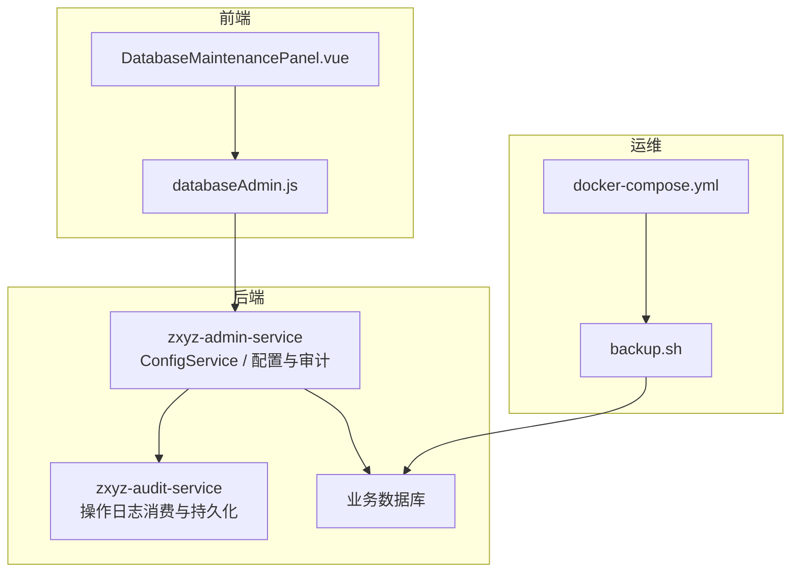
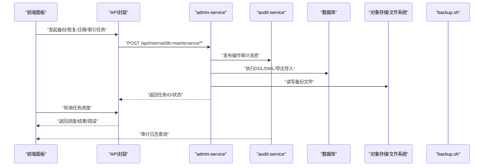
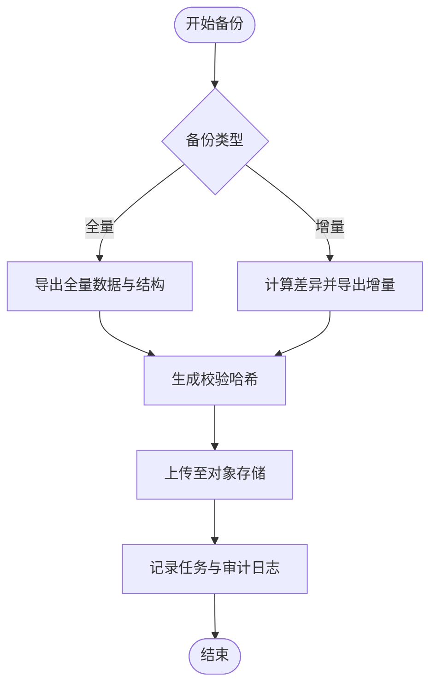
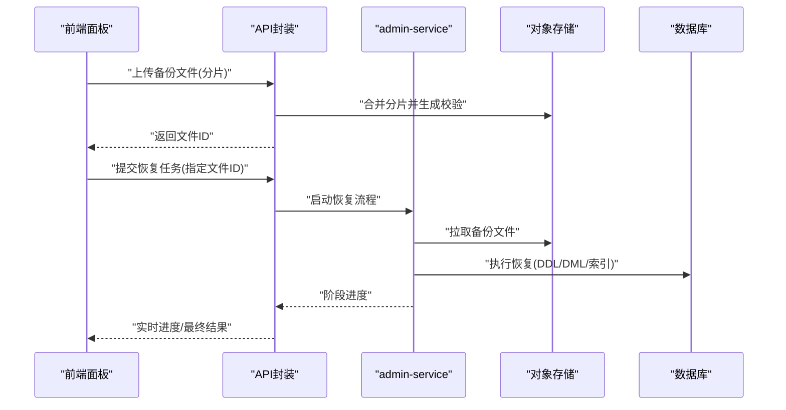
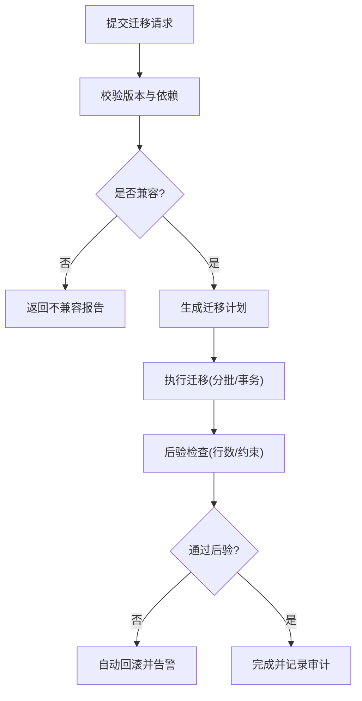
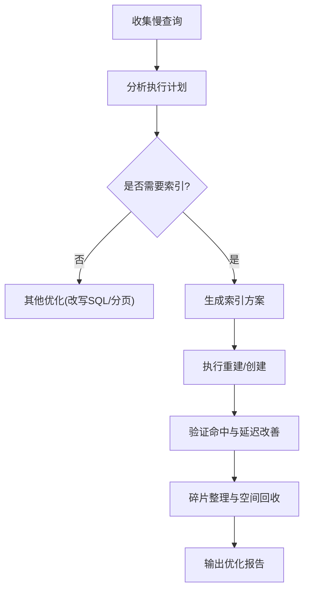
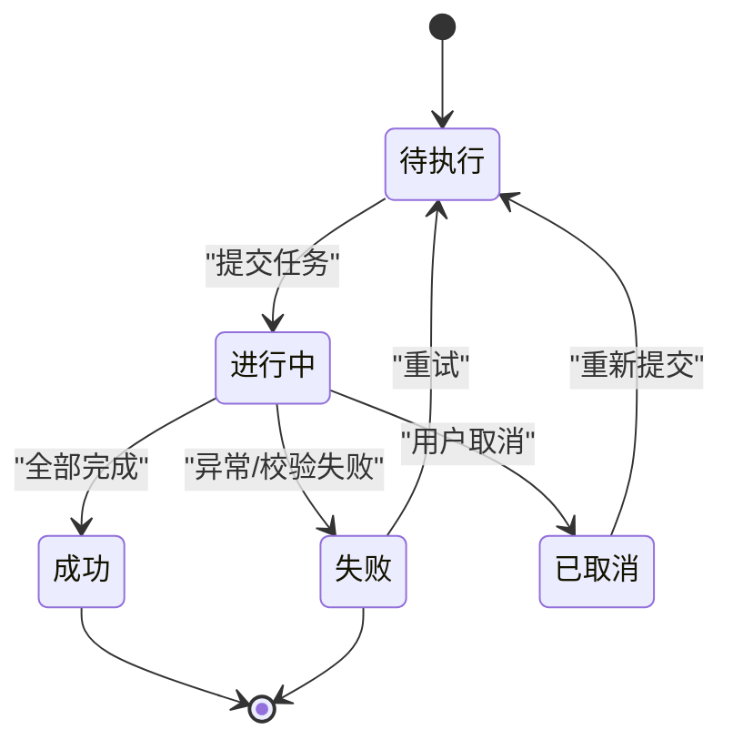
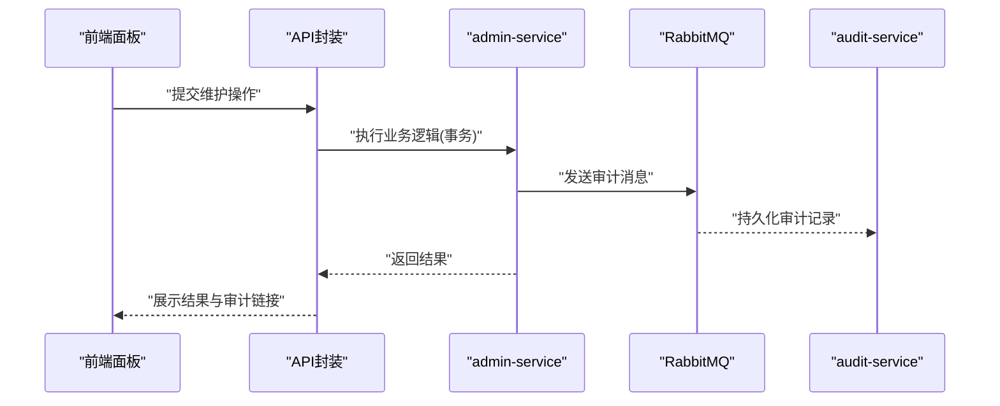
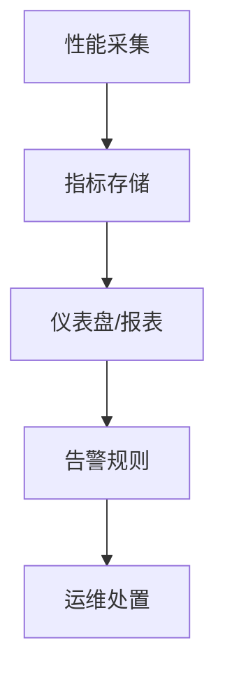
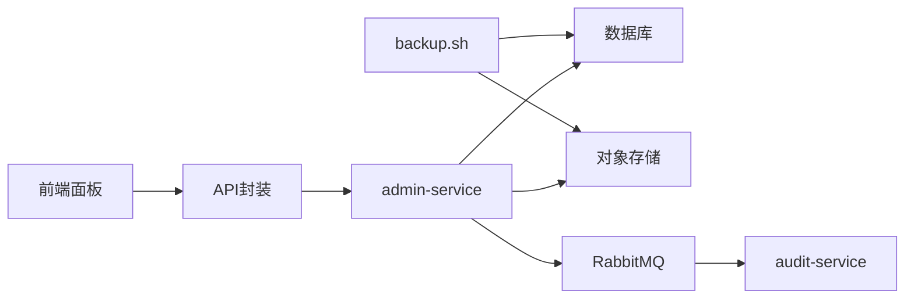

# 数据库维护

<cite>
**本文引用的文件**   
- [databaseAdmin.js](file://ZXYZdatabaseFront/src/api/databaseAdmin.js)
- [DatabaseMaintenancePanel.vue](file://ZXYZdatabaseFront/src/views/setting/components/DatabaseMaintenancePanel.vue)
- [application.yml](file://ZXYZdatabaseBack/zxyz-admin-service/src/main/resources/application.yml)
- [ConfigService.java](file://ZXYZdatabaseBack/zxyz-admin-service/src/main/java/uno/acloud/admin/service/ConfigService.java)
- [SysConfigAuditMapper.java](file://ZXYZdatabaseBack/zxyz-admin-service/src/main/java/uno/acloud/admin/mapper/SysConfigAuditMapper.java)
- [OperateLogConsumer.java](file://ZXYZdatabaseBack/zxyz-audit-service/src/main/java/uno/acloud/audit/mq/OperateLogConsumer.java)
- [schema_audit.sql](file://ZXYZdatabaseBack/sql/schema_audit.sql)
- [backup.sh](file://scripts/backup.sh)
- [docker-compose.yml](file://docker-compose.yml)
</cite>

## 目录
1. [简介](#简介)
2. [项目结构](#项目结构)
3. [核心组件](#核心组件)
4. [架构总览](#架构总览)
5. [详细组件分析](#详细组件分析)
6. [依赖关系分析](#依赖关系分析)
7. [性能考虑](#性能考虑)
8. [故障排查指南](#故障排查指南)
9. [结论](#结论)
10. [附录](#附录)

## 简介
本文件面向 ZXYZ 前端“数据库维护面板”的开发与维护，聚焦以下能力：
- 备份：全量备份、增量备份与定时备份策略
- 恢复：备份文件上传、恢复进度监控、数据完整性校验
- 迁移：表结构变更、数据转换、版本兼容性检查
- 索引优化：慢查询分析、索引重建、存储空间清理
- 操作界面：执行进度、结果反馈与错误处理
- 安全保护：事务管理、回滚机制、操作审计
- 性能监控：查询性能分析与资源使用统计

说明：当前仓库中未包含后端数据库备份/恢复/迁移/索引优化的具体实现代码。本文基于前端 API 定义、运维脚本与审计/配置服务进行体系化设计，给出可落地的接口契约、交互流程与集成建议，便于后续在 zxyz-admin-service 或独立运维服务中补齐实现。

## 项目结构
前端维护入口位于设置页的“数据库维护”面板，通过统一的 API 层调用后端能力；后端通过 Nacos 配置与审计服务记录关键操作，运维脚本提供本地/容器内备份能力。

图表来源
- [DatabaseMaintenancePanel.vue](file://ZXYZdatabaseFront/src/views/setting/components/DatabaseMaintenancePanel.vue)
- [databaseAdmin.js](file://ZXYZdatabaseFront/src/api/databaseAdmin.js)
- [ConfigService.java](file://ZXYZdatabaseBack/zxyz-admin-service/src/main/java/uno/acloud/admin/service/ConfigService.java)
- [OperateLogConsumer.java](file://ZXYZdatabaseBack/zxyz-audit-service/src/main/java/uno/acloud/audit/mq/OperateLogConsumer.java)
- [backup.sh](file://scripts/backup.sh)
- [docker-compose.yml](file://docker-compose.yml)

章节来源
- [DatabaseMaintenancePanel.vue](file://ZXYZdatabaseFront/src/views/setting/components/DatabaseMaintenancePanel.vue)
- [databaseAdmin.js](file://ZXYZdatabaseFront/src/api/databaseAdmin.js)
- [application.yml](file://ZXYZdatabaseBack/zxyz-admin-service/src/main/resources/application.yml)

## 核心组件
- 前端维护面板（DatabaseMaintenancePanel.vue）
  - 负责展示备份/恢复/迁移/索引等维护任务列表与状态
  - 触发任务创建、轮询进度、下载备份产物、查看审计日志
- 前端 API 封装（databaseAdmin.js）
  - 统一封装数据库维护相关接口调用，包括任务提交、进度查询、文件上传/下载、审计查询
- 后端配置与审计（ConfigService.java + SysConfigAuditMapper.java）
  - 用于读取/写入系统配置（如备份策略开关、保留策略），并记录关键操作的审计事件
- 审计服务（OperateLogConsumer.java）
  - 消费 RabbitMQ 中的操作日志消息，持久化到审计库，支持按用户/时间/模块检索
- 运维脚本（backup.sh）
  - 提供本地/容器内的数据库备份能力，可作为后端定时任务的执行器

章节来源
- [DatabaseMaintenancePanel.vue](file://ZXYZdatabaseFront/src/views/setting/components/DatabaseMaintenancePanel.vue)
- [databaseAdmin.js](file://ZXYZdatabaseFront/src/api/databaseAdmin.js)
- [ConfigService.java](file://ZXYZdatabaseBack/zxyz-admin-service/src/main/java/uno/acloud/admin/service/ConfigService.java)
- [SysConfigAuditMapper.java](file://ZXYZdatabaseBack/zxyz-admin-service/src/main/java/uno/acloud/admin/mapper/SysConfigAuditMapper.java)
- [OperateLogConsumer.java](file://ZXYZdatabaseBack/zxyz-audit-service/src/main/java/uno/acloud/audit/mq/OperateLogConsumer.java)
- [backup.sh](file://scripts/backup.sh)

## 架构总览
整体采用“前端面板 + 后端服务 + 审计服务 + 运维脚本”的组合模式。前端仅暴露维护操作入口，实际执行由后端服务协调数据库客户端与存储系统完成，并通过审计服务记录全过程。

图表来源
- [databaseAdmin.js](file://ZXYZdatabaseFront/src/api/databaseAdmin.js)
- [ConfigService.java](file://ZXYZdatabaseBack/zxyz-admin-service/src/main/java/uno/acloud/admin/service/ConfigService.java)
- [OperateLogConsumer.java](file://ZXYZdatabaseBack/zxyz-audit-service/src/main/java/uno/acloud/audit/mq/OperateLogConsumer.java)
- [backup.sh](file://scripts/backup.sh)

## 详细组件分析

### 备份功能（全量/增量/定时）
- 全量备份
  - 触发方式：前端点击“全量备份”，后端生成快照文件并上传至对象存储
  - 产物：包含元数据与数据的归档包，附带校验哈希
  - 进度：任务ID驱动，前端轮询获取阶段与百分比
- 增量备份
  - 触发方式：选择基准全量/上次增量，后端基于 binlog/LSN/时间戳捕获差异
  - 产物：增量包与基线标识，支持链式恢复
- 定时备份
  - 策略：Cron 表达式配置，支持每日/每周/每月策略与保留数量
  - 执行：由 admin-service 调度或外部 Cron 调用内部接口

图表来源
- [databaseAdmin.js](file://ZXYZdatabaseFront/src/api/databaseAdmin.js)
- [backup.sh](file://scripts/backup.sh)

章节来源
- [databaseAdmin.js](file://ZXYZdatabaseFront/src/api/databaseAdmin.js)
- [backup.sh](file://scripts/backup.sh)

### 恢复功能（上传/进度/完整性）
- 备份文件上传
  - 支持分片上传与断点续传，前端校验 MIME/大小/后缀
  - 服务端校验哈希与签名，失败即拒绝
- 恢复执行
  - 顺序：校验 → 预检（空间/锁/依赖）→ 执行 → 后验（计数/抽样）
  - 进度：阶段化上报（解析/准备/写入/验证/完成）
- 完整性验证
  - 行级抽样、主键唯一性、外键约束、索引一致性检查

图表来源
- [databaseAdmin.js](file://ZXYZdatabaseFront/src/api/databaseAdmin.js)

章节来源
- [databaseAdmin.js](file://ZXYZdatabaseFront/src/api/databaseAdmin.js)

### 数据迁移工具（结构变更/数据转换/版本兼容）
- 表结构变更
  - 以 Flyway/Liquibase 风格迁移脚本管理，禁止直接在生产执行 DDL
  - 前置校验：目标环境版本、依赖表存在性、字段类型兼容
- 数据转换
  - 提供映射规则与转换函数，支持灰度与回滚
- 版本兼容性检查
  - 对比源/目标 schema 差异，生成报告与回滚脚本

图表来源
- [databaseAdmin.js](file://ZXYZdatabaseFront/src/api/databaseAdmin.js)

章节来源
- [databaseAdmin.js](file://ZXYZdatabaseFront/src/api/databaseAdmin.js)

### 索引优化（慢查询/重建/空间清理）
- 慢查询分析
  - 采集慢查询日志，聚合热点 SQL，定位缺失索引
- 索引重建
  - 在线重建或离线重建，支持并发控制与锁等待检测
- 存储空间清理
  - 识别碎片与膨胀，执行 OPTIMIZE/REBUILD 并评估收益

图表来源
- [databaseAdmin.js](file://ZXYZdatabaseFront/src/api/databaseAdmin.js)

章节来源
- [databaseAdmin.js](file://ZXYZdatabaseFront/src/api/databaseAdmin.js)

### 维护操作界面（进度/反馈/错误）
- 任务列表与状态机
  - 状态：待执行/进行中/成功/失败/已取消
  - 支持暂停/重试/取消（受幂等与事务限制）
- 进度与日志
  - 阶段化进度条、步骤日志、错误堆栈摘要
- 错误处理
  - 网络异常重试、超时降级、部分失败补偿

图表来源
- [DatabaseMaintenancePanel.vue](file://ZXYZdatabaseFront/src/views/setting/components/DatabaseMaintenancePanel.vue)
- [databaseAdmin.js](file://ZXYZdatabaseFront/src/api/databaseAdmin.js)

章节来源
- [DatabaseMaintenancePanel.vue](file://ZXYZdatabaseFront/src/views/setting/components/DatabaseMaintenancePanel.vue)
- [databaseAdmin.js](file://ZXYZdatabaseFront/src/api/databaseAdmin.js)

### 数据安全保护（事务/回滚/审计）
- 事务管理
  - 所有写操作包裹在事务中，失败自动回滚；长事务拆分批次
- 回滚机制
  - 备份/恢复/迁移均生成回滚脚本与快照，支持一键回滚
- 操作审计
  - 所有维护操作记录审计日志（操作人、时间、参数、结果、耗时）
  - 审计数据不可篡改，支持导出与合规审查

图表来源
- [OperateLogConsumer.java](file://ZXYZdatabaseBack/zxyz-audit-service/src/main/java/uno/acloud/audit/mq/OperateLogConsumer.java)
- [SysConfigAuditMapper.java](file://ZXYZdatabaseBack/zxyz-admin-service/src/main/java/uno/acloud/admin/mapper/SysConfigAuditMapper.java)
- [schema_audit.sql](file://ZXYZdatabaseBack/sql/schema_audit.sql)

章节来源
- [OperateLogConsumer.java](file://ZXYZdatabaseBack/zxyz-audit-service/src/main/java/uno/acloud/audit/mq/OperateLogConsumer.java)
- [SysConfigAuditMapper.java](file://ZXYZdatabaseBack/zxyz-admin-service/src/main/java/uno/acloud/admin/mapper/SysConfigAuditMapper.java)
- [schema_audit.sql](file://ZXYZdatabaseBack/sql/schema_audit.sql)

### 性能监控集成（查询性能/资源统计）
- 查询性能分析
  - 接入慢查询日志与分析报表，关联维护任务上下文
- 资源使用统计
  - CPU/内存/IO/连接池指标，结合任务执行时段做相关性分析
- 告警与阈值
  - 超过阈值触发告警，辅助决策是否扩容或优化

[本节为概念性内容，不直接分析具体文件]

## 依赖关系分析
- 前端依赖
  - DatabaseMaintenancePanel.vue 依赖 databaseAdmin.js 提供的 API
- 后端依赖
  - admin-service 依赖数据库客户端与对象存储 SDK
  - audit-service 依赖 RabbitMQ 与审计库
- 运维依赖
  - backup.sh 依赖数据库客户端与对象存储 CLI
  - docker-compose.yml 编排各服务与基础设施

图表来源
- [databaseAdmin.js](file://ZXYZdatabaseFront/src/api/databaseAdmin.js)
- [ConfigService.java](file://ZXYZdatabaseBack/zxyz-admin-service/src/main/java/uno/acloud/admin/service/ConfigService.java)
- [OperateLogConsumer.java](file://ZXYZdatabaseBack/zxyz-audit-service/src/main/java/uno/acloud/audit/mq/OperateLogConsumer.java)
- [backup.sh](file://scripts/backup.sh)
- [docker-compose.yml](file://docker-compose.yml)

章节来源
- [databaseAdmin.js](file://ZXYZdatabaseFront/src/api/databaseAdmin.js)
- [docker-compose.yml](file://docker-compose.yml)

## 性能考虑
- 备份/恢复
  - 大表分块导出导入，避免长时间锁表；启用并行与限流
  - 对象存储分片上传，网络抖动自动重试
- 迁移
  - 分批执行与批量提交，减少事务开销
  - 灰度发布与双写过渡，降低风险
- 索引优化
  - 在线重建优先，避开高峰；评估碎片率再决定是否重建
- 监控
  - 指标采样降频，避免监控本身成为瓶颈

[本节为通用指导，不直接分析具体文件]

## 故障排查指南
- 常见错误
  - 权限不足：确认服务账号对数据库与对象存储的读写权限
  - 网络超时：调整超时与重试策略，检查防火墙与代理
  - 磁盘不足：清理历史备份与临时文件，扩容存储
  - 锁冲突：等待锁释放或调整事务粒度
- 诊断步骤
  - 查看任务日志与审计记录，定位失败阶段
  - 检查数据库连接池与慢查询日志
  - 核对对象存储文件完整性（哈希校验）
- 回滚与恢复
  - 使用最近一次成功备份进行恢复
  - 迁移失败时执行回滚脚本，确保一致性

章节来源
- [OperateLogConsumer.java](file://ZXYZdatabaseBack/zxyz-audit-service/src/main/java/uno/acloud/audit/mq/OperateLogConsumer.java)
- [backup.sh](file://scripts/backup.sh)

## 结论
本文件围绕 ZXYZ 前端数据库维护面板，给出了备份、恢复、迁移、索引优化、操作界面、安全保护与性能监控的系统化设计与落地建议。尽管当前仓库未包含后端实现细节，但通过明确的前端 API 契约、审计与配置服务以及运维脚本，可为后续开发提供清晰蓝图与集成路径。

## 附录
- 配置项建议
  - 备份策略：全量周期、增量频率、保留份数、压缩算法
  - 恢复策略：校验强度、回滚时限、并发度
  - 迁移策略：脚本版本、灰度比例、回滚条件
  - 索引策略：慢查询阈值、重建窗口、碎片率阈值
- 部署要点
  - 使用 docker-compose 编排服务与基础设施
  - 通过 Nacos 集中管理配置，敏感信息使用 Jasypt 加密

[本节为补充信息，不直接分析具体文件]