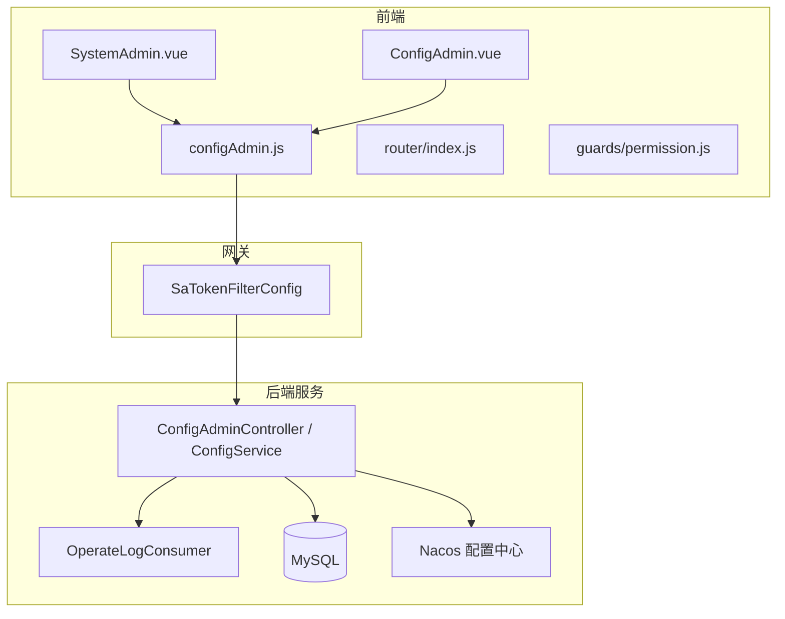
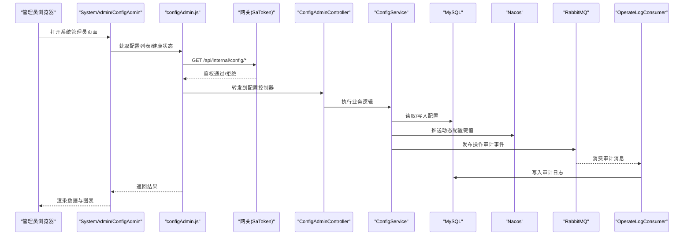
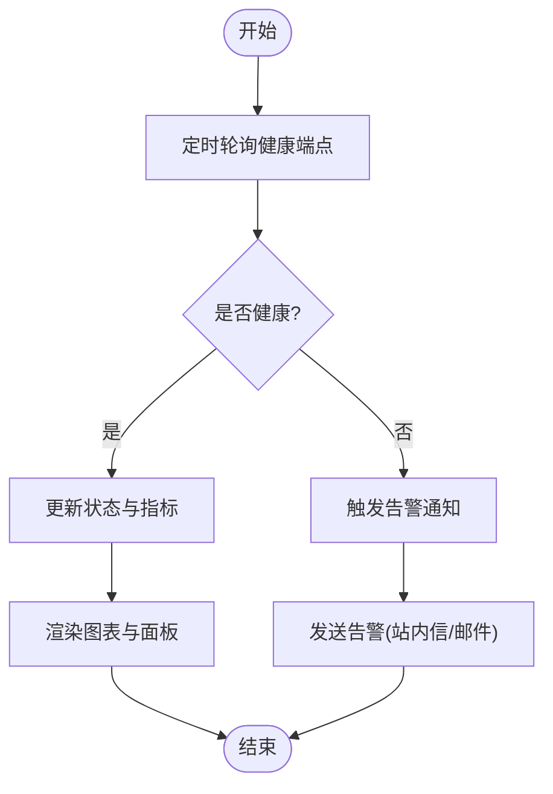
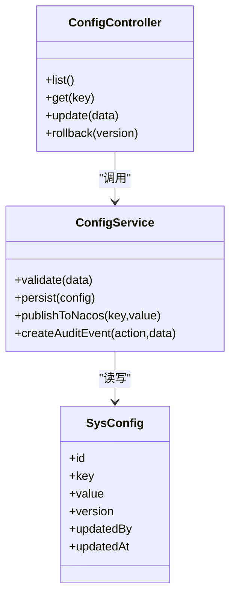
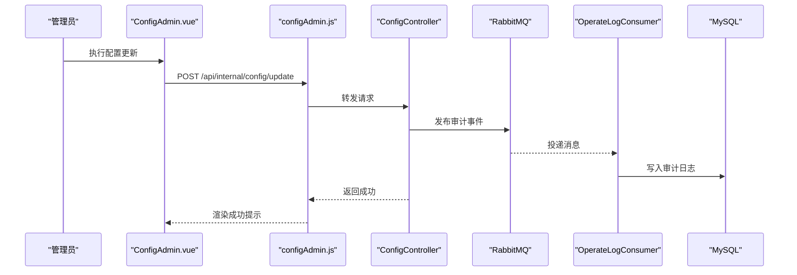
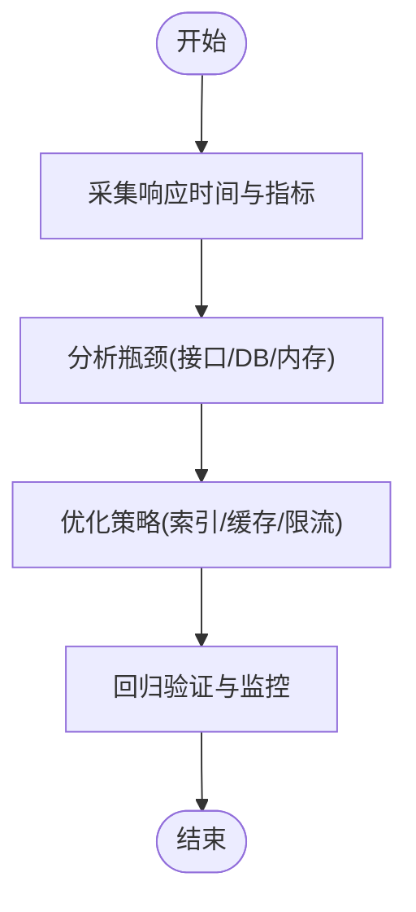
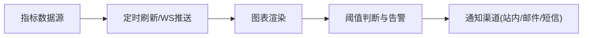
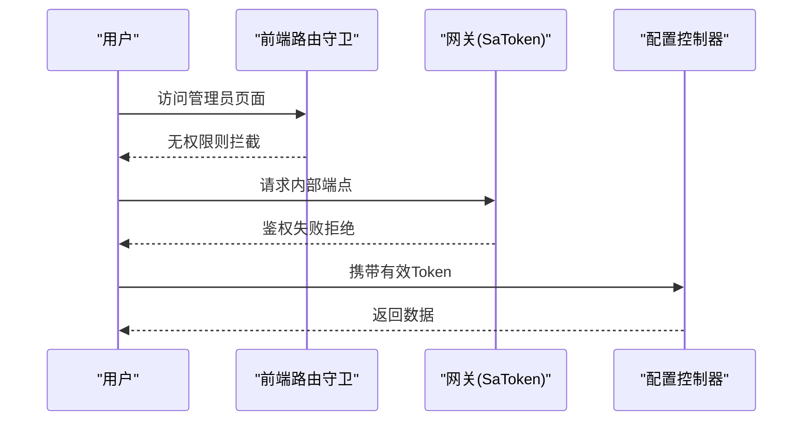
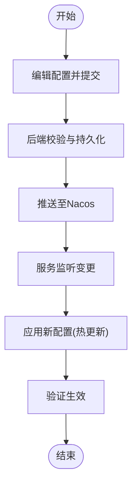
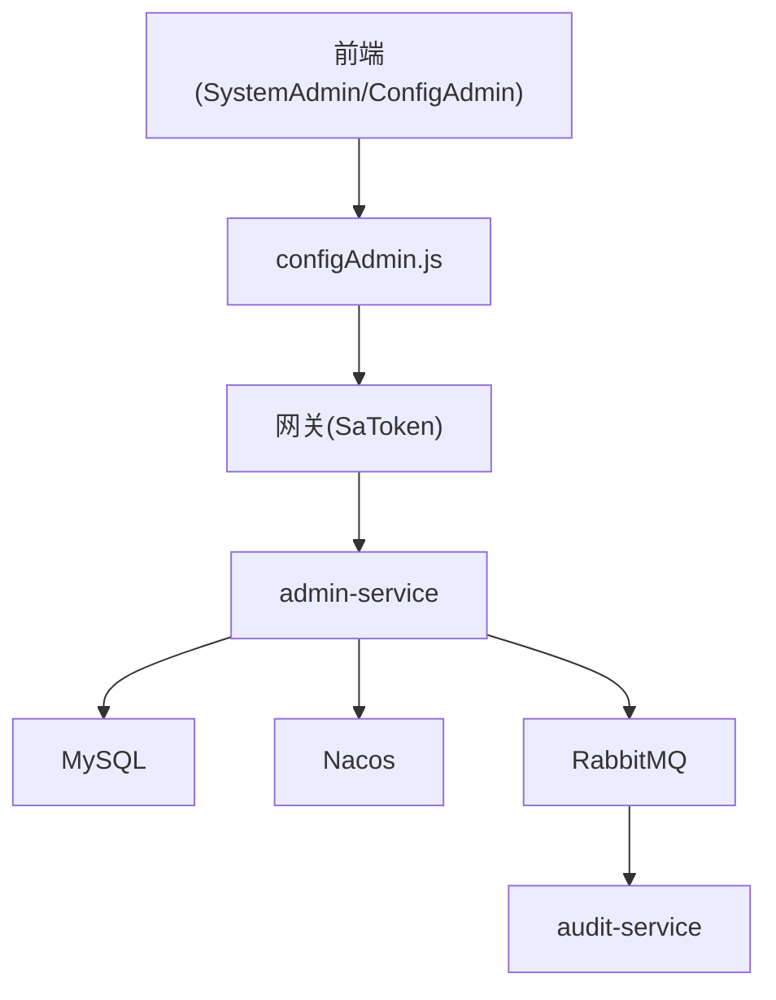

# 系统管理员

<cite>
**本文引用的文件**   
- [ZXYZdatabaseFront/src/views/setting/SystemAdmin.vue](file://ZXYZdatabaseFront/src/views/setting/SystemAdmin.vue)
- [ZXYZdatabaseFront/src/views/setting/ConfigAdmin.vue](file://ZXYZdatabaseFront/src/views/setting/ConfigAdmin.vue)
- [ZXYZdatabaseFront/src/api/configAdmin.js](file://ZXYZdatabaseFront/src/api/configAdmin.js)
- [ZXYZdatabaseFront/src/router/index.js](file://ZXYZdatabaseFront/src/router/index.js)
- [ZXYZdatabaseFront/src/router/guards/permission.js](file://ZXYZdatabaseFront/src/router/guards/permission.js)
- [ZXYZdatabaseBack/zxyz-admin-service/src/main/java/uno/acloud/admin/controller/ConfigAdminController.java](file://ZXYZdatabaseBack/zxyz-admin-service/src/main/java/uno/acloud/admin/controller/ConfigAdminController.java)
- [ZXYZdatabaseBack/zxyz-admin-service/src/main/java/uno/acloud/admin/service/ConfigService.java](file://ZXYZdatabaseBack/zxyz-admin-service/src/main/java/uno/acloud/admin/service/ConfigService.java)
- [ZXYZdatabaseBack/zxyz-admin-service/src/main/java/uno/acloud/admin/domain/SysConfig.java](file://ZXYZdatabaseBack/zxyz-admin-service/src/main/java/uno/acloud/admin/domain/SysConfig.java)
- [ZXYZdatabaseBack/zxyz-admin-service/src/main/java/uno/acloud/admin/mapper/SysConfigMapper.java](file://ZXYZdatabaseBack/zxyz-admin-service/src/main/java/uno/acloud/admin/mapper/SysConfigMapper.java)
- [ZXYZdatabaseBack/zxyz-admin-service/src/main/resources/db/migration/V1__init_config_schema.sql](file://ZXYZdatabaseBack/zxyz-admin-service/src/main/resources/db/migration/V1__init_config_schema.sql)
- [ZXYZdatabaseBack/zxyz-admin-service/src/main/resources/db/migration/V2__hot_config_keys.sql](file://ZXYZdatabaseBack/zxyz-admin-service/src/main/resources/db/migration/V2__hot_config_keys.sql)
- [ZXYZdatabaseBack/zxyz-audit-service/src/main/java/uno/acloud/audit/mq/OperateLogConsumer.java](file://ZXYZdatabaseBack/zxyz-audit-service/src/main/java/uno/acloud/audit/mq/OperateLogConsumer.java)
- [ZXYZdatabaseBack/zxyz-common/src/main/java/uno/acloud/common/permission/PermissionPolicy.java](file://ZXYZdatabaseBack/zxyz-common/src/main/java/uno/acloud/common/permission/PermissionPolicy.java)
- [ZXYZdatabaseBack/zxyz-gateway/src/main/java/uno/acloud/gateway/filter/SaTokenFilterConfig.java](file://ZXYZdatabaseBack/zxyz-gateway/src/main/java/uno/acloud/gateway/filter/SaTokenFilterConfig.java)
- [nacos-config/zxyz-dynamic.yml](file://nacos-config/zxyz-dynamic.yml)
- [scripts/health-check.sh](file://scripts/health-check.sh)
</cite>

## 目录
1. [简介](#简介)
2. [项目结构](#项目结构)
3. [核心组件](#核心组件)
4. [架构总览](#架构总览)
5. [详细组件分析](#详细组件分析)
6. [依赖关系分析](#依赖关系分析)
7. [性能考量](#性能考量)
8. [故障排查指南](#故障排查指南)
9. [结论](#结论)
10. [附录](#附录)

## 简介
本开发文档面向 ZXYZ 前端“系统管理员”界面，聚焦以下能力：
- 服务监控：健康检查、性能指标与资源使用概览
- 配置管理：动态配置更新、版本管理与回滚
- 审计日志：操作记录查询、筛选导出与安全事件分析
- 系统性能分析：响应时间监控、数据库查询优化、内存使用分析
- 监控面板：实时刷新、图表可视化与告警通知
- 权限控制：仅系统管理员可访问敏感配置
- 配置热更新：运行时修改并最小化重启影响

## 项目结构
前端采用 Vue 3 + Element Plus + Pinia，后端为多模块微服务（Spring Boot），通过网关统一鉴权与路由。系统管理员相关的前端页面位于 setting 目录，后端配置管理集中在 admin-service，审计日志由 audit-service 消费 MQ 消息落库。

**图示来源** 
- [ZXYZdatabaseFront/src/views/setting/SystemAdmin.vue](file://ZXYZdatabaseFront/src/views/setting/SystemAdmin.vue)
- [ZXYZdatabaseFront/src/views/setting/ConfigAdmin.vue](file://ZXYZdatabaseFront/src/views/setting/ConfigAdmin.vue)
- [ZXYZdatabaseFront/src/api/configAdmin.js](file://ZXYZdatabaseFront/src/api/configAdmin.js)
- [ZXYZdatabaseBack/zxyz-gateway/src/main/java/uno/acloud/gateway/filter/SaTokenFilterConfig.java](file://ZXYZdatabaseBack/zxyz-gateway/src/main/java/uno/acloud/gateway/filter/SaTokenFilterConfig.java)
- [ZXYZdatabaseBack/zxyz-admin-service/src/main/java/uno/acloud/admin/controller/ConfigAdminController.java](file://ZXYZdatabaseBack/zxyz-admin-service/src/main/java/uno/acloud/admin/controller/ConfigAdminController.java)
- [ZXYZdatabaseBack/zxyz-admin-service/src/main/java/uno/acloud/admin/service/ConfigService.java](file://ZXYZdatabaseBack/zxyz-admin-service/src/main/java/uno/acloud/admin/service/ConfigService.java)
- [ZXYZdatabaseBack/zxyz-audit-service/src/main/java/uno/acloud/audit/mq/OperateLogConsumer.java](file://ZXYZdatabaseBack/zxyz-audit-service/src/main/java/uno/acloud/audit/mq/OperateLogConsumer.java)

**章节来源**
- [ZXYZdatabaseFront/src/views/setting/SystemAdmin.vue](file://ZXYZdatabaseFront/src/views/setting/SystemAdmin.vue)
- [ZXYZdatabaseFront/src/views/setting/ConfigAdmin.vue](file://ZXYZdatabaseFront/src/views/setting/ConfigAdmin.vue)
- [ZXYZdatabaseFront/src/api/configAdmin.js](file://ZXYZdatabaseFront/src/api/configAdmin.js)
- [ZXYZdatabaseFront/src/router/index.js](file://ZXYZdatabaseFront/src/router/index.js)
- [ZXYZdatabaseFront/src/router/guards/permission.js](file://ZXYZdatabaseFront/src/router/guards/permission.js)

## 核心组件
- 系统管理员主面板（SystemAdmin）：聚合服务健康、资源使用、关键指标与告警入口
- 配置管理面板（ConfigAdmin）：提供配置的增删改查、版本对比与回滚
- 配置API封装（configAdmin.js）：统一调用后端配置接口，处理错误与重试
- 网关鉴权（SaTokenFilterConfig）：拦截内部端点，确保公网不可达
- 配置服务（ConfigController/ConfigService）：实现配置持久化、校验与热更新触发
- 审计消费者（OperateLogConsumer）：消费操作日志消息，写入审计表

**章节来源**
- [ZXYZdatabaseFront/src/views/setting/SystemAdmin.vue](file://ZXYZdatabaseFront/src/views/setting/SystemAdmin.vue)
- [ZXYZdatabaseFront/src/views/setting/ConfigAdmin.vue](file://ZXYZdatabaseFront/src/views/setting/ConfigAdmin.vue)
- [ZXYZdatabaseFront/src/api/configAdmin.js](file://ZXYZdatabaseFront/src/api/configAdmin.js)
- [ZXYZdatabaseBack/zxyz-admin-service/src/main/java/uno/acloud/admin/controller/ConfigAdminController.java](file://ZXYZdatabaseBack/zxyz-admin-service/src/main/java/uno/acloud/admin/controller/ConfigAdminController.java)
- [ZXYZdatabaseBack/zxyz-admin-service/src/main/java/uno/acloud/admin/service/ConfigService.java](file://ZXYZdatabaseBack/zxyz-admin-service/src/main/java/uno/acloud/admin/service/ConfigService.java)
- [ZXYZdatabaseBack/zxyz-audit-service/src/main/java/uno/acloud/audit/mq/OperateLogConsumer.java](file://ZXYZdatabaseBack/zxyz-audit-service/src/main/java/uno/acloud/audit/mq/OperateLogConsumer.java)

## 架构总览
系统管理员功能贯穿前后端与基础设施：
- 前端通过路由守卫限制访问，调用 configAdmin.js 发起请求
- 网关层基于 SaToken 进行鉴权与内部端点保护
- 后端配置服务读写 MySQL，并通过 Nacos 推送动态配置
- 审计服务订阅 MQ 主题，持久化操作日志，支持后续查询与分析

**图示来源** 
- [ZXYZdatabaseFront/src/views/setting/SystemAdmin.vue](file://ZXYZdatabaseFront/src/views/setting/SystemAdmin.vue)
- [ZXYZdatabaseFront/src/views/setting/ConfigAdmin.vue](file://ZXYZdatabaseFront/src/views/setting/ConfigAdmin.vue)
- [ZXYZdatabaseFront/src/api/configAdmin.js](file://ZXYZdatabaseFront/src/api/configAdmin.js)
- [ZXYZdatabaseBack/zxyz-gateway/src/main/java/uno/acloud/gateway/filter/SaTokenFilterConfig.java](file://ZXYZdatabaseBack/zxyz-gateway/src/main/java/uno/acloud/gateway/filter/SaTokenFilterConfig.java)
- [ZXYZdatabaseBack/zxyz-admin-service/src/main/java/uno/acloud/admin/controller/ConfigAdminController.java](file://ZXYZdatabaseBack/zxyz-admin-service/src/main/java/uno/acloud/admin/controller/ConfigAdminController.java)
- [ZXYZdatabaseBack/zxyz-admin-service/src/main/java/uno/acloud/admin/service/ConfigService.java](file://ZXYZdatabaseBack/zxyz-admin-service/src/main/java/uno/acloud/admin/service/ConfigService.java)
- [ZXYZdatabaseBack/zxyz-audit-service/src/main/java/uno/acloud/audit/mq/OperateLogConsumer.java](file://ZXYZdatabaseBack/zxyz-audit-service/src/main/java/uno/acloud/audit/mq/OperateLogConsumer.java)

## 详细组件分析

### 服务监控与健康检查
- 健康检查：前端定时轮询后端健康端点，展示服务状态与延迟；失败时触发告警提示
- 性能指标：采集响应时间、吞吐、错误率等，以折线图/仪表盘呈现
- 资源使用：CPU、内存、磁盘、连接池等指标，结合阈值告警

**图示来源** 
- [scripts/health-check.sh](file://scripts/health-check.sh)
- [ZXYZdatabaseFront/src/views/setting/SystemAdmin.vue](file://ZXYZdatabaseFront/src/views/setting/SystemAdmin.vue)

**章节来源**
- [ZXYZdatabaseFront/src/views/setting/SystemAdmin.vue](file://ZXYZdatabaseFront/src/views/setting/SystemAdmin.vue)
- [scripts/health-check.sh](file://scripts/health-check.sh)

### 配置管理（动态更新、版本管理、回滚）
- 动态配置：通过 Nacos 推送 key-value，服务侧监听变更并热更新
- 版本管理：每次变更生成新版本，支持对比与回滚
- 安全校验：字段校验、白名单 key、幂等更新

**图示来源** 
- [ZXYZdatabaseBack/zxyz-admin-service/src/main/java/uno/acloud/admin/domain/SysConfig.java](file://ZXYZdatabaseBack/zxyz-admin-service/src/main/java/uno/acloud/admin/domain/SysConfig.java)
- [ZXYZdatabaseBack/zxyz-admin-service/src/main/java/uno/acloud/admin/controller/ConfigAdminController.java](file://ZXYZdatabaseBack/zxyz-admin-service/src/main/java/uno/acloud/admin/controller/ConfigAdminController.java)
- [ZXYZdatabaseBack/zxyz-admin-service/src/main/java/uno/acloud/admin/service/ConfigService.java](file://ZXYZdatabaseBack/zxyz-admin-service/src/main/java/uno/acloud/admin/service/ConfigService.java)

**章节来源**
- [ZXYZdatabaseBack/zxyz-admin-service/src/main/java/uno/acloud/admin/controller/ConfigAdminController.java](file://ZXYZdatabaseBack/zxyz-admin-service/src/main/java/uno/acloud/admin/controller/ConfigAdminController.java)
- [ZXYZdatabaseBack/zxyz-admin-service/src/main/java/uno/acloud/admin/service/ConfigService.java](file://ZXYZdatabaseBack/zxyz-admin-service/src/main/java/uno/acloud/admin/service/ConfigService.java)
- [ZXYZdatabaseBack/zxyz-admin-service/src/main/java/uno/acloud/admin/domain/SysConfig.java](file://ZXYZdatabaseBack/zxyz-admin-service/src/main/java/uno/acloud/admin/domain/SysConfig.java)
- [ZXYZdatabaseBack/zxyz-admin-service/src/main/resources/db/migration/V1__init_config_schema.sql](file://ZXYZdatabaseBack/zxyz-admin-service/src/main/resources/db/migration/V1__init_config_schema.sql)
- [ZXYZdatabaseBack/zxyz-admin-service/src/main/resources/db/migration/V2__hot_config_keys.sql](file://ZXYZdatabaseBack/zxyz-admin-service/src/main/resources/db/migration/V2__hot_config_keys.sql)
- [nacos-config/zxyz-dynamic.yml](file://nacos-config/zxyz-dynamic.yml)

### 审计日志查看（查询、筛选导出、安全事件分析）
- 操作记录：所有配置变更、权限调整等操作均产生审计事件
- 筛选导出：按时间、操作人、对象类型筛选，支持 CSV/Excel 导出
- 安全事件：异常登录、越权访问、批量删除等高风险行为标记分析

**图示来源** 
- [ZXYZdatabaseFront/src/views/setting/ConfigAdmin.vue](file://ZXYZdatabaseFront/src/views/setting/ConfigAdmin.vue)
- [ZXYZdatabaseFront/src/api/configAdmin.js](file://ZXYZdatabaseFront/src/api/configAdmin.js)
- [ZXYZdatabaseBack/zxyz-admin-service/src/main/java/uno/acloud/admin/controller/ConfigAdminController.java](file://ZXYZdatabaseBack/zxyz-admin-service/src/main/java/uno/acloud/admin/controller/ConfigAdminController.java)
- [ZXYZdatabaseBack/zxyz-audit-service/src/main/java/uno/acloud/audit/mq/OperateLogConsumer.java](file://ZXYZdatabaseBack/zxyz-audit-service/src/main/java/uno/acloud/audit/mq/OperateLogConsumer.java)

**章节来源**
- [ZXYZdatabaseFront/src/views/setting/ConfigAdmin.vue](file://ZXYZdatabaseFront/src/views/setting/ConfigAdmin.vue)
- [ZXYZdatabaseFront/src/api/configAdmin.js](file://ZXYZdatabaseFront/src/api/configAdmin.js)
- [ZXYZdatabaseBack/zxyz-audit-service/src/main/java/uno/acloud/audit/mq/OperateLogConsumer.java](file://ZXYZdatabaseBack/zxyz-audit-service/src/main/java/uno/acloud/audit/mq/OperateLogConsumer.java)

### 系统性能分析（响应时间、数据库优化、内存分析）
- 响应时间：前端埋点记录首屏、接口耗时，后端 AOP 统计方法耗时
- 数据库优化：慢查询日志、索引建议、分页与投影模式减少数据传输
- 内存分析：JVM 参数调优、GC 日志收集、热点对象定位

**图示来源** 
- [ZXYZdatabaseBack/zxyz-admin-service/src/main/java/uno/acloud/admin/service/ConfigService.java](file://ZXYZdatabaseBack/zxyz-admin-service/src/main/java/uno/acloud/admin/service/ConfigService.java)

**章节来源**
- [ZXYZdatabaseBack/zxyz-admin-service/src/main/java/uno/acloud/admin/service/ConfigService.java](file://ZXYZdatabaseBack/zxyz-admin-service/src/main/java/uno/acloud/admin/service/ConfigService.java)

### 监控面板（实时刷新、图表可视化、告警通知）
- 实时刷新：定时器或 WebSocket 拉取最新数据
- 图表可视化：ECharts/AntV 展示趋势、分布与对比
- 告警通知：阈值触发后推送站内信、邮件或短信

**图示来源** 
- [ZXYZdatabaseFront/src/views/setting/SystemAdmin.vue](file://ZXYZdatabaseFront/src/views/setting/SystemAdmin.vue)

**章节来源**
- [ZXYZdatabaseFront/src/views/setting/SystemAdmin.vue](file://ZXYZdatabaseFront/src/views/setting/SystemAdmin.vue)

### 权限控制策略（仅系统管理员访问）
- 路由守卫：前端路由级权限校验，未授权跳转
- 网关鉴权：SaToken 校验 Token，拒绝非管理员访问内部端点
- 服务端校验：接口层二次校验角色与资源权限

**图示来源** 
- [ZXYZdatabaseFront/src/router/guards/permission.js](file://ZXYZdatabaseFront/src/router/guards/permission.js)
- [ZXYZdatabaseBack/zxyz-gateway/src/main/java/uno/acloud/gateway/filter/SaTokenFilterConfig.java](file://ZXYZdatabaseBack/zxyz-gateway/src/main/java/uno/acloud/gateway/filter/SaTokenFilterConfig.java)
- [ZXYZdatabaseBack/zxyz-common/src/main/java/uno/acloud/common/permission/PermissionPolicy.java](file://ZXYZdatabaseBack/zxyz-common/src/main/java/uno/acloud/common/permission/PermissionPolicy.java)

**章节来源**
- [ZXYZdatabaseFront/src/router/guards/permission.js](file://ZXYZdatabaseFront/src/router/guards/permission.js)
- [ZXYZdatabaseBack/zxyz-gateway/src/main/java/uno/acloud/gateway/filter/SaTokenFilterConfig.java](file://ZXYZdatabaseBack/zxyz-gateway/src/main/java/uno/acloud/gateway/filter/SaTokenFilterConfig.java)
- [ZXYZdatabaseBack/zxyz-common/src/main/java/uno/acloud/common/permission/PermissionPolicy.java](file://ZXYZdatabaseBack/zxyz-common/src/main/java/uno/acloud/common/permission/PermissionPolicy.java)

### 配置热更新机制（运行时修改、最小化重启）
- 动态配置：Nacos 推送 key-value 变更，服务监听器接收并应用
- 热更新策略：增量更新、灰度发布、回滚预案
- 重启最小化：仅重启必要实例，滚动升级保障可用性

**图示来源** 
- [nacos-config/zxyz-dynamic.yml](file://nacos-config/zxyz-dynamic.yml)
- [ZXYZdatabaseBack/zxyz-admin-service/src/main/java/uno/acloud/admin/service/ConfigService.java](file://ZXYZdatabaseBack/zxyz-admin-service/src/main/java/uno/acloud/admin/service/ConfigService.java)

**章节来源**
- [nacos-config/zxyz-dynamic.yml](file://nacos-config/zxyz-dynamic.yml)
- [ZXYZdatabaseBack/zxyz-admin-service/src/main/java/uno/acloud/admin/service/ConfigService.java](file://ZXYZdatabaseBack/zxyz-admin-service/src/main/java/uno/acloud/admin/service/ConfigService.java)

## 依赖关系分析
- 前端依赖：Vue Router、Element Plus、Pinia、ECharts
- 后端依赖：Spring Boot、MyBatis、Nacos、RabbitMQ、MySQL
- 网关依赖：SaToken、过滤器链、内部端点白名单

**图示来源** 
- [ZXYZdatabaseFront/src/views/setting/SystemAdmin.vue](file://ZXYZdatabaseFront/src/views/setting/SystemAdmin.vue)
- [ZXYZdatabaseFront/src/views/setting/ConfigAdmin.vue](file://ZXYZdatabaseFront/src/views/setting/ConfigAdmin.vue)
- [ZXYZdatabaseFront/src/api/configAdmin.js](file://ZXYZdatabaseFront/src/api/configAdmin.js)
- [ZXYZdatabaseBack/zxyz-gateway/src/main/java/uno/acloud/gateway/filter/SaTokenFilterConfig.java](file://ZXYZdatabaseBack/zxyz-gateway/src/main/java/uno/acloud/gateway/filter/SaTokenFilterConfig.java)
- [ZXYZdatabaseBack/zxyz-admin-service/src/main/java/uno/acloud/admin/controller/ConfigAdminController.java](file://ZXYZdatabaseBack/zxyz-admin-service/src/main/java/uno/acloud/admin/controller/ConfigAdminController.java)
- [ZXYZdatabaseBack/zxyz-audit-service/src/main/java/uno/acloud/audit/mq/OperateLogConsumer.java](file://ZXYZdatabaseBack/zxyz-audit-service/src/main/java/uno/acloud/audit/mq/OperateLogConsumer.java)

**章节来源**
- [ZXYZdatabaseFront/src/api/configAdmin.js](file://ZXYZdatabaseFront/src/api/configAdmin.js)
- [ZXYZdatabaseBack/zxyz-gateway/src/main/java/uno/acloud/gateway/filter/SaTokenFilterConfig.java](file://ZXYZdatabaseBack/zxyz-gateway/src/main/java/uno/acloud/gateway/filter/SaTokenFilterConfig.java)
- [ZXYZdatabaseBack/zxyz-admin-service/src/main/java/uno/acloud/admin/controller/ConfigAdminController.java](file://ZXYZdatabaseBack/zxyz-admin-service/src/main/java/uno/acloud/admin/controller/ConfigAdminController.java)
- [ZXYZdatabaseBack/zxyz-audit-service/src/main/java/uno/acloud/audit/mq/OperateLogConsumer.java](file://ZXYZdatabaseBack/zxyz-audit-service/src/main/java/uno/acloud/audit/mq/OperateLogConsumer.java)

## 性能考量
- 前端：虚拟滚动、懒加载、防抖节流、图表按需渲染
- 后端：连接池调优、缓存热点配置、异步审计、分页与投影
- 数据库：索引优化、慢查询分析、事务边界控制
- 监控：APM 集成、指标采集、告警阈值合理设置

## 故障排查指南
- 健康检查失败：检查服务端口、依赖中间件、日志堆栈
- 配置更新无效：确认 Nacos 推送、监听器注册、配置校验规则
- 审计日志缺失：检查 MQ 消费、去重策略、存储写入
- 权限拒绝：核对 Token、角色、网关白名单与路由守卫

**章节来源**
- [scripts/health-check.sh](file://scripts/health-check.sh)
- [ZXYZdatabaseBack/zxyz-audit-service/src/main/java/uno/acloud/audit/mq/OperateLogConsumer.java](file://ZXYZdatabaseBack/zxyz-audit-service/src/main/java/uno/acloud/audit/mq/OperateLogConsumer.java)
- [ZXYZdatabaseBack/zxyz-gateway/src/main/java/uno/acloud/gateway/filter/SaTokenFilterConfig.java](file://ZXYZdatabaseBack/zxyz-gateway/src/main/java/uno/acloud/gateway/filter/SaTokenFilterConfig.java)

## 结论
系统管理员界面通过前后端协同与基础设施支撑，实现了服务监控、配置管理、审计日志与性能分析的完整闭环。权限控制与热更新机制保障了安全性与稳定性，适合大规模生产环境使用。

## 附录
- 数据库迁移脚本：V1/V2/V3 定义配置表结构与热更新键
- 部署脚本：健康检查、快速部署、回滚流程
- 配置中心：Nacos 动态配置模板与静态配置分离

**章节来源**
- [ZXYZdatabaseBack/zxyz-admin-service/src/main/resources/db/migration/V1__init_config_schema.sql](file://ZXYZdatabaseBack/zxyz-admin-service/src/main/resources/db/migration/V1__init_config_schema.sql)
- [ZXYZdatabaseBack/zxyz-admin-service/src/main/resources/db/migration/V2__hot_config_keys.sql](file://ZXYZdatabaseBack/zxyz-admin-service/src/main/resources/db/migration/V2__hot_config_keys.sql)
- [scripts/health-check.sh](file://scripts/health-check.sh)
- [nacos-config/zxyz-dynamic.yml](file://nacos-config/zxyz-dynamic.yml)