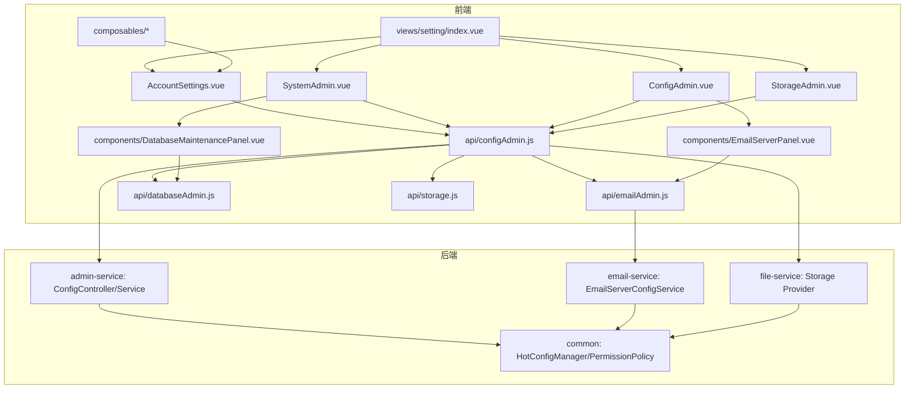
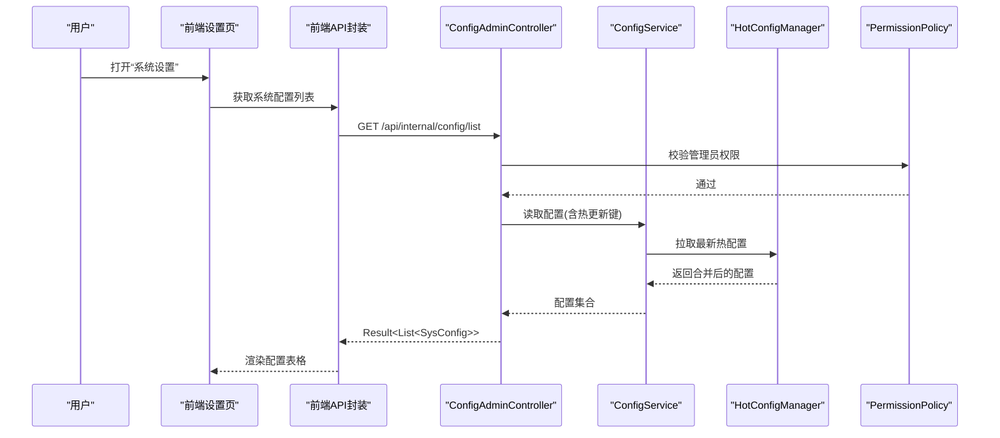
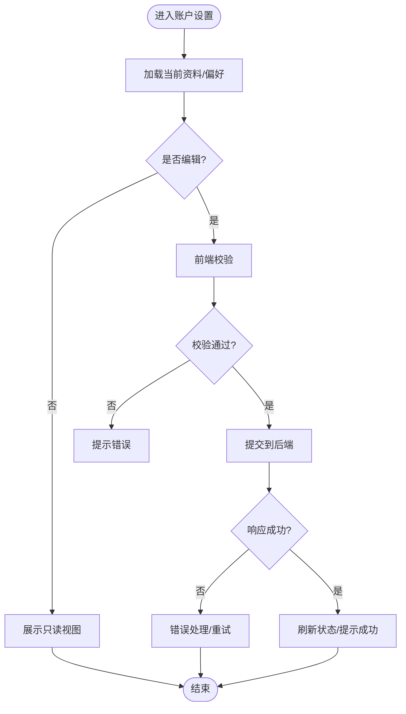
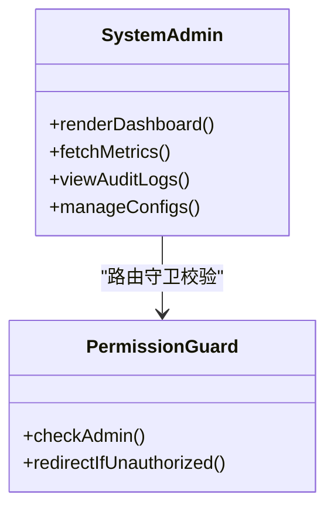
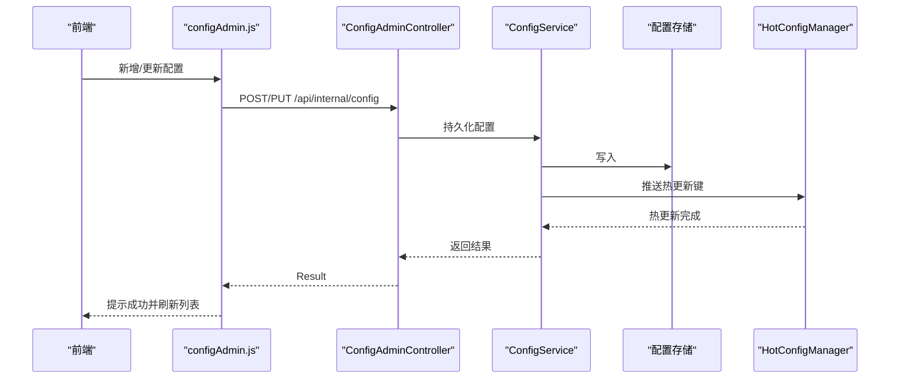
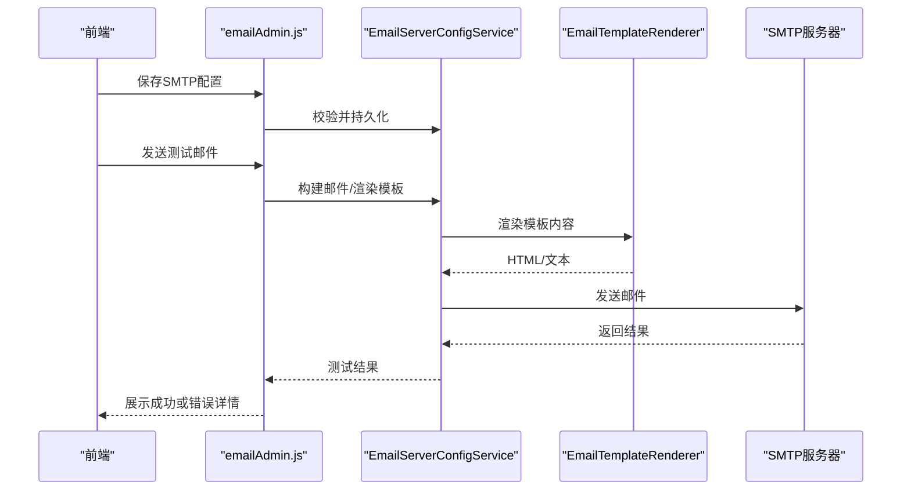
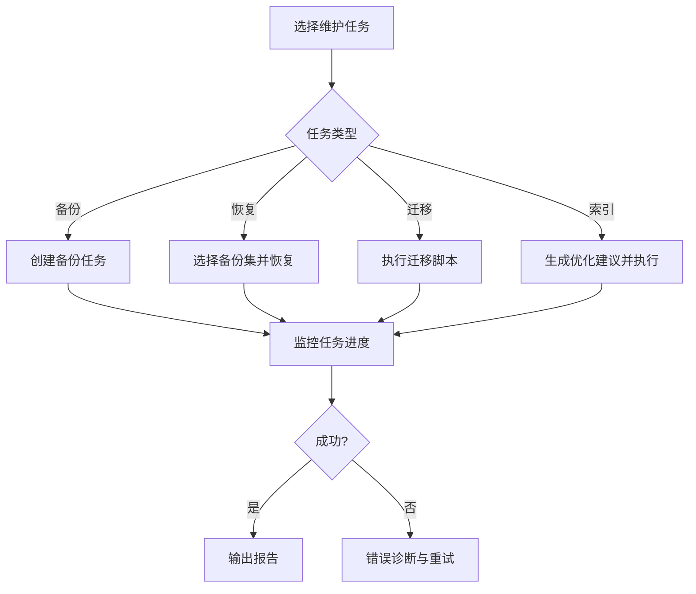
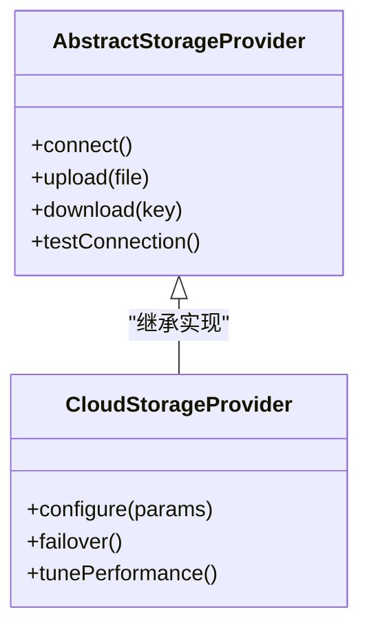
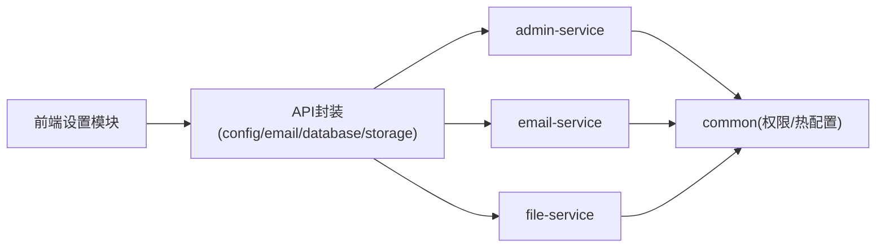

# 系统设置模块

<cite>
**本文引用的文件**   
- [ZXYZdatabaseFront/src/api/configAdmin.js](file://ZXYZdatabaseFront/src/api/configAdmin.js)
- [ZXYZdatabaseFront/src/api/emailAdmin.js](file://ZXYZdatabaseFront/src/api/emailAdmin.js)
- [ZXYZdatabaseFront/src/api/databaseAdmin.js](file://ZXYZdatabaseFront/src/api/databaseAdmin.js)
- [ZXYZdatabaseFront/src/api/storage.js](file://ZXYZdatabaseFront/src/api/storage.js)
- [ZXYZdatabaseFront/src/views/setting/index.vue](file://ZXYZdatabaseFront/src/views/setting/index.vue)
- [ZXYZdatabaseFront/src/views/setting/AccountSettings.vue](file://ZXYZdatabaseFront/src/views/setting/AccountSettings.vue)
- [ZXYZdatabaseFront/src/views/setting/SystemAdmin.vue](file://ZXYZdatabaseFront/src/views/setting/SystemAdmin.vue)
- [ZXYZdatabaseFront/src/views/setting/ConfigAdmin.vue](file://ZXYZdatabaseFront/src/views/setting/ConfigAdmin.vue)
- [ZXYZdatabaseFront/src/views/setting/StorageAdmin.vue](file://ZXYZdatabaseFront/src/views/setting/StorageAdmin.vue)
- [ZXYZdatabaseFront/src/views/setting/components/EmailServerPanel.vue](file://ZXYZdatabaseFront/src/views/setting/components/EmailServerPanel.vue)
- [ZXYZdatabaseFront/src/views/setting/components/DatabaseMaintenancePanel.vue](file://ZXYZdatabaseFront/src/views/setting/components/DatabaseMaintenancePanel.vue)
- [ZXYZdatabaseFront/src/composables/useProfileForm.js](file://ZXYZdatabaseFront/src/composables/useProfileForm.js)
- [ZXYZdatabaseFront/src/composables/usePasswordChange.js](file://ZXYZdatabaseFront/src/composables/usePasswordChange.js)
- [ZXYZdatabaseFront/src/composables/useContactVerification.js](file://ZXYZdatabaseFront/src/composables/useContactVerification.js)
- [ZXYZdatabaseFront/src/router/guards/permission.js](file://ZXYZdatabaseFront/src/router/guards/permission.js)
- [ZXYZdatabaseBack/zxyz-admin-service/src/main/java/uno/acloud/admin/controller/ConfigAdminController.java](file://ZXYZdatabaseBack/zxyz-admin-service/src/main/java/uno/acloud/admin/controller/ConfigAdminController.java)
- [ZXYZdatabaseBack/zxyz-admin-service/src/main/java/uno/acloud/admin/service/ConfigService.java](file://ZXYZdatabaseBack/zxyz-admin-service/src/main/java/uno/acloud/admin/service/ConfigService.java)
- [ZXYZdatabaseBack/zxyz-admin-service/src/main/java/uno/acloud/admin/domain/SysConfig.java](file://ZXYZdatabaseBack/zxyz-admin-service/src/main/java/uno/acloud/admin/domain/SysConfig.java)
- [ZXYZdatabaseBack/zxyz-email-service/src/main/java/uno/acloud/email/application/EmailServerConfigService.java](file://ZXYZdatabaseBack/zxyz-email-service/src/main/java/uno/acloud/email/application/EmailServerConfigService.java)
- [ZXYZdatabaseBack/zxyz-email-service/src/main/java/uno/acloud/email/application/EmailTemplateRenderer.java](file://ZXYZdatabaseBack/zxyz-email-service/src/main/java/uno/acloud/email/application/EmailTemplateRenderer.java)
- [ZXYZdatabaseBack/zxyz-file-service/src/main/java/uno/acloud/file/storage/provider/AbstractStorageProvider.java](file://ZXYZdatabaseBack/zxyz-file-service/src/main/java/uno/acloud/file/storage/provider/AbstractStorageProvider.java)
- [ZXYZdatabaseBack/zxyz-file-service/src/main/java/uno/acloud/file/storage/provider/CloudStorageProvider.java](file://ZXYZdatabaseBack/zxyz-file-service/src/main/java/uno/acloud/file/storage/provider/CloudStorageProvider.java)
- [ZXYZdatabaseBack/zxyz-common/src/main/java/uno/acloud/common/config/HotConfigManager.java](file://ZXYZdatabaseBack/zxyz-common/src/main/java/uno/acloud/common/config/HotConfigManager.java)
- [ZXYZdatabaseBack/zxyz-common/src/main/java/uno/acloud/common/permission/PermissionPolicy.java](file://ZXYZdatabaseBack/zxyz-common/src/main/java/uno/acloud/common/permission/PermissionPolicy.java)
</cite>

## 目录
1. [简介](#简介)
2. [项目结构](#项目结构)
3. [核心组件](#核心组件)
4. [架构总览](#架构总览)
5. [详细组件分析](#详细组件分析)
6. [依赖关系分析](#依赖关系分析)
7. [性能考量](#性能考量)
8. [故障排查指南](#故障排查指南)
9. [结论](#结论)
10. [附录：API调用示例](#附录api调用示例)

## 简介
本文件为 ZXYZ 前端“系统设置模块”的开发文档，聚焦以下能力：
- 账户设置：个人资料编辑、密码修改、联系方式绑定与安全偏好配置。
- 系统管理员界面：服务监控、配置管理、审计日志查看与性能分析。
- 邮件服务器配置面板：SMTP 设置、模板管理、发送测试与错误诊断。
- 数据库维护功能：备份恢复、数据迁移、索引优化与存储空间管理。
- 存储提供商配置：云存储服务设置、连接测试、性能调优与故障转移。
- API 调用示例：系统配置 CRUD、健康检查与监控指标获取。
- 权限控制策略：仅管理员可访问敏感配置。
- 配置热更新机制：运行时修改配置并最小化服务重启影响。

## 项目结构
前端设置模块由路由入口、页面视图、组件与 API 层组成，后端通过 admin-service、email-service、file-service 等提供能力，并通过 common 模块提供权限与热配置能力。

图表来源
- [ZXYZdatabaseFront/src/views/setting/index.vue](file://ZXYZdatabaseFront/src/views/setting/index.vue)
- [ZXYZdatabaseFront/src/views/setting/AccountSettings.vue](file://ZXYZdatabaseFront/src/views/setting/AccountSettings.vue)
- [ZXYZdatabaseFront/src/views/setting/SystemAdmin.vue](file://ZXYZdatabaseFront/src/views/setting/SystemAdmin.vue)
- [ZXYZdatabaseFront/src/views/setting/ConfigAdmin.vue](file://ZXYZdatabaseFront/src/views/setting/ConfigAdmin.vue)
- [ZXYZdatabaseFront/src/views/setting/StorageAdmin.vue](file://ZXYZdatabaseFront/src/views/setting/StorageAdmin.vue)
- [ZXYZdatabaseFront/src/views/setting/components/EmailServerPanel.vue](file://ZXYZdatabaseFront/src/views/setting/components/EmailServerPanel.vue)
- [ZXYZdatabaseFront/src/views/setting/components/DatabaseMaintenancePanel.vue](file://ZXYZdatabaseFront/src/views/setting/components/DatabaseMaintenancePanel.vue)
- [ZXYZdatabaseFront/src/api/configAdmin.js](file://ZXYZdatabaseFront/src/api/configAdmin.js)
- [ZXYZdatabaseFront/src/api/emailAdmin.js](file://ZXYZdatabaseFront/src/api/emailAdmin.js)
- [ZXYZdatabaseFront/src/api/databaseAdmin.js](file://ZXYZdatabaseFront/src/api/databaseAdmin.js)
- [ZXYZdatabaseFront/src/api/storage.js](file://ZXYZdatabaseFront/src/api/storage.js)
- [ZXYZdatabaseBack/zxyz-admin-service/src/main/java/uno/acloud/admin/controller/ConfigAdminController.java](file://ZXYZdatabaseBack/zxyz-admin-service/src/main/java/uno/acloud/admin/controller/ConfigAdminController.java)
- [ZXYZdatabaseBack/zxyz-admin-service/src/main/java/uno/acloud/admin/service/ConfigService.java](file://ZXYZdatabaseBack/zxyz-admin-service/src/main/java/uno/acloud/admin/service/ConfigService.java)
- [ZXYZdatabaseBack/zxyz-email-service/src/main/java/uno/acloud/email/application/EmailServerConfigService.java](file://ZXYZdatabaseBack/zxyz-email-service/src/main/java/uno/acloud/email/application/EmailServerConfigService.java)
- [ZXYZdatabaseBack/zxyz-file-service/src/main/java/uno/acloud/file/storage/provider/AbstractStorageProvider.java](file://ZXYZdatabaseBack/zxyz-file-service/src/main/java/uno/acloud/file/storage/provider/AbstractStorageProvider.java)
- [ZXYZdatabaseBack/zxyz-file-service/src/main/java/uno/acloud/file/storage/provider/CloudStorageProvider.java](file://ZXYZdatabaseBack/zxyz-file-service/src/main/java/uno/acloud/file/storage/provider/CloudStorageProvider.java)
- [ZXYZdatabaseBack/zxyz-common/src/main/java/uno/acloud/common/config/HotConfigManager.java](file://ZXYZdatabaseBack/zxyz-common/src/main/java/uno/acloud/common/config/HotConfigManager.java)
- [ZXYZdatabaseBack/zxyz-common/src/main/java/uno/acloud/common/permission/PermissionPolicy.java](file://ZXYZdatabaseBack/zxyz-common/src/main/java/uno/acloud/common/permission/PermissionPolicy.java)

章节来源
- [ZXYZdatabaseFront/src/views/setting/index.vue](file://ZXYZdatabaseFront/src/views/setting/index.vue)
- [ZXYZdatabaseFront/src/api/configAdmin.js](file://ZXYZdatabaseFront/src/api/configAdmin.js)
- [ZXYZdatabaseFront/src/api/emailAdmin.js](file://ZXYZdatabaseFront/src/api/emailAdmin.js)
- [ZXYZdatabaseFront/src/api/databaseAdmin.js](file://ZXYZdatabaseFront/src/api/databaseAdmin.js)
- [ZXYZdatabaseFront/src/api/storage.js](file://ZXYZdatabaseFront/src/api/storage.js)

## 核心组件
- 账户设置（AccountSettings）
  - 个人资料编辑：头像、昵称、签名等字段校验与提交。
  - 密码修改：旧密码校验、新密码强度规则、二次确认。
  - 联系方式绑定：邮箱/手机绑定与验证码流程。
  - 安全偏好：登录设备管理、会话超时、两步验证开关。
- 系统管理员（SystemAdmin）
  - 服务监控：各服务健康状态、关键指标展示。
  - 配置管理：系统配置项的增删改查与版本对比。
  - 审计日志：操作记录查询、过滤与导出。
  - 性能分析：慢请求、线程池、GC 等指标汇总。
- 邮件服务器配置（EmailServerPanel）
  - SMTP 参数配置：主机、端口、加密方式、认证信息。
  - 模板管理：模板变量、预览与发布。
  - 发送测试：单发/批量测试、失败重试与错误码映射。
  - 错误诊断：连接性检测、TLS/SSL 握手问题定位。
- 数据库维护（DatabaseMaintenancePanel）
  - 备份恢复：全量/增量备份、恢复演练与进度跟踪。
  - 数据迁移：脚本执行、回滚与一致性校验。
  - 索引优化：缺失索引建议、重建与统计更新。
  - 存储空间管理：表空间使用率、碎片整理建议。
- 存储提供商配置（StorageAdmin）
  - 云存储设置：S3/OSS/COS 等接入参数。
  - 连接测试：鉴权、读写权限、网络连通性。
  - 性能调优：分片大小、并发、缓存策略。
  - 故障转移：多区域/多桶切换与健康探测。

章节来源
- [ZXYZdatabaseFront/src/views/setting/AccountSettings.vue](file://ZXYZdatabaseFront/src/views/setting/AccountSettings.vue)
- [ZXYZdatabaseFront/src/views/setting/SystemAdmin.vue](file://ZXYZdatabaseFront/src/views/setting/SystemAdmin.vue)
- [ZXYZdatabaseFront/src/views/setting/ConfigAdmin.vue](file://ZXYZdatabaseFront/src/views/setting/ConfigAdmin.vue)
- [ZXYZdatabaseFront/src/views/setting/StorageAdmin.vue](file://ZXYZdatabaseFront/src/views/setting/StorageAdmin.vue)
- [ZXYZdatabaseFront/src/views/setting/components/EmailServerPanel.vue](file://ZXYZdatabaseFront/src/views/setting/components/EmailServerPanel.vue)
- [ZXYZdatabaseFront/src/views/setting/components/DatabaseMaintenancePanel.vue](file://ZXYZdatabaseFront/src/views/setting/components/DatabaseMaintenancePanel.vue)
- [ZXYZdatabaseFront/src/composables/useProfileForm.js](file://ZXYZdatabaseFront/src/composables/useProfileForm.js)
- [ZXYZdatabaseFront/src/composables/usePasswordChange.js](file://ZXYZdatabaseFront/src/composables/usePasswordChange.js)
- [ZXYZdatabaseFront/src/composables/useContactVerification.js](file://ZXYZdatabaseFront/src/composables/useContactVerification.js)

## 架构总览
前端通过统一的 API 层调用后端服务，后端以微服务拆分职责，公共能力下沉至 common 模块。

图表来源
- [ZXYZdatabaseFront/src/api/configAdmin.js](file://ZXYZdatabaseFront/src/api/configAdmin.js)
- [ZXYZdatabaseBack/zxyz-admin-service/src/main/java/uno/acloud/admin/controller/ConfigAdminController.java](file://ZXYZdatabaseBack/zxyz-admin-service/src/main/java/uno/acloud/admin/controller/ConfigAdminController.java)
- [ZXYZdatabaseBack/zxyz-admin-service/src/main/java/uno/acloud/admin/service/ConfigService.java](file://ZXYZdatabaseBack/zxyz-admin-service/src/main/java/uno/acloud/admin/service/ConfigService.java)
- [ZXYZdatabaseBack/zxyz-common/src/main/java/uno/acloud/common/config/HotConfigManager.java](file://ZXYZdatabaseBack/zxyz-common/src/main/java/uno/acloud/common/config/HotConfigManager.java)
- [ZXYZdatabaseBack/zxyz-common/src/main/java/uno/acloud/common/permission/PermissionPolicy.java](file://ZXYZdatabaseBack/zxyz-common/src/main/java/uno/acloud/common/permission/PermissionPolicy.java)

## 详细组件分析

### 账户设置（AccountSettings）
- 功能要点
  - 个人资料表单：字段校验、图片上传、本地草稿与自动保存。
  - 密码修改：复杂度校验、历史密码去重、强制过期策略。
  - 联系方式绑定：验证码倒计时、防刷限制、绑定解绑审计。
  - 安全偏好：会话时长、登录IP白名单、设备信任管理。
- 交互流程
  - 表单初始化 → 本地校验 → 提交后端 → 统一结果处理 → 提示与刷新。
- 关键实现位置
  - 表单逻辑：useProfileForm、usePasswordChange、useContactVerification。
  - 页面视图：AccountSettings.vue。

章节来源
- [ZXYZdatabaseFront/src/views/setting/AccountSettings.vue](file://ZXYZdatabaseFront/src/views/setting/AccountSettings.vue)
- [ZXYZdatabaseFront/src/composables/useProfileForm.js](file://ZXYZdatabaseFront/src/composables/useProfileForm.js)
- [ZXYZdatabaseFront/src/composables/usePasswordChange.js](file://ZXYZdatabaseFront/src/composables/usePasswordChange.js)
- [ZXYZdatabaseFront/src/composables/useContactVerification.js](file://ZXYZdatabaseFront/src/composables/useContactVerification.js)

### 系统管理员（SystemAdmin）
- 功能要点
  - 服务监控：健康检查、延迟、错误率、资源使用。
  - 配置管理：配置项CRUD、灰度发布、变更审批。
  - 审计日志：操作前后值对比、消息去重、归档清理。
  - 性能分析：慢查询、线程池、内存与GC趋势。
- 权限控制
  - 路由守卫与接口级权限双重校验，仅管理员可访问。
- 关键实现位置
  - 页面视图：SystemAdmin.vue。
  - 权限守卫：router/guards/permission.js。

图表来源
- [ZXYZdatabaseFront/src/views/setting/SystemAdmin.vue](file://ZXYZdatabaseFront/src/views/setting/SystemAdmin.vue)
- [ZXYZdatabaseFront/src/router/guards/permission.js](file://ZXYZdatabaseFront/src/router/guards/permission.js)

章节来源
- [ZXYZdatabaseFront/src/views/setting/SystemAdmin.vue](file://ZXYZdatabaseFront/src/views/setting/SystemAdmin.vue)
- [ZXYZdatabaseFront/src/router/guards/permission.js](file://ZXYZdatabaseFront/src/router/guards/permission.js)

### 配置管理（ConfigAdmin）
- 功能要点
  - 配置项CRUD：分组、键值对、描述、生效范围。
  - 热更新：标记热键，运行时刷新，避免重启。
  - 审计追踪：变更记录、操作人、时间戳。
- 关键实现位置
  - 页面视图：ConfigAdmin.vue。
  - API 封装：configAdmin.js。
  - 后端控制器与服务：ConfigAdminController、ConfigService。
  - 领域模型：SysConfig。

图表来源
- [ZXYZdatabaseFront/src/api/configAdmin.js](file://ZXYZdatabaseFront/src/api/configAdmin.js)
- [ZXYZdatabaseBack/zxyz-admin-service/src/main/java/uno/acloud/admin/controller/ConfigAdminController.java](file://ZXYZdatabaseBack/zxyz-admin-service/src/main/java/uno/acloud/admin/controller/ConfigAdminController.java)
- [ZXYZdatabaseBack/zxyz-admin-service/src/main/java/uno/acloud/admin/service/ConfigService.java](file://ZXYZdatabaseBack/zxyz-admin-service/src/main/java/uno/acloud/admin/service/ConfigService.java)
- [ZXYZdatabaseBack/zxyz-admin-service/src/main/java/uno/acloud/admin/domain/SysConfig.java](file://ZXYZdatabaseBack/zxyz-admin-service/src/main/java/uno/acloud/admin/domain/SysConfig.java)
- [ZXYZdatabaseBack/zxyz-common/src/main/java/uno/acloud/common/config/HotConfigManager.java](file://ZXYZdatabaseBack/zxyz-common/src/main/java/uno/acloud/common/config/HotConfigManager.java)

章节来源
- [ZXYZdatabaseFront/src/views/setting/ConfigAdmin.vue](file://ZXYZdatabaseFront/src/views/setting/ConfigAdmin.vue)
- [ZXYZdatabaseFront/src/api/configAdmin.js](file://ZXYZdatabaseFront/src/api/configAdmin.js)
- [ZXYZdatabaseBack/zxyz-admin-service/src/main/java/uno/acloud/admin/controller/ConfigAdminController.java](file://ZXYZdatabaseBack/zxyz-admin-service/src/main/java/uno/acloud/admin/controller/ConfigAdminController.java)
- [ZXYZdatabaseBack/zxyz-admin-service/src/main/java/uno/acloud/admin/service/ConfigService.java](file://ZXYZdatabaseBack/zxyz-admin-service/src/main/java/uno/acloud/admin/service/ConfigService.java)
- [ZXYZdatabaseBack/zxyz-admin-service/src/main/java/uno/acloud/admin/domain/SysConfig.java](file://ZXYZdatabaseBack/zxyz-admin-service/src/main/java/uno/acloud/admin/domain/SysConfig.java)
- [ZXYZdatabaseBack/zxyz-common/src/main/java/uno/acloud/common/config/HotConfigManager.java](file://ZXYZdatabaseBack/zxyz-common/src/main/java/uno/acloud/common/config/HotConfigManager.java)

### 邮件服务器配置（EmailServerPanel）
- 功能要点
  - SMTP 设置：主机、端口、加密、认证、连接池。
  - 模板管理：变量替换、预览、版本发布。
  - 发送测试：单发/批量、失败重试、错误码映射。
  - 错误诊断：连接性检测、TLS/SSL 握手、限流与退避。
- 关键实现位置
  - 页面组件：EmailServerPanel.vue。
  - API 封装：emailAdmin.js。
  - 后端应用服务：EmailServerConfigService、EmailTemplateRenderer。

图表来源
- [ZXYZdatabaseFront/src/views/setting/components/EmailServerPanel.vue](file://ZXYZdatabaseFront/src/views/setting/components/EmailServerPanel.vue)
- [ZXYZdatabaseFront/src/api/emailAdmin.js](file://ZXYZdatabaseFront/src/api/emailAdmin.js)
- [ZXYZdatabaseBack/zxyz-email-service/src/main/java/uno/acloud/email/application/EmailServerConfigService.java](file://ZXYZdatabaseBack/zxyz-email-service/src/main/java/uno/acloud/email/application/EmailServerConfigService.java)
- [ZXYZdatabaseBack/zxyz-email-service/src/main/java/uno/acloud/email/application/EmailTemplateRenderer.java](file://ZXYZdatabaseBack/zxyz-email-service/src/main/java/uno/acloud/email/application/EmailTemplateRenderer.java)

章节来源
- [ZXYZdatabaseFront/src/views/setting/components/EmailServerPanel.vue](file://ZXYZdatabaseFront/src/views/setting/components/EmailServerPanel.vue)
- [ZXYZdatabaseFront/src/api/emailAdmin.js](file://ZXYZdatabaseFront/src/api/emailAdmin.js)
- [ZXYZdatabaseBack/zxyz-email-service/src/main/java/uno/acloud/email/application/EmailServerConfigService.java](file://ZXYZdatabaseBack/zxyz-email-service/src/main/java/uno/acloud/email/application/EmailServerConfigService.java)
- [ZXYZdatabaseBack/zxyz-email-service/src/main/java/uno/acloud/email/application/EmailTemplateRenderer.java](file://ZXYZdatabaseBack/zxyz-email-service/src/main/java/uno/acloud/email/application/EmailTemplateRenderer.java)

### 数据库维护（DatabaseMaintenancePanel）
- 功能要点
  - 备份恢复：触发备份、查看任务、恢复演练。
  - 数据迁移：执行脚本、回滚、一致性校验。
  - 索引优化：建议生成、重建、统计更新。
  - 存储空间：表空间使用率、碎片整理建议。
- 关键实现位置
  - 页面组件：DatabaseMaintenancePanel.vue。
  - API 封装：databaseAdmin.js。

章节来源
- [ZXYZdatabaseFront/src/views/setting/components/DatabaseMaintenancePanel.vue](file://ZXYZdatabaseFront/src/views/setting/components/DatabaseMaintenancePanel.vue)
- [ZXYZdatabaseFront/src/api/databaseAdmin.js](file://ZXYZdatabaseFront/src/api/databaseAdmin.js)

### 存储提供商配置（StorageAdmin）
- 功能要点
  - 云存储设置：接入参数、密钥、Bucket/容器名。
  - 连接测试：鉴权、读写权限、网络连通性。
  - 性能调优：分片大小、并发、缓存策略。
  - 故障转移：多区域/多桶切换、健康探测。
- 关键实现位置
  - 页面视图：StorageAdmin.vue。
  - API 封装：storage.js。
  - 后端存储抽象与实现：AbstractStorageProvider、CloudStorageProvider。

图表来源
- [ZXYZdatabaseFront/src/views/setting/StorageAdmin.vue](file://ZXYZdatabaseFront/src/views/setting/StorageAdmin.vue)
- [ZXYZdatabaseFront/src/api/storage.js](file://ZXYZdatabaseFront/src/api/storage.js)
- [ZXYZdatabaseBack/zxyz-file-service/src/main/java/uno/acloud/file/storage/provider/AbstractStorageProvider.java](file://ZXYZdatabaseBack/zxyz-file-service/src/main/java/uno/acloud/file/storage/provider/AbstractStorageProvider.java)
- [ZXYZdatabaseBack/zxyz-file-service/src/main/java/uno/acloud/file/storage/provider/CloudStorageProvider.java](file://ZXYZdatabaseBack/zxyz-file-service/src/main/java/uno/acloud/file/storage/provider/CloudStorageProvider.java)

章节来源
- [ZXYZdatabaseFront/src/views/setting/StorageAdmin.vue](file://ZXYZdatabaseFront/src/views/setting/StorageAdmin.vue)
- [ZXYZdatabaseFront/src/api/storage.js](file://ZXYZdatabaseFront/src/api/storage.js)
- [ZXYZdatabaseBack/zxyz-file-service/src/main/java/uno/acloud/file/storage/provider/AbstractStorageProvider.java](file://ZXYZdatabaseBack/zxyz-file-service/src/main/java/uno/acloud/file/storage/provider/AbstractStorageProvider.java)
- [ZXYZdatabaseBack/zxyz-file-service/src/main/java/uno/acloud/file/storage/provider/CloudStorageProvider.java](file://ZXYZdatabaseBack/zxyz-file-service/src/main/java/uno/acloud/file/storage/provider/CloudStorageProvider.java)

### 权限控制策略
- 前端路由守卫：仅管理员角色可进入设置相关页面。
- 后端接口级权限：内部端点需携带 X-Internal-Service-Token，并由 SaToken 过滤器拒绝公网访问；业务层通过 PermissionPolicy 校验管理员权限。
- 热配置访问：敏感键需额外校验，避免越权读取。

章节来源
- [ZXYZdatabaseFront/src/router/guards/permission.js](file://ZXYZdatabaseFront/src/router/guards/permission.js)
- [ZXYZdatabaseBack/zxyz-common/src/main/java/uno/acloud/common/permission/PermissionPolicy.java](file://ZXYZdatabaseBack/zxyz-common/src/main/java/uno/acloud/common/permission/PermissionPolicy.java)

## 依赖关系分析
- 前端依赖
  - 视图组件依赖对应 API 封装，API 封装依赖统一请求工具与错误处理。
  - composables 复用表单、校验、验证码等通用逻辑。
- 后端依赖
  - admin-service 提供配置管理与审计，依赖 common 的权限与热配置。
  - email-service 提供邮件配置与模板渲染。
  - file-service 提供存储抽象与云存储实现。
- 外部依赖
  - Nacos 配置中心、RabbitMQ 异步事件、Redis 会话与缓存。

图表来源
- [ZXYZdatabaseFront/src/api/configAdmin.js](file://ZXYZdatabaseFront/src/api/configAdmin.js)
- [ZXYZdatabaseFront/src/api/emailAdmin.js](file://ZXYZdatabaseFront/src/api/emailAdmin.js)
- [ZXYZdatabaseFront/src/api/databaseAdmin.js](file://ZXYZdatabaseFront/src/api/databaseAdmin.js)
- [ZXYZdatabaseFront/src/api/storage.js](file://ZXYZdatabaseFront/src/api/storage.js)
- [ZXYZdatabaseBack/zxyz-admin-service/src/main/java/uno/acloud/admin/controller/ConfigAdminController.java](file://ZXYZdatabaseBack/zxyz-admin-service/src/main/java/uno/acloud/admin/controller/ConfigAdminController.java)
- [ZXYZdatabaseBack/zxyz-email-service/src/main/java/uno/acloud/email/application/EmailServerConfigService.java](file://ZXYZdatabaseBack/zxyz-email-service/src/main/java/uno/acloud/email/application/EmailServerConfigService.java)
- [ZXYZdatabaseBack/zxyz-file-service/src/main/java/uno/acloud/file/storage/provider/AbstractStorageProvider.java](file://ZXYZdatabaseBack/zxyz-file-service/src/main/java/uno/acloud/file/storage/provider/AbstractStorageProvider.java)
- [ZXYZdatabaseBack/zxyz-common/src/main/java/uno/acloud/common/config/HotConfigManager.java](file://ZXYZdatabaseBack/zxyz-common/src/main/java/uno/acloud/common/config/HotConfigManager.java)
- [ZXYZdatabaseBack/zxyz-common/src/main/java/uno/acloud/common/permission/PermissionPolicy.java](file://ZXYZdatabaseBack/zxyz-common/src/main/java/uno/acloud/common/permission/PermissionPolicy.java)

章节来源
- [ZXYZdatabaseFront/src/api/configAdmin.js](file://ZXYZdatabaseFront/src/api/configAdmin.js)
- [ZXYZdatabaseFront/src/api/emailAdmin.js](file://ZXYZdatabaseFront/src/api/emailAdmin.js)
- [ZXYZdatabaseFront/src/api/databaseAdmin.js](file://ZXYZdatabaseFront/src/api/databaseAdmin.js)
- [ZXYZdatabaseFront/src/api/storage.js](file://ZXYZdatabaseFront/src/api/storage.js)

## 性能考量
- 前端
  - 表单防抖与节流，减少频繁提交。
  - 大列表虚拟滚动与分页加载。
  - 图片上传断点续传与并发控制。
- 后端
  - 配置热更新避免重启，降低抖动。
  - 邮件发送异步化与重试队列。
  - 存储连接池与超时控制，故障快速切换。
  - 审计日志缓冲与批量落库，降低IO压力。

## 故障排查指南
- 常见问题
  - 权限不足：检查前端路由守卫与后端权限策略。
  - 配置未生效：确认是否为热更新键，检查 HotConfigManager 推送状态。
  - 邮件发送失败：核对SMTP参数、TLS/SSL、账号权限与限流。
  - 存储连接失败：检查密钥、网络连通性与Bucket权限。
  - 数据库维护任务失败：查看任务日志、磁盘空间与锁等待。
- 定位方法
  - 前端：浏览器控制台、网络请求、错误上报。
  - 后端：服务日志、链路追踪、指标监控。
  - 基础设施：Nacos配置、RabbitMQ队列堆积、Redis命中率。

## 结论
系统设置模块以清晰的前后端分层与职责划分，实现了账户、系统管理、邮件、数据库与存储等多维度配置能力。通过权限控制与热更新机制，在保证安全性的同时提升了运维效率。建议在后续迭代中完善错误诊断可视化与自动化运维脚本，进一步提升稳定性与可观测性。

## 附录：API调用示例
以下为典型调用路径与说明（实际字段以接口契约为准）：
- 系统配置CRUD
  - 获取配置列表：GET /api/internal/config/list
  - 新增配置：POST /api/internal/config
  - 更新配置：PUT /api/internal/config/{id}
  - 删除配置：DELETE /api/internal/config/{id}
- 健康检查
  - 服务健康：GET /api/internal/health
- 监控指标
  - 获取指标：GET /api/internal/metrics
- 邮件测试
  - 保存SMTP配置：POST /api/internal/email/server
  - 发送测试邮件：POST /api/internal/email/test
- 存储连接测试
  - 保存存储配置：POST /api/internal/storage/provider
  - 连接测试：POST /api/internal/storage/test

注意：
- 所有内部端点需通过网关转发并携带内部令牌，SaToken 过滤器会拒绝公网直接访问。
- 响应体统一为 Result<T>，code=1 表示成功。

章节来源
- [ZXYZdatabaseFront/src/api/configAdmin.js](file://ZXYZdatabaseFront/src/api/configAdmin.js)
- [ZXYZdatabaseFront/src/api/emailAdmin.js](file://ZXYZdatabaseFront/src/api/emailAdmin.js)
- [ZXYZdatabaseFront/src/api/databaseAdmin.js](file://ZXYZdatabaseFront/src/api/databaseAdmin.js)
- [ZXYZdatabaseFront/src/api/storage.js](file://ZXYZdatabaseFront/src/api/storage.js)
- [ZXYZdatabaseBack/zxyz-admin-service/src/main/java/uno/acloud/admin/controller/ConfigAdminController.java](file://ZXYZdatabaseBack/zxyz-admin-service/src/main/java/uno/acloud/admin/controller/ConfigAdminController.java)