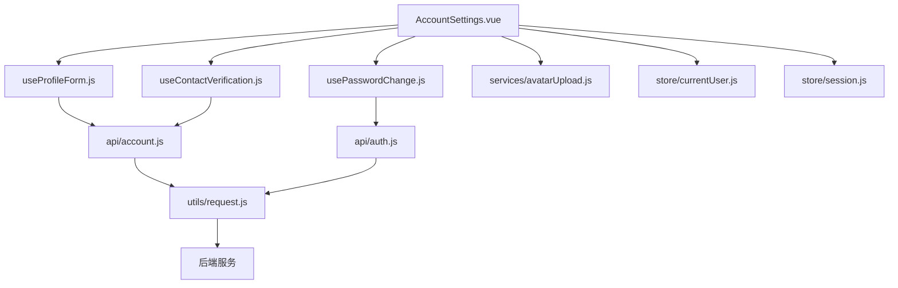
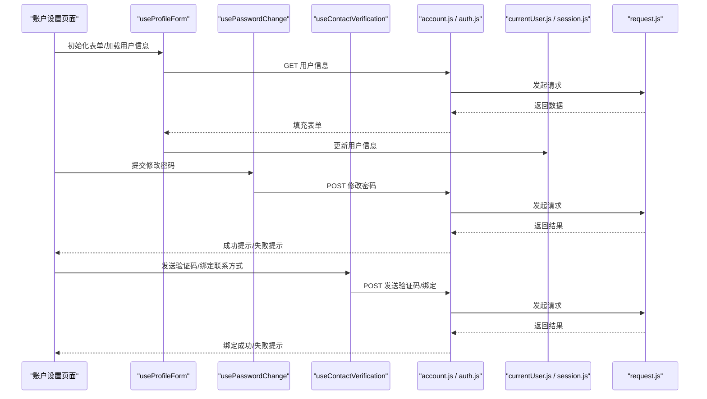
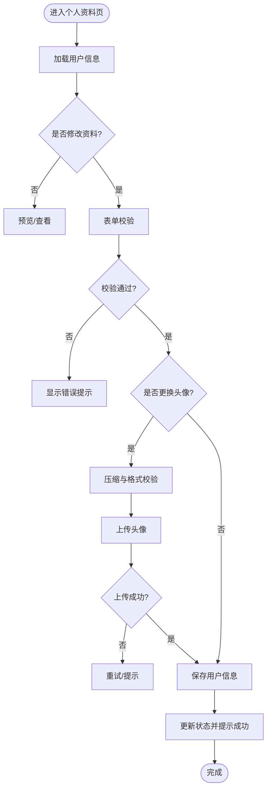
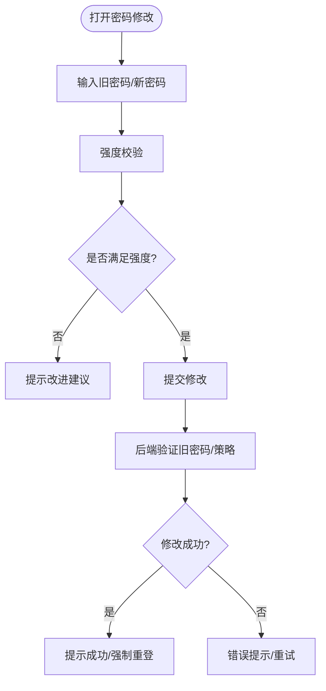
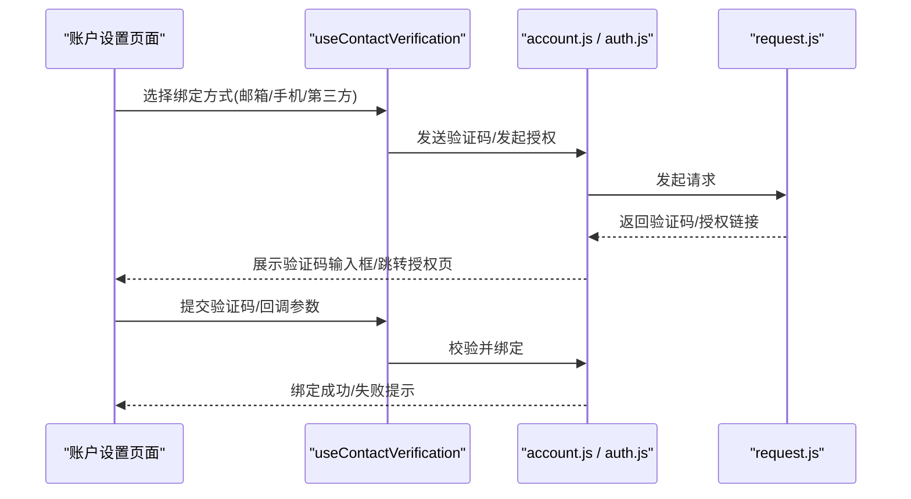
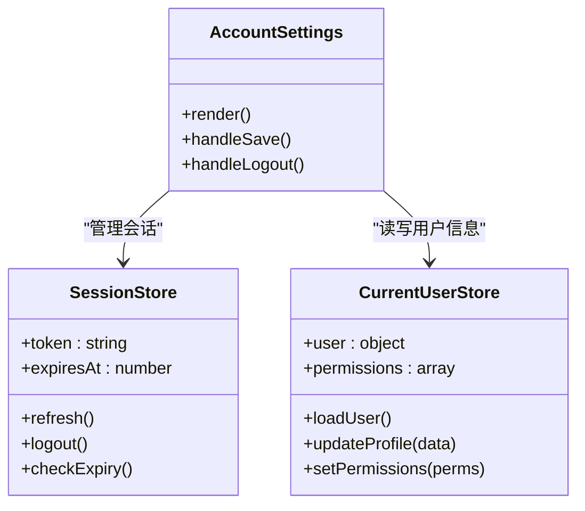
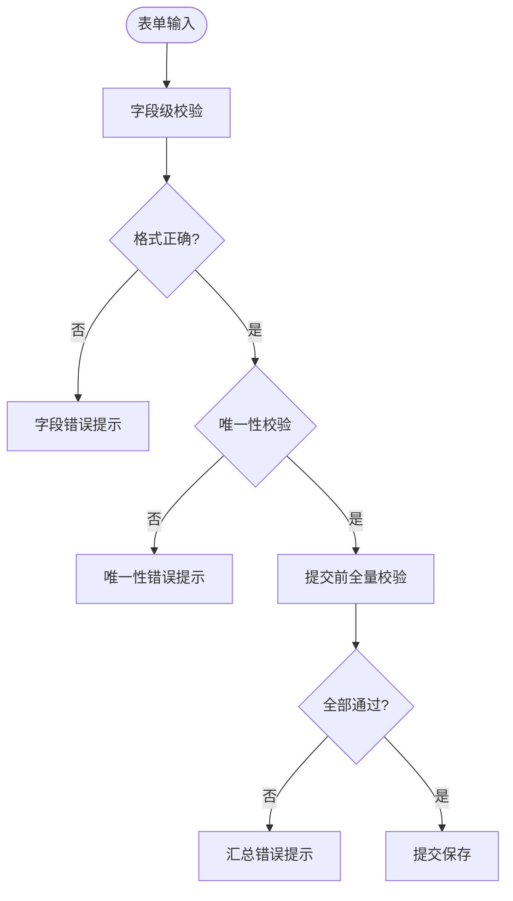
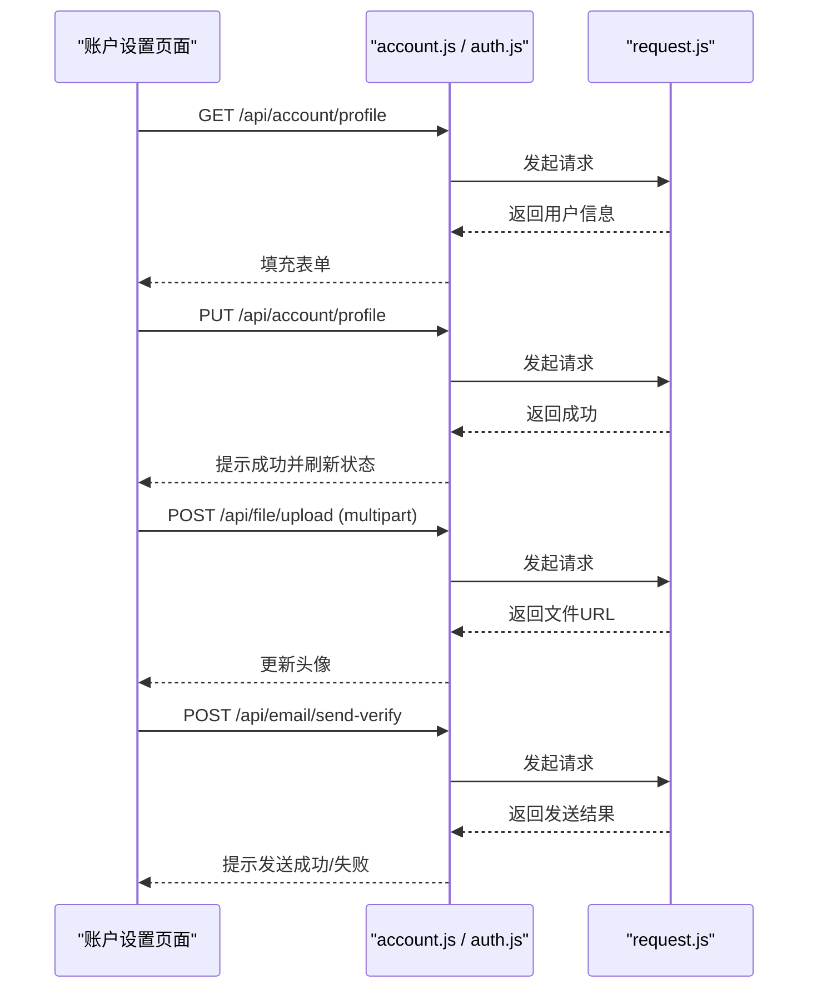
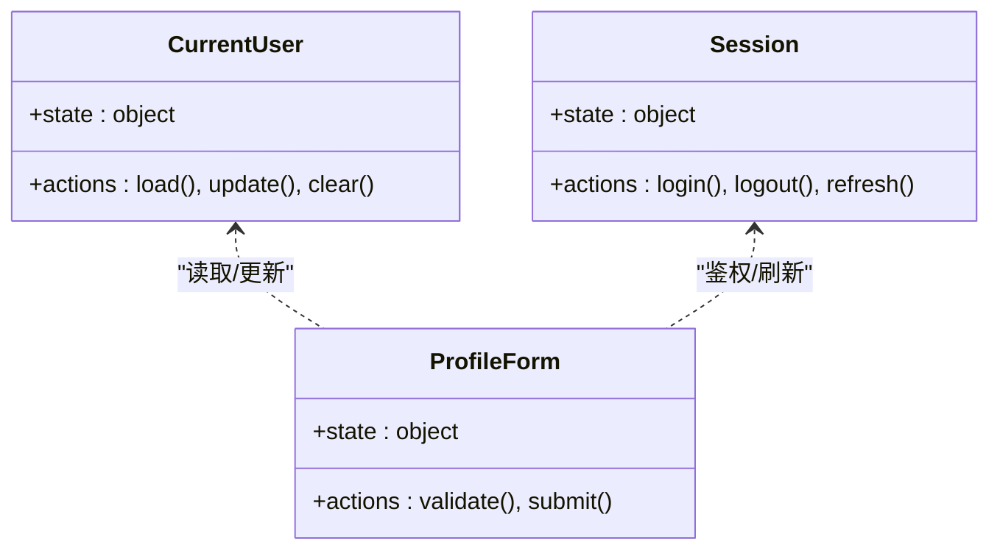
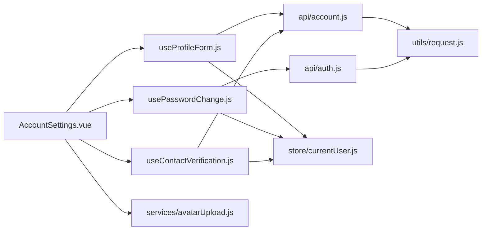

# 账户设置

<cite>
**本文引用的文件**   
- [ZXYZdatabaseFront/src/views/setting/AccountSettings.vue](file://ZXYZdatabaseFront/src/views/setting/AccountSettings.vue)
- [ZXYZdatabaseFront/src/composables/useProfileForm.js](file://ZXYZdatabaseFront/src/composables/useProfileForm.js)
- [ZXYZdatabaseFront/src/composables/usePasswordChange.js](file://ZXYZdatabaseFront/src/composables/usePasswordChange.js)
- [ZXYZdatabaseFront/src/composables/useContactVerification.js](file://ZXYZdatabaseFront/src/composables/useContactVerification.js)
- [ZXYZdatabaseFront/src/api/account.js](file://ZXYZdatabaseFront/src/api/account.js)
- [ZXYZdatabaseFront/src/api/auth.js](file://ZXYZdatabaseFront/src/api/auth.js)
- [ZXYZdatabaseFront/src/services/avatarUpload.js](file://ZXYZdatabaseFront/src/services/avatarUpload.js)
- [ZXYZdatabaseFront/src/store/currentUser.js](file://ZXYZdatabaseFront/src/store/currentUser.js)
- [ZXYZdatabaseFront/src/store/session.js](file://ZXYZdatabaseFront/src/store/session.js)
- [ZXYZdatabaseFront/src/utils/request.js](file://ZXYZdatabaseFront/src/utils/request.js)
- [ZXYZdatabaseFront/src/utils/error.js](file://ZXYZdatabaseFront/src/utils/error.js)
- [ZXYZdatabaseBack/ZXYZdatabaseFront/src/api/user.js](file://ZXYZdatabaseBack/ZXYZdatabaseFront/src/api/user.js)
</cite>

## 目录
1. [简介](#简介)
2. [项目结构](#项目结构)
3. [核心组件](#核心组件)
4. [架构总览](#架构总览)
5. [详细组件分析](#详细组件分析)
6. [依赖分析](#依赖分析)
7. [性能考虑](#性能考虑)
8. [故障排查指南](#故障排查指南)
9. [结论](#结论)
10. [附录](#附录)

## 简介
本文件面向 ZXYZ 前端“账户设置”功能的开发文档，聚焦以下能力：
- 个人资料编辑：用户信息修改、头像上传、联系方式绑定与个人偏好配置
- 密码管理：密码修改、强度校验与安全提示
- 联系方式绑定：邮箱绑定、手机号绑定与第三方账号关联
- 安全偏好：登录安全设置、会话管理与权限控制
- 表单验证规则：字段校验、错误提示与用户反馈机制
- API 调用示例：用户信息 CRUD、头像上传流程、验证码发送
- 状态管理：基于 Pinia 的用户信息与表单状态管理

## 项目结构
账户设置相关的前端代码主要位于以下目录：
- 视图层：views/setting/AccountSettings.vue
- 组合式逻辑：composables/useProfileForm.js、usePasswordChange.js、useContactVerification.js
- API 层：api/account.js、api/auth.js
- 服务层：services/avatarUpload.js
- 状态管理：store/currentUser.js、store/session.js
- 工具与请求封装：utils/request.js、utils/error.js

图表来源
- [ZXYZdatabaseFront/src/views/setting/AccountSettings.vue](file://ZXYZdatabaseFront/src/views/setting/AccountSettings.vue)
- [ZXYZdatabaseFront/src/composables/useProfileForm.js](file://ZXYZdatabaseFront/src/composables/useProfileForm.js)
- [ZXYZdatabaseFront/src/composables/usePasswordChange.js](file://ZXYZdatabaseFront/src/composables/usePasswordChange.js)
- [ZXYZdatabaseFront/src/composables/useContactVerification.js](file://ZXYZdatabaseFront/src/composables/useContactVerification.js)
- [ZXYZdatabaseFront/src/api/account.js](file://ZXYZdatabaseFront/src/api/account.js)
- [ZXYZdatabaseFront/src/api/auth.js](file://ZXYZdatabaseFront/src/api/auth.js)
- [ZXYZdatabaseFront/src/services/avatarUpload.js](file://ZXYZdatabaseFront/src/services/avatarUpload.js)
- [ZXYZdatabaseFront/src/store/currentUser.js](file://ZXYZdatabaseFront/src/store/currentUser.js)
- [ZXYZdatabaseFront/src/store/session.js](file://ZXYZdatabaseFront/src/store/session.js)
- [ZXYZdatabaseFront/src/utils/request.js](file://ZXYZdatabaseFront/src/utils/request.js)

章节来源
- [ZXYZdatabaseFront/src/views/setting/AccountSettings.vue](file://ZXYZdatabaseFront/src/views/setting/AccountSettings.vue)
- [ZXYZdatabaseFront/src/composables/useProfileForm.js](file://ZXYZdatabaseFront/src/composables/useProfileForm.js)
- [ZXYZdatabaseFront/src/composables/usePasswordChange.js](file://ZXYZdatabaseFront/src/composables/usePasswordChange.js)
- [ZXYZdatabaseFront/src/composables/useContactVerification.js](file://ZXYZdatabaseFront/src/composables/useContactVerification.js)
- [ZXYZdatabaseFront/src/api/account.js](file://ZXYZdatabaseFront/src/api/account.js)
- [ZXYZdatabaseFront/src/api/auth.js](file://ZXYZdatabaseFront/src/api/auth.js)
- [ZXYZdatabaseFront/src/services/avatarUpload.js](file://ZXYZdatabaseFront/src/services/avatarUpload.js)
- [ZXYZdatabaseFront/src/store/currentUser.js](file://ZXYZdatabaseFront/src/store/currentUser.js)
- [ZXYZdatabaseFront/src/store/session.js](file://ZXYZdatabaseFront/src/store/session.js)
- [ZXYZdatabaseFront/src/utils/request.js](file://ZXYZdatabaseFront/src/utils/request.js)

## 核心组件
- 账户设置页面（AccountSettings.vue）
  - 负责展示个人资料、密码管理、联系方式绑定、安全偏好等模块
  - 通过组合式函数组织业务逻辑，调用 API 并更新 Pinia 状态
- 个人资料表单（useProfileForm.js）
  - 维护用户基本信息与偏好配置的状态与校验
  - 提供保存、重置、预览头像等功能
- 密码管理（usePasswordChange.js）
  - 实现密码修改流程、强度校验与安全提示
- 联系方式绑定（useContactVerification.js）
  - 实现邮箱/手机绑定、验证码发送与校验
- 头像上传（services/avatarUpload.js）
  - 封装文件选择、压缩、上传进度与结果处理
- 状态管理（store/currentUser.js、store/session.js）
  - 存储当前用户信息、会话令牌与权限数据
- 请求与错误处理（utils/request.js、utils/error.js）
  - 统一 HTTP 请求封装、拦截器、错误归一化与提示

章节来源
- [ZXYZdatabaseFront/src/views/setting/AccountSettings.vue](file://ZXYZdatabaseFront/src/views/setting/AccountSettings.vue)
- [ZXYZdatabaseFront/src/composables/useProfileForm.js](file://ZXYZdatabaseFront/src/composables/useProfileForm.js)
- [ZXYZdatabaseFront/src/composables/usePasswordChange.js](file://ZXYZdatabaseFront/src/composables/usePasswordChange.js)
- [ZXYZdatabaseFront/src/composables/useContactVerification.js](file://ZXYZdatabaseFront/src/composables/useContactVerification.js)
- [ZXYZdatabaseFront/src/services/avatarUpload.js](file://ZXYZdatabaseFront/src/services/avatarUpload.js)
- [ZXYZdatabaseFront/src/store/currentUser.js](file://ZXYZdatabaseFront/src/store/currentUser.js)
- [ZXYZdatabaseFront/src/store/session.js](file://ZXYZdatabaseFront/src/store/session.js)
- [ZXYZdatabaseFront/src/utils/request.js](file://ZXYZdatabaseFront/src/utils/request.js)
- [ZXYZdatabaseFront/src/utils/error.js](file://ZXYZdatabaseFront/src/utils/error.js)

## 架构总览
账户设置功能采用“视图 + 组合式逻辑 + API 服务 + 状态管理”的分层模式。页面仅负责渲染与交互编排，具体业务逻辑下沉到 composables；API 调用集中在 api/* 模块；状态由 Pinia store 统一管理；HTTP 请求通过 utils/request.js 统一封装。

图表来源
- [ZXYZdatabaseFront/src/views/setting/AccountSettings.vue](file://ZXYZdatabaseFront/src/views/setting/AccountSettings.vue)
- [ZXYZdatabaseFront/src/composables/useProfileForm.js](file://ZXYZdatabaseFront/src/composables/useProfileForm.js)
- [ZXYZdatabaseFront/src/composables/usePasswordChange.js](file://ZXYZdatabaseFront/src/composables/usePasswordChange.js)
- [ZXYZdatabaseFront/src/composables/useContactVerification.js](file://ZXYZdatabaseFront/src/composables/useContactVerification.js)
- [ZXYZdatabaseFront/src/api/account.js](file://ZXYZdatabaseFront/src/api/account.js)
- [ZXYZdatabaseFront/src/api/auth.js](file://ZXYZdatabaseFront/src/api/auth.js)
- [ZXYZdatabaseFront/src/store/currentUser.js](file://ZXYZdatabaseFront/src/store/currentUser.js)
- [ZXYZdatabaseFront/src/store/session.js](file://ZXYZdatabaseFront/src/store/session.js)
- [ZXYZdatabaseFront/src/utils/request.js](file://ZXYZdatabaseFront/src/utils/request.js)

## 详细组件分析

### 个人资料编辑（用户信息修改、头像上传、联系方式绑定、个人偏好）
- 用户信息修改
  - 表单字段包括昵称、性别、生日、地区、签名等
  - 支持实时校验与失焦校验，错误提示即时显示
  - 保存时合并变更并提交至后端，成功后刷新本地状态
- 头像上传
  - 支持拖拽与点击选择，自动压缩与格式校验
  - 上传过程显示进度条与占位图，完成后更新头像 URL
  - 失败重试与错误提示
- 联系方式绑定
  - 邮箱/手机号绑定前需发送验证码，验证码有效期与次数限制
  - 绑定成功后同步至用户信息并更新界面
- 个人偏好配置
  - 主题、语言、通知开关等
  - 偏好变更即时生效或下次登录生效（根据后端策略）

图表来源
- [ZXYZdatabaseFront/src/composables/useProfileForm.js](file://ZXYZdatabaseFront/src/composables/useProfileForm.js)
- [ZXYZdatabaseFront/src/services/avatarUpload.js](file://ZXYZdatabaseFront/src/services/avatarUpload.js)
- [ZXYZdatabaseFront/src/api/account.js](file://ZXYZdatabaseFront/src/api/account.js)

章节来源
- [ZXYZdatabaseFront/src/composables/useProfileForm.js](file://ZXYZdatabaseFront/src/composables/useProfileForm.js)
- [ZXYZdatabaseFront/src/services/avatarUpload.js](file://ZXYZdatabaseFront/src/services/avatarUpload.js)
- [ZXYZdatabaseFront/src/api/account.js](file://ZXYZdatabaseFront/src/api/account.js)

### 密码管理（密码修改、强度验证、安全性检查）
- 密码修改流程
  - 输入旧密码与新密码，必要时二次确认
  - 前端进行强度校验（长度、复杂度、常见弱口令检测）
  - 提交后若成功则提示并要求重新登录（视安全策略）
- 强度验证规则
  - 最小长度、大小写字母、数字、特殊字符要求
  - 禁止与用户名/邮箱相同或包含连续/重复字符
  - 实时强度指示器与友好提示
- 安全性检查
  - 防重放与防暴力破解（验证码/冷却时间）
  - 敏感操作记录审计日志（后端）

图表来源
- [ZXYZdatabaseFront/src/composables/usePasswordChange.js](file://ZXYZdatabaseFront/src/composables/usePasswordChange.js)
- [ZXYZdatabaseFront/src/api/auth.js](file://ZXYZdatabaseFront/src/api/auth.js)

章节来源
- [ZXYZdatabaseFront/src/composables/usePasswordChange.js](file://ZXYZdatabaseFront/src/composables/usePasswordChange.js)
- [ZXYZdatabaseFront/src/api/auth.js](file://ZXYZdatabaseFront/src/api/auth.js)

### 联系方式绑定（邮箱绑定、手机号绑定、第三方账号关联）
- 邮箱绑定
  - 发送绑定邮件验证码，校验通过后写入邮箱字段
  - 支持解绑与切换默认邮箱
- 手机号绑定
  - 发送短信验证码，校验通过后写入手机号字段
  - 支持绑定多号码与主号设置
- 第三方账号关联
  - 支持微信/QQ/GitHub 等授权回调
  - 关联成功后可统一登录与消息通知

图表来源
- [ZXYZdatabaseFront/src/composables/useContactVerification.js](file://ZXYZdatabaseFront/src/composables/useContactVerification.js)
- [ZXYZdatabaseFront/src/api/account.js](file://ZXYZdatabaseFront/src/api/account.js)
- [ZXYZdatabaseFront/src/api/auth.js](file://ZXYZdatabaseFront/src/api/auth.js)
- [ZXYZdatabaseFront/src/utils/request.js](file://ZXYZdatabaseFront/src/utils/request.js)

章节来源
- [ZXYZdatabaseFront/src/composables/useContactVerification.js](file://ZXYZdatabaseFront/src/composables/useContactVerification.js)
- [ZXYZdatabaseFront/src/api/account.js](file://ZXYZdatabaseFront/src/api/account.js)
- [ZXYZdatabaseFront/src/api/auth.js](file://ZXYZdatabaseFront/src/api/auth.js)

### 安全偏好配置（登录安全设置、会话管理、权限控制）
- 登录安全设置
  - 开启两步验证、设备信任、登录地点提醒
  - 密码过期策略与历史密码检查
- 会话管理
  - 会话超时、并发登录限制、设备管理
  - 主动退出与清理本地缓存
- 权限控制
  - 基于角色的菜单与按钮级权限
  - 动态权限加载与路由守卫

图表来源
- [ZXYZdatabaseFront/src/store/session.js](file://ZXYZdatabaseFront/src/store/session.js)
- [ZXYZdatabaseFront/src/store/currentUser.js](file://ZXYZdatabaseFront/src/store/currentUser.js)
- [ZXYZdatabaseFront/src/views/setting/AccountSettings.vue](file://ZXYZdatabaseFront/src/views/setting/AccountSettings.vue)

章节来源
- [ZXYZdatabaseFront/src/store/session.js](file://ZXYZdatabaseFront/src/store/session.js)
- [ZXYZdatabaseFront/src/store/currentUser.js](file://ZXYZdatabaseFront/src/store/currentUser.js)
- [ZXYZdatabaseFront/src/views/setting/AccountSettings.vue](file://ZXYZdatabaseFront/src/views/setting/AccountSettings.vue)

### 表单验证规则（字段校验、错误提示、用户反馈）
- 通用规则
  - 必填项、长度范围、格式正则（邮箱、手机号、URL）
  - 唯一性校验（如邮箱/手机号不可重复）
- 字段级校验
  - 昵称：非空、长度限制、非法字符过滤
  - 生日：日期格式与年龄范围
  - 签名：长度与敏感词过滤
- 错误提示
  - 实时提示与提交时汇总提示
  - 国际化文案与可访问性支持
- 用户反馈
  - 成功提示、失败重试、加载态与禁用态

图表来源
- [ZXYZdatabaseFront/src/composables/useProfileForm.js](file://ZXYZdatabaseFront/src/composables/useProfileForm.js)
- [ZXYZdatabaseFront/src/composables/usePasswordChange.js](file://ZXYZdatabaseFront/src/composables/usePasswordChange.js)
- [ZXYZdatabaseFront/src/composables/useContactVerification.js](file://ZXYZdatabaseFront/src/composables/useContactVerification.js)

章节来源
- [ZXYZdatabaseFront/src/composables/useProfileForm.js](file://ZXYZdatabaseFront/src/composables/useProfileForm.js)
- [ZXYZdatabaseFront/src/composables/usePasswordChange.js](file://ZXYZdatabaseFront/src/composables/usePasswordChange.js)
- [ZXYZdatabaseFront/src/composables/useContactVerification.js](file://ZXYZdatabaseFront/src/composables/useContactVerification.js)

### API 调用示例（用户信息 CRUD、头像上传、验证码发送）
- 用户信息 CRUD
  - 获取用户信息：GET /api/account/profile
  - 更新用户信息：PUT /api/account/profile
  - 删除头像：DELETE /api/account/avatar
- 头像上传
  - 上传接口：POST /api/file/upload（multipart/form-data）
  - 返回文件 URL 与元信息
- 验证码发送
  - 邮箱验证码：POST /api/email/send-verify
  - 短信验证码：POST /api/sms/send-verify
  - 第三方授权：POST /api/oauth/initiate

图表来源
- [ZXYZdatabaseFront/src/api/account.js](file://ZXYZdatabaseFront/src/api/account.js)
- [ZXYZdatabaseFront/src/api/auth.js](file://ZXYZdatabaseFront/src/api/auth.js)
- [ZXYZdatabaseFront/src/utils/request.js](file://ZXYZdatabaseFront/src/utils/request.js)

章节来源
- [ZXYZdatabaseFront/src/api/account.js](file://ZXYZdatabaseFront/src/api/account.js)
- [ZXYZdatabaseFront/src/api/auth.js](file://ZXYZdatabaseFront/src/api/auth.js)
- [ZXYZdatabaseFront/src/utils/request.js](file://ZXYZdatabaseFront/src/utils/request.js)

### 状态管理实现（Pinia 存储用户信息与表单状态）
- currentUser.js
  - 存储用户基本信息、头像、权限列表
  - 提供加载、更新、清空等方法
- session.js
  - 存储 Token、过期时间、刷新策略
  - 提供登录、退出、续期方法
- 表单状态
  - 在 composables 中维护临时表单状态与校验结果
  - 提交成功后同步至 Pinia store

图表来源
- [ZXYZdatabaseFront/src/store/currentUser.js](file://ZXYZdatabaseFront/src/store/currentUser.js)
- [ZXYZdatabaseFront/src/store/session.js](file://ZXYZdatabaseFront/src/store/session.js)
- [ZXYZdatabaseFront/src/composables/useProfileForm.js](file://ZXYZdatabaseFront/src/composables/useProfileForm.js)

章节来源
- [ZXYZdatabaseFront/src/store/currentUser.js](file://ZXYZdatabaseFront/src/store/currentUser.js)
- [ZXYZdatabaseFront/src/store/session.js](file://ZXYZdatabaseFront/src/store/session.js)
- [ZXYZdatabaseFront/src/composables/useProfileForm.js](file://ZXYZdatabaseFront/src/composables/useProfileForm.js)

## 依赖分析
- 组件耦合
  - AccountSettings.vue 依赖多个 composables，职责清晰、低耦合
  - composables 依赖 API 模块与 Pinia store，避免直接 DOM 操作
- 外部依赖
  - request.js 统一封装 Axios 实例、拦截器、错误处理
  - avatarUpload.js 依赖浏览器 File API 与后端文件服务
- 潜在循环依赖
  - 确保 composables 不反向依赖 store，store 不依赖 composables

图表来源
- [ZXYZdatabaseFront/src/views/setting/AccountSettings.vue](file://ZXYZdatabaseFront/src/views/setting/AccountSettings.vue)
- [ZXYZdatabaseFront/src/composables/useProfileForm.js](file://ZXYZdatabaseFront/src/composables/useProfileForm.js)
- [ZXYZdatabaseFront/src/composables/usePasswordChange.js](file://ZXYZdatabaseFront/src/composables/usePasswordChange.js)
- [ZXYZdatabaseFront/src/composables/useContactVerification.js](file://ZXYZdatabaseFront/src/composables/useContactVerification.js)
- [ZXYZdatabaseFront/src/api/account.js](file://ZXYZdatabaseFront/src/api/account.js)
- [ZXYZdatabaseFront/src/api/auth.js](file://ZXYZdatabaseFront/src/api/auth.js)
- [ZXYZdatabaseFront/src/store/currentUser.js](file://ZXYZdatabaseFront/src/store/currentUser.js)
- [ZXYZdatabaseFront/src/services/avatarUpload.js](file://ZXYZdatabaseFront/src/services/avatarUpload.js)
- [ZXYZdatabaseFront/src/utils/request.js](file://ZXYZdatabaseFront/src/utils/request.js)

章节来源
- [ZXYZdatabaseFront/src/views/setting/AccountSettings.vue](file://ZXYZdatabaseFront/src/views/setting/AccountSettings.vue)
- [ZXYZdatabaseFront/src/composables/useProfileForm.js](file://ZXYZdatabaseFront/src/composables/useProfileForm.js)
- [ZXYZdatabaseFront/src/composables/usePasswordChange.js](file://ZXYZdatabaseFront/src/composables/usePasswordChange.js)
- [ZXYZdatabaseFront/src/composables/useContactVerification.js](file://ZXYZdatabaseFront/src/composables/useContactVerification.js)
- [ZXYZdatabaseFront/src/api/account.js](file://ZXYZdatabaseFront/src/api/account.js)
- [ZXYZdatabaseFront/src/api/auth.js](file://ZXYZdatabaseFront/src/api/auth.js)
- [ZXYZdatabaseFront/src/store/currentUser.js](file://ZXYZdatabaseFront/src/store/currentUser.js)
- [ZXYZdatabaseFront/src/services/avatarUpload.js](file://ZXYZdatabaseFront/src/services/avatarUpload.js)
- [ZXYZdatabaseFront/src/utils/request.js](file://ZXYZdatabaseFront/src/utils/request.js)

## 性能考虑
- 表单优化
  - 使用防抖与节流减少频繁校验与提交
  - 局部更新而非整页刷新
- 头像上传
  - 前端压缩图片尺寸与质量，降低带宽占用
  - 分片上传与断点续传（大文件场景）
- 网络优化
  - 请求去重与缓存策略（用户信息可短期缓存）
  - 错误重试与退避策略
- 状态管理
  - 按需加载与懒初始化，避免全局状态膨胀

[本节为通用指导，无需特定文件引用]

## 故障排查指南
- 常见问题
  - 表单校验失败：检查字段格式与必填项，查看控制台错误
  - 头像上传失败：检查文件格式、大小限制与网络状态
  - 验证码发送失败：检查频率限制与短信/邮件服务状态
  - 密码修改失败：检查旧密码是否正确、新密码强度是否符合策略
- 调试建议
  - 使用浏览器开发者工具查看 Network 与 Console
  - 检查 request.js 的拦截器与错误处理逻辑
  - 查看 store 状态变化与生命周期钩子

章节来源
- [ZXYZdatabaseFront/src/utils/request.js](file://ZXYZdatabaseFront/src/utils/request.js)
- [ZXYZdatabaseFront/src/utils/error.js](file://ZXYZdatabaseFront/src/utils/error.js)
- [ZXYZdatabaseFront/src/store/currentUser.js](file://ZXYZdatabaseFront/src/store/currentUser.js)
- [ZXYZdatabaseFront/src/store/session.js](file://ZXYZdatabaseFront/src/store/session.js)

## 结论
账户设置功能通过清晰的模块化设计与组合式逻辑，实现了个人资料编辑、密码管理、联系方式绑定与安全偏好的完整闭环。借助 Pinia 状态管理与统一的请求封装，保证了良好的可维护性与用户体验。建议在后续迭代中持续优化表单校验、上传性能与错误提示，以提升整体稳定性与易用性。

[本节为总结内容，无需特定文件引用]

## 附录
- 术语说明
  - 组合式函数：Vue 3 中用于复用逻辑的函数封装
  - Pinia：Vue 官方推荐的状态管理库
  - 窄端点：面向调用方的精简接口设计
- 参考路径
  - 账户设置页面：[AccountSettings.vue](file://ZXYZdatabaseFront/src/views/setting/AccountSettings.vue)
  - 个人资料表单：[useProfileForm.js](file://ZXYZdatabaseFront/src/composables/useProfileForm.js)
  - 密码管理：[usePasswordChange.js](file://ZXYZdatabaseFront/src/composables/usePasswordChange.js)
  - 联系方式绑定：[useContactVerification.js](file://ZXYZdatabaseFront/src/composables/useContactVerification.js)
  - 头像上传：[avatarUpload.js](file://ZXYZdatabaseFront/src/services/avatarUpload.js)
  - 用户信息 API：[account.js](file://ZXYZdatabaseFront/src/api/account.js)
  - 认证 API：[auth.js](file://ZXYZdatabaseFront/src/api/auth.js)
  - 状态管理：[currentUser.js](file://ZXYZdatabaseFront/src/store/currentUser.js)、[session.js](file://ZXYZdatabaseFront/src/store/session.js)
  - 请求封装：[request.js](file://ZXYZdatabaseFront/src/utils/request.js)
  - 错误处理：[error.js](file://ZXYZdatabaseFront/src/utils/error.js)

[本节为附录内容，无需特定文件引用]