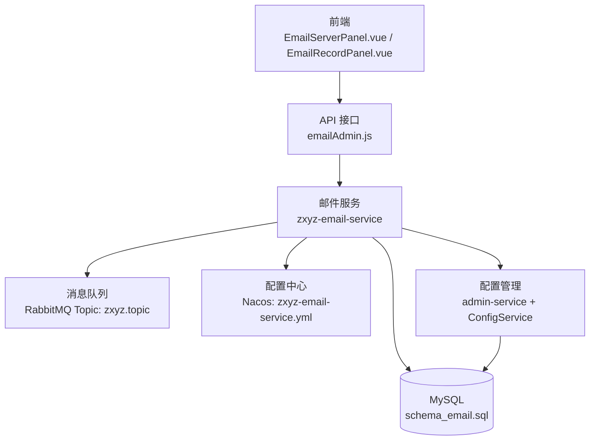
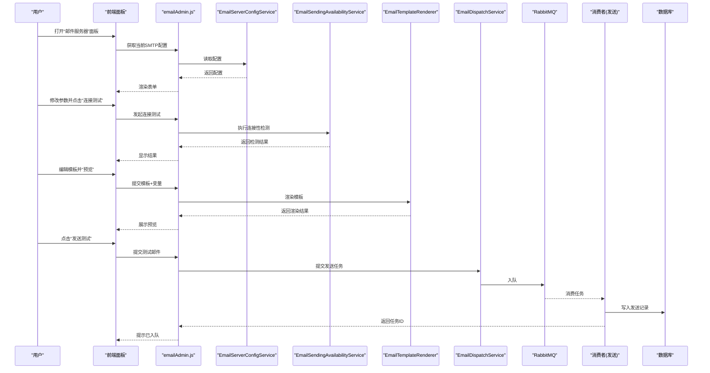
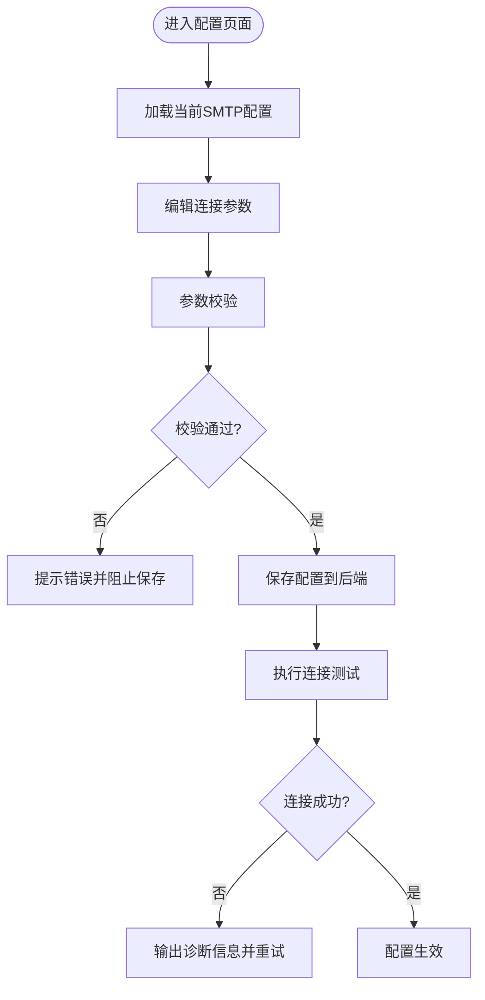
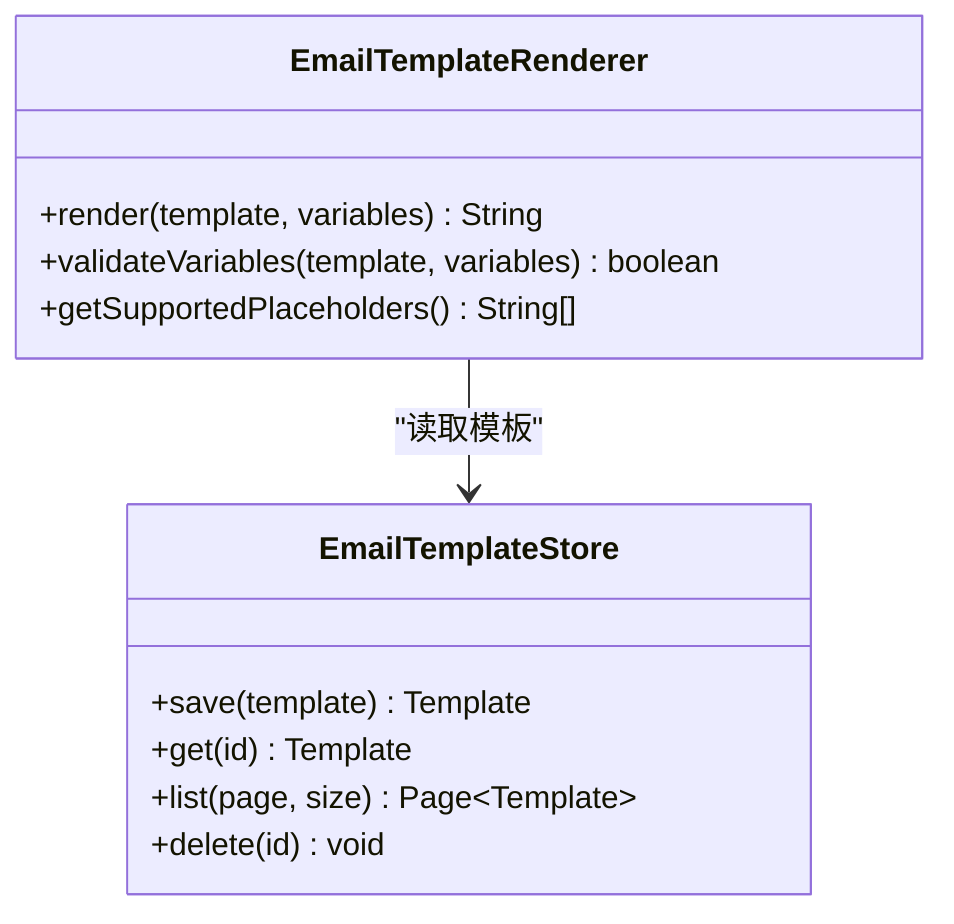
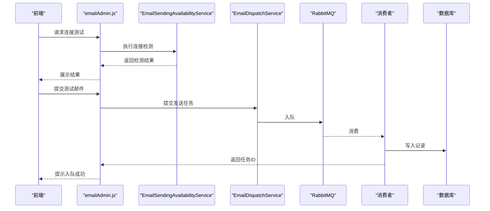
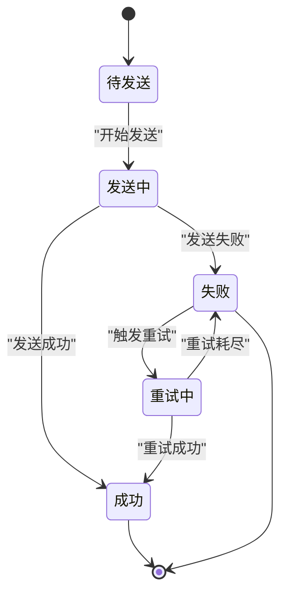
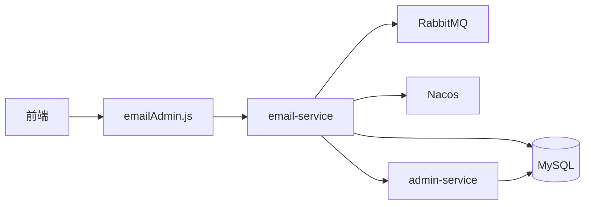

# 邮件服务器配置

<cite>
**本文引用的文件**   
- [EmailServerPanel.vue](file://ZXYZdatabaseFront/src/views/setting/components/EmailServerPanel.vue)
- [EmailRecordPanel.vue](file://ZXYZdatabaseFront/src/views/setting/components/EmailRecordPanel.vue)
- [emailAdmin.js](file://ZXYZdatabaseFront/src/api/emailAdmin.js)
- [zxyz-email-service.yml](file://nacos-config/zxyz-email-service.yml)
- [application.yml](file://ZXYZdatabaseBack/zxyz-email-service/src/main/resources/application.yml)
- [application-dev.yml](file://ZXYZdatabaseBack/zxyz-email-service/src/main/resources/application-dev.yml)
- [application-prod.yml](file://ZXYZdatabaseBack/zxyz-email-service/src/main/resources/application-prod.yml)
- [EmailServerConfigService.java](file://ZXYZdatabaseBack/zxyz-email-service/src/main/java/uno/acloud/email/application/EmailServerConfigService.java)
- [EmailSendingAvailabilityService.java](file://ZXYZdatabaseBack/zxyz-email-service/src/main/java/uno/acloud/email/application/EmailSendingAvailabilityService.java)
- [EmailTemplateRenderer.java](file://ZXYZdatabaseBack/zxyz-email-service/src/main/java/uno/acloud/email/application/EmailTemplateRenderer.java)
- [EmailDispatchService.java](file://ZXYZdatabaseBack/zxyz-email-service/src/main/java/uno/acloud/email/application/EmailDispatchService.java)
- [EmailRecordQueryService.java](file://ZXYZdatabaseBack/zxyz-email-service/src/main/java/uno/acloud/email/application/EmailRecordQueryService.java)
- [VerifyCodeService.java](file://ZXYZdatabaseBack/zxyz-email-service/src/main/java/uno/acloud/email/application/VerifyCodeService.java)
- [EmailProviderClient.java](file://ZXYZdatabaseBack/zxyz-admin-service/src/main/java/uno/acloud/admin/client/EmailProviderClient.java)
- [schema_email.sql](file://ZXYZdatabaseBack/sql/schema_email.sql)
- [V1__init_config_schema.sql](file://ZXYZdatabaseBack/zxyz-admin-service/src/main/resources/db/migration/V1__init_config_schema.sql)
- [V2__hot_config_keys.sql](file://ZXYZdatabaseBack/zxyz-admin-service/src/main/resources/db/migration/V2__hot_config_keys.sql)
- [V3__fix_config_keys.sql](file://ZXYZdatabaseBack/zxyz-admin-service/src/main/resources/db/migration/V3__fix_config_keys.sql)
</cite>

## 目录
1. [简介](#简介)
2. [项目结构](#项目结构)
3. [核心组件](#核心组件)
4. [架构总览](#架构总览)
5. [详细组件分析](#详细组件分析)
6. [依赖关系分析](#依赖关系分析)
7. [性能考虑](#性能考虑)
8. [故障排查指南](#故障排查指南)
9. [结论](#结论)
10. [附录](#附录)

## 简介
本文件面向 ZXYZ 前端“邮件服务器配置面板”的开发与运维，聚焦以下目标：
- SMTP 服务器设置：连接参数、SSL/TLS 加密、认证方式选择与校验。
- 邮件模板管理：模板创建编辑、变量替换、预览测试。
- 发送测试：连接性检测、发送测试、错误诊断。
- 邮件记录查询：发送历史查看、状态跟踪、失败重试。
- 配置验证机制：参数校验、连接测试、错误处理。
- 多提供商支持：不同邮件服务的配置差异与适配方案。
- 邮件队列管理：任务调度、失败重试、批量发送优化。

## 项目结构
前端通过设置页的“邮件服务器”和“邮件记录”两个面板完成配置与运维操作；后端由 email-service 提供应用层能力，admin-service 提供配置管理与供应商客户端封装；数据库使用 Flyway 迁移脚本维护表结构。

图表来源
- [EmailServerPanel.vue](file://ZXYZdatabaseFront/src/views/setting/components/EmailServerPanel.vue)
- [EmailRecordPanel.vue](file://ZXYZdatabaseFront/src/views/setting/components/EmailRecordPanel.vue)
- [emailAdmin.js](file://ZXYZdatabaseFront/src/api/emailAdmin.js)
- [zxyz-email-service.yml](file://nacos-config/zxyz-email-service.yml)
- [application.yml](file://ZXYZdatabaseBack/zxyz-email-service/src/main/resources/application.yml)
- [application-dev.yml](file://ZXYZdatabaseBack/zxyz-email-service/src/main/resources/application-dev.yml)
- [application-prod.yml](file://ZXYZdatabaseBack/zxyz-email-service/src/main/resources/application-prod.yml)
- [schema_email.sql](file://ZXYZdatabaseBack/sql/schema_email.sql)

章节来源
- [EmailServerPanel.vue](file://ZXYZdatabaseFront/src/views/setting/components/EmailServerPanel.vue)
- [EmailRecordPanel.vue](file://ZXYZdatabaseFront/src/views/setting/components/EmailRecordPanel.vue)
- [emailAdmin.js](file://ZXYZdatabaseFront/src/api/emailAdmin.js)
- [zxyz-email-service.yml](file://nacos-config/zxyz-email-service.yml)
- [application.yml](file://ZXYZdatabaseBack/zxyz-email-service/src/main/resources/application.yml)
- [application-dev.yml](file://ZXYZdatabaseBack/zxyz-email-service/src/main/resources/application-dev.yml)
- [application-prod.yml](file://ZXYZdatabaseBack/zxyz-email-service/src/main/resources/application-prod.yml)
- [schema_email.sql](file://ZXYZdatabaseBack/sql/schema_email.sql)

## 核心组件
- 前端配置面板
  - 邮件服务器面板：负责 SMTP 连接参数输入、SSL/TLS 选项、认证方式选择、保存与连接测试。
  - 邮件记录面板：展示发送历史、状态筛选、详情查看与失败重试。
- 前端 API 层
  - emailAdmin.js：封装对后端邮件相关端点的调用（配置、测试、模板、记录等）。
- 后端应用层（email-service）
  - 配置与服务：EmailServerConfigService、EmailSendingAvailabilityService、EmailTemplateRenderer、EmailDispatchService、EmailRecordQueryService、VerifyCodeService。
- 配置与数据
  - Nacos 配置：zxyz-email-service.yml
  - 应用配置：application*.yml
  - 数据库迁移：schema_email.sql、V1/V2/V3 配置迁移脚本

章节来源
- [EmailServerPanel.vue](file://ZXYZdatabaseFront/src/views/setting/components/EmailServerPanel.vue)
- [EmailRecordPanel.vue](file://ZXYZdatabaseFront/src/views/setting/components/EmailRecordPanel.vue)
- [emailAdmin.js](file://ZXYZdatabaseFront/src/api/emailAdmin.js)
- [EmailServerConfigService.java](file://ZXYZdatabaseBack/zxyz-email-service/src/main/java/uno/acloud/email/application/EmailServerConfigService.java)
- [EmailSendingAvailabilityService.java](file://ZXYZdatabaseBack/zxyz-email-service/src/main/java/uno/acloud/email/application/EmailSendingAvailabilityService.java)
- [EmailTemplateRenderer.java](file://ZXYZdatabaseBack/zxyz-email-service/src/main/java/uno/acloud/email/application/EmailTemplateRenderer.java)
- [EmailDispatchService.java](file://ZXYZdatabaseBack/zxyz-email-service/src/main/java/uno/acloud/email/application/EmailDispatchService.java)
- [EmailRecordQueryService.java](file://ZXYZdatabaseBack/zxyz-email-service/src/main/java/uno/acloud/email/application/EmailRecordQueryService.java)
- [VerifyCodeService.java](file://ZXYZdatabaseBack/zxyz-email-service/src/main/java/uno/acloud/email/application/VerifyCodeService.java)
- [zxyz-email-service.yml](file://nacos-config/zxyz-email-service.yml)
- [application.yml](file://ZXYZdatabaseBack/zxyz-email-service/src/main/resources/application.yml)
- [application-dev.yml](file://ZXYZdatabaseBack/zxyz-email-service/src/main/resources/application-dev.yml)
- [application-prod.yml](file://ZXYZdatabaseBack/zxyz-email-service/src/main/resources/application-prod.yml)
- [schema_email.sql](file://ZXYZdatabaseBack/sql/schema_email.sql)
- [V1__init_config_schema.sql](file://ZXYZdatabaseBack/zxyz-admin-service/src/main/resources/db/migration/V1__init_config_schema.sql)
- [V2__hot_config_keys.sql](file://ZXYZdatabaseBack/zxyz-admin-service/src/main/resources/db/migration/V2__hot_config_keys.sql)
- [V3__fix_config_keys.sql](file://ZXYZdatabaseBack/zxyz-admin-service/src/main/resources/db/migration/V3__fix_config_keys.sql)

## 架构总览
邮件功能采用 DDD 分层（interfaces → application → domain → infrastructure），前端通过 REST API 与后端交互，后端将发送任务入队，消费者异步执行并持久化记录。

图表来源
- [EmailServerPanel.vue](file://ZXYZdatabaseFront/src/views/setting/components/EmailServerPanel.vue)
- [EmailRecordPanel.vue](file://ZXYZdatabaseFront/src/views/setting/components/EmailRecordPanel.vue)
- [emailAdmin.js](file://ZXYZdatabaseFront/src/api/emailAdmin.js)
- [EmailServerConfigService.java](file://ZXYZdatabaseBack/zxyz-email-service/src/main/java/uno/acloud/email/application/EmailServerConfigService.java)
- [EmailSendingAvailabilityService.java](file://ZXYZdatabaseBack/zxyz-email-service/src/main/java/uno/acloud/email/application/EmailSendingAvailabilityService.java)
- [EmailTemplateRenderer.java](file://ZXYZdatabaseBack/zxyz-email-service/src/main/java/uno/acloud/email/application/EmailTemplateRenderer.java)
- [EmailDispatchService.java](file://ZXYZdatabaseBack/zxyz-email-service/src/main/java/uno/acloud/email/application/EmailDispatchService.java)
- [EmailRecordQueryService.java](file://ZXYZdatabaseBack/zxyz-email-service/src/main/java/uno/acloud/email/application/EmailRecordQueryService.java)
- [schema_email.sql](file://ZXYZdatabaseBack/sql/schema_email.sql)

## 详细组件分析

### SMTP 服务器设置与连接参数
- 连接参数
  - 主机、端口、用户名、密码、发件人邮箱、显示名称等。
  - 协议与加密：支持明文、SSL、TLS 等模式，根据提供商默认端口自动建议。
- 认证方式
  - 支持基础认证、OAuth2（若提供商启用）、自定义头（如 X-Mailer）等。
- 配置存储
  - 敏感字段加密存储，热更新通过配置中心下发。
- 校验规则
  - 必填项、端口范围、邮箱格式、密码长度、加密协议匹配等。

图表来源
- [EmailServerPanel.vue](file://ZXYZdatabaseFront/src/views/setting/components/EmailServerPanel.vue)
- [EmailServerConfigService.java](file://ZXYZdatabaseBack/zxyz-email-service/src/main/java/uno/acloud/email/application/EmailServerConfigService.java)
- [EmailSendingAvailabilityService.java](file://ZXYZdatabaseBack/zxyz-email-service/src/main/java/uno/acloud/email/application/EmailSendingAvailabilityService.java)
- [zxyz-email-service.yml](file://nacos-config/zxyz-email-service.yml)

章节来源
- [EmailServerPanel.vue](file://ZXYZdatabaseFront/src/views/setting/components/EmailServerPanel.vue)
- [EmailServerConfigService.java](file://ZXYZdatabaseBack/zxyz-email-service/src/main/java/uno/acloud/email/application/EmailServerConfigService.java)
- [EmailSendingAvailabilityService.java](file://ZXYZdatabaseBack/zxyz-email-service/src/main/java/uno/acloud/email/application/EmailSendingAvailabilityService.java)
- [zxyz-email-service.yml](file://nacos-config/zxyz-email-service.yml)

### 邮件模板管理
- 模板创建与编辑
  - 支持 HTML/文本模板，变量占位符（如 ${name}、${code}、${url}）。
  - 模板版本控制与回滚。
- 变量替换与渲染
  - 渲染引擎按变量键值替换，缺失变量可设置默认值或报错。
- 预览与测试
  - 前端传入变量，后端渲染后返回预览内容。
  - 支持附件与内嵌资源引用。

图表来源
- [EmailTemplateRenderer.java](file://ZXYZdatabaseBack/zxyz-email-service/src/main/java/uno/acloud/email/application/EmailTemplateRenderer.java)
- [EmailServerPanel.vue](file://ZXYZdatabaseFront/src/views/setting/components/EmailServerPanel.vue)

章节来源
- [EmailTemplateRenderer.java](file://ZXYZdatabaseBack/zxyz-email-service/src/main/java/uno/acloud/email/application/EmailTemplateRenderer.java)
- [EmailServerPanel.vue](file://ZXYZdatabaseFront/src/views/setting/components/EmailServerPanel.vue)

### 发送测试与连接性检测
- 连接性检测
  - 基于 SMTP 握手与登录流程，返回连接耗时、TLS 协商结果、认证结果。
- 发送测试
  - 构造最小化邮件（主题、正文、收件人），入队异步发送。
  - 返回任务 ID，前端轮询或订阅状态。
- 错误诊断
  - 区分网络错误、认证失败、域名解析失败、限流/封禁等，给出可操作建议。

图表来源
- [EmailSendingAvailabilityService.java](file://ZXYZdatabaseBack/zxyz-email-service/src/main/java/uno/acloud/email/application/EmailSendingAvailabilityService.java)
- [EmailDispatchService.java](file://ZXYZdatabaseBack/zxyz-email-service/src/main/java/uno/acloud/email/application/EmailDispatchService.java)
- [emailAdmin.js](file://ZXYZdatabaseFront/src/api/emailAdmin.js)
- [schema_email.sql](file://ZXYZdatabaseBack/sql/schema_email.sql)

章节来源
- [EmailSendingAvailabilityService.java](file://ZXYZdatabaseBack/zxyz-email-service/src/main/java/uno/acloud/email/application/EmailSendingAvailabilityService.java)
- [EmailDispatchService.java](file://ZXYZdatabaseBack/zxyz-email-service/src/main/java/uno/acloud/email/application/EmailDispatchService.java)
- [emailAdmin.js](file://ZXYZdatabaseFront/src/api/emailAdmin.js)
- [schema_email.sql](file://ZXYZdatabaseBack/sql/schema_email.sql)

### 邮件记录查询与失败重试
- 发送历史
  - 分页列表、按状态/时间/收件人筛选、查看详情。
- 状态跟踪
  - 入队、发送中、成功、失败、重试中、被拒收等状态流转。
- 失败重试
  - 手动重试与自动重试策略（指数退避、最大次数）。
  - 死信队列兜底与告警。

图表来源
- [EmailRecordQueryService.java](file://ZXYZdatabaseBack/zxyz-email-service/src/main/java/uno/acloud/email/application/EmailRecordQueryService.java)
- [EmailDispatchService.java](file://ZXYZdatabaseBack/zxyz-email-service/src/main/java/uno/acloud/email/application/EmailDispatchService.java)
- [EmailRecordPanel.vue](file://ZXYZdatabaseFront/src/views/setting/components/EmailRecordPanel.vue)

章节来源
- [EmailRecordQueryService.java](file://ZXYZdatabaseBack/zxyz-email-service/src/main/java/uno/acloud/email/application/EmailRecordQueryService.java)
- [EmailDispatchService.java](file://ZXYZdatabaseBack/zxyz-email-service/src/main/java/uno/acloud/email/application/EmailDispatchService.java)
- [EmailRecordPanel.vue](file://ZXYZdatabaseFront/src/views/setting/components/EmailRecordPanel.vue)

### 验证码与业务邮件
- 验证码生成与校验
  - 随机码生成、过期时间、防重放、频率限制。
- 业务邮件
  - 注册、重置密码、通知类邮件模板与变量注入。

章节来源
- [VerifyCodeService.java](file://ZXYZdatabaseBack/zxyz-email-service/src/main/java/uno/acloud/email/application/VerifyCodeService.java)

### 多提供商支持与适配
- 常见提供商差异
  - 端口与加密：如 465/SSL、587/TLS、25/明文。
  - 认证：基础认证、OAuth2、App Password。
  - 限流与配额：每日上限、并发限制、IP 白名单。
- 适配方案
  - 通过配置中心动态切换提供商参数。
  - 统一抽象连接与发送接口，屏蔽差异。
  - 针对特殊提供商增加扩展点（如自定义头、签名算法）。

章节来源
- [zxyz-email-service.yml](file://nacos-config/zxyz-email-service.yml)
- [application.yml](file://ZXYZdatabaseBack/zxyz-email-service/src/main/resources/application.yml)
- [application-dev.yml](file://ZXYZdatabaseBack/zxyz-email-service/src/main/resources/application-dev.yml)
- [application-prod.yml](file://ZXYZdatabaseBack/zxyz-email-service/src/main/resources/application-prod.yml)
- [EmailProviderClient.java](file://ZXYZdatabaseBack/zxyz-admin-service/src/main/java/uno/acloud/admin/client/EmailProviderClient.java)

### 配置验证机制
- 参数校验
  - 前端即时校验 + 后端严格校验（类型、范围、格式）。
- 连接测试
  - 模拟 SMTP 握手与登录，返回详细诊断。
- 错误处理
  - 统一异常映射，分类提示（网络、认证、权限、限流）。

章节来源
- [EmailServerConfigService.java](file://ZXYZdatabaseBack/zxyz-email-service/src/main/java/uno/acloud/email/application/EmailServerConfigService.java)
- [EmailSendingAvailabilityService.java](file://ZXYZdatabaseBack/zxyz-email-service/src/main/java/uno/acloud/email/application/EmailSendingAvailabilityService.java)
- [EmailServerPanel.vue](file://ZXYZdatabaseFront/src/views/setting/components/EmailServerPanel.vue)

### 邮件队列管理
- 任务调度
  - 入队时分配优先级与延迟策略。
- 失败重试
  - 指数退避、最大重试次数、死信队列。
- 批量发送优化
  - 批大小、并发度、速率限制、去重。

章节来源
- [EmailDispatchService.java](file://ZXYZdatabaseBack/zxyz-email-service/src/main/java/uno/acloud/email/application/EmailDispatchService.java)
- [schema_email.sql](file://ZXYZdatabaseBack/sql/schema_email.sql)

## 依赖关系分析
- 前端依赖
  - emailAdmin.js 调用后端 REST 接口。
- 后端依赖
  - email-service 依赖数据库、消息队列、配置中心。
  - admin-service 提供配置管理与供应商客户端。
- 外部依赖
  - SMTP 服务器、RabbitMQ、MySQL、Nacos。

图表来源
- [emailAdmin.js](file://ZXYZdatabaseFront/src/api/emailAdmin.js)
- [zxyz-email-service.yml](file://nacos-config/zxyz-email-service.yml)
- [EmailProviderClient.java](file://ZXYZdatabaseBack/zxyz-admin-service/src/main/java/uno/acloud/admin/client/EmailProviderClient.java)

章节来源
- [emailAdmin.js](file://ZXYZdatabaseFront/src/api/emailAdmin.js)
- [zxyz-email-service.yml](file://nacos-config/zxyz-email-service.yml)
- [EmailProviderClient.java](file://ZXYZdatabaseBack/zxyz-admin-service/src/main/java/uno/acloud/admin/client/EmailProviderClient.java)

## 性能考虑
- 连接池与超时
  - SMTP 连接复用、合理超时与重试间隔。
- 异步发送
  - 通过消息队列削峰填谷，避免阻塞请求线程。
- 批量发送
  - 控制批大小与并发，避免触发提供商限流。
- 缓存与预热
  - 模板渲染缓存、连接池预热。
- 监控与指标
  - 记录发送耗时、成功率、失败原因分布。

## 故障排查指南
- 连接失败
  - 检查主机、端口、加密协议是否匹配；确认防火墙与白名单。
- 认证失败
  - 核对用户名/密码或 App Password；确认 OAuth2 配置。
- 发送失败
  - 查看发送记录详情与错误码；检查收件人有效性、附件大小。
- 限流与封禁
  - 降低并发与频率；联系提供商提升配额。
- 模板渲染问题
  - 校验变量键名与数据类型；检查模板语法与资源路径。

章节来源
- [EmailSendingAvailabilityService.java](file://ZXYZdatabaseBack/zxyz-email-service/src/main/java/uno/acloud/email/application/EmailSendingAvailabilityService.java)
- [EmailRecordQueryService.java](file://ZXYZdatabaseBack/zxyz-email-service/src/main/java/uno/acloud/email/application/EmailRecordQueryService.java)
- [EmailTemplateRenderer.java](file://ZXYZdatabaseBack/zxyz-email-service/src/main/java/uno/acloud/email/application/EmailTemplateRenderer.java)

## 结论
通过前后端协同与 DDD 分层设计，ZXYZ 邮件系统实现了灵活的 SMTP 配置、完善的模板管理、可靠的发送与记录追踪、以及可扩展的多提供商适配。结合消息队列与配置中心，系统在稳定性与可运维性方面具备良好基础。建议在后续迭代中加强监控告警、审计与合规能力。

## 附录
- 数据库表结构参考
  - 邮件相关表定义见 schema_email.sql。
- 配置迁移脚本
  - V1/V2/V3 用于初始化与修复配置键。

章节来源
- [schema_email.sql](file://ZXYZdatabaseBack/sql/schema_email.sql)
- [V1__init_config_schema.sql](file://ZXYZdatabaseBack/zxyz-admin-service/src/main/resources/db/migration/V1__init_config_schema.sql)
- [V2__hot_config_keys.sql](file://ZXYZdatabaseBack/zxyz-admin-service/src/main/resources/db/migration/V2__hot_config_keys.sql)
- [V3__fix_config_keys.sql](file://ZXYZdatabaseBack/zxyz-admin-service/src/main/resources/db/migration/V3__fix_config_keys.sql)