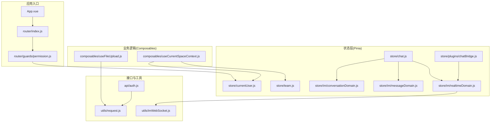
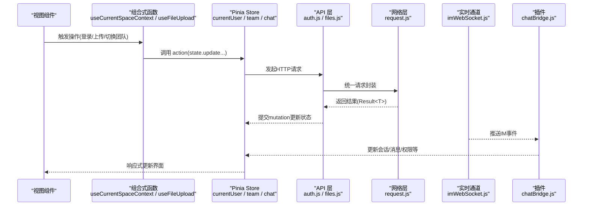
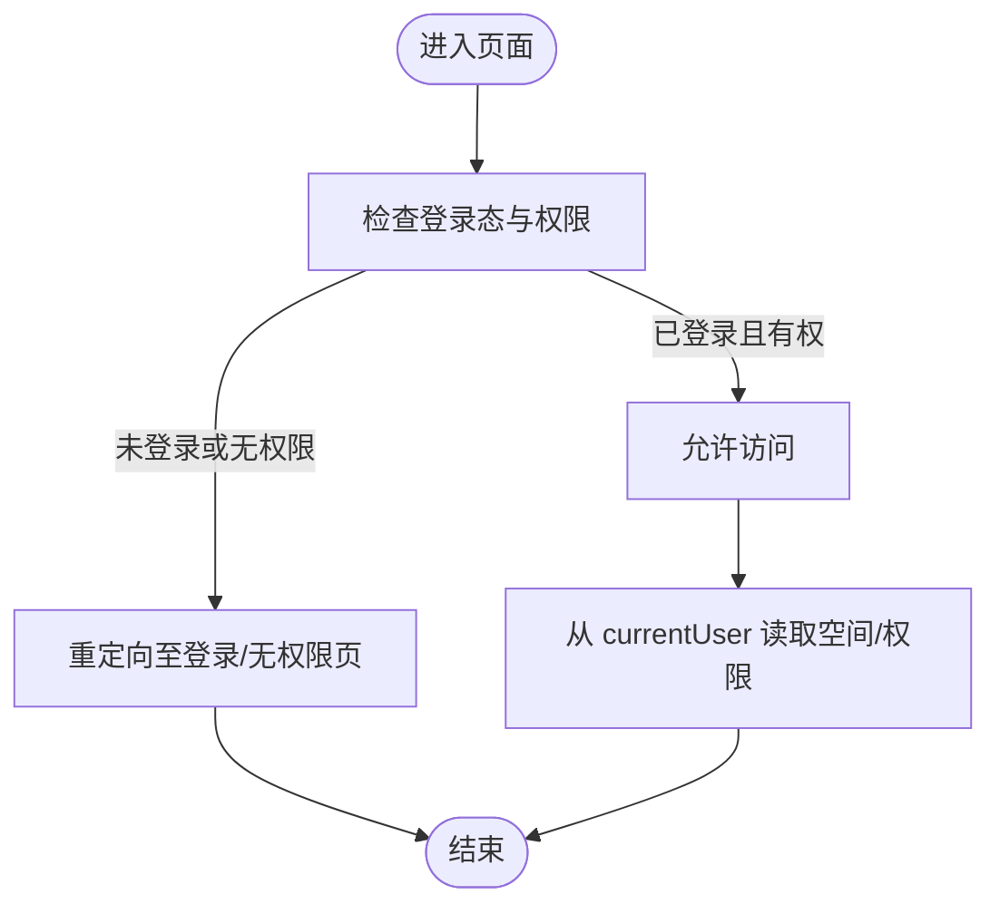
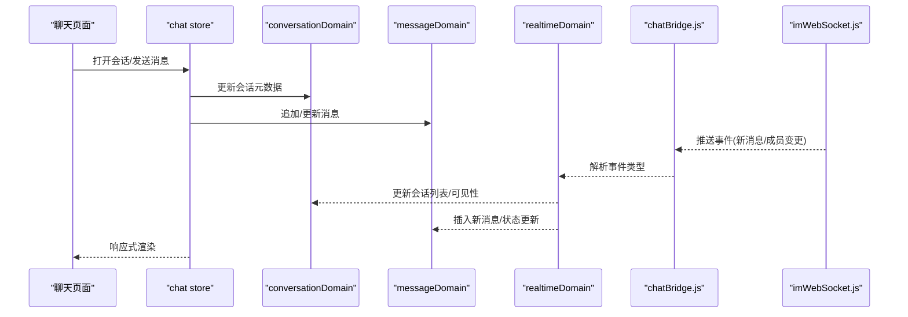
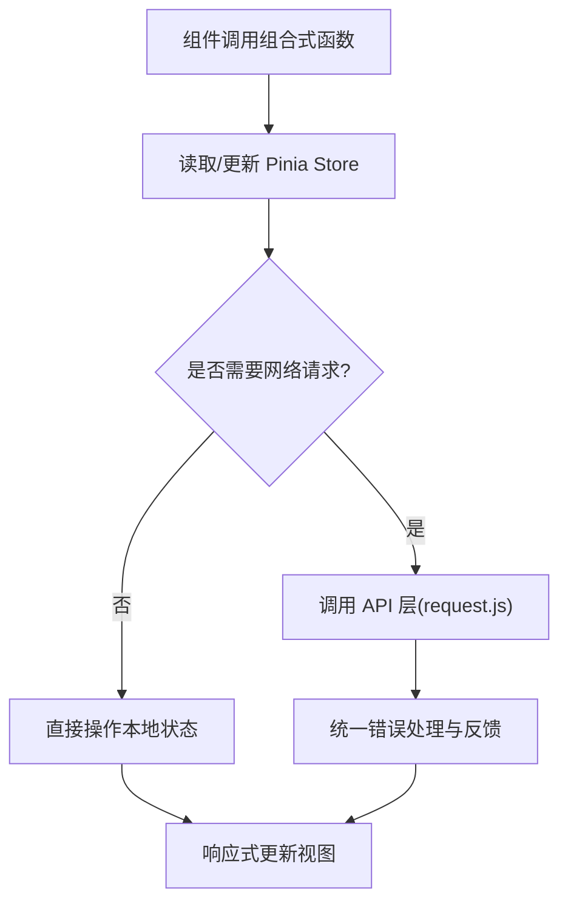
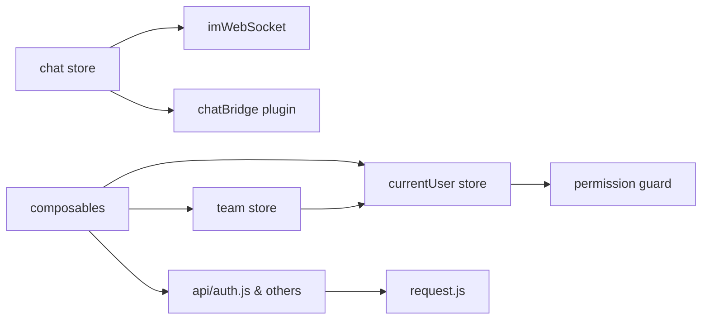

# 状态管理

<cite>
**本文引用的文件**   
- [ZXYZdatabaseFront/src/store/currentUser.js](file://ZXYZdatabaseFront/src/store/currentUser.js)
- [ZXYZdatabaseFront/src/store/team.js](file://ZXYZdatabaseFront/src/store/team.js)
- [ZXYZdatabaseFront/src/store/chat.js](file://ZXYZdatabaseFront/src/store/chat.js)
- [ZXYZdatabaseFront/src/store/im/conversationDomain.js](file://ZXYZdatabaseFront/src/store/im/conversationDomain.js)
- [ZXYZdatabaseFront/src/store/im/messageDomain.js](file://ZXYZdatabaseFront/src/store/im/messageDomain.js)
- [ZXYZdatabaseFront/src/store/im/realtimeDomain.js](file://ZXYZdatabaseFront/src/store/im/realtimeDomain.js)
- [ZXYZdatabaseFront/src/store/plugins/chatBridge.js](file://ZXYZdatabaseFront/src/store/plugins/chatBridge.js)
- [ZXYZdatabaseFront/src/composables/useCurrentSpaceContext.js](file://ZXYZdatabaseFront/src/composables/useCurrentSpaceContext.js)
- [ZXYZdatabaseFront/src/composables/useFileUpload.js](file://ZXYZdatabaseFront/src/composables/useFileUpload.js)
- [ZXYZdatabaseFront/src/api/auth.js](file://ZXYZdatabaseFront/src/api/auth.js)
- [ZXYZdatabaseFront/src/utils/request.js](file://ZXYZdatabaseFront/src/utils/request.js)
- [ZXYZdatabaseFront/src/utils/imWebSocket.js](file://ZXYZdatabaseFront/src/utils/imWebSocket.js)
- [ZXYZdatabaseFront/src/router/guards/permission.js](file://ZXYZdatabaseFront/src/router/guards/permission.js)
</cite>

## 目录
1. [简介](#简介)
2. [项目结构](#项目结构)
3. [核心组件](#核心组件)
4. [架构总览](#架构总览)
5. [详细组件分析](#详细组件分析)
6. [依赖关系分析](#依赖关系分析)
7. [性能考虑](#性能考虑)
8. [故障排查指南](#故障排查指南)
9. [结论](#结论)
10. [附录](#附录)

## 简介
本技术文档聚焦 ZXYZ 前端的状态管理系统，围绕基于 Pinia 的 store 设计、模块化组织与数据流管理展开。重点说明用户状态（currentUser）、团队状态（team）与聊天状态（chat）的实现原理，并阐述组合式函数（composables）如 useCurrentSpaceContext、useFileUpload 等的设计模式。同时覆盖状态持久化策略、缓存机制、数据同步方案，以及状态更新最佳实践、性能优化技巧与调试方法，辅以实际使用示例与常见问题解决方案。

## 项目结构
前端采用 Vue 3 Composition API + <script setup>，状态管理使用 Pinia，业务逻辑通过 composables 封装，API 调用集中在 api 目录，网络请求统一由 utils/request.js 处理，实时通信通过 utils/imWebSocket.js 与 store 插件 chatBridge.js 桥接。



图表来源
- [ZXYZdatabaseFront/src/store/currentUser.js](file://ZXYZdatabaseFront/src/store/currentUser.js)
- [ZXYZdatabaseFront/src/store/team.js](file://ZXYZdatabaseFront/src/store/team.js)
- [ZXYZdatabaseFront/src/store/chat.js](file://ZXYZdatabaseFront/src/store/chat.js)
- [ZXYZdatabaseFront/src/store/im/conversationDomain.js](file://ZXYZdatabaseFront/src/store/im/conversationDomain.js)
- [ZXYZdatabaseFront/src/store/im/messageDomain.js](file://ZXYZdatabaseFront/src/store/im/messageDomain.js)
- [ZXYZdatabaseFront/src/store/im/realtimeDomain.js](file://ZXYZdatabaseFront/src/store/im/realtimeDomain.js)
- [ZXYZdatabaseFront/src/store/plugins/chatBridge.js](file://ZXYZdatabaseFront/src/store/plugins/chatBridge.js)
- [ZXYZdatabaseFront/src/composables/useCurrentSpaceContext.js](file://ZXYZdatabaseFront/src/composables/useCurrentSpaceContext.js)
- [ZXYZdatabaseFront/src/composables/useFileUpload.js](file://ZXYZdatabaseFront/src/composables/useFileUpload.js)
- [ZXYZdatabaseFront/src/api/auth.js](file://ZXYZdatabaseFront/src/api/auth.js)
- [ZXYZdatabaseFront/src/utils/request.js](file://ZXYZdatabaseFront/src/utils/request.js)
- [ZXYZdatabaseFront/src/utils/imWebSocket.js](file://ZXYZdatabaseFront/src/utils/imWebSocket.js)
- [ZXYZdatabaseFront/src/router/guards/permission.js](file://ZXYZdatabaseFront/src/router/guards/permission.js)

章节来源
- [ZXYZdatabaseFront/src/store/currentUser.js](file://ZXYZdatabaseFront/src/store/currentUser.js)
- [ZXYZdatabaseFront/src/store/team.js](file://ZXYZdatabaseFront/src/store/team.js)
- [ZXYZdatabaseFront/src/store/chat.js](file://ZXYZdatabaseFront/src/store/chat.js)
- [ZXYZdatabaseFront/src/store/im/conversationDomain.js](file://ZXYZdatabaseFront/src/store/im/conversationDomain.js)
- [ZXYZdatabaseFront/src/store/im/messageDomain.js](file://ZXYZdatabaseFront/src/store/im/messageDomain.js)
- [ZXYZdatabaseFront/src/store/im/realtimeDomain.js](file://ZXYZdatabaseFront/src/store/im/realtimeDomain.js)
- [ZXYZdatabaseFront/src/store/plugins/chatBridge.js](file://ZXYZdatabaseFront/src/store/plugins/chatBridge.js)
- [ZXYZdatabaseFront/src/composables/useCurrentSpaceContext.js](file://ZXYZdatabaseFront/src/composables/useCurrentSpaceContext.js)
- [ZXYZdatabaseFront/src/composables/useFileUpload.js](file://ZXYZdatabaseFront/src/composables/useFileUpload.js)
- [ZXYZdatabaseFront/src/api/auth.js](file://ZXYZdatabaseFront/src/api/auth.js)
- [ZXYZdatabaseFront/src/utils/request.js](file://ZXYZdatabaseFront/src/utils/request.js)
- [ZXYZdatabaseFront/src/utils/imWebSocket.js](file://ZXYZdatabaseFront/src/utils/imWebSocket.js)
- [ZXYZdatabaseFront/src/router/guards/permission.js](file://ZXYZdatabaseFront/src/router/guards/permission.js)

## 核心组件
- currentUser：负责登录态、用户信息、权限与当前空间上下文的基础数据；提供登录、登出、刷新用户信息等动作，并与路由守卫联动完成鉴权跳转。
- team：维护当前团队信息、成员列表、角色权限、存储配额等；提供切换团队、加载团队详情、更新成员等操作。
- chat：聚合 IM 相关领域模型（会话、消息、通知、权限、实时通道），通过领域域（conversationDomain、messageDomain、realtimeDomain）拆分职责，并由插件 chatBridge.js 桥接 WebSocket 事件到 store。

章节来源
- [ZXYZdatabaseFront/src/store/currentUser.js](file://ZXYZdatabaseFront/src/store/currentUser.js)
- [ZXYZdatabaseFront/src/store/team.js](file://ZXYZdatabaseFront/src/store/team.js)
- [ZXYZdatabaseFront/src/store/chat.js](file://ZXYZdatabaseFront/src/store/chat.js)
- [ZXYZdatabaseFront/src/store/im/conversationDomain.js](file://ZXYZdatabaseFront/src/store/im/conversationDomain.js)
- [ZXYZdatabaseFront/src/store/im/messageDomain.js](file://ZXYZdatabaseFront/src/store/im/messageDomain.js)
- [ZXYZdatabaseFront/src/store/im/realtimeDomain.js](file://ZXYZdatabaseFront/src/store/im/realtimeDomain.js)
- [ZXYZdatabaseFront/src/store/plugins/chatBridge.js](file://ZXYZdatabaseFront/src/store/plugins/chatBridge.js)

## 架构总览
Pinia store 作为单一事实源，composables 以函数形式复用跨组件的业务逻辑，API 层统一封装 HTTP 请求，WebSocket 通过插件将实时事件写入 store，路由守卫在页面级进行鉴权控制。整体数据流遵循“视图触发 action → API/WebSocket → store mutation → 响应式更新”的模式。



图表来源
- [ZXYZdatabaseFront/src/composables/useCurrentSpaceContext.js](file://ZXYZdatabaseFront/src/composables/useCurrentSpaceContext.js)
- [ZXYZdatabaseFront/src/composables/useFileUpload.js](file://ZXYZdatabaseFront/src/composables/useFileUpload.js)
- [ZXYZdatabaseFront/src/store/currentUser.js](file://ZXYZdatabaseFront/src/store/currentUser.js)
- [ZXYZdatabaseFront/src/store/team.js](file://ZXYZdatabaseFront/src/store/team.js)
- [ZXYZdatabaseFront/src/store/chat.js](file://ZXYZdatabaseFront/src/store/chat.js)
- [ZXYZdatabaseFront/src/api/auth.js](file://ZXYZdatabaseFront/src/api/auth.js)
- [ZXYZdatabaseFront/src/utils/request.js](file://ZXYZdatabaseFront/src/utils/request.js)
- [ZXYZdatabaseFront/src/utils/imWebSocket.js](file://ZXYZdatabaseFront/src/utils/imWebSocket.js)
- [ZXYZdatabaseFront/src/store/plugins/chatBridge.js](file://ZXYZdatabaseFront/src/store/plugins/chatBridge.js)

## 详细组件分析

### currentUser 状态管理
- 职责：维护登录态、用户基本信息、权限集合、当前空间上下文；提供登录、登出、刷新用户信息、设置当前空间等动作。
- 数据流：登录成功后通过 API 获取用户信息并写入 store，路由守卫根据用户权限决定可访问页面；登出时清理本地状态与缓存。
- 持久化：通常结合浏览器存储（如 localStorage/sessionStorage）或 Cookie（HttpOnly）配合服务端 Session 保持登录态；store 内仅保存必要的最小集。
- 典型用法：在组合式函数中读取 currentUser.spaceId、currentUser.permissions，并在需要时调用 actions 更新。



图表来源
- [ZXYZdatabaseFront/src/store/currentUser.js](file://ZXYZdatabaseFront/src/store/currentUser.js)
- [ZXYZdatabaseFront/src/router/guards/permission.js](file://ZXYZdatabaseFront/src/router/guards/permission.js)

章节来源
- [ZXYZdatabaseFront/src/store/currentUser.js](file://ZXYZdatabaseFront/src/store/currentUser.js)
- [ZXYZdatabaseFront/src/router/guards/permission.js](file://ZXYZdatabaseFront/src/router/guards/permission.js)

### team 状态管理
- 职责：维护当前团队信息、成员列表、角色权限、存储配额等；支持切换团队、加载团队详情、更新成员与权限。
- 数据流：切换团队时先拉取团队详情，再按需加载成员与配额；变更通过 actions 提交 mutation，确保响应式更新。
- 缓存策略：对团队元数据做短期内存缓存，避免频繁请求；当成员或配置变化时主动失效。
- 典型用法：在组合式函数中使用 useCurrentSpaceContext 读取当前团队 ID，并通过 team store 的 actions 执行操作。

```mermaid
classDiagram
class TeamStore {
+state : object
+actions : { loadTeam, switchTeam, updateMember }
+getters : { currentTeam, members, permissions }
}
class CurrentUserStore {
+state : object
+actions : { login, logout, refreshUser }
+getters : { spaceId, permissions }
}
TeamStore --> CurrentUserStore : "依赖当前空间上下文"
```

图表来源
- [ZXYZdatabaseFront/src/store/team.js](file://ZXYZdatabaseFront/src/store/team.js)
- [ZXYZdatabaseFront/src/store/currentUser.js](file://ZXYZdatabaseFront/src/store/currentUser.js)

章节来源
- [ZXYZdatabaseFront/src/store/team.js](file://ZXYZdatabaseFront/src/store/team.js)
- [ZXYZdatabaseFront/src/store/currentUser.js](file://ZXYZdatabaseFront/src/store/currentUser.js)

### chat 状态管理与 IM 领域模型
- 职责：集中管理 IM 相关数据，包括会话列表、消息列表、通知、权限与实时通道；通过领域域拆分 conversationDomain、messageDomain、realtimeDomain，提升内聚性与可维护性。
- 数据流：HTTP 请求用于初始化会话与历史消息；WebSocket 推送新消息、成员变更、通知等，由 chatBridge.js 插件统一分发到对应领域域。
- 实时同步：realtimeDomain 负责连接管理、心跳、断线重连；收到事件后按类型路由到 conversationDomain 或 messageDomain 进行增量更新。
- 典型用法：在聊天页面订阅 store 中的会话与消息，发送消息通过 chat store 的 actions 触发 API 与 WS 广播。



图表来源
- [ZXYZdatabaseFront/src/store/chat.js](file://ZXYZdatabaseFront/src/store/chat.js)
- [ZXYZdatabaseFront/src/store/im/conversationDomain.js](file://ZXYZdatabaseFront/src/store/im/conversationDomain.js)
- [ZXYZdatabaseFront/src/store/im/messageDomain.js](file://ZXYZdatabaseFront/src/store/im/messageDomain.js)
- [ZXYZdatabaseFront/src/store/im/realtimeDomain.js](file://ZXYZdatabaseFront/src/store/im/realtimeDomain.js)
- [ZXYZdatabaseFront/src/store/plugins/chatBridge.js](file://ZXYZdatabaseFront/src/store/plugins/chatBridge.js)
- [ZXYZdatabaseFront/src/utils/imWebSocket.js](file://ZXYZdatabaseFront/src/utils/imWebSocket.js)

章节来源
- [ZXYZdatabaseFront/src/store/chat.js](file://ZXYZdatabaseFront/src/store/chat.js)
- [ZXYZdatabaseFront/src/store/im/conversationDomain.js](file://ZXYZdatabaseFront/src/store/im/conversationDomain.js)
- [ZXYZdatabaseFront/src/store/im/messageDomain.js](file://ZXYZdatabaseFront/src/store/im/messageDomain.js)
- [ZXYZdatabaseFront/src/store/im/realtimeDomain.js](file://ZXYZdatabaseFront/src/store/im/realtimeDomain.js)
- [ZXYZdatabaseFront/src/store/plugins/chatBridge.js](file://ZXYZdatabaseFront/src/store/plugins/chatBridge.js)
- [ZXYZdatabaseFront/src/utils/imWebSocket.js](file://ZXYZdatabaseFront/src/utils/imWebSocket.js)

### 组合式函数设计模式
- useCurrentSpaceContext：封装当前空间上下文的读取与切换逻辑，依赖 currentUser 与 team store，提供统一的 spaceId、teamId、permissions 访问方式，减少重复代码。
- useFileUpload：封装文件上传流程，包括选择文件、分片/进度、错误重试、成功回调；与 request.js 协作，统一错误处理与状态反馈。
- 其他常见组合式：useLoginForm、useDeleteDialog、useSelectionManager、useSortState 等，均遵循“状态+行为”的函数式封装，便于在多个组件复用。



图表来源
- [ZXYZdatabaseFront/src/composables/useCurrentSpaceContext.js](file://ZXYZdatabaseFront/src/composables/useCurrentSpaceContext.js)
- [ZXYZdatabaseFront/src/composables/useFileUpload.js](file://ZXYZdatabaseFront/src/composables/useFileUpload.js)
- [ZXYZdatabaseFront/src/utils/request.js](file://ZXYZdatabaseFront/src/utils/request.js)

章节来源
- [ZXYZdatabaseFront/src/composables/useCurrentSpaceContext.js](file://ZXYZdatabaseFront/src/composables/useCurrentSpaceContext.js)
- [ZXYZdatabaseFront/src/composables/useFileUpload.js](file://ZXYZdatabaseFront/src/composables/useFileUpload.js)

## 依赖关系分析
- currentUser 与路由守卫强耦合：登录后需刷新权限，路由守卫依据权限决定是否放行。
- team 依赖 currentUser 的 spaceId：切换团队时需保证当前空间上下文正确。
- chat 依赖 imWebSocket 与 chatBridge：实时事件驱动 store 更新，避免手动轮询。
- composables 依赖 store 与 API 层：通过函数封装跨组件逻辑，降低组件复杂度。



图表来源
- [ZXYZdatabaseFront/src/store/currentUser.js](file://ZXYZdatabaseFront/src/store/currentUser.js)
- [ZXYZdatabaseFront/src/store/team.js](file://ZXYZdatabaseFront/src/store/team.js)
- [ZXYZdatabaseFront/src/store/chat.js](file://ZXYZdatabaseFront/src/store/chat.js)
- [ZXYZdatabaseFront/src/store/plugins/chatBridge.js](file://ZXYZdatabaseFront/src/store/plugins/chatBridge.js)
- [ZXYZdatabaseFront/src/utils/imWebSocket.js](file://ZXYZdatabaseFront/src/utils/imWebSocket.js)
- [ZXYZdatabaseFront/src/api/auth.js](file://ZXYZdatabaseFront/src/api/auth.js)
- [ZXYZdatabaseFront/src/utils/request.js](file://ZXYZdatabaseFront/src/utils/request.js)
- [ZXYZdatabaseFront/src/router/guards/permission.js](file://ZXYZdatabaseFront/src/router/guards/permission.js)

章节来源
- [ZXYZdatabaseFront/src/store/currentUser.js](file://ZXYZdatabaseFront/src/store/currentUser.js)
- [ZXYZdatabaseFront/src/store/team.js](file://ZXYZdatabaseFront/src/store/team.js)
- [ZXYZdatabaseFront/src/store/chat.js](file://ZXYZdatabaseFront/src/store/chat.js)
- [ZXYZdatabaseFront/src/store/plugins/chatBridge.js](file://ZXYZdatabaseFront/src/store/plugins/chatBridge.js)
- [ZXYZdatabaseFront/src/utils/imWebSocket.js](file://ZXYZdatabaseFront/src/utils/imWebSocket.js)
- [ZXYZdatabaseFront/src/api/auth.js](file://ZXYZdatabaseFront/src/api/auth.js)
- [ZXYZdatabaseFront/src/utils/request.js](file://ZXYZdatabaseFront/src/utils/request.js)
- [ZXYZdatabaseFront/src/router/guards/permission.js](file://ZXYZdatabaseFront/src/router/guards/permission.js)

## 性能考虑
- 最小化状态体积：只保留必要的字段，避免在 store 中存放大对象或冗余数据。
- 惰性加载：按需加载团队详情、成员列表与历史消息，避免首屏过重。
- 增量更新：通过领域域拆分，针对单条消息或会话进行局部更新，减少全量重渲染。
- 防抖与节流：搜索、滚动加载等高频操作使用防抖/节流，降低不必要的请求与计算。
- 缓存策略：对静态或低频变化的数据（如团队元数据）进行短期内存缓存，必要时结合持久化存储。
- WebSocket 优化：心跳保活、断线重连、消息去重与乱序处理，避免频繁重建连接。

[本节为通用指导，不直接分析具体文件]

## 故障排查指南
- 登录失败或权限不足：检查 currentUser store 的登录 action 与路由守卫逻辑，确认 API 返回结构与错误码；查看 request.js 的错误拦截与提示。
- 团队切换异常：确认 spaceId 是否正确传递，team store 的 switchTeam 是否成功加载数据；检查成员与权限缓存是否失效。
- 聊天消息不同步：验证 imWebSocket 连接状态与 chatBridge 事件分发；检查 messageDomain 与 conversationDomain 的增量更新逻辑。
- 文件上传失败：查看 useFileUpload 的错误处理与重试策略，确认 request.js 的超时与错误码映射。

章节来源
- [ZXYZdatabaseFront/src/store/currentUser.js](file://ZXYZdatabaseFront/src/store/currentUser.js)
- [ZXYZdatabaseFront/src/store/team.js](file://ZXYZdatabaseFront/src/store/team.js)
- [ZXYZdatabaseFront/src/store/chat.js](file://ZXYZdatabaseFront/src/store/chat.js)
- [ZXYZdatabaseFront/src/store/plugins/chatBridge.js](file://ZXYZdatabaseFront/src/store/plugins/chatBridge.js)
- [ZXYZdatabaseFront/src/utils/request.js](file://ZXYZdatabaseFront/src/utils/request.js)
- [ZXYZdatabaseFront/src/utils/imWebSocket.js](file://ZXYZdatabaseFront/src/utils/imWebSocket.js)
- [ZXYZdatabaseFront/src/composables/useFileUpload.js](file://ZXYZdatabaseFront/src/composables/useFileUpload.js)

## 结论
ZXYZ 前端状态管理以 Pinia 为核心，结合 composables 与领域域拆分，实现了清晰的数据流与高内聚的职责划分。通过统一的 API 层与 WebSocket 插件，确保了状态更新的及时性与一致性。遵循最小化状态、惰性加载、增量更新与缓存策略，可有效提升性能与用户体验。建议在实际开发中严格遵循上述最佳实践，并结合调试手段快速定位问题。

[本节为总结，不直接分析具体文件]

## 附录
- 使用示例
  - 登录流程：在登录页面调用 currentUser store 的 login action，成功后通过路由守卫跳转到首页。
  - 切换团队：在组合式函数中读取当前 spaceId，调用 team store 的 switchTeam 并刷新成员与权限。
  - 发送消息：在聊天页面调用 chat store 的 send 动作，消息经 API 与 WebSocket 广播，实时更新消息列表。
- 常见问题
  - 状态不同步：检查 WebSocket 连接与事件分发，确保 chatBridge 正确路由到领域域。
  - 权限不一致：确认 currentUser 的权限集合与路由守卫的判断逻辑一致。
  - 上传卡顿：优化 useFileUpload 的分片与进度反馈，避免阻塞主线程。

[本节为补充内容，不直接分析具体文件]