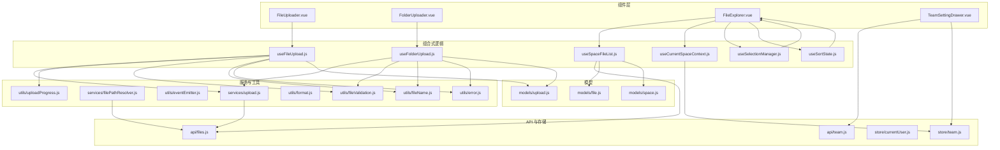
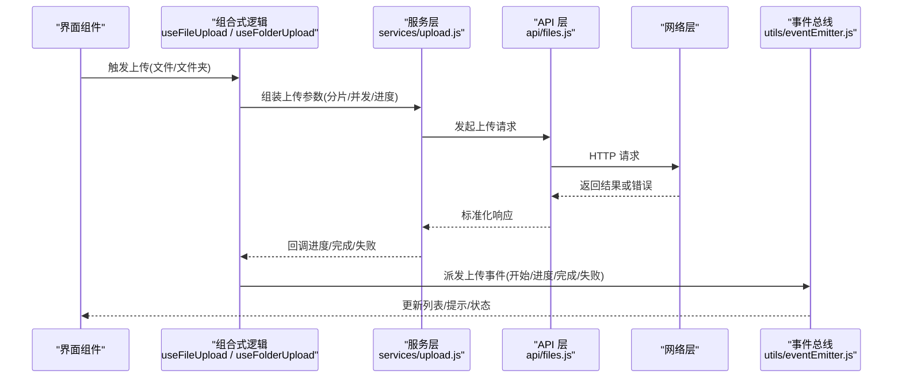
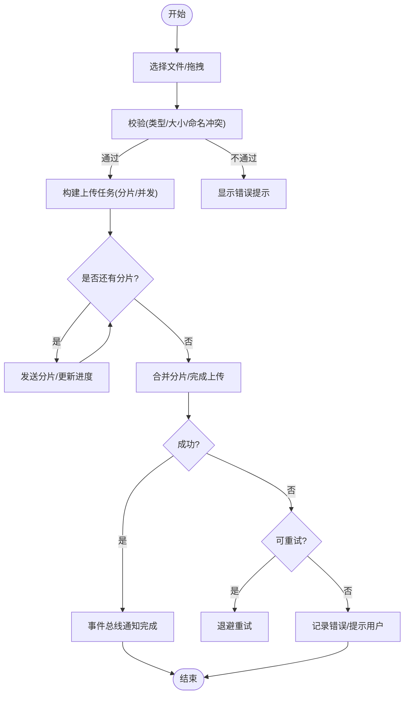
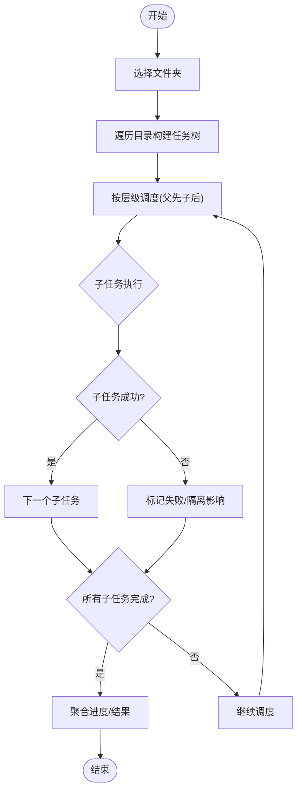
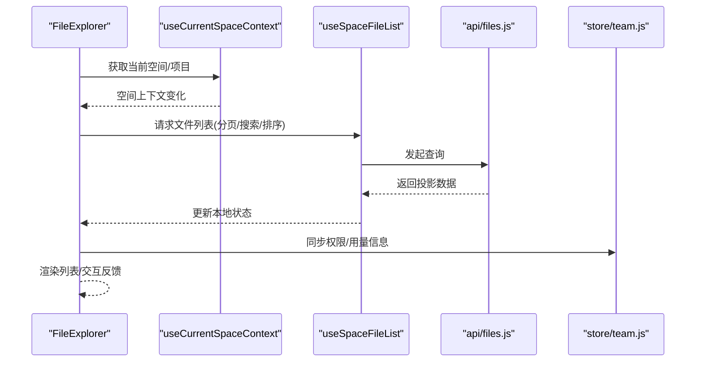
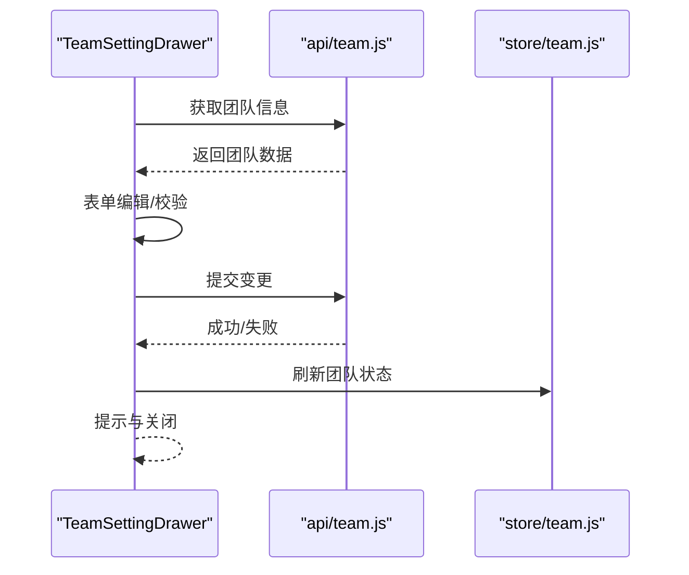
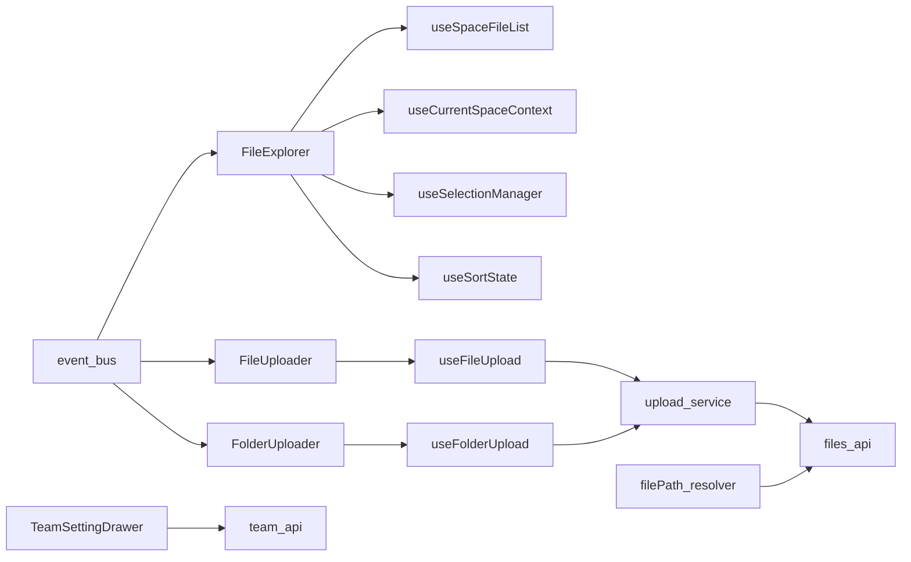

# 业务组件

<cite>
**本文引用的文件**   
- [FileUploader.vue](file://ZXYZdatabaseFront/src/components/FileUploader.vue)
- [FolderUploader.vue](file://ZXYZdatabaseFront/src/components/FolderUploader.vue)
- [FileExplorer.vue](file://ZXYZdatabaseFront/src/components/FileExplorer.vue)
- [TeamSettingDrawer.vue](file://ZXYZdatabaseFront/src/components/TeamSettingDrawer.vue)
- [useFileUpload.js](file://ZXYZdatabaseFront/src/composables/useFileUpload.js)
- [useFolderUpload.js](file://ZXYZdatabaseFront/src/composables/useFolderUpload.js)
- [useSpaceFileList.js](file://ZXYZdatabaseFront/src/composables/useSpaceFileList.js)
- [useCurrentSpaceContext.js](file://ZXYZdatabaseFront/src/composables/useCurrentSpaceContext.js)
- [useSelectionManager.js](file://ZXYZdatabaseFront/src/composables/useSelectionManager.js)
- [useSortState.js](file://ZXYZdatabaseFront/src/composables/useSortState.js)
- [upload.js](file://ZXYZdatabaseFront/src/services/upload.js)
- [filePathResolver.js](file://ZXYZdatabaseFront/src/services/filePathResolver.js)
- [eventEmitter.js](file://ZXYZdatabaseFront/src/utils/eventEmitter.js)
- [error.js](file://ZXYZdatabaseFront/src/utils/error.js)
- [format.js](file://ZXYZdatabaseFront/src/utils/format.js)
- [fileName.js](file://ZXYZdatabaseFront/src/utils/fileName.js)
- [fileValidation.js](file://ZXYZdatabaseFront/src/utils/fileValidation.js)
- [uploadProgress.js](file://ZXYZdatabaseFront/src/utils/uploadProgress.js)
- [files.js](file://ZXYZdatabaseFront/src/api/files.js)
- [team.js](file://ZXYZdatabaseFront/src/api/team.js)
- [store/currentUser.js](file://ZXYZdatabaseFront/src/store/currentUser.js)
- [store/team.js](file://ZXYZdatabaseFront/src/store/team.js)
- [models/file.js](file://ZXYZdatabaseFront/src/models/file.js)
- [models/space.js](file://ZXYZdatabaseFront/src/models/space.js)
- [models/upload.js](file://ZXYZdatabaseFront/src/models/upload.js)
</cite>

## 目录
1. [引言](#引言)
2. [项目结构](#项目结构)
3. [核心组件](#核心组件)
4. [架构总览](#架构总览)
5. [详细组件分析](#详细组件分析)
6. [依赖关系分析](#依赖关系分析)
7. [性能与体验优化](#性能与体验优化)
8. [故障排查指南](#故障排查指南)
9. [结论](#结论)
10. [附录：配置与扩展点](#附录配置与扩展点)

## 引言
本文件面向 ZXYZ 前端业务组件，聚焦复杂业务组件的架构设计与实现细节，包括文件上传器、文件夹上传器、文件浏览器、团队设置抽屉等。文档从状态管理、数据流处理、错误处理、用户交互逻辑入手，解释组件间通信机制（事件总线）、状态同步策略，并给出配置选项、自定义扩展点与集成指南。同时提供性能优化、内存管理与用户体验改进的最佳实践，帮助开发者快速理解并高效扩展这些核心组件。

## 项目结构
前端采用 Vue 3 Composition API + <script setup>，配合 Element Plus 自动导入与 Pinia 状态管理。业务逻辑通过 composables 封装，API 调用集中在 api 层，通用能力下沉到 utils 与 services，模型定义在 models 中。

图表来源 
- [FileUploader.vue](file://ZXYZdatabaseFront/src/components/FileUploader.vue)
- [FolderUploader.vue](file://ZXYZdatabaseFront/src/components/FolderUploader.vue)
- [FileExplorer.vue](file://ZXYZdatabaseFront/src/components/FileExplorer.vue)
- [TeamSettingDrawer.vue](file://ZXYZdatabaseFront/src/components/TeamSettingDrawer.vue)
- [useFileUpload.js](file://ZXYZdatabaseFront/src/composables/useFileUpload.js)
- [useFolderUpload.js](file://ZXYZdatabaseFront/src/composables/useFolderUpload.js)
- [useSpaceFileList.js](file://ZXYZdatabaseFront/src/composables/useSpaceFileList.js)
- [useCurrentSpaceContext.js](file://ZXYZdatabaseFront/src/composables/useCurrentSpaceContext.js)
- [useSelectionManager.js](file://ZXYZdatabaseFront/src/composables/useSelectionManager.js)
- [useSortState.js](file://ZXYZdatabaseFront/src/composables/useSortState.js)
- [upload.js](file://ZXYZdatabaseFront/src/services/upload.js)
- [filePathResolver.js](file://ZXYZdatabaseFront/src/services/filePathResolver.js)
- [eventEmitter.js](file://ZXYZdatabaseFront/src/utils/eventEmitter.js)
- [error.js](file://ZXYZdatabaseFront/src/utils/error.js)
- [format.js](file://ZXYZdatabaseFront/src/utils/format.js)
- [fileName.js](file://ZXYZdatabaseFront/src/utils/fileName.js)
- [fileValidation.js](file://ZXYZdatabaseFront/src/utils/fileValidation.js)
- [uploadProgress.js](file://ZXYZdatabaseFront/src/utils/uploadProgress.js)
- [files.js](file://ZXYZdatabaseFront/src/api/files.js)
- [team.js](file://ZXYZdatabaseFront/src/api/team.js)
- [store/currentUser.js](file://ZXYZdatabaseFront/src/store/currentUser.js)
- [store/team.js](file://ZXYZdatabaseFront/src/store/team.js)
- [models/file.js](file://ZXYZdatabaseFront/src/models/file.js)
- [models/space.js](file://ZXYZdatabaseFront/src/models/space.js)
- [models/upload.js](file://ZXYZdatabaseFront/src/models/upload.js)

章节来源
- [FileUploader.vue](file://ZXYZdatabaseFront/src/components/FileUploader.vue)
- [FolderUploader.vue](file://ZXYZdatabaseFront/src/components/FolderUploader.vue)
- [FileExplorer.vue](file://ZXYZdatabaseFront/src/components/FileExplorer.vue)
- [TeamSettingDrawer.vue](file://ZXYZdatabaseFront/src/components/TeamSettingDrawer.vue)
- [useFileUpload.js](file://ZXYZdatabaseFront/src/composables/useFileUpload.js)
- [useFolderUpload.js](file://ZXYZdatabaseFront/src/composables/useFolderUpload.js)
- [useSpaceFileList.js](file://ZXYZdatabaseFront/src/composables/useSpaceFileList.js)
- [useCurrentSpaceContext.js](file://ZXYZdatabaseFront/src/composables/useCurrentSpaceContext.js)
- [useSelectionManager.js](file://ZXYZdatabaseFront/src/composables/useSelectionManager.js)
- [useSortState.js](file://ZXYZdatabaseFront/src/composables/useSortState.js)
- [upload.js](file://ZXYZdatabaseFront/src/services/upload.js)
- [filePathResolver.js](file://ZXYZdatabaseFront/src/services/filePathResolver.js)
- [eventEmitter.js](file://ZXYZdatabaseFront/src/utils/eventEmitter.js)
- [error.js](file://ZXYZdatabaseFront/src/utils/error.js)
- [format.js](file://ZXYZdatabaseFront/src/utils/format.js)
- [fileName.js](file://ZXYZdatabaseFront/src/utils/fileName.js)
- [fileValidation.js](file://ZXYZdatabaseFront/src/utils/fileValidation.js)
- [uploadProgress.js](file://ZXYZdatabaseFront/src/utils/uploadProgress.js)
- [files.js](file://ZXYZdatabaseFront/src/api/files.js)
- [team.js](file://ZXYZdatabaseFront/src/api/team.js)
- [store/currentUser.js](file://ZXYZdatabaseFront/src/store/currentUser.js)
- [store/team.js](file://ZXYZdatabaseFront/src/store/team.js)
- [models/file.js](file://ZXYZdatabaseFront/src/models/file.js)
- [models/space.js](file://ZXYZdatabaseFront/src/models/space.js)
- [models/upload.js](file://ZXYZdatabaseFront/src/models/upload.js)

## 核心组件
- 文件上传器（FileUploader）：支持单文件/多文件选择、拖拽、分片上传、断点续传、并发控制、进度展示、失败重试、命名冲突处理、类型与大小校验、取消上传。
- 文件夹上传器（FolderUploader）：递归遍历本地目录、构建上传任务树、按层级顺序上传、失败子任务隔离与重试、整体进度聚合。
- 文件浏览器（FileExplorer）：空间/项目/共享/回收站等多视图切换、分页与搜索、排序与筛选、多选与批量操作、右键菜单、快捷键、路径导航、权限控制。
- 团队设置抽屉（TeamSettingDrawer）：团队基本信息、成员管理、请求审批、存储配额与用量、权限角色管理等面板的组合与联动。

章节来源
- [FileUploader.vue](file://ZXYZdatabaseFront/src/components/FileUploader.vue)
- [FolderUploader.vue](file://ZXYZdatabaseFront/src/components/FolderUploader.vue)
- [FileExplorer.vue](file://ZXYZdatabaseFront/src/components/FileExplorer.vue)
- [TeamSettingDrawer.vue](file://ZXYZdatabaseFront/src/components/TeamSettingDrawer.vue)

## 架构总览
组件通过组合式函数组织业务逻辑，API 层统一封装请求与响应解析，工具层提供事件总线、错误处理、格式化工具与上传进度跟踪。状态管理使用 Pinia store 与组件级 reactive/ref 结合，保证局部与全局状态的清晰边界。

图表来源 
- [useFileUpload.js](file://ZXYZdatabaseFront/src/composables/useFileUpload.js)
- [useFolderUpload.js](file://ZXYZdatabaseFront/src/composables/useFolderUpload.js)
- [upload.js](file://ZXYZdatabaseFront/src/services/upload.js)
- [files.js](file://ZXYZdatabaseFront/src/api/files.js)
- [eventEmitter.js](file://ZXYZdatabaseFront/src/utils/eventEmitter.js)

## 详细组件分析

### 文件上传器（FileUploader）
- 状态管理
  - 上传队列、当前任务、进度、错误、取消标志、并发限制、分片策略。
  - 使用 ref/reactive 维护局部状态，必要时与 Pinia store 同步（如全局上传计数）。
- 数据流
  - 选择文件 → 校验（类型/大小/命名冲突）→ 生成任务 → 分片/并发控制 → 进度上报 → 完成/失败回调 → 事件总线通知。
- 错误处理
  - 网络异常、服务端错误、权限不足、存储空间不足、重复文件名处理（重命名/覆盖确认）。
- 用户交互
  - 拖拽区域、点击选择、批量操作、暂停/继续、取消、重试、下载预览。
- 扩展点
  - 自定义校验规则、分片大小、并发数、上传前钩子、完成后回调、失败重试策略。

图表来源 
- [useFileUpload.js](file://ZXYZdatabaseFront/src/composables/useFileUpload.js)
- [upload.js](file://ZXYZdatabaseFront/src/services/upload.js)
- [fileValidation.js](file://ZXYZdatabaseFront/src/utils/fileValidation.js)
- [fileName.js](file://ZXYZdatabaseFront/src/utils/fileName.js)
- [uploadProgress.js](file://ZXYZdatabaseFront/src/utils/uploadProgress.js)
- [error.js](file://ZXYZdatabaseFront/src/utils/error.js)

章节来源
- [FileUploader.vue](file://ZXYZdatabaseFront/src/components/FileUploader.vue)
- [useFileUpload.js](file://ZXYZdatabaseFront/src/composables/useFileUpload.js)
- [upload.js](file://ZXYZdatabaseFront/src/services/upload.js)
- [fileValidation.js](file://ZXYZdatabaseFront/src/utils/fileValidation.js)
- [fileName.js](file://ZXYZdatabaseFront/src/utils/fileName.js)
- [uploadProgress.js](file://ZXYZdatabaseFront/src/utils/uploadProgress.js)
- [error.js](file://ZXYZdatabaseFront/src/utils/error.js)

### 文件夹上传器（FolderUploader）
- 状态管理
  - 目录树结构、任务依赖关系、层级顺序、失败隔离、整体进度聚合。
- 数据流
  - 读取目录 → 构建任务树 → 按父先子后顺序调度 → 子任务失败不影响兄弟任务 → 汇总结果。
- 错误处理
  - 单个文件失败不影响同目录其他文件；父目录失败则阻止子目录上传；提供重试与跳过选项。
- 用户交互
  - 选择文件夹、显示树形进度、展开/折叠、查看失败详情、一键重试失败项。
- 扩展点
  - 自定义过滤规则（忽略后缀/大小）、并行度控制、失败策略、进度聚合算法。

图表来源 
- [useFolderUpload.js](file://ZXYZdatabaseFront/src/composables/useFolderUpload.js)
- [upload.js](file://ZXYZdatabaseFront/src/services/upload.js)
- [fileValidation.js](file://ZXYZdatabaseFront/src/utils/fileValidation.js)
- [fileName.js](file://ZXYZdatabaseFront/src/utils/fileName.js)
- [uploadProgress.js](file://ZXYZdatabaseFront/src/utils/uploadProgress.js)

章节来源
- [FolderUploader.vue](file://ZXYZdatabaseFront/src/components/FolderUploader.vue)
- [useFolderUpload.js](file://ZXYZdatabaseFront/src/composables/useFolderUpload.js)
- [upload.js](file://ZXYZdatabaseFront/src/services/upload.js)
- [fileValidation.js](file://ZXYZdatabaseFront/src/utils/fileValidation.js)
- [fileName.js](file://ZXYZdatabaseFront/src/utils/fileName.js)
- [uploadProgress.js](file://ZXYZdatabaseFront/src/utils/uploadProgress.js)

### 文件浏览器（FileExplorer）
- 状态管理
  - 当前空间上下文、文件列表、分页、搜索、排序、筛选、多选集合、右键菜单状态、快捷键绑定。
- 数据流
  - 空间切换 → 拉取文件列表 → 本地缓存与增量更新 → 搜索/排序/筛选 → 渲染虚拟列表 → 批量操作。
- 错误处理
  - 网络错误降级、权限不足提示、空数据占位、加载骨架屏。
- 用户交互
  - 双击打开、拖拽移动、右键菜单、快捷键（删除/重命名/复制/粘贴）、路径面包屑导航。
- 扩展点
  - 自定义列、操作按钮、过滤规则、权限策略、视图模式（网格/列表）。

图表来源 
- [FileExplorer.vue](file://ZXYZdatabaseFront/src/components/FileExplorer.vue)
- [useSpaceFileList.js](file://ZXYZdatabaseFront/src/composables/useSpaceFileList.js)
- [useCurrentSpaceContext.js](file://ZXYZdatabaseFront/src/composables/useCurrentSpaceContext.js)
- [files.js](file://ZXYZdatabaseFront/src/api/files.js)
- [store/team.js](file://ZXYZdatabaseFront/src/store/team.js)

章节来源
- [FileExplorer.vue](file://ZXYZdatabaseFront/src/components/FileExplorer.vue)
- [useSpaceFileList.js](file://ZXYZdatabaseFront/src/composables/useSpaceFileList.js)
- [useCurrentSpaceContext.js](file://ZXYZdatabaseFront/src/composables/useCurrentSpaceContext.js)
- [useSelectionManager.js](file://ZXYZdatabaseFront/src/composables/useSelectionManager.js)
- [useSortState.js](file://ZXYZdatabaseFront/src/composables/useSortState.js)
- [files.js](file://ZXYZdatabaseFront/src/api/files.js)
- [store/team.js](file://ZXYZdatabaseFront/src/store/team.js)

### 团队设置抽屉（TeamSettingDrawer）
- 状态管理
  - 多个面板（基本信息、成员、请求、存储配额）的状态与切换、表单校验、提交反馈。
- 数据流
  - 打开抽屉 → 拉取团队信息 → 编辑保存 → 成功后刷新列表/提示 → 关闭抽屉。
- 错误处理
  - 表单校验失败、接口错误、权限不足、重复名称冲突。
- 用户交互
  - 标签页切换、弹窗确认、批量邀请、移除成员、配额调整。
- 扩展点
  - 新增面板、自定义字段、权限控制、消息提示样式。

图表来源 
- [TeamSettingDrawer.vue](file://ZXYZdatabaseFront/src/components/TeamSettingDrawer.vue)
- [team.js](file://ZXYZdatabaseFront/src/api/team.js)
- [store/team.js](file://ZXYZdatabaseFront/src/store/team.js)

章节来源
- [TeamSettingDrawer.vue](file://ZXYZdatabaseFront/src/components/TeamSettingDrawer.vue)
- [team.js](file://ZXYZdatabaseFront/src/api/team.js)
- [store/team.js](file://ZXYZdatabaseFront/src/store/team.js)

## 依赖关系分析
- 组件与组合式函数解耦：组件仅负责 UI 与用户交互，业务逻辑下沉至 composables，便于测试与复用。
- 服务层抽象：upload.js 统一封装上传流程，filePathResolver.js 解析路径与命名冲突，避免组件内重复实现。
- 事件总线：eventEmitter.js 用于跨组件通信（如上传完成通知列表刷新），降低直接耦合。
- 状态同步：Pinia store（currentUser、team）与组件级 reactive 分层明确，避免全局污染。
- 模型定义：models/* 集中定义数据结构与转换方法，确保前后端契约一致。

图表来源 
- [FileExplorer.vue](file://ZXYZdatabaseFront/src/components/FileExplorer.vue)
- [useSpaceFileList.js](file://ZXYZdatabaseFront/src/composables/useSpaceFileList.js)
- [useCurrentSpaceContext.js](file://ZXYZdatabaseFront/src/composables/useCurrentSpaceContext.js)
- [useSelectionManager.js](file://ZXYZdatabaseFront/src/composables/useSelectionManager.js)
- [useSortState.js](file://ZXYZdatabaseFront/src/composables/useSortState.js)
- [FileUploader.vue](file://ZXYZdatabaseFront/src/components/FileUploader.vue)
- [useFileUpload.js](file://ZXYZdatabaseFront/src/composables/useFileUpload.js)
- [FolderUploader.vue](file://ZXYZdatabaseFront/src/components/FolderUploader.vue)
- [useFolderUpload.js](file://ZXYZdatabaseFront/src/composables/useFolderUpload.js)
- [TeamSettingDrawer.vue](file://ZXYZdatabaseFront/src/components/TeamSettingDrawer.vue)
- [upload.js](file://ZXYZdatabaseFront/src/services/upload.js)
- [filePathResolver.js](file://ZXYZdatabaseFront/src/services/filePathResolver.js)
- [files.js](file://ZXYZdatabaseFront/src/api/files.js)
- [team.js](file://ZXYZdatabaseFront/src/api/team.js)
- [eventEmitter.js](file://ZXYZdatabaseFront/src/utils/eventEmitter.js)

章节来源
- [FileExplorer.vue](file://ZXYZdatabaseFront/src/components/FileExplorer.vue)
- [useSpaceFileList.js](file://ZXYZdatabaseFront/src/composables/useSpaceFileList.js)
- [useCurrentSpaceContext.js](file://ZXYZdatabaseFront/src/composables/useCurrentSpaceContext.js)
- [useSelectionManager.js](file://ZXYZdatabaseFront/src/composables/useSelectionManager.js)
- [useSortState.js](file://ZXYZdatabaseFront/src/composables/useSortState.js)
- [FileUploader.vue](file://ZXYZdatabaseFront/src/components/FileUploader.vue)
- [useFileUpload.js](file://ZXYZdatabaseFront/src/composables/useFileUpload.js)
- [FolderUploader.vue](file://ZXYZdatabaseFront/src/components/FolderUploader.vue)
- [useFolderUpload.js](file://ZXYZdatabaseFront/src/composables/useFolderUpload.js)
- [TeamSettingDrawer.vue](file://ZXYZdatabaseFront/src/components/TeamSettingDrawer.vue)
- [upload.js](file://ZXYZdatabaseFront/src/services/upload.js)
- [filePathResolver.js](file://ZXYZdatabaseFront/src/services/filePathResolver.js)
- [files.js](file://ZXYZdatabaseFront/src/api/files.js)
- [team.js](file://ZXYZdatabaseFront/src/api/team.js)
- [eventEmitter.js](file://ZXYZdatabaseFront/src/utils/eventEmitter.js)

## 性能与体验优化
- 列表渲染
  - 使用虚拟滚动与分页加载，减少首屏 DOM 节点数量；按需加载缩略图与懒加载。
- 上传优化
  - 分片上传与并发控制，合理设置分片大小与最大并发；失败指数退避重试；断点续传利用后端元数据。
- 内存管理
  - 及时释放大对象引用（图片 Blob URL 撤销）；取消未完成的请求；避免闭包持有长生命周期引用。
- 网络优化
  - 请求去抖与节流（搜索、滚动）；合并批量操作；缓存热点数据（空间信息、权限）。
- 用户体验
  - 骨架屏与占位符；清晰的错误提示与恢复路径；键盘可达性与无障碍支持；操作反馈（Toast/步骤条）。

[本节为通用指导，不直接分析具体文件]

## 故障排查指南
- 常见问题定位
  - 上传失败：检查网络错误、权限、存储空间、命名冲突；查看事件总线日志与进度回调。
  - 列表不更新：确认空间上下文变化、分页参数、缓存失效；检查事件总线是否派发完成事件。
  - 权限问题：核对用户角色与资源权限；查看 store/team 中的权限状态。
- 调试建议
  - 使用浏览器开发者工具监控网络请求与响应；打印关键状态变化；在组合式函数中添加日志。
  - 对错误进行分级（用户可恢复 vs 不可恢复），并提供重试与回滚机制。

章节来源
- [error.js](file://ZXYZdatabaseFront/src/utils/error.js)
- [eventEmitter.js](file://ZXYZdatabaseFront/src/utils/eventEmitter.js)
- [store/team.js](file://ZXYZdatabaseFront/src/store/team.js)
- [files.js](file://ZXYZdatabaseFront/src/api/files.js)

## 结论
ZXYZ 前端业务组件通过清晰的层次划分与组合式逻辑封装，实现了高内聚、低耦合的架构设计。文件上传器与文件夹上传器具备完善的错误处理与用户体验；文件浏览器支持多视图与批量操作；团队设置抽屉提供灵活的配置与管理。借助事件总线与状态管理，组件间通信顺畅且易于扩展。遵循本文的性能优化与最佳实践，可进一步提升系统稳定性与用户体验。

[本节为总结性内容，不直接分析具体文件]

## 附录：配置与扩展点
- 文件上传器配置
  - 分片大小、并发数、重试次数、超时时间、允许的文件类型与大小上限、命名冲突策略（覆盖/重命名/拒绝）。
- 文件夹上传器配置
  - 目录遍历深度、忽略规则（后缀/大小）、父子任务依赖策略、失败隔离级别。
- 文件浏览器配置
  - 默认视图模式、排序字段、分页大小、搜索延迟、批量操作权限。
- 团队设置抽屉配置
  - 面板可见性、字段校验规则、权限控制、消息提示样式。
- 集成指南
  - 在组件中引入对应 composables，传入必要 props；通过事件总线订阅上传与列表更新事件；根据权限动态渲染操作按钮。

章节来源
- [useFileUpload.js](file://ZXYZdatabaseFront/src/composables/useFileUpload.js)
- [useFolderUpload.js](file://ZXYZdatabaseFront/src/composables/useFolderUpload.js)
- [useSpaceFileList.js](file://ZXYZdatabaseFront/src/composables/useSpaceFileList.js)
- [useCurrentSpaceContext.js](file://ZXYZdatabaseFront/src/composables/useCurrentSpaceContext.js)
- [eventEmitter.js](file://ZXYZdatabaseFront/src/utils/eventEmitter.js)
- [files.js](file://ZXYZdatabaseFront/src/api/files.js)
- [team.js](file://ZXYZdatabaseFront/src/api/team.js)