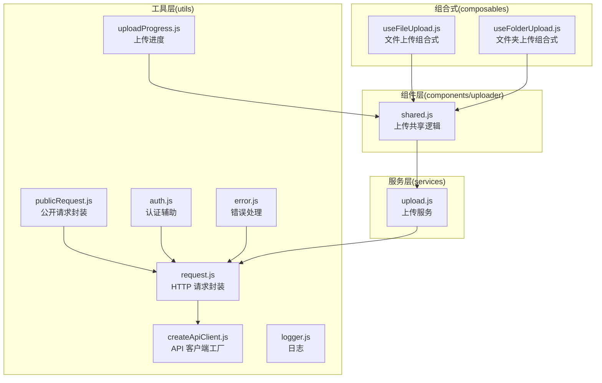
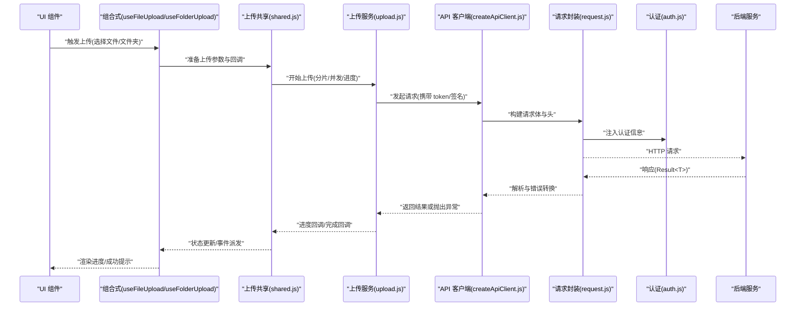
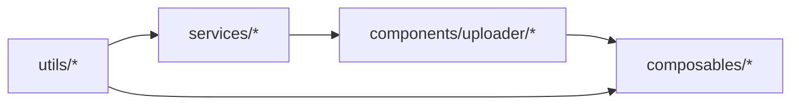

# 共享工具

<cite>
**本文引用的文件**   
- [ZXYZdatabaseFront/src/utils/request.js](file://ZXYZdatabaseFront/src/utils/request.js)
- [ZXYZdatabaseFront/src/utils/createApiClient.js](file://ZXYZdatabaseFront/src/utils/createApiClient.js)
- [ZXYZdatabaseFront/src/utils/publicRequest.js](file://ZXYZdatabaseFront/src/utils/publicRequest.js)
- [ZXYZdatabaseFront/src/utils/auth.js](file://ZXYZdatabaseFront/src/utils/auth.js)
- [ZXYZdatabaseFront/src/utils/uploadProgress.js](file://ZXYZdatabaseFront/src/utils/uploadProgress.js)
- [ZXYZdatabaseFront/src/services/upload.js](file://ZXYZdatabaseFront/src/services/upload.js)
- [ZXYZdatabaseFront/src/components/uploader/shared.js](file://ZXYZdatabaseFront/src/components/uploader/shared.js)
- [ZXYZdatabaseFront/src/composables/useFileUpload.js](file://ZXYZdatabaseFront/src/composables/useFileUpload.js)
- [ZXYZdatabaseFront/src/composables/useFolderUpload.js](file://ZXYZdatabaseFront/src/composables/useFolderUpload.js)
- [ZXYZdatabaseFront/src/utils/error.js](file://ZXYZdatabaseFront/src/utils/error.js)
- [ZXYZdatabaseFront/src/utils/logger.js](file://ZXYZdatabaseFront/src/utils/logger.js)
- [ZXYZdatabaseFront/src/api/README.md](file://ZXYZdatabaseFront/src/api/README.md)
- [ZXYZdatabaseFront/package.json](file://ZXYZdatabaseFront/package.json)
</cite>

## 目录
1. [引言](#引言)
2. [项目结构](#项目结构)
3. [核心组件](#核心组件)
4. [架构总览](#架构总览)
5. [详细组件分析](#详细组件分析)
6. [依赖分析](#依赖分析)
7. [性能考虑](#性能考虑)
8. [故障排查指南](#故障排查指南)
9. [结论](#结论)
10. [附录](#附录)

## 引言
本文件面向 ZXYZ 前端共享工具库，聚焦通用工具函数的设计、实现与使用，重点覆盖：
- 文件上传共享逻辑（单文件、文件夹、进度上报）
- API 客户端封装（请求拦截器、统一错误处理、认证注入）
- 公共请求封装（无需鉴权的公开接口）
- 模块化组织、依赖管理与版本兼容性
- 测试策略、错误处理与调试技巧
- 扩展方法与自定义配置选项

该工具库为 Vue 3 + Element Plus 前端应用提供稳定、可复用的网络与上传能力，确保前后端交互一致性与可维护性。

## 项目结构
前端工具库主要分布在 utils、services、components/uploader 与 composables 四个层次：
- utils：底层网络请求、认证、错误、日志等通用工具
- services：面向业务场景的封装（如 upload.js）
- components/uploader：UI 层共享的上传逻辑
- composables：组合式函数，聚合状态与行为（如 useFileUpload、useFolderUpload）

图表来源
- [ZXYZdatabaseFront/src/utils/request.js](file://ZXYZdatabaseFront/src/utils/request.js)
- [ZXYZdatabaseFront/src/utils/createApiClient.js](file://ZXYZdatabaseFront/src/utils/createApiClient.js)
- [ZXYZdatabaseFront/src/utils/publicRequest.js](file://ZXYZdatabaseFront/src/utils/publicRequest.js)
- [ZXYZdatabaseFront/src/utils/auth.js](file://ZXYZdatabaseFront/src/utils/auth.js)
- [ZXYZdatabaseFront/src/utils/error.js](file://ZXYZdatabaseFront/src/utils/error.js)
- [ZXYZdatabaseFront/src/utils/logger.js](file://ZXYZdatabaseFront/src/utils/logger.js)
- [ZXYZdatabaseFront/src/utils/uploadProgress.js](file://ZXYZdatabaseFront/src/utils/uploadProgress.js)
- [ZXYZdatabaseFront/src/services/upload.js](file://ZXYZdatabaseFront/src/services/upload.js)
- [ZXYZdatabaseFront/src/components/uploader/shared.js](file://ZXYZdatabaseFront/src/components/uploader/shared.js)
- [ZXYZdatabaseFront/src/composables/useFileUpload.js](file://ZXYZdatabaseFront/src/composables/useFileUpload.js)
- [ZXYZdatabaseFront/src/composables/useFolderUpload.js](file://ZXYZdatabaseFront/src/composables/useFolderUpload.js)

章节来源
- [ZXYZdatabaseFront/src/api/README.md](file://ZXYZdatabaseFront/src/api/README.md)
- [ZXYZdatabaseFront/package.json](file://ZXYZdatabaseFront/package.json)

## 核心组件
本节概述工具库的核心职责与协作关系：
- HTTP 请求封装：统一发起请求、设置超时、重试、错误转换与日志记录
- API 客户端工厂：按模块生成带基础路径、拦截器的客户端实例
- 公开请求封装：用于无需鉴权的接口（如登录、注册、验证码）
- 认证辅助：管理 HttpOnly Cookie 与 Session 相关流程
- 上传服务：封装分片、并发、断点续传、进度上报等能力
- 上传共享逻辑：供 UI 组件复用，屏蔽细节差异
- 组合式函数：将上传状态、事件与生命周期整合到组件中

章节来源
- [ZXYZdatabaseFront/src/utils/request.js](file://ZXYZdatabaseFront/src/utils/request.js)
- [ZXYZdatabaseFront/src/utils/createApiClient.js](file://ZXYZdatabaseFront/src/utils/createApiClient.js)
- [ZXYZdatabaseFront/src/utils/publicRequest.js](file://ZXYZdatabaseFront/src/utils/publicRequest.js)
- [ZXYZdatabaseFront/src/utils/auth.js](file://ZXYZdatabaseFront/src/utils/auth.js)
- [ZXYZdatabaseFront/src/services/upload.js](file://ZXYZdatabaseFront/src/services/upload.js)
- [ZXYZdatabaseFront/src/components/uploader/shared.js](file://ZXYZdatabaseFront/src/components/uploader/shared.js)
- [ZXYZdatabaseFront/src/composables/useFileUpload.js](file://ZXYZdatabaseFront/src/composables/useFileUpload.js)
- [ZXYZdatabaseFront/src/composables/useFolderUpload.js](file://ZXYZdatabaseFront/src/composables/useFolderUpload.js)

## 架构总览
下图展示从组件到后端接口的完整调用链，包括认证、拦截器、错误处理与上传流程。

图表来源
- [ZXYZdatabaseFront/src/composables/useFileUpload.js](file://ZXYZdatabaseFront/src/composables/useFileUpload.js)
- [ZXYZdatabaseFront/src/composables/useFolderUpload.js](file://ZXYZdatabaseFront/src/composables/useFolderUpload.js)
- [ZXYZdatabaseFront/src/components/uploader/shared.js](file://ZXYZdatabaseFront/src/components/uploader/shared.js)
- [ZXYZdatabaseFront/src/services/upload.js](file://ZXYZdatabaseFront/src/services/upload.js)
- [ZXYZdatabaseFront/src/utils/createApiClient.js](file://ZXYZdatabaseFront/src/utils/createApiClient.js)
- [ZXYZdatabaseFront/src/utils/request.js](file://ZXYZdatabaseFront/src/utils/request.js)
- [ZXYZdatabaseFront/src/utils/auth.js](file://ZXYZdatabaseFront/src/utils/auth.js)

## 详细组件分析

### HTTP 请求封装（request.js）
- 职责：统一发起 HTTP 请求，处理超时、重试、错误转换、日志与跨域配置
- 关键特性：
  - 请求拦截：自动附加认证头、追踪 ID、请求时间戳
  - 响应拦截：统一解析 Result<T>，失败时转换为标准错误对象
  - 错误分类：网络错误、业务错误、超时、权限不足等
  - 日志输出：请求/响应摘要、耗时、错误堆栈
- 使用方式：
  - 通过 createApiClient 生成模块级客户端
  - 直接调用 request.get/post/put/delete 等方法
- 返回值：
  - 成功：业务数据（Result.data）
  - 失败：标准化错误对象（含 code、message、stack）

章节来源
- [ZXYZdatabaseFront/src/utils/request.js](file://ZXYZdatabaseFront/src/utils/request.js)
- [ZXYZdatabaseFront/src/utils/error.js](file://ZXYZdatabaseFront/src/utils/error.js)
- [ZXYZdatabaseFront/src/utils/logger.js](file://ZXYZdatabaseFront/src/utils/logger.js)

### API 客户端工厂（createApiClient.js）
- 职责：为不同模块创建带基础路径与默认配置的客户端实例
- 关键特性：
  - 基础路径隔离（如 /api/file、/api/share）
  - 默认头与超时配置
  - 可选的请求/响应拦截器注入
- 使用方式：
  - 在 api 模块中引入并实例化
  - 暴露方法给页面或组合式函数使用

章节来源
- [ZXYZdatabaseFront/src/utils/createApiClient.js](file://ZXYZdatabaseFront/src/utils/createApiClient.js)

### 公开请求封装（publicRequest.js）
- 职责：封装无需鉴权的接口（登录、注册、验证码、公开资源）
- 关键特性：
  - 跳过认证拦截
  - 支持表单提交与 JSON 提交
  - 统一错误处理与日志
- 使用方式：
  - 直接调用 get/post 等方法
  - 适用于路由守卫前的认证流程

章节来源
- [ZXYZdatabaseFront/src/utils/publicRequest.js](file://ZXYZdatabaseFront/src/utils/publicRequest.js)

### 认证辅助（auth.js）
- 职责：管理认证状态、Token 刷新、Session 校验
- 关键特性：
  - HttpOnly Cookie 读取与校验
  - 登录态保持与失效处理
  - 与网关 Sa-Token 过滤器协同
- 使用方式：
  - 在请求拦截器中注入认证信息
  - 在路由守卫中检查登录态

章节来源
- [ZXYZdatabaseFront/src/utils/auth.js](file://ZXYZdatabaseFront/src/utils/auth.js)

### 上传服务（upload.js）
- 职责：封装文件上传的核心逻辑（分片、并发、断点续传、进度上报）
- 关键特性：
  - 分片大小与并发数可调
  - 支持 MD5 校验与断点续传
  - 进度回调与错误重试
  - 与后端存储提供者解耦
- 使用方式：
  - 由 shared.js 或组合式函数调用
  - 传入文件对象、回调函数与配置项

章节来源
- [ZXYZdatabaseFront/src/services/upload.js](file://ZXYZdatabaseFront/src/services/upload.js)
- [ZXYZdatabaseFront/src/utils/uploadProgress.js](file://ZXYZdatabaseFront/src/utils/uploadProgress.js)

### 上传共享逻辑（components/uploader/shared.js）
- 职责：为多个上传组件提供统一的上传入口与状态管理
- 关键特性：
  - 文件选择、预览、校验
  - 上传队列与并发控制
  - 进度条与取消上传
  - 错误重试与用户反馈
- 使用方式：
  - 被 FileUploader、FolderUploader 等组件引用
  - 暴露方法：start、pause、cancel、retry

章节来源
- [ZXYZdatabaseFront/src/components/uploader/shared.js](file://ZXYZdatabaseFront/src/components/uploader/shared.js)

### 组合式函数（useFileUpload.js, useFolderUpload.js）
- 职责：将上传逻辑与组件状态结合，提供响应式 API
- 关键特性：
  - 文件列表与状态管理
  - 上传进度与结果回调
  - 错误处理与用户提示
  - 与路由、弹窗、通知系统集成
- 使用方式：
  - 在 <script setup> 中引入并使用
  - 绑定到模板中的按钮、进度条、列表

章节来源
- [ZXYZdatabaseFront/src/composables/useFileUpload.js](file://ZXYZdatabaseFront/src/composables/useFileUpload.js)
- [ZXYZdatabaseFront/src/composables/useFolderUpload.js](file://ZXYZdatabaseFront/src/composables/useFolderUpload.js)

## 依赖分析
工具库内部依赖关系清晰，遵循分层原则：
- utils 层不依赖 services、components、composables
- services 依赖 utils
- components 依赖 services 与 utils
- composables 依赖 components 与 services

图表来源
- [ZXYZdatabaseFront/src/utils/request.js](file://ZXYZdatabaseFront/src/utils/request.js)
- [ZXYZdatabaseFront/src/services/upload.js](file://ZXYZdatabaseFront/src/services/upload.js)
- [ZXYZdatabaseFront/src/components/uploader/shared.js](file://ZXYZdatabaseFront/src/components/uploader/shared.js)
- [ZXYZdatabaseFront/src/composables/useFileUpload.js](file://ZXYZdatabaseFront/src/composables/useFileUpload.js)

章节来源
- [ZXYZdatabaseFront/package.json](file://ZXYZdatabaseFront/package.json)

## 性能考虑
- 请求优化：
  - 合理设置超时与重试次数
  - 使用缓存策略减少重复请求
  - 批量请求合并
- 上传优化：
  - 动态调整分片大小与并发数
  - 利用浏览器原生 Blob.slice 进行分片
  - 断点续传避免重复传输
- 内存管理：
  - 及时释放大文件引用
  - 避免长时间持有上传任务
- 网络监控：
  - 记录关键指标（耗时、成功率、错误率）
  - 集成性能监控平台

## 故障排查指南
- 常见问题：
  - 认证失败：检查 Cookie 与 Session 状态
  - 上传中断：确认网络稳定性与服务端分片支持
  - 进度不更新：检查进度回调是否正确绑定
- 调试技巧：
  - 启用详细日志（request.js 与 logger.js）
  - 使用浏览器开发者工具查看 Network 面板
  - 模拟错误场景（超时、401、500）
- 错误处理：
  - 统一错误码映射
  - 用户友好提示
  - 自动重试机制

章节来源
- [ZXYZdatabaseFront/src/utils/error.js](file://ZXYZdatabaseFront/src/utils/error.js)
- [ZXYZdatabaseFront/src/utils/logger.js](file://ZXYZdatabaseFront/src/utils/logger.js)
- [ZXYZdatabaseFront/src/utils/request.js](file://ZXYZdatabaseFront/src/utils/request.js)

## 结论
ZXYZ 前端共享工具库通过清晰的模块化设计与完善的错误处理机制，为文件上传与 API 调用提供了稳定可靠的支撑。建议在实际使用中：
- 严格遵循工具库的使用规范
- 充分利用组合式函数简化组件逻辑
- 持续优化性能与用户体验
- 完善测试覆盖与监控告警

## 附录
- 版本兼容性：基于 Vue 3.5 + Element Plus，需 Node.js 16+
- 扩展方法：可通过拦截器扩展请求行为，通过插件机制扩展上传功能
- 配置选项：支持环境变量与运行时配置切换