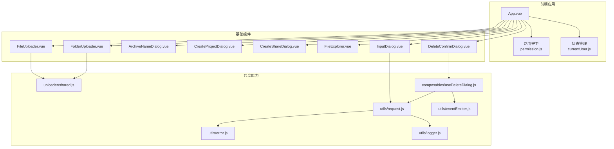
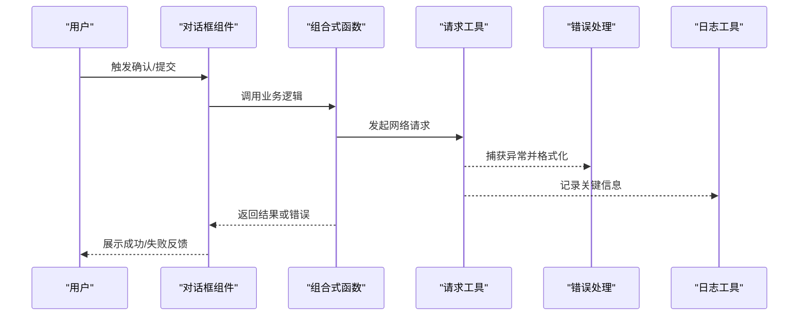
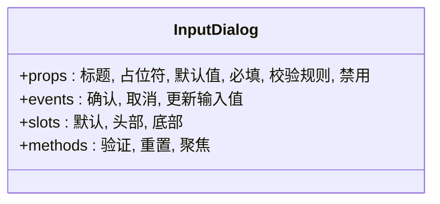
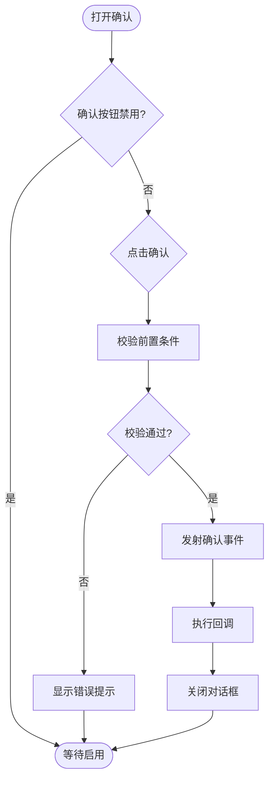
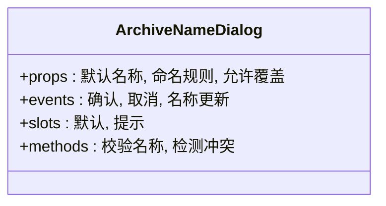
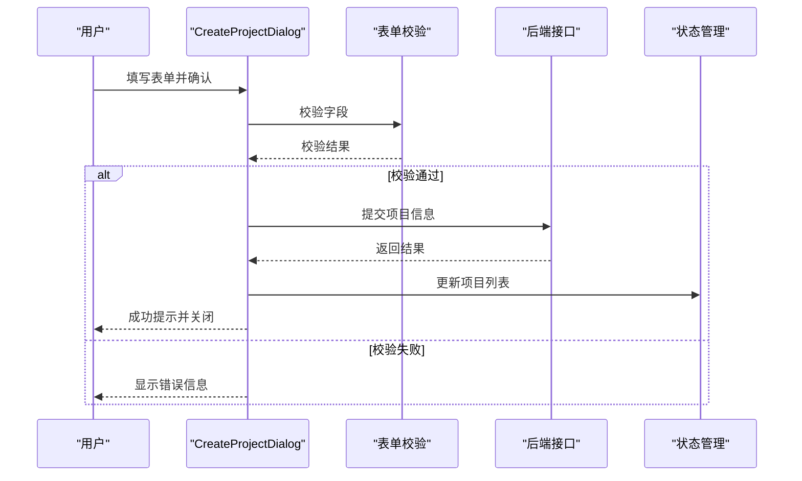
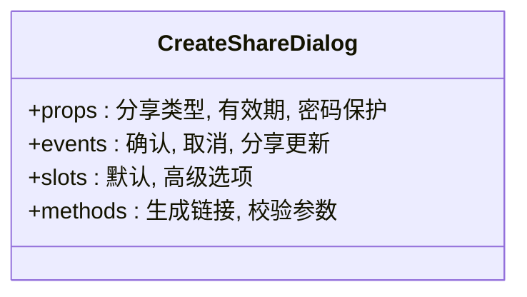
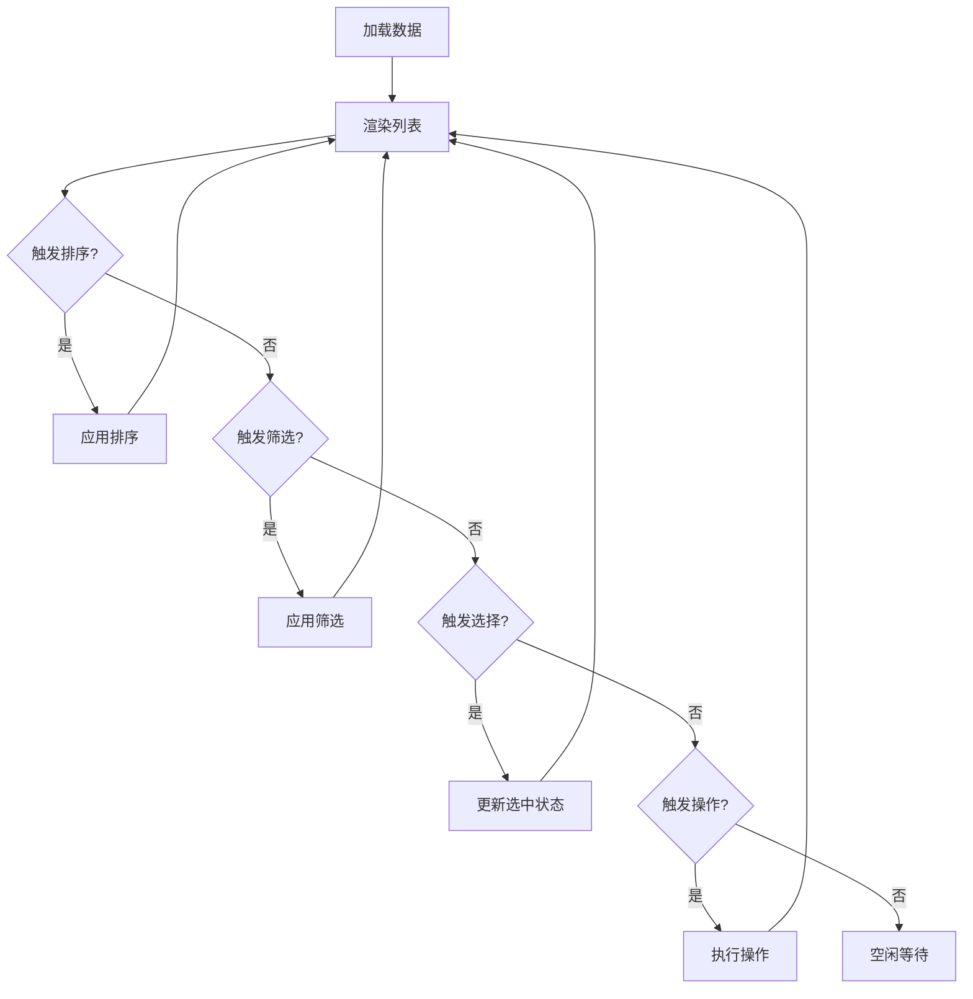
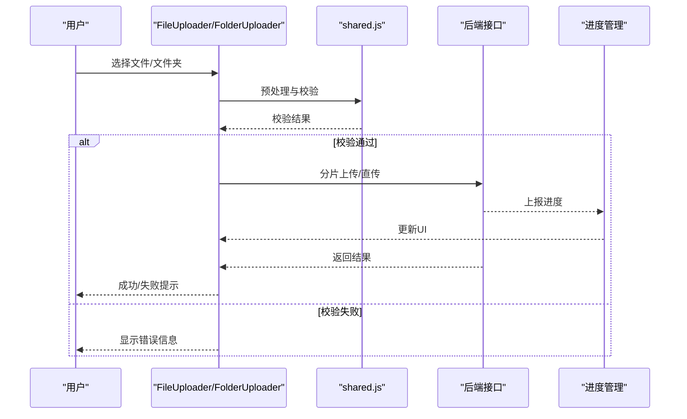
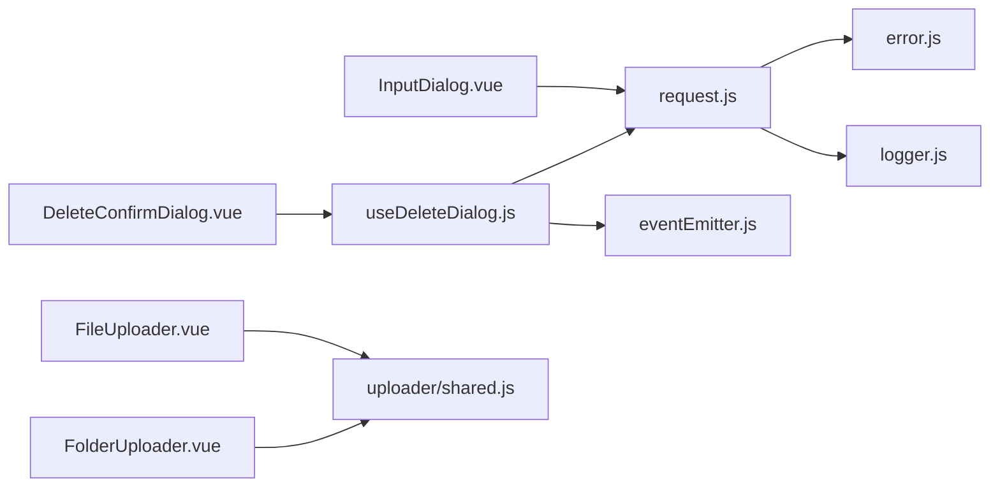

# 基础组件

<cite>
**本文引用的文件**   
- [src/components/InputDialog.vue](file://ZXYZdatabaseFront/src/components/InputDialog.vue)
- [src/components/DeleteConfirmDialog.vue](file://ZXYZdatabaseFront/src/components/DeleteConfirmDialog.vue)
- [src/components/ArchiveNameDialog.vue](file://ZXYZdatabaseFront/src/components/ArchiveNameDialog.vue)
- [src/components/CreateProjectDialog.vue](file://ZXYZdatabaseFront/src/components/CreateProjectDialog.vue)
- [src/components/CreateShareDialog.vue](file://ZXYZdatabaseFront/src/components/CreateShareDialog.vue)
- [src/components/FileExplorer.vue](file://ZXYZdatabaseFront/src/components/FileExplorer.vue)
- [src/components/FileUploader.vue](file://ZXYZdatabaseFront/src/components/FileUploader.vue)
- [src/components/FolderUploader.vue](file://ZXYZdatabaseFront/src/components/FolderUploader.vue)
- [src/components/uploader/shared.js](file://ZXYZdatabaseFront/src/components/uploader/shared.js)
- [src/composables/useDeleteDialog.js](file://ZXYZdatabaseFront/src/composables/useDeleteDialog.js)
- [src/utils/request.js](file://ZXYZdatabaseFront/src/utils/request.js)
- [src/utils/error.js](file://ZXYZdatabaseFront/src/utils/error.js)
- [src/utils/logger.js](file://ZXYZdatabaseFront/src/utils/logger.js)
- [src/utils/eventEmitter.js](file://ZXYZdatabaseFront/src/utils/eventEmitter.js)
- [src/store/currentUser.js](file://ZXYZdatabaseFront/src/store/currentUser.js)
- [src/router/guards/permission.js](file://ZXYZdatabaseFront/src/router/guards/permission.js)
- [package.json](file://ZXYZdatabaseFront/package.json)
- [vite.config.js](file://ZXYZdatabaseFront/vite.config.js)
</cite>

## 目录
1. [简介](#简介)
2. [项目结构](#项目结构)
3. [核心组件](#核心组件)
4. [架构总览](#架构总览)
5. [详细组件分析](#详细组件分析)
6. [依赖关系分析](#依赖关系分析)
7. [性能考量](#性能考量)
8. [故障排查指南](#故障排查指南)
9. [结论](#结论)
10. [附录](#附录)

## 简介
本文件为 ZXYZ 前端基础组件的权威文档，聚焦对话框、输入框、确认框等通用 UI 组件的设计原则与开发规范。内容涵盖：
- Props 定义规范、事件发射机制、插槽使用方式
- 样式隔离策略、响应式设计、可访问性支持与主题定制
- 组件 API 参考、使用示例与最佳实践
- 测试方法与性能优化建议

该文档面向初学者与资深开发者，力求以循序渐进的方式帮助读者理解并正确使用基础组件。

## 项目结构
前端采用 Vue 3 Composition API + <script setup>，Element Plus 自动导入，Pinia 状态管理，composables 封装业务逻辑。基础组件集中在 src/components 目录，通用能力通过 composables 和 utils 提供。

图表来源
- [src/components/InputDialog.vue](file://ZXYZdatabaseFront/src/components/InputDialog.vue)
- [src/components/DeleteConfirmDialog.vue](file://ZXYZdatabaseFront/src/components/DeleteConfirmDialog.vue)
- [src/components/ArchiveNameDialog.vue](file://ZXYZdatabaseFront/src/components/ArchiveNameDialog.vue)
- [src/components/CreateProjectDialog.vue](file://ZXYZdatabaseFront/src/components/CreateProjectDialog.vue)
- [src/components/CreateShareDialog.vue](file://ZXYZdatabaseFront/src/components/CreateShareDialog.vue)
- [src/components/FileExplorer.vue](file://ZXYZdatabaseFront/src/components/FileExplorer.vue)
- [src/components/FileUploader.vue](file://ZXYZdatabaseFront/src/components/FileUploader.vue)
- [src/components/FolderUploader.vue](file://ZXYZdatabaseFront/src/components/FolderUploader.vue)
- [src/components/uploader/shared.js](file://ZXYZdatabaseFront/src/components/uploader/shared.js)
- [src/utils/request.js](file://ZXYZdatabaseFront/src/utils/request.js)
- [src/utils/error.js](file://ZXYZdatabaseFront/src/utils/error.js)
- [src/utils/logger.js](file://ZXYZdatabaseFront/src/utils/logger.js)
- [src/utils/eventEmitter.js](file://ZXYZdatabaseFront/src/utils/eventEmitter.js)
- [src/composables/useDeleteDialog.js](file://ZXYZdatabaseFront/src/composables/useDeleteDialog.js)
- [src/store/currentUser.js](file://ZXYZdatabaseFront/src/store/currentUser.js)
- [src/router/guards/permission.js](file://ZXYZdatabaseFront/src/router/guards/permission.js)

章节来源
- [package.json](file://ZXYZdatabaseFront/package.json)
- [vite.config.js](file://ZXYZdatabaseFront/vite.config.js)

## 核心组件
本节概述基础组件的设计原则与开发规范，适用于对话框、输入框、确认框等通用 UI 组件。

- 设计原则
  - 单一职责：每个组件只负责一个明确的交互场景（如“输入名称”、“删除确认”）。
  - 可控性与受控模式：优先通过 props 控制显示与值，通过事件向外暴露变更。
  - 可组合性：通过插槽与具名插槽扩展内容，避免硬编码布局。
  - 可访问性：遵循 ARIA 语义，确保键盘导航与屏幕阅读器可用。
  - 主题化：基于 CSS 变量或主题系统，支持明暗主题切换。
  - 响应式：适配移动端与桌面端，使用弹性布局与断点。

- Props 定义规范
  - 命名：kebab-case，语义清晰，避免缩写。
  - 类型与默认值：明确类型，提供合理默认值；对布尔型使用 Boolean 类型。
  - 必填校验：在组件内校验并给出友好提示。
  - 透传属性：合理使用 v-bind="$attrs" 透传非 props 属性。

- 事件发射机制
  - 命名：小写动词短语，如 open、close、confirm、cancel、update:modelValue。
  - 参数：最小必要参数，必要时附带上下文对象。
  - 同步与异步：异步操作应在回调中处理，避免副作用泄漏。

- 插槽使用方式
  - 默认插槽：用于主体内容。
  - 具名插槽：用于头部、底部、辅助信息等区域。
  - 作用域插槽：向父组件传递内部数据，便于外部渲染。

- 样式隔离策略
  - 使用 scoped 样式或 CSS Modules，避免全局污染。
  - 通过 CSS 变量统一主题色、字号、间距等。
  - 对外暴露 class 钩子，便于覆盖样式。

- 响应式设计与可访问性
  - 使用媒体查询与弹性布局实现自适应。
  - 添加 aria-* 属性与 role，确保键盘可达。
  - 焦点管理：打开时聚焦到首个可交互元素，关闭时恢复焦点。

- 主题定制能力
  - 通过 CSS 变量或主题配置项覆盖颜色、圆角、阴影等。
  - 支持运行时切换主题，保持组件一致性。

章节来源
- [src/components/InputDialog.vue](file://ZXYZdatabaseFront/src/components/InputDialog.vue)
- [src/components/DeleteConfirmDialog.vue](file://ZXYZdatabaseFront/src/components/DeleteConfirmDialog.vue)
- [src/components/ArchiveNameDialog.vue](file://ZXYZdatabaseFront/src/components/ArchiveNameDialog.vue)
- [src/components/CreateProjectDialog.vue](file://ZXYZdatabaseFront/src/components/CreateProjectDialog.vue)
- [src/components/CreateShareDialog.vue](file://ZXYZdatabaseFront/src/components/CreateShareDialog.vue)
- [src/components/FileExplorer.vue](file://ZXYZdatabaseFront/src/components/FileExplorer.vue)
- [src/components/FileUploader.vue](file://ZXYZdatabaseFront/src/components/FileUploader.vue)
- [src/components/FolderUploader.vue](file://ZXYZdatabaseFront/src/components/FolderUploader.vue)

## 架构总览
基础组件通过统一的请求与错误处理工具进行后端交互，并通过事件总线或组合式函数协调跨组件行为。

图表来源
- [src/components/DeleteConfirmDialog.vue](file://ZXYZdatabaseFront/src/components/DeleteConfirmDialog.vue)
- [src/composables/useDeleteDialog.js](file://ZXYZdatabaseFront/src/composables/useDeleteDialog.js)
- [src/utils/request.js](file://ZXYZdatabaseFront/src/utils/request.js)
- [src/utils/error.js](file://ZXYZdatabaseFront/src/utils/error.js)
- [src/utils/logger.js](file://ZXYZdatabaseFront/src/utils/logger.js)

## 详细组件分析

### 输入对话框（InputDialog）
- 职责：提供可定制的输入表单，支持标题、占位符、校验规则与回调。
- Props：标题、占位符、默认值、是否必填、校验规则、是否禁用等。
- 事件：确认、取消、更新输入值。
- 插槽：自定义输入控件、辅助说明、底部按钮区。
- 样式：支持主题变量，响应式宽度。
- 可访问性：标签关联、错误提示、键盘导航。

图表来源
- [src/components/InputDialog.vue](file://ZXYZdatabaseFront/src/components/InputDialog.vue)

章节来源
- [src/components/InputDialog.vue](file://ZXYZdatabaseFront/src/components/InputDialog.vue)

### 删除确认对话框（DeleteConfirmDialog）
- 职责：在执行危险操作前进行二次确认，支持自定义文案与回调。
- Props：标题、提示信息、确认文案、取消文案、是否禁用确认按钮等。
- 事件：确认、取消。
- 插槽：自定义提示内容、附加说明。
- 样式：强调危险操作的视觉差异。
- 可访问性：高对比度、键盘可达、屏幕阅读器友好。

图表来源
- [src/components/DeleteConfirmDialog.vue](file://ZXYZdatabaseFront/src/components/DeleteConfirmDialog.vue)
- [src/composables/useDeleteDialog.js](file://ZXYZdatabaseFront/src/composables/useDeleteDialog.js)

章节来源
- [src/components/DeleteConfirmDialog.vue](file://ZXYZdatabaseFront/src/components/DeleteConfirmDialog.vue)
- [src/composables/useDeleteDialog.js](file://ZXYZdatabaseFront/src/composables/useDeleteDialog.js)

### 归档名称对话框（ArchiveNameDialog）
- 职责：收集归档文件名，支持命名规则校验与冲突检测。
- Props：默认名称、命名规则、是否允许覆盖等。
- 事件：确认、取消、名称更新。
- 插槽：自定义校验提示、额外字段。
- 样式：与主题一致，错误状态高亮。
- 可访问性：实时校验提示、键盘导航。

图表来源
- [src/components/ArchiveNameDialog.vue](file://ZXYZdatabaseFront/src/components/ArchiveNameDialog.vue)

章节来源
- [src/components/ArchiveNameDialog.vue](file://ZXYZdatabaseFront/src/components/ArchiveNameDialog.vue)

### 创建项目对话框（CreateProjectDialog）
- 职责：引导用户填写项目基本信息并提交。
- Props：表单字段、校验规则、提交回调。
- 事件：确认、取消、表单更新。
- 插槽：自定义字段、帮助文本。
- 样式：表单布局自适应，错误提示清晰。
- 可访问性：表单标签、错误朗读、键盘顺序。

图表来源
- [src/components/CreateProjectDialog.vue](file://ZXYZdatabaseFront/src/components/CreateProjectDialog.vue)
- [src/store/currentUser.js](file://ZXYZdatabaseFront/src/store/currentUser.js)

章节来源
- [src/components/CreateProjectDialog.vue](file://ZXYZdatabaseFront/src/components/CreateProjectDialog.vue)
- [src/store/currentUser.js](file://ZXYZdatabaseFront/src/store/currentUser.js)

### 创建分享对话框（CreateShareDialog）
- 职责：创建分享链接或权限设置。
- Props：分享类型、有效期、密码保护等。
- 事件：确认、取消、分享更新。
- 插槽：高级选项、使用说明。
- 样式：区分不同分享模式。
- 可访问性：选项描述、键盘选择。

图表来源
- [src/components/CreateShareDialog.vue](file://ZXYZdatabaseFront/src/components/CreateShareDialog.vue)

章节来源
- [src/components/CreateShareDialog.vue](file://ZXYZdatabaseFront/src/components/CreateShareDialog.vue)

### 文件浏览器（FileExplorer）
- 职责：展示文件列表、支持排序、筛选、分页与批量操作。
- Props：数据源、列定义、操作按钮、分页配置。
- 事件：行点击、批量选择、排序变化。
- 插槽：自定义列、操作菜单、空状态。
- 样式：表格响应式，加载态与错误态。
- 可访问性：表格语义、键盘导航、屏幕阅读器。

图表来源
- [src/components/FileExplorer.vue](file://ZXYZdatabaseFront/src/components/FileExplorer.vue)

章节来源
- [src/components/FileExplorer.vue](file://ZXYZdatabaseFront/src/components/FileExplorer.vue)

### 文件上传器（FileUploader / FolderUploader）
- 职责：支持单文件与文件夹上传，包含进度、重试、错误处理。
- Props：最大大小、类型限制、并发数、上传地址、回调。
- 事件：开始、进度、完成、失败、取消。
- 插槽：自定义预览、进度条、错误提示。
- 样式：拖拽区域、上传队列、状态图标。
- 可访问性：拖拽提示、键盘操作、错误朗读。

图表来源
- [src/components/FileUploader.vue](file://ZXYZdatabaseFront/src/components/FileUploader.vue)
- [src/components/FolderUploader.vue](file://ZXYZdatabaseFront/src/components/FolderUploader.vue)
- [src/components/uploader/shared.js](file://ZXYZdatabaseFront/src/components/uploader/shared.js)

章节来源
- [src/components/FileUploader.vue](file://ZXYZdatabaseFront/src/components/FileUploader.vue)
- [src/components/FolderUploader.vue](file://ZXYZdatabaseFront/src/components/FolderUploader.vue)
- [src/components/uploader/shared.js](file://ZXYZdatabaseFront/src/components/uploader/shared.js)

## 依赖关系分析
基础组件依赖请求工具、错误处理、日志与事件总线，形成清晰的解耦结构。

图表来源
- [src/components/InputDialog.vue](file://ZXYZdatabaseFront/src/components/InputDialog.vue)
- [src/components/DeleteConfirmDialog.vue](file://ZXYZdatabaseFront/src/components/DeleteConfirmDialog.vue)
- [src/composables/useDeleteDialog.js](file://ZXYZdatabaseFront/src/composables/useDeleteDialog.js)
- [src/utils/request.js](file://ZXYZdatabaseFront/src/utils/request.js)
- [src/utils/error.js](file://ZXYZdatabaseFront/src/utils/error.js)
- [src/utils/logger.js](file://ZXYZdatabaseFront/src/utils/logger.js)
- [src/utils/eventEmitter.js](file://ZXYZdatabaseFront/src/utils/eventEmitter.js)
- [src/components/FileUploader.vue](file://ZXYZdatabaseFront/src/components/FileUploader.vue)
- [src/components/FolderUploader.vue](file://ZXYZdatabaseFront/src/components/FolderUploader.vue)
- [src/components/uploader/shared.js](file://ZXYZdatabaseFront/src/components/uploader/shared.js)

章节来源
- [src/utils/request.js](file://ZXYZdatabaseFront/src/utils/request.js)
- [src/utils/error.js](file://ZXYZdatabaseFront/src/utils/error.js)
- [src/utils/logger.js](file://ZXYZdatabaseFront/src/utils/logger.js)
- [src/utils/eventEmitter.js](file://ZXYZdatabaseFront/src/utils/eventEmitter.js)

## 性能考量
- 懒加载与按需引入：仅加载可见组件与资源，减少首屏体积。
- 虚拟滚动：大数据列表使用虚拟滚动提升渲染性能。
- 防抖与节流：搜索、滚动、输入等高频事件进行节流或防抖。
- 缓存策略：对静态资源与频繁请求结果进行缓存。
- 内存管理：及时销毁监听器与定时器，避免内存泄漏。
- 图片与媒体：压缩、懒加载、WebP 格式支持。
- 构建优化：代码分割、Tree Shaking、压缩与缓存策略。

[本节为通用指导，不直接分析具体文件]

## 故障排查指南
- 网络请求失败：检查 request.js 的错误拦截与重试逻辑，查看 error.js 的错误分类与提示。
- 组件状态异常：使用 logger.js 输出关键状态，定位问题链路。
- 事件未触发：检查 eventEmitter.js 的事件注册与注销，确保生命周期正确。
- 样式冲突：使用浏览器开发者工具检查样式覆盖，确保 scoped 或模块样式生效。
- 可访问性问题：使用屏幕阅读器与键盘导航测试，确保符合 WCAG 标准。

章节来源
- [src/utils/request.js](file://ZXYZdatabaseFront/src/utils/request.js)
- [src/utils/error.js](file://ZXYZdatabaseFront/src/utils/error.js)
- [src/utils/logger.js](file://ZXYZdatabaseFront/src/utils/logger.js)
- [src/utils/eventEmitter.js](file://ZXYZdatabaseFront/src/utils/eventEmitter.js)

## 结论
ZXYZ 前端基础组件以清晰的设计原则与开发规范为基础，通过统一的请求、错误处理与事件机制，实现了高内聚、低耦合的组件体系。组件支持响应式、可访问性与主题定制，具备良好的可维护性与扩展性。建议在实际项目中遵循本文档的规范，结合测试与性能优化，构建稳定高效的界面。

[本节为总结，不直接分析具体文件]

## 附录
- API 参考：各组件的 Props、事件、插槽详见对应组件文件。
- 使用示例：参考组件文件中的注释与用法。
- 最佳实践：遵循单一职责、受控模式、可访问性与主题化。
- 测试方法：单元测试覆盖组件逻辑，集成测试验证交互流程。
- 性能优化：懒加载、虚拟滚动、防抖节流、缓存策略。

[本节为补充信息，不直接分析具体文件]