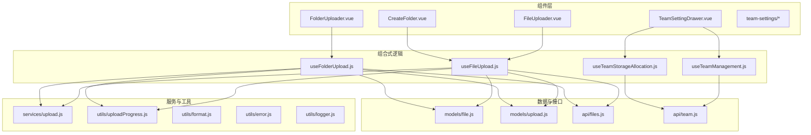
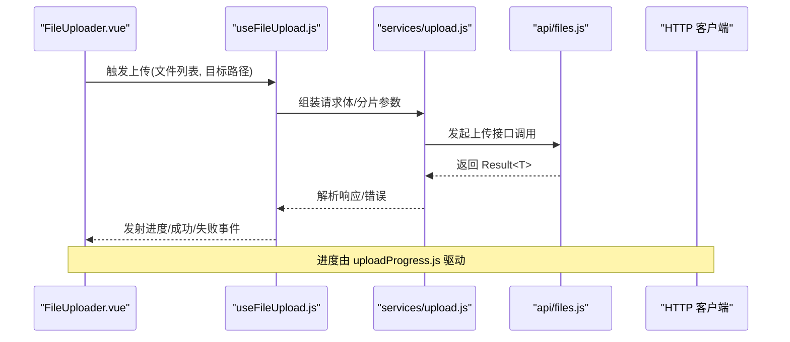
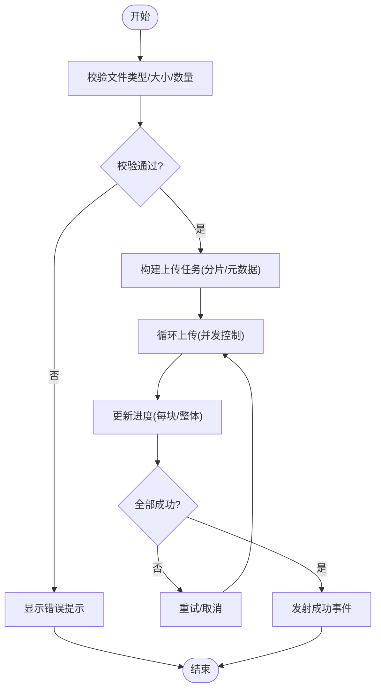
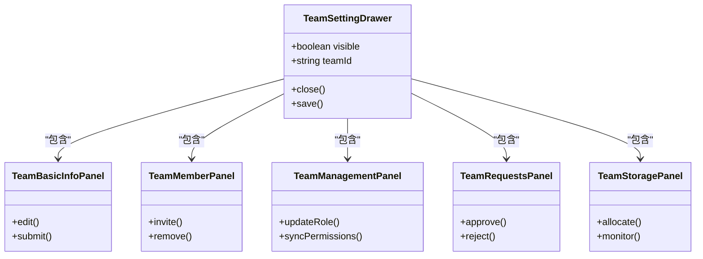
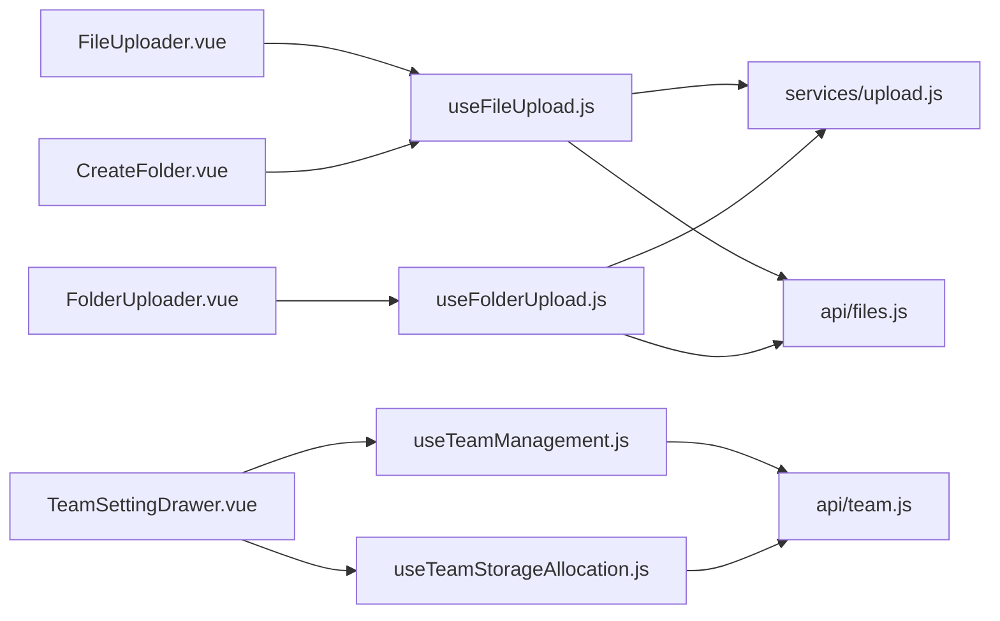

# 组件库

<cite>
**本文引用的文件**   
- [ZXYZdatabaseFront/src/components/FileUploader.vue](file://ZXYZdatabaseFront/src/components/FileUploader.vue)
- [ZXYZdatabaseFront/src/components/FolderUploader.vue](file://ZXYZdatabaseFront/src/components/FolderUploader.vue)
- [ZXYZdatabaseFront/src/components/uploader/shared.js](file://ZXYZdatabaseFront/src/components/uploader/shared.js)
- [ZXYZdatabaseFront/src/composables/useFileUpload.js](file://ZXYZdatabaseFront/src/composables/useFileUpload.js)
- [ZXYZdatabaseFront/src/composables/useFolderUpload.js](file://ZXYZdatabaseFront/src/composables/useFolderUpload.js)
- [ZXYZdatabaseFront/src/services/upload.js](file://ZXYZdatabaseFront/src/services/upload.js)
- [ZXYZdatabaseFront/src/utils/uploadProgress.js](file://ZXYZdatabaseFront/src/utils/uploadProgress.js)
- [ZXYZdatabaseFront/src/components/CreateFolder.vue](file://ZXYZdatabaseFront/src/components/CreateFolder.vue)
- [ZXYZdatabaseFront/src/components/TeamSettingDrawer.vue](file://ZXYZdatabaseFront/src/components/TeamSettingDrawer.vue)
- [ZXYZdatabaseFront/src/components/team-settings/TeamBasicInfoPanel.vue](file://ZXYZdatabaseFront/src/components/team-settings/TeamBasicInfoPanel.vue)
- [ZXYZdatabaseFront/src/components/team-settings/TeamMemberPanel.vue](file://ZXYZdatabaseFront/src/components/team-settings/TeamMemberPanel.vue)
- [ZXYZdatabaseFront/src/components/team-settings/TeamManagementPanel.vue](file://ZXYZdatabaseFront/src/components/team-settings/TeamManagementPanel.vue)
- [ZXYZdatabaseFront/src/components/team-settings/TeamRequestsPanel.vue](file://ZXYZdatabaseFront/src/components/team-settings/TeamRequestsPanel.vue)
- [ZXYZdatabaseFront/src/components/team-settings/TeamStoragePanel.vue](file://ZXYZdatabaseFront/src/components/team-settings/TeamStoragePanel.vue)
- [ZXYZdatabaseFront/src/composables/team/useTeamManagement.js](file://ZXYZdatabaseFront/src/composables/team/useTeamManagement.js)
- [ZXYZdatabaseFront/src/composables/team/useTeamStorageAllocation.js](file://ZXYZdatabaseFront/src/composables/team/useTeamStorageAllocation.js)
- [ZXYZdatabaseFront/src/api/files.js](file://ZXYZdatabaseFront/src/api/files.js)
- [ZXYZdatabaseFront/src/api/team.js](file://ZXYZdatabaseFront/src/api/team.js)
- [ZXYZdatabaseFront/src/models/file.js](file://ZXYZdatabaseFront/src/models/file.js)
- [ZXYZdatabaseFront/src/models/upload.js](file://ZXYZdatabaseFront/src/models/upload.js)
- [ZXYZdatabaseFront/src/utils/format.js](file://ZXYZdatabaseFront/src/utils/format.js)
- [ZXYZdatabaseFront/src/utils/error.js](file://ZXYZdatabaseFront/src/utils/error.js)
- [ZXYZdatabaseFront/src/utils/logger.js](file://ZXYZdatabaseFront/src/utils/logger.js)
- [ZXYZdatabaseFront/src/store/team.js](file://ZXYZdatabaseFront/src/store/team.js)
- [ZXYZdatabaseFront/src/router/index.js](file://ZXYZdatabaseFront/src/router/index.js)
- [ZXYZdatabaseFront/package.json](file://ZXYZdatabaseFront/package.json)
- [ZXYZdatabaseFront/vite.config.js](file://ZXYZdatabaseFront/vite.config.js)
- [ZXYZdatabaseFront/.github/workflows/build.yml](file://ZXYZdatabaseFront/.github/workflows/build.yml)
- [ZXYZdatabaseFront/.github/workflows/deploy.yml](file://ZXYZdatabaseFront/.github/workflows/deploy.yml)
</cite>

## 目录
1. [简介](#简介)
2. [项目结构](#项目结构)
3. [核心组件](#核心组件)
4. [架构总览](#架构总览)
5. [详细组件分析](#详细组件分析)
6. [依赖分析](#依赖分析)
7. [性能考虑](#性能考虑)
8. [故障排查指南](#故障排查指南)
9. [结论](#结论)
10. [附录](#附录)

## 简介
本指南面向 ZXYZ 前端组件库的开发者，围绕“基础组件、业务组件、页面组件”的分层组织与可复用性规范展开。重点覆盖：
- 组件分层与职责边界
- Props、事件、插槽与样式隔离约定
- 复杂业务组件实现模式（文件上传器、文件夹创建对话框、团队设置抽屉）
- 测试策略、文档生成与版本管理
- 使用示例、自定义主题与国际化适配
- 最佳实践与性能优化建议

## 项目结构
前端采用 Vue 3 Composition API + <script setup>，Element Plus 自动导入，Pinia 状态管理，composables 封装业务逻辑。组件按功能域划分在 src/components 下，通用能力下沉至 composables 与 utils，API 调用集中在 api 目录，数据模型在 models，服务与工具函数在 services 与 utils。

图表来源
- [ZXYZdatabaseFront/src/components/FileUploader.vue](file://ZXYZdatabaseFront/src/components/FileUploader.vue)
- [ZXYZdatabaseFront/src/components/FolderUploader.vue](file://ZXYZdatabaseFront/src/components/FolderUploader.vue)
- [ZXYZdatabaseFront/src/components/CreateFolder.vue](file://ZXYZdatabaseFront/src/components/CreateFolder.vue)
- [ZXYZdatabaseFront/src/components/TeamSettingDrawer.vue](file://ZXYZdatabaseFront/src/components/TeamSettingDrawer.vue)
- [ZXYZdatabaseFront/src/composables/useFileUpload.js](file://ZXYZdatabaseFront/src/composables/useFileUpload.js)
- [ZXYZdatabaseFront/src/composables/useFolderUpload.js](file://ZXYZdatabaseFront/src/composables/useFolderUpload.js)
- [ZXYZdatabaseFront/src/services/upload.js](file://ZXYZdatabaseFront/src/services/upload.js)
- [ZXYZdatabaseFront/src/utils/uploadProgress.js](file://ZXYZdatabaseFront/src/utils/uploadProgress.js)
- [ZXYZdatabaseFront/src/api/files.js](file://ZXYZdatabaseFront/src/api/files.js)
- [ZXYZdatabaseFront/src/api/team.js](file://ZXYZdatabaseFront/src/api/team.js)
- [ZXYZdatabaseFront/src/models/file.js](file://ZXYZdatabaseFront/src/models/file.js)
- [ZXYZdatabaseFront/src/models/upload.js](file://ZXYZdatabaseFront/src/models/upload.js)

章节来源
- [ZXYZdatabaseFront/package.json](file://ZXYZdatabaseFront/package.json)
- [ZXYZdatabaseFront/vite.config.js](file://ZXYZdatabaseFront/vite.config.js)

## 核心组件
- 基础组件
  - 表单输入、按钮、弹窗、抽屉等由 Element Plus 提供，通过 auto-import 直接使用；如需二次封装，遵循统一的 Props、事件与插槽约定。
- 业务组件
  - FileUploader.vue：文件上传主入口，支持单/多文件、进度、错误提示、重试与取消。
  - FolderUploader.vue：文件夹上传，基于浏览器 File System API 或递归遍历，合并分片与断点续传。
  - CreateFolder.vue：文件夹创建对话框，包含命名校验、冲突处理与结果回调。
  - TeamSettingDrawer.vue：团队设置抽屉，聚合多个子面板（基本信息、成员、权限、存储配额等）。
- 页面组件
  - views 下的页面由路由驱动，组合上述业务组件完成完整用户流程。

章节来源
- [ZXYZdatabaseFront/src/components/FileUploader.vue](file://ZXYZdatabaseFront/src/components/FileUploader.vue)
- [ZXYZdatabaseFront/src/components/FolderUploader.vue](file://ZXYZdatabaseFront/src/components/FolderUploader.vue)
- [ZXYZdatabaseFront/src/components/CreateFolder.vue](file://ZXYZdatabaseFront/src/components/CreateFolder.vue)
- [ZXYZdatabaseFront/src/components/TeamSettingDrawer.vue](file://ZXYZdatabaseFront/src/components/TeamSettingDrawer.vue)

## 架构总览
组件库采用“展示层（components）— 组合式逻辑（composables）— 服务与工具（services/utils）— 数据模型（models）— 接口（api）”的分层。上传链路从 UI 到网络请求，贯穿进度追踪、错误处理与日志记录。

图表来源
- [ZXYZdatabaseFront/src/components/FileUploader.vue](file://ZXYZdatabaseFront/src/components/FileUploader.vue)
- [ZXYZdatabaseFront/src/composables/useFileUpload.js](file://ZXYZdatabaseFront/src/composables/useFileUpload.js)
- [ZXYZdatabaseFront/src/services/upload.js](file://ZXYZdatabaseFront/src/services/upload.js)
- [ZXYZdatabaseFront/src/api/files.js](file://ZXYZdatabaseFront/src/api/files.js)
- [ZXYZdatabaseFront/src/utils/uploadProgress.js](file://ZXYZdatabaseFront/src/utils/uploadProgress.js)

## 详细组件分析

### 文件上传器（FileUploader.vue）
- 职责
  - 接收用户选择的文件，调用 useFileUpload 进行上传编排
  - 展示进度条、错误信息、重试/取消操作
  - 通过事件向父组件反馈上传结果
- 关键交互
  - props：接受文件列表、目标空间/路径、是否允许重复、最大大小限制等
  - events：on-success、on-progress、on-error、on-cancel
  - slots：插槽用于自定义文件卡片、进度条样式、空状态文案
- 实现要点
  - 使用 useFileUpload 统一处理并发控制、分片、重试、取消
  - 使用 uploadProgress.js 驱动进度更新
  - 错误通过 error.js 统一格式化并上报 logger.js

图表来源
- [ZXYZdatabaseFront/src/components/FileUploader.vue](file://ZXYZdatabaseFront/src/components/FileUploader.vue)
- [ZXYZdatabaseFront/src/composables/useFileUpload.js](file://ZXYZdatabaseFront/src/composables/useFileUpload.js)
- [ZXYZdatabaseFront/src/utils/uploadProgress.js](file://ZXYZdatabaseFront/src/utils/uploadProgress.js)

章节来源
- [ZXYZdatabaseFront/src/components/FileUploader.vue](file://ZXYZdatabaseFront/src/components/FileUploader.vue)
- [ZXYZdatabaseFront/src/composables/useFileUpload.js](file://ZXYZdatabaseFront/src/composables/useFileUpload.js)
- [ZXYZdatabaseFront/src/utils/uploadProgress.js](file://ZXYZdatabaseFront/src/utils/uploadProgress.js)

### 文件夹上传器（FolderUploader.vue）
- 职责
  - 将本地文件夹结构映射为服务端目录树
  - 支持大文件夹分片上传、断点续传、并发控制
- 关键交互
  - props：文件夹对象、目标路径、并发数、分片大小
  - events：on-folder-progress、on-file-success、on-file-error
  - slots：自定义文件夹树节点渲染
- 实现要点
  - 使用 useFolderUpload 协调目录遍历与上传调度
  - 与服务端目录初始化接口协作，确保路径存在
  - 失败文件可单独重试，不影响其他文件

章节来源
- [ZXYZdatabaseFront/src/components/FolderUploader.vue](file://ZXYZdatabaseFront/src/components/FolderUploader.vue)
- [ZXYZdatabaseFront/src/composables/useFolderUpload.js](file://ZXYZdatabaseFront/src/composables/useFolderUpload.js)

### 文件夹创建对话框（CreateFolder.vue）
- 职责
  - 提供文件夹名称输入、命名规则校验、重名冲突检测
  - 成功后回调上层刷新目录树或跳转
- 关键交互
  - props：默认名称、父级路径、是否只读
  - events：on-create、on-cancel
  - slots：自定义校验提示与确认按钮
- 实现要点
  - 使用 format.js 做名称规范化
  - 使用 error.js 捕获并提示后端校验错误

章节来源
- [ZXYZdatabaseFront/src/components/CreateFolder.vue](file://ZXYZdatabaseFront/src/components/CreateFolder.vue)
- [ZXYZdatabaseFront/src/utils/format.js](file://ZXYZdatabaseFront/src/utils/format.js)
- [ZXYZdatabaseFront/src/utils/error.js](file://ZXYZdatabaseFront/src/utils/error.js)

### 团队设置抽屉（TeamSettingDrawer.vue）
- 职责
  - 聚合团队基本信息、成员管理、权限配置、存储配额等子面板
  - 控制抽屉显隐与数据同步
- 关键交互
  - props：可见性、团队ID、权限范围
  - events：on-close、on-save
  - slots：顶部标题、底部操作区
- 子面板
  - TeamBasicInfoPanel.vue：基本信息编辑与保存
  - TeamMemberPanel.vue：成员列表、邀请、移除
  - TeamManagementPanel.vue：角色与权限矩阵
  - TeamRequestsPanel.vue：加入申请审批
  - TeamStoragePanel.vue：存储配额分配与监控

图表来源
- [ZXYZdatabaseFront/src/components/TeamSettingDrawer.vue](file://ZXYZdatabaseFront/src/components/TeamSettingDrawer.vue)
- [ZXYZdatabaseFront/src/components/team-settings/TeamBasicInfoPanel.vue](file://ZXYZdatabaseFront/src/components/team-settings/TeamBasicInfoPanel.vue)
- [ZXYZdatabaseFront/src/components/team-settings/TeamMemberPanel.vue](file://ZXYZdatabaseFront/src/components/team-settings/TeamMemberPanel.vue)
- [ZXYZdatabaseFront/src/components/team-settings/TeamManagementPanel.vue](file://ZXYZdatabaseFront/src/components/team-settings/TeamManagementPanel.vue)
- [ZXYZdatabaseFront/src/components/team-settings/TeamRequestsPanel.vue](file://ZXYZdatabaseFront/src/components/team-settings/TeamRequestsPanel.vue)
- [ZXYZdatabaseFront/src/components/team-settings/TeamStoragePanel.vue](file://ZXYZdatabaseFront/src/components/team-settings/TeamStoragePanel.vue)

章节来源
- [ZXYZdatabaseFront/src/components/TeamSettingDrawer.vue](file://ZXYZdatabaseFront/src/components/TeamSettingDrawer.vue)
- [ZXYZdatabaseFront/src/components/team-settings/TeamBasicInfoPanel.vue](file://ZXYZdatabaseFront/src/components/team-settings/TeamBasicInfoPanel.vue)
- [ZXYZdatabaseFront/src/components/team-settings/TeamMemberPanel.vue](file://ZXYZdatabaseFront/src/components/team-settings/TeamMemberPanel.vue)
- [ZXYZdatabaseFront/src/components/team-settings/TeamManagementPanel.vue](file://ZXYZdatabaseFront/src/components/team-settings/TeamManagementPanel.vue)
- [ZXYZdatabaseFront/src/components/team-settings/TeamRequestsPanel.vue](file://ZXYZdatabaseFront/src/components/team-settings/TeamRequestsPanel.vue)
- [ZXYZdatabaseFront/src/components/team-settings/TeamStoragePanel.vue](file://ZXYZdatabaseFront/src/components/team-settings/TeamStoragePanel.vue)

### 组合式逻辑（Composables）
- useFileUpload.js：封装上传生命周期（构建任务、分片、并发、重试、取消）、进度计算、错误处理与结果回调
- useFolderUpload.js：目录遍历、路径映射、分片与断点续传、失败重试
- useTeamManagement.js / useTeamStorageAllocation.js：团队管理与存储配额的领域逻辑封装，统一调用 team.js 接口

章节来源
- [ZXYZdatabaseFront/src/composables/useFileUpload.js](file://ZXYZdatabaseFront/src/composables/useFileUpload.js)
- [ZXYZdatabaseFront/src/composables/useFolderUpload.js](file://ZXYZdatabaseFront/src/composables/useFolderUpload.js)
- [ZXYZdatabaseFront/src/composables/team/useTeamManagement.js](file://ZXYZdatabaseFront/src/composables/team/useTeamManagement.js)
- [ZXYZdatabaseFront/src/composables/team/useTeamStorageAllocation.js](file://ZXYZdatabaseFront/src/composables/team/useTeamStorageAllocation.js)

### 服务与工具
- services/upload.js：统一上传服务，负责请求头、鉴权、分片策略、超时与重试
- utils/uploadProgress.js：进度计算与节流更新
- utils/format.js：文件名、大小、时间等格式化工具
- utils/error.js：错误码映射、用户友好提示
- utils/logger.js：结构化日志输出

章节来源
- [ZXYZdatabaseFront/src/services/upload.js](file://ZXYZdatabaseFront/src/services/upload.js)
- [ZXYZdatabaseFront/src/utils/uploadProgress.js](file://ZXYZdatabaseFront/src/utils/uploadProgress.js)
- [ZXYZdatabaseFront/src/utils/format.js](file://ZXYZdatabaseFront/src/utils/format.js)
- [ZXYZdatabaseFront/src/utils/error.js](file://ZXYZdatabaseFront/src/utils/error.js)
- [ZXYZdatabaseFront/src/utils/logger.js](file://ZXYZdatabaseFront/src/utils/logger.js)

### 数据模型与接口
- models/file.js / models/upload.js：文件与上传任务的数据结构定义
- api/files.js / api/team.js：文件与团队相关接口封装，统一 Result<T> 解析

章节来源
- [ZXYZdatabaseFront/src/models/file.js](file://ZXYZdatabaseFront/src/models/file.js)
- [ZXYZdatabaseFront/src/models/upload.js](file://ZXYZdatabaseFront/src/models/upload.js)
- [ZXYZdatabaseFront/src/api/files.js](file://ZXYZdatabaseFront/src/api/files.js)
- [ZXYZdatabaseFront/src/api/team.js](file://ZXYZdatabaseFront/src/api/team.js)

## 依赖分析
组件与组合式逻辑之间的依赖关系清晰，避免循环依赖；API 与 store 解耦，便于替换与测试。

图表来源
- [ZXYZdatabaseFront/src/components/FileUploader.vue](file://ZXYZdatabaseFront/src/components/FileUploader.vue)
- [ZXYZdatabaseFront/src/components/FolderUploader.vue](file://ZXYZdatabaseFront/src/components/FolderUploader.vue)
- [ZXYZdatabaseFront/src/components/CreateFolder.vue](file://ZXYZdatabaseFront/src/components/CreateFolder.vue)
- [ZXYZdatabaseFront/src/components/TeamSettingDrawer.vue](file://ZXYZdatabaseFront/src/components/TeamSettingDrawer.vue)
- [ZXYZdatabaseFront/src/composables/useFileUpload.js](file://ZXYZdatabaseFront/src/composables/useFileUpload.js)
- [ZXYZdatabaseFront/src/composables/useFolderUpload.js](file://ZXYZdatabaseFront/src/composables/useFolderUpload.js)
- [ZXYZdatabaseFront/src/composables/team/useTeamManagement.js](file://ZXYZdatabaseFront/src/composables/team/useTeamManagement.js)
- [ZXYZdatabaseFront/src/composables/team/useTeamStorageAllocation.js](file://ZXYZdatabaseFront/src/composables/team/useTeamStorageAllocation.js)
- [ZXYZdatabaseFront/src/services/upload.js](file://ZXYZdatabaseFront/src/services/upload.js)
- [ZXYZdatabaseFront/src/api/files.js](file://ZXYZdatabaseFront/src/api/files.js)
- [ZXYZdatabaseFront/src/api/team.js](file://ZXYZdatabaseFront/src/api/team.js)

章节来源
- [ZXYZdatabaseFront/src/store/team.js](file://ZXYZdatabaseFront/src/store/team.js)
- [ZXYZdatabaseFront/src/router/index.js](file://ZXYZdatabaseFront/src/router/index.js)

## 性能考虑
- 上传并发与分片
  - 合理设置并发数与分片大小，避免阻塞主线程与内存峰值过高
  - 使用 uploadProgress.js 节流更新，减少重渲染
- 虚拟滚动与懒加载
  - 大列表场景使用虚拟滚动，按需渲染节点
- 缓存与去重
  - 对相同文件哈希进行去重，避免重复上传
- 资源优化
  - 按需引入 Element Plus 组件，减小包体积
  - 图片与图标使用雪碧图或字体图标，减少请求数

[本节为通用指导，不直接分析具体文件]

## 故障排查指南
- 常见问题
  - 上传失败：检查网络、鉴权、分片大小与服务器限制
  - 进度不更新：确认 uploadProgress 节流频率与事件绑定
  - 重名冲突：核对命名规则与后端校验消息
- 调试手段
  - 使用 logger.js 输出关键步骤与错误堆栈
  - 使用 error.js 的错误映射定位错误码
  - 在浏览器 DevTools 中查看 Network 与 Console

章节来源
- [ZXYZdatabaseFront/src/utils/logger.js](file://ZXYZdatabaseFront/src/utils/logger.js)
- [ZXYZdatabaseFront/src/utils/error.js](file://ZXYZdatabaseFront/src/utils/error.js)

## 结论
本指南梳理了 ZXYZ 前端组件库的分层设计与核心组件实现模式，明确了可复用组件的开发规范与复杂业务组件的实现要点。通过组合式逻辑与服务化抽象，提升了组件的可维护性与扩展性。建议在后续迭代中持续完善测试覆盖率、文档与主题/国际化能力，以支撑更大规模的团队协作与产品演进。

[本节为总结性内容，不直接分析具体文件]

## 附录

### 组件开发规范
- Props 定义
  - 明确必填与可选，提供默认值与类型校验
  - 对枚举型属性使用常量集中管理
- 事件发射
  - 使用 on-* 命名，传递最小必要数据
  - 区分 success/error/cancel 等语义化事件
- 插槽使用
  - 暴露必要的具名插槽与作用域插槽，便于定制
- 样式隔离
  - 使用 scoped CSS 或 CSS Modules，避免全局污染
  - 主题变量通过 CSS 变量或主题系统注入

[本节为通用规范，不直接分析具体文件]

### 测试策略
- 单元测试
  - 针对 composables 与工具函数编写用例，验证边界条件与异常分支
- 组件测试
  - 模拟 DOM 事件与异步行为，断言渲染与事件发射
- 端到端测试
  - 关键流程（登录、上传、团队设置）使用 E2E 框架覆盖

章节来源
- [ZXYZdatabaseFront/.github/workflows/build.yml](file://ZXYZdatabaseFront/.github/workflows/build.yml)
- [ZXYZdatabaseFront/.github/workflows/deploy.yml](file://ZXYZdatabaseFront/.github/workflows/deploy.yml)

### 文档生成与版本管理
- 文档生成
  - 使用 VitePress/VuePress 生成组件文档，包含 API、示例与演示
- 版本管理
  - 使用语义化版本（SemVer），变更日志自动生成
  - CI/CD 流水线集成构建、测试与发布

章节来源
- [ZXYZdatabaseFront/package.json](file://ZXYZdatabaseFront/package.json)
- [ZXYZdatabaseFront/vite.config.js](file://ZXYZdatabaseFront/vite.config.js)
- [ZXYZdatabaseFront/.github/workflows/build.yml](file://ZXYZdatabaseFront/.github/workflows/build.yml)
- [ZXYZdatabaseFront/.github/workflows/deploy.yml](file://ZXYZdatabaseFront/.github/workflows/deploy.yml)

### 使用示例
- 文件上传
  - 在页面中引入 FileUploader，传入目标路径与回调事件
- 文件夹创建
  - 打开 CreateFolder 对话框，提交后刷新目录树
- 团队设置
  - 通过 TeamSettingDrawer 打开抽屉，编辑并保存团队配置

[本节为概念性说明，不直接分析具体文件]

### 自定义主题支持
- 通过 CSS 变量或主题配置文件覆盖颜色、字号、间距等
- 组件内部使用主题变量，避免硬编码样式

[本节为通用指导，不直接分析具体文件]

### 国际化适配
- 文本抽离至 i18n 资源文件，组件内通过键值获取
- 日期、数字、单位等使用本地化工具格式化

[本节为通用指导，不直接分析具体文件]