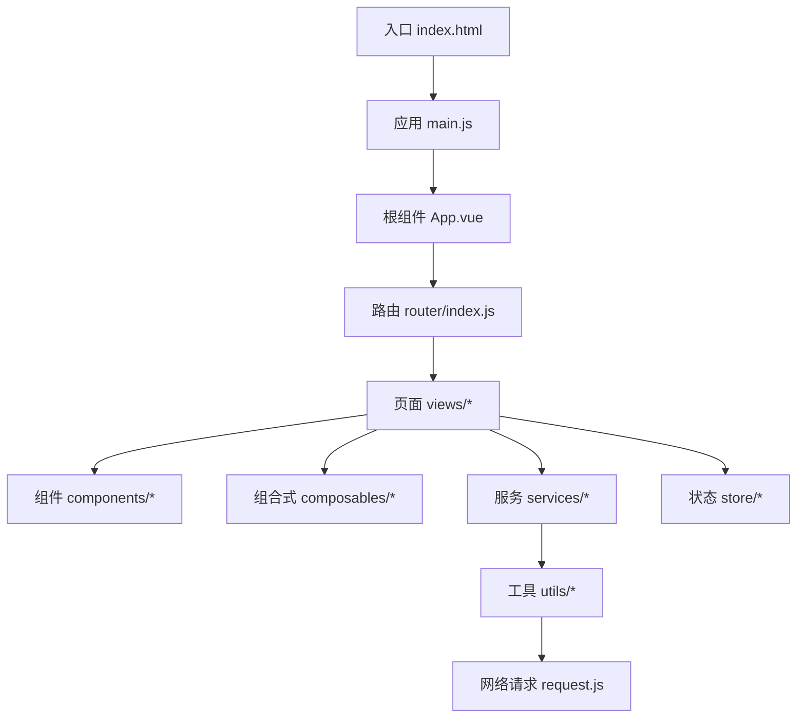
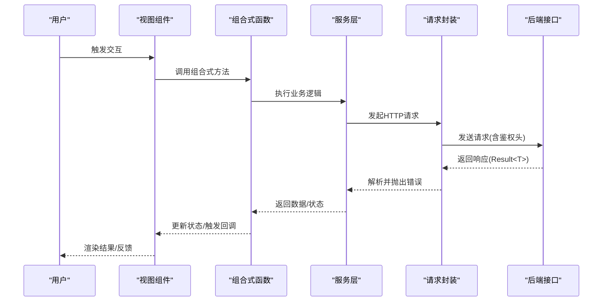
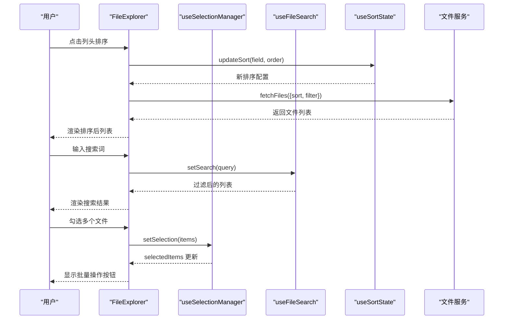
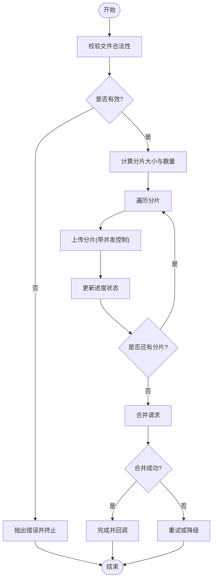
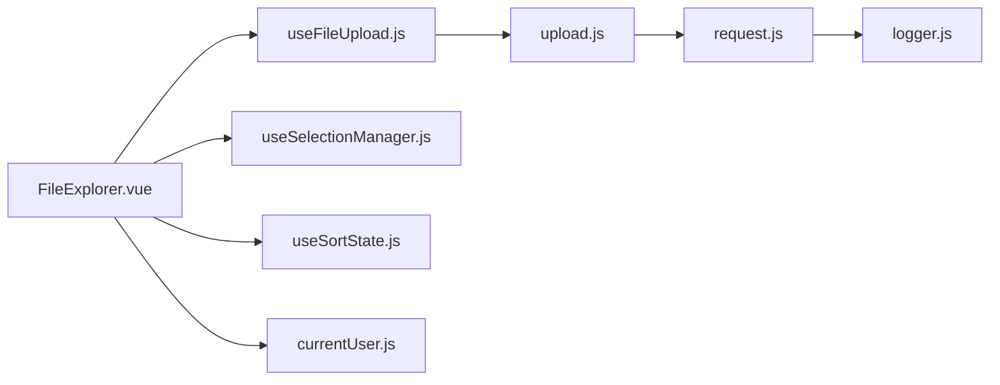

# 组件开发指南

<cite>
**本文引用的文件**   
- [package.json](file://ZXYZdatabaseFront/package.json)
- [vite.config.js](file://ZXYZdatabaseFront/vite.config.js)
- [eslint.config.mjs](file://ZXYZdatabaseFront/eslint.config.mjs)
- [.prettierrc](file://ZXYZdatabaseFront/.prettierrc)
- [index.html](file://ZXYZdatabaseFront/index.html)
- [main.js](file://ZXYZdatabaseFront/src/main.js)
- [App.vue](file://ZXYZdatabaseFront/src/App.vue)
- [router/index.js](file://ZXYZdatabaseFront/src/router/index.js)
- [api/README.md](file://ZXYZdatabaseFront/src/api/README.md)
- [src/components/FileExplorer.vue](file://ZXYZdatabaseFront/src/components/FileExplorer.vue)
- [src/composables/useFileUpload.js](file://ZXYZdatabaseFront/src/composables/useFileUpload.js)
- [src/services/upload.js](file://ZXYZdatabaseFront/src/services/upload.js)
- [src/utils/request.js](file://ZXYZdatabaseFront/src/utils/request.js)
- [src/store/currentUser.js](file://ZXYZdatabaseFront/src/store/currentUser.js)
- [src/views/chat/index.vue](file://ZXYZdatabaseFront/src/views/chat/index.vue)
- [src/views/layout/index.vue](file://ZXYZdatabaseFront/src/views/layout/index.vue)
- [src/models/file.js](file://ZXYZdatabaseFront/src/models/file.js)
- [src/utils/logger.js](file://ZXYZdatabaseFront/src/utils/logger.js)
- [src/test/setup.js](file://ZXYZdatabaseFront/src/test/setup.js)
- [.github/workflows/build.yml](file://ZXYZdatabaseFront/.github/workflows/build.yml)
- [.github/workflows/deploy.yml](file://ZXYZdatabaseFront/.github/workflows/deploy.yml)
</cite>

## 目录
1. [简介](#简介)
2. [项目结构](#项目结构)
3. [核心组件](#核心组件)
4. [架构总览](#架构总览)
5. [详细组件分析](#详细组件分析)
6. [依赖分析](#依赖分析)
7. [性能考虑](#性能考虑)
8. [故障排查指南](#故障排查指南)
9. [结论](#结论)
10. [附录](#附录)

## 简介
本指南面向 ZXYZ 前端（Vue 3 + Composition API）的组件开发者，覆盖从需求分析、设计、实现、测试到文档与发布的完整流程。重点包括：
- Vue 3 Composition API 的使用模式与最佳实践
- TypeScript 类型定义建议（在 JS 项目中通过 JSDoc 或 TS 迁移路径）
- ESLint/Prettier 代码规范与提交前检查
- 单元测试、集成测试与 E2E 测试策略
- 组件文档自动生成与 Storybook 展示（可选）
- 版本发布与 CI/CD 流水线
- 性能优化技巧与常见问题解决方案

## 项目结构
前端采用 Vite 构建，基于 Vue 3 Composition API 与 <script setup>，使用 Element Plus 自动导入，Pinia 管理状态，composables 封装业务逻辑。关键目录说明：
- src/components：可复用 UI 组件
- src/composables：组合式函数，封装跨组件复用的状态与行为
- src/api：API 请求模块与接口文档
- src/store：Pinia store（当前用户、会话、团队等）
- src/views：页面级视图
- src/utils：通用工具（请求、日志、错误处理、上传进度等）
- src/models：数据模型与展示层映射
- public：静态资源（图标字体等）
- .github/workflows：CI/CD 工作流（构建与部署）

图表来源
- [index.html](file://ZXYZdatabaseFront/index.html)
- [main.js](file://ZXYZdatabaseFront/src/main.js)
- [App.vue](file://ZXYZdatabaseFront/src/App.vue)
- [router/index.js](file://ZXYZdatabaseFront/src/router/index.js)

章节来源
- [package.json](file://ZXYZdatabaseFront/package.json)
- [vite.config.js](file://ZXYZdatabaseFront/vite.config.js)
- [index.html](file://ZXYZdatabaseFront/index.html)
- [main.js](file://ZXYZdatabaseFront/src/main.js)
- [App.vue](file://ZXYZdatabaseFront/src/App.vue)
- [router/index.js](file://ZXYZdatabaseFront/src/router/index.js)

## 核心组件
- FileExplorer：文件浏览与操作的核心容器组件，负责列表渲染、选择、上下文菜单、批量操作、搜索与排序等交互。
- useFileUpload：文件上传的组合式函数，封装分片、并发控制、进度跟踪、重试与错误处理。
- upload.js：上传服务，协调浏览器端与后端上传接口，处理断点续传与元数据。
- request.js：统一 HTTP 请求封装，处理鉴权头、错误码转换与拦截器。
- currentUser.js：当前用户状态的 Pinia store，提供登录态、权限信息。
- logger.js：日志记录工具，支持分级输出与环境区分。

章节来源
- [src/components/FileExplorer.vue](file://ZXYZdatabaseFront/src/components/FileExplorer.vue)
- [src/composables/useFileUpload.js](file://ZXYZdatabaseFront/src/composables/useFileUpload.js)
- [src/services/upload.js](file://ZXYZdatabaseFront/src/services/upload.js)
- [src/utils/request.js](file://ZXYZdatabaseFront/src/utils/request.js)
- [src/store/currentUser.js](file://ZXYZdatabaseFront/src/store/currentUser.js)
- [src/utils/logger.js](file://ZXYZdatabaseFront/src/utils/logger.js)

## 架构总览
前端整体遵循“视图 → 组合式 → 服务 → 工具”的分层模式，状态集中在 Pinia store，API 调用通过统一的 request 封装。组件间通过 props/emits 与事件总线通信，复杂业务逻辑下沉至 composables。

图表来源
- [src/views/chat/index.vue](file://ZXYZdatabaseFront/src/views/chat/index.vue)
- [src/composables/useFileUpload.js](file://ZXYZdatabaseFront/src/composables/useFileUpload.js)
- [src/services/upload.js](file://ZXYZdatabaseFront/src/services/upload.js)
- [src/utils/request.js](file://ZXYZdatabaseFront/src/utils/request.js)

## 详细组件分析

### 文件浏览组件（FileExplorer）
职责与边界
- 列表渲染：虚拟滚动、分页、排序、筛选
- 选择与批量：多选、全选、拖拽选择、批量删除/移动
- 上下文菜单：右键菜单、快捷操作
- 导航与搜索：路径导航、关键词搜索、高亮
- 事件派发：对外暴露选中项、操作结果、错误提示

数据流与状态
- 本地状态：selectedItems、searchQuery、sortState、filterState
- 远程数据：通过 service 层拉取，缓存于 store 或组合式内部
- 副作用：上传、下载、删除等操作通过异步任务队列管理

交互序列

图表来源
- [src/components/FileExplorer.vue](file://ZXYZdatabaseFront/src/components/FileExplorer.vue)

章节来源
- [src/components/FileExplorer.vue](file://ZXYZdatabaseFront/src/components/FileExplorer.vue)

### 文件上传组合式（useFileUpload）
功能要点
- 分片上传：按大小切分，并发限制，失败重试
- 进度跟踪：实时进度、速度、剩余时间估算
- 错误处理：网络异常、服务端错误、用户取消
- 断点续传：基于文件哈希与分片校验

算法流程图

图表来源
- [src/composables/useFileUpload.js](file://ZXYZdatabaseFront/src/composables/useFileUpload.js)
- [src/services/upload.js](file://ZXYZdatabaseFront/src/services/upload.js)

章节来源
- [src/composables/useFileUpload.js](file://ZXYZdatabaseFront/src/composables/useFileUpload.js)
- [src/services/upload.js](file://ZXYZdatabaseFront/src/services/upload.js)

### 统一请求封装（request.js）
职责
- 统一 baseURL、超时、重试策略
- 注入鉴权头（HttpOnly Cookie + Sa-Token UUID）
- 统一错误码转换（Result<T>.code === 1 为成功）
- 拦截器：请求前处理、响应后处理、全局错误提示

章节来源
- [src/utils/request.js](file://ZXYZdatabaseFront/src/utils/request.js)

### 当前用户状态（currentUser.js）
职责
- 维护登录态、用户信息、权限集合
- 提供登录、登出、刷新用户信息的动作
- 与路由守卫联动，保护受保护页面

章节来源
- [src/store/currentUser.js](file://ZXYZdatabaseFront/src/store/currentUser.js)

### 日志工具（logger.js）
职责
- 分级日志（debug/info/warn/error）
- 环境区分（开发/生产）
- 结构化输出（时间戳、模块名、上下文）

章节来源
- [src/utils/logger.js](file://ZXYZdatabaseFront/src/utils/logger.js)

## 依赖分析
前端依赖关系清晰，组件依赖组合式，组合式依赖服务，服务依赖工具。避免循环依赖的关键：
- 将共享状态放入 store 或独立模块
- 使用接口抽象解耦服务与实现
- 避免组件直接依赖底层工具，通过服务层中转

图表来源
- [src/components/FileExplorer.vue](file://ZXYZdatabaseFront/src/components/FileExplorer.vue)
- [src/composables/useFileUpload.js](file://ZXYZdatabaseFront/src/composables/useFileUpload.js)
- [src/services/upload.js](file://ZXYZdatabaseFront/src/services/upload.js)
- [src/utils/request.js](file://ZXYZdatabaseFront/src/utils/request.js)
- [src/store/currentUser.js](file://ZXYZdatabaseFront/src/store/currentUser.js)

章节来源
- [src/components/FileExplorer.vue](file://ZXYZdatabaseFront/src/components/FileExplorer.vue)
- [src/composables/useFileUpload.js](file://ZXYZdatabaseFront/src/composables/useFileUpload.js)
- [src/services/upload.js](file://ZXYZdatabaseFront/src/services/upload.js)
- [src/utils/request.js](file://ZXYZdatabaseFront/src/utils/request.js)
- [src/store/currentUser.js](file://ZXYZdatabaseFront/src/store/currentUser.js)

## 性能考虑
- 虚拟滚动：大列表使用虚拟滚动减少 DOM 节点数量
- 懒加载：图片与重型组件按需加载
- 防抖与节流：搜索输入、窗口 resize、滚动事件
- 内存管理：及时清理定时器、事件监听器、WebSocket 连接
- 网络优化：请求合并、缓存策略、分片上传
- 渲染优化：避免不必要的 re-render，使用 computed 与 watch 精确订阅

## 故障排查指南
常见错误与定位
- 401/403：检查 HttpOnly Cookie 与 Sa-Token 注入是否正确
- 500：查看后端日志与 Request Payload，确认参数格式
- 上传失败：检查分片大小、并发数、重试策略与服务端限流
- 路由守卫失效：确认 currentUser store 初始化与守卫逻辑顺序

调试技巧
- 使用 logger.js 输出结构化日志
- 浏览器 Network 面板查看请求与响应
- 使用 Vue DevTools 检查组件状态与组合式变量
- 单元测试模拟 API 响应，隔离外部依赖

章节来源
- [src/utils/request.js](file://ZXYZdatabaseFront/src/utils/request.js)
- [src/utils/logger.js](file://ZXYZdatabaseFront/src/utils/logger.js)

## 结论
本指南提供了 ZXYZ 前端组件开发的完整方法论与实践建议。通过清晰的架构分层、Composition API 的最佳实践、严格的代码规范与完善的测试策略，可以显著提升组件质量与开发效率。建议在团队内推广本指南，并结合具体业务场景持续优化。

## 附录

### 开发环境与规范
- 构建工具：Vite
- 框架：Vue 3.5 + Composition API + <script setup>
- UI 库：Element Plus（自动导入）
- 状态管理：Pinia
- 代码规范：ESLint + Prettier + Husky 提交前检查
- 包管理：npm/yarn/pnpm（根据 package.json 脚本）

章节来源
- [package.json](file://ZXYZdatabaseFront/package.json)
- [vite.config.js](file://ZXYZdatabaseFront/vite.config.js)
- [eslint.config.mjs](file://ZXYZdatabaseFront/eslint.config.mjs)
- [.prettierrc](file://ZXYZdatabaseFront/.prettierrc)

### 测试策略
- 单元测试：Jest/Vitest，测试组合式函数与工具方法
- 集成测试：测试组件与 store、API 的交互
- E2E 测试：Playwright/Cypress，模拟用户操作流程
- 测试环境：src/test/setup.js 初始化全局配置

章节来源
- [src/test/setup.js](file://ZXYZdatabaseFront/src/test/setup.js)

### 文档生成与 Storybook
- 组件文档：使用 JSDoc 注释或 Storybook 自动生成文档
- Storybook 展示：为每个组件提供多种变体与交互示例
- 发布文档：集成到 GitHub Pages 或内部文档站点

### 版本发布与 CI/CD
- 构建：GitHub Actions 自动化构建与测试
- 部署：Docker 镜像推送 GHCR，Nginx 静态托管
- 回滚：快速回滚到上一稳定版本

章节来源
- [.github/workflows/build.yml](file://ZXYZdatabaseFront/.github/workflows/build.yml)
- [.github/workflows/deploy.yml](file://ZXYZdatabaseFront/.github/workflows/deploy.yml)

### API 约定
- 响应结构：统一 Result<T>，code === 1 表示成功
- 鉴权：HttpOnly Cookie + Sa-Token UUID
- 内部接口：/api/internal/**，需 X-Internal-Service-Token

章节来源
- [api/README.md](file://ZXYZdatabaseFront/src/api/README.md)

### 最佳实践清单
- 组件职责单一，props 最小化，emits 明确
- 组合式函数纯函数化，避免隐式副作用
- 错误处理统一，用户友好提示
- 性能敏感路径添加监控与埋点
- 代码可读性优先，命名规范一致