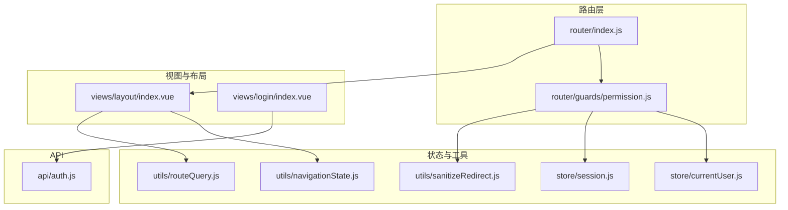
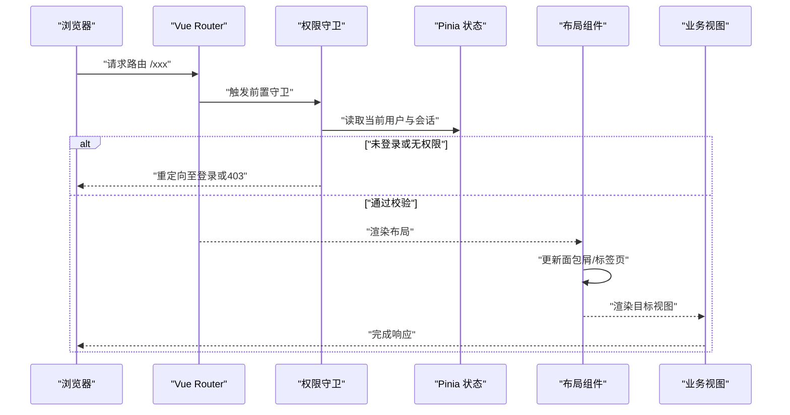
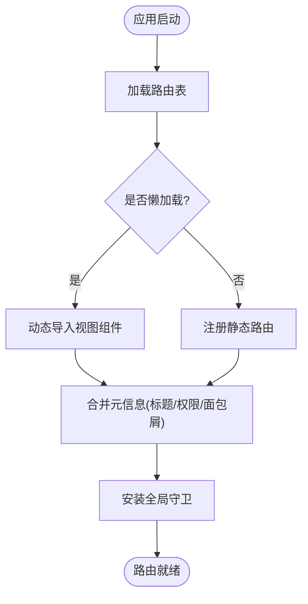
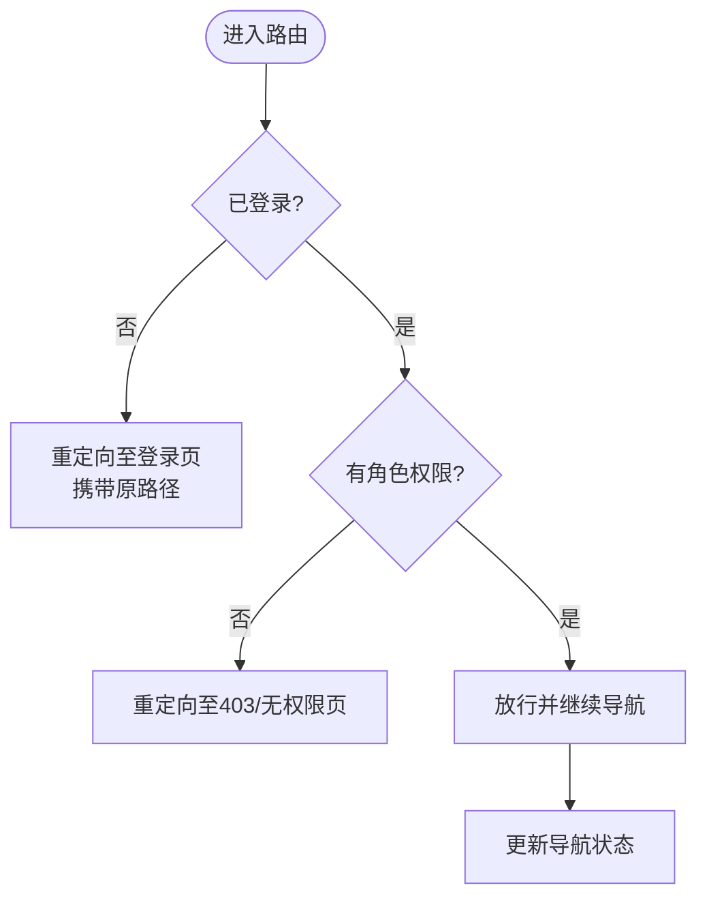
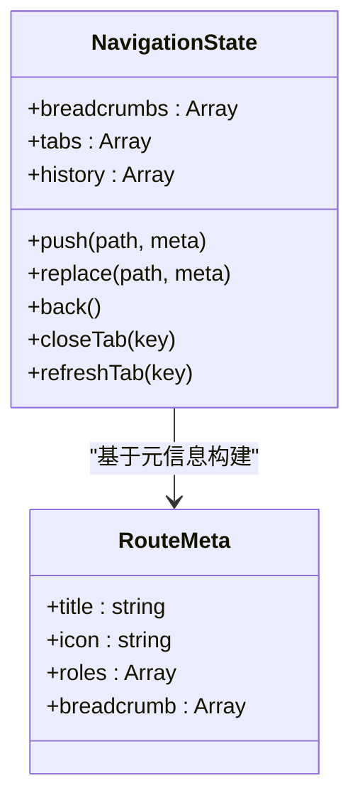
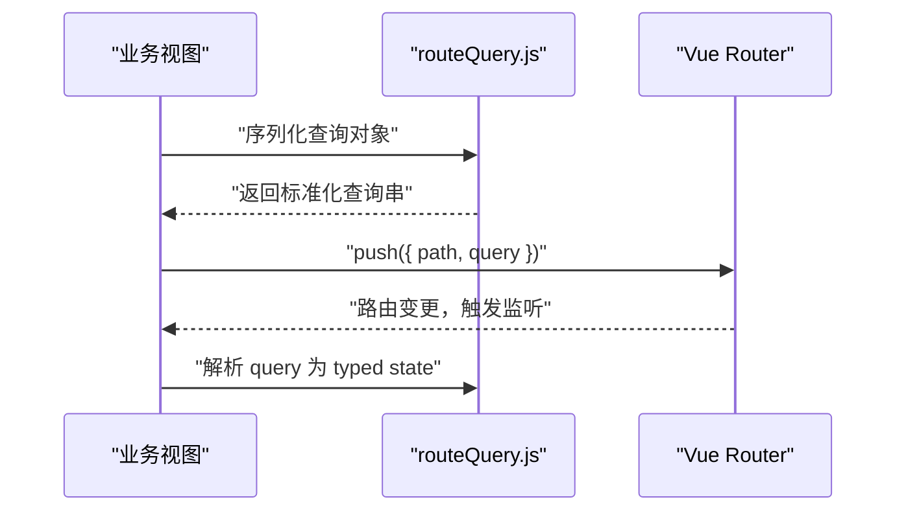
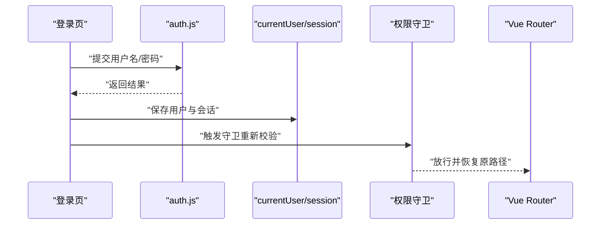
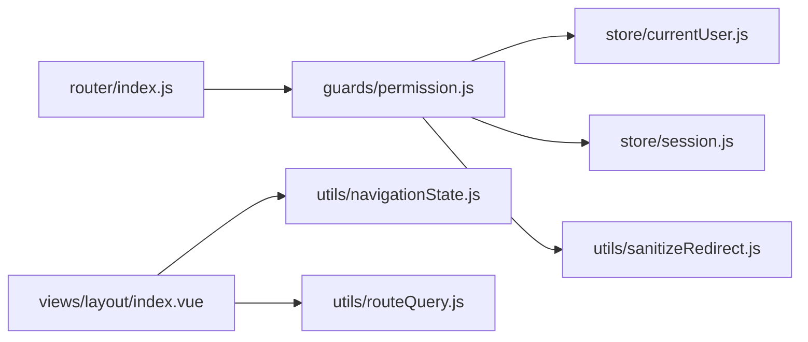

# 路由与导航

<cite>
**本文引用的文件**   
- [ZXYZdatabaseFront/src/router/index.js](file://ZXYZdatabaseFront/src/router/index.js)
- [ZXYZdatabaseFront/src/router/guards/permission.js](file://ZXYZdatabaseFront/src/router/guards/permission.js)
- [ZXYZdatabaseFront/src/utils/navigationState.js](file://ZXYZdatabaseFront/src/utils/navigationState.js)
- [ZXYZdatabaseFront/src/utils/routeQuery.js](file://ZXYZdatabaseFront/src/utils/routeQuery.js)
- [ZXYZdatabaseFront/src/store/currentUser.js](file://ZXYZdatabaseFront/src/store/currentUser.js)
- [ZXYZdatabaseFront/src/store/session.js](file://ZXYZdatabaseFront/src/store/session.js)
- [ZXYZdatabaseFront/src/views/layout/index.vue](file://ZXYZdatabaseFront/src/views/layout/index.vue)
- [ZXYZdatabaseFront/src/views/login/index.vue](file://ZXYZdatabaseFront/src/views/login/index.vue)
- [ZXYZdatabaseFront/src/api/auth.js](file://ZXYZdatabaseFront/src/api/auth.js)
- [ZXYZdatabaseFront/src/utils/sanitizeRedirect.js](file://ZXYZdatabaseFront/src/utils/sanitizeRedirect.js)
</cite>

## 目录
1. [简介](#简介)
2. [项目结构](#项目结构)
3. [核心组件](#核心组件)
4. [架构总览](#架构总览)
5. [详细组件分析](#详细组件分析)
6. [依赖关系分析](#依赖关系分析)
7. [性能考虑](#性能考虑)
8. [故障排查指南](#故障排查指南)
9. [结论](#结论)
10. [附录](#附录)

## 简介
本技术文档聚焦 ZXYZ 前端的路由与导航系统，围绕基于 Vue Router 的路由配置、权限守卫、导航状态管理（面包屑、标签页、历史记录）、参数与查询字符串处理、URL 状态同步、性能优化、SEO 友好性与移动端适配等方面展开。文档同时提供可落地的配置示例与权限控制最佳实践，帮助开发者快速理解并扩展系统能力。

## 项目结构
前端采用 Vue 3 + Composition API + Element Plus + Pinia 的技术栈，路由相关代码集中在 src/router 与 src/utils 下，页面视图位于 src/views，布局容器在 src/views/layout。权限守卫独立于路由定义，便于统一治理访问控制。导航状态与查询工具以 utils 形式提供，便于跨模块复用。

图表来源
- [ZXYZdatabaseFront/src/router/index.js](file://ZXYZdatabaseFront/src/router/index.js)
- [ZXYZdatabaseFront/src/router/guards/permission.js](file://ZXYZdatabaseFront/src/router/guards/permission.js)
- [ZXYZdatabaseFront/src/utils/navigationState.js](file://ZXYZdatabaseFront/src/utils/navigationState.js)
- [ZXYZdatabaseFront/src/utils/routeQuery.js](file://ZXYZdatabaseFront/src/utils/routeQuery.js)
- [ZXYZdatabaseFront/src/store/currentUser.js](file://ZXYZdatabaseFront/src/store/currentUser.js)
- [ZXYZdatabaseFront/src/store/session.js](file://ZXYZdatabaseFront/src/store/session.js)
- [ZXYZdatabaseFront/src/views/layout/index.vue](file://ZXYZdatabaseFront/src/views/layout/index.vue)
- [ZXYZdatabaseFront/src/views/login/index.vue](file://ZXYZdatabaseFront/src/views/login/index.vue)
- [ZXYZdatabaseFront/src/api/auth.js](file://ZXYZdatabaseFront/src/api/auth.js)
- [ZXYZdatabaseFront/src/utils/sanitizeRedirect.js](file://ZXYZdatabaseFront/src/utils/sanitizeRedirect.js)

章节来源
- [ZXYZdatabaseFront/src/router/index.js](file://ZXYZdatabaseFront/src/router/index.js)
- [ZXYZdatabaseFront/src/router/guards/permission.js](file://ZXYZdatabaseFront/src/router/guards/permission.js)
- [ZXYZdatabaseFront/src/utils/navigationState.js](file://ZXYZdatabaseFront/src/utils/navigationState.js)
- [ZXYZdatabaseFront/src/utils/routeQuery.js](file://ZXYZdatabaseFront/src/utils/routeQuery.js)
- [ZXYZdatabaseFront/src/store/currentUser.js](file://ZXYZdatabaseFront/src/store/currentUser.js)
- [ZXYZdatabaseFront/src/store/session.js](file://ZXYZdatabaseFront/src/store/session.js)
- [ZXYZdatabaseFront/src/views/layout/index.vue](file://ZXYZdatabaseFront/src/views/layout/index.vue)
- [ZXYZdatabaseFront/src/views/login/index.vue](file://ZXYZdatabaseFront/src/views/login/index.vue)
- [ZXYZdatabaseFront/src/api/auth.js](file://ZXYZdatabaseFront/src/api/auth.js)
- [ZXYZdatabaseFront/src/utils/sanitizeRedirect.js](file://ZXYZdatabaseFront/src/utils/sanitizeRedirect.js)

## 核心组件
- 路由定义与懒加载：集中式路由表，按模块拆分，使用动态导入实现按需加载，减少首屏体积。
- 权限守卫：全局前置守卫，校验登录态与角色权限，支持白名单与重定向保护。
- 导航状态：维护面包屑、标签页与历史位置，保证 UI 与 URL 一致。
- 查询与参数：统一的查询解析与序列化，确保 URL 与状态双向同步。
- 安全重定向：对跳转目标进行清洗，防止开放重定向漏洞。

章节来源
- [ZXYZdatabaseFront/src/router/index.js](file://ZXYZdatabaseFront/src/router/index.js)
- [ZXYZdatabaseFront/src/router/guards/permission.js](file://ZXYZdatabaseFront/src/router/guards/permission.js)
- [ZXYZdatabaseFront/src/utils/navigationState.js](file://ZXYZdatabaseFront/src/utils/navigationState.js)
- [ZXYZdatabaseFront/src/utils/routeQuery.js](file://ZXYZdatabaseFront/src/utils/routeQuery.js)
- [ZXYZdatabaseFront/src/utils/sanitizeRedirect.js](file://ZXYZdatabaseFront/src/utils/sanitizeRedirect.js)

## 架构总览
下图展示从用户访问到页面渲染的关键路径，包括路由匹配、权限校验、布局渲染与导航状态更新。

图表来源
- [ZXYZdatabaseFront/src/router/index.js](file://ZXYZdatabaseFront/src/router/index.js)
- [ZXYZdatabaseFront/src/router/guards/permission.js](file://ZXYZdatabaseFront/src/router/guards/permission.js)
- [ZXYZdatabaseFront/src/store/currentUser.js](file://ZXYZdatabaseFront/src/store/currentUser.js)
- [ZXYZdatabaseFront/src/store/session.js](file://ZXYZdatabaseFront/src/store/session.js)
- [ZXYZdatabaseFront/src/views/layout/index.vue](file://ZXYZdatabaseFront/src/views/layout/index.vue)

## 详细组件分析

### 路由配置与懒加载
- 路由表组织：将页面按功能域划分，每个模块导出路由片段，主入口聚合为完整路由树。
- 懒加载策略：使用动态 import() 按需加载视图组件，结合路由元信息设置标题、图标与权限标识。
- 嵌套路由：父级路由负责布局与公共侧边栏，子路由承载具体页面内容，便于共享布局与导航上下文。
- 动态路由：根据用户角色或团队上下文生成可访问路由集合，避免静态全量暴露。

章节来源
- [ZXYZdatabaseFront/src/router/index.js](file://ZXYZdatabaseFront/src/router/index.js)

### 权限守卫机制
- 登录验证：检查会话与用户信息，未登录时重定向至登录页并携带原路径。
- 角色权限：基于路由元信息与用户角色进行比对，拒绝无权限访问。
- 白名单：允许公开路由直接访问，如登录、注册、分享落地页等。
- 安全重定向：对 next('/redirect') 的目标进行清洗，仅允许内部相对路径或受信任域名。

章节来源
- [ZXYZdatabaseFront/src/router/guards/permission.js](file://ZXYZdatabaseFront/src/router/guards/permission.js)
- [ZXYZdatabaseFront/src/store/currentUser.js](file://ZXYZdatabaseFront/src/store/currentUser.js)
- [ZXYZdatabaseFront/src/store/session.js](file://ZXYZdatabaseFront/src/store/session.js)
- [ZXYZdatabaseFront/src/utils/sanitizeRedirect.js](file://ZXYZdatabaseFront/src/utils/sanitizeRedirect.js)

### 导航状态管理（面包屑、标签页、历史记录）
- 面包屑：根据路由层级与元信息自动生成，支持自定义映射与国际化键值。
- 标签页：记录打开的页面实例，支持新增、关闭、刷新与切换；与路由 history 保持同步。
- 历史记录：封装 push/replace/back/forward，避免重复入栈与异常跳转。

章节来源
- [ZXYZdatabaseFront/src/utils/navigationState.js](file://ZXYZdatabaseFront/src/utils/navigationState.js)
- [ZXYZdatabaseFront/src/views/layout/index.vue](file://ZXYZdatabaseFront/src/views/layout/index.vue)

### 路由参数与查询字符串处理
- 参数传递：优先使用路由 params 传递结构化数据，query 用于筛选与分页等可序列化状态。
- 查询解析：统一封装 query 的序列化和反序列化，支持布尔、数组、日期等类型转换。
- URL 同步：当组件状态变化时，自动回写 query，确保分享链接可复现当前视图。

章节来源
- [ZXYZdatabaseFront/src/utils/routeQuery.js](file://ZXYZdatabaseFront/src/utils/routeQuery.js)
- [ZXYZdatabaseFront/src/router/index.js](file://ZXYZdatabaseFront/src/router/index.js)

### 登录流程与重定向保护
- 登录成功后：写入会话与用户信息，恢复原路径并重定向。
- 重定向保护：对 next() 的目标进行安全校验，防止开放重定向。
- 退出登录：清理本地状态，清空标签页与面包屑，回到首页或登录页。

章节来源
- [ZXYZdatabaseFront/src/views/login/index.vue](file://ZXYZdatabaseFront/src/views/login/index.vue)
- [ZXYZdatabaseFront/src/api/auth.js](file://ZXYZdatabaseFront/src/api/auth.js)
- [ZXYZdatabaseFront/src/store/currentUser.js](file://ZXYZdatabaseFront/src/store/currentUser.js)
- [ZXYZdatabaseFront/src/store/session.js](file://ZXYZdatabaseFront/src/store/session.js)
- [ZXYZdatabaseFront/src/utils/sanitizeRedirect.js](file://ZXYZdatabaseFront/src/utils/sanitizeRedirect.js)

## 依赖关系分析
- 路由与守卫：路由入口依赖守卫进行访问控制，守卫依赖用户与会话状态。
- 布局与导航：布局组件消费导航状态，驱动面包屑与标签页渲染。
- 查询工具：视图与路由共同依赖查询工具，确保 URL 与状态一致性。
- 安全重定向：所有外部跳转均经过清洗函数，降低安全风险。

图表来源
- [ZXYZdatabaseFront/src/router/index.js](file://ZXYZdatabaseFront/src/router/index.js)
- [ZXYZdatabaseFront/src/router/guards/permission.js](file://ZXYZdatabaseFront/src/router/guards/permission.js)
- [ZXYZdatabaseFront/src/store/currentUser.js](file://ZXYZdatabaseFront/src/store/currentUser.js)
- [ZXYZdatabaseFront/src/store/session.js](file://ZXYZdatabaseFront/src/store/session.js)
- [ZXYZdatabaseFront/src/views/layout/index.vue](file://ZXYZdatabaseFront/src/views/layout/index.vue)
- [ZXYZdatabaseFront/src/utils/navigationState.js](file://ZXYZdatabaseFront/src/utils/navigationState.js)
- [ZXYZdatabaseFront/src/utils/routeQuery.js](file://ZXYZdatabaseFront/src/utils/routeQuery.js)
- [ZXYZdatabaseFront/src/utils/sanitizeRedirect.js](file://ZXYZdatabaseFront/src/utils/sanitizeRedirect.js)

章节来源
- [ZXYZdatabaseFront/src/router/index.js](file://ZXYZdatabaseFront/src/router/index.js)
- [ZXYZdatabaseFront/src/router/guards/permission.js](file://ZXYZdatabaseFront/src/router/guards/permission.js)
- [ZXYZdatabaseFront/src/utils/navigationState.js](file://ZXYZdatabaseFront/src/utils/navigationState.js)
- [ZXYZdatabaseFront/src/utils/routeQuery.js](file://ZXYZdatabaseFront/src/utils/routeQuery.js)
- [ZXYZdatabaseFront/src/store/currentUser.js](file://ZXYZdatabaseFront/src/store/currentUser.js)
- [ZXYZdatabaseFront/src/store/session.js](file://ZXYZdatabaseFront/src/store/session.js)
- [ZXYZdatabaseFront/src/views/layout/index.vue](file://ZXYZdatabaseFront/src/views/layout/index.vue)
- [ZXYZdatabaseFront/src/utils/sanitizeRedirect.js](file://ZXYZdatabaseFront/src/utils/sanitizeRedirect.js)

## 性能考虑
- 路由懒加载：按模块拆分视图组件，减少首屏包体，提升加载速度。
- 预取与缓存：对高频访问页面进行预取，利用浏览器缓存与组件级缓存（如 keep-alive）减少重复渲染。
- 查询优化：避免在 query 中传递大对象，必要时拆分为后端分页与过滤参数。
- SEO 友好：为关键页面设置 title、meta 描述与 canonical，服务端渲染或预渲染可选。
- 移动端适配：使用响应式布局与触摸友好的交互，避免重型动画影响滚动性能。

[本节为通用指导，不直接分析具体文件]

## 故障排查指南
- 无法进入页面：检查路由元信息与用户角色是否匹配，确认守卫逻辑放行条件。
- 登录后仍被重定向：确认会话与用户状态是否正确写入，检查 sanitizeRedirect 是否拦截了目标路径。
- 面包屑/标签页不同步：核对导航状态更新时机，确保路由变更后触发同步逻辑。
- 查询参数丢失：检查 query 序列化与解析是否覆盖所有字段类型，避免 undefined/null 被丢弃。
- 移动端跳转异常：确认路由参数长度限制与移动端输入框行为，必要时改用 params。

章节来源
- [ZXYZdatabaseFront/src/router/guards/permission.js](file://ZXYZdatabaseFront/src/router/guards/permission.js)
- [ZXYZdatabaseFront/src/utils/sanitizeRedirect.js](file://ZXYZdatabaseFront/src/utils/sanitizeRedirect.js)
- [ZXYZdatabaseFront/src/utils/navigationState.js](file://ZXYZdatabaseFront/src/utils/navigationState.js)
- [ZXYZdatabaseFront/src/utils/routeQuery.js](file://ZXYZdatabaseFront/src/utils/routeQuery.js)

## 结论
本路由与导航体系以 Vue Router 为核心，结合权限守卫、导航状态管理与查询工具，实现了安全、可扩展且用户体验友好的前端导航方案。通过懒加载、SEO 优化与移动端适配，系统在性能与可用性方面达到生产标准。建议在新页面开发中遵循元信息规范、统一查询序列化与安全重定向策略，以保持整体一致性与安全性。

[本节为总结性内容，不直接分析具体文件]

## 附录
- 路由配置示例要点
  - 使用模块化的路由片段，主入口聚合并注入元信息。
  - 为需要权限的页面设置 roles 与 breadcrumb。
  - 对敏感页面启用懒加载与预取策略。
- 权限控制最佳实践
  - 统一在守卫中进行登录与角色校验，避免分散判断。
  - 白名单最小化，仅包含必要公开路由。
  - 对外部跳转一律使用安全清洗函数。
- 导航状态最佳实践
  - 面包屑与标签页的更新应发生在路由成功之后。
  - 避免频繁 push 导致历史栈膨胀，必要时使用 replace。
- 查询与 URL 同步
  - 将筛选、排序、分页等状态放入 query，确保可分享与可复现。
  - 统一序列化与解析，避免类型不一致导致的显示问题。

[本节为补充说明，不直接分析具体文件]