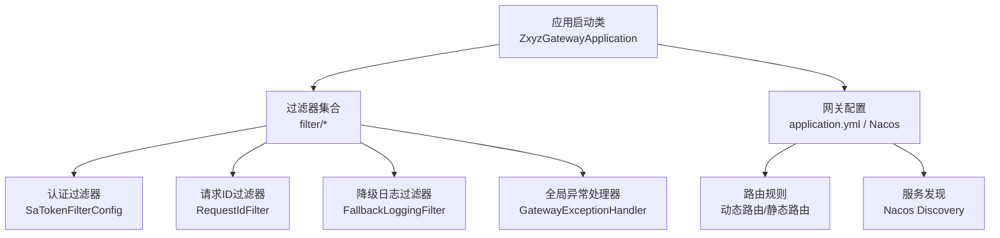
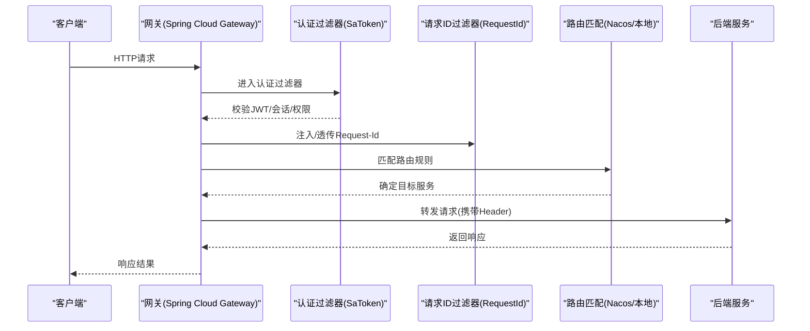
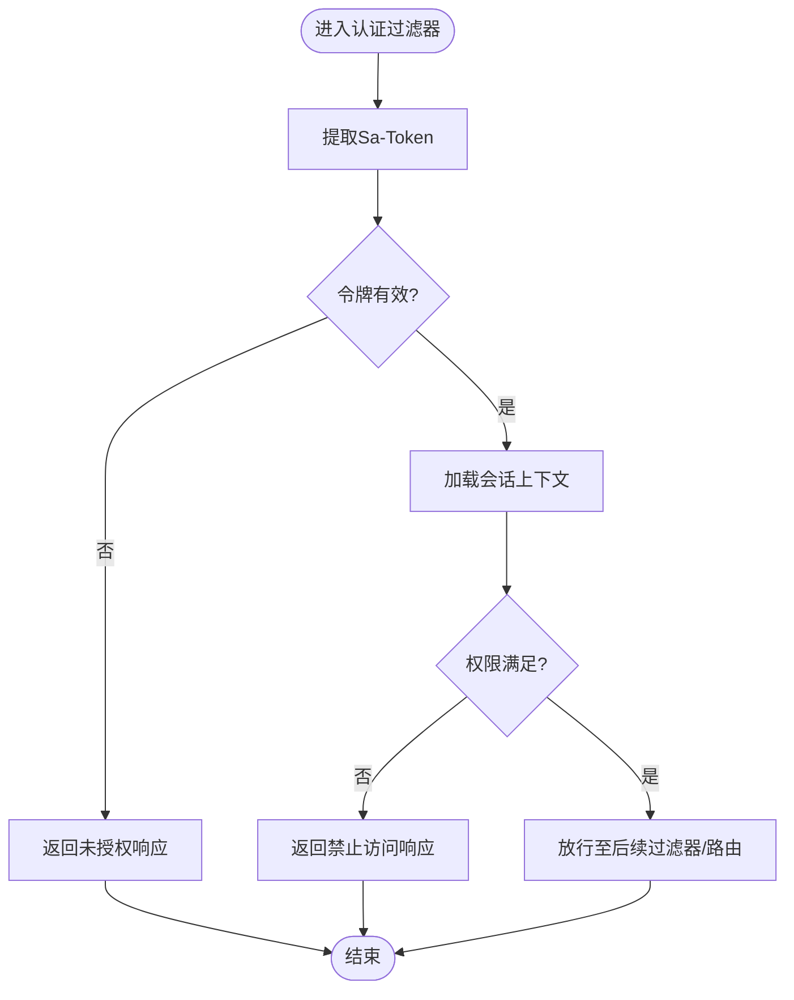
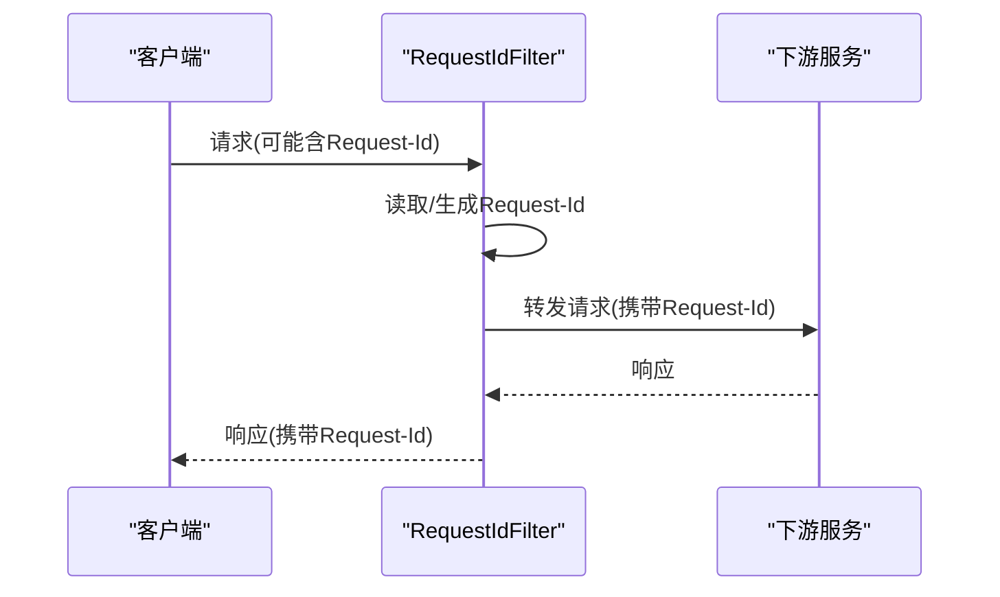
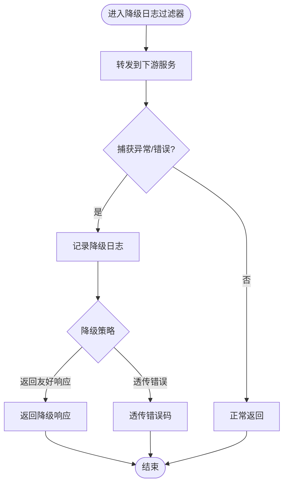
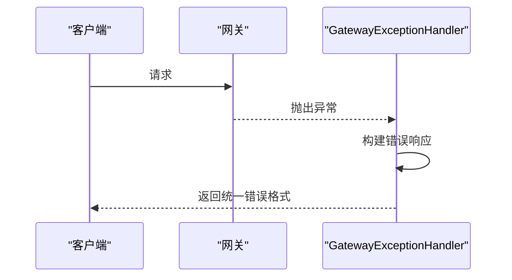
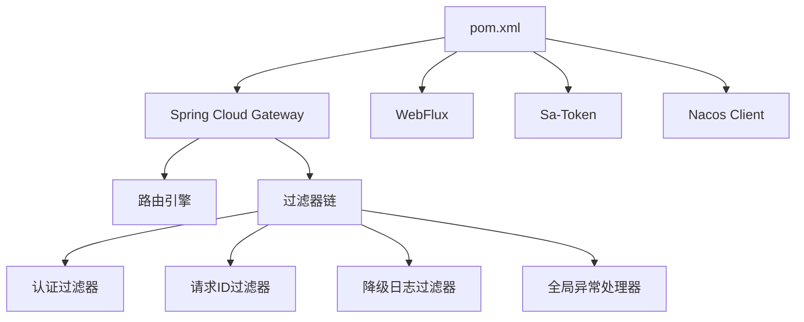

# API网关 (zxyz-gateway)

<cite>
**本文引用的文件**
- [ZxyzGatewayApplication.java](file://ZXYZdatabaseBack/zxyz-gateway/src/main/java/uno/acloud/gateway/ZxyzGatewayApplication.java)
- [application.yml](file://ZXYZdatabaseBack/zxyz-gateway/src/main/resources/application.yml)
- [SaTokenFilterConfig.java](file://ZXYZdatabaseBack/zxyz-gateway/src/main/java/uno/acloud/gateway/filter/SaTokenFilterConfig.java)
- [RequestIdFilter.java](file://ZXYZdatabaseBack/zxyz-gateway/src/main/java/uno/acloud/gateway/filter/RequestIdFilter.java)
- [FallbackLoggingFilter.java](file://ZXYZdatabaseBack/zxyz-gateway/src/main/java/uno/acloud/gateway/filter/FallbackLoggingFilter.java)
- [GatewayExceptionHandler.java](file://ZXYZdatabaseBack/zxyz-gateway/src/main/java/uno/acloud/gateway/filter/GatewayExceptionHandler.java)
- [pom.xml](file://ZXYZdatabaseBack/zxyz-gateway/pom.xml)
- [zxyz-gateway.yml](file://nacos-config/zxyz-gateway.yml)
- [docker-compose.yml](file://docker-compose.yml)
</cite>

## 目录
1. [简介](#简介)
2. [项目结构](#项目结构)
3. [核心组件](#核心组件)
4. [架构总览](#架构总览)
5. [详细组件分析](#详细组件分析)
6. [依赖关系分析](#依赖关系分析)
7. [性能与监控](#性能与监控)
8. [故障排查指南](#故障排查指南)
9. [结论](#结论)
10. [附录](#附录)

## 简介
本文件为 ZXYZ 微服务体系的 API 网关（zxyz-gateway）技术文档。该网关基于 Spring Cloud Gateway，承担统一入口、路由转发、认证鉴权、请求追踪、降级日志与全局异常处理等职责。结合 Nacos 实现配置与服务发现，配合 Sa-Token 完成 JWT 令牌校验与会话管理，并通过自定义过滤器实现分布式链路追踪与限流熔断扩展点。

## 项目结构
zxyz-gateway 模块采用“应用启动类 + 过滤器 + 配置”的轻量结构：
- 应用启动类负责启用 WebFlux、Spring Cloud Gateway 及必要的自动装配。
- 过滤器集中在 filter 包下，分别实现认证、请求ID注入、降级日志与全局异常处理。
- 配置通过 application.yml 与 Nacos 动态配置中心统一管理。

图表来源
- [ZxyzGatewayApplication.java](file://ZXYZdatabaseBack/zxyz-gateway/src/main/java/uno/acloud/gateway/ZxyzGatewayApplication.java)
- [application.yml](file://ZXYZdatabaseBack/zxyz-gateway/src/main/resources/application.yml)
- [zxyz-gateway.yml](file://nacos-config/zxyz-gateway.yml)

章节来源
- [ZxyzGatewayApplication.java](file://ZXYZdatabaseBack/zxyz-gateway/src/main/java/uno/acloud/gateway/ZxyzGatewayApplication.java)
- [application.yml](file://ZXYZdatabaseBack/zxyz-gateway/src/main/resources/application.yml)

## 核心组件
- 认证过滤器（SaTokenFilterConfig）：基于 Sa-Token 进行 JWT 令牌校验、会话管理与权限检查，拦截非内部端点的公网访问。
- 请求ID过滤器（RequestIdFilter）：为每个请求生成或透传 RequestId，便于分布式链路追踪与日志关联。
- 降级日志过滤器（FallbackLoggingFilter）：对下游不可用或超时场景记录降级日志，辅助定位问题。
- 全局异常处理器（GatewayExceptionHandler）：统一捕获网关层异常，输出标准化错误响应。

章节来源
- [SaTokenFilterConfig.java](file://ZXYZdatabaseBack/zxyz-gateway/src/main/java/uno/acloud/gateway/filter/SaTokenFilterConfig.java)
- [RequestIdFilter.java](file://ZXYZdatabaseBack/zxyz-gateway/src/main/java/uno/acloud/gateway/filter/RequestIdFilter.java)
- [FallbackLoggingFilter.java](file://ZXYZdatabaseBack/zxyz-gateway/src/main/java/uno/acloud/gateway/filter/FallbackLoggingFilter.java)
- [GatewayExceptionHandler.java](file://ZXYZdatabaseBack/zxyz-gateway/src/main/java/uno/acloud/gateway/filter/GatewayExceptionHandler.java)

## 架构总览
网关作为统一入口，将外部请求按路由规则转发至对应后端服务。认证与鉴权在网关层完成，避免重复逻辑下沉到各服务；请求ID贯穿全链路，便于追踪；异常与降级策略集中处理，提升系统稳定性。

图表来源
- [application.yml](file://ZXYZdatabaseBack/zxyz-gateway/src/main/resources/application.yml)
- [zxyz-gateway.yml](file://nacos-config/zxyz-gateway.yml)
- [SaTokenFilterConfig.java](file://ZXYZdatabaseBack/zxyz-gateway/src/main/java/uno/acloud/gateway/filter/SaTokenFilterConfig.java)
- [RequestIdFilter.java](file://ZXYZdatabaseBack/zxyz-gateway/src/main/java/uno/acloud/gateway/filter/RequestIdFilter.java)

## 详细组件分析

### 认证过滤器（SaTokenFilterConfig）
- 功能要点
  - 从请求头或 Cookie 中解析 Sa-Token（JWT），校验签名与有效期。
  - 基于 Sa-Token 的会话机制维护用户上下文，支持跨请求复用。
  - 权限检查：根据角色/权限标识判断是否允许访问目标资源。
  - 白名单策略：放行健康检查、静态资源、登录注册等公开接口。
  - 内部端点保护：拒绝公网直接访问 /api/internal/**，仅允许内网调用。
- 数据流
  - 请求进入 → 提取令牌 → 校验令牌 → 加载会话 → 权限判定 → 放行或拒绝。
- 错误处理
  - 令牌缺失/过期/非法时返回统一未授权响应。
  - 权限不足时返回禁止访问响应。
- 优化建议
  - 缓存热点用户会话信息，降低 Redis 压力。
  - 对高频接口做令牌快速失败路径，减少不必要的会话查询。

图表来源
- [SaTokenFilterConfig.java](file://ZXYZdatabaseBack/zxyz-gateway/src/main/java/uno/acloud/gateway/filter/SaTokenFilterConfig.java)

章节来源
- [SaTokenFilterConfig.java](file://ZXYZdatabaseBack/zxyz-gateway/src/main/java/uno/acloud/gateway/filter/SaTokenFilterConfig.java)

### 请求ID过滤器（RequestIdFilter）
- 功能要点
  - 若请求已包含 Request-Id，则透传到下游服务。
  - 若无，则生成唯一 ID（如 UUID），并写入响应头，便于前端与日志关联。
  - 将 Request-Id 注入到全局上下文，供日志框架使用（例如 MDC）。
- 数据流
  - 请求进入 → 读取/生成 Request-Id → 设置请求头 → 传递到下游 → 设置响应头。
- 错误处理
  - 生成失败时回退到默认值并记录告警日志。
- 优化建议
  - 使用高性能随机数生成器，避免阻塞。
  - 控制 Header 大小，避免过大影响网络传输。

图表来源
- [RequestIdFilter.java](file://ZXYZdatabaseBack/zxyz-gateway/src/main/java/uno/acloud/gateway/filter/RequestIdFilter.java)

章节来源
- [RequestIdFilter.java](file://ZXYZdatabaseBack/zxyz-gateway/src/main/java/uno/acloud/gateway/filter/RequestIdFilter.java)

### 降级日志过滤器（FallbackLoggingFilter）
- 功能要点
  - 捕获下游服务的超时、连接失败、5xx 错误等异常。
  - 记录降级原因、请求上下文（URI、方法、耗时、Request-Id）。
  - 可选择返回友好降级响应或继续透传错误码。
- 数据流
  - 请求转发 → 捕获异常 → 记录日志 → 决定降级策略。
- 错误处理
  - 日志落盘失败时降级为内存缓冲，避免阻塞主流程。
- 优化建议
  - 异步写日志，降低对请求延迟的影响。
  - 聚合统计降级率，触发告警。

图表来源
- [FallbackLoggingFilter.java](file://ZXYZdatabaseBack/zxyz-gateway/src/main/java/uno/acloud/gateway/filter/FallbackLoggingFilter.java)

章节来源
- [FallbackLoggingFilter.java](file://ZXYZdatabaseBack/zxyz-gateway/src/main/java/uno/acloud/gateway/filter/FallbackLoggingFilter.java)

### 全局异常处理器（GatewayExceptionHandler）
- 功能要点
  - 统一捕获网关层的运行时异常、参数校验异常、路由异常等。
  - 输出标准化错误响应体（code/message/data），便于前端统一处理。
  - 记录异常堆栈与请求上下文，辅助定位问题。
- 数据流
  - 异常抛出 → 处理器捕获 → 构建错误响应 → 返回客户端。
- 错误处理
  - 对未知异常提供兜底响应，避免泄露敏感信息。
- 优化建议
  - 区分业务异常与系统异常，分类统计。
  - 对频繁异常的路由进行限流或熔断。

图表来源
- [GatewayExceptionHandler.java](file://ZXYZdatabaseBack/zxyz-gateway/src/main/java/uno/acloud/gateway/filter/GatewayExceptionHandler.java)

章节来源
- [GatewayExceptionHandler.java](file://ZXYZdatabaseBack/zxyz-gateway/src/main/java/uno/acloud/gateway/filter/GatewayExceptionHandler.java)

### 路由与服务发现
- 路由规则
  - 支持静态路由（application.yml）与动态路由（Nacos 配置中心）。
  - 支持路径重写、头部修改、负载均衡与健康检查。
- 服务发现
  - 集成 Nacos Discovery，自动注册与发现后端服务实例。
  - 支持多环境配置隔离（dev/prod）。
- 高级特性
  - CORS 跨域：允许指定域名、方法与头。
  - 请求/响应转换：统一包装响应体、过滤敏感字段。
  - 限流熔断：可集成 Resilience4j 或 Sentinel 扩展点。

章节来源
- [application.yml](file://ZXYZdatabaseBack/zxyz-gateway/src/main/resources/application.yml)
- [zxyz-gateway.yml](file://nacos-config/zxyz-gateway.yml)

## 依赖关系分析
网关模块依赖 Spring Cloud Gateway、WebFlux、Sa-Token、Nacos 客户端等组件。通过 Maven 管理依赖版本，确保与微服务生态兼容。

图表来源
- [pom.xml](file://ZXYZdatabaseBack/zxyz-gateway/pom.xml)

章节来源
- [pom.xml](file://ZXYZdatabaseBack/zxyz-gateway/pom.xml)

## 性能与监控
- 性能优化建议
  - 启用 Netty 线程池调优，合理设置 I/O 线程与工作线程数量。
  - 开启连接池与 Keep-Alive，减少 TCP 握手开销。
  - 对认证与权限检查引入缓存，降低 Redis 与数据库压力。
  - 使用压缩与分块传输，减少大响应体带宽占用。
- 监控指标配置
  - 暴露 Actuator 端点，收集 QPS、延迟、错误率、线程池状态。
  - 集成 Prometheus 抓取指标，Grafana 可视化展示。
  - 链路追踪接入 SkyWalking/Zipkin，基于 Request-Id 串联日志。
- 部署与运行
  - Docker Compose 编排网关容器，环境变量注入 Nacos 地址与密钥。
  - 健康检查探针用于 K8s 或编排平台的生命周期管理。

章节来源
- [docker-compose.yml](file://docker-compose.yml)
- [application.yml](file://ZXYZdatabaseBack/zxyz-gateway/src/main/resources/application.yml)

## 故障排查指南
- 常见问题
  - 认证失败：检查 Sa-Token 是否过期、签名是否一致、Cookie/请求头是否正确。
  - 路由不生效：核对 Nacos 配置中的路由规则与后端服务名称。
  - 请求无 Request-Id：确认过滤器顺序与 Header 透传配置。
  - 降级日志过多：关注下游服务可用性，必要时扩容或熔断。
- 诊断步骤
  - 查看网关日志，定位异常堆栈与 Request-Id。
  - 检查 Nacos 配置中心，验证路由与服务发现状态。
  - 使用浏览器开发者工具或 curl 验证响应头与错误码。
  - 通过监控面板观察 QPS、延迟与错误率趋势。

章节来源
- [SaTokenFilterConfig.java](file://ZXYZdatabaseBack/zxyz-gateway/src/main/java/uno/acloud/gateway/filter/SaTokenFilterConfig.java)
- [RequestIdFilter.java](file://ZXYZdatabaseBack/zxyz-gateway/src/main/java/uno/acloud/gateway/filter/RequestIdFilter.java)
- [FallbackLoggingFilter.java](file://ZXYZdatabaseBack/zxyz-gateway/src/main/java/uno/acloud/gateway/filter/FallbackLoggingFilter.java)
- [GatewayExceptionHandler.java](file://ZXYZdatabaseBack/zxyz-gateway/src/main/java/uno/acloud/gateway/filter/GatewayExceptionHandler.java)

## 结论
ZXYZ 网关以 Spring Cloud Gateway 为核心，结合 Sa-Token、Nacos 与自定义过滤器，构建了安全、稳定、可观测的统一入口。通过认证鉴权、请求追踪、降级日志与全局异常处理，显著提升了系统的可维护性与用户体验。建议在后续迭代中持续优化性能与监控能力，完善限流熔断策略，保障高并发场景下的稳定性。

## 附录
- 相关配置文件路径
  - 网关应用配置：[application.yml](file://ZXYZdatabaseBack/zxyz-gateway/src/main/resources/application.yml)
  - Nacos 动态配置：[zxyz-gateway.yml](file://nacos-config/zxyz-gateway.yml)
  - 依赖声明：[pom.xml](file://ZXYZdatabaseBack/zxyz-gateway/pom.xml)
  - 容器编排：[docker-compose.yml](file://docker-compose.yml)