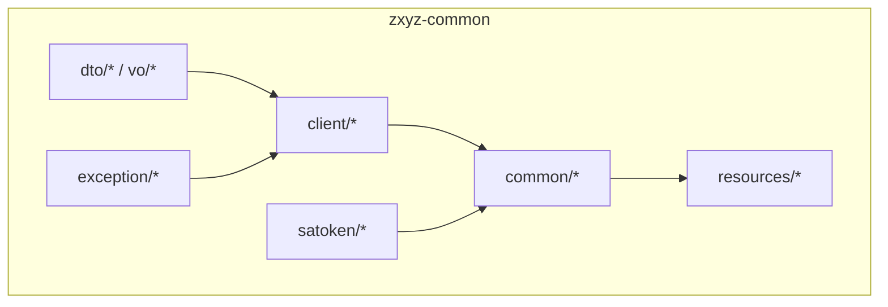
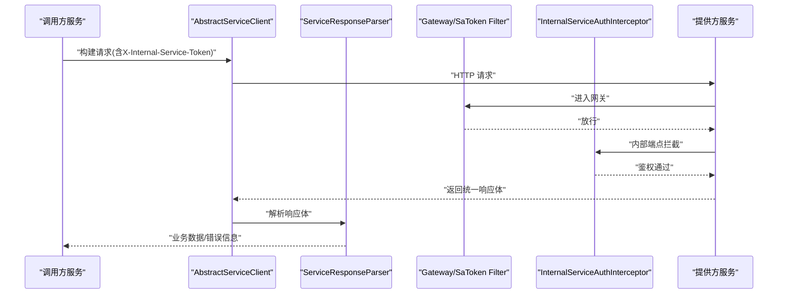
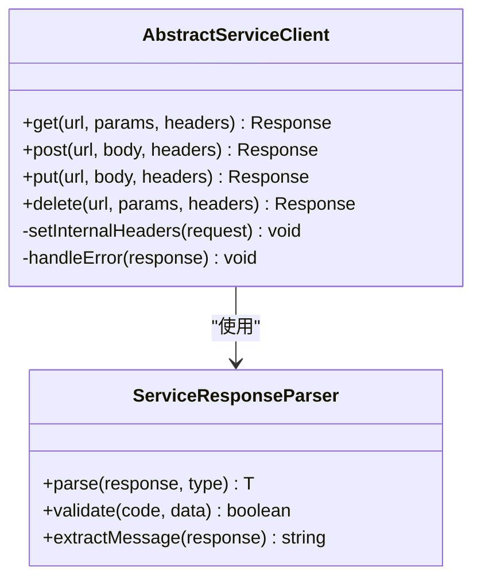
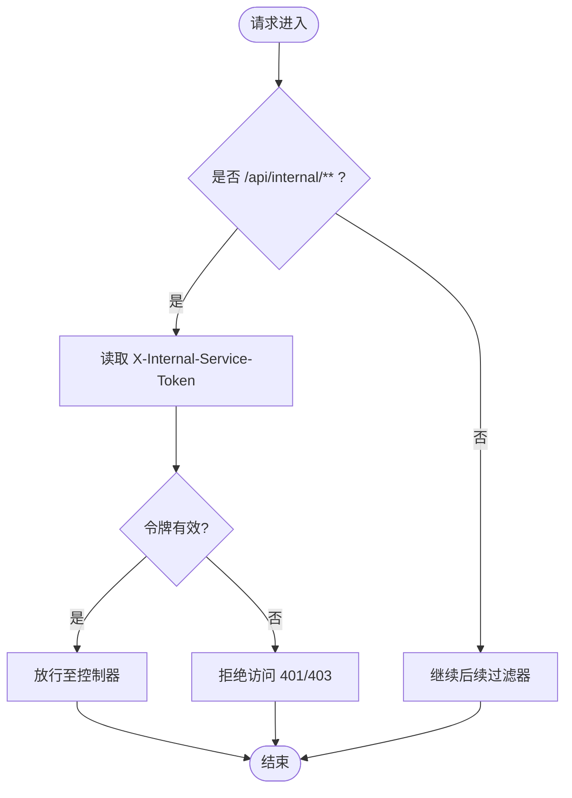
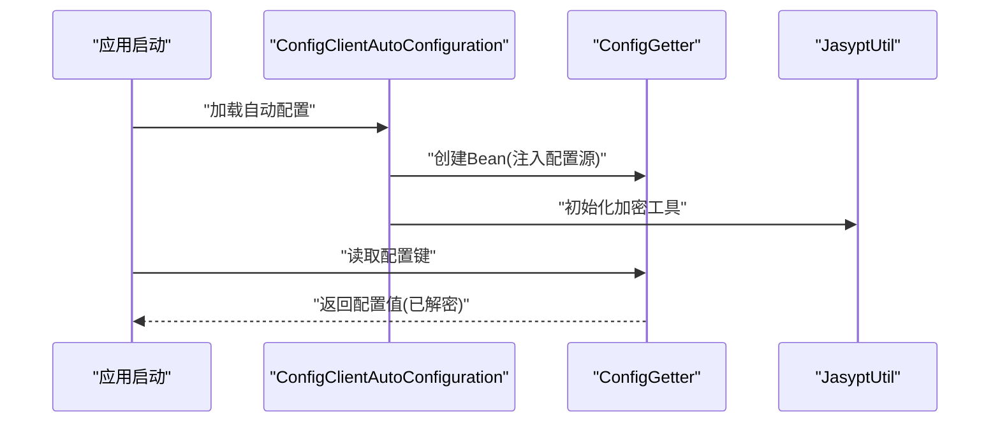
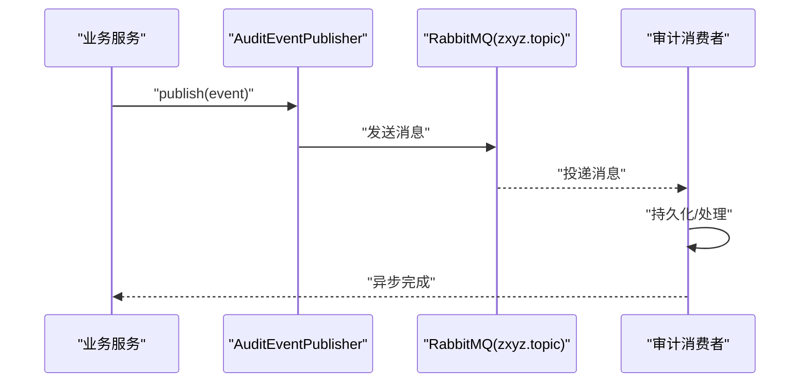
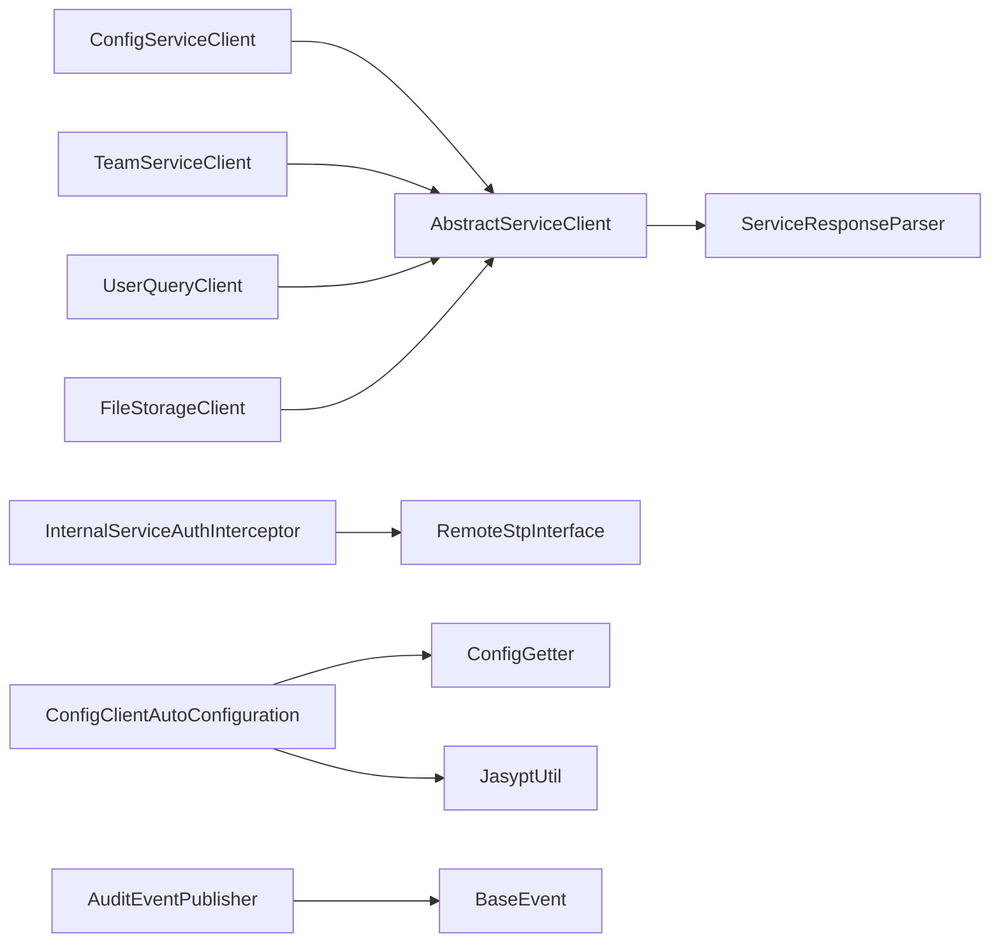

# 公共组件库 (zxyz-common)

<cite>
**本文引用的文件**   
- [AbstractServiceClient.java](file://ZXYZdatabaseBack/zxyz-common/src/main/java/uno/acloud/client/AbstractServiceClient.java)
- [ServiceResponseParser.java](file://ZXYZdatabaseBack/zxyz-common/src/main/java/uno/acloud/client/ServiceResponseParser.java)
- [ConfigServiceClient.java](file://ZXYZdatabaseBack/zxyz-common/src/main/java/uno/acloud/client/ConfigServiceClient.java)
- [TeamServiceClient.java](file://ZXYZdatabaseBack/zxyz-common/src/main/java/uno/acloud/client/TeamServiceClient.java)
- [UserQueryClient.java](file://ZXYZdatabaseBack/zxyz-common/src/main/java/uno/acloud/client/UserQueryClient.java)
- [FileStorageClient.java](file://ZXYZdatabaseBack/zxyz-common/src/main/java/uno/acloud/client/FileStorageClient.java)
- [application-common.yml](file://ZXYZdatabaseBack/zxyz-common/src/main/resources/application-common.yml)
- [BaseEvent.java](file://ZXYZdatabaseBack/zxyz-common/src/main/java/uno/acloud/common/event/BaseEvent.java)
- [AuditEventPublisher.java](file://ZXYZdatabaseBack/zxyz-common/src/main/java/uno/acloud/common/audit/AuditEventPublisher.java)
- [InternalServiceAuthInterceptor.java](file://ZXYZdatabaseBack/zxyz-common/src/main/java/uno/acloud/satoken/InternalServiceAuthInterceptor.java)
- [RemoteStpInterface.java](file://ZXYZdatabaseBack/zxyz-common/src/main/java/uno/acloud/satoken/RemoteStpInterface.java)
- [ConfigGetter.java](file://ZXYZdatabaseBack/zxyz-common/src/main/java/uno/acloud/common/config/ConfigGetter.java)
- [JasyptUtil.java](file://ZXYZdatabaseBack/zxyz-common/src/main/java/uno/acloud/common/util/JasyptUtil.java)
- [ConfigClientAutoConfiguration.java](file://ZXYZdatabaseBack/zxyz-common/src/main/java/uno/acloud/common/config/ConfigClientAutoConfiguration.java)
</cite>

## 目录
1. [简介](#简介)
2. [项目结构](#项目结构)
3. [核心组件](#核心组件)
4. [架构总览](#架构总览)
5. [详细组件分析](#详细组件分析)
6. [依赖关系分析](#依赖关系分析)
7. [性能考量](#性能考量)
8. [故障排查指南](#故障排查指南)
9. [结论](#结论)
10. [附录：使用示例与最佳实践](#附录使用示例与最佳实践)

## 简介
本仓库的 zxyz-common 模块是 ZXYZ 微服务体系的公共能力基座，提供跨服务的统一客户端抽象、响应解析器、内部服务鉴权拦截器、配置获取与加密工具、事件驱动基础以及通用基础设施配置。通过该模块，各业务服务可以以一致的方式调用其他服务、处理内部安全头、读取动态配置、发布与消费事件，并复用缓存、数据库与 OpenAPI 等通用能力。

## 项目结构
zxyz-common 采用按职责分层的包组织方式：
- client：服务间同步调用的客户端抽象与具体实现
- common：通用能力（配置、事件、审计、权限、工具、Web 等）
- satoken：SaToken 集成与安全相关组件
- dto/vo：跨服务传输的数据对象
- exception：异常定义与处理
- resources：通用 Spring 配置文件

图表来源
- [AbstractServiceClient.java:1-200](file://ZXYZdatabaseBack/zxyz-common/src/main/java/uno/acloud/client/AbstractServiceClient.java#L1-L200)
- [ServiceResponseParser.java:1-200](file://ZXYZdatabaseBack/zxyz-common/src/main/java/uno/acloud/client/ServiceResponseParser.java#L1-L200)
- [application-common.yml:1-200](file://ZXYZdatabaseBack/zxyz-common/src/main/resources/application-common.yml#L1-L200)

章节来源
- [AbstractServiceClient.java:1-200](file://ZXYZdatabaseBack/zxyz-common/src/main/java/uno/acloud/client/AbstractServiceClient.java#L1-L200)
- [application-common.yml:1-200](file://ZXYZdatabaseBack/zxyz-common/src/main/resources/application-common.yml#L1-L200)

## 核心组件
- AbstractServiceClient：封装 HTTP 客户端的通用逻辑，统一设置内部服务请求头、重试与超时、错误码映射与结果包装。
- ServiceResponseParser：对统一响应体进行解析与校验，支持泛型反序列化与错误信息提取。
- InternalServiceAuthInterceptor：在网关或下游服务侧校验 X-Internal-Service-Token，确保内部端点仅被可信服务访问。
- RemoteStpInterface：将 SaToken 的会话与权限校验下沉到远程服务，实现跨服务认证一致性。
- ConfigGetter：从配置中心或本地配置中获取键值，支持默认值与类型转换。
- JasyptUtil：基于 Jasypt 的加解密工具，用于敏感配置项的安全管理。
- BaseEvent：事件总线的基础事件模型，包含事件类型、时间戳、上下文等元数据。
- AuditEventPublisher：审计事件的发布器，结合异步消息队列完成解耦与持久化。

章节来源
- [AbstractServiceClient.java:1-200](file://ZXYZdatabaseBack/zxyz-common/src/main/java/uno/acloud/client/AbstractServiceClient.java#L1-L200)
- [ServiceResponseParser.java:1-200](file://ZXYZdatabaseBack/zxyz-common/src/main/java/uno/acloud/client/ServiceResponseParser.java#L1-L200)
- [InternalServiceAuthInterceptor.java:1-200](file://ZXYZdatabaseBack/zxyz-common/src/main/java/uno/acloud/satoken/InternalServiceAuthInterceptor.java#L1-L200)
- [RemoteStpInterface.java:1-200](file://ZXYZdatabaseBack/zxyz-common/src/main/java/uno/acloud/satoken/RemoteStpInterface.java#L1-L200)
- [ConfigGetter.java:1-200](file://ZXYZdatabaseBack/zxyz-common/src/main/java/uno/acloud/common/config/ConfigGetter.java#L1-L200)
- [JasyptUtil.java:1-200](file://ZXYZdatabaseBack/zxyz-common/src/main/java/uno/acloud/common/util/JasyptUtil.java#L1-L200)
- [BaseEvent.java:1-200](file://ZXYZdatabaseBack/zxyz-common/src/main/java/uno/acloud/common/event/BaseEvent.java#L1-L200)
- [AuditEventPublisher.java:1-200](file://ZXYZdatabaseBack/zxyz-common/src/main/java/uno/acloud/common/audit/AuditEventPublisher.java#L1-L200)

## 架构总览
下图展示了 zxyz-common 在微服务体系中的角色与交互：客户端发起内部服务调用，携带内部令牌；网关或服务端拦截器校验令牌；响应经解析器统一处理；配置与加密由配置模块提供；事件通过事件总线异步传播。

图表来源
- [AbstractServiceClient.java:1-200](file://ZXYZdatabaseBack/zxyz-common/src/main/java/uno/acloud/client/AbstractServiceClient.java#L1-L200)
- [ServiceResponseParser.java:1-200](file://ZXYZdatabaseBack/zxyz-common/src/main/java/uno/acloud/client/ServiceResponseParser.java#L1-L200)
- [InternalServiceAuthInterceptor.java:1-200](file://ZXYZdatabaseBack/zxyz-common/src/main/java/uno/acloud/satoken/InternalServiceAuthInterceptor.java#L1-L200)

## 详细组件分析

### 抽象服务客户端与响应解析器
- AbstractServiceClient
  - 设计模式：模板方法 + 策略。子类只需定义目标服务地址与路径，父类负责统一设置内部服务头、超时、重试、错误码映射与结果包装。
  - 关键机制：
    - 内部服务头注入：为每个请求添加 X-Internal-Service-Token，供服务端鉴权。
    - 错误处理：将 HTTP 状态码与业务错误码转换为统一的异常或 Result 结构。
    - 可插拔解析：委托 ServiceResponseParser 进行 JSON 反序列化与字段校验。
- ServiceResponseParser
  - 功能：解析统一响应体，提取 code/data/message，支持泛型 T 的反序列化与空值保护。
  - 扩展点：自定义解析策略（如兼容历史接口）、失败重试策略、日志脱敏。

图表来源
- [AbstractServiceClient.java:1-200](file://ZXYZdatabaseBack/zxyz-common/src/main/java/uno/acloud/client/AbstractServiceClient.java#L1-L200)
- [ServiceResponseParser.java:1-200](file://ZXYZdatabaseBack/zxyz-common/src/main/java/uno/acloud/client/ServiceResponseParser.java#L1-L200)

章节来源
- [AbstractServiceClient.java:1-200](file://ZXYZdatabaseBack/zxyz-common/src/main/java/uno/acloud/client/AbstractServiceClient.java#L1-L200)
- [ServiceResponseParser.java:1-200](file://ZXYZdatabaseBack/zxyz-common/src/main/java/uno/acloud/client/ServiceResponseParser.java#L1-L200)

### 内部服务鉴权与 SaToken 集成
- InternalServiceAuthInterceptor
  - 职责：校验请求头中的 X-Internal-Service-Token，拒绝非内部流量访问 /api/internal/** 端点。
  - 行为：白名单校验、签名验证、来源 IP 限制（可选）。
- RemoteStpInterface
  - 职责：实现 SaToken 的远程接口，使下游服务能查询当前用户、角色、权限等信息，保持跨服务认证一致性。
  - 场景：网关层做一次性认证后，下游服务通过该接口拉取会话与权限上下文。

图表来源
- [InternalServiceAuthInterceptor.java:1-200](file://ZXYZdatabaseBack/zxyz-common/src/main/java/uno/acloud/satoken/InternalServiceAuthInterceptor.java#L1-L200)
- [RemoteStpInterface.java:1-200](file://ZXYZdatabaseBack/zxyz-common/src/main/java/uno/acloud/satoken/RemoteStpInterface.java#L1-L200)

章节来源
- [InternalServiceAuthInterceptor.java:1-200](file://ZXYZdatabaseBack/zxyz-common/src/main/java/uno/acloud/satoken/InternalServiceAuthInterceptor.java#L1-L200)
- [RemoteStpInterface.java:1-200](file://ZXYZdatabaseBack/zxyz-common/src/main/java/uno/acloud/satoken/RemoteStpInterface.java#L1-L200)

### 配置管理与加密
- ConfigClientAutoConfiguration
  - 作用：自动装配配置客户端，注册 ConfigGetter Bean，初始化加密工具。
- ConfigGetter
  - 功能：从 Nacos/本地配置中读取键值，支持类型转换与默认值回退。
  - 特性：线程安全、缓存热点键、支持占位符解析。
- JasyptUtil
  - 功能：对敏感配置进行加解密，避免明文存储密钥。
  - 用法：在配置文件中以 ENC(...) 包裹密文，启动时自动解密。

图表来源
- [ConfigClientAutoConfiguration.java:1-200](file://ZXYZdatabaseBack/zxyz-common/src/main/java/uno/acloud/common/config/ConfigClientAutoConfiguration.java#L1-L200)
- [ConfigGetter.java:1-200](file://ZXYZdatabaseBack/zxyz-common/src/main/java/uno/acloud/common/config/ConfigGetter.java#L1-L200)
- [JasyptUtil.java:1-200](file://ZXYZdatabaseBack/zxyz-common/src/main/java/uno/acloud/common/util/JasyptUtil.java#L1-L200)

章节来源
- [ConfigClientAutoConfiguration.java:1-200](file://ZXYZdatabaseBack/zxyz-common/src/main/java/uno/acloud/common/config/ConfigClientAutoConfiguration.java#L1-L200)
- [ConfigGetter.java:1-200](file://ZXYZdatabaseBack/zxyz-common/src/main/java/uno/acloud/common/config/ConfigGetter.java#L1-L200)
- [JasyptUtil.java:1-200](file://ZXYZdatabaseBack/zxyz-common/src/main/java/uno/acloud/common/util/JasyptUtil.java#L1-L200)

### 事件驱动架构
- BaseEvent
  - 结构：包含事件类型、时间戳、关联 ID、上下文信息等元数据，作为所有业务事件的基类。
- AuditEventPublisher
  - 职责：发布审计事件，通常通过 MQ（Topic Exchange zxyz.topic）异步投递，保证最终一致性与可追溯性。
  - 流程：生成事件 -> 序列化为消息 -> 发送到队列 -> 消费者处理（落库/告警/归档）。

图表来源
- [BaseEvent.java:1-200](file://ZXYZdatabaseBack/zxyz-common/src/main/java/uno/acloud/common/event/BaseEvent.java#L1-L200)
- [AuditEventPublisher.java:1-200](file://ZXYZdatabaseBack/zxyz-common/src/main/java/uno/acloud/common/audit/AuditEventPublisher.java#L1-L200)

章节来源
- [BaseEvent.java:1-200](file://ZXYZdatabaseBack/zxyz-common/src/main/java/uno/acloud/common/event/BaseEvent.java#L1-L200)
- [AuditEventPublisher.java:1-200](file://ZXYZdatabaseBack/zxyz-common/src/main/java/uno/acloud/common/audit/AuditEventPublisher.java#L1-L200)

### 基础设施组件（缓存、MyBatis-Plus、OpenAPI）
- 缓存配置：通过 application-common.yml 启用 Redis 连接池、序列化策略与过期策略，配合 @Cacheable/@CacheEvict 注解使用。
- MyBatis-Plus 配置：分页插件、逻辑删除、自动填充、全局 SQL 日志开关，提升开发效率与一致性。
- OpenAPI 配置：统一 API 文档前缀、分组与鉴权说明，便于前后端联调与自动化测试。

章节来源
- [application-common.yml:1-200](file://ZXYZdatabaseBack/zxyz-common/src/main/resources/application-common.yml#L1-L200)

## 依赖关系分析
zxyz-common 与其他模块的依赖关系如下：
- 客户端依赖：ConfigServiceClient、TeamServiceClient、UserQueryClient、FileStorageClient 均继承 AbstractServiceClient，复用统一调用能力。
- 安全依赖：InternalServiceAuthInterceptor 与 RemoteStpInterface 依赖 SaToken 生态，保障内部服务通信安全。
- 配置依赖：ConfigClientAutoConfiguration 装配 ConfigGetter 与 JasyptUtil，为各服务提供一致的配置访问方式。
- 事件依赖：AuditEventPublisher 依赖消息中间件，与业务服务解耦。

图表来源
- [AbstractServiceClient.java:1-200](file://ZXYZdatabaseBack/zxyz-common/src/main/java/uno/acloud/client/AbstractServiceClient.java#L1-L200)
- [ServiceResponseParser.java:1-200](file://ZXYZdatabaseBack/zxyz-common/src/main/java/uno/acloud/client/ServiceResponseParser.java#L1-L200)
- [InternalServiceAuthInterceptor.java:1-200](file://ZXYZdatabaseBack/zxyz-common/src/main/java/uno/acloud/satoken/InternalServiceAuthInterceptor.java#L1-L200)
- [RemoteStpInterface.java:1-200](file://ZXYZdatabaseBack/zxyz-common/src/main/java/uno/acloud/satoken/RemoteStpInterface.java#L1-L200)
- [ConfigClientAutoConfiguration.java:1-200](file://ZXYZdatabaseBack/zxyz-common/src/main/java/uno/acloud/common/config/ConfigClientAutoConfiguration.java#L1-L200)
- [ConfigGetter.java:1-200](file://ZXYZdatabaseBack/zxyz-common/src/main/java/uno/acloud/common/config/ConfigGetter.java#L1-L200)
- [JasyptUtil.java:1-200](file://ZXYZdatabaseBack/zxyz-common/src/main/java/uno/acloud/common/util/JasyptUtil.java#L1-L200)
- [BaseEvent.java:1-200](file://ZXYZdatabaseBack/zxyz-common/src/main/java/uno/acloud/common/event/BaseEvent.java#L1-L200)
- [AuditEventPublisher.java:1-200](file://ZXYZdatabaseBack/zxyz-common/src/main/java/uno/acloud/common/audit/AuditEventPublisher.java#L1-L200)
- [ConfigServiceClient.java:1-200](file://ZXYZdatabaseBack/zxyz-common/src/main/java/uno/acloud/client/ConfigServiceClient.java#L1-L200)
- [TeamServiceClient.java:1-200](file://ZXYZdatabaseBack/zxyz-common/src/main/java/uno/acloud/client/TeamServiceClient.java#L1-L200)
- [UserQueryClient.java:1-200](file://ZXYZdatabaseBack/zxyz-common/src/main/java/uno/acloud/client/UserQueryClient.java#L1-L200)
- [FileStorageClient.java:1-200](file://ZXYZdatabaseBack/zxyz-common/src/main/java/uno/acloud/client/FileStorageClient.java#L1-L200)

章节来源
- [AbstractServiceClient.java:1-200](file://ZXYZdatabaseBack/zxyz-common/src/main/java/uno/acloud/client/AbstractServiceClient.java#L1-L200)
- [ConfigServiceClient.java:1-200](file://ZXYZdatabaseBack/zxyz-common/src/main/java/uno/acloud/client/ConfigServiceClient.java#L1-L200)
- [TeamServiceClient.java:1-200](file://ZXYZdatabaseBack/zxyz-common/src/main/java/uno/acloud/client/TeamServiceClient.java#L1-L200)
- [UserQueryClient.java:1-200](file://ZXYZdatabaseBack/zxyz-common/src/main/java/uno/acloud/client/UserQueryClient.java#L1-L200)
- [FileStorageClient.java:1-200](file://ZXYZdatabaseBack/zxyz-common/src/main/java/uno/acloud/client/FileStorageClient.java#L1-L200)

## 性能考量
- 客户端优化
  - 连接池：合理设置最大连接数、空闲超时与连接回收策略，避免连接泄漏。
  - 超时与重试：为不同服务设置差异化超时与重试次数，防止雪崩。
  - 响应解析：避免不必要的对象拷贝，优先使用流式解析大响应体。
- 鉴权与拦截
  - 令牌校验：尽量使用内存白名单与快速失败策略，减少 IO 开销。
  - 会话查询：RemoteStpInterface 应缓存用户会话，降低远程调用频率。
- 配置与加密
  - 配置缓存：对热点配置键进行本地缓存，减少配置中心压力。
  - 加解密：仅在启动时解密敏感配置，运行时避免重复加解密。
- 事件与消息
  - 批量发送：合并小消息为批量，提高吞吐。
  - 幂等处理：消费者需实现去重与幂等，避免重复处理。

[本节为通用指导，不直接分析具体文件]

## 故障排查指南
- 内部服务调用失败
  - 检查 X-Internal-Service-Token 是否正确注入与校验。
  - 查看 ServiceResponseParser 的错误码映射与日志脱敏。
- 鉴权拦截报错
  - 确认 InternalServiceAuthInterceptor 的白名单与签名规则。
  - 检查 RemoteStpInterface 的远程会话查询是否可达。
- 配置读取异常
  - 验证 ConfigGetter 的键名与默认值。
  - 检查 JasyptUtil 的密钥配置与 ENC 格式。
- 事件未消费
  - 检查 RabbitMQ 队列与 Topic Exchange 绑定。
  - 查看消费者日志与重试死信队列。

章节来源
- [AbstractServiceClient.java:1-200](file://ZXYZdatabaseBack/zxyz-common/src/main/java/uno/acloud/client/AbstractServiceClient.java#L1-L200)
- [ServiceResponseParser.java:1-200](file://ZXYZdatabaseBack/zxyz-common/src/main/java/uno/acloud/client/ServiceResponseParser.java#L1-L200)
- [InternalServiceAuthInterceptor.java:1-200](file://ZXYZdatabaseBack/zxyz-common/src/main/java/uno/acloud/satoken/InternalServiceAuthInterceptor.java#L1-L200)
- [RemoteStpInterface.java:1-200](file://ZXYZdatabaseBack/zxyz-common/src/main/java/uno/acloud/satoken/RemoteStpInterface.java#L1-L200)
- [ConfigGetter.java:1-200](file://ZXYZdatabaseBack/zxyz-common/src/main/java/uno/acloud/common/config/ConfigGetter.java#L1-L200)
- [JasyptUtil.java:1-200](file://ZXYZdatabaseBack/zxyz-common/src/main/java/uno/acloud/common/util/JasyptUtil.java#L1-L200)
- [AuditEventPublisher.java:1-200](file://ZXYZdatabaseBack/zxyz-common/src/main/java/uno/acloud/common/audit/AuditEventPublisher.java#L1-L200)

## 结论
zxyz-common 为 ZXYZ 微服务提供了稳定、一致且可扩展的公共能力。通过抽象客户端、统一响应解析、内部服务鉴权、配置与加密、事件驱动与基础设施配置，显著降低了各服务的重复开发与维护成本。建议在新服务中优先复用该模块，遵循窄端点与投影模式，确保系统演进的可控性与安全性。

[本节为总结，不直接分析具体文件]

## 附录：使用示例与最佳实践
- 服务间调用
  - 继承 AbstractServiceClient，定义目标服务方法与路径。
  - 使用 ServiceResponseParser 解析统一响应，处理错误码与消息。
  - 示例参考：ConfigServiceClient、TeamServiceClient、UserQueryClient、FileStorageClient。
- 内部服务鉴权
  - 在客户端注入 X-Internal-Service-Token。
  - 在服务端配置 InternalServiceAuthInterceptor，限制 /api/internal/**。
  - 使用 RemoteStpInterface 获取用户上下文。
- 配置与加密
  - 通过 ConfigGetter 读取配置，设置默认值与类型转换。
  - 使用 JasyptUtil 对敏感配置进行加密，启动时自动解密。
- 事件驱动
  - 定义继承 BaseEvent 的业务事件。
  - 使用 AuditEventPublisher 发布事件，消费者监听并处理。
- 基础设施
  - 在 application-common.yml 中配置缓存、MyBatis-Plus 与 OpenAPI。
  - 遵循分页、逻辑删除与全局日志规范。

章节来源
- [ConfigServiceClient.java:1-200](file://ZXYZdatabaseBack/zxyz-common/src/main/java/uno/acloud/client/ConfigServiceClient.java#L1-L200)
- [TeamServiceClient.java:1-200](file://ZXYZdatabaseBack/zxyz-common/src/main/java/uno/acloud/client/TeamServiceClient.java#L1-L200)
- [UserQueryClient.java:1-200](file://ZXYZdatabaseBack/zxyz-common/src/main/java/uno/acloud/client/UserQueryClient.java#L1-L200)
- [FileStorageClient.java:1-200](file://ZXYZdatabaseBack/zxyz-common/src/main/java/uno/acloud/client/FileStorageClient.java#L1-L200)
- [application-common.yml:1-200](file://ZXYZdatabaseBack/zxyz-common/src/main/resources/application-common.yml#L1-L200)