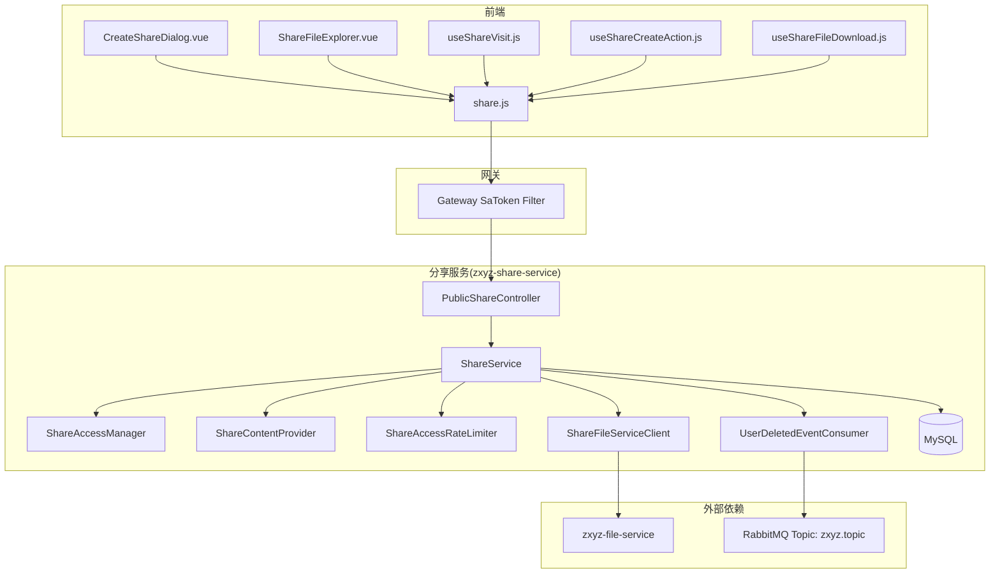
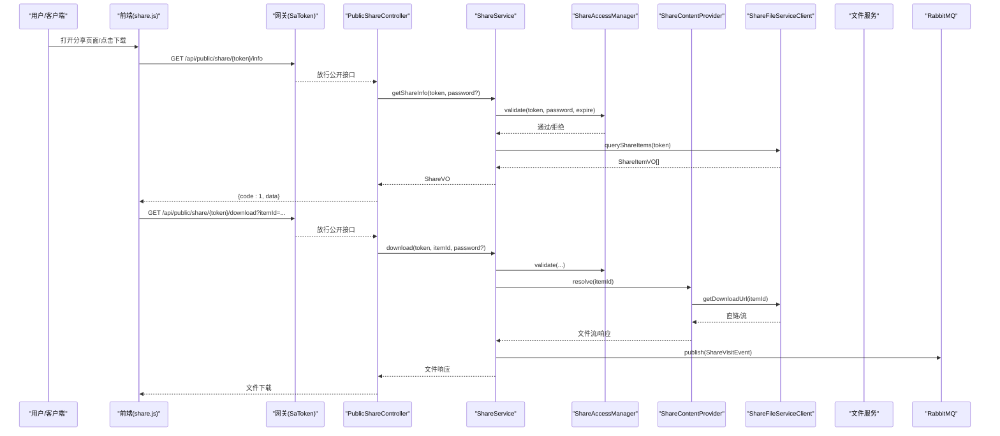
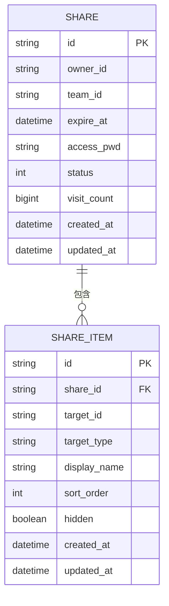
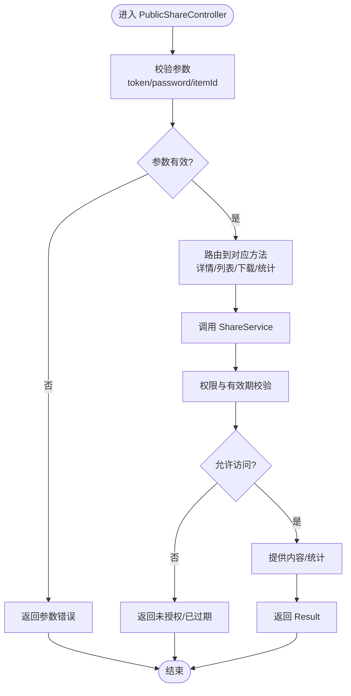
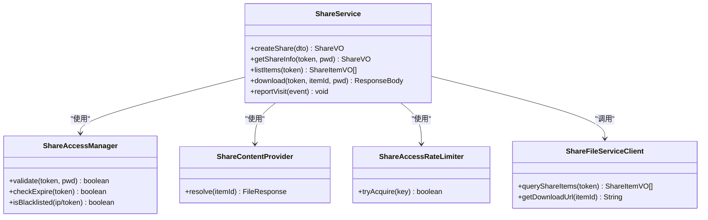
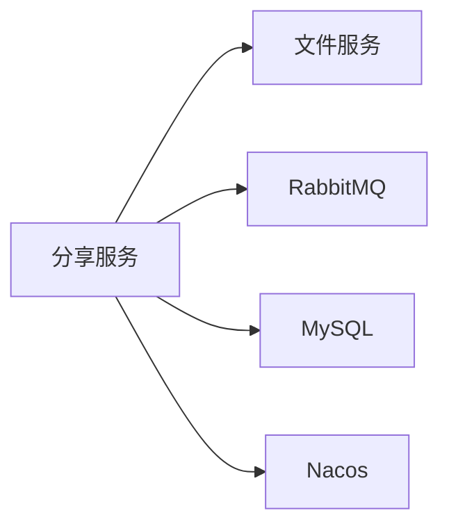

# 分享服务 (zxyz-share-service)

<cite>
**本文引用的文件**   
- [ZxyzShareApplication.java](file://ZXYZdatabaseBack/zxyz-share-service/src/main/java/uno/acloud/share/ZxyzShareApplication.java)
- [application.yml](file://ZXYZdatabaseBack/zxyz-share-service/src/main/resources/application.yml)
- [application-dev.yml](file://ZXYZdatabaseBack/zxyz-share-service/src/main/resources/application-dev.yml)
- [application-prod.yml](file://ZXYZdatabaseBack/zxyz-share-service/src/main/resources/application-prod.yml)
- [V1__init_share_schema.sql](file://ZXYZdatabaseBack/sql/schema_share.sql)
- [PublicShareController.java](file://ZXYZdatabaseBack/zxyz-share-service/src/main/java/uno/acloud/share/controller/PublicShareController.java)
- [ShareService.java](file://ZXYZdatabaseBack/zxyz-share-service/src/main/java/uno/acloud/share/service/ShareService.java)
- [ShareAccessManager.java](file://ZXYZdatabaseBack/zxyz-share-service/src/main/java/uno/acloud/share/service/impl/ShareAccessManager.java)
- [ShareContentProvider.java](file://ZXYZdatabaseBack/zxyz-share-service/src/main/java/uno/acloud/share/service/impl/ShareContentProvider.java)
- [ShareAccessRateLimiter.java](file://ZXYZdatabaseBack/zxyz-share-service/src/main/java/uno/acloud/share/service/impl/ShareAccessRateLimiter.java)
- [ShareFileServiceClient.java](file://ZXYZdatabaseBack/zxyz-share-service/src/main/java/uno/acloud/share/infrastructure/client/ShareFileServiceClient.java)
- [ShareDTO.java](file://ZXYZdatabaseBack/zxyz-share-service/src/main/java/uno/acloud/share/dto/ShareDTO.java)
- [ShareVO.java](file://ZXYZdatabaseBack/zxyz-share-service/src/main/java/uno/acloud/share/vo/ShareVO.java)
- [ShareItemVO.java](file://ZXYZdatabaseBack/zxyz-share-service/src/main/java/uno/acloud/share/vo/ShareItemVO.java)
- [ShareVisitEvent.java](file://ZXYZdatabaseBack/zxyz-share-service/src/main/java/uno/acloud/share/mq/ShareVisitEvent.java)
- [UserDeletedEventConsumer.java](file://ZXYZdatabaseBack/zxyz-share-service/src/main/java/uno/acloud/share/mq/UserDeletedEventConsumer.java)
- [share.js](file://ZXYZdatabaseFront/src/api/share.js)
- [CreateShareDialog.vue](file://ZXYZdatabaseFront/src/components/CreateShareDialog.vue)
- [ShareFileExplorer.vue](file://ZXYZdatabaseFront/src/components/ShareFileExplorer.vue)
- [useShareVisit.js](file://ZXYZdatabaseFront/src/composables/useShareVisit.js)
- [useShareCreateAction.js](file://ZXYZdatabaseFront/src/composables/useShareCreateAction.js)
- [useShareFileDownload.js](file://ZXYZdatabaseFront/src/composables/useShareFileDownload.js)
- [share.md](file://docs/architecture.md)
</cite>

## 目录
1. [简介](#简介)
2. [项目结构](#项目结构)
3. [核心组件](#核心组件)
4. [架构总览](#架构总览)
5. [详细组件分析](#详细组件分析)
6. [依赖关系分析](#依赖关系分析)
7. [性能考虑](#性能考虑)
8. [故障排查指南](#故障排查指南)
9. [结论](#结论)
10. [附录](#附录)

## 简介
本文件为 ZXYZ 分享服务的权威技术文档，聚焦于“文件分享”能力：包括实体模型设计（Share、ShareItem）、分享链接生成与访问控制、有效期管理、公开接口 PublicShareController 的匿名访问与下载统计、ShareService 的业务流程（创建、鉴权、内容提供），以及安全策略（防爬虫、带宽限制等）。同时给出前后端集成指南与最佳实践。

## 项目结构
分享服务采用传统分层（controller → service → infrastructure → mq），配合 Nacos 配置中心与 RabbitMQ 异步事件。前端通过 Vue 组合式 API 封装 useShare* 系列 composable 调用后端 API。

图表来源
- [PublicShareController.java](file://ZXYZdatabaseBack/zxyz-share-service/src/main/java/uno/acloud/share/controller/PublicShareController.java)
- [ShareService.java](file://ZXYZdatabaseBack/zxyz-share-service/src/main/java/uno/acloud/share/service/ShareService.java)
- [ShareAccessManager.java](file://ZXYZdatabaseBack/zxyz-share-service/src/main/java/uno/acloud/share/service/impl/ShareAccessManager.java)
- [ShareContentProvider.java](file://ZXYZdatabaseBack/zxyz-share-service/src/main/java/uno/acloud/share/service/impl/ShareContentProvider.java)
- [ShareAccessRateLimiter.java](file://ZXYZdatabaseBack/zxyz-share-service/src/main/java/uno/acloud/share/service/impl/ShareAccessRateLimiter.java)
- [ShareFileServiceClient.java](file://ZXYZdatabaseBack/zxyz-share-service/src/main/java/uno/acloud/share/infrastructure/client/ShareFileServiceClient.java)
- [UserDeletedEventConsumer.java](file://ZXYZdatabaseBack/zxyz-share-service/src/main/java/uno/acloud/share/mq/UserDeletedEventConsumer.java)
- [share.js](file://ZXYZdatabaseFront/src/api/share.js)
- [CreateShareDialog.vue](file://ZXYZdatabaseFront/src/components/CreateShareDialog.vue)
- [ShareFileExplorer.vue](file://ZXYZdatabaseFront/src/components/ShareFileExplorer.vue)
- [useShareVisit.js](file://ZXYZdatabaseFront/src/composables/useShareVisit.js)
- [useShareCreateAction.js](file://ZXYZdatabaseFront/src/composables/useShareCreateAction.js)
- [useShareFileDownload.js](file://ZXYZdatabaseFront/src/composables/useShareFileDownload.js)

章节来源
- [ZxyzShareApplication.java](file://ZXYZdatabaseBack/zxyz-share-service/src/main/java/uno/acloud/share/ZxyzShareApplication.java)
- [application.yml](file://ZXYZdatabaseBack/zxyz-share-service/src/main/resources/application.yml)
- [application-dev.yml](file://ZXYZdatabaseBack/zxyz-share-service/src/main/resources/application-dev.yml)
- [application-prod.yml](file://ZXYZdatabaseBack/zxyz-share-service/src/main/resources/application-prod.yml)

## 核心组件
- 实体与视图
  - Share：分享主记录，包含分享标识、过期时间、访问密码、状态等。
  - ShareItem：分享项明细，指向具体文件或目录，支持排序与可见性控制。
  - ShareVO / ShareItemVO：面向前端的投影 VO，仅暴露必要字段。
- 控制器
  - PublicShareController：公开匿名访问入口，提供分享详情查询、文件列表浏览、文件下载、访问统计上报。
- 服务层
  - ShareService：编排分享生命周期（创建、校验、失效处理）、权限验证、内容提供、统计上报。
  - ShareAccessManager：访问令牌校验、密码校验、有效期检查、黑名单/封禁策略。
  - ShareContentProvider：根据 ShareItem 解析并返回实际文件流或元数据。
  - ShareAccessRateLimiter：基于 IP/令牌维度的限流，防止滥用与爬虫。
- 基础设施
  - ShareFileServiceClient：窄端点 + 投影模式调用文件服务，获取真实存储位置与下载直链。
- 消息队列
  - ShareVisitEvent：访问事件（匿名/实名）异步落库审计与统计。
  - UserDeletedEventConsumer：用户删除时清理相关分享资源。

章节来源
- [ShareDTO.java](file://ZXYZdatabaseBack/zxyz-share-service/src/main/java/uno/acloud/share/dto/ShareDTO.java)
- [ShareVO.java](file://ZXYZdatabaseBack/zxyz-share-service/src/main/java/uno/acloud/share/vo/ShareVO.java)
- [ShareItemVO.java](file://ZXYZdatabaseBack/zxyz-share-service/src/main/java/uno/acloud/share/vo/ShareItemVO.java)
- [PublicShareController.java](file://ZXYZdatabaseBack/zxyz-share-service/src/main/java/uno/acloud/share/controller/PublicShareController.java)
- [ShareService.java](file://ZXYZdatabaseBack/zxyz-share-service/src/main/java/uno/acloud/share/service/ShareService.java)
- [ShareAccessManager.java](file://ZXYZdatabaseBack/zxyz-share-service/src/main/java/uno/acloud/share/service/impl/ShareAccessManager.java)
- [ShareContentProvider.java](file://ZXYZdatabaseBack/zxyz-share-service/src/main/java/uno/acloud/share/service/impl/ShareContentProvider.java)
- [ShareAccessRateLimiter.java](file://ZXYZdatabaseBack/zxyz-share-service/src/main/java/uno/acloud/share/service/impl/ShareAccessRateLimiter.java)
- [ShareFileServiceClient.java](file://ZXYZdatabaseBack/zxyz-share-service/src/main/java/uno/acloud/share/infrastructure/client/ShareFileServiceClient.java)
- [ShareVisitEvent.java](file://ZXYZdatabaseBack/zxyz-share-service/src/main/java/uno/acloud/share/mq/ShareVisitEvent.java)
- [UserDeletedEventConsumer.java](file://ZXYZdatabaseBack/zxyz-share-service/src/main/java/uno/acloud/share/mq/UserDeletedEventConsumer.java)

## 架构总览
分享服务对外暴露匿名访问能力，对内通过 ServiceClient 与文件服务交互，并通过 RabbitMQ 进行异步审计与联动清理。

图表来源
- [PublicShareController.java](file://ZXYZdatabaseBack/zxyz-share-service/src/main/java/uno/acloud/share/controller/PublicShareController.java)
- [ShareService.java](file://ZXYZdatabaseBack/zxyz-share-service/src/main/java/uno/acloud/share/service/ShareService.java)
- [ShareAccessManager.java](file://ZXYZdatabaseBack/zxyz-share-service/src/main/java/uno/acloud/share/service/impl/ShareAccessManager.java)
- [ShareContentProvider.java](file://ZXYZdatabaseBack/zxyz-share-service/src/main/java/uno/acloud/share/service/impl/ShareContentProvider.java)
- [ShareFileServiceClient.java](file://ZXYZdatabaseBack/zxyz-share-service/src/main/java/uno/acloud/share/infrastructure/client/ShareFileServiceClient.java)
- [ShareVisitEvent.java](file://ZXYZdatabaseBack/zxyz-share-service/src/main/java/uno/acloud/share/mq/ShareVisitEvent.java)

## 详细组件分析

### 实体模型与数据库
- Share
  - 关键字段：分享唯一标识、创建者、团队/空间上下文、过期时间、访问密码、状态、统计计数等。
  - 索引：按 token 唯一索引；按过期时间与状态建立复合索引以支持定时清理。
- ShareItem
  - 关键字段：关联 shareId、目标文件/目录标识、显示名称、排序、是否隐藏等。
  - 索引：按 shareId 与排序键建立索引，提升列表加载性能。
- 视图对象
  - ShareVO / ShareItemVO：仅暴露前端所需字段，避免泄露内部敏感信息。

图表来源
- [V1__init_share_schema.sql](file://ZXYZdatabaseBack/sql/schema_share.sql)

章节来源
- [V1__init_share_schema.sql](file://ZXYZdatabaseBack/sql/schema_share.sql)
- [ShareVO.java](file://ZXYZdatabaseBack/zxyz-share-service/src/main/java/uno/acloud/share/vo/ShareVO.java)
- [ShareItemVO.java](file://ZXYZdatabaseBack/zxyz-share-service/src/main/java/uno/acloud/share/vo/ShareItemVO.java)

### 公开接口 PublicShareController
- 职责
  - 提供匿名访问的分享详情查询、文件列表、文件下载、访问统计上报。
  - 统一错误码与 Result<T> 包装，便于前端消费。
- 关键流程
  - 校验请求参数（token、可选密码、itemId）。
  - 调用 ShareService 完成权限与有效期校验。
  - 对下载流量进行限流与审计。
- 安全要点
  - 公开接口不依赖 SaToken 认证，但受网关白名单与限流保护。
  - 支持访问密码校验，增强私密性。

图表来源
- [PublicShareController.java](file://ZXYZdatabaseBack/zxyz-share-service/src/main/java/uno/acloud/share/controller/PublicShareController.java)
- [ShareService.java](file://ZXYZdatabaseBack/zxyz-share-service/src/main/java/uno/acloud/share/service/ShareService.java)

章节来源
- [PublicShareController.java](file://ZXYZdatabaseBack/zxyz-share-service/src/main/java/uno/acloud/share/controller/PublicShareController.java)

### 业务服务 ShareService
- 职责
  - 分享创建：接收前端输入，持久化 Share/ShareItem，生成唯一 token。
  - 权限验证：委托 ShareAccessManager 校验 token、密码、有效期、黑名单。
  - 内容提供：委托 ShareContentProvider 解析 ShareItem 并返回文件流或直链。
  - 访问统计：发布 ShareVisitEvent 至 RabbitMQ，用于审计与报表。
- 关键流程
  - 创建分享：参数校验 → 写入数据库 → 返回 ShareVO。
  - 访问控制：校验 token → 校验密码（如有）→ 检查过期 → 检查限流 → 允许访问。
  - 下载流程：校验通过 → 解析文件路径 → 从文件服务获取直链/流 → 返回响应 → 异步统计。

图表来源
- [ShareService.java](file://ZXYZdatabaseBack/zxyz-share-service/src/main/java/uno/acloud/share/service/ShareService.java)
- [ShareAccessManager.java](file://ZXYZdatabaseBack/zxyz-share-service/src/main/java/uno/acloud/share/service/impl/ShareAccessManager.java)
- [ShareContentProvider.java](file://ZXYZdatabaseBack/zxyz-share-service/src/main/java/uno/acloud/share/service/impl/ShareContentProvider.java)
- [ShareAccessRateLimiter.java](file://ZXYZdatabaseBack/zxyz-share-service/src/main/java/uno/acloud/share/service/impl/ShareAccessRateLimiter.java)
- [ShareFileServiceClient.java](file://ZXYZdatabaseBack/zxyz-share-service/src/main/java/uno/acloud/share/infrastructure/client/ShareFileServiceClient.java)

章节来源
- [ShareService.java](file://ZXYZdatabaseBack/zxyz-share-service/src/main/java/uno/acloud/share/service/ShareService.java)

### 访问控制与有效期管理
- ShareAccessManager
  - 校验分享 token 是否存在且未被禁用。
  - 校验访问密码（若设置）。
  - 检查过期时间，支持提前失效与自动清理。
  - 结合黑名单与风控策略拦截异常访问。
- 有效期策略
  - 支持固定时长、绝对过期时间、一次性访问后失效等策略。
  - 后台定时任务扫描过期分享，更新状态并释放资源。

章节来源
- [ShareAccessManager.java](file://ZXYZdatabaseBack/zxyz-share-service/src/main/java/uno/acloud/share/service/impl/ShareAccessManager.java)

### 内容提供与下载
- ShareContentProvider
  - 根据 ShareItem 的目标类型（文件/目录）选择不同解析策略。
  - 对于大文件优先返回直链，小文件可流式传输。
- ShareFileServiceClient
  - 通过内部窄端点与文件服务通信，遵循投影模式，仅返回必要字段。
  - 支持分片下载与断点续传（由文件服务实现）。

章节来源
- [ShareContentProvider.java](file://ZXYZdatabaseBack/zxyz-share-service/src/main/java/uno/acloud/share/service/impl/ShareContentProvider.java)
- [ShareFileServiceClient.java](file://ZXYZdatabaseBack/zxyz-share-service/src/main/java/uno/acloud/share/infrastructure/client/ShareFileServiceClient.java)

### 访问统计与审计
- ShareVisitEvent
  - 记录访问来源（IP/UA）、访问时间、分享标识、操作类型（查看/下载）。
  - 异步落库，避免阻塞主流程。
- UserDeletedEventConsumer
  - 监听用户删除事件，清理该用户创建的分享及关联项，保证一致性。

章节来源
- [ShareVisitEvent.java](file://ZXYZdatabaseBack/zxyz-share-service/src/main/java/uno/acloud/share/mq/ShareVisitEvent.java)
- [UserDeletedEventConsumer.java](file://ZXYZdatabaseBack/zxyz-share-service/src/main/java/uno/acloud/share/mq/UserDeletedEventConsumer.java)

### 安全防护与限流
- ShareAccessRateLimiter
  - 基于 IP 与 token 维度限流，防止恶意爬取与带宽耗尽。
  - 支持动态阈值与熔断降级。
- 其他防护
  - 网关层 SaToken 过滤公网内部端点。
  - 请求签名与 UA 检测（可选扩展）。
  - 下载直链短期有效，降低盗链风险。

章节来源
- [ShareAccessRateLimiter.java](file://ZXYZdatabaseBack/zxyz-share-service/src/main/java/uno/acloud/share/service/impl/ShareAccessRateLimiter.java)

## 依赖关系分析
分享服务依赖以下外部系统：
- 文件服务（zxyz-file-service）：提供文件元数据与下载直链。
- 消息队列（RabbitMQ）：Topic Exchange zxyz.topic，用于访问审计与跨服务事件。
- MySQL：持久化分享与分享项数据。
- Nacos：配置中心与服务注册。

图表来源
- [ShareFileServiceClient.java](file://ZXYZdatabaseBack/zxyz-share-service/src/main/java/uno/acloud/share/infrastructure/client/ShareFileServiceClient.java)
- [ShareVisitEvent.java](file://ZXYZdatabaseBack/zxyz-share-service/src/main/java/uno/acloud/share/mq/ShareVisitEvent.java)
- [application.yml](file://ZXYZdatabaseBack/zxyz-share-service/src/main/resources/application.yml)

章节来源
- [application.yml](file://ZXYZdatabaseBack/zxyz-share-service/src/main/resources/application.yml)
- [application-dev.yml](file://ZXYZdatabaseBack/zxyz-share-service/src/main/resources/application-dev.yml)
- [application-prod.yml](file://ZXYZdatabaseBack/zxyz-share-service/src/main/resources/application-prod.yml)

## 性能考虑
- 缓存策略
  - 对频繁访问的分享元数据进行本地/分布式缓存，减少数据库压力。
  - 直链缓存短时效，平衡安全性与性能。
- 限流与熔断
  - 基于令牌桶/滑动窗口实现细粒度限流，保护下游文件服务。
  - 对慢依赖（文件服务）启用熔断与超时控制。
- 异步化
  - 访问统计与审计走 MQ，削峰填谷，降低主链路延迟。
- 数据库优化
  - 合理索引（token、过期时间、状态），分页与投影查询减少 IO。

[本节为通用指导，无需引用具体文件]

## 故障排查指南
- 常见问题
  - 分享链接无效：检查 token 是否存在、是否被禁用、是否过期。
  - 下载失败：确认文件服务可达、直链是否有效、限流是否触发。
  - 统计缺失：检查 MQ 消费者是否正常消费、日志是否有异常。
- 定位手段
  - 查看控制器与服务层日志，关注异常堆栈与参数。
  - 检查 Nacos 配置（限流阈值、超时时间、MQ 连接信息）。
  - 核对数据库记录（Share/ShareItem 状态与时间戳）。
- 恢复建议
  - 临时放宽限流阈值，观察是否缓解。
  - 重试 MQ 消费，必要时重建索引。
  - 清理僵尸分享与无效直链。

章节来源
- [PublicShareController.java](file://ZXYZdatabaseBack/zxyz-share-service/src/main/java/uno/acloud/share/controller/PublicShareController.java)
- [ShareService.java](file://ZXYZdatabaseBack/zxyz-share-service/src/main/java/uno/acloud/share/service/ShareService.java)
- [application.yml](file://ZXYZdatabaseBack/zxyz-share-service/src/main/resources/application.yml)

## 结论
分享服务围绕 Share/ShareItem 模型，构建了完整的公开分享能力：安全的访问控制、灵活的有效期管理、稳定的内容提供与完善的访问审计。通过限流与直链机制保障安全与性能，借助 MQ 实现解耦与可扩展。前后端协作清晰，API 契约稳定，适合大规模匿名访问场景。

[本节为总结，无需引用具体文件]

## 附录

### 前端集成指南
- API 调用
  - 使用 share.js 提供的封装方法调用分享相关接口。
  - 创建分享：调用 createShare，传入目标文件/目录与有效期、密码等。
  - 访问分享：通过 token 获取详情与文件列表。
  - 下载文件：通过 itemId 发起下载，处理进度与错误。
- UI 组件
  - CreateShareDialog：分享创建对话框，收集参数并调用 API。
  - ShareFileExplorer：分享文件浏览界面，支持列表与下载。
- Composables
  - useShareCreateAction：封装分享创建逻辑与反馈。
  - useShareVisit：封装分享访问与统计上报。
  - useShareFileDownload：封装下载流程与错误处理。

章节来源
- [share.js](file://ZXYZdatabaseFront/src/api/share.js)
- [CreateShareDialog.vue](file://ZXYZdatabaseFront/src/components/CreateShareDialog.vue)
- [ShareFileExplorer.vue](file://ZXYZdatabaseFront/src/components/ShareFileExplorer.vue)
- [useShareCreateAction.js](file://ZXYZdatabaseFront/src/composables/useShareCreateAction.js)
- [useShareVisit.js](file://ZXYZdatabaseFront/src/composables/useShareVisit.js)
- [useShareFileDownload.js](file://ZXYZdatabaseFront/src/composables/useShareFileDownload.js)

### 最佳实践
- 分享策略
  - 默认开启有效期与访问密码，避免长期暴露。
  - 对大文件优先使用直链下载，减少服务端负载。
- 安全策略
  - 启用限流与 UA 检测，限制异常访问。
  - 定期清理过期与无效分享，释放资源。
- 监控与审计
  - 关注访问统计与错误率，及时告警。
  - 保留审计日志，便于问题回溯与合规审查。

[本节为通用指导，无需引用具体文件]