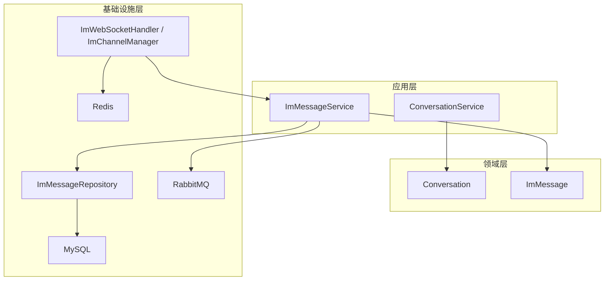
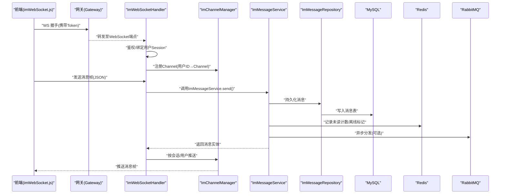
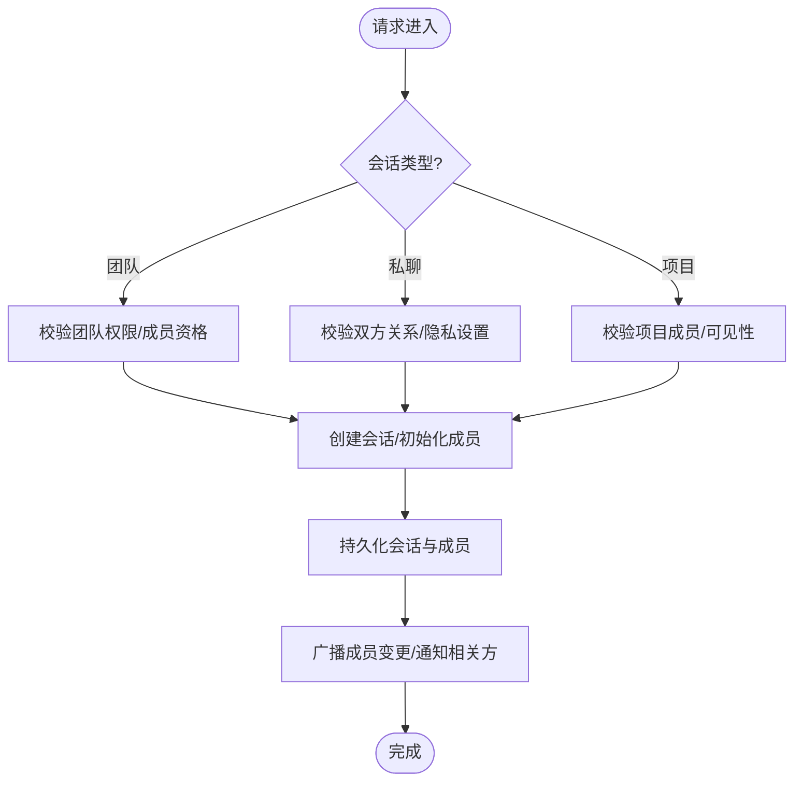
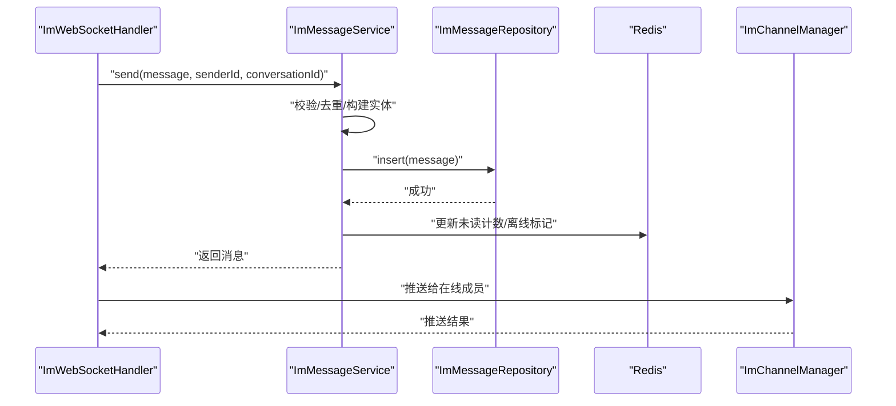
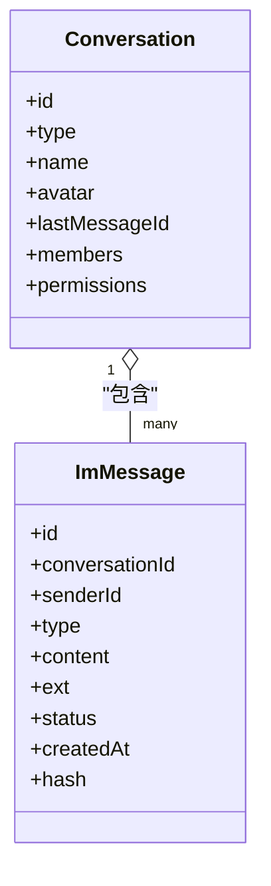
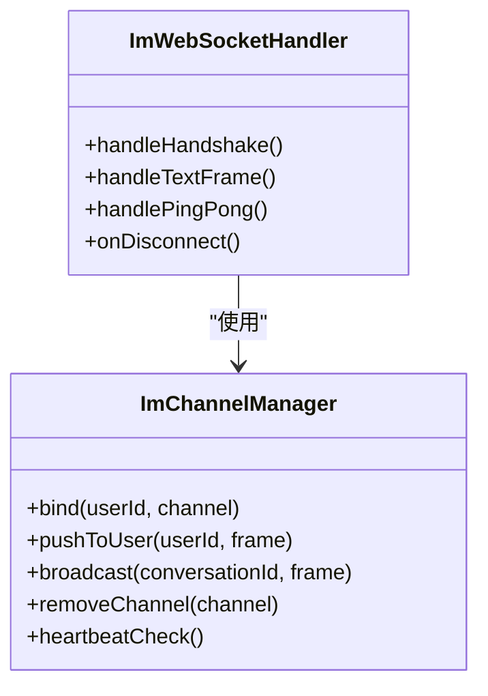
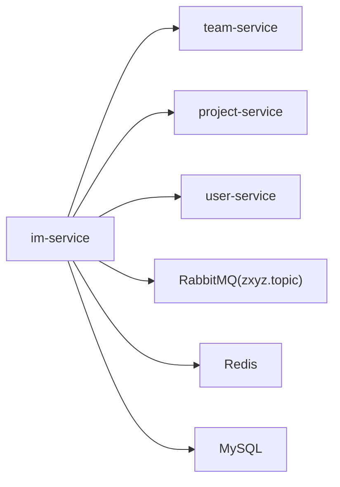

# 即时通讯服务 (zxyz-im-service)

<cite>
**本文档引用的文件**   
- [ZXYZdatabaseBack/zxyz-im-service/src/main/java/uno/acloud/im/application/ConversationService.java](file://ZXYZdatabaseBack/zxyz-im-service/src/main/java/uno/acloud/im/application/ConversationService.java)
- [ZXYZdatabaseBack/zxyz-im-service/src/main/java/uno/acloud/im/application/ImMessageService.java](file://ZXYZdatabaseBack/zxyz-im-service/src/main/java/uno/acloud/im/application/ImMessageService.java)
- [ZXYZdatabaseBack/zxyz-im-service/src/main/java/uno/acloud/im/config/WebSocketConfig.java](file://ZXYZdatabaseBack/zxyz-im-service/src/main/java/uno/acloud/im/config/WebSocketConfig.java)
- [ZXYZdatabaseBack/zxyz-im-service/src/main/java/uno/acloud/im/infrastructure/websocket/ImWebSocketHandler.java](file://ZXYZdatabaseBack/zxyz-im-service/src/main/java/uno/acloud/im/infrastructure/websocket/ImWebSocketHandler.java)
- [ZXYZdatabaseBack/zxyz-im-service/src/main/java/uno/acloud/im/infrastructure/websocket/ImChannelManager.java](file://ZXYZdatabaseBack/zxyz-im-service/src/main/java/uno/acloud/im/infrastructure/websocket/ImChannelManager.java)
- [ZXYZdatabaseBack/zxyz-im-service/src/main/java/uno/acloud/im/domain/model/conversation/Conversation.java](file://ZXYZdatabaseBack/zxyz-im-service/src/main/java/uno/acloud/im/domain/model/conversation/Conversation.java)
- [ZXYZdatabaseBack/zxyz-im-service/src/main/java/uno/acloud/im/domain/model/message/ImMessage.java](file://ZXYZdatabaseBack/zxyz-im-service/src/main/java/uno/acloud/im/domain/model/message/ImMessage.java)
- [ZXYZdatabaseBack/zxyz-im-service/src/main/java/uno/acloud/im/infrastructure/persistence/ImMessageRepository.java](file://ZXYZdatabaseBack/zxyz-im-service/src/main/java/uno/acloud/im/infrastructure/persistence/ImMessageRepository.java)
- [ZXYZdatabaseBack/zxyz-im-service/src/main/resources/db/migration/V1__init_im_schema.sql](file://ZXYZdatabaseBack/zxyz-im-service/src/main/resources/db/migration/V1__init_im_schema.sql)
- [ZXYZdatabaseBack/zxyz-im-service/src/main/resources/application.yml](file://ZXYZdatabaseBack/zxyz-im-service/src/main/resources/application.yml)
- [ZXYZdatabaseBack/nacos-config/zxyz-im-service.yml](file://ZXYZdatabaseBack/nacos-config/zxyz-im-service.yml)
- [ZXYZdatabaseFront/src/utils/imWebSocket.js](file://ZXYZdatabaseFront/src/utils/imWebSocket.js)
- [ZXYZdatabaseFront/src/store/chat.js](file://ZXYZdatabaseFront/src/store/chat.js)
- [ZXYZdatabaseFront/src/api/im.js](file://ZXYZdatabaseFront/src/api/im.js)
</cite>

## 目录
1. [简介](#简介)
2. [项目结构](#项目结构)
3. [核心组件](#核心组件)
4. [架构总览](#架构总览)
5. [详细组件分析](#详细组件分析)
6. [依赖关系分析](#依赖关系分析)
7. [性能考量](#性能考量)
8. [故障排查指南](#故障排查指南)
9. [结论](#结论)
10. [附录](#附录)

## 简介
本文件面向 ZXYZ 即时通讯服务（zxyz-im-service），基于 DDD 分层与 Netty WebSocket 实时通信，提供团队聊天、私聊、项目聊天等场景的消息收发能力。文档覆盖应用层服务（如 ConversationService、ImMessageService）、Netty WebSocket 连接管理、消息推送、心跳检测、消息持久化、离线消息、已读回执、文件卡片消息、@提及、消息撤回等高级特性，并给出 WebSocket 协议规范、消息格式定义与性能优化建议。

## 项目结构
im-service 采用 DDD 分层：interfaces → application → domain → infrastructure。核心模块包括：
- application：应用服务编排（会话、消息、权限校验、事件发布）
- domain：领域模型与规则（会话、消息、成员关系）
- infrastructure：基础设施实现（WebSocket、数据库、缓存、外部服务客户端）
- config：配置与装配（Netty、Redis、RabbitMQ、数据源）
- resources：迁移脚本与配置文件

图表来源
- [ZXYZdatabaseBack/zxyz-im-service/src/main/java/uno/acloud/im/application/ConversationService.java](file://ZXYZdatabaseBack/zxyz-im-service/src/main/java/uno/acloud/im/application/ConversationService.java)
- [ZXYZdatabaseBack/zxyz-im-service/src/main/java/uno/acloud/im/application/ImMessageService.java](file://ZXYZdatabaseBack/zxyz-im-service/src/main/java/uno/acloud/im/application/ImMessageService.java)
- [ZXYZdatabaseBack/zxyz-im-service/src/main/java/uno/acloud/im/infrastructure/websocket/ImWebSocketHandler.java](file://ZXYZdatabaseBack/zxyz-im-service/src/main/java/uno/acloud/im/infrastructure/websocket/ImWebSocketHandler.java)
- [ZXYZdatabaseBack/zxyz-im-service/src/main/java/uno/acloud/im/infrastructure/websocket/ImChannelManager.java](file://ZXYZdatabaseBack/zxyz-im-service/src/main/java/uno/acloud/im/infrastructure/websocket/ImChannelManager.java)
- [ZXYZdatabaseBack/zxyz-im-service/src/main/java/uno/acloud/im/infrastructure/persistence/ImMessageRepository.java](file://ZXYZdatabaseBack/zxyz-im-service/src/main/java/uno/acloud/im/infrastructure/persistence/ImMessageRepository.java)

章节来源
- [ZXYZdatabaseBack/zxyz-im-service/src/main/java/uno/acloud/im/application/ConversationService.java](file://ZXYZdatabaseBack/zxyz-im-service/src/main/java/uno/acloud/im/application/ConversationService.java)
- [ZXYZdatabaseBack/zxyz-im-service/src/main/java/uno/acloud/im/application/ImMessageService.java](file://ZXYZdatabaseBack/zxyz-im-service/src/main/java/uno/acloud/im/application/ImMessageService.java)
- [ZXYZdatabaseBack/zxyz-im-service/src/main/java/uno/acloud/im/infrastructure/websocket/ImWebSocketHandler.java](file://ZXYZdatabaseBack/zxyz-im-service/src/main/java/uno/acloud/im/infrastructure/websocket/ImWebSocketHandler.java)
- [ZXYZdatabaseBack/zxyz-im-service/src/main/java/uno/acloud/im/infrastructure/websocket/ImChannelManager.java](file://ZXYZdatabaseBack/zxyz-im-service/src/main/java/uno/acloud/im/infrastructure/websocket/ImChannelManager.java)
- [ZXYZdatabaseBack/zxyz-im-service/src/main/java/uno/acloud/im/infrastructure/persistence/ImMessageRepository.java](file://ZXYZdatabaseBack/zxyz-im-service/src/main/java/uno/acloud/im/infrastructure/persistence/ImMessageRepository.java)

## 核心组件
- ConversationService：会话生命周期管理（创建、加入、退出、成员变更、类型判定：团队/私聊/项目）。
- ImMessageService：消息编排（发送、撤回、编辑、已读回执、离线拉取、历史分页、去重）。
- ImWebSocketHandler：Netty WebSocket 接入、鉴权、握手、帧解析、异常处理。
- ImChannelManager：在线用户到 Channel 的映射、按会话广播、按用户点对点推送、心跳保活。
- ImMessageRepository：消息持久化与查询接口（插入、分页、按会话/时间范围、已读状态更新）。
- 领域模型 Conversation/ImMessage：承载业务语义与不变式。

章节来源
- [ZXYZdatabaseBack/zxyz-im-service/src/main/java/uno/acloud/im/application/ConversationService.java](file://ZXYZdatabaseBack/zxyz-im-service/src/main/java/uno/acloud/im/application/ConversationService.java)
- [ZXYZdatabaseBack/zxyz-im-service/src/main/java/uno/acloud/im/application/ImMessageService.java](file://ZXYZdatabaseBack/zxyz-im-service/src/main/java/uno/acloud/im/application/ImMessageService.java)
- [ZXYZdatabaseBack/zxyz-im-service/src/main/java/uno/acloud/im/infrastructure/websocket/ImWebSocketHandler.java](file://ZXYZdatabaseBack/zxyz-im-service/src/main/java/uno/acloud/im/infrastructure/websocket/ImWebSocketHandler.java)
- [ZXYZdatabaseBack/zxyz-im-service/src/main/java/uno/acloud/im/infrastructure/websocket/ImChannelManager.java](file://ZXYZdatabaseBack/zxyz-im-service/src/main/java/uno/acloud/im/infrastructure/websocket/ImChannelManager.java)
- [ZXYZdatabaseBack/zxyz-im-service/src/main/java/uno/acloud/im/infrastructure/persistence/ImMessageRepository.java](file://ZXYZdatabaseBack/zxyz-im-service/src/main/java/uno/acloud/im/infrastructure/persistence/ImMessageRepository.java)
- [ZXYZdatabaseBack/zxyz-im-service/src/main/java/uno/acloud/im/domain/model/conversation/Conversation.java](file://ZXYZdatabaseBack/zxyz-im-service/src/main/java/uno/acloud/im/domain/model/conversation/Conversation.java)
- [ZXYZdatabaseBack/zxyz-im-service/src/main/java/uno/acloud/im/domain/model/message/ImMessage.java](file://ZXYZdatabaseBack/zxyz-im-service/src/main/java/uno/acloud/im/domain/model/message/ImMessage.java)

## 架构总览
系统由前端（Vue + Pinia + imWebSocket.js）通过 Gateway 进入 im-service，使用 Netty WebSocket 建立长连接；应用层服务编排业务逻辑；领域模型约束业务规则；基础设施层负责存储、缓存、消息队列与外部服务调用。

图表来源
- [ZXYZdatabaseBack/zxyz-im-service/src/main/java/uno/acloud/im/infrastructure/websocket/ImWebSocketHandler.java](file://ZXYZdatabaseBack/zxyz-im-service/src/main/java/uno/acloud/im/infrastructure/websocket/ImWebSocketHandler.java)
- [ZXYZdatabaseBack/zxyz-im-service/src/main/java/uno/acloud/im/infrastructure/websocket/ImChannelManager.java](file://ZXYZdatabaseBack/zxyz-im-service/src/main/java/uno/acloud/im/infrastructure/websocket/ImChannelManager.java)
- [ZXYZdatabaseBack/zxyz-im-service/src/main/java/uno/acloud/im/application/ImMessageService.java](file://ZXYZdatabaseBack/zxyz-im-service/src/main/java/uno/acloud/im/application/ImMessageService.java)
- [ZXYZdatabaseBack/zxyz-im-service/src/main/java/uno/acloud/im/infrastructure/persistence/ImMessageRepository.java](file://ZXYZdatabaseBack/zxyz-im-service/src/main/java/uno/acloud/im/infrastructure/persistence/ImMessageRepository.java)
- [ZXYZdatabaseFront/src/utils/imWebSocket.js](file://ZXYZdatabaseFront/src/utils/imWebSocket.js)

## 详细组件分析

### 应用层：ConversationService（会话服务）
职责
- 会话创建与类型判定（团队/私聊/项目）
- 成员加入/退出、角色与权限校验
- 会话元数据维护（名称、头像、最后消息摘要）
- 与外部服务（Team/Project/User）交互获取上下文

关键流程
- 创建会话：校验参与者权限 → 生成会话ID → 初始化成员列表 → 落库
- 加入会话：校验成员资格 → 更新成员状态 → 广播成员变更事件
- 会话查询：根据会话ID/类型/用户维度聚合信息

章节来源
- [ZXYZdatabaseBack/zxyz-im-service/src/main/java/uno/acloud/im/application/ConversationService.java](file://ZXYZdatabaseBack/zxyz-im-service/src/main/java/uno/acloud/im/application/ConversationService.java)
- [ZXYZdatabaseBack/zxyz-im-service/src/main/java/uno/acloud/im/domain/model/conversation/Conversation.java](file://ZXYZdatabaseBack/zxyz-im-service/src/main/java/uno/acloud/im/domain/model/conversation/Conversation.java)

### 应用层：ImMessageService（消息服务）
职责
- 消息发送：内容校验、去重、持久化、在线推送、离线标记
- 消息撤回/编辑：幂等控制、版本管理、广播更新
- 已读回执：按会话/用户粒度统计，支持批量上报
- 历史与离线：分页查询、游标/时间戳拉取、增量同步

关键流程（发送）
- 接收帧 → 鉴权与会话校验 → 构建消息实体 → 去重检查 → 持久化 → 在线推送 → 离线标记 → 可选异步分发

章节来源
- [ZXYZdatabaseBack/zxyz-im-service/src/main/java/uno/acloud/im/application/ImMessageService.java](file://ZXYZdatabaseBack/zxyz-im-service/src/main/java/uno/acloud/im/application/ImMessageService.java)
- [ZXYZdatabaseBack/zxyz-im-service/src/main/java/uno/acloud/im/infrastructure/persistence/ImMessageRepository.java](file://ZXYZdatabaseBack/zxyz-im-service/src/main/java/uno/acloud/im/infrastructure/persistence/ImMessageRepository.java)

### 领域模型：Conversation 与 ImMessage
- Conversation：会话标识、类型、名称、头像、最后消息、成员集合、权限策略
- ImMessage：消息标识、会话ID、发送者、类型（文本/文件卡片/@提及/系统）、内容、扩展字段、状态（已发送/已送达/已读）、时间戳、哈希（去重）

图表来源
- [ZXYZdatabaseBack/zxyz-im-service/src/main/java/uno/acloud/im/domain/model/conversation/Conversation.java](file://ZXYZdatabaseBack/zxyz-im-service/src/main/java/uno/acloud/im/domain/model/conversation/Conversation.java)
- [ZXYZdatabaseBack/zxyz-im-service/src/main/java/uno/acloud/im/domain/model/message/ImMessage.java](file://ZXYZdatabaseBack/zxyz-im-service/src/main/java/uno/acloud/im/domain/model/message/ImMessage.java)

### 基础设施：Netty WebSocket 与通道管理
- ImWebSocketHandler：处理握手、鉴权、帧解析、异常捕获、心跳帧识别
- ImChannelManager：维护用户→Channel 映射、会话级广播、点对点推送、断线清理、心跳超时检测

图表来源
- [ZXYZdatabaseBack/zxyz-im-service/src/main/java/uno/acloud/im/infrastructure/websocket/ImWebSocketHandler.java](file://ZXYZdatabaseBack/zxyz-im-service/src/main/java/uno/acloud/im/infrastructure/websocket/ImWebSocketHandler.java)
- [ZXYZdatabaseBack/zxyz-im-service/src/main/java/uno/acloud/im/infrastructure/websocket/ImChannelManager.java](file://ZXYZdatabaseBack/zxyz-im-service/src/main/java/uno/acloud/im/infrastructure/websocket/ImChannelManager.java)

### 数据持久化与离线消息
- 表结构：会话表、消息表、成员表、已读表（示例见迁移脚本）
- 索引策略：会话ID+时间戳复合索引、用户ID+会话ID联合索引、消息哈希唯一索引
- 离线拉取：基于时间戳游标的增量拉取，结合 Redis 未读计数与“是否在线”标记

章节来源
- [ZXYZdatabaseBack/zxyz-im-service/src/main/resources/db/migration/V1__init_im_schema.sql](file://ZXYZdatabaseBack/zxyz-im-service/src/main/resources/db/migration/V1__init_im_schema.sql)
- [ZXYZdatabaseBack/zxyz-im-service/src/main/java/uno/acloud/im/infrastructure/persistence/ImMessageRepository.java](file://ZXYZdatabaseBack/zxyz-im-service/src/main/java/uno/acloud/im/infrastructure/persistence/ImMessageRepository.java)

### 高级特性
- 文件卡片消息：消息体含文件元数据（URL、大小、类型、缩略图），前端渲染卡片；上传走文件服务，IM 仅存引用
- @提及：消息内容含提及标记，服务端解析并生成通知事件，推送被提及用户
- 消息撤回/编辑：版本号控制，撤回后替换为系统提示，编辑后广播新版本
- 已读回执：客户端上报已读范围，服务端合并去重，更新会话最后已读位置

章节来源
- [ZXYZdatabaseBack/zxyz-im-service/src/main/java/uno/acloud/im/application/ImMessageService.java](file://ZXYZdatabaseBack/zxyz-im-service/src/main/java/uno/acloud/im/application/ImMessageService.java)
- [ZXYZdatabaseBack/zxyz-im-service/src/main/java/uno/acloud/im/domain/model/message/ImMessage.java](file://ZXYZdatabaseBack/zxyz-im-service/src/main/java/uno/acloud/im/domain/model/message/ImMessage.java)

## 依赖关系分析
- 内部服务调用：通过 ServiceClient + X-Internal-Service-Token 鉴权，访问 Team/Project/User 等服务
- 异步解耦：RabbitMQ Topic Exchange zxyz.topic 用于审计、通知、统计等
- 配置中心：Nacos 管理动态配置（WebSocket 端口、心跳间隔、限流参数等）

图表来源
- [ZXYZdatabaseBack/nacos-config/zxyz-im-service.yml](file://ZXYZdatabaseBack/nacos-config/zxyz-im-service.yml)
- [ZXYZdatabaseBack/zxyz-im-service/src/main/resources/application.yml](file://ZXYZdatabaseBack/zxyz-im-service/src/main/resources/application.yml)

章节来源
- [ZXYZdatabaseBack/nacos-config/zxyz-im-service.yml](file://ZXYZdatabaseBack/nacos-config/zxyz-im-service.yml)
- [ZXYZdatabaseBack/zxyz-im-service/src/main/resources/application.yml](file://ZXYZdatabaseBack/zxyz-im-service/src/main/resources/application.yml)

## 性能考量
- 连接与推送
  - 使用 Netty 零拷贝与内存池，减少 GC 压力
  - Channel 映射使用高性能并发容器，避免锁竞争
  - 心跳间隔可配置，超时自动清理无效连接
- 消息处理
  - 消息去重基于哈希，避免重复入库与推送
  - 批量推送合并帧，降低网络开销
  - 历史分页采用游标/时间戳，避免深翻页
- 存储与缓存
  - MySQL 合理索引设计，热点会话分片或归档
  - Redis 缓存未读计数、在线状态、最近消息摘要
- 前端优化
  - 虚拟滚动渲染长列表
  - 断线重连指数退避，消息本地暂存与重试

[本节为通用指导，不直接分析具体文件]

## 故障排查指南
常见问题
- 握手失败：检查 Token 有效性、Gateway 路由、WebSocket 路径
- 推送不到：确认用户在线映射、会话成员列表、防火墙/代理限制
- 消息丢失：核查去重哈希、事务一致性、MQ 消费幂等
- 心跳断开：调整心跳间隔与超时阈值，检查网络抖动

定位步骤
- 查看 WebSocket 日志与错误码
- 检查 Redis 中用户在线映射与会话状态
- 核对数据库消息表与索引命中率
- 验证 RabbitMQ 队列积压与消费者状态

章节来源
- [ZXYZdatabaseBack/zxyz-im-service/src/main/java/uno/acloud/im/infrastructure/websocket/ImWebSocketHandler.java](file://ZXYZdatabaseBack/zxyz-im-service/src/main/java/uno/acloud/im/infrastructure/websocket/ImWebSocketHandler.java)
- [ZXYZdatabaseBack/zxyz-im-service/src/main/java/uno/acloud/im/infrastructure/websocket/ImChannelManager.java](file://ZXYZdatabaseBack/zxyz-im-service/src/main/java/uno/acloud/im/infrastructure/websocket/ImChannelManager.java)

## 结论
ZXYZ 即时通讯服务以 DDD 为核心，结合 Netty WebSocket 实现高吞吐、低延迟的实时通信。通过清晰的分层与基础设施抽象，支撑团队/私聊/项目聊天等多场景，并提供文件卡片、@提及、撤回编辑、已读回执等高级能力。配合合理的索引、缓存与异步机制，满足大规模在线用户的稳定体验。

[本节为总结，不直接分析具体文件]

## 附录

### WebSocket 协议规范与消息格式
- 连接建立
  - 路径：/ws/im（经 Gateway 鉴权转发）
  - 头部：携带认证 Cookie/Token
- 帧类型
  - text：业务消息（JSON）
  - ping/pong：心跳保活
- 消息体（text）
  - 发送消息
    - type: "message_send"
    - conversationId: string
    - content: object（文本/文件卡片/@提及等）
    - ext: object（扩展字段）
  - 已读回执
    - type: "read_receipt"
    - conversationId: string
    - lastReadId: string
  - 撤回/编辑
    - type: "message_recall"/"message_edit"
    - messageId: string
    - version: number
- 响应帧
  - 成功：{code: 0, data: ...}
  - 失败：{code: error_code, message: "..."}

章节来源
- [ZXYZdatabaseFront/src/utils/imWebSocket.js](file://ZXYZdatabaseFront/src/utils/imWebSocket.js)
- [ZXYZdatabaseFront/src/store/chat.js](file://ZXYZdatabaseFront/src/store/chat.js)
- [ZXYZdatabaseFront/src/api/im.js](file://ZXYZdatabaseFront/src/api/im.js)

### 前端集成要点
- 连接管理：封装重连、心跳、错误回调
- 状态管理：Pinia 维护会话列表、消息列表、未读数
- 渲染优化：虚拟滚动、懒加载、图片压缩

章节来源
- [ZXYZdatabaseFront/src/utils/imWebSocket.js](file://ZXYZdatabaseFront/src/utils/imWebSocket.js)
- [ZXYZdatabaseFront/src/store/chat.js](file://ZXYZdatabaseFront/src/store/chat.js)
- [ZXYZdatabaseFront/src/api/im.js](file://ZXYZdatabaseFront/src/api/im.js)