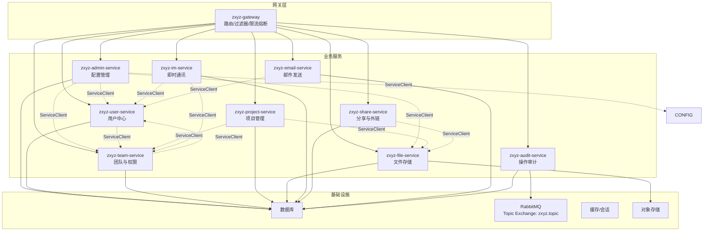
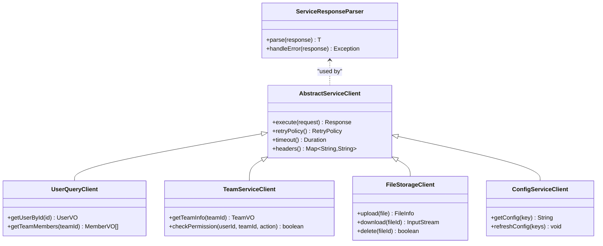
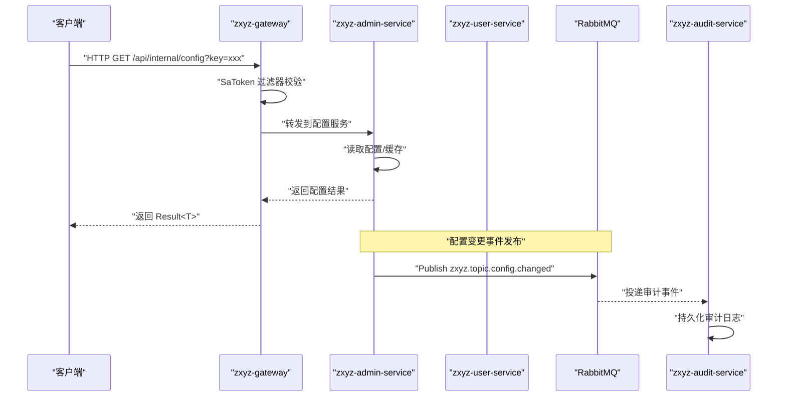
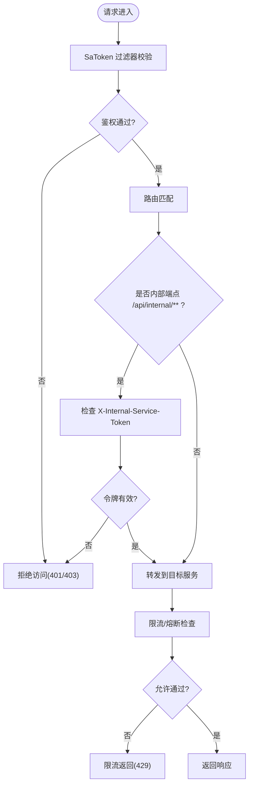
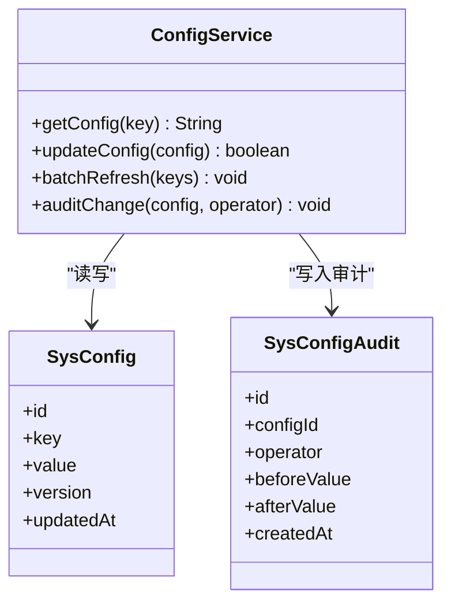
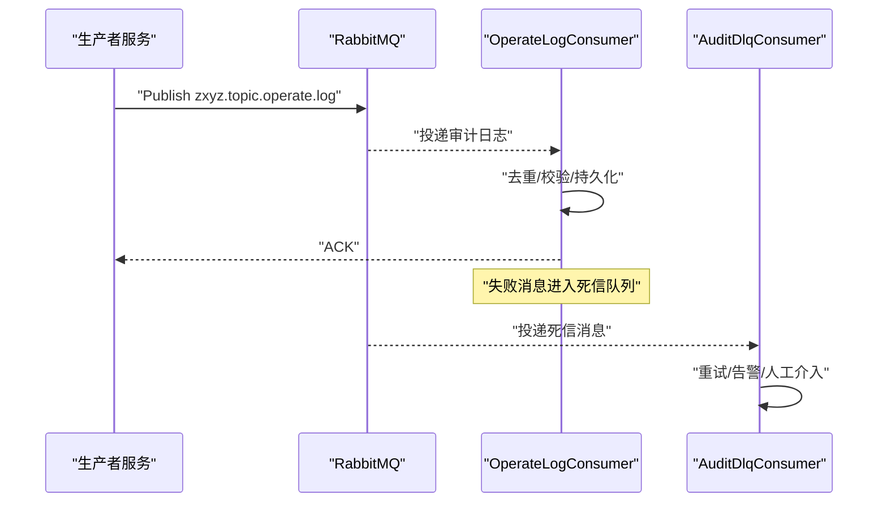
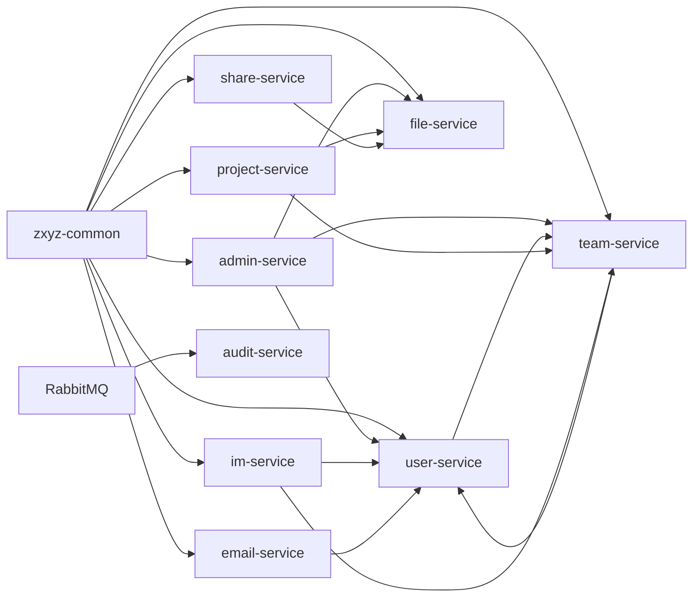

# 后端服务

<cite>
**本文引用的文件**   
- [README.md](file://ZXYZdatabaseBack/README.md)
- [pom.xml](file://ZXYZdatabaseBack/pom.xml)
- [application.yml](file://ZXYZdatabaseBack/ZXYZdatabaseBack/zxyz-gateway/src/main/resources/application.yml)
- [SaTokenFilterConfigTest.java](file://ZXYZdatabaseBack/ZXYZdatabaseBack/zxyz-gateway/src/test/java/uno/acloud/gateway/filter/SaTokenFilterConfigTest.java)
- [AbstractServiceClient.java](file://ZXYZdatabaseBack/ZXYZdatabaseBack/zxyz-common/src/main/java/uno/acloud/client/AbstractServiceClient.java)
- [ServiceResponseParser.java](file://ZXYZdatabaseBack/ZXYZdatabaseBack/zxyz-common/src/main/java/uno/acloud/client/ServiceResponseParser.java)
- [UserQueryClient.java](file://ZXYZdatabaseBack/ZXYZdatabaseBack/zxyz-common/src/main/java/uno/acloud/client/UserQueryClient.java)
- [TeamServiceClient.java](file://ZXYZdatabaseBack/ZXYZdatabaseBack/zxyz-common/src/main/java/uno/acloud/client/TeamServiceClient.java)
- [FileStorageClient.java](file://ZXYZdatabaseBack/ZXYZdatabaseBack/zxyz-common/src/main/java/uno/acloud/client/FileStorageClient.java)
- [ConfigServiceClient.java](file://ZXYZdatabaseBack/ZXYZdatabaseBack/zxyz-common/src/main/java/uno/acloud/client/ConfigServiceClient.java)
- [application-dev.yml](file://ZXYZdatabaseBack/ZXYZdatabaseBack/zxyz-admin-service/src/main/resources/application-dev.yml)
- [application-prod.yml](file://ZXYZdatabaseBack/ZXYZdatabaseBack/zxyz-admin-service/src/main/resources/application-prod.yml)
- [application.yml](file://ZXYZdatabaseBack/ZXYZdatabaseBack/zxyz-admin-service/src/main/resources/application.yml)
- [AdminServiceProperties.java](file://ZXYZdatabaseBack/ZXYZdatabaseBack/zxyz-admin-service/src/main/java/uno/acloud/admin/config/AdminServiceProperties.java)
- [RestClientConfig.java](file://ZXYZdatabaseBack/ZXYZdatabaseBack/zxyz-admin-service/src/main/java/uno/acloud/admin/config/RestClientConfig.java)
- [SaTokenConfigure.java](file://ZXYZdatabaseBack/ZXYZdatabaseBack/zxyz-admin-service/src/main/java/uno/acloud/admin/config/SaTokenConfigure.java)
- [ConfigService.java](file://ZXYZdatabaseBack/ZXYZdatabaseBack/zxyz-admin-service/src/main/java/uno/acloud/admin/service/ConfigService.java)
- [SysConfig.java](file://ZXYZdatabaseBack/ZXYZdatabaseBack/zxyz-admin-service/src/main/java/uno/acloud/admin/domain/SysConfig.java)
- [SysConfigAudit.java](file://ZXYZdatabaseBack/ZXYZdatabaseBack/zxyz-admin-service/src/main/java/uno/acloud/admin/domain/SysConfigAudit.java)
- [Application.yml](file://ZXYZdatabaseBack/ZXYZdatabaseBack/zxyz-user-service/src/main/resources/application.yml)
- [Application.yml](file://ZXYZdatabaseBack/ZXYZdatabaseBack/zxyz-team-service/src/main/resources/application.yml)
- [Application.yml](file://ZXYZdatabaseBack/ZXYZdatabaseBack/zxyz-project-service/src/main/resources/application.yml)
- [Application.yml](file://ZXYZdatabaseBack/ZXYZdatabaseBack/zxyz-file-service/src/main/resources/application.yml)
- [Application.yml](file://ZXYZdatabaseBack/ZXYZdatabaseBack/zxyz-im-service/src/main/resources/application.yml)
- [Application.yml](file://ZXYZdatabaseBack/ZXYZdatabaseBack/zxyz-share-service/src/main/resources/application.yml)
- [Application.yml](file://ZXYZdatabaseBack/ZXYZdatabaseBack/zxyz-email-service/src/main/resources/application.yml)
- [Application.yml](file://ZXYZdatabaseBack/ZXYZdatabaseBack/zxyz-audit-service/src/main/resources/application.yml)
- [RabbitMqConfig.java](file://ZXYZdatabaseBack/ZXYZdatabaseBack/zxyz-audit-service/src/main/java/uno/acloud/audit/config/RabbitMqConfig.java)
- [OperateLogConsumer.java](file://ZXYZdatabaseBack/ZXYZdatabaseBack/zxyz-audit-service/src/main/java/uno/acloud/audit/mq/OperateLogConsumer.java)
- [AuditDlqConsumer.java](file://ZXYZdatabaseBack/ZXYZdatabaseBack/zxyz-audit-service/src/main/java/uno/acloud/audit/mq/AuditDlqConsumer.java)
- [operate_log_consumer_test.py](file://ZXYZdatabaseBack/ZXYZdatabaseBack/zxyz-audit-service/src/test/java/uno/acloud/audit/mq/OperateLogConsumerTest.java)
</cite>

## 目录
1. [简介](#简介)
2. [项目结构](#项目结构)
3. [核心组件](#核心组件)
4. [架构总览](#架构总览)
5. [详细组件分析](#详细组件分析)
6. [依赖关系分析](#依赖关系分析)
7. [性能考虑](#性能考虑)
8. [故障排查指南](#故障排查指南)
9. [结论](#结论)
10. [附录](#附录)

## 简介
本文件为 ZXYZ 后端微服务集群的服务文档，覆盖公共组件库 zxyz-common、API 网关 zxyz-gateway，以及管理服务、用户服务、团队服务、项目服务、文件服务、即时通讯服务、分享服务、邮件服务、审计服务等业务模块。文档重点说明各服务的职责边界、关键接口与数据模型、服务间调用模式（同步 ServiceClient + 内部令牌鉴权；异步 RabbitMQ Topic Exchange）、事件驱动与消息处理机制，并给出架构图与流程图帮助快速理解系统行为。

## 项目结构
- 后端采用多模块 Maven 工程，包含 11 个服务模块与一个公共组件模块，前端位于独立仓库。
- 部署使用 Docker Compose 编排基础设施与所有服务，Nacos 管理配置与服务注册，Jasypt 加密敏感配置。
- 服务间通信遵循“窄端点 + 投影”模式：内部端点前缀 /api/internal/**，被 Gateway SaToken 过滤器拒绝公网访问；返回调用方专用 Projection VO，避免胖 DTO 跨服务传播。

图表来源 
- [pom.xml](file://ZXYZdatabaseBack/pom.xml)
- [application.yml](file://ZXYZdatabaseBack/ZXYZdatabaseBack/zxyz-gateway/src/main/resources/application.yml)

章节来源
- [README.md](file://ZXYZdatabaseBack/README.md)
- [pom.xml](file://ZXYZdatabaseBack/pom.xml)

## 核心组件
本节聚焦 zxyz-common 公共能力，包括通用工具、异常处理、配置管理、安全认证、服务客户端封装等。

- 通用工具与异常
  - 提供统一的输入校验、格式化、错误码与异常包装，确保各服务异常一致上报。
- 配置管理
  - 基于 Spring Boot 配置体系与环境变量，结合 Nacos 动态刷新；支持 Jasypt 加密敏感项。
- 安全认证
  - 集成 Sa-Token，统一 Token 生成与校验；内部服务调用通过 X-Internal-Service-Token 头进行鉴权。
- 服务客户端
  - 抽象 REST 客户端基类与响应解析器，统一重试、超时、幂等与错误处理策略。
  - 预置常用 ServiceClient：用户查询、团队、文件存储、配置中心等。

图表来源 
- [AbstractServiceClient.java](file://ZXYZdatabaseBack/ZXYZdatabaseBack/zxyz-common/src/main/java/uno/acloud/client/AbstractServiceClient.java)
- [ServiceResponseParser.java](file://ZXYZdatabaseBack/ZXYZdatabaseBack/zxyz-common/src/main/java/uno/acloud/client/ServiceResponseParser.java)
- [UserQueryClient.java](file://ZXYZdatabaseBack/ZXYZdatabaseBack/zxyz-common/src/main/java/uno/acloud/client/UserQueryClient.java)
- [TeamServiceClient.java](file://ZXYZdatabaseBack/ZXYZdatabaseBack/zxyz-common/src/main/java/uno/acloud/client/TeamServiceClient.java)
- [FileStorageClient.java](file://ZXYZdatabaseBack/ZXYZdatabaseBack/zxyz-common/src/main/java/uno/acloud/client/FileStorageClient.java)
- [ConfigServiceClient.java](file://ZXYZdatabaseBack/ZXYZdatabaseBack/zxyz-common/src/main/java/uno/acloud/client/ConfigServiceClient.java)

章节来源
- [AbstractServiceClient.java](file://ZXYZdatabaseBack/ZXYZdatabaseBack/zxyz-common/src/main/java/uno/acloud/client/AbstractServiceClient.java)
- [ServiceResponseParser.java](file://ZXYZdatabaseBack/ZXYZdatabaseBack/zxyz-common/src/main/java/uno/acloud/client/ServiceResponseParser.java)
- [UserQueryClient.java](file://ZXYZdatabaseBack/ZXYZdatabaseBack/zxyz-common/src/main/java/uno/acloud/client/UserQueryClient.java)
- [TeamServiceClient.java](file://ZXYZdatabaseBack/ZXYZdatabaseBack/zxyz-common/src/main/java/uno/acloud/client/TeamServiceClient.java)
- [FileStorageClient.java](file://ZXYZdatabaseBack/ZXYZdatabaseBack/zxyz-common/src/main/java/uno/acloud/client/FileStorageClient.java)
- [ConfigServiceClient.java](file://ZXYZdatabaseBack/ZXYZdatabaseBack/zxyz-common/src/main/java/uno/acloud/client/ConfigServiceClient.java)

## 架构总览
- 入口与路由
  - 所有外部请求经 zxyz-gateway 进入，按路径规则转发至对应服务。
  - 内置 SaToken 过滤器对请求进行身份校验，内部端点 /api/internal/** 仅允许携带 X-Internal-Service-Token 的调用。
- 同步调用
  - 通过 zxyz-common 的 ServiceClient 发起 HTTP 调用，统一设置超时、重试与错误解析。
- 异步消息
  - 使用 RabbitMQ Topic Exchange zxyz.topic 发布领域事件（如用户删除、文件变更），消费者按需订阅。
- 配置与注册
  - Nacos 统一管理配置与服务发现，支持热更新；敏感配置由 Jasypt 加密。

图表来源 
- [application.yml](file://ZXYZdatabaseBack/ZXYZdatabaseBack/zxyz-gateway/src/main/resources/application.yml)
- [SaTokenFilterConfigTest.java](file://ZXYZdatabaseBack/ZXYZdatabaseBack/zxyz-gateway/src/test/java/uno/acloud/gateway/filter/SaTokenFilterConfigTest.java)
- [RabbitMqConfig.java](file://ZXYZdatabaseBack/ZXYZdatabaseBack/zxyz-audit-service/src/main/java/uno/acloud/audit/config/RabbitMqConfig.java)
- [OperateLogConsumer.java](file://ZXYZdatabaseBack/ZXYZdatabaseBack/zxyz-audit-service/src/main/java/uno/acloud/audit/mq/OperateLogConsumer.java)

章节来源
- [application.yml](file://ZXYZdatabaseBack/ZXYZdatabaseBack/zxyz-gateway/src/main/resources/application.yml)
- [SaTokenFilterConfigTest.java](file://ZXYZdatabaseBack/ZXYZdatabaseBack/zxyz-gateway/src/test/java/uno/acloud/gateway/filter/SaTokenFilterConfigTest.java)

## 详细组件分析

### 公共组件库 zxyz-common
- 职责
  - 提供跨服务复用的工具类、异常模型、配置加载、安全认证与 REST 客户端封装。
- 关键能力
  - 抽象客户端：统一超时、重试、错误解析与头部注入（X-Internal-Service-Token）。
  - 预置客户端：用户查询、团队、文件存储、配置中心。
  - 安全：Sa-Token 集成，Token 校验与上下文传递。
- 与其他服务集成
  - 所有业务服务依赖该模块以复用客户端与认证逻辑，保证调用一致性。

章节来源
- [AbstractServiceClient.java](file://ZXYZdatabaseBack/ZXYZdatabaseBack/zxyz-common/src/main/java/uno/acloud/client/AbstractServiceClient.java)
- [ServiceResponseParser.java](file://ZXYZdatabaseBack/ZXYZdatabaseBack/zxyz-common/src/main/java/uno/acloud/client/ServiceResponseParser.java)
- [UserQueryClient.java](file://ZXYZdatabaseBack/ZXYZdatabaseBack/zxyz-common/src/main/java/uno/acloud/client/UserQueryClient.java)
- [TeamServiceClient.java](file://ZXYZdatabaseBack/ZXYZdatabaseBack/zxyz-common/src/main/java/uno/acloud/client/TeamServiceClient.java)
- [FileStorageClient.java](file://ZXYZdatabaseBack/ZXYZdatabaseBack/zxyz-common/src/main/java/uno/acloud/client/FileStorageClient.java)
- [ConfigServiceClient.java](file://ZXYZdatabaseBack/ZXYZdatabaseBack/zxyz-common/src/main/java/uno/acloud/client/ConfigServiceClient.java)

### API 网关 zxyz-gateway
- 职责
  - 统一入口、路由分发、鉴权过滤、限流熔断、监控与日志。
- 路由配置
  - 按路径前缀匹配转发到具体服务，内部端点 /api/internal/** 受严格鉴权控制。
- 过滤器链
  - SaToken 过滤器负责 Cookie/Session 校验与用户上下文构建；内部服务调用需携带 X-Internal-Service-Token。
- 限流熔断
  - 基于 Spring Cloud Gateway 的限流与熔断扩展（可结合 Redis/CircuitBreaker）。
- 测试要点
  - 过滤器行为与鉴权规则在单元测试中验证。

图表来源 
- [application.yml](file://ZXYZdatabaseBack/ZXYZdatabaseBack/zxyz-gateway/src/main/resources/application.yml)
- [SaTokenFilterConfigTest.java](file://ZXYZdatabaseBack/ZXYZdatabaseBack/zxyz-gateway/src/test/java/uno/acloud/gateway/filter/SaTokenFilterConfigTest.java)

章节来源
- [application.yml](file://ZXYZdatabaseBack/ZXYZdatabaseBack/zxyz-gateway/src/main/resources/application.yml)
- [SaTokenFilterConfigTest.java](file://ZXYZdatabaseBack/ZXYZdatabaseBack/zxyz-gateway/src/test/java/uno/acloud/gateway/filter/SaTokenFilterConfigTest.java)

### 管理服务 zxyz-admin-service
- 职责
  - 系统配置管理、提供者管理、配置审计与热更新。
- 关键接口
  - 配置增删改查、批量刷新、键值校验与审计记录。
- 数据模型
  - SysConfig：系统配置实体；SysConfigAudit：配置变更审计实体。
- 与其他服务集成
  - 通过 ServiceClient 调用用户、团队、文件等服务获取上下文信息；发布配置变更事件供其他服务消费。
- 配置与安全
  - 应用配置分环境（dev/prod）；SaToken 配置用于接口鉴权；RestClient 配置统一 HTTP 客户端参数。

图表来源 
- [ConfigService.java](file://ZXYZdatabaseBack/ZXYZdatabaseBack/zxyz-admin-service/src/main/java/uno/acloud/admin/service/ConfigService.java)
- [SysConfig.java](file://ZXYZdatabaseBack/ZXYZdatabaseBack/zxyz-admin-service/src/main/java/uno/acloud/admin/domain/SysConfig.java)
- [SysConfigAudit.java](file://ZXYZdatabaseBack/ZXYZdatabaseBack/zxyz-admin-service/src/main/java/uno/acloud/admin/domain/SysConfigAudit.java)

章节来源
- [application-dev.yml](file://ZXYZdatabaseBack/ZXYZdatabaseBack/zxyz-admin-service/src/main/resources/application-dev.yml)
- [application-prod.yml](file://ZXYZdatabaseBack/ZXYZdatabaseBack/zxyz-admin-service/src/main/resources/application-prod.yml)
- [application.yml](file://ZXYZdatabaseBack/ZXYZdatabaseBack/zxyz-admin-service/src/main/resources/application.yml)
- [AdminServiceProperties.java](file://ZXYZdatabaseBack/ZXYZdatabaseBack/zxyz-admin-service/src/main/java/uno/acloud/admin/config/AdminServiceProperties.java)
- [RestClientConfig.java](file://ZXYZdatabaseBack/ZXYZdatabaseBack/zxyz-admin-service/src/main/java/uno/acloud/admin/config/RestClientConfig.java)
- [SaTokenConfigure.java](file://ZXYZdatabaseBack/ZXYZdatabaseBack/zxyz-admin-service/src/main/java/uno/acloud/admin/config/SaTokenConfigure.java)
- [ConfigService.java](file://ZXYZdatabaseBack/ZXYZdatabaseBack/zxyz-admin-service/src/main/java/uno/acloud/admin/service/ConfigService.java)
- [SysConfig.java](file://ZXYZdatabaseBack/ZXYZdatabaseBack/zxyz-admin-service/src/main/java/uno/acloud/admin/domain/SysConfig.java)
- [SysConfigAudit.java](file://ZXYZdatabaseBack/ZXYZdatabaseBack/zxyz-admin-service/src/main/java/uno/acloud/admin/domain/SysConfigAudit.java)

### 用户服务 zxyz-user-service
- 职责
  - 用户注册、登录、资料管理、密码重置、头像上传等。
- 关键接口
  - 用户信息查询、资料更新、密码修改、会话管理。
- 数据模型
  - 用户实体与相关映射表（角色、资料、会话等）。
- 与其他服务集成
  - 被 admin、team、im、email、share 等服务通过 ServiceClient 查询用户信息；发布用户事件（如删除）供审计与下游消费。

章节来源
- [Application.yml](file://ZXYZdatabaseBack/ZXYZdatabaseBack/zxyz-user-service/src/main/resources/application.yml)

### 团队服务 zxyz-team-service
- 职责
  - 团队创建与管理、成员邀请与审批、角色权限、存储空间配额。
- 关键接口
  - 团队 CRUD、成员管理、权限校验、配额调整。
- 数据模型
  - 团队、成员、角色、权限、配额等实体。
- 与其他服务集成
  - 被 project、im、share、email 等服务通过 ServiceClient 校验权限与获取团队信息；发布团队事件（如成员变更）。

章节来源
- [Application.yml](file://ZXYZdatabaseBack/ZXYZdatabaseBack/zxyz-team-service/src/main/resources/application.yml)

### 项目服务 zxyz-project-service
- 职责
  - 项目创建与管理、空间划分、文件归档、任务协作。
- 关键接口
  - 项目 CRUD、空间管理、文件归档、任务状态同步。
- 数据模型
  - 项目、空间、任务、归档等实体。
- 与其他服务集成
  - 通过 ServiceClient 调用团队服务校验权限、文件服务进行归档与下载；发布项目事件（如归档完成）。

章节来源
- [Application.yml](file://ZXYZdatabaseBack/ZXYZdatabaseBack/zxyz-project-service/src/main/resources/application.yml)

### 文件服务 zxyz-file-service
- 职责
  - 文件上传、下载、预览、版本管理、回收站、元数据管理。
- 关键接口
  - 上传/下载、分片上传、批量操作、元数据查询。
- 数据模型
  - 文件实体、版本、元数据、回收站等。
- 与其他服务集成
  - 被 project、share、im 等服务通过 ServiceClient 访问文件；发布文件事件（如删除、移动）供审计与下游消费。

章节来源
- [Application.yml](file://ZXYZdatabaseBack/ZXYZdatabaseBack/zxyz-file-service/src/main/resources/application.yml)

### 即时通讯服务 zxyz-im-service
- 职责
  - 会话管理、消息收发、群组、已读回执、文件卡片。
- 关键接口
  - 会话 CRUD、消息发送/接收、成员管理、历史消息查询。
- 数据模型
  - 会话、消息、成员、通知等实体。
- 与其他服务集成
  - 通过 ServiceClient 校验用户与团队权限；发布消息事件（如新消息）供审计与通知消费。

章节来源
- [Application.yml](file://ZXYZdatabaseBack/ZXYZdatabaseBack/zxyz-im-service/src/main/resources/application.yml)

### 分享服务 zxyz-share-service
- 职责
  - 分享链接生成、访问控制、有效期管理、访问统计。
- 关键接口
  - 分享创建/撤销、访问校验、统计查询。
- 数据模型
  - 分享实体、访问记录、权限策略等。
- 与其他服务集成
  - 通过 ServiceClient 调用文件服务获取内容；发布分享事件（如访问）供审计与统计消费。

章节来源
- [Application.yml](file://ZXYZdatabaseBack/ZXYZdatabaseBack/zxyz-share-service/src/main/resources/application.yml)

### 邮件服务 zxyz-email-service
- 职责
  - 邮件模板渲染、发送调度、验证码、发送记录与可用性检测。
- 关键接口
  - 发送邮件、验证码校验、模板渲染、发送记录查询。
- 数据模型
  - 邮件模板、发送记录、服务器配置、验证码等。
- 与其他服务集成
  - 被 admin、user、share 等服务通过 ServiceClient 触发邮件发送；发布邮件事件（如发送成功/失败）供审计与监控消费。

章节来源
- [Application.yml](file://ZXYZdatabaseBack/ZXYZdatabaseBack/zxyz-email-service/src/main/resources/application.yml)

### 审计服务 zxyz-audit-service
- 职责
  - 操作审计日志收集、持久化、清理与死信队列处理。
- 关键接口
  - 审计日志写入、批量清理、死信消费。
- 数据模型
  - 操作日志实体、审计消息哈希去重字段等。
- 与其他服务集成
  - 订阅 zxyz.topic.* 主题，消费来自各服务的事件；通过 RabbitMQ 实现异步解耦。

图表来源 
- [RabbitMqConfig.java](file://ZXYZdatabaseBack/ZXYZdatabaseBack/zxyz-audit-service/src/main/java/uno/acloud/audit/config/RabbitMqConfig.java)
- [OperateLogConsumer.java](file://ZXYZdatabaseBack/ZXYZdatabaseBack/zxyz-audit-service/src/main/java/uno/acloud/audit/mq/OperateLogConsumer.java)
- [AuditDlqConsumer.java](file://ZXYZdatabaseBack/ZXYZdatabaseBack/zxyz-audit-service/src/main/java/uno/acloud/audit/mq/AuditDlqConsumer.java)

章节来源
- [Application.yml](file://ZXYZdatabaseBack/ZXYZdatabaseBack/zxyz-audit-service/src/main/resources/application.yml)
- [RabbitMqConfig.java](file://ZXYZdatabaseBack/ZXYZdatabaseBack/zxyz-audit-service/src/main/java/uno/acloud/audit/config/RabbitMqConfig.java)
- [OperateLogConsumer.java](file://ZXYZdatabaseBack/ZXYZdatabaseBack/zxyz-audit-service/src/main/java/uno/acloud/audit/mq/OperateLogConsumer.java)
- [AuditDlqConsumer.java](file://ZXYZdatabaseBack/ZXYZdatabaseBack/zxyz-audit-service/src/main/java/uno/acloud/audit/mq/AuditDlqConsumer.java)
- [operate_log_consumer_test.py](file://ZXYZdatabaseBack/ZXYZdatabaseBack/zxyz-audit-service/src/test/java/uno/acloud/audit/mq/OperateLogConsumerTest.java)

## 依赖关系分析
- 服务耦合
  - 通过 zxyz-common 的 ServiceClient 降低直接耦合，遵循窄端点与投影模式。
  - 内部端点 /api/internal/** 被 Gateway 拦截，禁止公网访问。
- 消息依赖
  - 审计服务依赖 RabbitMQ 主题交换 zxyz.topic，实现异步解耦与最终一致性。
- 配置依赖
  - Nacos 统一管理配置，支持热更新；Jasypt 加密敏感配置。

图表来源 
- [pom.xml](file://ZXYZdatabaseBack/pom.xml)
- [application.yml](file://ZXYZdatabaseBack/ZXYZdatabaseBack/zxyz-gateway/src/main/resources/application.yml)
- [RabbitMqConfig.java](file://ZXYZdatabaseBack/ZXYZdatabaseBack/zxyz-audit-service/src/main/java/uno/acloud/audit/config/RabbitMqConfig.java)

章节来源
- [pom.xml](file://ZXYZdatabaseBack/pom.xml)
- [application.yml](file://ZXYZdatabaseBack/ZXYZdatabaseBack/zxyz-gateway/src/main/resources/application.yml)
- [RabbitMqConfig.java](file://ZXYZdatabaseBack/ZXYZdatabaseBack/zxyz-audit-service/src/main/java/uno/acloud/audit/config/RabbitMqConfig.java)

## 性能考虑
- 连接池与超时
  - 合理配置 HTTP 客户端连接池、超时与重试策略，避免雪崩。
- 缓存与会话
  - 利用 Redis 缓存热点配置与用户会话，减少数据库压力。
- 消息背压
  - 审计消费者应具备限流与重试退避，防止消息堆积。
- 存储与 I/O
  - 文件服务采用分片上传与并行下载，提升大文件吞吐。

[本节为通用指导，不直接分析具体文件]

## 故障排查指南
- 网关鉴权失败
  - 检查 SaToken 过滤器配置与 Cookie/Session；确认内部端点是否携带 X-Internal-Service-Token。
- 服务调用超时
  - 检查 ServiceClient 超时与重试配置；查看目标服务健康状态与日志。
- 消息消费失败
  - 查看审计服务消费者日志与死信队列；确认消息去重与幂等处理。
- 配置未生效
  - 检查 Nacos 配置推送与本地缓存；确认 Jasypt 解密是否正常。

章节来源
- [SaTokenFilterConfigTest.java](file://ZXYZdatabaseBack/ZXYZdatabaseBack/zxyz-gateway/src/test/java/uno/acloud/gateway/filter/SaTokenFilterConfigTest.java)
- [OperateLogConsumer.java](file://ZXYZdatabaseBack/ZXYZdatabaseBack/zxyz-audit-service/src/main/java/uno/acloud/audit/mq/OperateLogConsumer.java)
- [AuditDlqConsumer.java](file://ZXYZdatabaseBack/ZXYZdatabaseBack/zxyz-audit-service/src/main/java/uno/acloud/audit/mq/AuditDlqConsumer.java)

## 结论
ZXYZ 后端微服务集群通过 zxyz-common 提供统一的基础能力，借助 zxyz-gateway 实现统一入口与鉴权，各业务服务职责清晰、边界明确。同步调用通过 ServiceClient 保证一致性，异步消息通过 RabbitMQ 实现解耦与可扩展性。整体架构具备良好的可维护性与扩展性，适合持续演进与规模化部署。

[本节为总结，不直接分析具体文件]

## 附录
- 部署与运维
  - Docker Compose 编排 18 个容器，CI/CD 基于 GitHub Actions，镜像推送 GHCR。
  - Nacos 管理配置与服务注册，Jasypt 加密敏感配置。
- 前端集成
  - Vue 3.5 Composition API + Element Plus + Pinia，认证依赖 HttpOnly Cookie。
  - API 响应统一 Result<T> 结构（code:1 = 成功）。

[本节为补充信息，不直接分析具体文件]