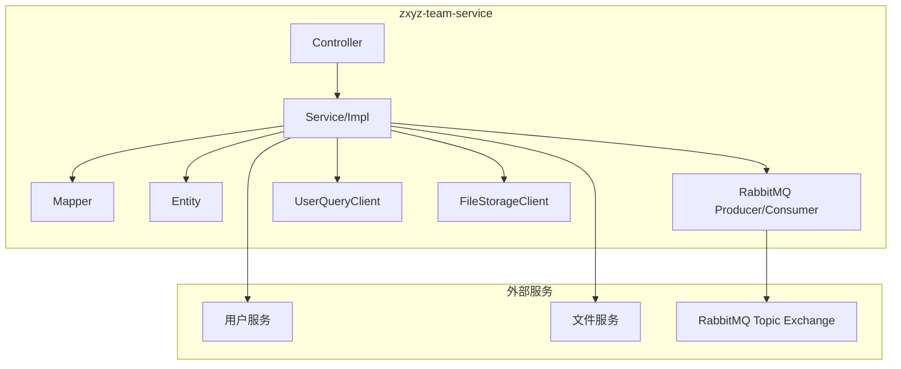
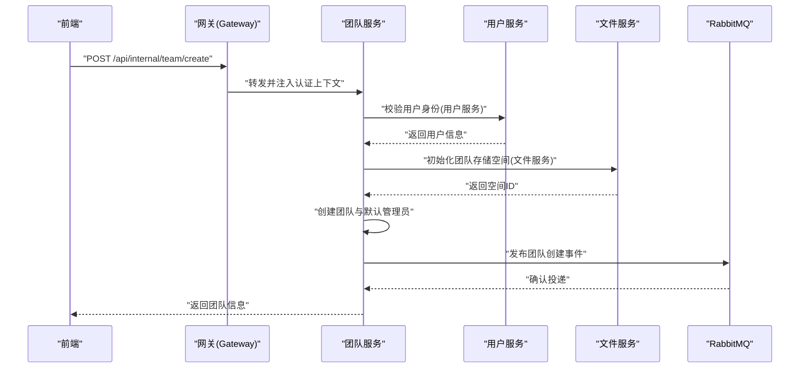
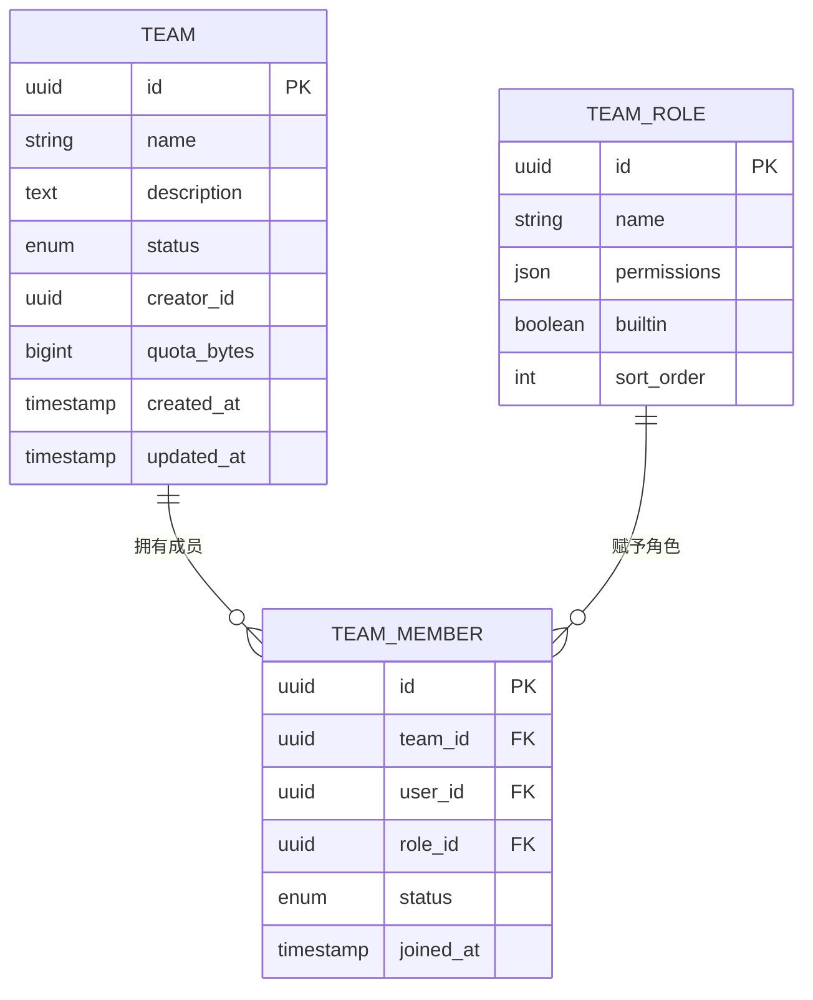
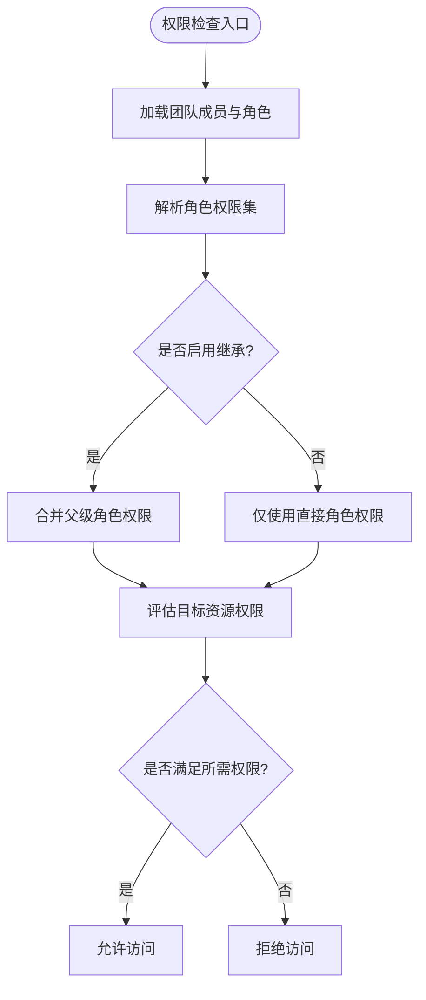
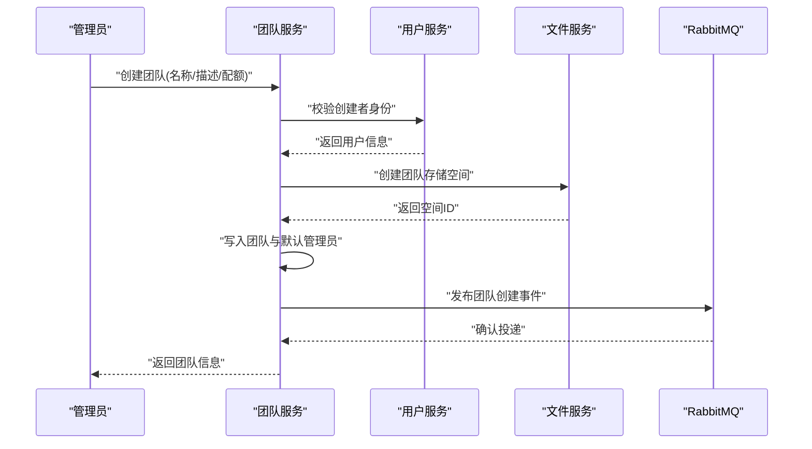
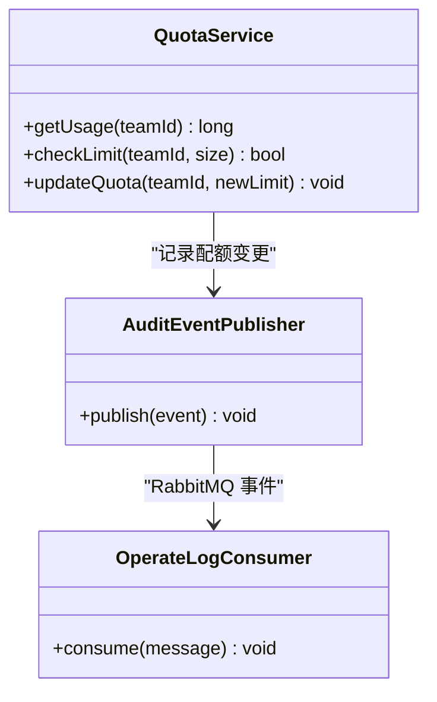
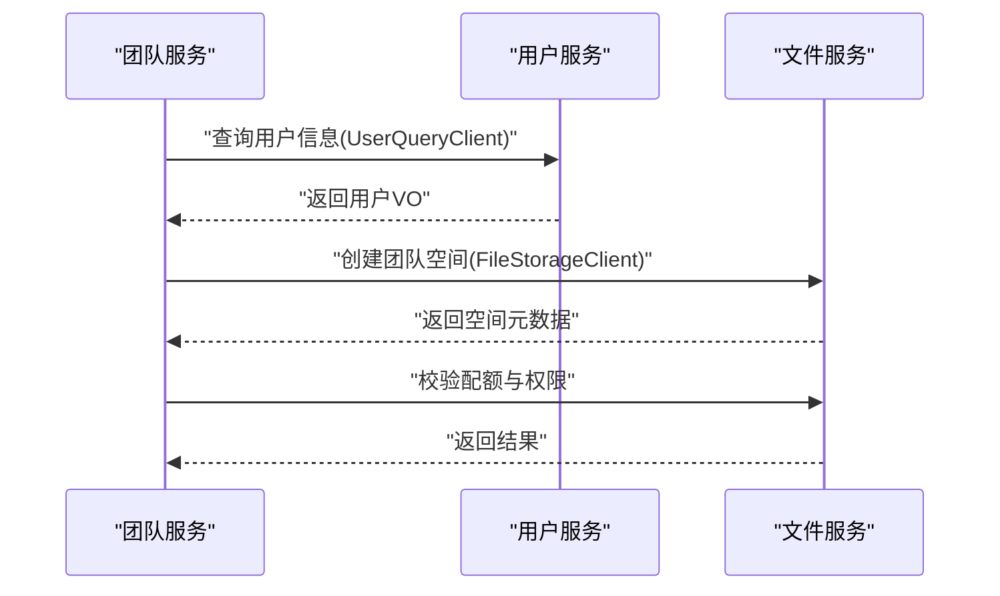
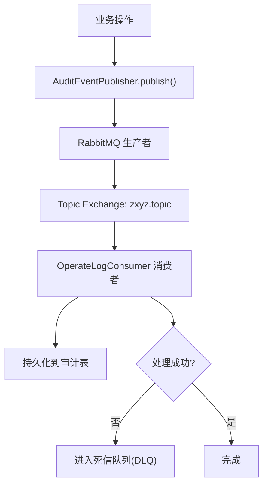
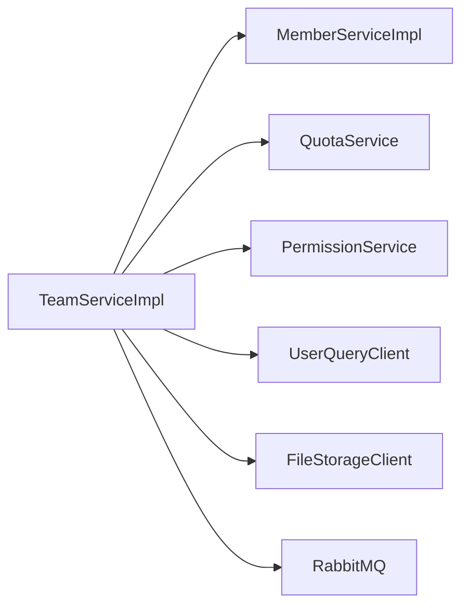

# 团队服务 (zxyz-team-service)

<cite>
**本文引用的文件**   
- [zxyz-team-service 应用入口](file://ZXYZdatabaseBack/zxyz-team-service/src/main/java/uno/acloud/team/ZxyzTeamServiceApplication.java)
- [团队实体 Team](file://ZXYZdatabaseBack/zxyz-team-service/src/main/java/uno/acloud/team/entity/Team.java)
- [团队成员实体 TeamMember](file://ZXYZdatabaseBack/zxyz-team-service/src/main/java/uno/acloud/team/entity/TeamMember.java)
- [团队角色实体 TeamRole](file://ZXYZdatabaseBack/zxyz-team-service/src/main/java/uno/acloud/team/entity/TeamRole.java)
- [权限策略 TeamPermissionPolicy](file://ZXYZdatabaseBack/zxyz-common/src/main/java/uno/acloud/common/permission/TeamPermissionPolicy.java)
- [权限服务 PermissionService](file://ZXYZdatabaseBack/zxyz-common/src/main/java/uno/acloud/common/permission/PermissionService.java)
- [团队服务接口 TeamService](file://ZXYZdatabaseBack/zxyz-team-service/src/main/java/uno/acloud/team/service/TeamService.java)
- [团队服务实现 TeamServiceImpl](file://ZXYZdatabaseBack/zxyz-team-service/src/main/java/uno/acloud/team/service/impl/TeamServiceImpl.java)
- [成员服务接口 MemberService](file://ZXYZdatabaseBack/zxyz-team-service/src/main/java/uno/acloud/team/service/MemberService.java)
- [成员服务实现 MemberServiceImpl](file://ZXYZdatabaseBack/zxyz-team-service/src/main/java/uno/acloud/team/service/impl/MemberServiceImpl.java)
- [配额服务 QuotaService](file://ZXYZdatabaseBack/zxyz-team-service/src/main/java/uno/acloud/team/service/QuotaService.java)
- [审计事件发布器 AuditEventPublisher](file://ZXYZdatabaseBack/zxyz-common/src/main/java/uno/acloud/common/audit/AuditEventPublisher.java)
- [操作日志消费者 OperateLogConsumer](file://ZXYZdatabaseBack/zxyz-audit-service/src/main/java/uno/acloud/audit/mq/OperateLogConsumer.java)
- [RabbitMQ 配置 RabbitMqConfig](file://ZXYZdatabaseBack/zxyz-audit-service/src/main/java/uno/acloud/audit/config/RabbitMqConfig.java)
- [用户查询客户端 UserQueryClient](file://ZXYZdatabaseBack/zxyz-common/src/main/java/uno/acloud/client/UserQueryClient.java)
- [文件存储客户端 FileStorageClient](file://ZXYZdatabaseBack/zxyz-common/src/main/java/uno/acloud/client/FileStorageClient.java)
- [团队服务客户端 TeamServiceClient](file://ZXYZdatabaseBack/zxyz-common/src/main/java/uno/acloud/client/TeamServiceClient.java)
- [数据库迁移 schema_team.sql](file://ZXYZdatabaseBack/sql/schema_team.sql)
- [前端团队 API team.js](file://ZXYZdatabaseFront/src/api/team.js)
- [前端团队设置抽屉 TeamSettingDrawer.vue](file://ZXYZdatabaseFront/src/components/TeamSettingDrawer.vue)
- [前端团队管理面板 TeamManagementPanel.vue](file://ZXYZdatabaseFront/src/components/team-settings/TeamManagementPanel.vue)
- [前端团队存储分配 useTeamStorageAllocation.js](file://ZXYZdatabaseFront/src/composables/team/useTeamStorageAllocation.js)
- [Nacos 配置 zxyz-team-service.yml](file://nacos-config/zxyz-team-service.yml)
</cite>

## 目录
1. [简介](#简介)
2. [项目结构](#项目结构)
3. [核心组件](#核心组件)
4. [架构总览](#架构总览)
5. [详细组件分析](#详细组件分析)
6. [依赖关系分析](#依赖关系分析)
7. [性能考量](#性能考量)
8. [故障排查指南](#故障排查指南)
9. [结论](#结论)
10. [附录](#附录)

## 简介
本文件面向 ZXYZ 团队的“团队服务”模块，系统性阐述团队协作管理能力与 RBAC 权限控制体系。内容覆盖：
- 核心实体模型：Team、TeamMember、TeamRole 的设计与关系
- RBAC 权限系统：PermissionService 权限验证、角色权限分配、成员权限继承
- 团队生命周期：创建团队、邀请成员、审批流程
- 企业级能力：团队配额、文件访问控制、审计日志
- 集成方式：与用户服务、文件服务的交互；RabbitMQ 事件驱动的消息处理
- 最佳实践与性能优化建议

## 项目结构
团队服务采用传统分层（controller → service/impl → mapper → entity），与 DDD 风格的服务（如 im-service、email-service）区分。关键目录与职责：
- controller：对外暴露 REST 端点（内部端点 /api/internal/**）
- service/impl：业务编排与事务边界
- mapper：数据访问层（MyBatis）
- entity：领域实体映射
- mq：消息监听与处理
- config：RabbitMQ、SaToken、RestClient 等配置
- dto/vo：请求/响应投影对象

图表来源
- [zxyz-team-service 应用入口](file://ZXYZdatabaseBack/zxyz-team-service/src/main/java/uno/acloud/team/ZxyzTeamServiceApplication.java)
- [RabbitMQ 配置 RabbitMqConfig](file://ZXYZdatabaseBack/zxyz-audit-service/src/main/java/uno/acloud/audit/config/RabbitMqConfig.java)

章节来源
- [zxyz-team-service 应用入口](file://ZXYZdatabaseBack/zxyz-team-service/src/main/java/uno/acloud/team/ZxyzTeamServiceApplication.java)
- [Nacos 配置 zxyz-team-service.yml](file://nacos-config/zxyz-team-service.yml)

## 核心组件
- 实体模型
  - Team：团队主表，包含名称、描述、状态、创建者、配额等
  - TeamMember：团队成员关系，含角色、加入时间、状态
  - TeamRole：角色定义，绑定一组权限标识
- 权限控制
  - PermissionService：提供 hasPermission/isAdmin/inheritedPermission 等校验方法
  - TeamPermissionPolicy：封装团队维度权限策略（基于角色与继承）
- 服务层
  - TeamService：团队 CRUD、邀请、审批、配额调整
  - MemberService：成员增删改查、角色变更、批量操作
  - QuotaService：配额计算、使用量统计、超限拦截
- 集成与事件
  - UserQueryClient：调用用户服务获取用户信息
  - FileStorageClient：调用文件服务进行空间与配额联动
  - AuditEventPublisher + OperateLogConsumer：审计事件发布与消费

章节来源
- [团队实体 Team](file://ZXYZdatabaseBack/zxyz-team-service/src/main/java/uno/acloud/team/entity/Team.java)
- [团队成员实体 TeamMember](file://ZXYZdatabaseBack/zxyz-team-service/src/main/java/uno/acloud/team/entity/TeamMember.java)
- [团队角色实体 TeamRole](file://ZXYZdatabaseBack/zxyz-team-service/src/main/java/uno/acloud/team/entity/TeamRole.java)
- [权限策略 TeamPermissionPolicy](file://ZXYZdatabaseBack/zxyz-common/src/main/java/uno/acloud/common/permission/TeamPermissionPolicy.java)
- [权限服务 PermissionService](file://ZXYZdatabaseBack/zxyz-common/src/main/java/uno/acloud/common/permission/PermissionService.java)
- [团队服务接口 TeamService](file://ZXYZdatabaseBack/zxyz-team-service/src/main/java/uno/acloud/team/service/TeamService.java)
- [团队服务实现 TeamServiceImpl](file://ZXYZdatabaseBack/zxyz-team-service/src/main/java/uno/acloud/team/service/impl/TeamServiceImpl.java)
- [成员服务接口 MemberService](file://ZXYZdatabaseBack/zxyz-team-service/src/main/java/uno/acloud/team/service/MemberService.java)
- [成员服务实现 MemberServiceImpl](file://ZXYZdatabaseBack/zxyz-team-service/src/main/java/uno/acloud/team/service/impl/MemberServiceImpl.java)
- [配额服务 QuotaService](file://ZXYZdatabaseBack/zxyz-team-service/src/main/java/uno/acloud/team/service/QuotaService.java)
- [审计事件发布器 AuditEventPublisher](file://ZXYZdatabaseBack/zxyz-common/src/main/java/uno/acloud/common/audit/AuditEventPublisher.java)
- [操作日志消费者 OperateLogConsumer](file://ZXYZdatabaseBack/zxyz-audit-service/src/main/java/uno/acloud/audit/mq/OperateLogConsumer.java)
- [用户查询客户端 UserQueryClient](file://ZXYZdatabaseBack/zxyz-common/src/main/java/uno/acloud/client/UserQueryClient.java)
- [文件存储客户端 FileStorageClient](file://ZXYZdatabaseBack/zxyz-common/src/main/java/uno/acloud/client/FileStorageClient.java)

## 架构总览
团队服务通过内部端点对外暴露能力，受 Gateway SaToken 过滤保护。跨服务调用使用 ServiceClient + X-Internal-Service-Token 鉴权；异步通信通过 RabbitMQ Topic Exchange zxyz.topic。

图表来源
- [团队服务实现 TeamServiceImpl](file://ZXYZdatabaseBack/zxyz-team-service/src/main/java/uno/acloud/team/service/impl/TeamServiceImpl.java)
- [用户查询客户端 UserQueryClient](file://ZXYZdatabaseBack/zxyz-common/src/main/java/uno/acloud/client/UserQueryClient.java)
- [文件存储客户端 FileStorageClient](file://ZXYZdatabaseBack/zxyz-common/src/main/java/uno/acloud/client/FileStorageClient.java)
- [RabbitMQ 配置 RabbitMqConfig](file://ZXYZdatabaseBack/zxyz-audit-service/src/main/java/uno/acloud/audit/config/RabbitMqConfig.java)

## 详细组件分析

### 实体模型设计（Team、TeamMember、TeamRole）
- Team：团队主键、名称、描述、状态、创建者、配额上限、创建/更新时间戳
- TeamMember：团队ID、用户ID、角色ID、状态、加入时间、邀请码/链接
- TeamRole：角色ID、角色名、权限集合、是否内置、排序

图表来源
- [数据库迁移 schema_team.sql](file://ZXYZdatabaseBack/sql/schema_team.sql)
- [团队实体 Team](file://ZXYZdatabaseBack/zxyz-team-service/src/main/java/uno/acloud/team/entity/Team.java)
- [团队成员实体 TeamMember](file://ZXYZdatabaseBack/zxyz-team-service/src/main/java/uno/acloud/team/entity/TeamMember.java)
- [团队角色实体 TeamRole](file://ZXYZdatabaseBack/zxyz-team-service/src/main/java/uno/acloud/team/entity/TeamRole.java)

章节来源
- [数据库迁移 schema_team.sql](file://ZXYZdatabaseBack/sql/schema_team.sql)
- [团队实体 Team](file://ZXYZdatabaseBack/zxyz-team-service/src/main/java/uno/acloud/team/entity/Team.java)
- [团队成员实体 TeamMember](file://ZXYZdatabaseBack/zxyz-team-service/src/main/java/uno/acloud/team/entity/TeamMember.java)
- [团队角色实体 TeamRole](file://ZXYZdatabaseBack/zxyz-team-service/src/main/java/uno/acloud/team/entity/TeamRole.java)

### RBAC 权限控制系统
- 角色与权限
  - TeamRole 定义权限集合（如 read/write/admin）
  - TeamMember 绑定角色，支持多角色叠加
- 权限验证
  - PermissionService 提供统一校验入口
  - TeamPermissionPolicy 封装团队维度策略（成员角色、继承规则、资源范围）
- 权限继承
  - 管理员对团队内所有资源具有最高权限
  - 普通成员按角色粒度授权，可继承父级角色权限（若启用）

图表来源
- [权限策略 TeamPermissionPolicy](file://ZXYZdatabaseBack/zxyz-common/src/main/java/uno/acloud/common/permission/TeamPermissionPolicy.java)
- [权限服务 PermissionService](file://ZXYZdatabaseBack/zxyz-common/src/main/java/uno/acloud/common/permission/PermissionService.java)

章节来源
- [权限策略 TeamPermissionPolicy](file://ZXYZdatabaseBack/zxyz-common/src/main/java/uno/acloud/common/permission/TeamPermissionPolicy.java)
- [权限服务 PermissionService](file://ZXYZdatabaseBack/zxyz-common/src/main/java/uno/acloud/common/permission/PermissionService.java)

### 团队生命周期管理
- 创建团队
  - 校验创建者身份，初始化默认管理员角色与成员记录
  - 在文件服务中创建团队存储空间，并设置初始配额
  - 发布团队创建事件，供其他服务订阅
- 邀请成员
  - 生成邀请链接或邀请码，设置过期时间与状态
  - 被邀请人接受后，写入 TeamMember 并分配角色
- 审批流程
  - 管理员审核邀请申请，通过后生效；拒绝则更新状态并通知
  - 敏感操作（如删除成员、修改角色）需二次审批

图表来源
- [团队服务实现 TeamServiceImpl](file://ZXYZdatabaseBack/zxyz-team-service/src/main/java/uno/acloud/team/service/impl/TeamServiceImpl.java)
- [用户查询客户端 UserQueryClient](file://ZXYZdatabaseBack/zxyz-common/src/main/java/uno/acloud/client/UserQueryClient.java)
- [文件存储客户端 FileStorageClient](file://ZXYZdatabaseBack/zxyz-common/src/main/java/uno/acloud/client/FileStorageClient.java)
- [RabbitMQ 配置 RabbitMqConfig](file://ZXYZdatabaseBack/zxyz-audit-service/src/main/java/uno/acloud/audit/config/RabbitMqConfig.java)

章节来源
- [团队服务实现 TeamServiceImpl](file://ZXYZdatabaseBack/zxyz-team-service/src/main/java/uno/acloud/team/service/impl/TeamServiceImpl.java)
- [成员服务实现 MemberServiceImpl](file://ZXYZdatabaseBack/zxyz-team-service/src/main/java/uno/acloud/team/service/impl/MemberServiceImpl.java)

### 企业级功能
- 团队配额管理
  - 设置团队存储上限，监控使用量，超限拦截写操作
  - 支持配额扩容与回收，记录变更审计
- 文件访问控制
  - 基于团队角色与权限策略校验文件读写
  - 与文件服务协作，确保路径与空间隔离
- 审计日志记录
  - 通过 AuditEventPublisher 发布操作事件
  - OperateLogConsumer 消费并落库，支持去重与重试

图表来源
- [配额服务 QuotaService](file://ZXYZdatabaseBack/zxyz-team-service/src/main/java/uno/acloud/team/service/QuotaService.java)
- [审计事件发布器 AuditEventPublisher](file://ZXYZdatabaseBack/zxyz-common/src/main/java/uno/acloud/common/audit/AuditEventPublisher.java)
- [操作日志消费者 OperateLogConsumer](file://ZXYZdatabaseBack/zxyz-audit-service/src/main/java/uno/acloud/audit/mq/OperateLogConsumer.java)

章节来源
- [配额服务 QuotaService](file://ZXYZdatabaseBack/zxyz-team-service/src/main/java/uno/acloud/team/service/QuotaService.java)
- [审计事件发布器 AuditEventPublisher](file://ZXYZdatabaseBack/zxyz-common/src/main/java/uno/acloud/common/audit/AuditEventPublisher.java)
- [操作日志消费者 OperateLogConsumer](file://ZXYZdatabaseBack/zxyz-audit-service/src/main/java/uno/acloud/audit/mq/OperateLogConsumer.java)

### 与用户服务、文件服务的集成
- 用户服务集成
  - 通过 UserQueryClient 获取用户基本信息与状态
  - 用于创建团队时校验创建者、邀请成员时校验用户存在性
- 文件服务集成
  - 通过 FileStorageClient 创建团队空间、校验配额、上传/下载权限
  - 文件路径以团队ID为前缀，确保空间隔离

图表来源
- [用户查询客户端 UserQueryClient](file://ZXYZdatabaseBack/zxyz-common/src/main/java/uno/acloud/client/UserQueryClient.java)
- [文件存储客户端 FileStorageClient](file://ZXYZdatabaseBack/zxyz-common/src/main/java/uno/acloud/client/FileStorageClient.java)
- [团队服务客户端 TeamServiceClient](file://ZXYZdatabaseBack/zxyz-common/src/main/java/uno/acloud/client/TeamServiceClient.java)

章节来源
- [用户查询客户端 UserQueryClient](file://ZXYZdatabaseBack/zxyz-common/src/main/java/uno/acloud/client/UserQueryClient.java)
- [文件存储客户端 FileStorageClient](file://ZXYZdatabaseBack/zxyz-common/src/main/java/uno/acloud/client/FileStorageClient.java)
- [团队服务客户端 TeamServiceClient](file://ZXYZdatabaseBack/zxyz-common/src/main/java/uno/acloud/client/TeamServiceClient.java)

### RabbitMQ 事件驱动的消息处理
- 主题交换：zxyz.topic
- 典型事件：团队创建、成员加入、配额变更、审计日志
- 可靠性：死信队列（DLQ）、幂等消费、重试机制

图表来源
- [RabbitMQ 配置 RabbitMqConfig](file://ZXYZdatabaseBack/zxyz-audit-service/src/main/java/uno/acloud/audit/config/RabbitMqConfig.java)
- [操作日志消费者 OperateLogConsumer](file://ZXYZdatabaseBack/zxyz-audit-service/src/main/java/uno/acloud/audit/mq/OperateLogConsumer.java)
- [审计事件发布器 AuditEventPublisher](file://ZXYZdatabaseBack/zxyz-common/src/main/java/uno/acloud/common/audit/AuditEventPublisher.java)

章节来源
- [RabbitMQ 配置 RabbitMqConfig](file://ZXYZdatabaseBack/zxyz-audit-service/src/main/java/uno/acloud/audit/config/RabbitMqConfig.java)
- [操作日志消费者 OperateLogConsumer](file://ZXYZdatabaseBack/zxyz-audit-service/src/main/java/uno/acloud/audit/mq/OperateLogConsumer.java)
- [审计事件发布器 AuditEventPublisher](file://ZXYZdatabaseBack/zxyz-common/src/main/java/uno/acloud/common/audit/AuditEventPublisher.java)

## 依赖关系分析
- 内部依赖
  - TeamServiceImpl 依赖 MemberService、QuotaService、PermissionService
  - 通过 UserQueryClient、FileStorageClient 与外部服务交互
- 外部依赖
  - RabbitMQ 用于异步事件（审计、通知）
  - Nacos 管理配置与服务注册
- 耦合与内聚
  - 服务层高内聚，控制器薄封装
  - 通过窄端点与投影 VO 降低跨服务耦合

图表来源
- [团队服务实现 TeamServiceImpl](file://ZXYZdatabaseBack/zxyz-team-service/src/main/java/uno/acloud/team/service/impl/TeamServiceImpl.java)
- [成员服务实现 MemberServiceImpl](file://ZXYZdatabaseBack/zxyz-team-service/src/main/java/uno/acloud/team/service/impl/MemberServiceImpl.java)
- [配额服务 QuotaService](file://ZXYZdatabaseBack/zxyz-team-service/src/main/java/uno/acloud/team/service/QuotaService.java)
- [权限服务 PermissionService](file://ZXYZdatabaseBack/zxyz-common/src/main/java/uno/acloud/common/permission/PermissionService.java)
- [用户查询客户端 UserQueryClient](file://ZXYZdatabaseBack/zxyz-common/src/main/java/uno/acloud/client/UserQueryClient.java)
- [文件存储客户端 FileStorageClient](file://ZXYZdatabaseBack/zxyz-common/src/main/java/uno/acloud/client/FileStorageClient.java)
- [RabbitMQ 配置 RabbitMqConfig](file://ZXYZdatabaseBack/zxyz-audit-service/src/main/java/uno/acloud/audit/config/RabbitMqConfig.java)

章节来源
- [团队服务实现 TeamServiceImpl](file://ZXYZdatabaseBack/zxyz-team-service/src/main/java/uno/acloud/team/service/impl/TeamServiceImpl.java)
- [成员服务实现 MemberServiceImpl](file://ZXYZdatabaseBack/zxyz-team-service/src/main/java/uno/acloud/team/service/impl/MemberServiceImpl.java)
- [配额服务 QuotaService](file://ZXYZdatabaseBack/zxyz-team-service/src/main/java/uno/acloud/team/service/QuotaService.java)
- [权限服务 PermissionService](file://ZXYZdatabaseBack/zxyz-common/src/main/java/uno/acloud/common/permission/PermissionService.java)
- [用户查询客户端 UserQueryClient](file://ZXYZdatabaseBack/zxyz-common/src/main/java/uno/acloud/client/UserQueryClient.java)
- [文件存储客户端 FileStorageClient](file://ZXYZdatabaseBack/zxyz-common/src/main/java/uno/acloud/client/FileStorageClient.java)
- [RabbitMQ 配置 RabbitMqConfig](file://ZXYZdatabaseBack/zxyz-audit-service/src/main/java/uno/acloud/audit/config/RabbitMqConfig.java)

## 性能考量
- 数据库层面
  - 为团队ID、用户ID、角色ID建立索引，提升查询效率
  - 分页与投影减少数据传输
- 缓存与限流
  - 热点权限结果可短期缓存（注意一致性）
  - 对邀请与审批接口实施限流，防止滥用
- 异步化
  - 非关键路径（审计、通知）走 RabbitMQ 异步处理
- 连接池与超时
  - 合理配置 RestClient 连接池与超时，避免雪崩

[本节为通用指导，不直接分析具体文件]

## 故障排查指南
- 常见问题
  - 权限校验失败：检查成员角色绑定与权限策略配置
  - 配额超限：查看团队配额设置与使用量统计
  - 审计日志缺失：检查 RabbitMQ 连接与消费者状态
- 定位步骤
  - 查看团队服务日志与错误码
  - 核对 Nacos 配置（RabbitMQ、数据库、外部服务地址）
  - 检查数据库表结构与索引
- 恢复措施
  - 重启消费者或重建队列（谨慎操作）
  - 修正配置并重试失败任务

章节来源
- [操作日志消费者 OperateLogConsumer](file://ZXYZdatabaseBack/zxyz-audit-service/src/main/java/uno/acloud/audit/mq/OperateLogConsumer.java)
- [RabbitMQ 配置 RabbitMqConfig](file://ZXYZdatabaseBack/zxyz-audit-service/src/main/java/uno/acloud/audit/config/RabbitMqConfig.java)

## 结论
团队服务围绕 Team、TeamMember、TeamRole 构建 RBAC 权限体系，结合配额管理与审计日志，形成完整的企业级团队协作能力。通过内部端点与 RabbitMQ 事件驱动，实现高内聚、低耦合的微服务架构。遵循最佳实践与性能优化建议，可保障系统在复杂场景下的稳定性与可扩展性。

[本节为总结性内容，不直接分析具体文件]

## 附录
- 前端集成要点
  - 使用 team.js 调用团队相关 API
  - TeamSettingDrawer.vue 提供团队设置界面
  - TeamManagementPanel.vue 展示成员与角色管理
  - useTeamStorageAllocation.js 管理配额与使用量

章节来源
- [前端团队 API team.js](file://ZXYZdatabaseFront/src/api/team.js)
- [前端团队设置抽屉 TeamSettingDrawer.vue](file://ZXYZdatabaseFront/src/components/TeamSettingDrawer.vue)
- [前端团队管理面板 TeamManagementPanel.vue](file://ZXYZdatabaseFront/src/components/team-settings/TeamManagementPanel.vue)
- [前端团队存储分配 useTeamStorageAllocation.js](file://ZXYZdatabaseFront/src/composables/team/useTeamStorageAllocation.js)