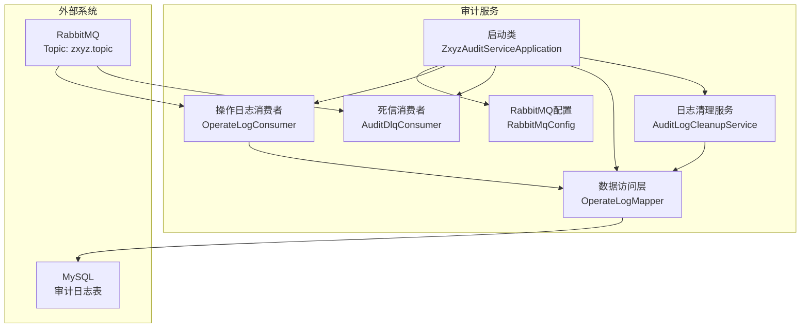
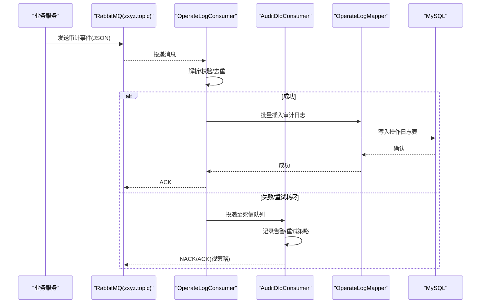
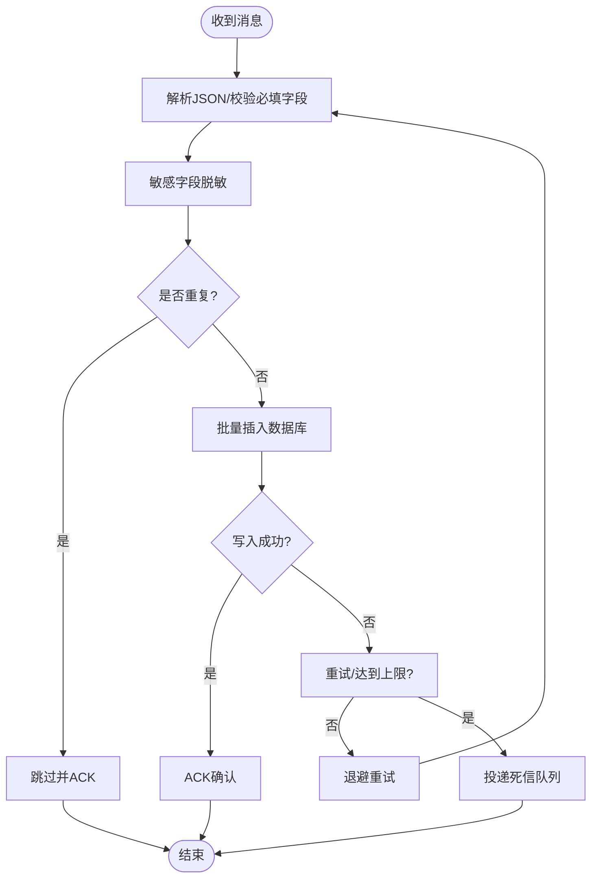
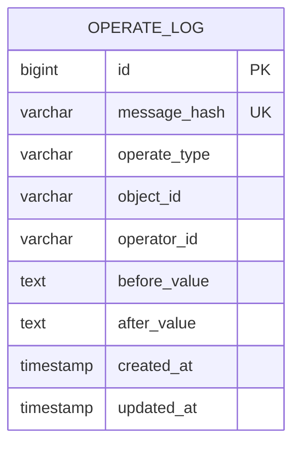
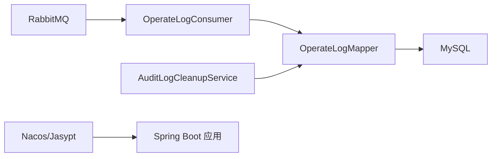

# 审计服务 (zxyz-audit-service)

<cite>
**本文引用的文件**
- [ZxyzAuditServiceApplication.java](file://ZXYZdatabaseBack/zxyz-audit-service/src/main/java/uno/acloud/audit/ZxyzAuditServiceApplication.java)
- [RabbitMqConfig.java](file://ZXYZdatabaseBack/zxyz-audit-service/src/main/java/uno/acloud/audit/config/RabbitMqConfig.java)
- [OperateLogConsumer.java](file://ZXYZdatabaseBack/zxyz-audit-service/src/main/java/uno/acloud/audit/mq/OperateLogConsumer.java)
- [AuditDlqConsumer.java](file://ZXYZdatabaseBack/zxyz-audit-service/src/main/java/uno/acloud/audit/mq/AuditDlqConsumer.java)
- [OperateLogMapper.java](file://ZXYZdatabaseBack/zxyz-audit-service/src/main/java/uno/acloud/audit/mapper/OperateLogMapper.java)
- [AuditLogCleanupService.java](file://ZXYZdatabaseBack/zxyz-audit-service/src/main/java/uno/acloud/audit/service/AuditLogCleanupService.java)
- [application.yml](file://ZXYZdatabaseBack/zxyz-audit-service/src/main/resources/application.yml)
- [application-dev.yml](file://ZXYZdatabaseBack/zxyz-audit-service/src/main/resources/application-dev.yml)
- [application-prod.yml](file://ZXYZdatabaseBack/zxyz-audit-service/src/main/resources/application-prod.yml)
- [V1__init_schema.sql](file://ZXYZdatabaseBack/zxyz-audit-service/src/main/resources/db/migration/V1__init_schema.sql)
- [V2__add_operate_log_before_after_values.sql](file://ZXYZdatabaseBack/zxyz-audit-service/src/main/resources/db/migration/V2__add_operate_log_before_after_values.sql)
- [V3__add_message_hash_unique.sql](file://ZXYZdatabaseBack/zxyz-audit-service/src/main/resources/db/migration/V3__add_message_hash_unique.sql)
- [OperateLogConsumerTest.java](file://ZXYZdatabaseBack/zxyz-audit-service/src/test/java/uno/acloud/audit/mq/OperateLogConsumerTest.java)
- [pom.xml](file://ZXYZdatabaseBack/zxyz-audit-service/pom.xml)
- [zxyz-audit-service.yml](file://nacos-config/zxyz-audit-service.yml)
</cite>

## 目录
1. [简介](#简介)
2. [项目结构](#项目结构)
3. [核心组件](#核心组件)
4. [架构总览](#架构总览)
5. [详细组件分析](#详细组件分析)
6. [依赖关系分析](#依赖关系分析)
7. [性能与存储优化](#性能与存储优化)
8. [故障排查指南](#故障排查指南)
9. [结论](#结论)
10. [附录](#附录)

## 简介
本文件为 ZXYZ 审计服务（zxyz-audit-service）的权威技术文档，聚焦操作日志收集与分析能力。内容涵盖：
- 基于 RabbitMQ 的异步消息处理机制，确保审计日志的可靠、有序与幂等写入
- 操作日志数据结构设计，包括操作类型、前后值对比、审计轨迹追踪
- 日志清理与归档策略、存储空间管理与查询性能优化
- 合规性审计、数据安全保护与日志脱敏要点
- 审计日志分析与报表生成思路与实践建议

该服务采用传统分层架构（controller → service/impl → mapper → entity），通过 MQ Topic Exchange zxyz.topic 接收来自各业务服务的审计事件，持久化到数据库并支持后续审计查询与报表输出。

## 项目结构
zxyz-audit-service 模块包含以下关键目录与职责：
- config：RabbitMQ 连接与队列/交换机配置
- mq：消息消费者（OperateLogConsumer、AuditDlqConsumer）
- mapper：MyBatis Mapper（OperateLogMapper）
- service：定时任务与服务（AuditLogCleanupService）
- resources：应用配置与数据库迁移脚本
- test：消费者单元测试

图表来源
- [ZxyzAuditServiceApplication.java](file://ZXYZdatabaseBack/zxyz-audit-service/src/main/java/uno/acloud/audit/ZxyzAuditServiceApplication.java)
- [RabbitMqConfig.java](file://ZXYZdatabaseBack/zxyz-audit-service/src/main/java/uno/acloud/audit/config/RabbitMqConfig.java)
- [OperateLogConsumer.java](file://ZXYZdatabaseBack/zxyz-audit-service/src/main/java/uno/acloud/audit/mq/OperateLogConsumer.java)
- [AuditDlqConsumer.java](file://ZXYZdatabaseBack/zxyz-audit-service/src/main/java/uno/acloud/audit/mq/AuditDlqConsumer.java)
- [OperateLogMapper.java](file://ZXYZdatabaseBack/zxyz-audit-service/src/main/java/uno/acloud/audit/mapper/OperateLogMapper.java)
- [AuditLogCleanupService.java](file://ZXYZdatabaseBack/zxyz-audit-service/src/main/java/uno/acloud/audit/service/AuditLogCleanupService.java)

章节来源
- [pom.xml](file://ZXYZdatabaseBack/zxyz-audit-service/pom.xml)
- [application.yml](file://ZXYZdatabaseBack/zxyz-audit-service/src/main/resources/application.yml)
- [application-dev.yml](file://ZXYZdatabaseBack/zxyz-audit-service/src/main/resources/application-dev.yml)
- [application-prod.yml](file://ZXYZdatabaseBack/zxyz-audit-service/src/main/resources/application-prod.yml)

## 核心组件
- 启动类：启用 Spring Boot 自动装配与扫描包，加载 RabbitMQ、Mapper、服务与消费者
- RabbitMQ 配置：声明 Topic Exchange、队列、绑定与死信通道，设置消费并发与重试策略
- OperateLogConsumer：监听审计主题，解析消息体，去重、校验、落库；失败进入死信队列
- AuditDlqConsumer：消费死信队列，记录告警与重试策略，避免丢失
- OperateLogMapper：定义审计日志的插入、批量写入与分页查询接口
- AuditLogCleanupService：定时任务，按策略清理过期日志，释放存储空间

章节来源
- [ZxyzAuditServiceApplication.java](file://ZXYZdatabaseBack/zxyz-audit-service/src/main/java/uno/acloud/audit/ZxyzAuditServiceApplication.java)
- [RabbitMqConfig.java](file://ZXYZdatabaseBack/zxyz-audit-service/src/main/java/uno/acloud/audit/config/RabbitMqConfig.java)
- [OperateLogConsumer.java](file://ZXYZdatabaseBack/zxyz-audit-service/src/main/java/uno/acloud/audit/mq/OperateLogConsumer.java)
- [AuditDlqConsumer.java](file://ZXYZdatabaseBack/zxyz-audit-service/src/main/java/uno/acloud/audit/mq/AuditDlqConsumer.java)
- [OperateLogMapper.java](file://ZXYZdatabaseBack/zxyz-audit-service/src/main/java/uno/acloud/audit/mapper/OperateLogMapper.java)
- [AuditLogCleanupService.java](file://ZXYZdatabaseBack/zxyz-audit-service/src/main/java/uno/acloud/audit/service/AuditLogCleanupService.java)

## 架构总览
审计服务整体流程：
- 业务服务将审计事件以 JSON 形式发送到 RabbitMQ 的 zxyz.topic
- 审计服务通过 OperateLogConsumer 订阅主题，进行消息解析、去重、校验后写入数据库
- 异常或重试耗尽的消息进入死信队列，由 AuditDlqConsumer 处理并告警
- AuditLogCleanupService 定期清理过期日志，保障存储与查询性能

图表来源
- [OperateLogConsumer.java](file://ZXYZdatabaseBack/zxyz-audit-service/src/main/java/uno/acloud/audit/mq/OperateLogConsumer.java)
- [AuditDlqConsumer.java](file://ZXYZdatabaseBack/zxyz-audit-service/src/main/java/uno/acloud/audit/mq/AuditDlqConsumer.java)
- [OperateLogMapper.java](file://ZXYZdatabaseBack/zxyz-audit-service/src/main/java/uno/acloud/audit/mapper/OperateLogMapper.java)

## 详细组件分析

### 操作日志消费者（OperateLogConsumer）
- 功能：从 zxyz.topic 消费审计事件，执行字段校验、敏感信息脱敏、消息去重（基于消息哈希）、批量入库
- 可靠性：支持重试与死信队列；失败时不丢消息，进入 DLQ 供人工干预
- 幂等性：通过消息哈希唯一约束避免重复写入
- 性能：批量插入、合理事务边界、索引优化

图表来源
- [OperateLogConsumer.java](file://ZXYZdatabaseBack/zxyz-audit-service/src/main/java/uno/acloud/audit/mq/OperateLogConsumer.java)
- [V3__add_message_hash_unique.sql](file://ZXYZdatabaseBack/zxyz-audit-service/src/main/resources/db/migration/V3__add_message_hash_unique.sql)

章节来源
- [OperateLogConsumer.java](file://ZXYZdatabaseBack/zxyz-audit-service/src/main/java/uno/acloud/audit/mq/OperateLogConsumer.java)
- [OperateLogConsumerTest.java](file://ZXYZdatabaseBack/zxyz-audit-service/src/test/java/uno/acloud/audit/mq/OperateLogConsumerTest.java)

### 死信消费者（AuditDlqConsumer）
- 功能：消费死信队列中的审计消息，记录告警、触发重试或人工处理流程
- 策略：可配置最大重试次数、退避时间、告警通知渠道
- 安全：对死信消息进行二次脱敏与审计，防止敏感信息泄露

章节来源
- [AuditDlqConsumer.java](file://ZXYZdatabaseBack/zxyz-audit-service/src/main/java/uno/acloud/audit/mq/AuditDlqConsumer.java)

### 数据访问层（OperateLogMapper）
- 功能：提供审计日志的插入、批量写入、分页查询与统计接口
- 优化：使用批量 SQL、合理事务边界、索引覆盖查询条件（如时间范围、操作类型、用户ID）

章节来源
- [OperateLogMapper.java](file://ZXYZdatabaseBack/zxyz-audit-service/src/main/java/uno/acloud/audit/mapper/OperateLogMapper.java)

### 日志清理服务（AuditLogCleanupService）
- 功能：定时任务，按策略删除过期审计日志，释放存储空间
- 策略：支持按时间窗口、大小阈值、分库分表分区清理
- 安全：清理前备份或归档，确保合规留存期

章节来源
- [AuditLogCleanupService.java](file://ZXYZdatabaseBack/zxyz-audit-service/src/main/java/uno/acloud/audit/service/AuditLogCleanupService.java)

### 数据库模型与迁移
- V1__init_schema.sql：初始化审计日志表结构，包含基础字段（操作类型、对象标识、操作人、时间戳等）
- V2__add_operate_log_before_after_values.sql：扩展 before_value/after_value 字段，支持前后值对比
- V3__add_message_hash_unique.sql：添加消息哈希唯一约束，实现幂等写入

图表来源
- [V1__init_schema.sql](file://ZXYZdatabaseBack/zxyz-audit-service/src/main/resources/db/migration/V1__init_schema.sql)
- [V2__add_operate_log_before_after_values.sql](file://ZXYZdatabaseBack/zxyz-audit-service/src/main/resources/db/migration/V2__add_operate_log_before_after_values.sql)
- [V3__add_message_hash_unique.sql](file://ZXYZdatabaseBack/zxyz-audit-service/src/main/resources/db/migration/V3__add_message_hash_unique.sql)

章节来源
- [V1__init_schema.sql](file://ZXYZdatabaseBack/zxyz-audit-service/src/main/resources/db/migration/V1__init_schema.sql)
- [V2__add_operate_log_before_after_values.sql](file://ZXYZdatabaseBack/zxyz-audit-service/src/main/resources/db/migration/V2__add_operate_log_before_after_values.sql)
- [V3__add_message_hash_unique.sql](file://ZXYZdatabaseBack/zxyz-audit-service/src/main/resources/db/migration/V3__add_message_hash_unique.sql)

## 依赖关系分析
- 外部依赖：RabbitMQ（消息总线）、MySQL（持久化）
- 内部依赖：Nacos 配置中心（动态配置）、Jasypt（敏感配置加密）
- 耦合度：消费者与 Mapper 解耦，通过接口抽象；清理服务独立调度，降低主流程压力

图表来源
- [RabbitMqConfig.java](file://ZXYZdatabaseBack/zxyz-audit-service/src/main/java/uno/acloud/audit/config/RabbitMqConfig.java)
- [OperateLogMapper.java](file://ZXYZdatabaseBack/zxyz-audit-service/src/main/java/uno/acloud/audit/mapper/OperateLogMapper.java)
- [AuditLogCleanupService.java](file://ZXYZdatabaseBack/zxyz-audit-service/src/main/java/uno/acloud/audit/service/AuditLogCleanupService.java)

章节来源
- [zxyz-audit-service.yml](file://nacos-config/zxyz-audit-service.yml)
- [application.yml](file://ZXYZdatabaseBack/zxyz-audit-service/src/main/resources/application.yml)

## 性能与存储优化
- 消息处理
  - 批量插入：减少数据库往返，提升吞吐
  - 去重机制：消息哈希唯一约束，避免重复写入
  - 死信队列：失败消息隔离，不影响主流程
- 存储管理
  - 分区/分表：按时间维度划分，便于归档与清理
  - 索引优化：针对高频查询条件建立复合索引（时间、操作类型、用户ID）
  - 清理策略：定时任务按保留周期清理，控制存储增长
- 查询优化
  - 投影模式：仅返回必要字段，减少网络传输
  - 分页查询：限制单次返回量，避免大结果集
  - 缓存热点：对常用统计结果做短期缓存（如最近24小时审计趋势）

[本节为通用指导，不直接分析具体文件]

## 故障排查指南
- 消息堆积
  - 检查消费者线程池与并发配置
  - 查看死信队列积压情况，定位失败原因
  - 调整批大小与事务边界，提升吞吐
- 写入失败
  - 核对数据库连接与权限
  - 检查唯一约束冲突（消息哈希）
  - 查看错误日志与堆栈，定位异常点
- 存储膨胀
  - 评估清理任务执行频率与策略
  - 检查索引与分区是否生效
  - 监控磁盘使用率与慢查询

章节来源
- [OperateLogConsumer.java](file://ZXYZdatabaseBack/zxyz-audit-service/src/main/java/uno/acloud/audit/mq/OperateLogConsumer.java)
- [AuditDlqConsumer.java](file://ZXYZdatabaseBack/zxyz-audit-service/src/main/java/uno/acloud/audit/mq/AuditDlqConsumer.java)
- [AuditLogCleanupService.java](file://ZXYZdatabaseBack/zxyz-audit-service/src/main/java/uno/acloud/audit/service/AuditLogCleanupService.java)

## 结论
ZXYZ 审计服务通过 RabbitMQ 异步解耦、幂等写入与死信隔离，实现了高可靠的操作日志采集与持久化。结合合理的数据库设计与清理策略，保障了存储与查询性能。未来可进一步增强报表与分析能力，提供更丰富的审计洞察。

[本节为总结，不直接分析具体文件]

## 附录
- 合规性审计
  - 保留周期：根据法规要求设定最小保留时间
  - 不可篡改：写入后禁止修改，必要时追加审计
  - 访问控制：严格限制审计数据读取权限
- 数据安全保护
  - 敏感字段脱敏：手机号、身份证、邮箱等
  - 传输加密：TLS 加密 MQ 通信
  - 存储加密：数据库敏感字段加密存储
- 日志脱敏
  - 统一脱敏规则：在消费者层集中处理
  - 白名单机制：允许特定场景明文记录
- 分析与报表
  - 趋势分析：按日/周/月统计操作频次
  - 风险预警：异常操作实时告警
  - 导出功能：支持 CSV/Excel 导出审计明细

[本节为通用指导，不直接分析具体文件]