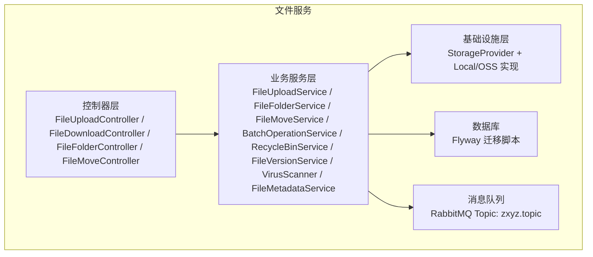
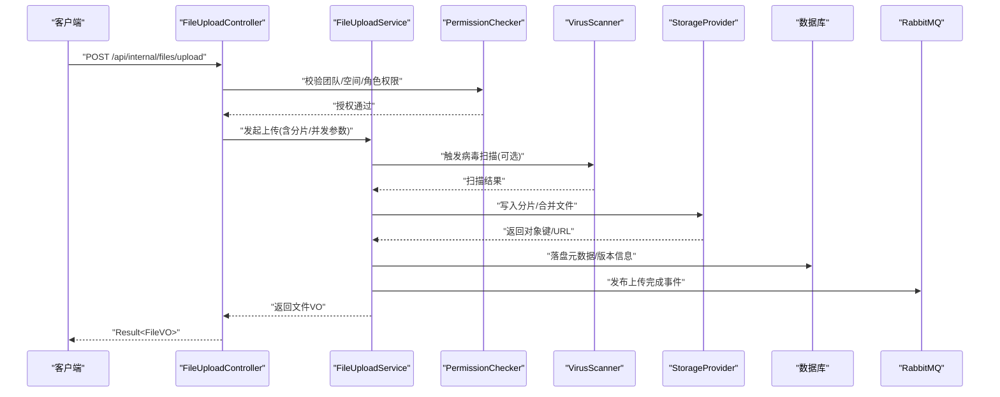
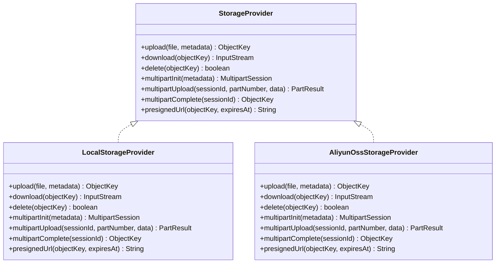
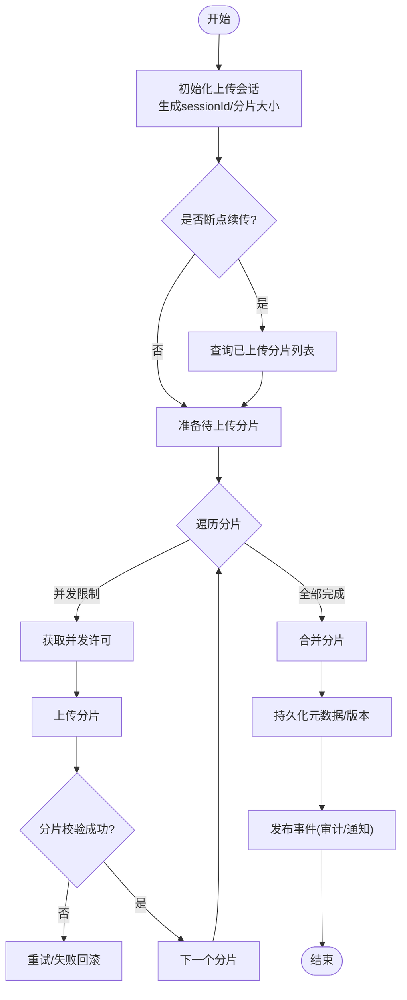
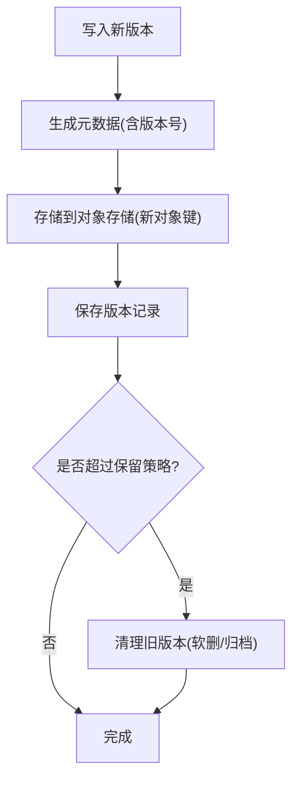
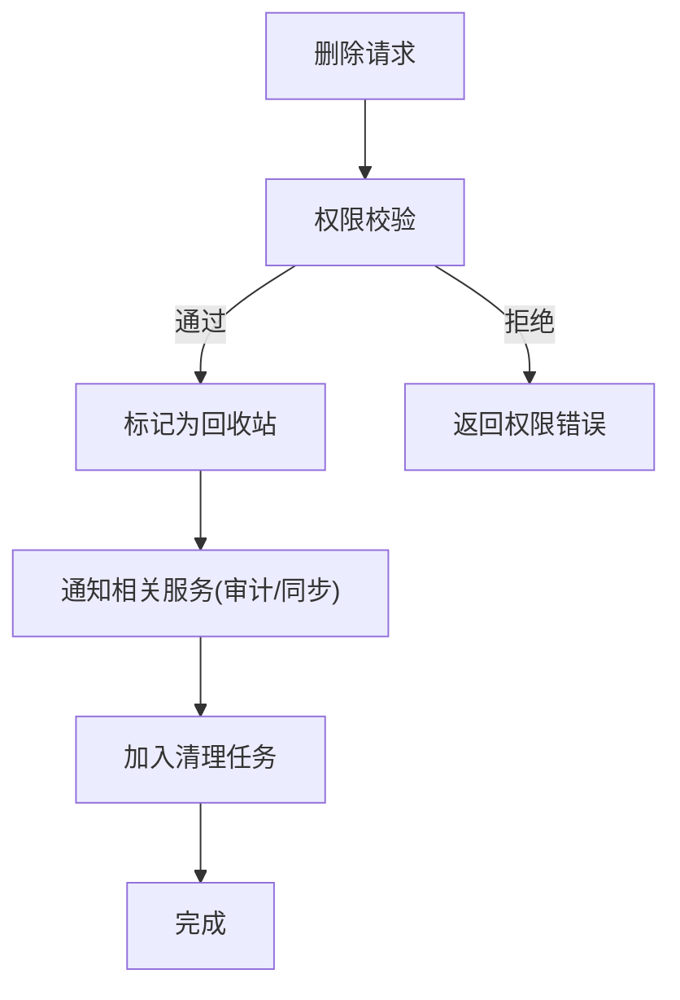
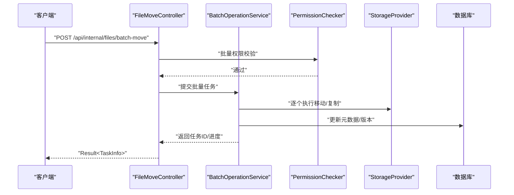
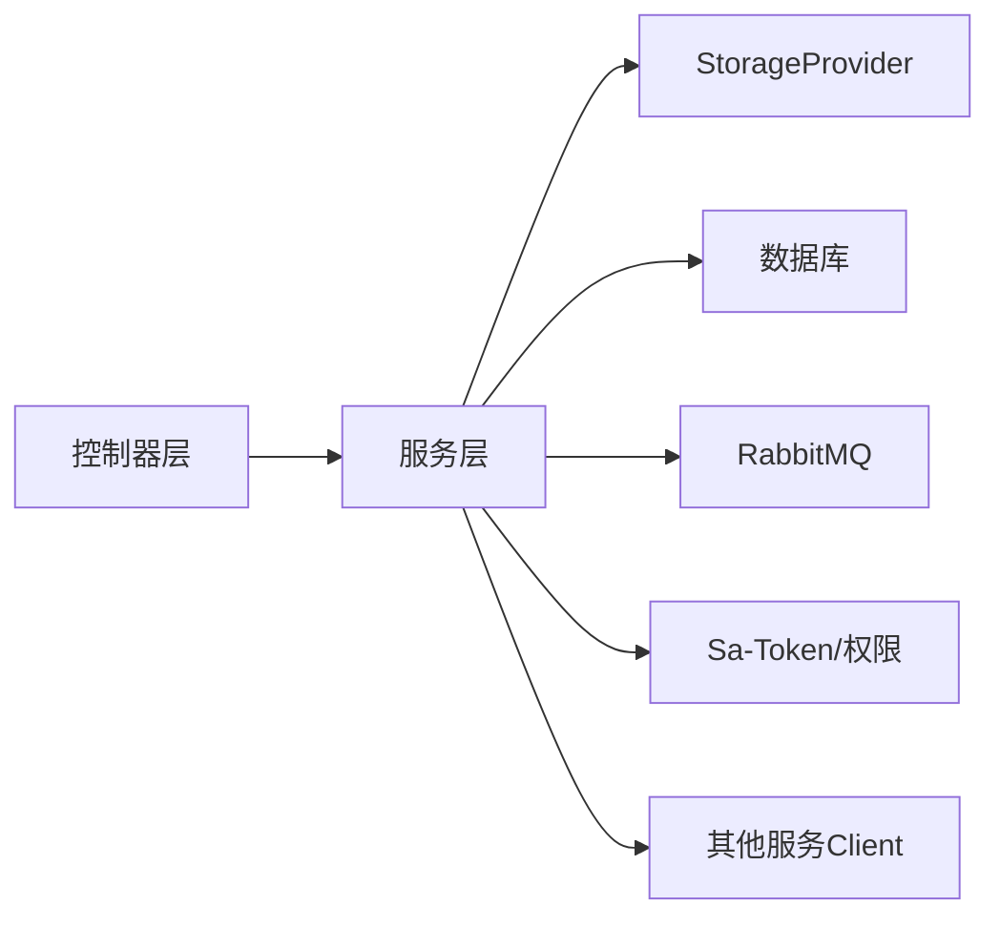

# 文件服务 (zxyz-file-service)

<cite>
**本文引用的文件**   
- [ZxyzFileApplication.java](file://ZXYZdatabaseBack/zxyz-file-service/src/main/java/uno/acloud/file/ZxyzFileApplication.java)
- [application.yml](file://ZXYZdatabaseBack/zxyz-file-service/src/main/resources/application.yml)
- [application-dev.yml](file://ZXYZdatabaseBack/zxyz-file-service/src/main/resources/application-dev.yml)
- [application-prod.yml](file://ZXYZdatabaseBack/zxyz-file-service/src/main/resources/application-prod.yml)
- [schema_file.sql](file://ZXYZdatabaseBack/sql/schema_file.sql)
- [V1__init_file_schema.sql](file://ZXYZdatabaseBack/zxyz-file-service/src/main/resources/db/migration/V1__init_file_schema.sql)
- [V2__add_versioning_and_recycle_bin.sql](file://ZXYZdatabaseBack/zxyz-file-service/src/main/resources/db/migration/V2__add_versioning_and_recycle_bin.sql)
- [V3__add_metadata_indexes.sql](file://ZXYZdatabaseBack/zxyz-file-service/src/main/resources/db/migration/V3__add_metadata_indexes.sql)
- [FileUploadController.java](file://ZXYZdatabaseBack/zxyz-file-service/src/main/java/uno/acloud/file/controller/FileUploadController.java)
- [FileDownloadController.java](file://ZXYZdatabaseBack/zxyz-file-service/src/main/java/uno/acloud/file/controller/FileDownloadController.java)
- [FileFolderController.java](file://ZXYZdatabaseBack/zxyz-file-service/src/main/java/uno/acloud/file/controller/FileFolderController.java)
- [FileMoveController.java](file://ZXYZdatabaseBack/zxyz-file-service/src/main/java/uno/acloud/file/controller/FileMoveController.java)
- [FileUploadService.java](file://ZXYZdatabaseBack/zxyz-file-service/src/main/java/uno/acloud/file/service/FileUploadService.java)
- [FileFolderService.java](file://ZXYZdatabaseBack/zxyz-file-service/src/main/java/uno/acloud/file/service/FileFolderService.java)
- [FileMoveService.java](file://ZXYZdatabaseBack/zxyz-file-service/src/main/java/uno/acloud/file/service/FileMoveService.java)
- [StorageProvider.java](file://ZXYZdatabaseBack/zxyz-file-service/src/main/java/uno/acloud/file/storage/StorageProvider.java)
- [LocalStorageProvider.java](file://ZXYZdatabaseBack/zxyz-file-service/src/main/java/uno/acloud/file/storage/impl/LocalStorageProvider.java)
- [AliyunOssStorageProvider.java](file://ZXYZdatabaseBack/zxyz-file-service/src/main/java/uno/acloud/file/storage/impl/AliyunOssStorageProvider.java)
- [FileMetadataService.java](file://ZXYZdatabaseBack/zxyz-file-service/src/main/java/uno/acloud/file/service/FileMetadataService.java)
- [PermissionChecker.java](file://ZXYZdatabaseBack/zxyz-file-service/src/main/java/uno/acloud/file/satoken/PermissionChecker.java)
- [VirusScanner.java](file://ZXYZdatabaseBack/zxyz-file-service/src/main/java/uno/acloud/file/service/VirusScanner.java)
- [BatchOperationService.java](file://ZXYZdatabaseBack/zxyz-file-service/src/main/java/uno/acloud/file/service/BatchOperationService.java)
- [RecycleBinService.java](file://ZXYZdatabaseBack/zxyz-file-service/src/main/java/uno/acloud/file/service/RecycleBinService.java)
- [FileVersionService.java](file://ZXYZdatabaseBack/zxyz-file-service/src/main/java/uno/acloud/file/service/FileVersionService.java)
- [FileUploadDTO.java](file://ZXYZdatabaseBack/zxyz-file-service/src/main/java/uno/acloud/file/dto/FileUploadDTO.java)
- [FileVO.java](file://ZXYZdatabaseBack/zxyz-file-service/src/main/java/uno/acloud/file/vo/FileVO.java)
</cite>

## 目录
1. [简介](#简介)
2. [项目结构](#项目结构)
3. [核心组件](#核心组件)
4. [架构总览](#架构总览)
5. [详细组件分析](#详细组件分析)
6. [依赖关系分析](#依赖关系分析)
7. [性能考量](#性能考量)
8. [故障排查指南](#故障排查指南)
9. [结论](#结论)
10. [附录](#附录)

## 简介
本文件为 ZXYZ 文件服务的完整技术文档，聚焦于文件上传下载、分片与断点续传、并发控制、存储提供商抽象（本地与阿里云 OSS）、版本控制、回收站管理、批量操作、权限校验、病毒扫描、元数据管理等关键能力。同时给出存储优化策略、CDN 集成方案与故障恢复机制建议，帮助开发者快速理解并扩展该服务。

## 项目结构
zxyz-file-service 采用传统分层（controller → service → infrastructure/mapper → entity），对外暴露 REST API，内部通过 ServiceClient 调用其他微服务，异步事件通过 RabbitMQ Topic Exchange zxyz.topic 传播。

图表来源
- [FileUploadController.java](file://ZXYZdatabaseBack/zxyz-file-service/src/main/java/uno/acloud/file/controller/FileUploadController.java)
- [FileDownloadController.java](file://ZXYZdatabaseBack/zxyz-file-service/src/main/java/uno/acloud/file/controller/FileDownloadController.java)
- [FileFolderController.java](file://ZXYZdatabaseBack/zxyz-file-service/src/main/java/uno/acloud/file/controller/FileFolderController.java)
- [FileMoveController.java](file://ZXYZdatabaseBack/zxyz-file-service/src/main/java/uno/acloud/file/controller/FileMoveController.java)
- [FileUploadService.java](file://ZXYZdatabaseBack/zxyz-file-service/src/main/java/uno/acloud/file/service/FileUploadService.java)
- [FileFolderService.java](file://ZXYZdatabaseBack/zxyz-file-service/src/main/java/uno/acloud/file/service/FileFolderService.java)
- [FileMoveService.java](file://ZXYZdatabaseBack/zxyz-file-service/src/main/java/uno/acloud/file/service/FileMoveService.java)
- [StorageProvider.java](file://ZXYZdatabaseBack/zxyz-file-service/src/main/java/uno/acloud/file/storage/StorageProvider.java)
- [LocalStorageProvider.java](file://ZXYZdatabaseBack/zxyz-file-service/src/main/java/uno/acloud/file/storage/impl/LocalStorageProvider.java)
- [AliyunOssStorageProvider.java](file://ZXYZdatabaseBack/zxyz-file-service/src/main/java/uno/acloud/file/storage/impl/AliyunOssStorageProvider.java)
- [schema_file.sql](file://ZXYZdatabaseBack/sql/schema_file.sql)
- [V1__init_file_schema.sql](file://ZXYZdatabaseBack/zxyz-file-service/src/main/resources/db/migration/V1__init_file_schema.sql)

章节来源
- [ZxyzFileApplication.java](file://ZXYZdatabaseBack/zxyz-file-service/src/main/java/uno/acloud/file/ZxyzFileApplication.java)
- [application.yml](file://ZXYZdatabaseBack/zxyz-file-service/src/main/resources/application.yml)
- [application-dev.yml](file://ZXYZdatabaseBack/zxyz-file-service/src/main/resources/application-dev.yml)
- [application-prod.yml](file://ZXYZdatabaseBack/zxyz-file-service/src/main/resources/application-prod.yml)
- [schema_file.sql](file://ZXYZdatabaseBack/sql/schema_file.sql)

## 核心组件
- 控制器层：统一入口，负责参数校验、鉴权前置、响应封装。
- 业务服务层：编排上传、下载、文件夹、移动、版本、回收站、批量、元数据、病毒扫描等流程。
- 存储抽象层：StorageProvider 接口定义统一读写能力，支持本地与阿里云 OSS 等多种后端。
- 数据访问层：基于 Flyway 的数据库迁移与持久化。
- 外部集成：RabbitMQ 事件发布、其他微服务客户端调用。

章节来源
- [FileUploadController.java](file://ZXYZdatabaseBack/zxyz-file-service/src/main/java/uno/acloud/file/controller/FileUploadController.java)
- [FileDownloadController.java](file://ZXYZdatabaseBack/zxyz-file-service/src/main/java/uno/acloud/file/controller/FileDownloadController.java)
- [FileFolderController.java](file://ZXYZdatabaseBack/zxyz-file-service/src/main/java/uno/acloud/file/controller/FileFolderController.java)
- [FileMoveController.java](file://ZXYZdatabaseBack/zxyz-file-service/src/main/java/uno/acloud/file/controller/FileMoveController.java)
- [FileUploadService.java](file://ZXYZdatabaseBack/zxyz-file-service/src/main/java/uno/acloud/file/service/FileUploadService.java)
- [StorageProvider.java](file://ZXYZdatabaseBack/zxyz-file-service/src/main/java/uno/acloud/file/storage/StorageProvider.java)

## 架构总览
文件服务以“控制器→服务→存储抽象”的分层架构为核心，结合事件驱动与多后端存储，提供高可用、可扩展的文件管理能力。

图表来源
- [FileUploadController.java](file://ZXYZdatabaseBack/zxyz-file-service/src/main/java/uno/acloud/file/controller/FileUploadController.java)
- [FileUploadService.java](file://ZXYZdatabaseBack/zxyz-file-service/src/main/java/uno/acloud/file/service/FileUploadService.java)
- [PermissionChecker.java](file://ZXYZdatabaseBack/zxyz-file-service/src/main/java/uno/acloud/file/satoken/PermissionChecker.java)
- [VirusScanner.java](file://ZXYZdatabaseBack/zxyz-file-service/src/main/java/uno/acloud/file/service/VirusScanner.java)
- [StorageProvider.java](file://ZXYZdatabaseBack/zxyz-file-service/src/main/java/uno/acloud/file/storage/StorageProvider.java)
- [schema_file.sql](file://ZXYZdatabaseBack/sql/schema_file.sql)

## 详细组件分析

### 存储提供商抽象 StorageProvider
- 设计目标：屏蔽不同对象存储差异，统一上传、下载、删除、分片、预签名 URL 等能力。
- 典型实现：
  - 本地存储：文件系统路径映射，适合开发测试或内网环境。
  - 阿里云 OSS：使用 SDK 进行分片上传、断点续传、生命周期管理。
- 扩展性：新增后端只需实现 StorageProvider 接口，并通过配置切换。

图表来源
- [StorageProvider.java](file://ZXYZdatabaseBack/zxyz-file-service/src/main/java/uno/acloud/file/storage/StorageProvider.java)
- [LocalStorageProvider.java](file://ZXYZdatabaseBack/zxyz-file-service/src/main/java/uno/acloud/file/storage/impl/LocalStorageProvider.java)
- [AliyunOssStorageProvider.java](file://ZXYZdatabaseBack/zxyz-file-service/src/main/java/uno/acloud/file/storage/impl/AliyunOssStorageProvider.java)

章节来源
- [StorageProvider.java](file://ZXYZdatabaseBack/zxyz-file-service/src/main/java/uno/acloud/file/storage/StorageProvider.java)
- [LocalStorageProvider.java](file://ZXYZdatabaseBack/zxyz-file-service/src/main/java/uno/acloud/file/storage/impl/LocalStorageProvider.java)
- [AliyunOssStorageProvider.java](file://ZXYZdatabaseBack/zxyz-file-service/src/main/java/uno/acloud/file/storage/impl/AliyunOssStorageProvider.java)

### 文件上传下载核心功能
- 分片上传：大文件按固定大小切分，并行上传各分片，完成后合并；支持断点续传（记录分片状态）。
- 并发控制：限制同一文件的并发分片数与全局并发度，避免资源耗尽。
- 下载：流式下载、范围下载、预签名直链（可选 CDN）。
- 错误处理：网络重试、分片校验、幂等合并。

图表来源
- [FileUploadController.java](file://ZXYZdatabaseBack/zxyz-file-service/src/main/java/uno/acloud/file/controller/FileUploadController.java)
- [FileUploadService.java](file://ZXYZdatabaseBack/zxyz-file-service/src/main/java/uno/acloud/file/service/FileUploadService.java)
- [StorageProvider.java](file://ZXYZdatabaseBack/zxyz-file-service/src/main/java/uno/acloud/file/storage/StorageProvider.java)

章节来源
- [FileUploadController.java](file://ZXYZdatabaseBack/zxyz-file-service/src/main/java/uno/acloud/file/controller/FileUploadController.java)
- [FileUploadService.java](file://ZXYZdatabaseBack/zxyz-file-service/src/main/java/uno/acloud/file/service/FileUploadService.java)

### 文件版本控制
- 版本策略：覆盖写时创建新版本，保留历史版本；支持按版本下载与对比。
- 元数据：文件名、大小、MIME、哈希、创建时间、版本索引等。
- 清理策略：可配置保留数量或过期时间，自动清理旧版本。

图表来源
- [FileVersionService.java](file://ZXYZdatabaseBack/zxyz-file-service/src/main/java/uno/acloud/file/service/FileVersionService.java)
- [schema_file.sql](file://ZXYZdatabaseBack/sql/schema_file.sql)
- [V2__add_versioning_and_recycle_bin.sql](file://ZXYZdatabaseBack/zxyz-file-service/src/main/resources/db/migration/V2__add_versioning_and_recycle_bin.sql)

章节来源
- [FileVersionService.java](file://ZXYZdatabaseBack/zxyz-file-service/src/main/java/uno/acloud/file/service/FileVersionService.java)
- [V2__add_versioning_and_recycle_bin.sql](file://ZXYZdatabaseBack/zxyz-file-service/src/main/resources/db/migration/V2__add_versioning_and_recycle_bin.sql)

### 回收站管理
- 软删除：将文件标记为回收站状态，支持恢复与彻底删除。
- 定时清理：按策略清理过期回收站内容，释放存储空间。
- 权限控制：仅具备相应权限的用户可执行回收站操作。

图表来源
- [RecycleBinService.java](file://ZXYZdatabaseBack/zxyz-file-service/src/main/java/uno/acloud/file/service/RecycleBinService.java)
- [PermissionChecker.java](file://ZXYZdatabaseBack/zxyz-file-service/src/main/java/uno/acloud/file/satoken/PermissionChecker.java)
- [V2__add_versioning_and_recycle_bin.sql](file://ZXYZdatabaseBack/zxyz-file-service/src/main/resources/db/migration/V2__add_versioning_and_recycle_bin.sql)

章节来源
- [RecycleBinService.java](file://ZXYZdatabaseBack/zxyz-file-service/src/main/java/uno/acloud/file/service/RecycleBinService.java)
- [PermissionChecker.java](file://ZXYZdatabaseBack/zxyz-file-service/src/main/java/uno/acloud/file/satoken/PermissionChecker.java)
- [V2__add_versioning_and_recycle_bin.sql](file://ZXYZdatabaseBack/zxyz-file-service/src/main/resources/db/migration/V2__add_versioning_and_recycle_bin.sql)

### 批量操作
- 支持批量移动、复制、删除、重命名等操作。
- 事务边界：保证批量操作的原子性或补偿机制。
- 进度反馈：通过事件或轮询返回批量任务进度。

图表来源
- [FileMoveController.java](file://ZXYZdatabaseBack/zxyz-file-service/src/main/java/uno/acloud/file/controller/FileMoveController.java)
- [BatchOperationService.java](file://ZXYZdatabaseBack/zxyz-file-service/src/main/java/uno/acloud/file/service/BatchOperationService.java)
- [PermissionChecker.java](file://ZXYZdatabaseBack/zxyz-file-service/src/main/java/uno/acloud/file/satoken/PermissionChecker.java)
- [StorageProvider.java](file://ZXYZdatabaseBack/zxyz-file-service/src/main/java/uno/acloud/file/storage/StorageProvider.java)

章节来源
- [FileMoveController.java](file://ZXYZdatabaseBack/zxyz-file-service/src/main/java/uno/acloud/file/controller/FileMoveController.java)
- [BatchOperationService.java](file://ZXYZdatabaseBack/zxyz-file-service/src/main/java/uno/acloud/file/service/BatchOperationService.java)

### 文件权限控制
- 基于 Sa-Token 的团队/空间/角色权限模型。
- 细粒度校验：对上传、下载、移动、删除、回收站等操作进行权限检查。
- 内部端点保护：/api/internal/** 由 Gateway 拦截，禁止公网访问。

章节来源
- [PermissionChecker.java](file://ZXYZdatabaseBack/zxyz-file-service/src/main/java/uno/acloud/file/satoken/PermissionChecker.java)
- [application.yml](file://ZXYZdatabaseBack/zxyz-file-service/src/main/resources/application.yml)

### 病毒扫描
- 在上传流程中插入病毒扫描环节，支持异步扫描与回调。
- 扫描失败或发现威胁时阻断后续流程并记录审计日志。

章节来源
- [VirusScanner.java](file://ZXYZdatabaseBack/zxyz-file-service/src/main/java/uno/acloud/file/service/VirusScanner.java)
- [FileUploadService.java](file://ZXYZdatabaseBack/zxyz-file-service/src/main/java/uno/acloud/file/service/FileUploadService.java)

### 元数据管理
- 维护文件基础信息与扩展属性，支持索引与检索。
- 变更审计：记录元数据修改历史，便于追溯。

章节来源
- [FileMetadataService.java](file://ZXYZdatabaseBack/zxyz-file-service/src/main/java/uno/acloud/file/service/FileMetadataService.java)
- [schema_file.sql](file://ZXYZdatabaseBack/sql/schema_file.sql)
- [V3__add_metadata_indexes.sql](file://ZXYZdatabaseBack/zxyz-file-service/src/main/resources/db/migration/V3__add_metadata_indexes.sql)

### 文件与文件夹服务
- FileFolderService：文件夹创建、重命名、层级导航、树形结构构建。
- FileMoveService：单文件移动、跨空间移动、冲突处理与幂等保障。

章节来源
- [FileFolderService.java](file://ZXYZdatabaseBack/zxyz-file-service/src/main/java/uno/acloud/file/service/FileFolderService.java)
- [FileMoveService.java](file://ZXYZdatabaseBack/zxyz-file-service/src/main/java/uno/acloud/file/service/FileMoveService.java)

## 依赖关系分析
- 控制器依赖服务层，服务层依赖存储抽象与数据访问层。
- 通过 RabbitMQ 与其他服务解耦，如审计、通知、同步等。
- 配置中心 Nacos 管理运行时配置，Jasypt 加密敏感项。

图表来源
- [FileUploadController.java](file://ZXYZdatabaseBack/zxyz-file-service/src/main/java/uno/acloud/file/controller/FileUploadController.java)
- [FileUploadService.java](file://ZXYZdatabaseBack/zxyz-file-service/src/main/java/uno/acloud/file/service/FileUploadService.java)
- [StorageProvider.java](file://ZXYZdatabaseBack/zxyz-file-service/src/main/java/uno/acloud/file/storage/StorageProvider.java)

章节来源
- [application.yml](file://ZXYZdatabaseBack/zxyz-file-service/src/main/resources/application.yml)
- [application-dev.yml](file://ZXYZdatabaseBack/zxyz-file-service/src/main/resources/application-dev.yml)
- [application-prod.yml](file://ZXYZdatabaseBack/zxyz-file-service/src/main/resources/application-prod.yml)

## 性能考量
- 分片大小与并发度调优：根据网络与存储后端特性调整分片大小与并发上限。
- 缓存与直链：启用预签名 URL 与 CDN 加速下载，减少服务端带宽压力。
- 数据库索引：针对常用查询字段建立索引，提升检索性能。
- 异步化：将耗时操作（病毒扫描、审计、通知）异步化，缩短主流程时延。
- 存储后端选择：热数据走高性能对象存储，冷数据归档至低成本存储。

[本节为通用指导，不直接分析具体文件]

## 故障排查指南
- 上传失败：检查分片校验、网络重试、存储后端连通性与配额。
- 下载超时：确认预签名 URL 有效期、CDN 缓存命中、服务端限流。
- 权限错误：核对用户角色、团队/空间绑定、内部端点访问令牌。
- 回收站异常：检查软删除标记、清理任务调度、对象存储残留。
- 版本混乱：核对版本索引、对象键命名规则、合并幂等性。

章节来源
- [FileUploadService.java](file://ZXYZdatabaseBack/zxyz-file-service/src/main/java/uno/acloud/file/service/FileUploadService.java)
- [RecycleBinService.java](file://ZXYZdatabaseBack/zxyz-file-service/src/main/java/uno/acloud/file/service/RecycleBinService.java)
- [FileVersionService.java](file://ZXYZdatabaseBack/zxyz-file-service/src/main/java/uno/acloud/file/service/FileVersionService.java)

## 结论
文件服务通过清晰的层次与抽象，实现了稳定可靠的文件上传下载、版本控制与回收站管理，并具备良好的扩展性与运维能力。结合 CDN、异步化与存储后端抽象，可在多种场景下提供高性能与高可用的文件管理能力。

[本节为总结性内容，不直接分析具体文件]

## 附录
- 配置要点：应用配置、存储后端参数、RabbitMQ 连接、Nacos 动态配置。
- 迁移脚本：数据库结构与索引演进。
- DTO/VO：上传请求与返回视图定义。

章节来源
- [application.yml](file://ZXYZdatabaseBack/zxyz-file-service/src/main/resources/application.yml)
- [schema_file.sql](file://ZXYZdatabaseBack/sql/schema_file.sql)
- [FileUploadDTO.java](file://ZXYZdatabaseBack/zxyz-file-service/src/main/java/uno/acloud/file/dto/FileUploadDTO.java)
- [FileVO.java](file://ZXYZdatabaseBack/zxyz-file-service/src/main/java/uno/acloud/file/vo/FileVO.java)