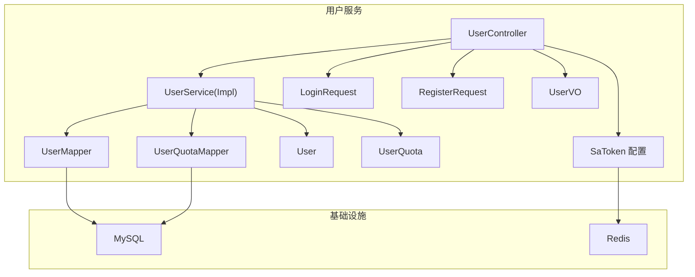
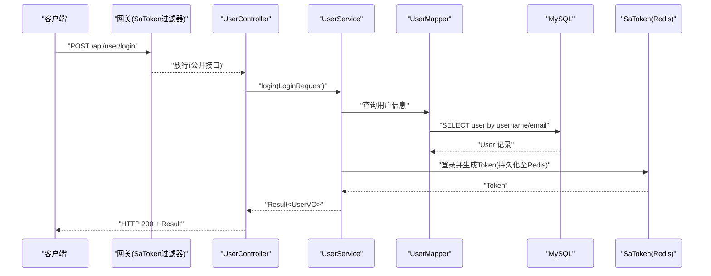
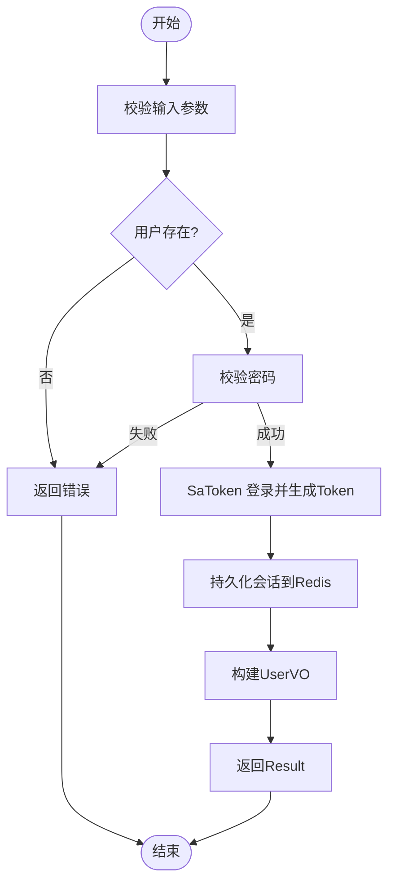
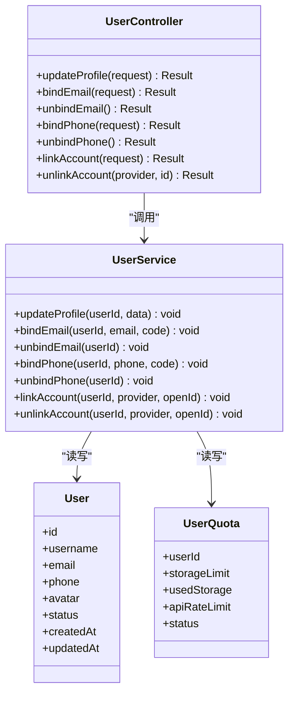
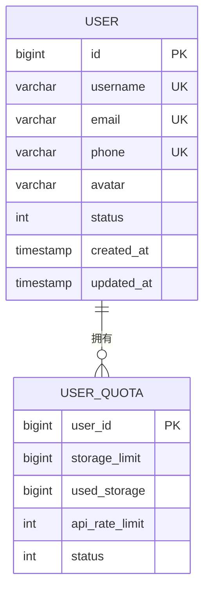
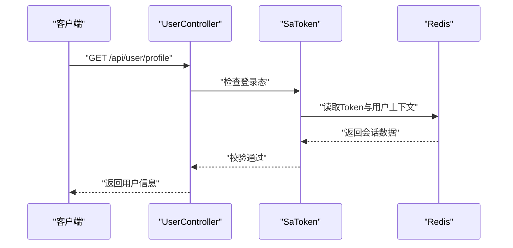
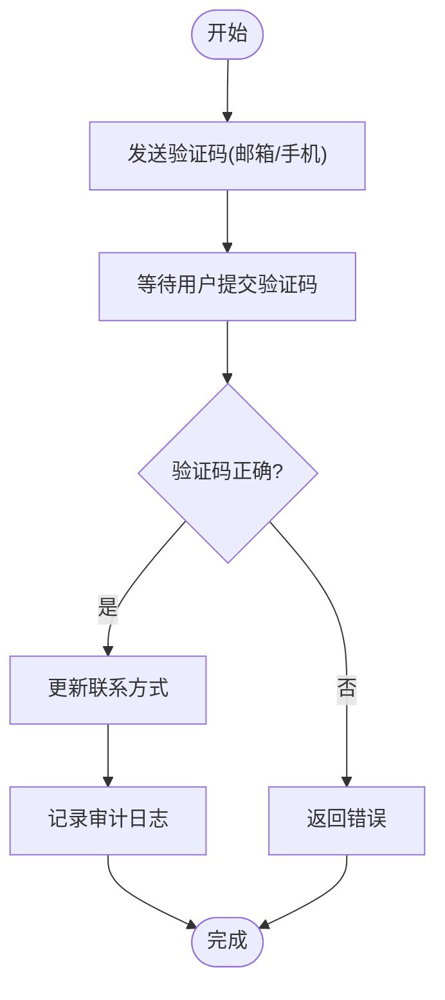
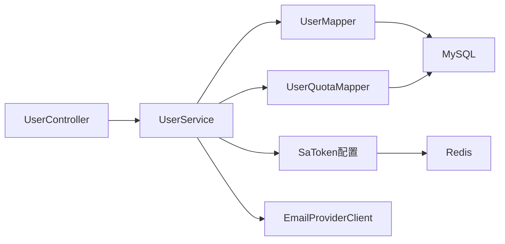

# 用户服务 (zxyz-user-service)

<cite>
**本文引用的文件**   
- [ZXYZdatabaseBack/zxyz-user-service/src/main/java/uno/acloud/user/ZxyzUserApplication.java](file://ZXYZdatabaseBack/zxyz-user-service/src/main/java/uno/acloud/user/ZxyzUserApplication.java)
- [ZXYZdatabaseBack/zxyz-user-service/src/main/java/uno/acloud/user/config/SaTokenConfigure.java](file://ZXYZdatabaseBack/zxyz-user-service/src/main/java/uno/acloud/user/config/SaTokenConfigure.java)
- [ZXYZdatabaseBack/zxyz-user-service/src/main/java/uno/acloud/user/controller/UserController.java](file://ZXYZdatabaseBack/zxyz-user-service/src/main/java/uno/acloud/user/controller/UserController.java)
- [ZXYZdatabaseBack/zxyz-user-service/src/main/java/uno/acloud/user/service/UserService.java](file://ZXYZdatabaseBack/zxyz-user-service/src/main/java/uno/acloud/user/service/UserService.java)
- [ZXYZdatabaseBack/zxyz-user-service/src/main/java/uno/acloud/user/service/impl/UserServiceImpl.java](file://ZXYZdatabaseBack/zxyz-user-service/src/main/java/uno/acloud/user/service/impl/UserServiceImpl.java)
- [ZXYZdatabaseBack/zxyz-user-service/src/main/java/uno/acloud/user/entity/User.java](file://ZXYZdatabaseBack/zxyz-user-service/src/main/java/uno/acloud/user/entity/User.java)
- [ZXYZdatabaseBack/zxyz-user-service/src/main/java/uno/acloud/user/entity/UserQuota.java](file://ZXYZdatabaseBack/zxyz-user-service/src/main/java/uno/acloud/user/entity/UserQuota.java)
- [ZXYZdatabaseBack/zxyz-user-service/src/main/java/uno/acloud/user/mapper/UserMapper.java](file://ZXYZdatabaseBack/zxyz-user-service/src/main/java/uno/acloud/user/mapper/UserMapper.java)
- [ZXYZdatabaseBack/zxyz-user-service/src/main/java/uno/acloud/user/mapper/UserQuotaMapper.java](file://ZXYZdatabaseBack/zxyz-user-service/src/main/java/uno/acloud/user/mapper/UserQuotaMapper.java)
- [ZXYZdatabaseBack/zxyz-user-service/src/main/java/uno/acloud/user/dto/LoginRequest.java](file://ZXYZdatabaseBack/zxyz-user-service/src/main/java/uno/acloud/user/dto/LoginRequest.java)
- [ZXYZdatabaseBack/zxyz-user-service/src/main/java/uno/acloud/user/dto/RegisterRequest.java](file://ZXYZdatabaseBack/zxyz-user-service/src/main/java/uno/acloud/user/dto/RegisterRequest.java)
- [ZXYZdatabaseBack/zxyz-user-service/src/main/java/uno/acloud/user/vo/UserVO.java](file://ZXYZdatabaseBack/zxyz-user-service/src/main/java/uno/acloud/user/vo/UserVO.java)
- [ZXYZdatabaseBack/zxyz-user-service/src/main/resources/application.yml](file://ZXYZdatabaseBack/zxyz-user-service/src/main/resources/application.yml)
- [ZXYZdatabaseBack/sql/schema_user.sql](file://ZXYZdatabaseBack/sql/schema_user.sql)
- [ZXYZdatabaseBack/nacos-config/zxyz-user-service.yml](file://ZXYZdatabaseBack/nacos-config/zxyz-user-service.yml)
- [ZXYZdatabaseBack/zxyz-common/src/main/java/uno/acloud/satoken/SaTokenConfig.java](file://ZXYZdatabaseBack/zxyz-common/src/main/java/uno/acloud/satoken/SaTokenConfig.java)
- [ZXYZdatabaseBack/zxyz-common/src/main/java/uno/acloud/common/web/Result.java](file://ZXYZdatabaseBack/zxyz-common/src/main/java/uno/acloud/common/web/Result.java)
</cite>

## 目录
1. [简介](#简介)
2. [项目结构](#项目结构)
3. [核心组件](#核心组件)
4. [架构总览](#架构总览)
5. [详细组件分析](#详细组件分析)
6. [依赖关系分析](#依赖关系分析)
7. [性能考虑](#性能考虑)
8. [故障排查指南](#故障排查指南)
9. [结论](#结论)
10. [附录](#附录)

## 简介
本文件为 ZXYZ 用户服务的权威技术文档，聚焦以下目标：
- 用户认证与授权机制：AuthService 登录注册流程、密码加密存储、会话管理（SaToken + Redis）。
- 用户信息管理：个人资料更新、联系方式绑定、账户关联。
- 实体模型设计：User 与 UserQuota 的状态管理、配额限制、权限继承。
- SaToken 集成：会话持久化、多端登录支持、权限验证。
- 辅助能力：验证码发送、邮箱绑定、手机号绑定。
- 数据迁移策略与安全最佳实践。

## 项目结构
用户服务采用传统分层（controller → service/impl → mapper → entity），并集成 SaToken 进行认证授权。关键目录与职责：
- controller：对外暴露 REST API（登录、注册、个人信息等）。
- service/impl：业务编排与事务边界。
- mapper：MyBatis Mapper 接口，映射数据库表。
- entity：领域实体（User、UserQuota）。
- dto/vo：请求与响应投影对象。
- config：应用配置与 SaToken 配置。
- resources：应用配置文件与数据库迁移脚本。

图表来源
- [ZXYZdatabaseBack/zxyz-user-service/src/main/java/uno/acloud/user/controller/UserController.java](file://ZXYZdatabaseBack/zxyz-user-service/src/main/java/uno/acloud/user/controller/UserController.java)
- [ZXYZdatabaseBack/zxyz-user-service/src/main/java/uno/acloud/user/service/UserService.java](file://ZXYZdatabaseBack/zxyz-user-service/src/main/java/uno/acloud/user/service/UserService.java)
- [ZXYZdatabaseBack/zxyz-user-service/src/main/java/uno/acloud/user/service/impl/UserServiceImpl.java](file://ZXYZdatabaseBack/zxyz-user-service/src/main/java/uno/acloud/user/service/impl/UserServiceImpl.java)
- [ZXYZdatabaseBack/zxyz-user-service/src/main/java/uno/acloud/user/mapper/UserMapper.java](file://ZXYZdatabaseBack/zxyz-user-service/src/main/java/uno/acloud/user/mapper/UserMapper.java)
- [ZXYZdatabaseBack/zxyz-user-service/src/main/java/uno/acloud/user/mapper/UserQuotaMapper.java](file://ZXYZdatabaseBack/zxyz-user-service/src/main/java/uno/acloud/user/mapper/UserQuotaMapper.java)
- [ZXYZdatabaseBack/zxyz-user-service/src/main/java/uno/acloud/user/entity/User.java](file://ZXYZdatabaseBack/zxyz-user-service/src/main/java/uno/acloud/user/entity/User.java)
- [ZXYZdatabaseBack/zxyz-user-service/src/main/java/uno/acloud/user/entity/UserQuota.java](file://ZXYZdatabaseBack/zxyz-user-service/src/main/java/uno/acloud/user/entity/UserQuota.java)
- [ZXYZdatabaseBack/zxyz-user-service/src/main/java/uno/acloud/user/config/SaTokenConfigure.java](file://ZXYZdatabaseBack/zxyz-user-service/src/main/java/uno/acloud/user/config/SaTokenConfigure.java)

章节来源
- [ZXYZdatabaseBack/zxyz-user-service/src/main/java/uno/acloud/user/ZxyzUserApplication.java](file://ZXYZdatabaseBack/zxyz-user-service/src/main/java/uno/acloud/user/ZxyzUserApplication.java)
- [ZXYZdatabaseBack/zxyz-user-service/src/main/resources/application.yml](file://ZXYZdatabaseBack/zxyz-user-service/src/main/resources/application.yml)

## 核心组件
- 控制器层：统一接收登录、注册、个人信息修改、联系方式绑定等请求，返回 Result<T> 标准响应。
- 服务层：封装认证、注册、资料更新、配额校验、账号关联等业务逻辑，处理异常与事务。
- 数据访问层：通过 MyBatis Mapper 操作用户与配额表。
- 实体层：User 与 UserQuota 描述用户基本信息与配额状态。
- 安全层：基于 SaToken 的会话管理与权限校验，结合 Redis 实现持久化与多端登录。

章节来源
- [ZXYZdatabaseBack/zxyz-user-service/src/main/java/uno/acloud/user/controller/UserController.java](file://ZXYZdatabaseBack/zxyz-user-service/src/main/java/uno/acloud/user/controller/UserController.java)
- [ZXYZdatabaseBack/zxyz-user-service/src/main/java/uno/acloud/user/service/UserService.java](file://ZXYZdatabaseBack/zxyz-user-service/src/main/java/uno/acloud/user/service/UserService.java)
- [ZXYZdatabaseBack/zxyz-user-service/src/main/java/uno/acloud/user/service/impl/UserServiceImpl.java](file://ZXYZdatabaseBack/zxyz-user-service/src/main/java/uno/acloud/user/service/impl/UserServiceImpl.java)
- [ZXYZdatabaseBack/zxyz-user-service/src/main/java/uno/acloud/user/entity/User.java](file://ZXYZdatabaseBack/zxyz-user-service/src/main/java/uno/acloud/user/entity/User.java)
- [ZXYZdatabaseBack/zxyz-user-service/src/main/java/uno/acloud/user/entity/UserQuota.java](file://ZXYZdatabaseBack/zxyz-user-service/src/main/java/uno/acloud/user/entity/UserQuota.java)
- [ZXYZdatabaseBack/zxyz-user-service/src/main/java/uno/acloud/user/mapper/UserMapper.java](file://ZXYZdatabaseBack/zxyz-user-service/src/main/java/uno/acloud/user/mapper/UserMapper.java)
- [ZXYZdatabaseBack/zxyz-user-service/src/main/java/uno/acloud/user/mapper/UserQuotaMapper.java](file://ZXYZdatabaseBack/zxyz-user-service/src/main/java/uno/acloud/user/mapper/UserQuotaMapper.java)
- [ZXYZdatabaseBack/zxyz-common/src/main/java/uno/acloud/common/web/Result.java](file://ZXYZdatabaseBack/zxyz-common/src/main/java/uno/acloud/common/web/Result.java)

## 架构总览
用户服务在网关层由 Gateway 的 SaToken Filter 拦截鉴权，内部服务间调用使用 ServiceClient + X-Internal-Service-Token。用户服务内通过 SaToken 完成登录态校验、会话持久化到 Redis，以及权限注解校验。

图表来源
- [ZXYZdatabaseBack/zxyz-user-service/src/main/java/uno/acloud/user/controller/UserController.java](file://ZXYZdatabaseBack/zxyz-user-service/src/main/java/uno/acloud/user/controller/UserController.java)
- [ZXYZdatabaseBack/zxyz-user-service/src/main/java/uno/acloud/user/service/UserService.java](file://ZXYZdatabaseBack/zxyz-user-service/src/main/java/uno/acloud/user/service/UserService.java)
- [ZXYZdatabaseBack/zxyz-user-service/src/main/java/uno/acloud/user/mapper/UserMapper.java](file://ZXYZdatabaseBack/zxyz-user-service/src/main/java/uno/acloud/user/mapper/UserMapper.java)
- [ZXYZdatabaseBack/zxyz-user-service/src/main/java/uno/acloud/user/config/SaTokenConfigure.java](file://ZXYZdatabaseBack/zxyz-user-service/src/main/java/uno/acloud/user/config/SaTokenConfigure.java)

## 详细组件分析

### 认证与授权（AuthService）
- 登录流程：
  - 校验输入参数合法性。
  - 根据用户名或邮箱查询用户。
  - 校验密码（建议 BCrypt 或同等强度算法）。
  - 使用 SaToken 登录并生成 Token，写入 Redis。
  - 返回用户基础信息与 Token。
- 注册流程：
  - 校验唯一性（用户名、邮箱、手机号）。
  - 密码加密后落库。
  - 初始化用户配额（UserQuota）。
  - 可选触发欢迎邮件或短信。
- 密码加密存储：
  - 使用强哈希算法（如 BCrypt），禁止明文存储。
  - 定期升级策略（可引入重哈希机制）。
- 会话管理：
  - SaToken 默认 Cookie 模式，Token 值作为会话标识。
  - 支持多端登录（同一用户多个 Token）。
  - 支持会话过期、主动踢出、强制下线。

图表来源
- [ZXYZdatabaseBack/zxyz-user-service/src/main/java/uno/acloud/user/service/UserService.java](file://ZXYZdatabaseBack/zxyz-user-service/src/main/java/uno/acloud/user/service/UserService.java)
- [ZXYZdatabaseBack/zxyz-user-service/src/main/java/uno/acloud/user/service/impl/UserServiceImpl.java](file://ZXYZdatabaseBack/zxyz-user-service/src/main/java/uno/acloud/user/service/impl/UserServiceImpl.java)
- [ZXYZdatabaseBack/zxyz-user-service/src/main/java/uno/acloud/user/config/SaTokenConfigure.java](file://ZXYZdatabaseBack/zxyz-user-service/src/main/java/uno/acloud/user/config/SaTokenConfigure.java)

章节来源
- [ZXYZdatabaseBack/zxyz-user-service/src/main/java/uno/acloud/user/service/UserService.java](file://ZXYZdatabaseBack/zxyz-user-service/src/main/java/uno/acloud/user/service/UserService.java)
- [ZXYZdatabaseBack/zxyz-user-service/src/main/java/uno/acloud/user/service/impl/UserServiceImpl.java](file://ZXYZdatabaseBack/zxyz-user-service/src/main/java/uno/acloud/user/service/impl/UserServiceImpl.java)
- [ZXYZdatabaseBack/zxyz-user-service/src/main/java/uno/acloud/user/dto/LoginRequest.java](file://ZXYZdatabaseBack/zxyz-user-service/src/main/java/uno/acloud/user/dto/LoginRequest.java)
- [ZXYZdatabaseBack/zxyz-user-service/src/main/java/uno/acloud/user/dto/RegisterRequest.java](file://ZXYZdatabaseBack/zxyz-user-service/src/main/java/uno/acloud/user/dto/RegisterRequest.java)

### 用户信息管理
- 个人资料更新：
  - 头像、昵称、签名等字段更新。
  - 变更审计日志（可选）。
- 联系方式绑定：
  - 邮箱绑定：发送验证码，校验后绑定；支持解绑。
  - 手机号绑定：短信验证码校验后绑定；支持解绑。
- 账户关联：
  - 第三方账号（如微信、GitHub）绑定与解绑。
  - 主账号与子账号关联（如需）。

图表来源
- [ZXYZdatabaseBack/zxyz-user-service/src/main/java/uno/acloud/user/controller/UserController.java](file://ZXYZdatabaseBack/zxyz-user-service/src/main/java/uno/acloud/user/controller/UserController.java)
- [ZXYZdatabaseBack/zxyz-user-service/src/main/java/uno/acloud/user/service/UserService.java](file://ZXYZdatabaseBack/zxyz-user-service/src/main/java/uno/acloud/user/service/UserService.java)
- [ZXYZdatabaseBack/zxyz-user-service/src/main/java/uno/acloud/user/entity/User.java](file://ZXYZdatabaseBack/zxyz-user-service/src/main/java/uno/acloud/user/entity/User.java)
- [ZXYZdatabaseBack/zxyz-user-service/src/main/java/uno/acloud/user/entity/UserQuota.java](file://ZXYZdatabaseBack/zxyz-user-service/src/main/java/uno/acloud/user/entity/UserQuota.java)

章节来源
- [ZXYZdatabaseBack/zxyz-user-service/src/main/java/uno/acloud/user/controller/UserController.java](file://ZXYZdatabaseBack/zxyz-user-service/src/main/java/uno/acloud/user/controller/UserController.java)
- [ZXYZdatabaseBack/zxyz-user-service/src/main/java/uno/acloud/user/service/UserService.java](file://ZXYZdatabaseBack/zxyz-user-service/src/main/java/uno/acloud/user/service/UserService.java)
- [ZXYZdatabaseBack/zxyz-user-service/src/main/java/uno/acloud/user/entity/User.java](file://ZXYZdatabaseBack/zxyz-user-service/src/main/java/uno/acloud/user/entity/User.java)
- [ZXYZdatabaseBack/zxyz-user-service/src/main/java/uno/acloud/user/entity/UserQuota.java](file://ZXYZdatabaseBack/zxyz-user-service/src/main/java/uno/acloud/user/entity/UserQuota.java)

### 实体模型设计（User 与 UserQuota）
- User：
  - 字段：用户ID、用户名、邮箱、手机号、头像、状态、创建时间、更新时间。
  - 状态管理：启用、禁用、锁定、注销等。
- UserQuota：
  - 字段：用户ID、存储上限、已用存储、API 速率限制、状态。
  - 配额限制：按用户维度控制资源使用，防止滥用。
- 权限继承：
  - 用户角色与团队角色组合，决定功能与数据权限。
  - 系统级权限（管理员）与租户级权限分离。

图表来源
- [ZXYZdatabaseBack/zxyz-user-service/src/main/java/uno/acloud/user/entity/User.java](file://ZXYZdatabaseBack/zxyz-user-service/src/main/java/uno/acloud/user/entity/User.java)
- [ZXYZdatabaseBack/zxyz-user-service/src/main/java/uno/acloud/user/entity/UserQuota.java](file://ZXYZdatabaseBack/zxyz-user-service/src/main/java/uno/acloud/user/entity/UserQuota.java)
- [ZXYZdatabaseBack/sql/schema_user.sql](file://ZXYZdatabaseBack/sql/schema_user.sql)

章节来源
- [ZXYZdatabaseBack/zxyz-user-service/src/main/java/uno/acloud/user/entity/User.java](file://ZXYZdatabaseBack/zxyz-user-service/src/main/java/uno/acloud/user/entity/User.java)
- [ZXYZdatabaseBack/zxyz-user-service/src/main/java/uno/acloud/user/entity/UserQuota.java](file://ZXYZdatabaseBack/zxyz-user-service/src/main/java/uno/acloud/user/entity/UserQuota.java)
- [ZXYZdatabaseBack/sql/schema_user.sql](file://ZXYZdatabaseBack/sql/schema_user.sql)

### SaToken 集成实现
- 会话持久化：
  - 使用 Redis 存储 Token 与用户上下文。
  - 支持自定义序列化与过期策略。
- 多端登录支持：
  - 同一用户允许同时在线多个设备。
  - 支持单点登录（SSO）扩展。
- 权限验证：
  - 使用 @SaCheckPermission 注解进行方法级权限控制。
  - 结合用户角色与资源权限矩阵。

图表来源
- [ZXYZdatabaseBack/zxyz-user-service/src/main/java/uno/acloud/user/config/SaTokenConfigure.java](file://ZXYZdatabaseBack/zxyz-user-service/src/main/java/uno/acloud/user/config/SaTokenConfigure.java)
- [ZXYZdatabaseBack/zxyz-common/src/main/java/uno/acloud/satoken/SaTokenConfig.java](file://ZXYZdatabaseBack/zxyz-common/src/main/java/uno/acloud/satoken/SaTokenConfig.java)

章节来源
- [ZXYZdatabaseBack/zxyz-user-service/src/main/java/uno/acloud/user/config/SaTokenConfigure.java](file://ZXYZdatabaseBack/zxyz-user-service/src/main/java/uno/acloud/user/config/SaTokenConfigure.java)
- [ZXYZdatabaseBack/zxyz-common/src/main/java/uno/acloud/satoken/SaTokenConfig.java](file://ZXYZdatabaseBack/zxyz-common/src/main/java/uno/acloud/satoken/SaTokenConfig.java)

### 辅助功能（验证码、邮箱绑定、手机号绑定）
- 验证码发送：
  - 邮箱验证码：调用邮件服务发送一次性验证码。
  - 手机验证码：调用短信服务发送一次性验证码。
- 邮箱绑定：
  - 校验验证码后更新用户邮箱。
  - 记录绑定历史与审计日志。
- 手机号绑定：
  - 校验验证码后更新用户手机号。
  - 支持号码格式校验与防刷限流。

图表来源
- [ZXYZdatabaseBack/zxyz-user-service/src/main/java/uno/acloud/user/service/UserService.java](file://ZXYZdatabaseBack/zxyz-user-service/src/main/java/uno/acloud/user/service/UserService.java)
- [ZXYZdatabaseBack/zxyz-user-service/src/main/java/uno/acloud/user/service/impl/UserServiceImpl.java](file://ZXYZdatabaseBack/zxyz-user-service/src/main/java/uno/acloud/user/service/impl/UserServiceImpl.java)

章节来源
- [ZXYZdatabaseBack/zxyz-user-service/src/main/java/uno/acloud/user/service/UserService.java](file://ZXYZdatabaseBack/zxyz-user-service/src/main/java/uno/acloud/user/service/UserService.java)
- [ZXYZdatabaseBack/zxyz-user-service/src/main/java/uno/acloud/user/service/impl/UserServiceImpl.java](file://ZXYZdatabaseBack/zxyz-user-service/src/main/java/uno/acloud/user/service/impl/UserServiceImpl.java)

## 依赖关系分析
- 外部依赖：
  - MySQL：用户与配额数据持久化。
  - Redis：SaToken 会话存储。
  - 邮件/短信服务：验证码发送。
- 内部依赖：
  - zxyz-common：通用组件（Result、SaToken 配置）。
  - 其他服务：通过 ServiceClient 调用（如邮箱服务）。

图表来源
- [ZXYZdatabaseBack/zxyz-user-service/src/main/java/uno/acloud/user/controller/UserController.java](file://ZXYZdatabaseBack/zxyz-user-service/src/main/java/uno/acloud/user/controller/UserController.java)
- [ZXYZdatabaseBack/zxyz-user-service/src/main/java/uno/acloud/user/service/UserService.java](file://ZXYZdatabaseBack/zxyz-user-service/src/main/java/uno/acloud/user/service/UserService.java)
- [ZXYZdatabaseBack/zxyz-user-service/src/main/java/uno/acloud/user/mapper/UserMapper.java](file://ZXYZdatabaseBack/zxyz-user-service/src/main/java/uno/acloud/user/mapper/UserMapper.java)
- [ZXYZdatabaseBack/zxyz-user-service/src/main/java/uno/acloud/user/mapper/UserQuotaMapper.java](file://ZXYZdatabaseBack/zxyz-user-service/src/main/java/uno/acloud/user/mapper/UserQuotaMapper.java)
- [ZXYZdatabaseBack/zxyz-user-service/src/main/java/uno/acloud/user/config/SaTokenConfigure.java](file://ZXYZdatabaseBack/zxyz-user-service/src/main/java/uno/acloud/user/config/SaTokenConfigure.java)
- [ZXYZdatabaseBack/zxyz-common/src/main/java/uno/acloud/client/EmailProviderClient.java](file://ZXYZdatabaseBack/zxyz-common/src/main/java/uno/acloud/client/EmailProviderClient.java)

章节来源
- [ZXYZdatabaseBack/zxyz-user-service/src/main/java/uno/acloud/user/controller/UserController.java](file://ZXYZdatabaseBack/zxyz-user-service/src/main/java/uno/acloud/user/controller/UserController.java)
- [ZXYZdatabaseBack/zxyz-user-service/src/main/java/uno/acloud/user/service/UserService.java](file://ZXYZdatabaseBack/zxyz-user-service/src/main/java/uno/acloud/user/service/UserService.java)
- [ZXYZdatabaseBack/zxyz-common/src/main/java/uno/acloud/client/EmailProviderClient.java](file://ZXYZdatabaseBack/zxyz-common/src/main/java/uno/acloud/client/EmailProviderClient.java)

## 性能考虑
- 数据库优化：
  - 对用户名、邮箱、手机号建立唯一索引。
  - 热点字段（如状态）避免频繁更新。
- 缓存策略：
  - 用户信息缓存（Redis）减少重复查询。
  - 验证码缓存（短期有效）。
- 会话管理：
  - 合理设置 Token 过期时间。
  - 使用 Redis 集群提升可用性。
- 限流与防刷：
  - 登录与验证码接口限流。
  - IP 与用户维度限流。

## 故障排查指南
- 登录失败：
  - 检查用户名/邮箱是否存在。
  - 核对密码加密算法是否一致。
  - 查看 SaToken 会话是否过期或被踢出。
- 注册失败：
  - 检查唯一性约束冲突。
  - 确认邮箱/手机号格式校验。
- 绑定失败：
  - 验证码是否正确且未过期。
  - 邮件/短信服务是否正常。
- 权限问题：
  - 检查用户角色与权限配置。
  - 确认 SaToken 权限注解使用正确。

章节来源
- [ZXYZdatabaseBack/zxyz-user-service/src/main/java/uno/acloud/user/service/UserService.java](file://ZXYZdatabaseBack/zxyz-user-service/src/main/java/uno/acloud/user/service/UserService.java)
- [ZXYZdatabaseBack/zxyz-user-service/src/main/java/uno/acloud/user/service/impl/UserServiceImpl.java](file://ZXYZdatabaseBack/zxyz-user-service/src/main/java/uno/acloud/user/service/impl/UserServiceImpl.java)
- [ZXYZdatabaseBack/zxyz-user-service/src/main/java/uno/acloud/user/config/SaTokenConfigure.java](file://ZXYZdatabaseBack/zxyz-user-service/src/main/java/uno/acloud/user/config/SaTokenConfigure.java)

## 结论
用户服务围绕 SaToken 实现了完整的认证授权体系，结合 Redis 提供高可用会话管理。User 与 UserQuota 实体清晰划分用户信息与配额限制，便于扩展与治理。通过验证码、邮箱与手机号绑定等辅助功能，提升了用户体验与安全性。建议在后续迭代中加强审计日志、限流防护与监控告警，进一步提升系统健壮性与可观测性。

## 附录
- 数据迁移策略：
  - 使用 Flyway/Liquibase 管理数据库版本。
  - 增量迁移，确保向后兼容。
  - 灰度发布与回滚预案。
- 安全最佳实践：
  - 密码强哈希与定期升级。
  - HTTPS 传输与 HttpOnly Cookie。
  - 敏感配置加密（Jasypt）。
  - 最小权限原则与审计追踪。

章节来源
- [ZXYZdatabaseBack/zxyz-user-service/src/main/resources/application.yml](file://ZXYZdatabaseBack/zxyz-user-service/src/main/resources/application.yml)
- [ZXYZdatabaseBack/nacos-config/zxyz-user-service.yml](file://ZXYZdatabaseBack/nacos-config/zxyz-user-service.yml)
- [ZXYZdatabaseBack/sql/schema_user.sql](file://ZXYZdatabaseBack/sql/schema_user.sql)