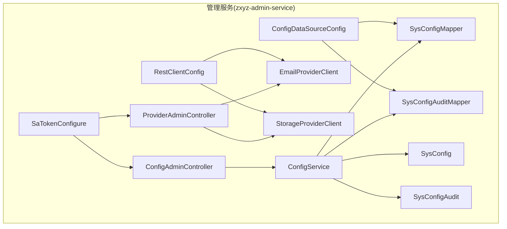
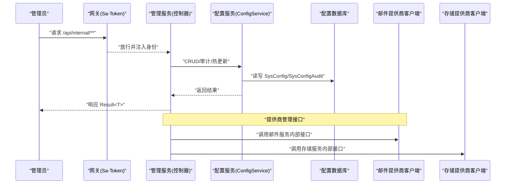
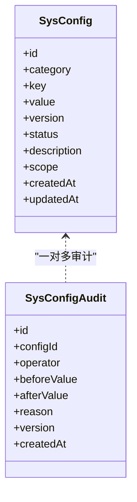
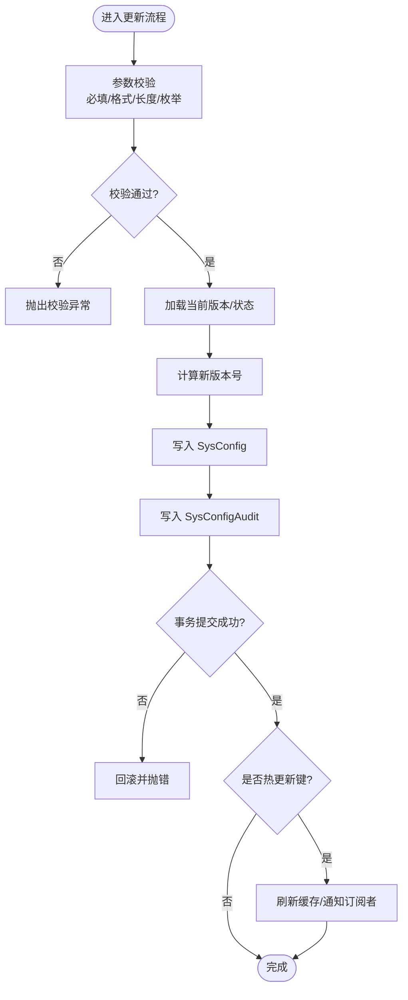
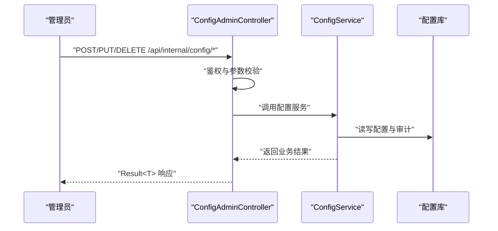
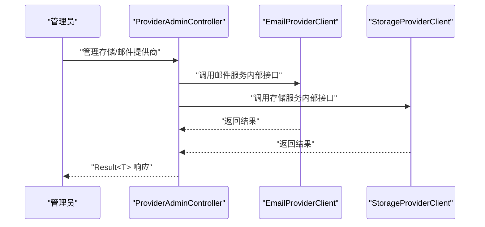
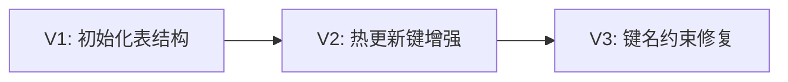
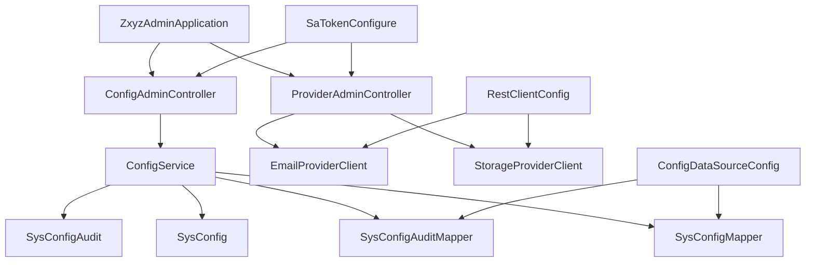

# 管理服务 (zxyz-admin-service)

<cite>
**本文引用的文件**   
- [ZxyzAdminApplication.java](file://ZXYZdatabaseBack/zxyz-admin-service/src/main/java/uno/acloud/admin/ZxyzAdminApplication.java)
- [ConfigAdminController.java](file://ZXYZdatabaseBack/zxyz-admin-service/src/main/java/uno/acloud/admin/controller/ConfigAdminController.java)
- [ProviderAdminController.java](file://ZXYZdatabaseBack/zxyz-admin-service/src/main/java/uno/acloud/admin/controller/ProviderAdminController.java)
- [ConfigService.java](file://ZXYZdatabaseBack/zxyz-admin-service/src/main/java/uno/acloud/admin/service/ConfigService.java)
- [SysConfig.java](file://ZXYZdatabaseBack/zxyz-admin-service/src/main/java/uno/acloud/admin/domain/SysConfig.java)
- [SysConfigAudit.java](file://ZXYZdatabaseBack/zxyz-admin-service/src/main/java/uno/acloud/admin/domain/SysConfigAudit.java)
- [SysConfigMapper.java](file://ZXYZdatabaseBack/zxyz-admin-service/src/main/java/uno/acloud/admin/mapper/SysConfigMapper.java)
- [SysConfigAuditMapper.java](file://ZXYZdatabaseBack/zxyz-admin-service/src/main/java/uno/acloud/admin/mapper/SysConfigAuditMapper.java)
- [EmailProviderClient.java](file://ZXYZdatabaseBack/zxyz-admin-service/src/main/java/uno/acloud/admin/client/EmailProviderClient.java)
- [StorageProviderClient.java](file://ZXYZdatabaseBack/zxyz-admin-service/src/main/java/uno/acloud/admin/client/StorageProviderClient.java)
- [AdminServiceProperties.java](file://ZXYZdatabaseBack/zxyz-admin-service/src/main/java/uno/acloud/admin/config/AdminServiceProperties.java)
- [ConfigDataSourceConfig.java](file://ZXYZdatabaseBack/zxyz-admin-service/src/main/java/uno/acloud/admin/config/ConfigDataSourceConfig.java)
- [RestClientConfig.java](file://ZXYZdatabaseBack/zxyz-admin-service/src/main/java/uno/acloud/admin/config/RestClientConfig.java)
- [SaTokenConfigure.java](file://ZXYZdatabaseBack/zxyz-admin-service/src/main/java/uno/acloud/admin/config/SaTokenConfigure.java)
- [application.yml](file://ZXYZdatabaseBack/zxyz-admin-service/src/main/resources/application.yml)
- [application-dev.yml](file://ZXYZdatabaseBack/zxyz-admin-service/src/main/resources/application-dev.yml)
- [application-prod.yml](file://ZXYZdatabaseBack/zxyz-admin-service/src/main/resources/application-prod.yml)
- [V1__init_config_schema.sql](file://ZXYZdatabaseBack/zxyz-admin-service/src/main/resources/db/migration/V1__init_config_schema.sql)
- [V2__hot_config_keys.sql](file://ZXYZdatabaseBack/zxyz-admin-service/src/main/resources/db/migration/V2__hot_config_keys.sql)
- [V3__fix_config_keys.sql](file://ZXYZdatabaseBack/zxyz-admin-service/src/main/resources/db/migration/V3__fix_config_keys.sql)
- [ConfigServiceTest.java](file://ZXYZdatabaseBack/zxyz-admin-service/src/test/java/uno/acloud/admin/service/ConfigServiceTest.java)
- [ConfigServiceIntegrationTest.java](file://ZXYZdatabaseBack/zxyz-admin-service/src/test/java/uno/acloud/admin/service/ConfigServiceIntegrationTest.java)
- [ConfigAdminControllerTest.java](file://ZXYZdatabaseBack/zxyz-admin-service/src/test/java/uno/acloud/admin/controller/ConfigAdminControllerTest.java)
- [ProviderAdminControllerTest.java](file://ZXYZdatabaseBack/zxyz-admin-service/src/test/java/uno/acloud/admin/controller/ProviderAdminControllerTest.java)
</cite>

## 目录
1. [简介](#简介)
2. [项目结构](#项目结构)
3. [核心组件](#核心组件)
4. [架构总览](#架构总览)
5. [详细组件分析](#详细组件分析)
6. [依赖关系分析](#依赖关系分析)
7. [性能考量](#性能考量)
8. [故障排查指南](#故障排查指南)
9. [结论](#结论)
10. [附录](#附录)

## 简介
本文件为 zxyz-admin-service（管理服务）的权威技术文档，聚焦系统配置管理与存储/邮件提供商管理两大能力：
- 配置管理：提供 ConfigService 的配置项 CRUD、审计记录与热更新机制；实体模型 SysConfig、SysConfigAudit 支持分类、版本控制与变更追踪。
- 提供商管理：通过 ProviderAdminController 暴露存储提供商与邮件提供商的管理接口，统一由内部客户端访问下游服务。
- 安全与校验：基于 Sa-Token 的权限控制、输入校验与错误处理策略。
- 数据库演进：迁移脚本 V1-V3 的版本演进过程与影响面说明。
- 运维实践：管理员操作指南与配置最佳实践。

## 项目结构
zxyz-admin-service 采用传统分层（controller → service → mapper → entity），并包含必要的配置类与迁移脚本。关键目录与职责如下：
- controller：对外暴露的管理端点（配置管理、提供商管理）。
- service：业务编排与事务边界（配置 CRUD、审计落盘、热更新触发）。
- domain：数据模型（SysConfig、SysConfigAudit）。
- mapper：MyBatis 映射层（SysConfigMapper、SysConfigAuditMapper）。
- client：内部服务调用客户端（EmailProviderClient、StorageProviderClient）。
- config：应用配置、数据源、HTTP 客户端、鉴权等。
- resources/db/migration：Flyway 迁移脚本（V1-V3）。
- test：单元测试与集成测试。

图表来源
- [ConfigAdminController.java](file://ZXYZdatabaseBack/zxyz-admin-service/src/main/java/uno/acloud/admin/controller/ConfigAdminController.java)
- [ProviderAdminController.java](file://ZXYZdatabaseBack/zxyz-admin-service/src/main/java/uno/acloud/admin/controller/ProviderAdminController.java)
- [ConfigService.java](file://ZXYZdatabaseBack/zxyz-admin-service/src/main/java/uno/acloud/admin/service/ConfigService.java)
- [SysConfigMapper.java](file://ZXYZdatabaseBack/zxyz-admin-service/src/main/java/uno/acloud/admin/mapper/SysConfigMapper.java)
- [SysConfigAuditMapper.java](file://ZXYZdatabaseBack/zxyz-admin-service/src/main/java/uno/acloud/admin/mapper/SysConfigAuditMapper.java)
- [SysConfig.java](file://ZXYZdatabaseBack/zxyz-admin-service/src/main/java/uno/acloud/admin/domain/SysConfig.java)
- [SysConfigAudit.java](file://ZXYZdatabaseBack/zxyz-admin-service/src/main/java/uno/acloud/admin/domain/SysConfigAudit.java)
- [ConfigDataSourceConfig.java](file://ZXYZdatabaseBack/zxyz-admin-service/src/main/java/uno/acloud/admin/config/ConfigDataSourceConfig.java)
- [RestClientConfig.java](file://ZXYZdatabaseBack/zxyz-admin-service/src/main/java/uno/acloud/admin/config/RestClientConfig.java)
- [SaTokenConfigure.java](file://ZXYZdatabaseBack/zxyz-admin-service/src/main/java/uno/acloud/admin/config/SaTokenConfigure.java)

章节来源
- [ZxyzAdminApplication.java](file://ZXYZdatabaseBack/zxyz-admin-service/src/main/java/uno/acloud/admin/ZxyzAdminApplication.java)
- [application.yml](file://ZXYZdatabaseBack/zxyz-admin-service/src/main/resources/application.yml)

## 核心组件
- ConfigService：封装配置的增删改查、版本化与审计记录、热更新键集合维护与缓存刷新。
- ConfigAdminController：面向管理员的配置项管理接口（创建、更新、删除、查询、批量操作、审计列表）。
- ProviderAdminController：存储与邮件提供商的统一管理入口，委托给对应 Client 进行跨服务调用。
- SysConfig / SysConfigAudit：配置主表与审计表，支撑分类、版本、变更轨迹。
- Mapper 层：SysConfigMapper、SysConfigAuditMapper 负责持久化。
- Client 层：EmailProviderClient、StorageProviderClient 使用统一 HTTP 客户端访问下游服务。
- 配置与安全：AdminServiceProperties、ConfigDataSourceConfig、RestClientConfig、SaTokenConfigure。

章节来源
- [ConfigService.java](file://ZXYZdatabaseBack/zxyz-admin-service/src/main/java/uno/acloud/admin/service/ConfigService.java)
- [ConfigAdminController.java](file://ZXYZdatabaseBack/zxyz-admin-service/src/main/java/uno/acloud/admin/controller/ConfigAdminController.java)
- [ProviderAdminController.java](file://ZXYZdatabaseBack/zxyz-admin-service/src/main/java/uno/acloud/admin/controller/ProviderAdminController.java)
- [SysConfig.java](file://ZXYZdatabaseBack/zxyz-admin-service/src/main/java/uno/acloud/admin/domain/SysConfig.java)
- [SysConfigAudit.java](file://ZXYZdatabaseBack/zxyz-admin-service/src/main/java/uno/acloud/admin/domain/SysConfigAudit.java)
- [SysConfigMapper.java](file://ZXYZdatabaseBack/zxyz-admin-service/src/main/java/uno/acloud/admin/mapper/SysConfigMapper.java)
- [SysConfigAuditMapper.java](file://ZXYZdatabaseBack/zxyz-admin-service/src/main/java/uno/acloud/admin/mapper/SysConfigAuditMapper.java)
- [EmailProviderClient.java](file://ZXYZdatabaseBack/zxyz-admin-service/src/main/java/uno/acloud/admin/client/EmailProviderClient.java)
- [StorageProviderClient.java](file://ZXYZdatabaseBack/zxyz-admin-service/src/main/java/uno/acloud/admin/client/StorageProviderClient.java)
- [AdminServiceProperties.java](file://ZXYZdatabaseBack/zxyz-admin-service/src/main/java/uno/acloud/admin/config/AdminServiceProperties.java)
- [ConfigDataSourceConfig.java](file://ZXYZdatabaseBack/zxyz-admin-service/src/main/java/uno/acloud/admin/config/ConfigDataSourceConfig.java)
- [RestClientConfig.java](file://ZXYZdatabaseBack/zxyz-admin-service/src/main/java/uno/acloud/admin/config/RestClientConfig.java)
- [SaTokenConfigure.java](file://ZXYZdatabaseBack/zxyz-admin-service/src/main/java/uno/acloud/admin/config/SaTokenConfigure.java)

## 架构总览
管理服务作为“控制台”角色，既直接读写本地配置库，又通过内部客户端协调其他服务（邮件、存储）。所有内部端点受网关与 Sa-Token 保护，仅内网可访问。

图表来源
- [ConfigAdminController.java](file://ZXYZdatabaseBack/zxyz-admin-service/src/main/java/uno/acloud/admin/controller/ConfigAdminController.java)
- [ProviderAdminController.java](file://ZXYZdatabaseBack/zxyz-admin-service/src/main/java/uno/acloud/admin/controller/ProviderAdminController.java)
- [ConfigService.java](file://ZXYZdatabaseBack/zxyz-admin-service/src/main/java/uno/acloud/admin/service/ConfigService.java)
- [SysConfigMapper.java](file://ZXYZdatabaseBack/zxyz-admin-service/src/main/java/uno/acloud/admin/mapper/SysConfigMapper.java)
- [SysConfigAuditMapper.java](file://ZXYZdatabaseBack/zxyz-admin-service/src/main/java/uno/acloud/admin/mapper/SysConfigAuditMapper.java)
- [EmailProviderClient.java](file://ZXYZdatabaseBack/zxyz-admin-service/src/main/java/uno/acloud/admin/client/EmailProviderClient.java)
- [StorageProviderClient.java](file://ZXYZdatabaseBack/zxyz-admin-service/src/main/java/uno/acloud/admin/client/StorageProviderClient.java)

## 详细组件分析

### 配置实体与审计模型设计
- SysConfig：承载配置项的核心字段，包括分类、键名、值、版本、状态、描述、生效范围等。用于运行时读取与热更新。
- SysConfigAudit：记录每次变更的前后值、操作人、时间、原因、版本号等，满足合规与回滚需求。

图表来源
- [SysConfig.java](file://ZXYZdatabaseBack/zxyz-admin-service/src/main/java/uno/acloud/admin/domain/SysConfig.java)
- [SysConfigAudit.java](file://ZXYZdatabaseBack/zxyz-admin-service/src/main/java/uno/acloud/admin/domain/SysConfigAudit.java)

章节来源
- [SysConfig.java](file://ZXYZdatabaseBack/zxyz-admin-service/src/main/java/uno/acloud/admin/domain/SysConfig.java)
- [SysConfigAudit.java](file://ZXYZdatabaseBack/zxyz-admin-service/src/main/java/uno/acloud/admin/domain/SysConfigAudit.java)

### 配置服务 ConfigService 实现要点
- CRUD 流程：参数校验 → 版本计算 → 写入主表 → 生成审计记录 → 提交事务。
- 热更新机制：维护“热更新键集合”，在更新成功后按 key 广播或刷新内存缓存，使运行态即时生效。
- 权限与上下文：从安全上下文获取操作者信息，写入审计。
- 异常与回滚：校验失败抛出业务异常，事务自动回滚，保证一致性。

图表来源
- [ConfigService.java](file://ZXYZdatabaseBack/zxyz-admin-service/src/main/java/uno/acloud/admin/service/ConfigService.java)
- [SysConfigMapper.java](file://ZXYZdatabaseBack/zxyz-admin-service/src/main/java/uno/acloud/admin/mapper/SysConfigMapper.java)
- [SysConfigAuditMapper.java](file://ZXYZdatabaseBack/zxyz-admin-service/src/main/java/uno/acloud/admin/mapper/SysConfigAuditMapper.java)

章节来源
- [ConfigService.java](file://ZXYZdatabaseBack/zxyz-admin-service/src/main/java/uno/acloud/admin/service/ConfigService.java)
- [SysConfigMapper.java](file://ZXYZdatabaseBack/zxyz-admin-service/src/main/java/uno/acloud/admin/mapper/SysConfigMapper.java)
- [SysConfigAuditMapper.java](file://ZXYZdatabaseBack/zxyz-admin-service/src/main/java/uno/acloud/admin/mapper/SysConfigAuditMapper.java)

### 配置管理控制器 ConfigAdminController
- 提供配置项的增删改查、批量操作、审计查询等 REST 接口。
- 统一鉴权：通过 SaToken 校验管理员权限，拒绝未授权访问。
- 输入校验：对请求体进行约束校验，确保入库数据合法。
- 输出规范：统一 Result<T> 包装，code=1 表示成功。

图表来源
- [ConfigAdminController.java](file://ZXYZdatabaseBack/zxyz-admin-service/src/main/java/uno/acloud/admin/controller/ConfigAdminController.java)
- [ConfigService.java](file://ZXYZdatabaseBack/zxyz-admin-service/src/main/java/uno/acloud/admin/service/ConfigService.java)

章节来源
- [ConfigAdminController.java](file://ZXYZdatabaseBack/zxyz-admin-service/src/main/java/uno/acloud/admin/controller/ConfigAdminController.java)
- [ConfigService.java](file://ZXYZdatabaseBack/zxyz-admin-service/src/main/java/uno/acloud/admin/service/ConfigService.java)

### 提供商管理控制器 ProviderAdminController
- 统一管理存储与邮件提供商配置，屏蔽下游服务差异。
- 通过 EmailProviderClient、StorageProviderClient 调用各自服务的内部端点。
- 内部端点受网关与 Sa-Token 保护，仅内网可达。

图表来源
- [ProviderAdminController.java](file://ZXYZdatabaseBack/zxyz-admin-service/src/main/java/uno/acloud/admin/controller/ProviderAdminController.java)
- [EmailProviderClient.java](file://ZXYZdatabaseBack/zxyz-admin-service/src/main/java/uno/acloud/admin/client/EmailProviderClient.java)
- [StorageProviderClient.java](file://ZXYZdatabaseBack/zxyz-admin-service/src/main/java/uno/acloud/admin/client/StorageProviderClient.java)

章节来源
- [ProviderAdminController.java](file://ZXYZdatabaseBack/zxyz-admin-service/src/main/java/uno/acloud/admin/controller/ProviderAdminController.java)
- [EmailProviderClient.java](file://ZXYZdatabaseBack/zxyz-admin-service/src/main/java/uno/acloud/admin/client/EmailProviderClient.java)
- [StorageProviderClient.java](file://ZXYZdatabaseBack/zxyz-admin-service/src/main/java/uno/acloud/admin/client/StorageProviderClient.java)

### 数据库迁移脚本 V1-V3 演进
- V1__init_config_schema.sql：初始化配置与审计表结构，定义主键、索引、基础字段。
- V2__hot_config_keys.sql：新增热更新相关字段或索引，支撑热更新键集合与快速定位。
- V3__fix_config_keys.sql：修复键名约束或唯一性规则，避免重复与冲突。

图表来源
- [V1__init_config_schema.sql](file://ZXYZdatabaseBack/zxyz-admin-service/src/main/resources/db/migration/V1__init_config_schema.sql)
- [V2__hot_config_keys.sql](file://ZXYZdatabaseBack/zxyz-admin-service/src/main/resources/db/migration/V2__hot_config_keys.sql)
- [V3__fix_config_keys.sql](file://ZXYZdatabaseBack/zxyz-admin-service/src/main/resources/db/migration/V3__fix_config_keys.sql)

章节来源
- [V1__init_config_schema.sql](file://ZXYZdatabaseBack/zxyz-admin-service/src/main/resources/db/migration/V1__init_config_schema.sql)
- [V2__hot_config_keys.sql](file://ZXYZdatabaseBack/zxyz-admin-service/src/main/resources/db/migration/V2__hot_config_keys.sql)
- [V3__fix_config_keys.sql](file://ZXYZdatabaseBack/zxyz-admin-service/src/main/resources/db/migration/V3__fix_config_keys.sql)

### 配置校验、权限控制与缓存策略
- 配置校验：控制器与服务层双重校验，覆盖必填、格式、长度、枚举、取值范围等。
- 权限控制：SaToken 统一鉴权，管理员角色方可访问内部端点；敏感操作需二次确认。
- 缓存策略：热更新键在变更后主动刷新内存缓存；非热更新键走数据库直读或异步刷新。
- 审计记录：所有写操作均生成审计记录，支持前后值对比与回滚依据。

章节来源
- [ConfigAdminController.java](file://ZXYZdatabaseBack/zxyz-admin-service/src/main/java/uno/acloud/admin/controller/ConfigAdminController.java)
- [ConfigService.java](file://ZXYZdatabaseBack/zxyz-admin-service/src/main/java/uno/acloud/admin/service/ConfigService.java)
- [SaTokenConfigure.java](file://ZXYZdatabaseBack/zxyz-admin-service/src/main/java/uno/acloud/admin/config/SaTokenConfigure.java)

## 依赖关系分析
管理服务依赖 MyBatis 与 Flyway 进行数据访问与迁移，依赖 Sa-Token 进行鉴权，依赖内部 HTTP 客户端访问邮件与存储服务。

图表来源
- [ZxyzAdminApplication.java](file://ZXYZdatabaseBack/zxyz-admin-service/src/main/java/uno/acloud/admin/ZxyzAdminApplication.java)
- [ConfigAdminController.java](file://ZXYZdatabaseBack/zxyz-admin-service/src/main/java/uno/acloud/admin/controller/ConfigAdminController.java)
- [ProviderAdminController.java](file://ZXYZdatabaseBack/zxyz-admin-service/src/main/java/uno/acloud/admin/controller/ProviderAdminController.java)
- [ConfigService.java](file://ZXYZdatabaseBack/zxyz-admin-service/src/main/java/uno/acloud/admin/service/ConfigService.java)
- [SysConfigMapper.java](file://ZXYZdatabaseBack/zxyz-admin-service/src/main/java/uno/acloud/admin/mapper/SysConfigMapper.java)
- [SysConfigAuditMapper.java](file://ZXYZdatabaseBack/zxyz-admin-service/src/main/java/uno/acloud/admin/mapper/SysConfigAuditMapper.java)
- [SysConfig.java](file://ZXYZdatabaseBack/zxyz-admin-service/src/main/java/uno/acloud/admin/domain/SysConfig.java)
- [SysConfigAudit.java](file://ZXYZdatabaseBack/zxyz-admin-service/src/main/java/uno/acloud/admin/domain/SysConfigAudit.java)
- [ConfigDataSourceConfig.java](file://ZXYZdatabaseBack/zxyz-admin-service/src/main/java/uno/acloud/admin/config/ConfigDataSourceConfig.java)
- [RestClientConfig.java](file://ZXYZdatabaseBack/zxyz-admin-service/src/main/java/uno/acloud/admin/config/RestClientConfig.java)
- [SaTokenConfigure.java](file://ZXYZdatabaseBack/zxyz-admin-service/src/main/java/uno/acloud/admin/config/SaTokenConfigure.java)

章节来源
- [ZxyzAdminApplication.java](file://ZXYZdatabaseBack/zxyz-admin-service/src/main/java/uno/acloud/admin/ZxyzAdminApplication.java)
- [application.yml](file://ZXYZdatabaseBack/zxyz-admin-service/src/main/resources/application.yml)

## 性能考量
- 读写分离与连接池：合理配置数据源连接池大小，避免热点键频繁更新导致连接耗尽。
- 热更新键限流：对热更新键的批量更新增加限流与去重，防止抖动。
- 审计表归档：定期归档历史审计记录，降低主表压力。
- 缓存命中率：针对高频读取的配置项启用本地缓存，结合失效策略提升吞吐。
- 内部调用超时与重试：为 EmailProviderClient、StorageProviderClient 设置合理的超时与重试策略，避免级联雪崩。

[本节为通用指导，不直接分析具体文件]

## 故障排查指南
- 鉴权失败：检查 Sa-Token 配置与网关过滤链，确认管理员角色与 Token 有效性。
- 校验失败：查看控制器与服务层的校验规则，核对请求体字段类型与取值范围。
- 热更新无效：确认该 key 是否在热更新集合中，检查缓存刷新逻辑与订阅者是否在线。
- 审计缺失：确认事务提交成功且审计写入路径正常，检查数据库权限与日志级别。
- 提供商调用失败：检查下游服务健康状态、内部端点前缀与 Token 传递是否正确。

章节来源
- [ConfigServiceTest.java](file://ZXYZdatabaseBack/zxyz-admin-service/src/test/java/uno/acloud/admin/service/ConfigServiceTest.java)
- [ConfigServiceIntegrationTest.java](file://ZXYZdatabaseBack/zxyz-admin-service/src/test/java/uno/acloud/admin/service/ConfigServiceIntegrationTest.java)
- [ConfigAdminControllerTest.java](file://ZXYZdatabaseBack/zxyz-admin-service/src/test/java/uno/acloud/admin/controller/ConfigAdminControllerTest.java)
- [ProviderAdminControllerTest.java](file://ZXYZdatabaseBack/zxyz-admin-service/src/test/java/uno/acloud/admin/controller/ProviderAdminControllerTest.java)

## 结论
管理服务以清晰的层次结构与严格的校验、审计、权限控制，提供了稳定可靠的系统配置与提供商管理能力。通过热更新机制与完善的迁移脚本，系统在保持向后兼容的同时具备灵活的运行时调整能力。建议在生产环境严格遵循最小权限原则与变更审批流程，配合监控与告警保障稳定性。

[本节为总结性内容，不直接分析具体文件]

## 附录

### 管理员操作指南
- 登录与权限：使用管理员账号登录，确保拥有配置管理与提供商管理的角色权限。
- 配置项管理：
  - 新建/编辑：填写分类、键名、值、描述与生效范围，选择是否热更新。
  - 删除：谨慎删除已引用配置，必要时先下线依赖。
  - 审计：查看变更记录，支持前后值对比与回滚决策。
- 提供商管理：
  - 存储提供商：配置连接信息、认证凭据与默认桶/容器。
  - 邮件提供商：配置 SMTP/IMAP 服务器、端口、加密方式与发件人。
- 发布与回滚：
  - 发布前进行预检与灰度验证。
  - 出现问题时根据审计记录快速回滚到上一版本。

[本节为操作指导，不直接分析具体文件]

### 配置最佳实践
- 命名规范：按“模块.子域.键名”层级组织，避免全局污染。
- 分类清晰：将不同领域配置分门别类，便于检索与权限隔离。
- 版本控制：重要配置变更必须留痕，禁止直接修改线上值。
- 热更新审慎：仅对无副作用的键启用热更新，避免运行时不一致。
- 审计完备：所有变更必须附带原因与责任人，便于追溯。

[本节为最佳实践，不直接分析具体文件]