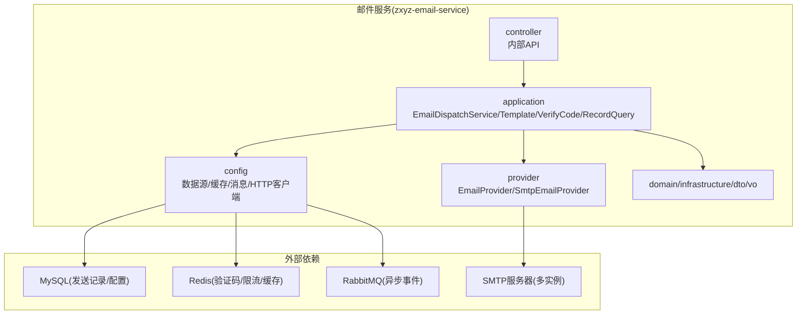
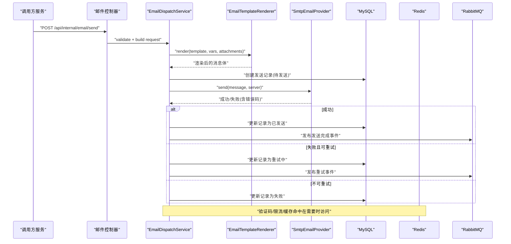
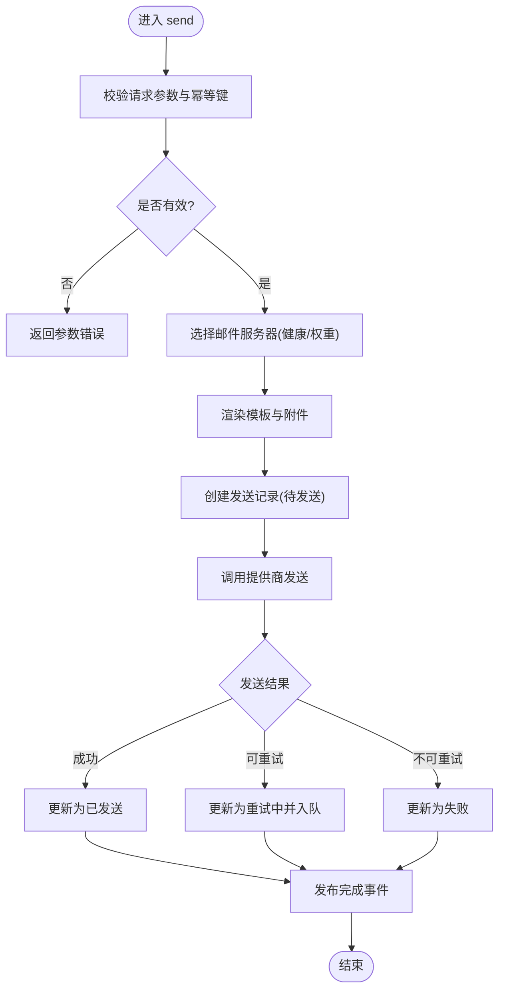
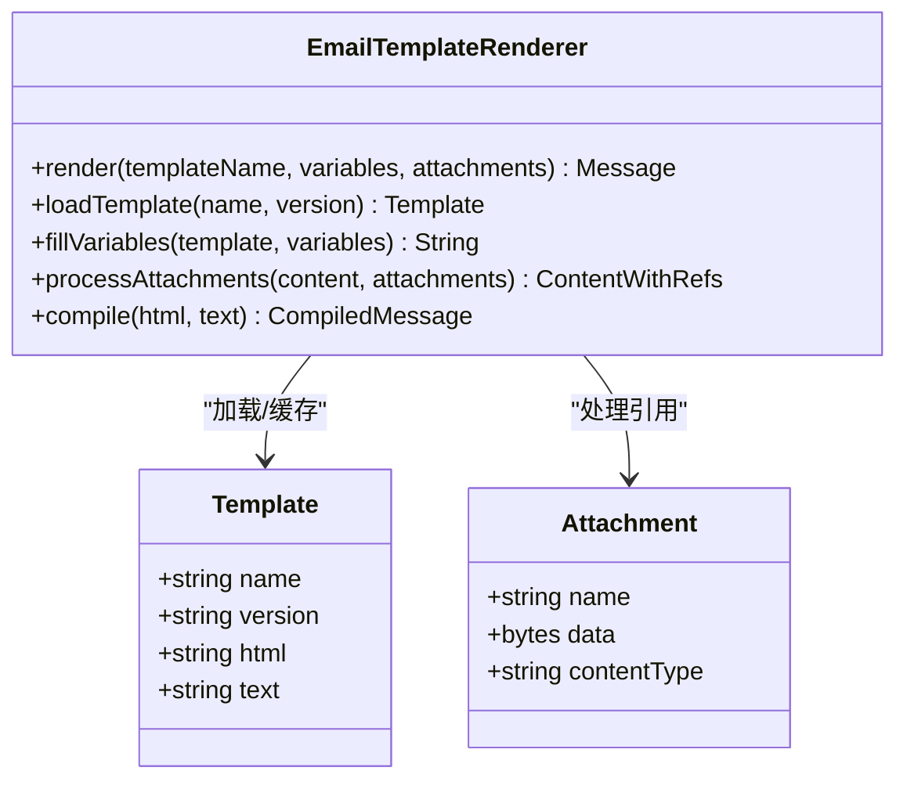
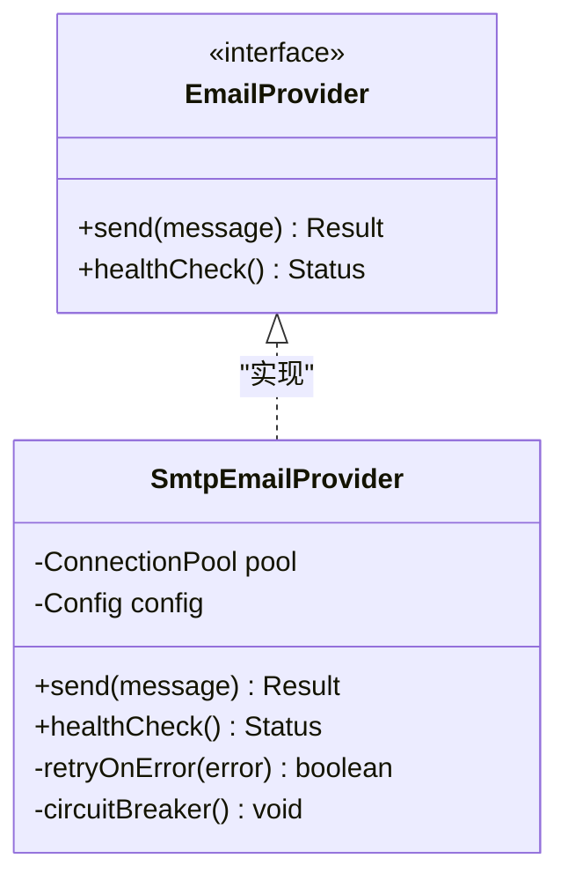
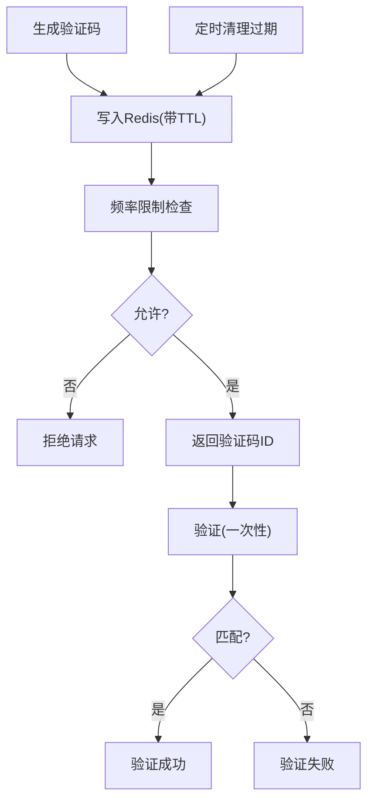
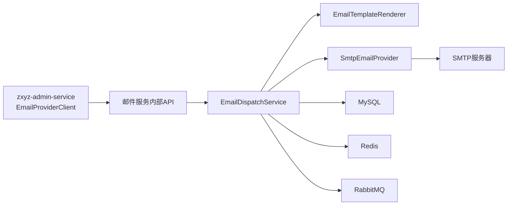

# 邮件服务 (zxyz-email-service)

<cite>
**本文引用的文件**   
- [ZxyzEmailApplication.java](file://ZXYZdatabaseBack/zxyz-email-service/src/main/java/uno/acloud/email/ZxyzEmailApplication.java)
- [application.yml](file://ZXYZdatabaseBack/zxyz-email-service/src/main/resources/application.yml)
- [application-dev.yml](file://ZXYZdatabaseBack/zxyz-email-service/src/main/resources/application-dev.yml)
- [application-prod.yml](file://ZXYZdatabaseBack/zxyz-email-service/src/main/resources/application-prod.yml)
- [EmailDispatchService.java](file://ZXYZdatabaseBack/zxyz-email-service/src/main/java/uno/acloud/email/application/EmailDispatchService.java)
- [EmailTemplateRenderer.java](file://ZXYZdatabaseBack/zxyz-email-service/src/main/java/uno/acloud/email/application/EmailTemplateRenderer.java)
- [VerifyCodeService.java](file://ZXYZdatabaseBack/zxyz-email-service/src/main/java/uno/acloud/email/application/VerifyCodeService.java)
- [EmailRecordQueryService.java](file://ZXYZdatabaseBack/zxyz-email-service/src/main/java/uno/acloud/email/application/EmailRecordQueryService.java)
- [EmailServerConfigService.java](file://ZXYZdatabaseBack/zxyz-email-service/src/main/java/uno/acloud/email/application/EmailServerConfigService.java)
- [EmailSendingAvailabilityService.java](file://ZXYZdatabaseBack/zxyz-email-service/src/main/java/uno/acloud/email/application/EmailSendingAvailabilityService.java)
- [EmailProvider.java](file://ZXYZdatabaseBack/zxyz-email-service/src/main/java/uno/acloud/email/provider/EmailProvider.java)
- [SmtpEmailProvider.java](file://ZXYZdatabaseBack/zxyz-email-service/src/main/java/uno/acloud/email/provider/SmtpEmailProvider.java)
- [EmailProviderClient.java](file://ZXYZdatabaseBack/zxyz-admin-service/src/main/java/uno/acloud/admin/client/EmailProviderClient.java)
- [schema_email.sql](file://ZXYZdatabaseBack/ZXYZdatabaseBack/sql/schema_email.sql)
- [V1__init_email_schema.sql](file://ZXYZdatabaseBack/zxyz-email-service/src/main/resources/db/migration/V1__init_email_schema.sql)
- [V2__add_email_record_indexes.sql](file://ZXYZdatabaseBack/zxyz-email-service/src/main/resources/db/migration/V2__add_email_record_indexes.sql)
- [EmailDispatchServiceTest.java](file://ZXYZdatabaseBack/zxyz-email-service/src/test/java/uno/acloud/email/application/EmailDispatchServiceTest.java)
- [EmailTemplateRendererTest.java](file://ZXYZdatabaseBack/zxyz-email-service/src/test/java/uno/acloud/email/application/EmailTemplateRendererTest.java)
- [VerifyCodeServiceTest.java](file://ZXYZdatabaseBack/zxyz-email-service/src/test/java/uno/acloud/email/application/VerifyCodeServiceTest.java)
- [EmailRecordQueryServiceTest.java](file://ZXYZdatabaseBack/zxyz-email-service/src/test/java/uno/acloud/email/application/EmailRecordQueryServiceTest.java)
- [EmailServerConfigServiceTest.java](file://ZXYZdatabaseBack/zxyz-email-service/src/test/java/uno/acloud/email/application/EmailServerConfigServiceTest.java)
- [EmailSendingAvailabilityServiceTest.java](file://ZXYZdatabaseBack/zxyz-email-service/src/test/java/uno/acloud/email/application/EmailSendingAvailabilityServiceTest.java)
</cite>

## 目录
1. [简介](#简介)
2. [项目结构](#项目结构)
3. [核心组件](#核心组件)
4. [架构总览](#架构总览)
5. [详细组件分析](#详细组件分析)
6. [依赖关系分析](#依赖关系分析)
7. [性能考虑](#性能考虑)
8. [故障排查指南](#故障排查指南)
9. [结论](#结论)
10. [附录](#附录)

## 简介
本文件为 ZXYZ 邮件服务的权威技术文档，围绕基于 DDD 分层（interfaces → application → domain → infrastructure）的邮件发送系统展开。重点覆盖：
- EmailDispatchService 邮件分发服务：编排模板渲染、收件人去重与批量拆分、重试与幂等记录。
- EmailTemplate 模板引擎：支持多模板、变量替换、附件占位与富文本渲染。
- SMTP 邮件提供商实现：多服务器配置、连接池管理、失败重试与熔断降级。
- VerifyCodeService 验证码服务：生成策略、过期清理、频率限制与防刷。
- 邮件模板渲染、批量发送、发送记录查询、安全策略、附件处理、错误处理机制。
- 配置指南与故障排查方法，帮助快速定位问题并优化稳定性。

## 项目结构
zxyz-email-service 采用 DDD 分层组织代码，核心目录如下：
- application：应用服务层，承载用例编排（分发、模板、验证码、记录查询、可用性检查）。
- provider：基础设施适配层，封装不同邮件提供商（如 SMTP）。
- config：配置与外部依赖装配（数据源、缓存、消息队列、HTTP 客户端等）。
- controller：对外暴露的内部端点（受 Gateway 鉴权保护）。
- domain/infrastructure/dto/vo：领域模型、基础设施实现、数据传输对象与视图对象。
- resources：环境配置文件与数据库迁移脚本。

图表来源
- [ZxyzEmailApplication.java](file://ZXYZdatabaseBack/zxyz-email-service/src/main/java/uno/acloud/email/ZxyzEmailApplication.java)
- [application.yml](file://ZXYZdatabaseBack/zxyz-email-service/src/main/resources/application.yml)

章节来源
- [ZxyzEmailApplication.java](file://ZXYZdatabaseBack/zxyz-email-service/src/main/java/uno/acloud/email/ZxyzEmailApplication.java)
- [application.yml](file://ZXYZdatabaseBack/zxyz-email-service/src/main/resources/application.yml)

## 核心组件
- EmailDispatchService：邮件分发编排器，负责接收发送请求、选择服务器、渲染模板、构建消息、落盘记录、触发发送与重试。
- EmailTemplateRenderer：模板引擎，加载模板、填充变量、处理附件占位、输出最终内容。
- SmtpEmailProvider：SMTP 提供商实现，维护连接池、认证、TLS/SSL、重试与错误分类。
- VerifyCodeService：验证码服务，生成随机码、写入缓存、设置过期时间、频率限制与清理任务。
- EmailRecordQueryService：发送记录查询服务，支持按条件分页、状态筛选、结果导出。
- EmailServerConfigService：邮件服务器配置服务，动态切换主备、健康检查、权重与负载均衡。
- EmailSendingAvailabilityService：发送可用性检查，探测各服务器连通性与配额。

章节来源
- [EmailDispatchService.java](file://ZXYZdatabaseBack/zxyz-email-service/src/main/java/uno/acloud/email/application/EmailDispatchService.java)
- [EmailTemplateRenderer.java](file://ZXYZdatabaseBack/zxyz-email-service/src/main/java/uno/acloud/email/application/EmailTemplateRenderer.java)
- [SmtpEmailProvider.java](file://ZXYZdatabaseBack/zxyz-email-service/src/main/java/uno/acloud/email/provider/SmtpEmailProvider.java)
- [VerifyCodeService.java](file://ZXYZdatabaseBack/zxyz-email-service/src/main/java/uno/acloud/email/application/VerifyCodeService.java)
- [EmailRecordQueryService.java](file://ZXYZdatabaseBack/zxyz-email-service/src/main/java/uno/acloud/email/application/EmailRecordQueryService.java)
- [EmailServerConfigService.java](file://ZXYZdatabaseBack/zxyz-email-service/src/main/java/uno/acloud/email/application/EmailServerConfigService.java)
- [EmailSendingAvailabilityService.java](file://ZXYZdatabaseBack/zxyz-email-service/src/main/java/uno/acloud/email/application/EmailSendingAvailabilityService.java)

## 架构总览
邮件服务遵循 DDD 分层，应用层编排用例，基础设施层对接 SMTP、数据库、缓存与消息队列。控制器仅暴露内部端点，由网关统一鉴权。

图表来源
- [EmailDispatchService.java](file://ZXYZdatabaseBack/zxyz-email-service/src/main/java/uno/acloud/email/application/EmailDispatchService.java)
- [SmtpEmailProvider.java](file://ZXYZdatabaseBack/zxyz-email-service/src/main/java/uno/acloud/email/provider/SmtpEmailProvider.java)
- [application.yml](file://ZXYZdatabaseBack/zxyz-email-service/src/main/resources/application.yml)

## 详细组件分析

### EmailDispatchService（邮件分发服务）
职责与流程：
- 参数校验与幂等键生成，避免重复发送。
- 选择邮件服务器（主备切换、健康检查、权重轮询）。
- 调用模板引擎渲染内容与附件。
- 持久化发送记录（状态机：待发送→发送中→已发送/失败/重试中）。
- 触发发送，捕获异常分类（网络、认证、配额、模板错误），决定重试或终止。
- 通过消息队列异步通知下游（审计、统计、告警）。

关键设计要点：
- 批量发送：按收件人分组，控制并发度与速率限制。
- 重试策略：指数退避、最大重试次数、死信队列。
- 错误分类：区分可重试与不可重试，便于监控与告警。
- 事务边界：记录落库与发送解耦，保证最终一致性。

图表来源
- [EmailDispatchService.java](file://ZXYZdatabaseBack/zxyz-email-service/src/main/java/uno/acloud/email/application/EmailDispatchService.java)

章节来源
- [EmailDispatchService.java](file://ZXYZdatabaseBack/zxyz-email-service/src/main/java/uno/acloud/email/application/EmailDispatchService.java)
- [EmailDispatchServiceTest.java](file://ZXYZdatabaseBack/zxyz-email-service/src/test/java/uno/acloud/email/application/EmailDispatchServiceTest.java)

### EmailTemplateRenderer（模板引擎）
能力说明：
- 模板加载：按模板名称与版本加载，支持热更新。
- 变量替换：支持嵌套对象、列表、条件分支与国际化。
- 附件处理：识别附件占位符，生成内联资源或外链。
- 输出格式：HTML 与纯文本双轨输出，自动回退。

性能与安全：
- 模板编译缓存，减少解析开销。
- 输入过滤与白名单，防止注入攻击。
- 大附件分块处理，避免内存溢出。

图表来源
- [EmailTemplateRenderer.java](file://ZXYZdatabaseBack/zxyz-email-service/src/main/java/uno/acloud/email/application/EmailTemplateRenderer.java)

章节来源
- [EmailTemplateRenderer.java](file://ZXYZdatabaseBack/zxyz-email-service/src/main/java/uno/acloud/email/application/EmailTemplateRenderer.java)
- [EmailTemplateRendererTest.java](file://ZXYZdatabaseBack/zxyz-email-service/src/test/java/uno/acloud/email/application/EmailTemplateRendererTest.java)

### SmtpEmailProvider（SMTP 邮件提供商）
功能特性：
- 多服务器配置：支持多个 SMTP 实例，主备与权重配置。
- 连接池管理：连接复用、超时、空闲回收、最大连接数。
- 认证与加密：用户名密码、OAuth2（可选）、TLS/SSL。
- 重试与熔断：失败重试、熔断阈值、快速失败。
- 错误分类：网络异常、认证失败、配额超限、域名拒收等。

图表来源
- [EmailProvider.java](file://ZXYZdatabaseBack/zxyz-email-service/src/main/java/uno/acloud/email/provider/EmailProvider.java)
- [SmtpEmailProvider.java](file://ZXYZdatabaseBack/zxyz-email-service/src/main/java/uno/acloud/email/provider/SmtpEmailProvider.java)

章节来源
- [SmtpEmailProvider.java](file://ZXYZdatabaseBack/zxyz-email-service/src/main/java/uno/acloud/email/provider/SmtpEmailProvider.java)
- [EmailProvider.java](file://ZXYZdatabaseBack/zxyz-email-service/src/main/java/uno/acloud/email/provider/EmailProvider.java)

### VerifyCodeService（验证码服务）
能力说明：
- 生成策略：随机长度、字符集、哈希存储（防泄露）。
- 过期清理：TTL 过期后自动清理，定时任务扫描。
- 频率限制：同一 IP/邮箱短时间内的请求上限。
- 验证流程：比对、一次性使用、失效标记。

图表来源
- [VerifyCodeService.java](file://ZXYZdatabaseBack/zxyz-email-service/src/main/java/uno/acloud/email/application/VerifyCodeService.java)

章节来源
- [VerifyCodeService.java](file://ZXYZdatabaseBack/zxyz-email-service/src/main/java/uno/acloud/email/application/VerifyCodeService.java)
- [VerifyCodeServiceTest.java](file://ZXYZdatabaseBack/zxyz-email-service/src/test/java/uno/acloud/email/application/VerifyCodeServiceTest.java)

### EmailRecordQueryService（发送记录查询服务）
能力说明：
- 条件查询：按收件人、主题、状态、时间范围筛选。
- 分页与排序：支持多字段排序与游标分页。
- 导出与审计：CSV/JSON 导出，审计日志关联。
- 性能优化：索引建议、慢查询监控、缓存热点查询。

章节来源
- [EmailRecordQueryService.java](file://ZXYZdatabaseBack/zxyz-email-service/src/main/java/uno/acloud/email/application/EmailRecordQueryService.java)
- [EmailRecordQueryServiceTest.java](file://ZXYZdatabaseBack/zxyz-email-service/src/test/java/uno/acloud/email/application/EmailRecordQueryServiceTest.java)

### EmailServerConfigService（邮件服务器配置服务）
能力说明：
- 动态配置：主备切换、权重调整、健康探测。
- 故障转移：自动降级到备用服务器。
- 监控指标：成功率、延迟、连接池利用率。

章节来源
- [EmailServerConfigService.java](file://ZXYZdatabaseBack/zxyz-email-service/src/main/java/uno/acloud/email/application/EmailServerConfigService.java)
- [EmailServerConfigServiceTest.java](file://ZXYZdatabaseBack/zxyz-email-service/src/test/java/uno/acloud/email/application/EmailServerConfigServiceTest.java)

### EmailSendingAvailabilityService（发送可用性检查）
能力说明：
- 健康检查：定期探测各 SMTP 服务器连通性。
- 配额检测：检查剩余配额与速率限制。
- 告警上报：异常阈值触发告警。

章节来源
- [EmailSendingAvailabilityService.java](file://ZXYZdatabaseBack/zxyz-email-service/src/main/java/uno/acloud/email/application/EmailSendingAvailabilityService.java)
- [EmailSendingAvailabilityServiceTest.java](file://ZXYZdatabaseBack/zxyz-email-service/src/test/java/uno/acloud/email/application/EmailSendingAvailabilityServiceTest.java)

## 依赖关系分析
- 应用层依赖基础设施层（SMTP、数据库、缓存、消息队列）。
- 控制器仅依赖应用层，保持窄接口。
- 管理员服务通过 EmailProviderClient 调用邮件服务内部端点进行配置管理。

图表来源
- [EmailProviderClient.java](file://ZXYZdatabaseBack/zxyz-admin-service/src/main/java/uno/acloud/admin/client/EmailProviderClient.java)
- [EmailDispatchService.java](file://ZXYZdatabaseBack/zxyz-email-service/src/main/java/uno/acloud/email/application/EmailDispatchService.java)

章节来源
- [EmailProviderClient.java](file://ZXYZdatabaseBack/zxyz-admin-service/src/main/java/uno/acloud/admin/client/EmailProviderClient.java)
- [EmailDispatchService.java](file://ZXYZdatabaseBack/zxyz-email-service/src/main/java/uno/acloud/email/application/EmailDispatchService.java)

## 性能考虑
- 模板渲染缓存：编译后的模板缓存于内存，减少解析开销。
- 连接池优化：合理设置最大连接数、空闲超时与获取超时。
- 批量发送：按批次大小与并发度调优，避免打爆下游。
- 重试策略：指数退避与抖动，避免雪崩。
- 数据库索引：对常用查询字段建立索引，提升查询性能。
- 缓存命中率：验证码与限流使用 Redis，降低数据库压力。

## 故障排查指南
常见问题与定位步骤：
- 发送失败：
  - 检查 SMTP 服务器连通性与认证配置。
  - 查看发送记录状态与错误分类。
  - 确认重试次数与死信队列消费情况。
- 模板渲染异常：
  - 校验模板变量完整性与类型。
  - 检查附件路径与权限。
- 验证码无效：
  - 确认 TTL 与频率限制配置。
  - 检查 Redis 连接与键空间。
- 性能瓶颈：
  - 监控连接池利用率与慢查询。
  - 分析批量发送批次大小与并发度。

章节来源
- [EmailDispatchService.java](file://ZXYZdatabaseBack/zxyz-email-service/src/main/java/uno/acloud/email/application/EmailDispatchService.java)
- [SmtpEmailProvider.java](file://ZXYZdatabaseBack/zxyz-email-service/src/main/java/uno/acloud/email/provider/SmtpEmailProvider.java)
- [VerifyCodeService.java](file://ZXYZdatabaseBack/zxyz-email-service/src/main/java/uno/acloud/email/application/VerifyCodeService.java)

## 结论
ZXYZ 邮件服务以 DDD 分层为核心，结合 SMTP 多服务器、连接池、重试与熔断，提供高可用的邮件发送能力。模板引擎支持灵活渲染，验证码服务保障安全与防刷，发送记录查询满足审计需求。通过合理的配置与监控，可实现稳定高效的邮件服务。

## 附录

### 数据库设计（发送记录）
- 表名：email_send_record
- 关键字段：id、message_id、recipient、subject、status、error_code、retry_count、created_at、updated_at
- 索引：recipient、status、created_at

章节来源
- [schema_email.sql](file://ZXYZdatabaseBack/ZXYZdatabaseBack/sql/schema_email.sql)
- [V1__init_email_schema.sql](file://ZXYZdatabaseBack/zxyz-email-service/src/main/resources/db/migration/V1__init_email_schema.sql)
- [V2__add_email_record_indexes.sql](file://ZXYZdatabaseBack/zxyz-email-service/src/main/resources/db/migration/V2__add_email_record_indexes.sql)

### 配置示例（application.yml）
- 邮件服务器：多实例配置（host、port、username、password、tls、weight）
- 连接池：max_connections、idle_timeout、connect_timeout
- 重试：max_retries、backoff_strategy、dead_letter_queue
- 模板：template_dir、cache_enabled、version_strategy
- 验证码：ttl_seconds、max_attempts_per_minute、redis_key_prefix

章节来源
- [application.yml](file://ZXYZdatabaseBack/zxyz-email-service/src/main/resources/application.yml)
- [application-dev.yml](file://ZXYZdatabaseBack/zxyz-email-service/src/main/resources/application-dev.yml)
- [application-prod.yml](file://ZXYZdatabaseBack/zxyz-email-service/src/main/resources/application-prod.yml)