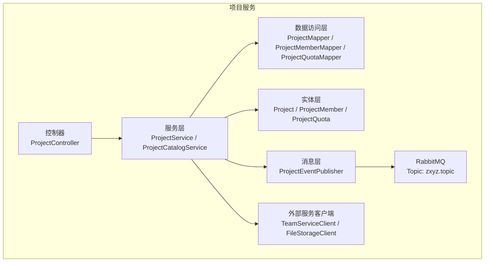
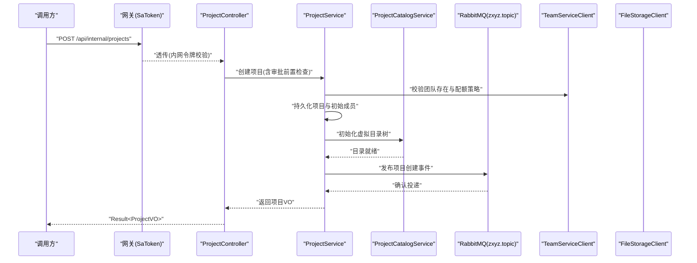
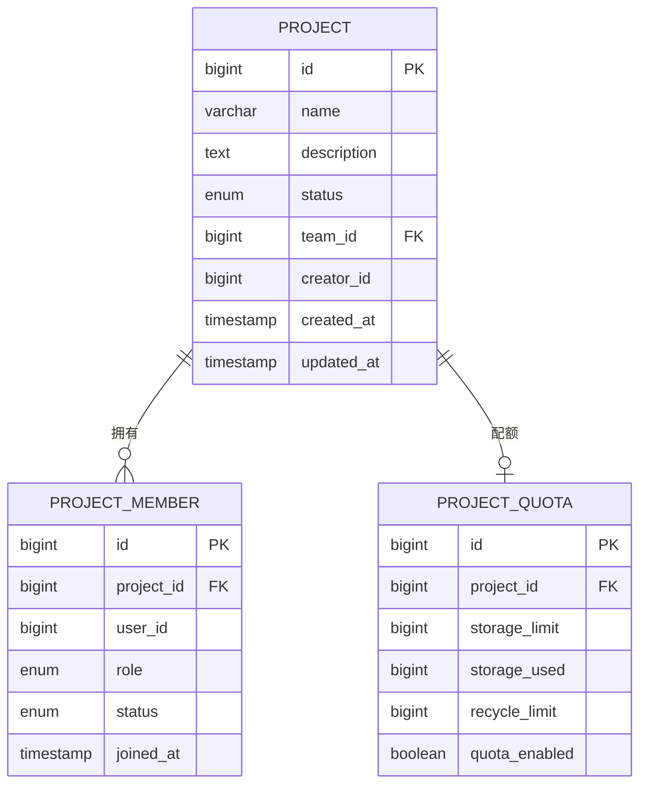
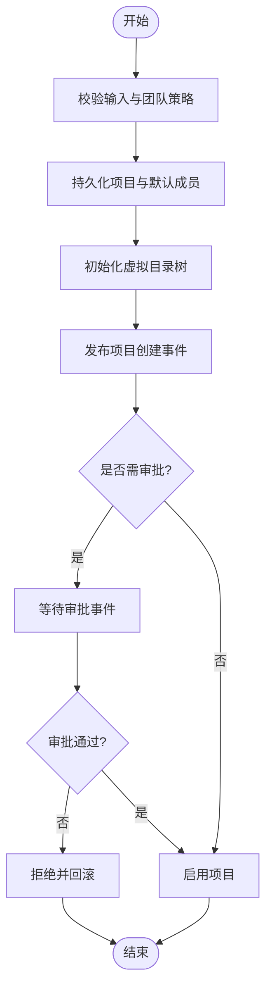
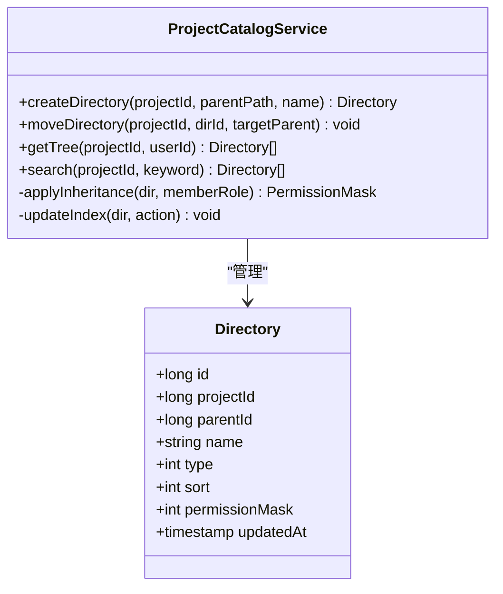
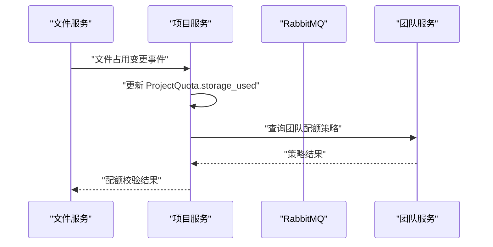
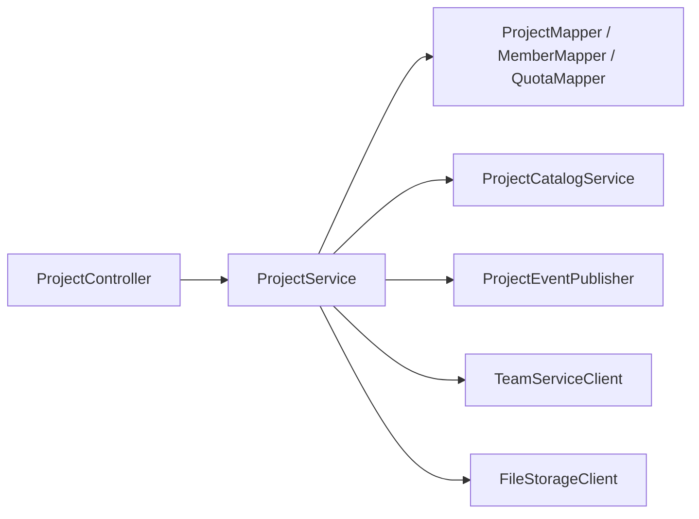

# 项目服务 (zxyz-project-service)

<cite>
**本文引用的文件**
- [pom.xml](file://ZXYZdatabaseBack/zxyz-project-service/pom.xml)
- [application.yml](file://ZXYZdatabaseBack/zxyz-project-service/src/main/resources/application.yml)
- [application-dev.yml](file://ZXYZdatabaseBack/zxyz-project-service/src/main/resources/application-dev.yml)
- [application-prod.yml](file://ZXYZdatabaseBack/zxyz-project-service/src/main/resources/application-prod.yml)
- [ZxyzProjectServiceApplication.java](file://ZXYZdatabaseBack/zxyz-project-service/src/main/java/uno/acloud/project/ZxyzProjectServiceApplication.java)
- [entity/Project.java](file://ZXYZdatabaseBack/zxyz-project-service/src/main/java/uno/acloud/project/entity/Project.java)
- [entity/ProjectMember.java](file://ZXYZdatabaseBack/zxyz-project-service/src/main/java/uno/acloud/project/entity/ProjectMember.java)
- [entity/ProjectQuota.java](file://ZXYZdatabaseBack/zxyz-project-service/src/main/java/uno/acloud/project/entity/ProjectQuota.java)
- [mapper/ProjectMapper.java](file://ZXYZdatabaseBack/zxyz-project-service/src/main/java/uno/acloud/project/mapper/ProjectMapper.java)
- [mapper/ProjectMemberMapper.java](file://ZXYZdatabaseBack/zxyz-project-service/src/main/java/uno/acloud/project/mapper/ProjectMemberMapper.java)
- [mapper/ProjectQuotaMapper.java](file://ZXYZdatabaseBack/zxyz-project-service/src/main/java/uno/acloud/project/mapper/ProjectQuotaMapper.java)
- [service/ProjectService.java](file://ZXYZdatabaseBack/zxyz-project-service/src/main/java/uno/acloud/project/service/ProjectService.java)
- [service/impl/ProjectServiceImpl.java](file://ZXYZdatabaseBack/zxyz-project-service/src/main/java/uno/acloud/project/service/impl/ProjectServiceImpl.java)
- [service/ProjectCatalogService.java](file://ZXYZdatabaseBack/zxyz-project-service/src/main/java/uno/acloud/project/service/ProjectCatalogService.java)
- [controller/ProjectController.java](file://ZXYZdatabaseBack/zxyz-project-service/src/main/java/uno/acloud/project/controller/ProjectController.java)
- [mq/ProjectEventPublisher.java](file://ZXYZdatabaseBack/zxyz-project-service/src/main/java/uno/acloud/project/mq/ProjectEventPublisher.java)
- [mq/ProjectEventListener.java](file://ZXYZdatabaseBack/zxyz-project-service/src/main/java/uno/acloud/project/mq/ProjectEventListener.java)
- [config/RabbitMqConfig.java](file://ZXYZdatabaseBack/zxyz-project-service/src/main/java/uno/acloud/project/config/RabbitMqConfig.java)
- [dto/request/CreateProjectRequest.java](file://ZXYZdatabaseBack/zxyz-project-service/src/main/java/uno/acloud/project/dto/request/CreateProjectRequest.java)
- [vo/response/ProjectVO.java](file://ZXYZdatabaseBack/zxyz-project-service/src/main/java/uno/acloud/project/vo/response/ProjectVO.java)
- [common/AuditAspect.java](file://ZXYZdatabaseBack/zxyz-project-service/src/main/java/uno/acloud/project/aop/AuditAspect.java)
- [common/PermissionAspect.java](file://ZXYZdatabaseBack/zxyz-project-service/src/main/java/uno/acloud/project/aop/PermissionAspect.java)
- [schema_project.sql](file://ZXYZdatabaseBack/sql/schema_project.sql)
</cite>

## 目录
1. [简介](#简介)
2. [项目结构](#项目结构)
3. [核心组件](#核心组件)
4. [架构总览](#架构总览)
5. [详细组件分析](#详细组件分析)
6. [依赖关系分析](#依赖关系分析)
7. [性能考虑](#性能考虑)
8. [故障排查指南](#故障排查指南)
9. [结论](#结论)
10. [附录](#附录)

## 简介
本文件为 ZXYZ 项目服务的权威技术文档，聚焦项目管理核心能力与实现细节。内容涵盖：
- 实体模型设计：Project、ProjectMember、ProjectQuota 等
- 项目生命周期管理：创建审批、成员管理、配额控制
- 虚拟文件夹系统：项目空间隔离与资源管理
- 项目目录服务 ProjectCatalogService：目录结构、权限继承、搜索索引
- 与团队服务、文件服务的集成方式
- 异步消息处理机制（RabbitMQ）
- 协作最佳实践与扩展开发指南

本项目采用微服务架构，内部服务间通过 ServiceClient + X-Internal-Service-Token 鉴权，异步通信使用 RabbitMQ Topic Exchange zxyz.topic。项目服务遵循传统分层（controller → service/impl → mapper → entity），并通过 AOP 统一审计与权限校验。

## 项目结构
zxyz-project-service 模块采用标准 Spring Boot 分层组织：
- controller：对外暴露 REST 接口
- service/impl：业务编排与事务边界
- mapper：MyBatis 数据访问层
- entity：数据库实体映射
- dto/vo：请求/响应投影对象
- mq：事件发布与监听
- config：RabbitMQ、安全等配置
- aop：审计与权限切面

图表来源
- [ZxyzProjectServiceApplication.java](file://ZXYZdatabaseBack/zxyz-project-service/src/main/java/uno/acloud/project/ZxyzProjectServiceApplication.java)
- [ProjectController.java](file://ZXYZdatabaseBack/zxyz-project-service/src/main/java/uno/acloud/project/controller/ProjectController.java)
- [ProjectService.java](file://ZXYZdatabaseBack/zxyz-project-service/src/main/java/uno/acloud/project/service/ProjectService.java)
- [ProjectCatalogService.java](file://ZXYZdatabaseBack/zxyz-project-service/src/main/java/uno/acloud/project/service/ProjectCatalogService.java)
- [ProjectMapper.java](file://ZXYZdatabaseBack/zxyz-project-service/src/main/java/uno/acloud/project/mapper/ProjectMapper.java)
- [ProjectMemberMapper.java](file://ZXYZdatabaseBack/zxyz-project-service/src/main/java/uno/acloud/project/mapper/ProjectMemberMapper.java)
- [ProjectQuotaMapper.java](file://ZXYZdatabaseBack/zxyz-project-service/src/main/java/uno/acloud/project/mapper/ProjectQuotaMapper.java)
- [ProjectEventPublisher.java](file://ZXYZdatabaseBack/zxyz-project-service/src/main/java/uno/acloud/project/mq/ProjectEventPublisher.java)
- [RabbitMqConfig.java](file://ZXYZdatabaseBack/zxyz-project-service/src/main/java/uno/acloud/project/config/RabbitMqConfig.java)

章节来源
- [pom.xml](file://ZXYZdatabaseBack/zxyz-project-service/pom.xml)
- [application.yml](file://ZXYZdatabaseBack/zxyz-project-service/src/main/resources/application.yml)
- [application-dev.yml](file://ZXYZdatabaseBack/zxyz-project-service/src/main/resources/application-dev.yml)
- [application-prod.yml](file://ZXYZdatabaseBack/zxyz-project-service/src/main/resources/application-prod.yml)

## 核心组件
- 实体模型
  - Project：项目主数据，包含名称、描述、状态、归属团队、创建人等元信息
  - ProjectMember：项目成员关系，包含角色、权限范围、加入时间、状态
  - ProjectQuota：项目配额，包含存储上限、已用量、回收站容量、配额策略开关
- 服务层
  - ProjectService：项目 CRUD、成员管理、配额控制、生命周期流转
  - ProjectCatalogService：虚拟文件夹目录树构建、权限继承、搜索索引维护
- 数据访问层
  - ProjectMapper、ProjectMemberMapper、ProjectQuotaMapper：对应表的增删改查
- 消息层
  - ProjectEventPublisher：发布项目变更事件（创建、成员变更、配额调整）
  - ProjectEventListener：消费跨服务事件（如团队变更、用户删除）
- 配置与切面
  - RabbitMqConfig：队列、交换机、路由键配置
  - AuditAspect：操作审计日志记录
  - PermissionAspect：基于角色的访问控制校验

章节来源
- [Project.java](file://ZXYZdatabaseBack/zxyz-project-service/src/main/java/uno/acloud/project/entity/Project.java)
- [ProjectMember.java](file://ZXYZdatabaseBack/zxyz-project-service/src/main/java/uno/acloud/project/entity/ProjectMember.java)
- [ProjectQuota.java](file://ZXYZdatabaseBack/zxyz-project-service/src/main/java/uno/acloud/project/entity/ProjectQuota.java)
- [ProjectService.java](file://ZXYZdatabaseBack/zxyz-project-service/src/main/java/uno/acloud/project/service/ProjectService.java)
- [ProjectCatalogService.java](file://ZXYZdatabaseBack/zxyz-project-service/src/main/java/uno/acloud/project/service/ProjectCatalogService.java)
- [ProjectMapper.java](file://ZXYZdatabaseBack/zxyz-project-service/src/main/java/uno/acloud/project/mapper/ProjectMapper.java)
- [ProjectMemberMapper.java](file://ZXYZdatabaseBack/zxyz-project-service/src/main/java/uno/acloud/project/mapper/ProjectMemberMapper.java)
- [ProjectQuotaMapper.java](file://ZXYZdatabaseBack/zxyz-project-service/src/main/java/uno/acloud/project/mapper/ProjectQuotaMapper.java)
- [ProjectEventPublisher.java](file://ZXYZdatabaseBack/zxyz-project-service/src/main/java/uno/acloud/project/mq/ProjectEventPublisher.java)
- [ProjectEventListener.java](file://ZXYZdatabaseBack/zxyz-project-service/src/main/java/uno/acloud/project/mq/ProjectEventListener.java)
- [RabbitMqConfig.java](file://ZXYZdatabaseBack/zxyz-project-service/src/main/java/uno/acloud/project/config/RabbitMqConfig.java)
- [AuditAspect.java](file://ZXYZdatabaseBack/zxyz-project-service/src/main/java/uno/acloud/project/aop/AuditAspect.java)
- [PermissionAspect.java](file://ZXYZdatabaseBack/zxyz-project-service/src/main/java/uno/acloud/project/aop/PermissionAspect.java)

## 架构总览
项目服务作为“项目空间”的权威源，负责项目生命周期、成员与配额、虚拟目录与权限继承，并与团队、文件、审计等服务交互。

图表来源
- [ProjectController.java](file://ZXYZdatabaseBack/zxyz-project-service/src/main/java/uno/acloud/project/controller/ProjectController.java)
- [ProjectService.java](file://ZXYZdatabaseBack/zxyz-project-service/src/main/java/uno/acloud/project/service/ProjectService.java)
- [ProjectCatalogService.java](file://ZXYZdatabaseBack/zxyz-project-service/src/main/java/uno/acloud/project/service/ProjectCatalogService.java)
- [ProjectEventPublisher.java](file://ZXYZdatabaseBack/zxyz-project-service/src/main/java/uno/acloud/project/mq/ProjectEventPublisher.java)
- [RabbitMqConfig.java](file://ZXYZdatabaseBack/zxyz-project-service/src/main/java/uno/acloud/project/config/RabbitMqConfig.java)

## 详细组件分析

### 实体模型设计
- Project
  - 关键字段：项目ID、名称、描述、状态（草稿/审批中/启用/停用）、团队ID、创建人、时间戳
  - 约束：唯一性（团队内项目名称）、状态机约束（仅允许合法流转）
- ProjectMember
  - 关键字段：成员ID、项目ID、用户ID、角色（Owner/Admin/Editor/Viewer）、状态、加入时间
  - 约束：唯一性（项目+用户）、角色最小权限集
- ProjectQuota
  - 关键字段：配额ID、项目ID、存储上限、已用量、回收站容量、策略开关
  - 约束：非负数、已用量不超过上限

图表来源
- [Project.java](file://ZXYZdatabaseBack/zxyz-project-service/src/main/java/uno/acloud/project/entity/Project.java)
- [ProjectMember.java](file://ZXYZdatabaseBack/zxyz-project-service/src/main/java/uno/acloud/project/entity/ProjectMember.java)
- [ProjectQuota.java](file://ZXYZdatabaseBack/zxyz-project-service/src/main/java/uno/acloud/project/entity/ProjectQuota.java)
- [schema_project.sql](file://ZXYZdatabaseBack/sql/schema_project.sql)

章节来源
- [Project.java](file://ZXYZdatabaseBack/zxyz-project-service/src/main/java/uno/acloud/project/entity/Project.java)
- [ProjectMember.java](file://ZXYZdatabaseBack/zxyz-project-service/src/main/java/uno/acloud/project/entity/ProjectMember.java)
- [ProjectQuota.java](file://ZXYZdatabaseBack/zxyz-project-service/src/main/java/uno/acloud/project/entity/ProjectQuota.java)
- [schema_project.sql](file://ZXYZdatabaseBack/sql/schema_project.sql)

### 项目生命周期管理
- 创建审批流程
  - 入口：ProjectController 接收创建请求
  - 校验：团队有效性、命名规范、配额策略
  - 持久化：写入 Project、默认成员（创建者为 Owner）
  - 目录初始化：ProjectCatalogService 生成根目录与模板子目录
  - 事件发布：ProjectEventPublisher 发送“项目创建完成”事件
  - 审批回调：若开启审批，等待外部审批事件后切换状态至“启用”
- 成员管理
  - 添加/移除成员：校验角色权限、更新 ProjectMember
  - 角色继承：继承团队角色策略（由团队服务提供）
  - 权限计算：结合项目角色与目录权限位
- 配额控制
  - 限额检查：在文件上传/移动前校验剩余空间
  - 用量统计：异步汇总文件占用，更新 storage_used
  - 回收站：独立配额限制，防止滥用

图表来源
- [ProjectController.java](file://ZXYZdatabaseBack/zxyz-project-service/src/main/java/uno/acloud/project/controller/ProjectController.java)
- [ProjectService.java](file://ZXYZdatabaseBack/zxyz-project-service/src/main/java/uno/acloud/project/service/ProjectService.java)
- [ProjectCatalogService.java](file://ZXYZdatabaseBack/zxyz-project-service/src/main/java/uno/acloud/project/service/ProjectCatalogService.java)
- [ProjectEventPublisher.java](file://ZXYZdatabaseBack/zxyz-project-service/src/main/java/uno/acloud/project/mq/ProjectEventPublisher.java)

章节来源
- [ProjectService.java](file://ZXYZdatabaseBack/zxyz-project-service/src/main/java/uno/acloud/project/service/ProjectService.java)
- [ProjectServiceImpl.java](file://ZXYZdatabaseBack/zxyz-project-service/src/main/java/uno/acloud/project/service/impl/ProjectServiceImpl.java)
- [ProjectController.java](file://ZXYZdatabaseBack/zxyz-project-service/src/main/java/uno/acloud/project/controller/ProjectController.java)

### 虚拟文件夹系统设计
- 设计目标
  - 以“虚拟目录”抽象项目空间，逻辑隔离物理文件存储
  - 支持层级结构、软删除、共享路径映射
- 目录结构管理
  - 根目录固定：/project/{projectId}/...
  - 子目录动态创建：支持批量创建、重命名、移动
  - 目录元数据：名称、类型、父节点、排序、权限掩码
- 权限继承
  - 目录级权限位与项目成员角色组合计算
  - 覆盖规则：子目录可覆盖父级权限，但不可降级 Owner/Admin 权限
- 搜索索引
  - 目录名与文件名的倒排索引
  - 增量更新：目录变更触发索引重建或合并

图表来源
- [ProjectCatalogService.java](file://ZXYZdatabaseBack/zxyz-project-service/src/main/java/uno/acloud/project/service/ProjectCatalogService.java)

章节来源
- [ProjectCatalogService.java](file://ZXYZdatabaseBack/zxyz-project-service/src/main/java/uno/acloud/project/service/ProjectCatalogService.java)

### 项目目录服务 ProjectCatalogService 实现要点
- 目录结构管理
  - 使用有向无环图表示父子关系，避免循环引用
  - 批量操作采用事务保证一致性
- 权限继承
  - 自顶向下计算有效权限，缓存最近一次计算结果
  - 冲突解决：显式设置优先于继承
- 搜索索引
  - 基于内存索引或外部搜索引擎（可扩展）
  - 异步刷新：事件驱动，避免阻塞主流程

章节来源
- [ProjectCatalogService.java](file://ZXYZdatabaseBack/zxyz-project-service/src/main/java/uno/acloud/project/service/ProjectCatalogService.java)

### 与团队服务、文件服务的集成
- 团队服务集成
  - 校验团队存在与配额策略：TeamServiceClient
  - 同步成员角色：订阅团队角色变更事件
- 文件服务集成
  - 文件上传/下载：FileStorageClient
  - 配额联动：文件占用变化时更新 ProjectQuota.storage_used
  - 回收站：文件删除进入回收站，受独立配额限制

图表来源
- [ProjectEventPublisher.java](file://ZXYZdatabaseBack/zxyz-project-service/src/main/java/uno/acloud/project/mq/ProjectEventPublisher.java)
- [ProjectEventListener.java](file://ZXYZdatabaseBack/zxyz-project-service/src/main/java/uno/acloud/project/mq/ProjectEventListener.java)

章节来源
- [ProjectService.java](file://ZXYZdatabaseBack/zxyz-project-service/src/main/java/uno/acloud/project/service/ProjectService.java)
- [ProjectEventPublisher.java](file://ZXYZdatabaseBack/zxyz-project-service/src/main/java/uno/acloud/project/mq/ProjectEventPublisher.java)
- [ProjectEventListener.java](file://ZXYZdatabaseBack/zxyz-project-service/src/main/java/uno/acloud/project/mq/ProjectEventListener.java)

### 异步消息处理机制
- 事件模型
  - 项目创建/更新/删除
  - 成员加入/离开/角色变更
  - 配额调整/超限告警
- 消息路由
  - Topic Exchange: zxyz.topic
  - 路由键：project.{action}.{entityId}
- 可靠性
  - 生产者确认与重试
  - 消费者幂等处理（去重键）

章节来源
- [RabbitMqConfig.java](file://ZXYZdatabaseBack/zxyz-project-service/src/main/java/uno/acloud/project/config/RabbitMqConfig.java)
- [ProjectEventPublisher.java](file://ZXYZdatabaseBack/zxyz-project-service/src/main/java/uno/acloud/project/mq/ProjectEventPublisher.java)
- [ProjectEventListener.java](file://ZXYZdatabaseBack/zxyz-project-service/src/main/java/uno/acloud/project/mq/ProjectEventListener.java)

## 依赖关系分析
- 内部依赖
  - MyBatis：数据访问
  - RabbitMQ：异步事件
  - SaToken：认证鉴权（网关层）
- 外部依赖
  - TeamServiceClient：团队信息、角色策略
  - FileStorageClient：文件上传/下载、配额联动
- 耦合度
  - 低耦合：通过窄端点与投影 VO 解耦
  - 高内聚：项目域逻辑集中在 service 层

图表来源
- [ProjectController.java](file://ZXYZdatabaseBack/zxyz-project-service/src/main/java/uno/acloud/project/controller/ProjectController.java)
- [ProjectService.java](file://ZXYZdatabaseBack/zxyz-project-service/src/main/java/uno/acloud/project/service/ProjectService.java)
- [ProjectCatalogService.java](file://ZXYZdatabaseBack/zxyz-project-service/src/main/java/uno/acloud/project/service/ProjectCatalogService.java)
- [ProjectEventPublisher.java](file://ZXYZdatabaseBack/zxyz-project-service/src/main/java/uno/acloud/project/mq/ProjectEventPublisher.java)

章节来源
- [ProjectController.java](file://ZXYZdatabaseBack/zxyz-project-service/src/main/java/uno/acloud/project/controller/ProjectController.java)
- [ProjectService.java](file://ZXYZdatabaseBack/zxyz-project-service/src/main/java/uno/acloud/project/service/ProjectService.java)
- [ProjectCatalogService.java](file://ZXYZdatabaseBack/zxyz-project-service/src/main/java/uno/acloud/project/service/ProjectCatalogService.java)
- [ProjectEventPublisher.java](file://ZXYZdatabaseBack/zxyz-project-service/src/main/java/uno/acloud/project/mq/ProjectEventPublisher.java)

## 性能考虑
- 目录树查询
  - 预加载与分页：避免一次性加载全量
  - 缓存热点目录：减少重复计算
- 配额统计
  - 异步汇总：文件事件驱动，避免同步聚合
  - 增量更新：只更新变动字段
- 搜索索引
  - 增量索引：变更即更新，避免全量重建
  - 并发控制：写锁保护索引一致性

[本节为通用指导，不直接分析具体文件]

## 故障排查指南
- 常见问题
  - 项目创建失败：检查团队策略、命名冲突、权限不足
  - 成员无法访问：核对角色继承、目录权限覆盖
  - 配额超限：确认 storage_used 与 storage_limit 一致性
- 诊断步骤
  - 查看审计日志：AuditAspect 记录关键操作
  - 检查消息队列：确认事件投递与消费状态
  - 验证外部服务：Team/File 客户端调用是否成功

章节来源
- [AuditAspect.java](file://ZXYZdatabaseBack/zxyz-project-service/src/main/java/uno/acloud/project/aop/AuditAspect.java)
- [ProjectEventPublisher.java](file://ZXYZdatabaseBack/zxyz-project-service/src/main/java/uno/acloud/project/mq/ProjectEventPublisher.java)
- [ProjectEventListener.java](file://ZXYZdatabaseBack/zxyz-project-service/src/main/java/uno/acloud/project/mq/ProjectEventListener.java)

## 结论
项目服务通过清晰的实体模型、严谨的生命周期管理、灵活的虚拟目录系统与可靠的异步消息机制，构建了稳定高效的项目协作基础。建议在实际使用中遵循权限最小化原则、合理设置配额策略，并利用审计与监控保障系统稳定性。

[本节为总结性内容，不直接分析具体文件]

## 附录
- 协作最佳实践
  - 明确角色职责：Owner/Admin 负责治理，Editor/Viewer 专注协作
  - 定期清理回收站：释放配额，避免资源浪费
  - 使用模板目录：标准化项目结构，提升协作效率
- 扩展开发指南
  - 新增事件：定义事件模型，完善发布与监听逻辑
  - 权限扩展：在 PermissionAspect 中注入新规则
  - 目录功能：在 ProjectCatalogService 中扩展方法，保持幂等与事务一致

[本节为通用指导，不直接分析具体文件]