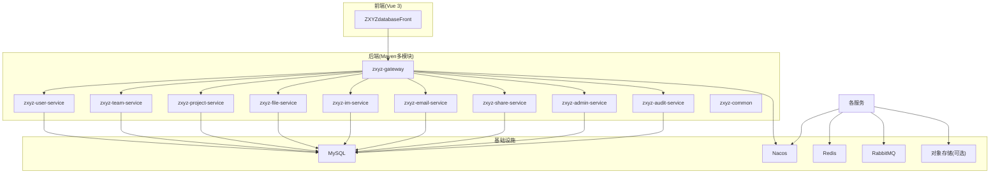
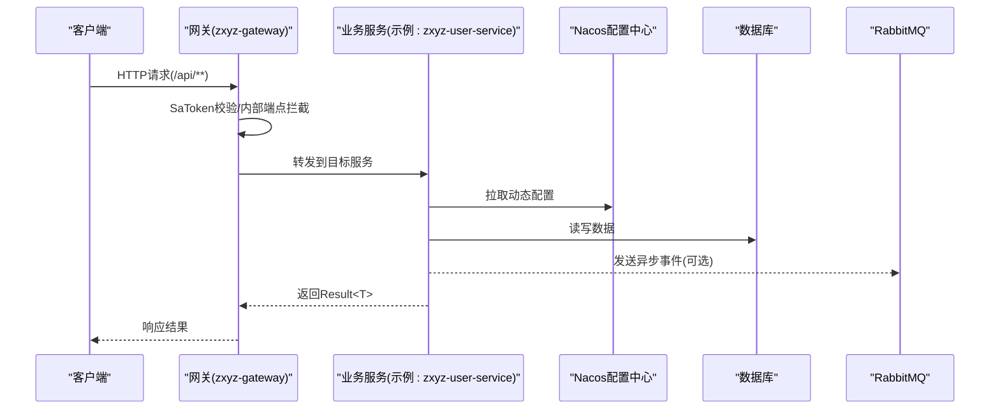
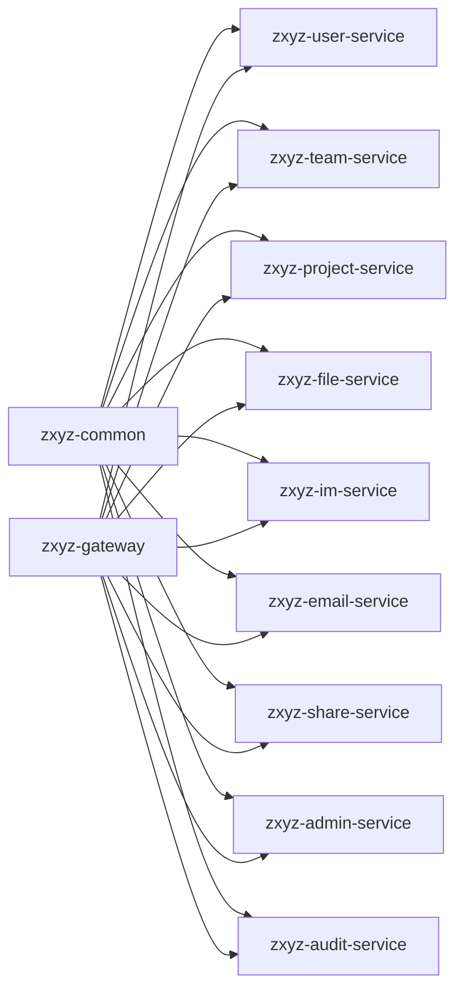

# 开发指南

<cite>
**本文引用的文件**   
- [ZXYZdatabaseBack/pom.xml](file://ZXYZdatabaseBack/pom.xml)
- [ZXYZdatabaseBack/README.md](file://ZXYZdatabaseBack/README.md)
- [ZXYZdatabaseBack/Dockerfile](file://ZXYZdatabaseBack/Dockerfile)
- [ZXYZdatabaseBack/Dockerfile.base](file://ZXYZdatabaseBack/Dockerfile.base)
- [ZXYZdatabaseBack/zxyz-admin-service/src/main/resources/application.yml](file://ZXYZdatabaseBack/zxyz-admin-service/src/main/resources/application.yml)
- [ZXYZdatabaseBack/zxyz-audit-service/src/main/resources/application.yml](file://ZXYZdatabaseBack/zxyz-audit-service/src/main/resources/application.yml)
- [ZXYZdatabaseBack/zxyz-email-service/src/main/resources/application.yml](file://ZXYZdatabaseBack/zxyz-email-service/src/main/resources/application.yml)
- [ZXYZdatabaseBack/zxyz-file-service/src/main/resources/application.yml](file://ZXYZdatabaseBack/zxyz-file-service/src/main/resources/application.yml)
- [ZXYZdatabaseBack/zxyz-gateway/src/main/resources/application.yml](file://ZXYZdatabaseBack/zxyz-gateway/src/main/resources/application.yml)
- [ZXYZdatabaseBack/zxyz-im-service/src/main/resources/application.yml](file://ZXYZdatabaseBack/zxyz-im-service/src/main/resources/application.yml)
- [ZXYZdatabaseBack/zxyz-project-service/src/main/resources/application.yml](file://ZXYZdatabaseBack/zxyz-project-service/src/main/resources/application.yml)
- [ZXYZdatabaseBack/zxyz-share-service/src/main/resources/application.yml](file://ZXYZdatabaseBack/zxyz-share-service/src/main/resources/application.yml)
- [ZXYZdatabaseBack/zxyz-team-service/src/main/resources/application.yml](file://ZXYZdatabaseBack/zxyz-team-service/src/main/resources/application.yml)
- [ZXYZdatabaseBack/zxyz-user-service/src/main/resources/application.yml](file://ZXYZdatabaseBack/zxyz-user-service/src/main/resources/application.yml)
- [ZXYZdatabaseBack/zxyz-common/src/main/resources/application-common.yml](file://ZXYZdatabaseBack/zxyz-common/src/main/resources/application-common.yml)
- [ZXYZdatabaseBack/sql/schema_user.sql](file://ZXYZdatabaseBack/sql/schema_user.sql)
- [ZXYZdatabaseBack/sql/schema_team.sql](file://ZXYZdatabaseBack/sql/schema_team.sql)
- [ZXYZdatabaseBack/sql/schema_project.sql](file://ZXYZdatabaseBack/sql/schema_project.sql)
- [ZXYZdatabaseBack/sql/schema_file.sql](file://ZXYZdatabaseBack/sql/schema_file.sql)
- [ZXYZdatabaseBack/sql/schema_im.sql](file://ZXYZdatabaseBack/sql/schema_im.sql)
- [ZXYZdatabaseBack/sql/schema_email.sql](file://ZXYZdatabaseBack/sql/schema_email.sql)
- [ZXYZdatabaseBack/sql/schema_share.sql](file://ZXYZdatabaseBack/sql/schema_share.sql)
- [ZXYZdatabaseBack/sql/schema_audit.sql](file://ZXYZdatabaseBack/sql/schema_audit.sql)
- [docker-compose.yml](file://docker-compose.yml)
- [docker-compose.dev.yml](file://docker-compose.dev.yml)
- [.github/workflows/ci-cd.yml](file://.github/workflows/ci-cd.yml)
- [nacos-config/zxyz-dynamic.yml](file://nacos-config/zxyz-dynamic.yml)
- [nacos-config/zxyz-static.yml](file://nacos-config/zxyz-static.yml)
- [scripts/dev-up.sh](file://scripts/dev-up.sh)
- [scripts/validate-env.sh](file://scripts/validate-env.sh)
- [ZXYZdatabaseFront/package.json](file://ZXYZdatabaseFront/package.json)
- [ZXYZdatabaseFront/eslint.config.mjs](file://ZXYZdatabaseFront/eslint.config.mjs)
- [ZXYZdatabaseFront/.prettierrc](file://ZXYZdatabaseFront/.prettierrc)
- [ZXYZdatabaseFront/commitlint.config.js](file://ZXYZdatabaseFront/commitlint.config.js)
- [ZXYZdatabaseFront/vite.config.js](file://ZXYZdatabaseFront/vite.config.js)
- [ZXYZdatabaseFront/src/api/auth.js](file://ZXYZdatabaseFront/src/api/auth.js)
- [ZXYZdatabaseFront/src/utils/request.js](file://ZXYZdatabaseFront/src/utils/request.js)
- [ZXYZdatabaseFront/src/store/currentUser.js](file://ZXYZdatabaseFront/src/store/currentUser.js)
- [ZXYZdatabaseFront/src/router/guards/permission.js](file://ZXYZdatabaseFront/src/router/guards/permission.js)
- [deploy/nginx/default.conf](file://deploy/nginx/default.conf)
- [docs/architecture.md](file://docs/architecture.md)
</cite>

## 目录
1. [简介](#简介)
2. [项目结构](#项目结构)
3. [核心组件](#核心组件)
4. [架构总览](#架构总览)
5. [详细组件分析](#详细组件分析)
6. [依赖分析](#依赖分析)
7. [性能考虑](#性能考虑)
8. [故障排查指南](#故障排查指南)
9. [结论](#结论)
10. [附录](#附录)

## 简介
本指南面向ZXYZ项目的开发者，覆盖本地开发环境搭建、编码规范、项目结构组织、测试策略、调试技巧与新功能开发流程。项目采用微服务架构（Maven多模块 + Vue前端），通过Nacos进行配置与服务治理，使用RabbitMQ进行异步通信，Gateway统一鉴权与路由，Docker Compose编排本地与CI环境。

## 项目结构
后端为Maven多模块工程，包含网关、公共库与各业务服务；前端为Vue 3单页应用，基于Vite构建，使用Element Plus与Pinia。根目录提供Docker Compose编排、脚本工具与CI流水线。

图表来源
- [ZXYZdatabaseBack/pom.xml](file://ZXYZdatabaseBack/pom.xml)
- [docker-compose.yml](file://docker-compose.yml)
- [docker-compose.dev.yml](file://docker-compose.dev.yml)

章节来源
- [ZXYZdatabaseBack/pom.xml](file://ZXYZdatabaseBack/pom.xml)
- [ZXYZdatabaseBack/README.md](file://ZXYZdatabaseBack/README.md)
- [docker-compose.yml](file://docker-compose.yml)
- [docker-compose.dev.yml](file://docker-compose.dev.yml)

## 核心组件
- 网关(zxyz-gateway)：统一入口、SaToken鉴权、内部端点拦截、路由转发。
- 公共库(zxyz-common)：通用DTO、异常、工具类、审计事件、权限模型等。
- 用户/团队/项目/文件/IM/邮件/分享/审计/管理服务等：按领域划分，遵循传统分层或DDD风格。
- 前端(ZXYXdatabaseFront)：Vue 3 + Vite + Element Plus + Pinia，API封装、状态管理、路由守卫、上传与归档工具。

章节来源
- [ZXYZdatabaseBack/zxyz-gateway/src/main/resources/application.yml](file://ZXYZdatabaseBack/zxyz-gateway/src/main/resources/application.yml)
- [ZXYZdatabaseBack/zxyz-common/src/main/resources/application-common.yml](file://ZXYZdatabaseBack/zxyz-common/src/main/resources/application-common.yml)
- [ZXYZdatabaseFront/package.json](file://ZXYZdatabaseFront/package.json)
- [ZXYZdatabaseFront/vite.config.js](file://ZXYZdatabaseFront/vite.config.js)

## 架构总览
系统采用“网关+微服务”的架构模式，服务间同步调用通过ServiceClient并携带内部令牌，异步消息通过RabbitMQ Topic Exchange。配置中心Nacos统一管理动态配置，敏感信息通过Jasypt加密。

图表来源
- [ZXYZdatabaseBack/zxyz-gateway/src/main/resources/application.yml](file://ZXYZdatabaseBack/zxyz-gateway/src/main/resources/application.yml)
- [ZXYZdatabaseBack/zxyz-user-service/src/main/resources/application.yml](file://ZXYZdatabaseBack/zxyz-user-service/src/main/resources/application.yml)
- [nacos-config/zxyz-dynamic.yml](file://nacos-config/zxyz-dynamic.yml)

章节来源
- [docs/architecture.md](file://docs/architecture.md)
- [ZXYZdatabaseBack/zxyz-gateway/src/main/resources/application.yml](file://ZXYZdatabaseBack/zxyz-gateway/src/main/resources/application.yml)

## 详细组件分析

### 后端开发环境与启动
- 环境要求
  - JDK 17+、Maven 3.8+、Node.js 18+、Docker与Docker Compose
  - MySQL、Redis、RabbitMQ、Nacos（可通过Compose一键拉起）
- 数据库初始化
  - 执行sql目录下的schema脚本，或使用Flyway迁移（各服务db/migration）
- 中间件启动
  - 使用docker-compose.dev.yml启动开发环境
  - 或通过scripts/dev-up.sh快速拉起
- 服务启动
  - 在IDE中运行各服务的Application主类
  - 或通过Maven命令打包后以java -jar运行
- 配置说明
  - application-dev.yml用于本地开发，application-prod.yml用于生产
  - 动态配置由Nacos管理，敏感字段使用Jasypt加密

章节来源
- [ZXYZdatabaseBack/zxyz-user-service/src/main/resources/application-dev.yml](file://ZXYZdatabaseBack/zxyz-user-service/src/main/resources/application-dev.yml)
- [ZXYZdatabaseBack/zxyz-user-service/src/main/resources/application-prod.yml](file://ZXYZdatabaseBack/zxyz-user-service/src/main/resources/application-prod.yml)
- [ZXYZdatabaseBack/zxyz-user-service/src/main/resources/application.yml](file://ZXYZdatabaseBack/zxyz-user-service/src/main/resources/application.yml)
- [docker-compose.dev.yml](file://docker-compose.dev.yml)
- [scripts/dev-up.sh](file://scripts/dev-up.sh)
- [scripts/validate-env.sh](file://scripts/validate-env.sh)

### 前端开发环境与启动
- 安装依赖
  - 进入ZXYZdatabaseFront目录，执行npm install
- 启动开发服务器
  - npm run dev（Vite）
- 构建与部署
  - npm run build生成静态资源，由nginx容器提供服务
- 代码质量
  - ESLint + Prettier + Commitlint（Husky钩子）

章节来源
- [ZXYZdatabaseFront/package.json](file://ZXYZdatabaseFront/package.json)
- [ZXYZdatabaseFront/eslint.config.mjs](file://ZXYZdatabaseFront/eslint.config.mjs)
- [ZXYZdatabaseFront/.prettierrc](file://ZXYZdatabaseFront/.prettierrc)
- [ZXYZdatabaseFront/commitlint.config.js](file://ZXYZdatabaseFront/commitlint.config.js)
- [ZXYZdatabaseFront/vite.config.js](file://ZXYZdatabaseFront/vite.config.js)

### 编码规范
- Java编码规范(SonarQube规则)
  - 启用SonarQube扫描，遵循阿里巴巴Java开发手册与项目自定义规则
  - 禁止魔法值、强制空指针检查、统一异常处理、日志规范
- Vue 3编码规范(Prettier + ESLint)
  - 使用ESLint与Prettier统一格式，Component命名与组合式函数命名约定
  - API封装与错误处理统一，避免分散的错误分支
- Git提交规范(Husky + Commitlint)
  - 使用Conventional Commits，限制提交类型与范围，自动校验

章节来源
- [ZXYZdatabaseFront/eslint.config.mjs](file://ZXYZdatabaseFront/eslint.config.mjs)
- [ZXYZdatabaseFront/.prettierrc](file://ZXYZdatabaseFront/.prettierrc)
- [ZXYZdatabaseFront/commitlint.config.js](file://ZXYZdatabaseFront/commitlint.config.js)

### 项目结构组织
- Maven多模块
  - 根pom.xml聚合所有模块，common为共享依赖
  - 每个服务独立包名与资源目录，便于隔离与独立部署
- 包命名约定
  - 统一uno.acloud.*，按服务划分子包
  - controller/service/mapper/entity/dto/vo等分层清晰
- 文件组织原则
  - 配置按环境拆分(dev/prod)，公共配置抽取至common
  - 数据库脚本与迁移分离，版本化演进

章节来源
- [ZXYZdatabaseBack/pom.xml](file://ZXYZdatabaseBack/pom.xml)
- [ZXYZdatabaseBack/zxyz-common/src/main/resources/application-common.yml](file://ZXYZdatabaseBack/zxyz-common/src/main/resources/application-common.yml)

### 测试策略
- 单元测试(JUnit + Mockito)
  - 对Service层与工具类进行Mock测试，覆盖边界条件
- 集成测试
  - 使用@SpringBootTest与内存数据库或Testcontainers
  - Mapper与Controller集成测试验证数据流
- E2E测试
  - 前端Cypress/Vitest端到端用例，模拟用户操作与API交互

章节来源
- [ZXYZdatabaseBack/zxyz-user-service/src/test/java/uno/acloud/user/service/impl/UserServiceImplTest.java](file://ZXYZdatabaseBack/zxyz-user-service/src/test/java/uno/acloud/user/service/impl/UserServiceImplTest.java)
- [ZXYZdatabaseBack/zxyz-user-service/src/test/java/uno/acloud/user/mapper/UserMapperIntegrationTest.java](file://ZXYZdatabaseBack/zxyz-user-service/src/test/java/uno/acloud/user/mapper/UserMapperIntegrationTest.java)
- [ZXYZdatabaseFront/src/api/__tests__/auth.spec.js](file://ZXYZdatabaseFront/src/api/__tests__/auth.spec.js)

### 调试技巧
- 本地调试
  - IDE直接运行Application主类，开启热重载
- 远程调试
  - 通过-Ddebug参数或IDE远程调试配置连接容器
- 日志分析
  - 使用ELK或Promtail收集日志，定位异常堆栈
- 性能分析
  - 使用Arthas或JProfiler分析CPU与内存热点

章节来源
- [ZXYZdatabaseBack/Dockerfile](file://ZXYZdatabaseBack/Dockerfile)
- [ZXYZdatabaseBack/Dockerfile.base](file://ZXYZdatabaseBack/Dockerfile.base)
- [deploy/nginx/default.conf](file://deploy/nginx/default.conf)

### 新功能开发流程
- 需求分析：明确业务目标与接口契约
- 设计文档：编写架构图与数据模型变更
- 代码实现：遵循分层与命名规范，添加单元测试
- 测试验证：本地与CI全量测试通过
- 代码审查：PR描述清晰，至少一名Reviewer批准

章节来源
- [docs/architecture.md](file://docs/architecture.md)

## 依赖分析
后端服务依赖关系如下：

图表来源
- [ZXYZdatabaseBack/pom.xml](file://ZXYZdatabaseBack/pom.xml)

章节来源
- [ZXYZdatabaseBack/pom.xml](file://ZXYZdatabaseBack/pom.xml)

## 性能考虑
- 数据库索引优化：为高频查询字段建立索引，避免全表扫描
- 缓存策略：热点数据使用Redis缓存，设置合理过期时间
- 异步解耦：耗时操作通过RabbitMQ异步处理，提升响应速度
- 连接池调优：合理配置数据库与HTTP连接池大小
- 前端优化：懒加载组件、图片压缩、CDN加速

[本节为通用指导，无需源码引用]

## 故障排查指南
- 常见问题
  - 端口冲突：检查docker-compose端口映射与本地占用
  - 配置错误：核对Nacos配置与Jasypt密钥
  - 认证失败：确认SaToken配置与Cookie域设置
  - 数据库连接失败：检查URL、用户名、密码与网络连通性
- 日志定位
  - 查看服务日志与网关访问日志，定位异常堆栈
  - 使用grep过滤关键字，结合时间戳缩小范围
- 网络问题
  - 使用curl或Postman测试内部端点与外部端点
  - 检查防火墙与容器网络策略

章节来源
- [ZXYZdatabaseBack/zxyz-gateway/src/main/resources/application.yml](file://ZXYZdatabaseBack/zxyz-gateway/src/main/resources/application.yml)
- [ZXYZdatabaseBack/zxyz-user-service/src/main/resources/application.yml](file://ZXYZdatabaseBack/zxyz-user-service/src/main/resources/application.yml)
- [deploy/nginx/default.conf](file://deploy/nginx/default.conf)

## 结论
本指南提供了ZXYZ项目的完整开发流程与最佳实践，涵盖环境搭建、编码规范、测试策略与调试技巧。遵循本文档可显著提升开发效率与代码质量，确保系统稳定运行。

[本节为总结性内容，无需源码引用]

## 附录
- CI/CD流水线：GitHub Actions自动化构建与镜像推送
- 部署脚本：一键部署与回滚脚本
- 文档参考：架构设计与基础设施说明

章节来源
- [.github/workflows/ci-cd.yml](file://.github/workflows/ci-cd.yml)
- [scripts/deploy-fast.sh](file://scripts/deploy-fast.sh)
- [scripts/rollback.sh](file://scripts/rollback.sh)
- [docs/architecture.md](file://docs/architecture.md)
- [docs/infrastructure.md](file://docs/infrastructure.md)