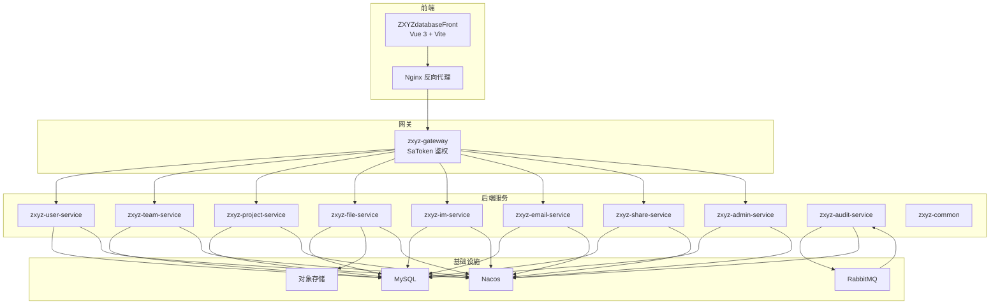
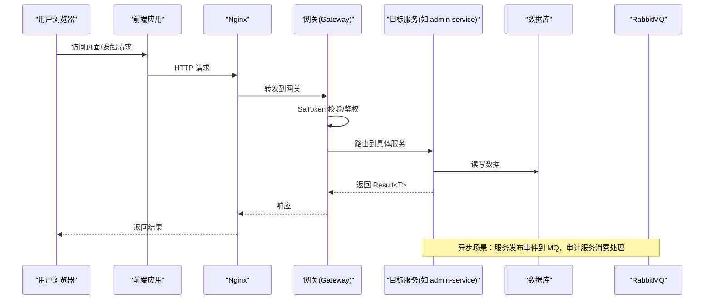
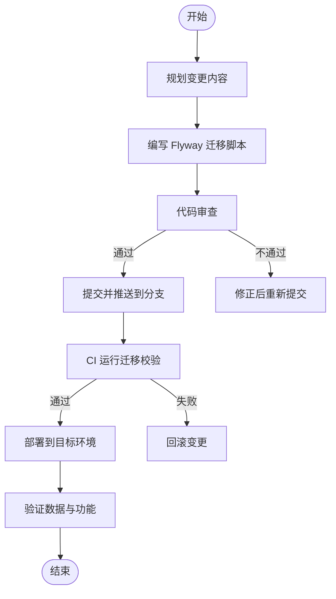
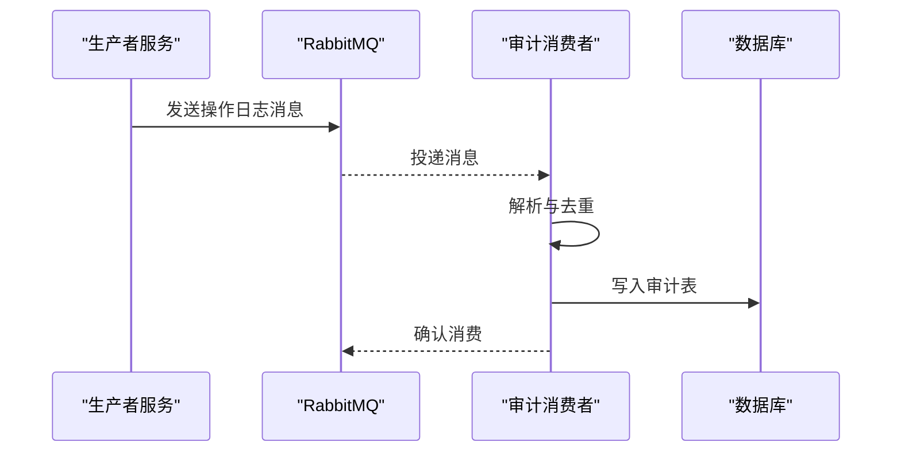
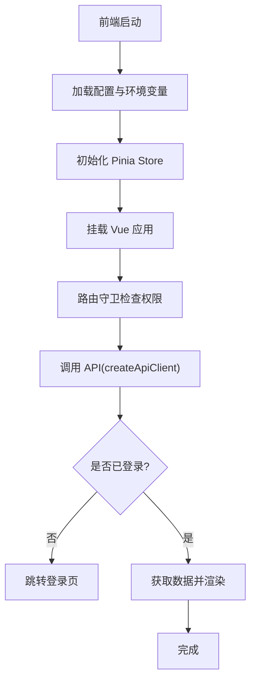
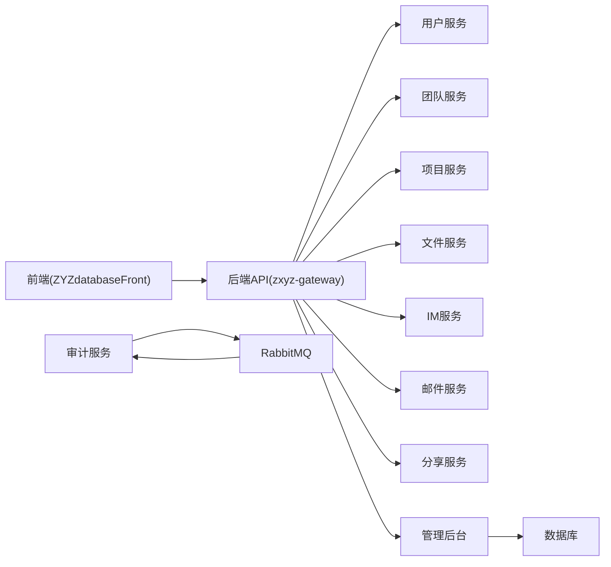
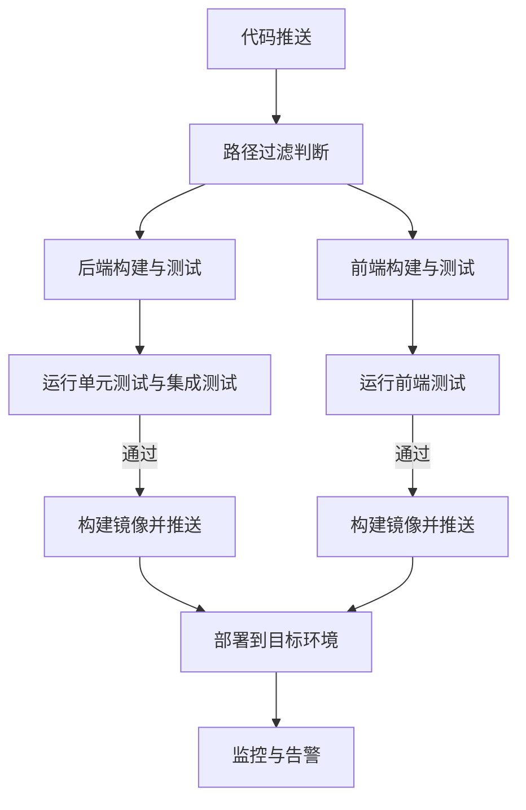

# 开发流程

<cite>
**本文引用的文件**
- [ci-cd.yml](file://.github/workflows/ci-cd.yml)
- [build.yml](file://ZXYZdatabaseFront/.github/workflows/build.yml)
- [deploy.yml](file://ZXYZdatabaseFront/.github/workflows/deploy.yml)
- [docker-compose.yml](file://docker-compose.yml)
- [docker-compose.dev.yml](file://docker-compose.dev.yml)
- [Dockerfile](file://Dockerfile)
- [Dockerfile.base](file://Dockerfile.base)
- [pom.xml](file://ZXYZdatabaseBack/pom.xml)
- [package.json](file://ZXYZdatabaseFront/package.json)
- [commitlint.config.js](file://ZXYZdatabaseFront/commitlint.config.js)
- [eslint.config.mjs](file://ZXYZdatabaseFront/eslint.config.mjs)
- [.prettierrc](file://ZXYZdatabaseFront/.prettierrc)
- [api-contract.md](file://docs/api-contract.md)
- [architecture.md](file://docs/architecture.md)
- [infrastructure.md](file://docs/infrastructure.md)
- [jasypt-key-management.md](file://docs/jasypt-key-management.md)
- [DEPLOYMENT.md](file://DEPLOYMENT.md)
- [CLAUDE.md](file://CLAUDE.md)
- [backup.sh](file://scripts/backup.sh)
- [deploy-fast.sh](file://scripts/deploy-fast.sh)
- [rollback.sh](file://scripts/rollback.sh)
- [health-check.sh](file://scripts/health-check.sh)
- [setup-acr.sh](file://scripts/setup-acr.sh)
- [validate-env.sh](file://scripts/validate-env.sh)
- [00-init-zxyz.sh](file://sql/00-init-zxyz.sh)
- [V1__init_config_schema.sql](file://ZXYZdatabaseBack/zxyz-admin-service/src/main/resources/db/migration/V1__init_config_schema.sql)
- [V2__hot_config_keys.sql](file://ZXYZdatabaseBack/zxyz-admin-service/src/main/resources/db/migration/V2__hot_config_keys.sql)
- [V3__fix_config_keys.sql](file://ZXYZdatabaseBack/zxyz-admin-service/src/main/resources/db/migration/V3__fix_config_keys.sql)
- [application.yml](file://ZXYZdatabaseBack/zxyz-admin-service/src/main/resources/application.yml)
- [application-dev.yml](file://ZXYZdatabaseBack/zxyz-admin-service/src/main/resources/application-dev.yml)
- [application-prod.yml](file://ZXYZdatabaseBack/zxyz-admin-service/src/main/resources/application-prod.yml)
- [ConfigService.java](file://ZXYZdatabaseBack/zxyz-admin-service/src/main/java/uno/acloud/admin/service/ConfigService.java)
- [ConfigAdminController.java](file://ZXYZdatabaseBack/zxyz-admin-service/src/main/java/uno/acloud/admin/controller/ConfigAdminController.java)
- [SysConfigMapper.java](file://ZXYZdatabaseBack/zxyz-admin-service/src/main/java/uno/acloud/admin/mapper/SysConfigMapper.java)
- [SysConfig.java](file://ZXYZdatabaseBack/zxyz-admin-service/src/main/java/uno/acloud/admin/domain/SysConfig.java)
- [AbstractServiceClient.java](file://ZXYZdatabaseBack/zxyz-common/src/main/java/uno/acloud/client/AbstractServiceClient.java)
- [ConfigServiceClient.java](file://ZXYZdatabaseBack/zxyz-common/src/main/java/uno/acloud/client/ConfigServiceClient.java)
- [OperateLogConsumer.java](file://ZXYZdatabaseBack/zxyz-audit-service/src/main/java/uno/acloud/audit/mq/OperateLogConsumer.java)
- [RabbitMqConfig.java](file://ZXYZdatabaseBack/zxyz-audit-service/src/main/resources/RabbitMqConfig.java)
- [EmailDispatchServiceTest.java](file://ZXYZdatabaseBack/zxyz-email-service/src/test/java/uno/acloud/email/application/EmailDispatchServiceTest.java)
- [ConfigServiceIntegrationTest.java](file://ZXYZdatabaseBack/zxyz-admin-service/src/test/java/uno/acloud/admin/service/ConfigServiceIntegrationTest.java)
- [ConfigServiceTest.java](file://ZXYZdatabaseBack/zxyz-admin-service/src/test/java/uno/acloud/admin/service/ConfigServiceTest.java)
- [ConfigAdminControllerTest.java](file://ZXYZdatabaseBack/zxyz-admin-service/src/test/java/uno/acloud/admin/controller/ConfigAdminControllerTest.java)
- [auth.spec.js](file://ZXYZdatabaseFront/src/api/__tests__/auth.spec.js)
- [files.spec.js](file://ZXYZdatabaseFront/src/api/__tests__/files.spec.js)
- [im.spec.js](file://ZXYZdatabaseFront/src/api/__tests__/im.spec.js)
- [team.spec.js](file://ZXYZdatabaseFront/src/api/__tests__/team.spec.js)
- [useLoginForm.spec.js](file://ZXYZdatabaseFront/src/composables/__tests__/useLoginForm.spec.js)
- [createApiClient.spec.js](file://ZXYZdatabaseFront/src/utils/__tests__/createApiClient.spec.js)
- [router/guards/permission.js](file://ZXYZdatabaseFront/src/router/guards/permission.js)
- [nginx/default.conf](file://deploy/nginx/default.conf)
- [nginx/entrypoint.sh](file://deploy/nginx/entrypoint.sh)
</cite>

## 目录
1. [引言](#引言)
2. [项目结构](#项目结构)
3. [核心组件](#核心组件)
4. [架构总览](#架构总览)
5. [详细组件分析](#详细组件分析)
6. [依赖分析](#依赖分析)
7. [性能考虑](#性能考虑)
8. [故障排查指南](#故障排查指南)
9. [结论](#结论)
10. [附录](#附录)

## 引言
本文件为 ZXYZ 项目制定统一的开发工作流程与协作规范，覆盖新功能从需求到上线的全生命周期：需求分析、技术方案设计、数据库变更规划、接口契约编写；代码实现规范（分支策略、提交规范、PR 流程、审查标准）；测试验证（单元、集成、端到端、性能）；发布部署（版本管理、构建打包、镜像推送、灰度发布、回滚）；协作开发（Git 工作流、冲突解决、依赖管理、文档维护）；以及自动化流水线配置与持续集成最佳实践。

## 项目结构
ZXYZ 采用“后端微服务 + 前端单页应用”的双仓库式组织：
- 后端：ZXYZdatabaseBack，包含 11 个 Maven 模块（网关、用户、团队、项目、文件、IM、邮件、审计、共享、公共库、管理后台），统一使用 Spring Boot + MyBatis，Nacos 注册与配置中心，RabbitMQ 异步消息，Flyway 管理数据库迁移。
- 前端：ZXYZdatabaseFront，Vue 3 Composition API + Element Plus + Pinia，API 层按领域拆分，单元测试基于 Vitest/Jest，CI/CD 通过 GitHub Actions 构建并部署到 Nginx。

**图表来源**
- [docker-compose.yml](file://docker-compose.yml)
- [architecture.md](file://docs/architecture.md)

**章节来源**
- [docker-compose.yml](file://docker-compose.yml)
- [architecture.md](file://docs/architecture.md)

## 核心组件
- 网关与鉴权：Gateway 统一入口，SaToken Filter 拦截 /api/internal/** 内部端点，仅允许内网调用。
- 服务间通信：同步通过 zxyz-common 的 ServiceClient + X-Internal-Service-Token 鉴权；异步通过 RabbitMQ Topic Exchange zxyz.topic。
- 配置与注册：Nacos 统一管理配置与服务发现，敏感项使用 Jasypt 加密。
- 数据持久化：各服务独立数据库，Flyway 管理迁移脚本；审计服务消费操作日志进行归档与清理。
- 前端工程：模块化 API 封装、Pinia 状态、Composables 业务逻辑、Element Plus UI、Vitest 单元测试。

**章节来源**
- [CLAUDE.md](file://CLAUDE.md)
- [api-contract.md](file://docs/api-contract.md)
- [infrastructure.md](file://docs/infrastructure.md)

## 架构总览
下图展示一次典型请求从前端到后端服务的流转路径，包括鉴权、路由、服务调用与消息处理。

**图表来源**
- [ci-cd.yml](file://.github/workflows/ci-cd.yml)
- [docker-compose.yml](file://docker-compose.yml)

## 详细组件分析

### 新功能开发流程（端到端）
- 需求分析
  - 明确业务目标、影响范围、非功能要求（性能、安全、可观测性）。
  - 识别涉及的服务与数据域，评估是否新增表或字段。
- 技术方案设计
  - 选择 DDD 分层（IM/Email）或传统分层（其余服务）风格。
  - 定义服务边界、接口契约（窄端点 + 投影 VO）、幂等性与重试策略。
  - 确定同步/异步交互方式，必要时引入 MQ 解耦。
- 数据库变更规划
  - 使用 Flyway 迁移脚本，命名遵循 V{序号}__描述.sql，保证幂等与可回滚。
  - 变更需考虑向后兼容（新增字段默认值、索引优化、慢查询规避）。
- 接口设计文档编写
  - 在 docs/api-contract.md 中更新接口定义、参数、返回值、错误码。
  - 内部端点前缀 /api/internal/**，禁止公网暴露。
- 代码实现规范
  - 分支策略：feature/* 开发，release/* 预发，hotfix/* 紧急修复，main/master 稳定分支。
  - 提交规范：遵循 commitlint 约定（类型: 描述），便于生成变更日志。
  - PR 流程：创建 MR/PR → 自动 CI → 至少 1 人审查 → 合并至目标分支。
  - 代码审查标准：可读性、健壮性、安全性、性能、可测试性、文档一致性。
- 测试验证
  - 单元测试：服务层与工具类覆盖率达标，Mock 外部依赖。
  - 集成测试：数据库、MQ、缓存等真实环境最小集。
  - 端到端测试：关键用户路径冒烟用例。
  - 性能测试：压测关键接口，关注 P95/P99 时延与吞吐。
- 发布部署
  - 版本管理：语义化版本，打 tag 后触发构建。
  - 构建打包：Maven 构建后端，Vite 构建前端静态资源。
  - 镜像推送：GHCR/ACR，多阶段构建，精简镜像。
  - 灰度发布：蓝绿/金丝雀，逐步放量，监控指标。
  - 回滚策略：一键回滚脚本，保留最近 N 个镜像版本。

**章节来源**
- [api-contract.md](file://docs/api-contract.md)
- [CLAUDE.md](file://CLAUDE.md)
- [commitlint.config.js](file://ZXYZdatabaseFront/commitlint.config.js)

### 数据库变更与迁移规范
- 迁移脚本位置：各服务 src/main/resources/db/migration/*.sql。
- 命名与顺序：V{序号}__描述.sql，序号递增，确保执行顺序。
- 内容要求：DDL/DML 分离，避免破坏性变更；提供回滚思路。
- 示例参考：
  - 配置服务迁移：V1__init_config_schema.sql、V2__hot_config_keys.sql、V3__fix_config_keys.sql。
  - 初始化脚本：sql/00-init-zxyz.sh。

**图表来源**
- [V1__init_config_schema.sql](file://ZXYZdatabaseBack/zxyz-admin-service/src/main/resources/db/migration/V1__init_config_schema.sql)
- [V2__hot_config_keys.sql](file://ZXYZdatabaseBack/zxyz-admin-service/src/main/resources/db/migration/V2__hot_config_keys.sql)
- [V3__fix_config_keys.sql](file://ZXYZdatabaseBack/zxyz-admin-service/src/main/resources/db/migration/V3__fix_config_keys.sql)
- [00-init-zxyz.sh](file://sql/00-init-zxyz.sh)

**章节来源**
- [V1__init_config_schema.sql](file://ZXYZdatabaseBack/zxyz-admin-service/src/main/resources/db/migration/V1__init_config_schema.sql)
- [V2__hot_config_keys.sql](file://ZXYZdatabaseBack/zxyz-admin-service/src/main/resources/db/migration/V2__hot_config_keys.sql)
- [V3__fix_config_keys.sql](file://ZXYZdatabaseBack/zxyz-admin-service/src/main/resources/db/migration/V3__fix_config_keys.sql)
- [00-init-zxyz.sh](file://sql/00-init-zxyz.sh)

### 接口设计与服务间调用
- 接口风格：RESTful，统一 Result<T> 响应体，code=1 表示成功。
- 内部端点：/api/internal/** 由 Gateway SaToken Filter 拒绝公网访问。
- 服务间调用：zxyz-common 中的 AbstractServiceClient 基类 + 具体 Client（如 ConfigServiceClient），携带 X-Internal-Service-Token 鉴权。
- 投影模式：提供方返回调用方专用 Projection VO，避免胖 DTO 泄露。

```mermaid
classDiagram
class AbstractServiceClient {
+call(url, headers, body) Response
+setToken(token) void
}
class ConfigServiceClient {
+getConfig(key) SysConfig
+updateConfig(config) boolean
}
class ConfigService {
+getByKey(key) SysConfig
+save(config) boolean
}
class ConfigAdminController {
+getConfig(request) Result~SysConfig~
+updateConfig(request) Result~boolean~
}
AbstractServiceClient <|-- ConfigServiceClient
ConfigServiceClient --> ConfigService : "调用"
ConfigAdminController --> ConfigService : "依赖"
```

**图表来源**
- [AbstractServiceClient.java](file://ZXYZdatabaseBack/zxyz-common/src/main/java/uno/acloud/client/AbstractServiceClient.java)
- [ConfigServiceClient.java](file://ZXYZdatabaseBack/zxyz-common/src/main/java/uno/acloud/client/ConfigServiceClient.java)
- [ConfigService.java](file://ZXYZdatabaseBack/zxyz-admin-service/src/main/java/uno/acloud/admin/service/ConfigService.java)
- [ConfigAdminController.java](file://ZXYZdatabaseBack/zxyz-admin-service/src/main/java/uno/acloud/admin/controller/ConfigAdminController.java)

**章节来源**
- [AbstractServiceClient.java](file://ZXYZdatabaseBack/zxyz-common/src/main/java/uno/acloud/client/AbstractServiceClient.java)
- [ConfigServiceClient.java](file://ZXYZdatabaseBack/zxyz-common/src/main/java/uno/acloud/client/ConfigServiceClient.java)
- [ConfigService.java](file://ZXYZdatabaseBack/zxyz-admin-service/src/main/java/uno/acloud/admin/service/ConfigService.java)
- [ConfigAdminController.java](file://ZXYZdatabaseBack/zxyz-admin-service/src/main/java/uno/acloud/admin/controller/ConfigAdminController.java)

### 异步消息与审计处理
- 消息模型：Topic Exchange zxyz.topic，按领域划分主题。
- 消费者：OperateLogConsumer 消费操作日志，持久化与清理。
- 配置：RabbitMqConfig 声明交换机、队列、绑定关系。

**图表来源**
- [OperateLogConsumer.java](file://ZXYZdatabaseBack/zxyz-audit-service/src/main/java/uno/acloud/audit/mq/OperateLogConsumer.java)
- [RabbitMqConfig.java](file://ZXYZdatabaseBack/zxyz-audit-service/src/main/resources/RabbitMqConfig.java)

**章节来源**
- [OperateLogConsumer.java](file://ZXYZdatabaseBack/zxyz-audit-service/src/main/java/uno/acloud/audit/mq/OperateLogConsumer.java)
- [RabbitMqConfig.java](file://ZXYZdatabaseBack/zxyz-audit-service/src/main/resources/RabbitMqConfig.java)

### 前端工程与测试
- 技术栈：Vue 3 Composition API + <script setup>，Element Plus auto-import，Pinia 状态管理。
- API 层：按领域拆分（account、auth、files、im、team 等），统一 createApiClient 封装。
- 测试：Vitest/Jest，覆盖 API、composables、utils、router guards。
- 认证：HttpOnly Cookie（Sa-Token UUID token + Redis session），权限守卫集中管理。

**图表来源**
- [package.json](file://ZXYZdatabaseFront/package.json)
- [createApiClient.spec.js](file://ZXYZdatabaseFront/src/utils/__tests__/createApiClient.spec.js)
- [useLoginForm.spec.js](file://ZXYZdatabaseFront/src/composables/__tests__/useLoginForm.spec.js)
- [router/guards/permission.js](file://ZXYZdatabaseFront/src/router/guards/permission.js)

**章节来源**
- [package.json](file://ZXYZdatabaseFront/package.json)
- [createApiClient.spec.js](file://ZXYZdatabaseFront/src/utils/__tests__/createApiClient.spec.js)
- [useLoginForm.spec.js](file://ZXYZdatabaseFront/src/composables/__tests__/useLoginForm.spec.js)
- [router/guards/permission.js](file://ZXYZdatabaseFront/src/router/guards/permission.js)

## 依赖分析
- 后端依赖：Spring Boot、MyBatis、Nacos、RabbitMQ、Flyway、Jasypt。
- 前端依赖：Vue 3、Element Plus、Pinia、Vite、Vitest/Jest。
- 容器编排：Docker Compose 编排 18 个容器（基础设施 + 服务 + 前端 Nginx + 日志栈）。
- CI/CD：GitHub Actions，paths-filter 选择性构建，镜像推送 GHCR。

**图表来源**
- [docker-compose.yml](file://docker-compose.yml)
- [pom.xml](file://ZXYZdatabaseBack/pom.xml)
- [package.json](file://ZXYZdatabaseFront/package.json)

**章节来源**
- [docker-compose.yml](file://docker-compose.yml)
- [pom.xml](file://ZXYZdatabaseBack/pom.xml)
- [package.json](file://ZXYZdatabaseFront/package.json)

## 性能考虑
- 接口层面：限制请求大小、分页查询、缓存热点数据、避免 N+1 查询。
- 数据库层面：合理索引、慢查询优化、连接池调优、分库分表预留。
- 消息层面：批量消费、死信队列、重试与退避策略。
- 前端层面：懒加载、虚拟滚动、图片压缩、CDN 加速。
- 监控告警：Prometheus + Grafana 采集关键指标，设置阈值告警。

[本节为通用指导，无需特定文件引用]

## 故障排查指南
- 常见问题定位
  - 鉴权失败：检查 SaToken 配置、Cookie 与 Token 有效性。
  - 服务不可用：查看 Nacos 注册状态与健康检查。
  - 消息堆积：检查消费者日志与 MQ 队列积压情况。
  - 数据库异常：查看连接池、事务与锁等待。
- 诊断工具
  - 健康检查脚本：scripts/health-check.sh。
  - 备份与恢复：scripts/backup.sh、sql/00-init-zxyz.sh。
  - 快速部署与回滚：scripts/deploy-fast.sh、scripts/rollback.sh。
- 日志收集
  - 前端错误：浏览器控制台与 Sentry（可选）。
  - 后端日志：ELK/ Loki + Promtail，按服务与 TraceId 聚合。

**章节来源**
- [health-check.sh](file://scripts/health-check.sh)
- [backup.sh](file://scripts/backup.sh)
- [deploy-fast.sh](file://scripts/deploy-fast.sh)
- [rollback.sh](file://scripts/rollback.sh)
- [00-init-zxyz.sh](file://sql/00-init-zxyz.sh)

## 结论
本文档为 ZXYZ 项目提供了标准化的开发工作流程与协作规范，涵盖从需求到上线的全链路实践。通过严格的分支与提交规范、完善的测试体系、自动化 CI/CD 与灰度发布策略，确保交付质量与稳定性。建议团队在日常开发中严格执行本规范，并结合实际项目演进持续优化。

## 附录

### 自动化流水线与持续集成最佳实践
- 后端流水线：.github/workflows/ci-cd.yml，按需构建与测试，镜像推送 GHCR。
- 前端流水线：ZXYZdatabaseFront/.github/workflows/build.yml 与 deploy.yml，构建静态资源并部署到 Nginx。
- 选择性构建：使用 dorny/paths-filter 仅构建受影响模块，提升效率。
- 环境变量与安全：Nacos 管理配置，Jasypt 加密敏感信息，密钥管理见 jasypt-key-management.md。

**图表来源**
- [ci-cd.yml](file://.github/workflows/ci-cd.yml)
- [build.yml](file://ZXYZdatabaseFront/.github/workflows/build.yml)
- [deploy.yml](file://ZXYZdatabaseFront/.github/workflows/deploy.yml)

**章节来源**
- [ci-cd.yml](file://.github/workflows/ci-cd.yml)
- [build.yml](file://ZXYZdatabaseFront/.github/workflows/build.yml)
- [deploy.yml](file://ZXYZdatabaseFront/.github/workflows/deploy.yml)
- [jasypt-key-management.md](file://docs/jasypt-key-management.md)

### 测试验证流程
- 单元测试：服务层与工具类，Mock 外部依赖，覆盖率达标。
- 集成测试：数据库、MQ、缓存等真实环境最小集。
- 端到端测试：关键用户路径冒烟用例。
- 性能测试：压测关键接口，关注 P95/P99 时延与吞吐。

示例参考：
- 后端单元测试：EmailDispatchServiceTest.java、ConfigServiceTest.java。
- 后端集成测试：ConfigServiceIntegrationTest.java、ConfigAdminControllerTest.java。
- 前端测试：auth.spec.js、files.spec.js、im.spec.js、team.spec.js、useLoginForm.spec.js、createApiClient.spec.js。

**章节来源**
- [EmailDispatchServiceTest.java](file://ZXYZdatabaseBack/zxyz-email-service/src/test/java/uno/acloud/email/application/EmailDispatchServiceTest.java)
- [ConfigServiceIntegrationTest.java](file://ZXYZdatabaseBack/zxyz-admin-service/src/test/java/uno/acloud/admin/service/ConfigServiceIntegrationTest.java)
- [ConfigServiceTest.java](file://ZXYZdatabaseBack/zxyz-admin-service/src/test/java/uno/acloud/admin/service/ConfigServiceTest.java)
- [ConfigAdminControllerTest.java](file://ZXYZdatabaseBack/zxyz-admin-service/src/test/java/uno/acloud/admin/controller/ConfigAdminControllerTest.java)
- [auth.spec.js](file://ZXYZdatabaseFront/src/api/__tests__/auth.spec.js)
- [files.spec.js](file://ZXYZdatabaseFront/src/api/__tests__/files.spec.js)
- [im.spec.js](file://ZXYZdatabaseFront/src/api/__tests__/im.spec.js)
- [team.spec.js](file://ZXYZdatabaseFront/src/api/__tests__/team.spec.js)
- [useLoginForm.spec.js](file://ZXYZdatabaseFront/src/composables/__tests__/useLoginForm.spec.js)
- [createApiClient.spec.js](file://ZXYZdatabaseFront/src/utils/__tests__/createApiClient.spec.js)

### 发布部署流程
- 版本管理：语义化版本，打 tag 后触发构建。
- 构建打包：Maven 构建后端，Vite 构建前端静态资源。
- 镜像推送：GHCR/ACR，多阶段构建，精简镜像。
- 灰度发布：蓝绿/金丝雀，逐步放量，监控指标。
- 回滚策略：一键回滚脚本，保留最近 N 个镜像版本。

参考脚本与配置：
- 部署脚本：scripts/deploy-fast.sh、scripts/rollback.sh。
- 环境校验：scripts/validate-env.sh、scripts/setup-acr.sh。
- 容器编排：docker-compose.yml、docker-compose.dev.yml。
- 前端部署：deploy/nginx/default.conf、deploy/nginx/entrypoint.sh。
- 后端镜像：Dockerfile、Dockerfile.base。

**章节来源**
- [DEPLOYMENT.md](file://DEPLOYMENT.md)
- [deploy-fast.sh](file://scripts/deploy-fast.sh)
- [rollback.sh](file://scripts/rollback.sh)
- [validate-env.sh](file://scripts/validate-env.sh)
- [setup-acr.sh](file://scripts/setup-acr.sh)
- [docker-compose.yml](file://docker-compose.yml)
- [docker-compose.dev.yml](file://docker-compose.dev.yml)
- [nginx/default.conf](file://deploy/nginx/default.conf)
- [nginx/entrypoint.sh](file://deploy/nginx/entrypoint.sh)
- [Dockerfile](file://Dockerfile)
- [Dockerfile.base](file://Dockerfile.base)

### 协作开发规范
- Git 工作流：feature/*、release/*、hotfix/*、main/master。
- 冲突解决：频繁 rebase/sync，优先小步提交，避免大冲突。
- 依赖管理：后端 Maven 统一父 POM，前端 package.json 锁定版本。
- 文档维护：docs 目录集中管理架构、接口、基础设施与密钥管理文档。

**章节来源**
- [CLAUDE.md](file://CLAUDE.md)
- [pom.xml](file://ZXYZdatabaseBack/pom.xml)
- [package.json](file://ZXYZdatabaseFront/package.json)
- [api-contract.md](file://docs/api-contract.md)
- [architecture.md](file://docs/architecture.md)
- [infrastructure.md](file://docs/infrastructure.md)
- [jasypt-key-management.md](file://docs/jasypt-key-management.md)