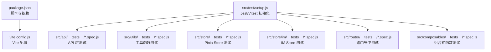
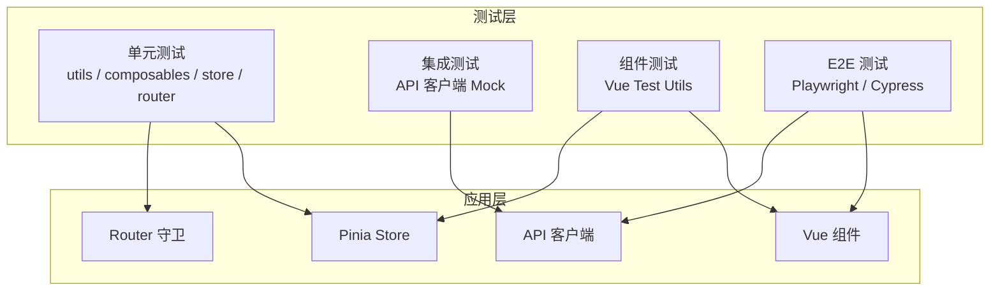
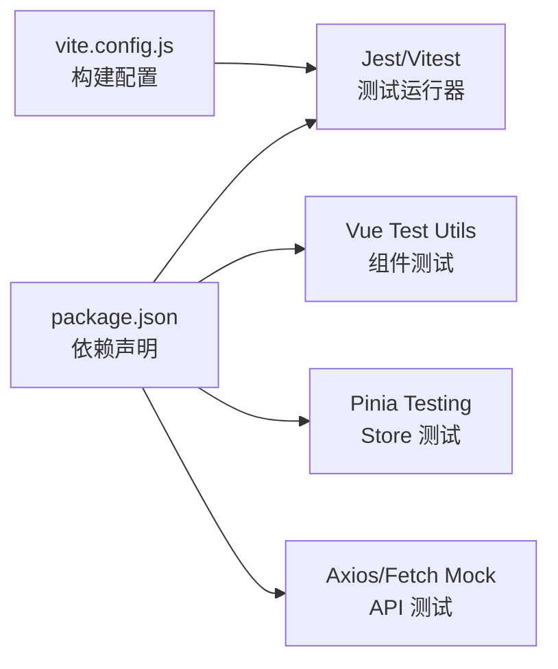

# 前端测试

<cite>
**本文引用的文件**   
- [package.json](file://ZXYZdatabaseFront/package.json)
- [vite.config.js](file://ZXYZdatabaseFront/vite.config.js)
- [setup.js](file://ZXYZdatabaseFront/src/test/setup.js)
- [auth.spec.js](file://ZXYZdatabaseFront/src/api/__tests__/auth.spec.js)
- [files.spec.js](file://ZXYZdatabaseFront/src/api/__tests__/files.spec.js)
- [im.spec.js](file://ZXYZdatabaseFront/src/api/__tests__/im.spec.js)
- [team.spec.js](file://ZXYZdatabaseFront/src/api/__tests__/team.spec.js)
- [currentUser.spec.js](file://ZXYZdatabaseFront/src/store/__tests__/currentUser.spec.js)
- [normalizers.spec.js](file://ZXYZdatabaseFront/src/store/im/__tests__/normalizers.spec.js)
- [createApiClient.spec.js](file://ZXYZdatabaseFront/src/utils/__tests__/createApiClient.spec.js)
- [format.spec.js](file://ZXYZdatabaseFront/src/utils/__tests__/format.spec.js)
- [sanitizeRedirect.spec.js](file://ZXYZdatabaseFront/src/utils/__tests__/sanitizeRedirect.spec.js)
- [useLoginForm.spec.js](file://ZXYZdatabaseFront/src/composables/__tests__/useLoginForm.spec.js)
- [useFileUpload.spec.js](file://ZXYZdatabaseFront/src/composables/__tests__/useFileUpload.spec.js)
- [useFileDownload.spec.js](file://ZXYZdatabaseFront/src/composables/__tests__/useFileDownload.spec.js)
- [useBatchFeedback.spec.js](file://ZXYZdatabaseFront/src/composables/__tests__/useBatchFeedback.spec.js)
- [useCurrentSpaceContext.spec.js](file://ZXYZdatabaseFront/src/composables/__tests__/useCurrentSpaceContext.spec.js)
- [useDeleteDialog.spec.js](file://ZXYZdatabaseFront/src/composables/__tests__/useDeleteDialog.spec.js)
- [useFileContextMenu.spec.js](file://ZXYZdatabaseFront/src/composables/__tests__/useFileContextMenu.spec.js)
- [useFolderPickerNavigation.spec.js](file://ZXYZdatabaseFront/src/composables/__tests__/useFolderPickerNavigation.spec.js)
- [useMoveCopyAction.spec.js](file://ZXYZdatabaseFront/src/composables/__tests__/useMoveCopyAction.spec.js)
- [useRenameAction.spec.js](file://ZXYZdatabaseFront/src/composables/__tests__/useRenameAction.spec.js)
- [useSelectionManager.spec.js](file://ZXYZdatabaseFront/src/composables/__tests__/useSelectionManager.spec.js)
- [useShareVisit.spec.js](file://ZXYZdatabaseFront/src/composables/__tests__/useShareVisit.spec.js)
- [useSortState.spec.js](file://ZXYZdatabaseFront/src/composables/__tests__/useSortState.spec.js)
- [useStorageUsage.spec.js](file://ZXYZdatabaseFront/src/composables/__tests__/useStorageUsage.spec.js)
- [guards.spec.js](file://ZXYZdatabaseFront/src/router/__tests__/guards.spec.js)
</cite>

## 目录
1. [简介](#简介)
2. [项目结构](#项目结构)
3. [核心组件](#核心组件)
4. [架构总览](#架构总览)
5. [详细组件分析](#详细组件分析)
6. [依赖分析](#依赖分析)
7. [性能考虑](#性能考虑)
8. [故障排查指南](#故障排查指南)
9. [结论](#结论)
10. [附录](#附录)

## 简介
本文件为 ZXYZ 前端应用的全面测试文档，覆盖 Jest 配置与使用、Vue Test Utils 组件测试、Pinia Store 测试、API 接口 Mock、E2E 测试框架选型与实践、composables 函数测试策略，以及覆盖率配置。目标是帮助开发者快速搭建稳定、可维护的前端测试体系，确保在 Vue 3 + Pinia + Vite 技术栈下的质量与交付效率。

## 项目结构
前端位于 ZXYZdatabaseFront 目录，测试相关代码主要分布在以下位置：
- 单元测试与 API 测试：src/api/__tests__、src/utils/__tests__、src/store/__tests__、src/store/im/__tests__、src/router/__tests__、src/composables/__tests__
- 测试环境初始化：src/test/setup.js
- 构建与测试配置：package.json、vite.config.js

图表来源
- [package.json](file://ZXYZdatabaseFront/package.json)
- [vite.config.js](file://ZXYZdatabaseFront/vite.config.js)
- [setup.js](file://ZXYZdatabaseFront/src/test/setup.js)

章节来源
- [package.json](file://ZXYZdatabaseFront/package.json)
- [vite.config.js](file://ZXYZdatabaseFront/vite.config.js)
- [setup.js](file://ZXYZdatabaseFront/src/test/setup.js)

## 核心组件
- 测试运行器与断言库：Jest（或 Vitest 兼容模式）提供测试执行、Mock 与覆盖率统计能力。
- 组件测试：Vue Test Utils 用于渲染 Vue 组件、触发事件、验证状态与 DOM 输出。
- 状态管理测试：Pinia 的 store 实例化、action 调用与 state 变更验证。
- API 测试：对 HTTP 请求进行 Mock，模拟成功/失败响应，验证错误处理分支。
- Composables 测试：针对业务逻辑封装的组合式函数进行输入输出与副作用隔离测试。
- 路由测试：对导航守卫与权限控制进行测试。

章节来源
- [auth.spec.js](file://ZXYZdatabaseFront/src/api/__tests__/auth.spec.js)
- [files.spec.js](file://ZXYZdatabaseFront/src/api/__tests__/files.spec.js)
- [im.spec.js](file://ZXYZdatabaseFront/src/api/__tests__/im.spec.js)
- [team.spec.js](file://ZXYZdatabaseFront/src/api/__tests__/team.spec.js)
- [currentUser.spec.js](file://ZXYZdatabaseFront/src/store/__tests__/currentUser.spec.js)
- [normalizers.spec.js](file://ZXYZdatabaseFront/src/store/im/__tests__/normalizers.spec.js)
- [createApiClient.spec.js](file://ZXYZdatabaseFront/src/utils/__tests__/createApiClient.spec.js)
- [format.spec.js](file://ZXYZdatabaseFront/src/utils/__tests__/format.spec.js)
- [sanitizeRedirect.spec.js](file://ZXYZdatabaseFront/src/utils/__tests__/sanitizeRedirect.spec.js)
- [guards.spec.js](file://ZXYZdatabaseFront/src/router/__tests__/guards.spec.js)
- [useLoginForm.spec.js](file://ZXYZdatabaseFront/src/composables/__tests__/useLoginForm.spec.js)
- [useFileUpload.spec.js](file://ZXYZdatabaseFront/src/composables/__tests__/useFileUpload.spec.js)
- [useFileDownload.spec.js](file://ZXYZdatabaseFront/src/composables/__tests__/useFileDownload.spec.js)
- [useBatchFeedback.spec.js](file://ZXYZdatabaseFront/src/composables/__tests__/useBatchFeedback.spec.js)
- [useCurrentSpaceContext.spec.js](file://ZXYZdatabaseFront/src/composables/__tests__/useCurrentSpaceContext.spec.js)
- [useDeleteDialog.spec.js](file://ZXYZdatabaseFront/src/composables/__tests__/useDeleteDialog.spec.js)
- [useFileContextMenu.spec.js](file://ZXYZdatabaseFront/src/composables/__tests__/useFileContextMenu.spec.js)
- [useFolderPickerNavigation.spec.js](file://ZXYZdatabaseFront/src/composables/__tests__/useFolderPickerNavigation.spec.js)
- [useMoveCopyAction.spec.js](file://ZXYZdatabaseFront/src/composables/__tests__/useMoveCopyAction.spec.js)
- [useRenameAction.spec.js](file://ZXYZdatabaseFront/src/composables/__tests__/useRenameAction.spec.js)
- [useSelectionManager.spec.js](file://ZXYZdatabaseFront/src/composables/__tests__/useSelectionManager.spec.js)
- [useShareVisit.spec.js](file://ZXYZdatabaseFront/src/composables/__tests__/useShareVisit.spec.js)
- [useSortState.spec.js](file://ZXYZdatabaseFront/src/composables/__tests__/useSortState.spec.js)
- [useStorageUsage.spec.js](file://ZXYZdatabaseFront/src/composables/__tests__/useStorageUsage.spec.js)

## 架构总览
前端测试分层如下：
- 单元层：工具函数、composables、store、router 等无 UI 或轻量 UI 逻辑
- 集成层：API 客户端与服务交互（通过 Mock）
- 组件层：Vue 组件渲染、事件、状态验证
- E2E 层：端到端用户流程（可选 Playwright/Cypress）

[此图为概念性架构图，不直接映射具体源码文件]

## 详细组件分析

### Jest 测试框架配置与使用
- 测试环境设置：通过 src/test/setup.js 统一初始化全局环境、Polyfill、第三方库 Mock 等。
- 异步测试：使用 async/await 与等待机制（如 nextTick、flushPromises）确保异步操作完成后再断言。
- Mock 策略：对网络请求、浏览器 API、第三方模块进行隔离与模拟，保证测试稳定性与速度。
- 覆盖率配置：在 package.json 中配置测试脚本与覆盖率收集参数，便于 CI 集成。

章节来源
- [setup.js](file://ZXYZdatabaseFront/src/test/setup.js)
- [package.json](file://ZXYZdatabaseFront/package.json)

### Vue Test Utils 组件测试方法
- 组件渲染：使用 mount/shallowMount 渲染组件，验证初始 DOM 结构与数据绑定。
- 事件触发：通过 trigger、fireEvent 模拟用户交互，验证组件行为与副作用。
- 状态验证：结合 store 与组件内部状态，断言渲染结果与数据一致性。
- 插槽与属性：验证 props、slots 传递与渲染效果。

章节来源
- [auth.spec.js](file://ZXYZdatabaseFront/src/api/__tests__/auth.spec.js)
- [files.spec.js](file://ZXYZdatabaseFront/src/api/__tests__/files.spec.js)
- [im.spec.js](file://ZXYZdatabaseFront/src/api/__tests__/im.spec.js)
- [team.spec.js](file://ZXYZdatabaseFront/src/api/__tests__/team.spec.js)

### Pinia 状态管理测试策略
- Store 测试：创建独立 store 实例，重置状态，避免用例间污染。
- Action 模拟：对异步 action 进行 Mock 或真实调用（配合 Mock API），验证状态更新与副作用。
- State 验证：断言 state 字段变化是否符合预期，包括嵌套对象与数组。
- 插件与订阅：测试 store 插件与订阅回调的行为。

章节来源
- [currentUser.spec.js](file://ZXYZdatabaseFront/src/store/__tests__/currentUser.spec.js)
- [normalizers.spec.js](file://ZXYZdatabaseFront/src/store/im/__tests__/normalizers.spec.js)

### API 接口测试方法
- HTTP 请求 Mock：对 fetch/axios 等请求进行拦截与模拟，返回预设响应。
- 响应模拟：覆盖成功、失败、超时、异常等场景，验证错误处理分支。
- 鉴权与头信息：模拟认证头、Cookie、Token 等，验证鉴权逻辑。
- 错误处理：断言错误消息、重试机制、降级策略。

章节来源
- [createApiClient.spec.js](file://ZXYZdatabaseFront/src/utils/__tests__/createApiClient.spec.js)
- [auth.spec.js](file://ZXYZdatabaseFront/src/api/__tests__/auth.spec.js)
- [files.spec.js](file://ZXYZdatabaseFront/src/api/__tests__/files.spec.js)
- [im.spec.js](file://ZXYZdatabaseFront/src/api/__tests__/im.spec.js)
- [team.spec.js](file://ZXYZdatabaseFront/src/api/__tests__/team.spec.js)

### E2E 测试框架选择与实践
- 框架选型：推荐 Playwright 或 Cypress，具备跨浏览器、自动化、截图与视频录制能力。
- 页面导航：模拟用户登录、跳转、表单提交等操作。
- 用户交互：点击、输入、拖拽、键盘事件等。
- 跨浏览器测试：在 CI 中并行执行多浏览器用例，提升覆盖率与稳定性。

[本节为概念性内容，不直接分析具体文件]

### Composables 函数测试方法
- 输入输出验证：对纯函数部分进行边界值、异常输入测试。
- 副作用隔离：对网络请求、定时器、DOM 操作等进行 Mock。
- 状态同步：验证 composable 与 store 之间的状态同步与事件派发。
- 生命周期：测试 onMounted、onUnmounted 等钩子中的逻辑。

章节来源
- [useLoginForm.spec.js](file://ZXYZdatabaseFront/src/composables/__tests__/useLoginForm.spec.js)
- [useFileUpload.spec.js](file://ZXYZdatabaseFront/src/composables/__tests__/useFileUpload.spec.js)
- [useFileDownload.spec.js](file://ZXYZdatabaseFront/src/composables/__tests__/useFileDownload.spec.js)
- [useBatchFeedback.spec.js](file://ZXYZdatabaseFront/src/composables/__tests__/useBatchFeedback.spec.js)
- [useCurrentSpaceContext.spec.js](file://ZXYZdatabaseFront/src/composables/__tests__/useCurrentSpaceContext.spec.js)
- [useDeleteDialog.spec.js](file://ZXYZdatabaseFront/src/composables/__tests__/useDeleteDialog.spec.js)
- [useFileContextMenu.spec.js](file://ZXYZdatabaseFront/src/composables/__tests__/useFileContextMenu.spec.js)
- [useFolderPickerNavigation.spec.js](file://ZXYZdatabaseFront/src/composables/__tests__/useFolderPickerNavigation.spec.js)
- [useMoveCopyAction.spec.js](file://ZXYZdatabaseFront/src/composables/__tests__/useMoveCopyAction.spec.js)
- [useRenameAction.spec.js](file://ZXYZdatabaseFront/src/composables/__tests__/useRenameAction.spec.js)
- [useSelectionManager.spec.js](file://ZXYZdatabaseFront/src/composables/__tests__/useSelectionManager.spec.js)
- [useShareVisit.spec.js](file://ZXYZdatabaseFront/src/composables/__tests__/useShareVisit.spec.js)
- [useSortState.spec.js](file://ZXYZdatabaseFront/src/composables/__tests__/useSortState.spec.js)
- [useStorageUsage.spec.js](file://ZXYZdatabaseFront/src/composables/__tests__/useStorageUsage.spec.js)

### 路由守卫测试
- 权限控制：模拟用户角色、权限状态，验证导航是否被允许。
- 重定向逻辑：测试未登录、无权限时的重定向路径。
- 动态路由：验证路由元信息与权限匹配。

章节来源
- [guards.spec.js](file://ZXYZdatabaseFront/src/router/__tests__/guards.spec.js)

## 依赖分析
测试依赖主要包括测试运行器、断言库、Vue 测试工具、Pinia 测试工具、HTTP 客户端 Mock 库等。这些依赖在 package.json 中声明，并通过 vite.config.js 或测试配置文件加载。

图表来源
- [package.json](file://ZXYZdatabaseFront/package.json)
- [vite.config.js](file://ZXYZdatabaseFront/vite.config.js)

章节来源
- [package.json](file://ZXYZdatabaseFront/package.json)
- [vite.config.js](file://ZXYZdatabaseFront/vite.config.js)

## 性能考虑
- 测试隔离：每个用例独立初始化环境，避免共享状态导致的不稳定。
- Mock 优化：减少不必要的网络请求与重型依赖，提升测试速度。
- 并行执行：利用测试框架的并行能力，缩短 CI 时间。
- 覆盖率阈值：设置合理的覆盖率阈值，平衡质量与开发效率。

[本节为通用指导，不直接分析具体文件]

## 故障排查指南
- 环境问题：检查 setup.js 是否正确初始化全局依赖与 Polyfill。
- 异步问题：确认 await 与等待机制是否正确使用，避免竞态条件。
- Mock 失效：检查 Mock 作用域与生命周期，确保在正确时机生效。
- 组件渲染失败：检查依赖注入、Store 初始化、外部资源加载。
- API 测试失败：确认 Mock 响应结构与实际接口一致，错误分支覆盖完整。

章节来源
- [setup.js](file://ZXYZdatabaseFront/src/test/setup.js)
- [createApiClient.spec.js](file://ZXYZdatabaseFront/src/utils/__tests__/createApiClient.spec.js)
- [auth.spec.js](file://ZXYZdatabaseFront/src/api/__tests__/auth.spec.js)

## 结论
通过系统化的测试策略与工具链，ZXYZ 前端应用能够在 Vue 3 + Pinia + Vite 技术栈下实现高质量的代码保障。建议持续完善单元测试与集成测试，逐步引入 E2E 测试，形成完整的测试金字塔，确保功能稳定与迭代效率。

[本节为总结性内容，不直接分析具体文件]

## 附录
- 测试脚本示例：在 package.json 中配置 jest 或 vitest 命令，支持 --coverage 参数生成覆盖率报告。
- 覆盖率配置：在 vite.config.js 或测试配置文件中设置覆盖率阈值与忽略规则。
- CI 集成：在 GitHub Actions 中执行测试与覆盖率检查，确保每次提交的质量门禁。

[本节为补充说明，不直接分析具体文件]