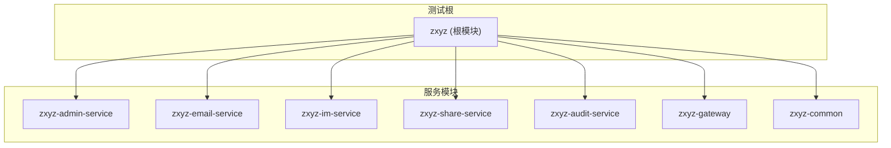
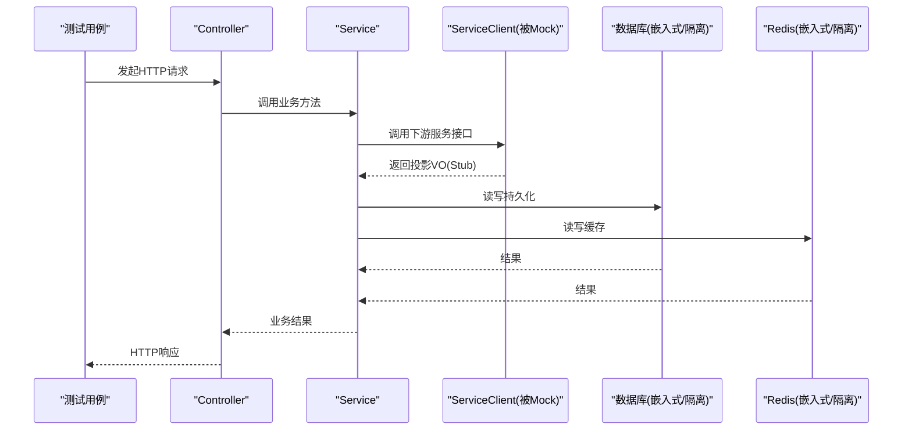
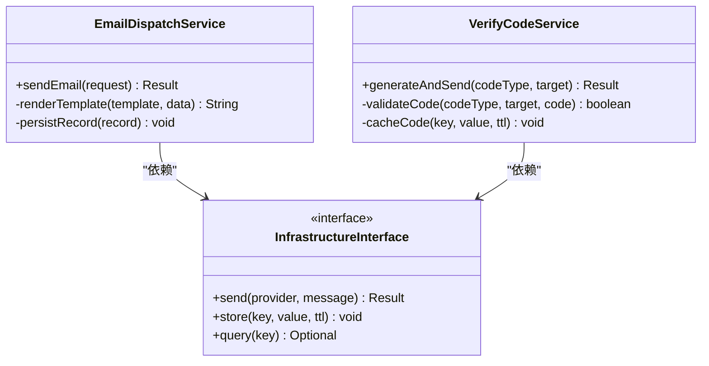
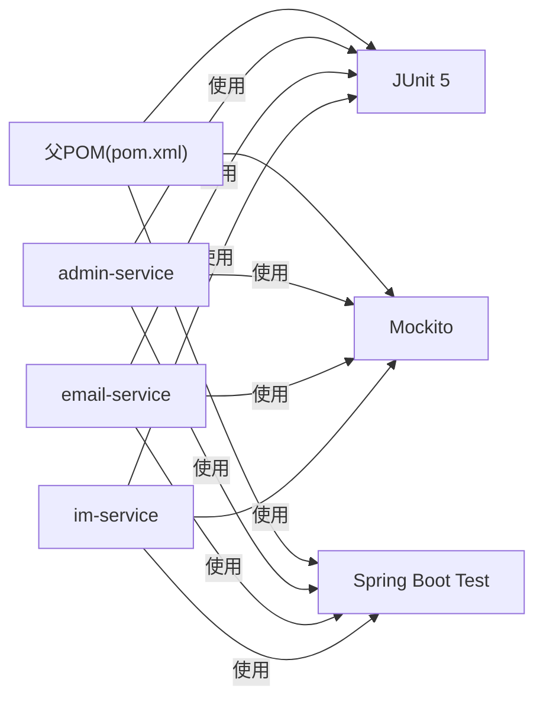

# 单元测试

<cite>
**本文引用的文件**   
- [pom.xml](file://ZXYZdatabaseBack/pom.xml)
- [application-test.yml](file://ZXYZdatabaseBack/zxyz-admin-service/src/test/resources/application-test.yml)
- [ConfigServiceTest.java](file://ZXYZdatabaseBack/zxyz-admin-service/src/test/java/uno/acloud/admin/service/ConfigServiceTest.java)
- [ConfigServiceIntegrationTest.java](file://ZXYZdatabaseBack/zxyz-admin-service/src/test/java/uno/acloud/admin/service/ConfigServiceIntegrationTest.java)
- [ConfigAdminControllerTest.java](file://ZXYZdatabaseBack/zxyz-admin-service/src/test/java/uno/acloud/admin/controller/ConfigAdminControllerTest.java)
- [AbstractIntegrationTest.java](file://ZXYZdatabaseBack/zxyz-common/src/test/java/uno/acloud/common/AbstractIntegrationTest.java)
- [EmailDispatchServiceTest.java](file://ZXYZdatabaseBack/zxyz-email-service/src/test/java/uno/acloud/email/application/EmailDispatchServiceTest.java)
- [VerifyCodeServiceTest.java](file://ZXYZdatabaseBack/zxyz-email-service/src/test/java/uno/acloud/email/application/VerifyCodeServiceTest.java)
- [OperateLogConsumerTest.java](file://ZXYZdatabaseBack/zxyz-audit-service/src/test/java/uno/acloud/audit/mq/OperateLogConsumerTest.java)
- [ShareAccessManagerTest.java](file://ZXYZdatabaseBack/zxyz-share-service/src/test/java/uno/acloud/share/service/impl/ShareAccessManagerTest.java)
- [ShareFileServiceClientTest.java](file://ZXYZdatabaseBack/zxyz-share-service/src/test/java/uno/acloud/share/infrastructure/client/ShareFileServiceClientTest.java)
- [TeamPermissionPolicyTest.java](file://ZXYZdatabaseBack/zxyz-common/src/test/java/uno/acloud/common/TeamPermissionPolicyTest.java)
- [InputNormalizerTest.java](file://ZXYZdatabaseBack/zxyz-common/src/test/java/uno/acloud/common/InputNormalizerTest.java)
- [AuditEventPublisherTest.java](file://ZXYZdatabaseBack/zxyz-common/src/test/java/uno/acloud/common/audit/AuditEventPublisherTest.java)
- [SaTokenFilterConfigTest.java](file://ZXYZdatabaseBack/zxyz-gateway/src/test/java/uno/acloud/gateway/filter/SaTokenFilterConfigTest.java)
- [Application.yml](file://ZXYZdatabaseBack/zxyz-im-service/src/test/resources/application.yml)
- [ZxyzImApplicationTests.java](file://ZXYZdatabaseBack/zxyz-im-service/src/test/java/uno/acloud/im/ZxyzImApplicationTests.java)
</cite>

## 目录
1. [简介](#简介)
2. [项目结构](#项目结构)
3. [核心组件](#核心组件)
4. [架构总览](#架构总览)
5. [详细组件分析](#详细组件分析)
6. [依赖关系分析](#依赖关系分析)
7. [性能考虑](#性能考虑)
8. [故障排查指南](#故障排查指南)
9. [结论](#结论)
10. [附录](#附录)

## 简介
本文件面向 ZXYZ 后端微服务（Maven 多模块）的单元测试实践，聚焦 JUnit 5 + Mockito 的配置与使用模式，覆盖 Mock 对象创建、Stub 方法定义、异常测试、异步代码测试；详解 Spring Boot 测试注解 @ExtendWith、@MockBean、@WebMvcTest 的使用场景；给出微服务单元测试最佳实践（ServiceClient Mock、数据库访问隔离、Redis 缓存 Mock）；提供 Controller、Service、工具类的测试示例路径；说明测试数据准备策略、断言库使用、覆盖率要求；并针对 DDD 架构的 IM 和 Email 服务，阐述领域模型测试的特殊处理方式。

## 项目结构
ZXYZ 后端采用 Maven 多模块组织，每个服务模块均包含 src/main 与 src/test 两套源码目录，测试资源位于 test/resources。常见测试类型：
- 单元测试：纯逻辑、无外部依赖，使用 Mockito 进行 Stub/Mock
- 集成测试：启动部分 Spring 上下文或全量上下文，验证装配与交互
- Web 层测试：基于 @WebMvcTest 的控制器切片测试
- MQ/事件测试：消息消费流程与幂等性验证
- 工具类与领域模型测试：无容器或最小化容器环境

**章节来源**
- [pom.xml:1-200](file://ZXYZdatabaseBack/pom.xml#L1-L200)

## 核心组件
- 测试框架与依赖
  - 使用 JUnit 5 作为测试运行器，结合 Spring Boot Test 与 Mockito 进行单元与集成测试
  - 通过父 POM 统一版本管理，确保各子模块测试依赖一致
- 测试配置与资源
  - 各模块在 test/resources 下提供 application-test.yml 或 application.yml，用于隔离测试环境
  - 集成测试基类封装通用行为（如事务回滚、数据清理、Mock 注入）
- 常用注解
  - @ExtendWith(SpringExtension.class)：启用 Spring 支持
  - @MockBean：替换 Spring 容器中指定 Bean 为 Mockito 模拟
  - @WebMvcTest：仅加载 Web 层，快速执行控制器测试
  - @SpringBootTest：加载完整上下文，用于集成测试

**章节来源**
- [pom.xml:1-200](file://ZXYZdatabaseBack/pom.xml#L1-L200)
- [application-test.yml:1-100](file://ZXYZdatabaseBack/zxyz-admin-service/src/test/resources/application-test.yml#L1-L100)
- [AbstractIntegrationTest.java:1-120](file://ZXYZdatabaseBack/zxyz-common/src/test/java/uno/acloud/common/AbstractIntegrationTest.java#L1-L120)

## 架构总览
下图展示典型微服务调用链在测试中的 Mock 与隔离方式：Controller → Service → ServiceClient（内部服务调用）→ 下游服务。测试中通过 @MockBean 替换 ServiceClient，避免真实网络请求；数据库与 Redis 通过嵌入式或内存实现隔离。

[此图为概念性流程图，不直接映射具体源文件，故不提供图表来源]

## 详细组件分析

### 单元测试：JUnit 5 + Mockito 基础模式
- 目标
  - 验证纯函数逻辑、条件分支、异常路径
  - 使用 Mockito 对依赖进行 Stub/Mock
- 关键要点
  - 使用 @ExtendWith(SpringExtension.class) 或 @SpringBootTest(classes=...) 按需加载
  - 使用 @MockBean 替换需要的外部依赖（如 ServiceClient、Mapper、RedisTemplate）
  - 使用 when(...).thenReturn(...) / thenThrow(...) 定义行为
  - 使用 verify(...) 验证交互次数与参数
- 示例参考
  - 工具类与输入规范化测试：[InputNormalizerTest.java](file://ZXYZdatabaseBack/zxyz-common/src/test/java/uno/acloud/common/InputNormalizerTest.java)
  - 权限策略测试：[TeamPermissionPolicyTest.java](file://ZXYZdatabaseBack/zxyz-common/src/test/java/uno/acloud/common/TeamPermissionPolicyTest.java)

**章节来源**
- [InputNormalizerTest.java:1-200](file://ZXYZdatabaseBack/zxyz-common/src/test/java/uno/acloud/common/InputNormalizerTest.java#L1-L200)
- [TeamPermissionPolicyTest.java:1-200](file://ZXYZdatabaseBack/zxyz-common/src/test/java/uno/acloud/common/TeamPermissionPolicyTest.java#L1-L200)

### Service 层测试：Mock 依赖与异常路径
- 目标
  - 验证 Service 编排逻辑、边界条件、异常处理
  - 隔离外部依赖（DB、MQ、第三方 API）
- 关键要点
  - 使用 @MockBean 注入 Mapper、ServiceClient、RedisTemplate
  - 使用 thenThrow(new RuntimeException(...)) 模拟异常
  - 使用 assertThrows(...) 捕获并断言异常类型与消息
- 示例参考
  - Admin 配置服务测试：[ConfigServiceTest.java](file://ZXYZdatabaseBack/zxyz-admin-service/src/test/java/uno/acloud/admin/service/ConfigServiceTest.java)
  - 审计事件发布测试：[AuditEventPublisherTest.java](file://ZXYZdatabaseBack/zxyz-common/src/test/java/uno/acloud/common/audit/AuditEventPublisherTest.java)

**章节来源**
- [ConfigServiceTest.java:1-200](file://ZXYZdatabaseBack/zxyz-admin-service/src/test/java/uno/acloud/admin/service/ConfigServiceTest.java#L1-L200)
- [AuditEventPublisherTest.java:1-200](file://ZXYZdatabaseBack/zxyz-common/src/test/java/uno/acloud/common/audit/AuditEventPublisherTest.java#L1-L200)

### Web 层测试：@WebMvcTest 切片测试
- 目标
  - 验证 Controller 路由、参数绑定、鉴权过滤、响应结构
- 关键要点
  - 使用 @WebMvcTest 仅加载 Web 层，减少启动时间
  - 使用 @MockBean 注入 Service 层依赖
  - 使用 MockMvc 发起请求并断言状态码与响应体
- 示例参考
  - 配置管理控制器测试：[ConfigAdminControllerTest.java](file://ZXYZdatabaseBack/zxyz-admin-service/src/test/java/uno/acloud/admin/controller/ConfigAdminControllerTest.java)
  - 网关 SaToken 过滤器测试：[SaTokenFilterConfigTest.java](file://ZXYZdatabaseBack/zxyz-gateway/src/test/java/uno/acloud/gateway/filter/SaTokenFilterConfigTest.java)

**章节来源**
- [ConfigAdminControllerTest.java:1-200](file://ZXYZdatabaseBack/zxyz-admin-service/src/test/java/uno/acloud/admin/controller/ConfigAdminControllerTest.java#L1-L200)
- [SaTokenFilterConfigTest.java:1-200](file://ZXYZdatabaseBack/zxyz-gateway/src/test/java/uno/acloud/gateway/filter/SaTokenFilterConfigTest.java#L1-L200)

### 集成测试：@SpringBootTest + 数据隔离
- 目标
  - 验证装配完整性、跨层调用、事务与数据一致性
- 关键要点
  - 使用 @SpringBootTest 加载完整上下文
  - 使用 @Transactional 与 H2/Testcontainers 进行数据隔离
  - 使用 AbstractIntegrationTest 基类统一初始化与清理
- 示例参考
  - Admin 配置服务集成测试：[ConfigServiceIntegrationTest.java](file://ZXYZdatabaseBack/zxyz-admin-service/src/test/java/uno/acloud/admin/service/ConfigServiceIntegrationTest.java)
  - 通用集成测试基类：[AbstractIntegrationTest.java](file://ZXYZdatabaseBack/zxyz-common/src/test/java/uno/acloud/common/AbstractIntegrationTest.java)

**章节来源**
- [ConfigServiceIntegrationTest.java:1-200](file://ZXYZdatabaseBack/zxyz-admin-service/src/test/java/uno/acloud/admin/service/ConfigServiceIntegrationTest.java#L1-L200)
- [AbstractIntegrationTest.java:1-120](file://ZXYZdatabaseBack/zxyz-common/src/test/java/uno/acloud/common/AbstractIntegrationTest.java#L1-L120)

### MQ 消费者测试：异步消息处理
- 目标
  - 验证消息解析、业务编排、幂等性与失败重试
- 关键要点
  - 使用 @MockBean 替换下游依赖
  - 构造消息体并调用消费者入口
  - 验证持久化与事件发布
- 示例参考
  - 操作日志消费者测试：[OperateLogConsumerTest.java](file://ZXYZdatabaseBack/zxyz-audit-service/src/test/java/uno/acloud/audit/mq/OperateLogConsumerTest.java)

**章节来源**
- [OperateLogConsumerTest.java:1-200](file://ZXYZdatabaseBack/zxyz-audit-service/src/test/java/uno/acloud/audit/mq/OperateLogConsumerTest.java#L1-L200)

### DDD 架构下的 IM 与 Email 服务测试
- 分层特点
  - interfaces → application → domain → infrastructure
  - 领域模型与用例分离，基础设施通过接口抽象
- 测试策略
  - 应用层用例：Mock 基础设施接口，验证领域规则与编排
  - 领域模型：纯对象测试，无需容器
  - 接口层：契约与转换测试
- 示例参考
  - Email 分发服务测试：[EmailDispatchServiceTest.java](file://ZXYZdatabaseBack/zxyz-email-service/src/test/java/uno/acloud/email/application/EmailDispatchServiceTest.java)
  - 验证码服务测试：[VerifyCodeServiceTest.java](file://ZXYZdatabaseBack/zxyz-email-service/src/test/java/uno/acloud/email/application/VerifyCodeServiceTest.java)
  - IM 应用测试入口：[ZxyzImApplicationTests.java](file://ZXYZdatabaseBack/zxyz-im-service/src/test/java/uno/acloud/im/ZxyzImApplicationTests.java)
  - IM 测试资源配置：[Application.yml](file://ZXYZdatabaseBack/zxyz-im-service/src/test/resources/application.yml)

**图表来源**
- [EmailDispatchServiceTest.java:1-200](file://ZXYZdatabaseBack/zxyz-email-service/src/test/java/uno/acloud/email/application/EmailDispatchServiceTest.java#L1-L200)
- [VerifyCodeServiceTest.java:1-200](file://ZXYZdatabaseBack/zxyz-email-service/src/test/java/uno/acloud/email/application/VerifyCodeServiceTest.java#L1-L200)

**章节来源**
- [EmailDispatchServiceTest.java:1-200](file://ZXYZdatabaseBack/zxyz-email-service/src/test/java/uno/acloud/email/application/EmailDispatchServiceTest.java#L1-L200)
- [VerifyCodeServiceTest.java:1-200](file://ZXYZdatabaseBack/zxyz-email-service/src/test/java/uno/acloud/email/application/VerifyCodeServiceTest.java#L1-L200)
- [ZxyzImApplicationTests.java:1-200](file://ZXYZdatabaseBack/zxyz-im-service/src/test/java/uno/acloud/im/ZxyzImApplicationTests.java#L1-L200)
- [Application.yml:1-100](file://ZXYZdatabaseBack/zxyz-im-service/src/test/resources/application.yml#L1-L100)

### 微服务客户端（ServiceClient）Mock 最佳实践
- 目标
  - 避免真实网络调用，保证测试稳定性与速度
- 关键要点
  - 使用 @MockBean 替换 ServiceClient
  - 使用 when(...).thenReturn(...) 返回窄端点投影 VO
  - 使用 thenThrow(...) 模拟上游异常与超时
- 示例参考
  - 分享文件服务客户端测试：[ShareFileServiceClientTest.java](file://ZXYZdatabaseBack/zxyz-share-service/src/test/java/uno/acloud/share/infrastructure/client/ShareFileServiceClientTest.java)

**章节来源**
- [ShareFileServiceClientTest.java:1-200](file://ZXYZdatabaseBack/zxyz-share-service/src/test/java/uno/acloud/share/infrastructure/client/ShareFileServiceClientTest.java#L1-L200)

### 数据库访问隔离与缓存 Mock
- 目标
  - 确保测试间数据隔离，避免污染
- 关键要点
  - 使用嵌入式数据库（H2/Testcontainers）或事务回滚
  - 使用 @Transactional 包裹测试方法
  - 使用 @MockBean 替换 RedisTemplate/CacheManager
- 示例参考
  - 共享访问管理器测试（含缓存与权限校验）：[ShareAccessManagerTest.java](file://ZXYZdatabaseBack/zxyz-share-service/src/test/java/uno/acloud/share/service/impl/ShareAccessManagerTest.java)

**章节来源**
- [ShareAccessManagerTest.java:1-200](file://ZXYZdatabaseBack/zxyz-share-service/src/test/java/uno/acloud/share/service/impl/ShareAccessManagerTest.java#L1-L200)

### 异常测试与异步代码测试
- 异常测试
  - 使用 assertThrows(...) 捕获异常并断言类型与消息
  - 使用 thenThrow(...) 模拟依赖抛出异常
- 异步代码测试
  - 使用 Awaitility 等待异步任务完成
  - 使用 @Async 与线程池配置，或在测试中同步化执行
- 示例参考
  - 审计事件发布测试（异步发布）：[AuditEventPublisherTest.java](file://ZXYZdatabaseBack/zxyz-common/src/test/java/uno/acloud/common/audit/AuditEventPublisherTest.java)

**章节来源**
- [AuditEventPublisherTest.java:1-200](file://ZXYZdatabaseBack/zxyz-common/src/test/java/uno/acloud/common/audit/AuditEventPublisherTest.java#L1-L200)

## 依赖关系分析
- 测试依赖集中在父 POM，统一管理 JUnit 5、Mockito、Spring Boot Test 版本
- 各模块通过 @MockBean 解耦外部依赖，降低耦合度
- 集成测试通过 AbstractIntegrationTest 统一基类，提升复用性

**图表来源**
- [pom.xml:1-200](file://ZXYZdatabaseBack/pom.xml#L1-L200)

**章节来源**
- [pom.xml:1-200](file://ZXYZdatabaseBack/pom.xml#L1-L200)

## 性能考虑
- 优先使用 @WebMvcTest 与 @MockBean 进行快速切片测试
- 集成测试尽量使用嵌入式数据库与内存缓存
- 避免在单元测试中启动完整 Spring 容器
- 合理拆分测试套件，按模块并行执行

[本节为通用指导，不涉及具体文件分析]

## 故障排查指南
- 常见问题
  - 启动慢：检查是否误用 @SpringBootTest 而非 @WebMvcTest
  - 数据污染：确认是否使用事务回滚或独立测试库
  - 依赖未注入：检查 @MockBean 名称与类型是否匹配
  - 异步未等待：确认是否使用 Awaitility 或同步化策略
- 定位建议
  - 查看测试日志与堆栈
  - 逐步缩小范围，先单测再集成
  - 使用 @DirtiesContext 重置上下文

[本节为通用指导，不涉及具体文件分析]

## 结论
通过统一的测试框架与规范，ZXYZ 后端实现了高内聚、低耦合的测试体系。以 JUnit 5 + Mockito 为核心，配合 Spring Boot Test 注解与隔离策略，有效保障 Controller、Service、工具类与 DDD 领域模型的稳定性。建议在持续集成中强制覆盖率阈值，并定期审查测试质量。

[本节为总结性内容，不涉及具体文件分析]

## 附录
- 测试数据准备策略
  - 使用工厂方法生成测试数据
  - 使用 @Sql 脚本初始化必要数据
  - 使用内存数据库与事务回滚保证隔离
- 断言库使用
  - 使用 AssertJ 进行更丰富的断言
  - 使用 Hamcrest 进行匹配断言
- 覆盖率要求
  - 行覆盖率 ≥ 80%
  - 分支覆盖率 ≥ 70%
  - 关键路径必须全覆盖

[本节为通用指导，不涉及具体文件分析]