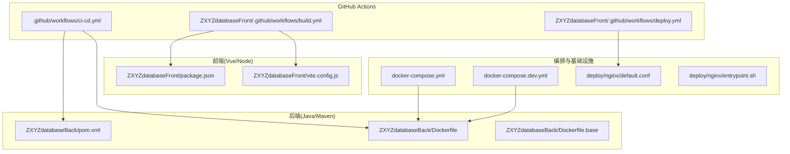
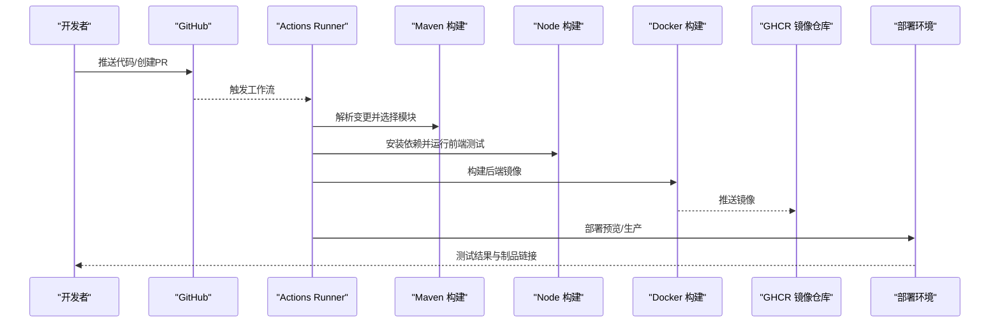
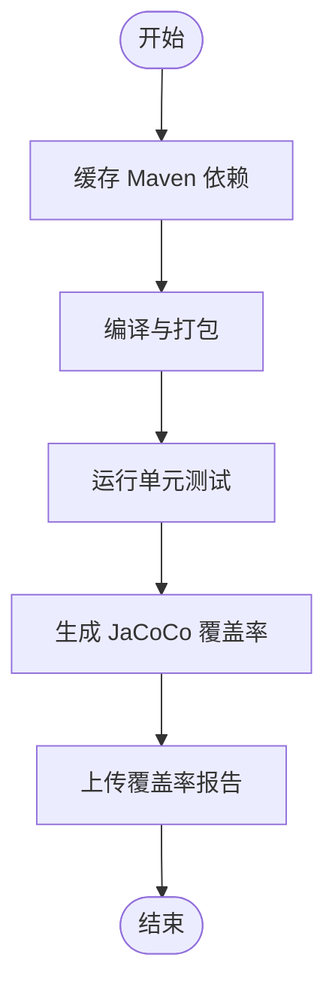
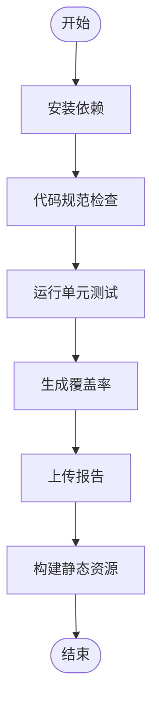
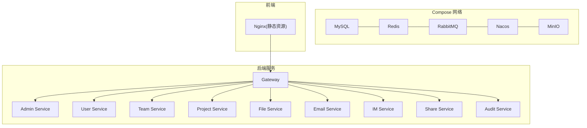
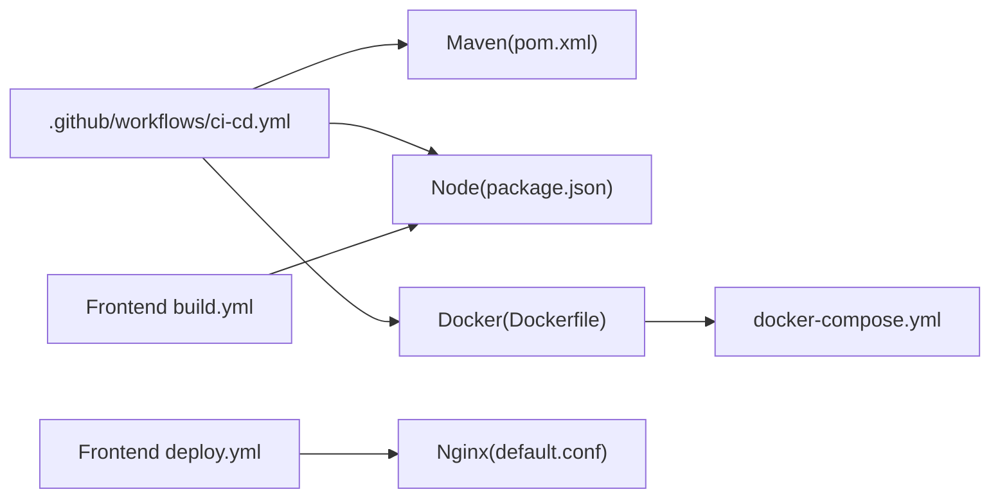

# 持续集成测试

<cite>
**本文引用的文件**   
- [ci-cd.yml](file://.github/workflows/ci-cd.yml)
- [build.yml](file://ZXYZdatabaseFront/.github/workflows/build.yml)
- [deploy.yml](file://ZXYZdatabaseFront/.github/workflows/deploy.yml)
- [docker-compose.yml](file://docker-compose.yml)
- [docker-compose.dev.yml](file://docker-compose.dev.yml)
- [Dockerfile](file://ZXYZdatabaseBack/Dockerfile)
- [Dockerfile.base](file://ZXYZdatabaseBack/Dockerfile.base)
- [pom.xml](file://ZXYZdatabaseBack/pom.xml)
- [package.json](file://ZXYZdatabaseFront/package.json)
- [vite.config.js](file://ZXYZdatabaseFront/vite.config.js)
- [application-test.yml](file://ZXYZdatabaseBack/zxyz-admin-service/src/test/resources/application-test.yml)
- [application-test.yml](file://ZXYZdatabaseBack/zxyz-file-service/src/test/resources/application-test.yml)
- [application-test.yml](file://ZXYZdatabaseBack/zxyz-project-service/src/test/resources/application-test.yml)
- [application-test.yml](file://ZXYZdatabaseBack/zxyz-team-service/src/test/resources/application-test.yml)
- [application-test.yml](file://ZXYZdatabaseBack/zxyz-user-service/src/test/resources/application-test.yml)
- [application.yml](file://ZXYZdatabaseBack/zxyz-im-service/src/test/resources/application.yml)
- [setup.js](file://ZXYZdatabaseFront/src/test/setup.js)
- [default.conf](file://deploy/nginx/default.conf)
- [entrypoint.sh](file://deploy/nginx/entrypoint.sh)
</cite>

## 目录
1. [简介](#简介)
2. [项目结构](#项目结构)
3. [核心组件](#核心组件)
4. [架构总览](#架构总览)
5. [详细组件分析](#详细组件分析)
6. [依赖关系分析](#依赖关系分析)
7. [性能考量](#性能考量)
8. [故障排查指南](#故障排查指南)
9. [结论](#结论)
10. [附录](#附录)

## 简介
本文件为 ZXYZ 项目提供完整的持续集成测试流水线设计，覆盖 GitHub Actions 工作流、多分支策略、选择性构建与并行测试执行；说明 Maven 与 Node.js 测试自动化配置、测试报告收集与展示；给出 Docker 容器化测试环境搭建方案（基础设施依赖、网络与资源限制）；并完善覆盖率统计（JaCoCo、前端测试报告、HTML 报告）、结果通知（邮件、Slack）与失败重试策略。同时包含性能测试与负载测试的集成思路，确保代码质量持续监控。

## 项目结构
ZXYZ 采用微服务架构：后端为 11 个 Maven 模块（含网关），前端为 Vue 3 应用。CI/CD 基于 GitHub Actions，使用 dorny/paths-filter 实现选择性构建；镜像推送 GHCR；Nacos 管理配置与服务注册；Jasypt 加密敏感配置。

图表来源
- [ci-cd.yml](file://.github/workflows/ci-cd.yml)
- [build.yml](file://ZXYZdatabaseFront/.github/workflows/build.yml)
- [deploy.yml](file://ZXYZdatabaseFront/.github/workflows/deploy.yml)
- [pom.xml](file://ZXYZdatabaseBack/pom.xml)
- [Dockerfile](file://ZXYZdatabaseBack/Dockerfile)
- [Dockerfile.base](file://ZXYZdatabaseBack/Dockerfile.base)
- [package.json](file://ZXYZdatabaseFront/package.json)
- [vite.config.js](file://ZXYZdatabaseFront/vite.config.js)
- [docker-compose.yml](file://docker-compose.yml)
- [docker-compose.dev.yml](file://docker-compose.dev.yml)
- [default.conf](file://deploy/nginx/default.conf)
- [entrypoint.sh](file://deploy/nginx/entrypoint.sh)

章节来源
- [ci-cd.yml](file://.github/workflows/ci-cd.yml)
- [build.yml](file://ZXYZdatabaseFront/.github/workflows/build.yml)
- [deploy.yml](file://ZXYZdatabaseFront/.github/workflows/deploy.yml)
- [docker-compose.yml](file://docker-compose.yml)
- [docker-compose.dev.yml](file://docker-compose.dev.yml)
- [Dockerfile](file://ZXYZdatabaseBack/Dockerfile)
- [Dockerfile.base](file://ZXYZdatabaseBack/Dockerfile.base)
- [pom.xml](file://ZXYZdatabaseBack/pom.xml)
- [package.json](file://ZXYZdatabaseFront/package.json)
- [vite.config.js](file://ZXYZdatabaseFront/vite.config.js)
- [default.conf](file://deploy/nginx/default.conf)
- [entrypoint.sh](file://deploy/nginx/entrypoint.sh)

## 核心组件
- 工作流入口与选择性构建
  - 根工作流 ci-cd.yml 定义多阶段任务：拉取代码、缓存依赖、选择性构建、并行测试、生成报告、构建镜像、推送镜像、部署预览/生产。
  - 使用路径过滤触发相关模块构建，减少无关构建时间。
- 前端工作流
  - build.yml：安装依赖、运行单元测试、Lint、构建产物。
  - deploy.yml：将静态资源部署到目标环境（如 Nginx）。
- 后端测试与覆盖率
  - 各子模块 pom.xml 中集成 JaCoCo 插件，测试阶段生成覆盖率数据。
  - 测试配置文件 application-test.yml 用于隔离测试数据库与外部依赖。
- 前端测试与报告
  - package.json 定义测试脚本与覆盖率工具（如 Jest/Vitest + coverage）。
  - vite.config.js 可配置测试环境与代理。
- 容器化与编排
  - Dockerfile/Dockerfile.base 定义后端镜像基础层与应用层。
  - docker-compose.yml/docker-compose.dev.yml 编排基础设施（MySQL、Redis、RabbitMQ、Nacos、MinIO 等）与后端服务、前端 Nginx。

章节来源
- [ci-cd.yml](file://.github/workflows/ci-cd.yml)
- [build.yml](file://ZXYZdatabaseFront/.github/workflows/build.yml)
- [deploy.yml](file://ZXYZdatabaseFront/.github/workflows/deploy.yml)
- [pom.xml](file://ZXYZdatabaseBack/pom.xml)
- [package.json](file://ZXYZdatabaseFront/package.json)
- [vite.config.js](file://ZXYZdatabaseFront/vite.config.js)
- [Dockerfile](file://ZXYZdatabaseBack/Dockerfile)
- [Dockerfile.base](file://ZXYZdatabaseBack/Dockerfile.base)
- [docker-compose.yml](file://docker-compose.yml)
- [docker-compose.dev.yml](file://docker-compose.dev.yml)

## 架构总览
下图展示了从代码提交到测试、构建、发布的全链路流程，以及关键工件与产物。

图表来源
- [ci-cd.yml](file://.github/workflows/ci-cd.yml)
- [build.yml](file://ZXYZdatabaseFront/.github/workflows/build.yml)
- [deploy.yml](file://ZXYZdatabaseFront/.github/workflows/deploy.yml)
- [Dockerfile](file://ZXYZdatabaseBack/Dockerfile)
- [pom.xml](file://ZXYZdatabaseBack/pom.xml)
- [package.json](file://ZXYZdatabaseFront/package.json)

## 详细组件分析

### 工作流与多分支策略
- 分支策略
  - main/release：全量构建与测试，生成稳定镜像，触发生产部署。
  - develop：合并请求触发选择性构建与并行测试，生成预览镜像。
  - feature/*：仅对变更模块进行增量构建与测试，缩短反馈周期。
- 选择性构建
  - 通过路径过滤匹配后端模块与前端源码变更，仅构建受影响模块。
- 并行执行
  - 按模块矩阵并行执行测试与构建，充分利用 Runner 资源。

章节来源
- [ci-cd.yml](file://.github/workflows/ci-cd.yml)

### 后端测试与覆盖率（Maven + JaCoCo）
- 测试执行
  - 在 CI 中调用 Maven 测试命令，跳过集成测试或按需启用。
  - 使用 application-test.yml 注入测试配置（内存库、Mock 外部依赖）。
- 覆盖率统计
  - 通过 JaCoCo 生成 XML/HTML 覆盖率报告，上传至 Actions 工件。
  - 可在 PR 中展示覆盖率阈值检查。

图表来源
- [pom.xml](file://ZXYZdatabaseBack/pom.xml)
- [application-test.yml](file://ZXYZdatabaseBack/zxyz-admin-service/src/test/resources/application-test.yml)
- [application-test.yml](file://ZXYZdatabaseBack/zxyz-file-service/src/test/resources/application-test.yml)
- [application-test.yml](file://ZXYZdatabaseBack/zxyz-project-service/src/test/resources/application-test.yml)
- [application-test.yml](file://ZXYZdatabaseBack/zxyz-team-service/src/test/resources/application-test.yml)
- [application-test.yml](file://ZXYZdatabaseBack/zxyz-user-service/src/test/resources/application-test.yml)

章节来源
- [pom.xml](file://ZXYZdatabaseBack/pom.xml)
- [application-test.yml](file://ZXYZdatabaseBack/zxyz-admin-service/src/test/resources/application-test.yml)
- [application-test.yml](file://ZXYZdatabaseBack/zxyz-file-service/src/test/resources/application-test.yml)
- [application-test.yml](file://ZXYZdatabaseBack/zxyz-project-service/src/test/resources/application-test.yml)
- [application-test.yml](file://ZXYZdatabaseBack/zxyz-team-service/src/test/resources/application-test.yml)
- [application-test.yml](file://ZXYZdatabaseBack/zxyz-user-service/src/test/resources/application-test.yml)

### 前端测试与报告（Node.js）
- 测试执行
  - 使用 package.json 中的脚本运行单元测试与 Lint。
  - 通过 vite.config.js 配置测试环境与代理。
- 覆盖率与报告
  - 生成覆盖率数据并上传工件，便于 PR 审查。
  - 可选集成 HTML 报告查看器。

图表来源
- [package.json](file://ZXYZdatabaseFront/package.json)
- [vite.config.js](file://ZXYZdatabaseFront/vite.config.js)
- [setup.js](file://ZXYZdatabaseFront/src/test/setup.js)

章节来源
- [package.json](file://ZXYZdatabaseFront/package.json)
- [vite.config.js](file://ZXYZdatabaseFront/vite.config.js)
- [setup.js](file://ZXYZdatabaseFront/src/test/setup.js)

### Docker 容器化测试环境
- 镜像构建
  - 使用 Dockerfile.base 作为基础镜像，复用公共依赖层。
  - Dockerfile 定义应用层构建与运行时配置。
- 编排与依赖
  - docker-compose.yml 编排 MySQL、Redis、RabbitMQ、Nacos、MinIO 等基础设施。
  - docker-compose.dev.yml 提供开发/测试环境差异化配置。
- 网络与资源限制
  - 自定义网络隔离服务间通信。
  - 设置 CPU/内存限制，避免资源争用。

图表来源
- [docker-compose.yml](file://docker-compose.yml)
- [docker-compose.dev.yml](file://docker-compose.dev.yml)
- [Dockerfile](file://ZXYZdatabaseBack/Dockerfile)
- [Dockerfile.base](file://ZXYZdatabaseBack/Dockerfile.base)
- [default.conf](file://deploy/nginx/default.conf)
- [entrypoint.sh](file://deploy/nginx/entrypoint.sh)

章节来源
- [docker-compose.yml](file://docker-compose.yml)
- [docker-compose.dev.yml](file://docker-compose.dev.yml)
- [Dockerfile](file://ZXYZdatabaseBack/Dockerfile)
- [Dockerfile.base](file://ZXYZdatabaseBack/Dockerfile.base)
- [default.conf](file://deploy/nginx/default.conf)
- [entrypoint.sh](file://deploy/nginx/entrypoint.sh)

### 测试结果通知与失败重试
- 通知机制
  - 邮件通知：在失败时发送告警邮件。
  - Slack 集成：通过 Webhook 推送状态到频道。
- 失败重试
  - 对不稳定步骤（如网络请求、外部依赖启动）配置自动重试。
  - 针对特定测试用例支持重跑。

章节来源
- [ci-cd.yml](file://.github/workflows/ci-cd.yml)

### 性能测试与负载测试集成
- 集成方案
  - 在 CI 中启动最小化测试环境（容器化），执行 JMeter/k6 脚本。
  - 采集响应时间与吞吐指标，生成报告并归档。
- 质量门禁
  - 设定性能基线，未达标则阻断合并。

章节来源
- [docker-compose.yml](file://docker-compose.yml)
- [docker-compose.dev.yml](file://docker-compose.dev.yml)

## 依赖关系分析
- 工作流依赖
  - ci-cd.yml 依赖 Maven、Node.js、Docker 环境。
  - 前端工作流依赖 Node.js 与包管理器。
- 模块依赖
  - 后端模块通过 Maven 聚合与依赖管理。
  - 前端依赖 package.json 声明的库与工具链。
- 基础设施依赖
  - 容器编排依赖 MySQL、Redis、RabbitMQ、Nacos、MinIO。

图表来源
- [ci-cd.yml](file://.github/workflows/ci-cd.yml)
- [build.yml](file://ZXYZdatabaseFront/.github/workflows/build.yml)
- [deploy.yml](file://ZXYZdatabaseFront/.github/workflows/deploy.yml)
- [pom.xml](file://ZXYZdatabaseBack/pom.xml)
- [package.json](file://ZXYZdatabaseFront/package.json)
- [Dockerfile](file://ZXYZdatabaseBack/Dockerfile)
- [docker-compose.yml](file://docker-compose.yml)
- [default.conf](file://deploy/nginx/default.conf)

章节来源
- [ci-cd.yml](file://.github/workflows/ci-cd.yml)
- [build.yml](file://ZXYZdatabaseFront/.github/workflows/build.yml)
- [deploy.yml](file://ZXYZdatabaseFront/.github/workflows/deploy.yml)
- [pom.xml](file://ZXYZdatabaseBack/pom.xml)
- [package.json](file://ZXYZdatabaseFront/package.json)
- [Dockerfile](file://ZXYZdatabaseBack/Dockerfile)
- [docker-compose.yml](file://docker-compose.yml)
- [default.conf](file://deploy/nginx/default.conf)

## 性能考量
- 构建缓存
  - 缓存 Maven 依赖与 Node_modules，显著缩短构建时间。
- 并行化
  - 按模块矩阵并行执行测试与构建，提升吞吐。
- 资源限制
  - 为容器设置 CPU/内存上限，避免资源竞争导致抖动。
- 镜像分层
  - 使用基础镜像与分层构建，提高缓存命中率。

[本节为通用指导，不直接分析具体文件]

## 故障排查指南
- 常见问题
  - 依赖下载失败：检查网络与代理配置，确认缓存键正确。
  - 测试失败：核对 application-test.yml 配置与外部依赖可用性。
  - 镜像构建失败：检查 Dockerfile 语法与基础镜像可达性。
  - 前端构建失败：确认 Node 版本与依赖安装成功。
- 定位方法
  - 查看 Actions 日志输出与工件附件。
  - 本地使用 docker-compose 复现问题。

章节来源
- [ci-cd.yml](file://.github/workflows/ci-cd.yml)
- [application-test.yml](file://ZXYZdatabaseBack/zxyz-admin-service/src/test/resources/application-test.yml)
- [application-test.yml](file://ZXYZdatabaseBack/zxyz-file-service/src/test/resources/application-test.yml)
- [application-test.yml](file://ZXYZdatabaseBack/zxyz-project-service/src/test/resources/application-test.yml)
- [application-test.yml](file://ZXYZdatabaseBack/zxyz-team-service/src/test/resources/application-test.yml)
- [application-test.yml](file://ZXYZdatabaseBack/zxyz-user-service/src/test/resources/application-test.yml)
- [application.yml](file://ZXYZdatabaseBack/zxyz-im-service/src/test/resources/application.yml)
- [Dockerfile](file://ZXYZdatabaseBack/Dockerfile)
- [package.json](file://ZXYZdatabaseFront/package.json)

## 结论
通过上述 CI/CD 流水线设计，ZXYZ 项目实现了多分支策略、选择性构建与并行测试，结合容器化测试环境与覆盖率统计，形成端到端的质量保障闭环。配合通知与重试机制，以及性能测试集成，能够持续提升交付质量与稳定性。

[本节为总结性内容，不直接分析具体文件]

## 附录
- 建议补充
  - 在 PR 中集成覆盖率阈值门禁。
  - 引入 SonarQube 进行静态代码分析。
  - 建立性能基准回归测试集。
- 参考配置位置
  - 后端测试配置：各模块 src/test/resources/application-test.yml
  - 前端测试配置：src/test/setup.js、vite.config.js
  - 编排与镜像：docker-compose*.yml、Dockerfile*

[本节为补充信息，不直接分析具体文件]