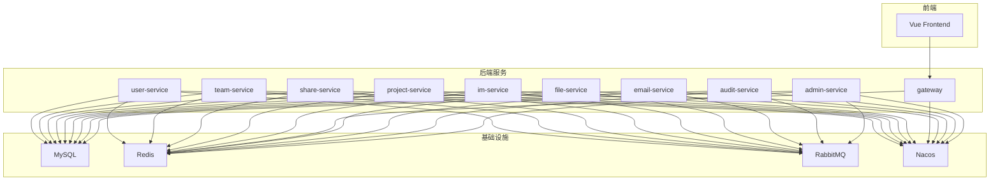
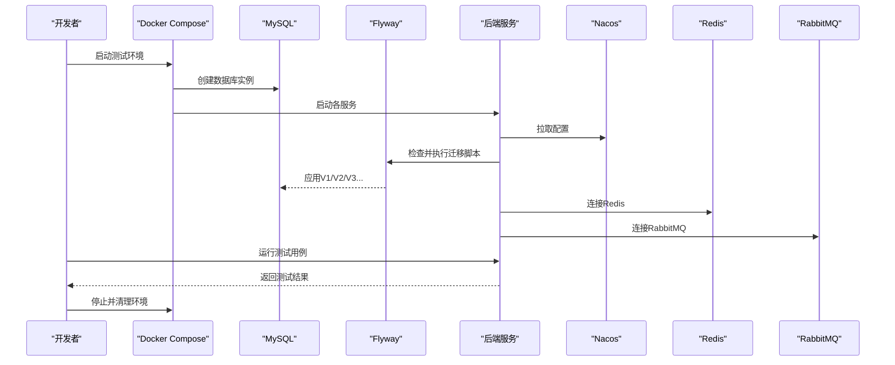
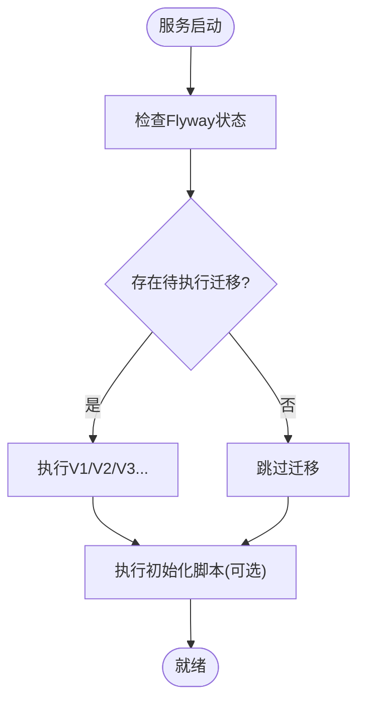
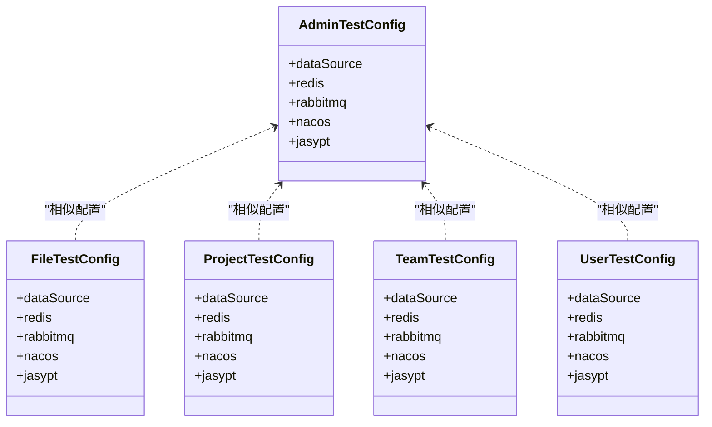
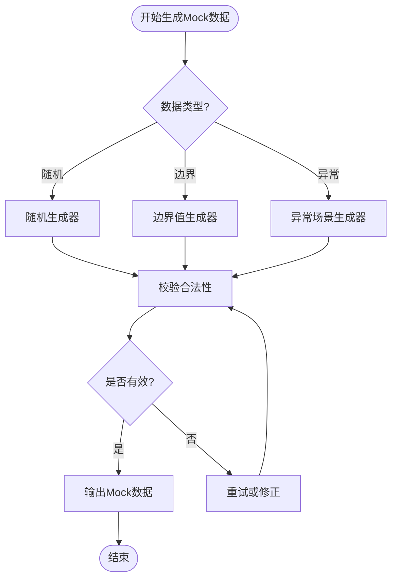
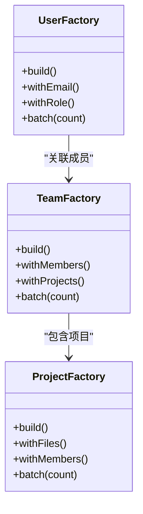
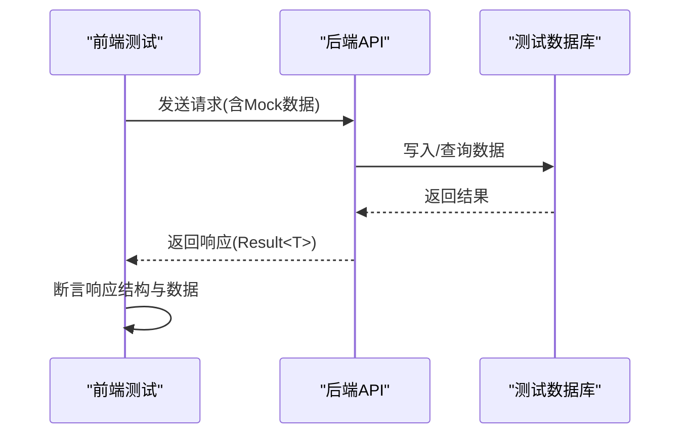
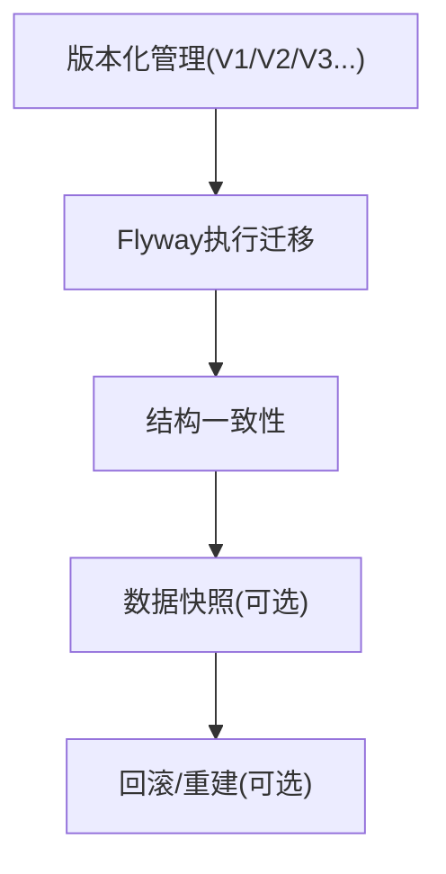
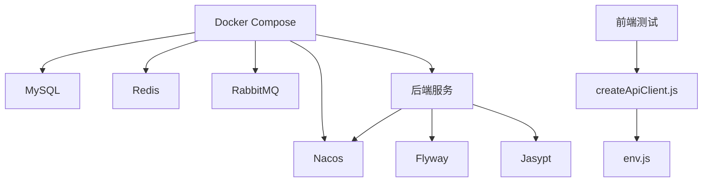

# 测试数据管理

<cite>
**本文引用的文件**   
- [docker-compose.yml](file://docker-compose.yml)
- [docker-compose.dev.yml](file://docker-compose.dev.yml)
- [ZXYZdatabaseBack/zxyz-admin-service/src/main/resources/application.yml](file://ZXYZdatabaseBack/zxyz-admin-service/src/main/resources/application.yml)
- [ZXYZdatabaseBack/zxyz-admin-service/src/test/resources/application-test.yml](file://ZXYZdatabaseBack/zxyz-admin-service/src/test/resources/application-test.yml)
- [ZXYZdatabaseBack/zxyz-admin-service/src/main/resources/db/migration/V1__init_config_schema.sql](file://ZXYZdatabaseBack/zxyz-admin-service/src/main/resources/db/migration/V1__init_config_schema.sql)
- [ZXYZdatabaseBack/zxyz-admin-service/src/main/resources/db/migration/V2__hot_config_keys.sql](file://ZXYZdatabaseBack/zxyz-admin-service/src/main/resources/db/migration/V2__hot_config_keys.sql)
- [ZXYZdatabaseBack/zxyz-admin-service/src/main/resources/db/migration/V3__fix_config_keys.sql](file://ZXYZdatabaseBack/zxyz-admin-service/src/main/resources/db/migration/V3__fix_config_keys.sql)
- [ZXYZdatabaseBack/zxyz-audit-service/src/main/resources/application.yml](file://ZXYZdatabaseBack/zxyz-audit-service/src/main/resources/application.yml)
- [ZXYZdatabaseBack/zxyz-audit-service/src/main/resources/db/migration/V1__init_schema.sql](file://ZXYZdatabaseBack/zxyz-audit-service/src/main/resources/db/migration/V1__init_schema.sql)
- [ZXYZdatabaseBack/zxyz-email-service/src/main/resources/application.yml](file://ZXYZdatabaseBack/zxyz-email-service/src/main/resources/application.yml)
- [ZXYZdatabaseBack/zxyz-file-service/src/main/resources/application.yml](file://ZXYZdatabaseBack/zxyz-file-service/src/main/resources/application.yml)
- [ZXYZdatabaseBack/zxyz-file-service/src/test/resources/application-test.yml](file://ZXYZdatabaseBack/zxyz-file-service/src/test/resources/application-test.yml)
- [ZXYZdatabaseBack/zxyz-gateway/src/main/resources/application.yml](file://ZXYZdatabaseBack/zxyz-gateway/src/main/resources/application.yml)
- [ZXYZdatabaseBack/zxyz-im-service/src/main/resources/application.yml](file://ZXYZdatabaseBack/zxyz-im-service/src/main/resources/application.yml)
- [ZXYZdatabaseBack/zxyz-project-service/src/main/resources/application.yml](file://ZXYZdatabaseBack/zxyz-project-service/src/main/resources/application.yml)
- [ZXYZdatabaseBack/zxyz-project-service/src/test/resources/application-test.yml](file://ZXYZdatabaseBack/zxyz-project-service/src/test/resources/application-test.yml)
- [ZXYZdatabaseBack/zxyz-share-service/src/main/resources/application.yml](file://ZXYZdatabaseBack/zxyz-share-service/src/main/resources/application.yml)
- [ZXYZdatabaseBack/zxyz-team-service/src/main/resources/application.yml](file://ZXYZdatabaseBack/zxyz-team-service/src/main/resources/application.yml)
- [ZXYZdatabaseBack/zxyz-team-service/src/test/resources/application-test.yml](file://ZXYZdatabaseBack/zxyz-team-service/src/test/resources/application-test.yml)
- [ZXYZdatabaseBack/zxyz-user-service/src/main/resources/application.yml](file://ZXYZdatabaseBack/zxyz-user-service/src/main/resources/application.yml)
- [ZXYZdatabaseBack/zxyz-user-service/src/test/resources/application-test.yml](file://ZXYZdatabaseBack/zxyz-user-service/src/test/resources/application-test.yml)
- [ZXYZdatabaseFront/src/api/__tests__/auth.spec.js](file://ZXYZdatabaseFront/src/api/__tests__/auth.spec.js)
- [ZXYZdatabaseFront/src/api/__tests__/files.spec.js](file://ZXYZdatabaseFront/src/api/__tests__/files.spec.js)
- [ZXYZdatabaseFront/src/api/__tests__/im.spec.js](file://ZXYZdatabaseFront/src/api/__tests__/im.spec.js)
- [ZXYZdatabaseFront/src/api/__tests__/team.spec.js](file://ZXYZdatabaseFront/src/api/__tests__/team.spec.js)
- [ZXYZdatabaseFront/src/utils/createApiClient.js](file://ZXYZdatabaseFront/src/utils/createApiClient.js)
- [ZXYZdatabaseFront/src/utils/env.js](file://ZXYZdatabaseFront/src/utils/env.js)
- [nacos-config/zxyz-dynamic.yml](file://nacos-config/zxyz-dynamic.yml)
- [nacos-config/zxyz-static.yml](file://nacos-config/zxyz-static.yml)
- [scripts/validate-env.sh](file://scripts/validate-env.sh)
- [sql/00-init-zxyz.sh](file://sql/00-init-zxyz.sh)
</cite>

## 目录
1. [简介](#简介)
2. [项目结构](#项目结构)
3. [核心组件](#核心组件)
4. [架构总览](#架构总览)
5. [详细组件分析](#详细组件分析)
6. [依赖分析](#依赖分析)
7. [性能考虑](#性能考虑)
8. [故障排查指南](#故障排查指南)
9. [结论](#结论)
10. [附录](#附录)

## 简介
本文件为 ZXYZ 项目建立一套完善的测试数据管理策略，覆盖以下关键主题：
- 测试数据的准备与清理策略（Flyway 迁移脚本在测试环境的使用、测试数据库初始化、数据重置机制）
- Mock 数据生成方法（随机数据、边界值、异常场景）
- 测试环境配置管理（application-test.yml、环境变量隔离、敏感信息处理）
- 测试数据工厂模式实现（实体构建、关联关系设置、批量数据生成）
- 前后端测试数据同步策略（接口契约一致性）
- 测试数据版本管理与迁移策略（多环境支持）

该策略基于项目的微服务架构（后端 11 个 Maven 模块 + Vue 前端）、Docker Compose 编排、Nacos 配置中心以及 Flyway 迁移脚本等基础设施进行设计。

## 项目结构
从仓库结构可见：
- 后端各服务均包含 application.yml 与可选的 application-test.yml，用于区分运行环境与测试环境配置
- 每个服务的 db/migration 目录存放 Flyway 迁移脚本，按 Vx__name.sql 命名规范组织
- 前端测试用例位于 src/api/__tests__ 与 composables/__tests__ 等目录，配合 createApiClient.js 和 env.js 进行请求与环境变量管理
- docker-compose*.yml 统一编排数据库、缓存、消息队列、Nacos、网关与各业务服务
- nacos-config 提供动态与静态配置，便于集中管理不同环境的配置项

**图表来源**
- [docker-compose.yml](file://docker-compose.yml)
- [docker-compose.dev.yml](file://docker-compose.dev.yml)

**章节来源**
- [docker-compose.yml](file://docker-compose.yml)
- [docker-compose.dev.yml](file://docker-compose.dev.yml)

## 核心组件
- 测试配置文件：各服务 test 资源下的 application-test.yml，用于覆盖默认配置（如数据源、Redis、MQ、Nacos、Jasypt 等）
- 迁移脚本：各服务 db/migration 目录下的 Vx__name.sql，由 Flyway 自动执行，确保测试库结构与生产一致
- 容器编排：docker-compose*.yml 定义数据库、缓存、消息队列、Nacos 及所有服务容器，便于本地与 CI 环境快速拉起
- 前端测试工具：createApiClient.js 封装请求，env.js 读取环境变量，前端测试用例通过 Mock 或真实后端 API 验证契约

**章节来源**
- [ZXYZdatabaseBack/zxyz-admin-service/src/test/resources/application-test.yml](file://ZXYZdatabaseBack/zxyz-admin-service/src/test/resources/application-test.yml)
- [ZXYZdatabaseBack/zxyz-file-service/src/test/resources/application-test.yml](file://ZXYZdatabaseBack/zxyz-file-service/src/test/resources/application-test.yml)
- [ZXYZdatabaseBack/zxyz-project-service/src/test/resources/application-test.yml](file://ZXYZdatabaseBack/zxyz-project-service/src/test/resources/application-test.yml)
- [ZXYZdatabaseBack/zxyz-team-service/src/test/resources/application-test.yml](file://ZXYZdatabaseBack/zxyz-team-service/src/test/resources/application-test.yml)
- [ZXYZdatabaseBack/zxyz-user-service/src/test/resources/application-test.yml](file://ZXYZdatabaseBack/zxyz-user-service/src/test/resources/application-test.yml)
- [ZXYZdatabaseBack/zxyz-admin-service/src/main/resources/db/migration/V1__init_config_schema.sql](file://ZXYZdatabaseBack/zxyz-admin-service/src/main/resources/db/migration/V1__init_config_schema.sql)
- [ZXYZdatabaseBack/zxyz-admin-service/src/main/resources/db/migration/V2__hot_config_keys.sql](file://ZXYZdatabaseBack/zxyz-admin-service/src/main/resources/db/migration/V2__hot_config_keys.sql)
- [ZXYZdatabaseBack/zxyz-admin-service/src/main/resources/db/migration/V3__fix_config_keys.sql](file://ZXYZdatabaseBack/zxyz-admin-service/src/main/resources/db/migration/V3__fix_config_keys.sql)
- [ZXYZdatabaseBack/zxyz-audit-service/src/main/resources/db/migration/V1__init_schema.sql](file://ZXYZdatabaseBack/zxyz-audit-service/src/main/resources/db/migration/V1__init_schema.sql)
- [ZXYZdatabaseFront/src/utils/createApiClient.js](file://ZXYZdatabaseFront/src/utils/createApiClient.js)
- [ZXYZdatabaseFront/src/utils/env.js](file://ZXYZdatabaseFront/src/utils/env.js)

## 架构总览
测试数据管理的整体流程如下：
- 启动阶段：通过 docker-compose 拉起 MySQL、Redis、RabbitMQ、Nacos 及各服务；各服务根据 application-test.yml 连接相应中间件
- 迁移阶段：Flyway 在各服务启动时扫描 db/migration 并执行未应用的脚本，保证数据库结构与版本一致
- 初始化阶段：使用 sql/00-init-zxyz.sh 或各服务内建初始化逻辑注入基础数据（用户、团队、系统配置等）
- 测试阶段：单元测试与集成测试通过 application-test.yml 指定的数据源与外部依赖，必要时使用 Mock 或 Testcontainers
- 清理阶段：测试结束后回滚事务或使用专用清理脚本清空测试库，确保下一次测试环境干净

**图表来源**
- [docker-compose.yml](file://docker-compose.yml)
- [ZXYZdatabaseBack/zxyz-admin-service/src/main/resources/application.yml](file://ZXYZdatabaseBack/zxyz-admin-service/src/main/resources/application.yml)
- [ZXYZdatabaseBack/zxyz-audit-service/src/main/resources/application.yml](file://ZXYZdatabaseBack/zxyz-audit-service/src/main/resources/application.yml)
- [ZXYZdatabaseBack/zxyz-email-service/src/main/resources/application.yml](file://ZXYZdatabaseBack/zxyz-email-service/src/main/resources/application.yml)
- [ZXYZdatabaseBack/zxyz-file-service/src/main/resources/application.yml](file://ZXYZdatabaseBack/zxyz-file-service/src/main/resources/application.yml)
- [ZXYZdatabaseBack/zxyz-gateway/src/main/resources/application.yml](file://ZXYZdatabaseBack/zxyz-gateway/src/main/resources/application.yml)
- [ZXYZdatabaseBack/zxyz-im-service/src/main/resources/application.yml](file://ZXYZdatabaseBack/zxyz-im-service/src/main/resources/application.yml)
- [ZXYZdatabaseBack/zxyz-project-service/src/main/resources/application.yml](file://ZXYZdatabaseBack/zxyz-project-service/src/main/resources/application.yml)
- [ZXYZdatabaseBack/zxyz-share-service/src/main/resources/application.yml](file://ZXYZdatabaseBack/zxyz-share-service/src/main/resources/application.yml)
- [ZXYZdatabaseBack/zxyz-team-service/src/main/resources/application.yml](file://ZXYZdatabaseBack/zxyz-team-service/src/main/resources/application.yml)
- [ZXYZdatabaseBack/zxyz-user-service/src/main/resources/application.yml](file://ZXYZdatabaseBack/zxyz-user-service/src/main/resources/application.yml)

## 详细组件分析

### 测试数据库初始化与 Flyway 迁移
- 各服务通过 Flyway 自动执行 db/migration 下的 SQL 脚本，确保测试库与生产库结构一致
- 建议在 application-test.yml 中指定独立的测试数据库名与连接参数，避免污染开发或生产数据
- 对于跨服务共享的基础数据，可通过 sql/00-init-zxyz.sh 统一初始化，或在服务启动后通过内部接口注入

**图表来源**
- [ZXYZdatabaseBack/zxyz-admin-service/src/main/resources/db/migration/V1__init_config_schema.sql](file://ZXYZdatabaseBack/zxyz-admin-service/src/main/resources/db/migration/V1__init_config_schema.sql)
- [ZXYZdatabaseBack/zxyz-admin-service/src/main/resources/db/migration/V2__hot_config_keys.sql](file://ZXYZdatabaseBack/zxyz-admin-service/src/main/resources/db/migration/V2__hot_config_keys.sql)
- [ZXYZdatabaseBack/zxyz-admin-service/src/main/resources/db/migration/V3__fix_config_keys.sql](file://ZXYZdatabaseBack/zxyz-admin-service/src/main/resources/db/migration/V3__fix_config_keys.sql)
- [ZXYZdatabaseBack/zxyz-audit-service/src/main/resources/db/migration/V1__init_schema.sql](file://ZXYZdatabaseBack/zxyz-audit-service/src/main/resources/db/migration/V1__init_schema.sql)
- [sql/00-init-zxyz.sh](file://sql/00-init-zxyz.sh)

**章节来源**
- [ZXYZdatabaseBack/zxyz-admin-service/src/main/resources/db/migration/V1__init_config_schema.sql](file://ZXYZdatabaseBack/zxyz-admin-service/src/main/resources/db/migration/V1__init_config_schema.sql)
- [ZXYZdatabaseBack/zxyz-admin-service/src/main/resources/db/migration/V2__hot_config_keys.sql](file://ZXYZdatabaseBack/zxyz-admin-service/src/main/resources/db/migration/V2__hot_config_keys.sql)
- [ZXYZdatabaseBack/zxyz-admin-service/src/main/resources/db/migration/V3__fix_config_keys.sql](file://ZXYZdatabaseBack/zxyz-admin-service/src/main/resources/db/migration/V3__fix_config_keys.sql)
- [ZXYZdatabaseBack/zxyz-audit-service/src/main/resources/db/migration/V1__init_schema.sql](file://ZXYZdatabaseBack/zxyz-audit-service/src/main/resources/db/migration/V1__init_schema.sql)
- [sql/00-init-zxyz.sh](file://sql/00-init-zxyz.sh)

### 测试环境配置管理
- 各服务在 src/test/resources/application-test.yml 中覆盖数据源、缓存、消息队列、Nacos、Jasypt 等配置
- 建议将敏感信息（密码、密钥）通过环境变量注入，并使用 Jasypt 加密存储
- 前端通过 env.js 读取环境变量，createApiClient.js 统一发起请求，便于在测试环境中切换 Mock 或真实后端

**图表来源**
- [ZXYZdatabaseBack/zxyz-admin-service/src/test/resources/application-test.yml](file://ZXYZdatabaseBack/zxyz-admin-service/src/test/resources/application-test.yml)
- [ZXYZdatabaseBack/zxyz-file-service/src/test/resources/application-test.yml](file://ZXYZdatabaseBack/zxyz-file-service/src/test/resources/application-test.yml)
- [ZXYZdatabaseBack/zxyz-project-service/src/test/resources/application-test.yml](file://ZXYZdatabaseBack/zxyz-project-service/src/test/resources/application-test.yml)
- [ZXYZdatabaseBack/zxyz-team-service/src/test/resources/application-test.yml](file://ZXYZdatabaseBack/zxyz-team-service/src/test/resources/application-test.yml)
- [ZXYZdatabaseBack/zxyz-user-service/src/test/resources/application-test.yml](file://ZXYZdatabaseBack/zxyz-user-service/src/test/resources/application-test.yml)

**章节来源**
- [ZXYZdatabaseBack/zxyz-admin-service/src/test/resources/application-test.yml](file://ZXYZdatabaseBack/zxyz-admin-service/src/test/resources/application-test.yml)
- [ZXYZdatabaseBack/zxyz-file-service/src/test/resources/application-test.yml](file://ZXYZdatabaseBack/zxyz-file-service/src/test/resources/application-test.yml)
- [ZXYZdatabaseBack/zxyz-project-service/src/test/resources/application-test.yml](file://ZXYZdatabaseBack/zxyz-project-service/src/test/resources/application-test.yml)
- [ZXYZdatabaseBack/zxyz-team-service/src/test/resources/application-test.yml](file://ZXYZdatabaseBack/zxyz-team-service/src/test/resources/application-test.yml)
- [ZXYZdatabaseBack/zxyz-user-service/src/test/resources/application-test.yml](file://ZXYZdatabaseBack/zxyz-user-service/src/test/resources/application-test.yml)
- [ZXYZdatabaseFront/src/utils/env.js](file://ZXYZdatabaseFront/src/utils/env.js)
- [ZXYZdatabaseFront/src/utils/createApiClient.js](file://ZXYZdatabaseFront/src/utils/createApiClient.js)

### Mock 数据生成方法
- 随机数据：使用 Faker 或自定义生成器生成用户名、邮箱、文件名、时间戳等
- 边界值：构造极小/极大数值、超长字符串、特殊字符、空集合等
- 异常场景：模拟网络超时、权限不足、重复提交、并发冲突等
- 前端测试：通过 createApiClient.js 拦截请求，返回预设响应或抛出错误

**图表来源**
- [ZXYZdatabaseFront/src/api/__tests__/auth.spec.js](file://ZXYZdatabaseFront/src/api/__tests__/auth.spec.js)
- [ZXYZdatabaseFront/src/api/__tests__/files.spec.js](file://ZXYZdatabaseFront/src/api/__tests__/files.spec.js)
- [ZXYZdatabaseFront/src/api/__tests__/im.spec.js](file://ZXYZdatabaseFront/src/api/__tests__/im.spec.js)
- [ZXYZdatabaseFront/src/api/__tests__/team.spec.js](file://ZXYZdatabaseFront/src/api/__tests__/team.spec.js)
- [ZXYZdatabaseFront/src/utils/createApiClient.js](file://ZXYZdatabaseFront/src/utils/createApiClient.js)

**章节来源**
- [ZXYZdatabaseFront/src/api/__tests__/auth.spec.js](file://ZXYZdatabaseFront/src/api/__tests__/auth.spec.js)
- [ZXYZdatabaseFront/src/api/__tests__/files.spec.js](file://ZXYZdatabaseFront/src/api/__tests__/files.spec.js)
- [ZXYZdatabaseFront/src/api/__tests__/im.spec.js](file://ZXYZdatabaseFront/src/api/__tests__/im.spec.js)
- [ZXYZdatabaseFront/src/api/__tests__/team.spec.js](file://ZXYZdatabaseFront/src/api/__tests__/team.spec.js)
- [ZXYZdatabaseFront/src/utils/createApiClient.js](file://ZXYZdatabaseFront/src/utils/createApiClient.js)

### 测试数据工厂模式实现
- 实体构建：为每个领域实体提供 Builder 或 Factory，支持链式调用设置字段
- 关联关系：通过工厂方法设置外键、集合关系，确保数据完整性
- 批量生成：提供批量创建方法，支持分页、去重、约束校验
- 示例：UserFactory、TeamFactory、ProjectFactory 等

**图表来源**
- [ZXYZdatabaseBack/zxyz-user-service/src/test/resources/application-test.yml](file://ZXYZdatabaseBack/zxyz-user-service/src/test/resources/application-test.yml)
- [ZXYZdatabaseBack/zxyz-team-service/src/test/resources/application-test.yml](file://ZXYZdatabaseBack/zxyz-team-service/src/test/resources/application-test.yml)
- [ZXYZdatabaseBack/zxyz-project-service/src/test/resources/application-test.yml](file://ZXYZdatabaseBack/zxyz-project-service/src/test/resources/application-test.yml)

**章节来源**
- [ZXYZdatabaseBack/zxyz-user-service/src/test/resources/application-test.yml](file://ZXYZdatabaseBack/zxyz-user-service/src/test/resources/application-test.yml)
- [ZXYZdatabaseBack/zxyz-team-service/src/test/resources/application-test.yml](file://ZXYZdatabaseBack/zxyz-team-service/src/test/resources/application-test.yml)
- [ZXYZdatabaseBack/zxyz-project-service/src/test/resources/application-test.yml](file://ZXYZdatabaseBack/zxyz-project-service/src/test/resources/application-test.yml)

### 前后端测试数据同步策略
- 接口契约：前后端共享 API 文档（如 docs/api-contract.md），确保请求/响应结构一致
- 前端测试：通过 createApiClient.js 发起请求，断言响应码与数据结构
- 后端测试：使用 application-test.yml 连接测试数据库，验证持久化结果
- 同步机制：当接口变更时，同步更新前后端测试用例与 Mock 数据

**图表来源**
- [ZXYZdatabaseFront/src/utils/createApiClient.js](file://ZXYZdatabaseFront/src/utils/createApiClient.js)
- [ZXYZdatabaseFront/src/api/__tests__/auth.spec.js](file://ZXYZdatabaseFront/src/api/__tests__/auth.spec.js)
- [ZXYZdatabaseFront/src/api/__tests__/files.spec.js](file://ZXYZdatabaseFront/src/api/__tests__/files.spec.js)
- [ZXYZdatabaseFront/src/api/__tests__/im.spec.js](file://ZXYZdatabaseFront/src/api/__tests__/im.spec.js)
- [ZXYZdatabaseFront/src/api/__tests__/team.spec.js](file://ZXYZdatabaseFront/src/api/__tests__/team.spec.js)

**章节来源**
- [ZXYZdatabaseFront/src/utils/createApiClient.js](file://ZXYZdatabaseFront/src/utils/createApiClient.js)
- [ZXYZdatabaseFront/src/api/__tests__/auth.spec.js](file://ZXYZdatabaseFront/src/api/__tests__/auth.spec.js)
- [ZXYZdatabaseFront/src/api/__tests__/files.spec.js](file://ZXYZdatabaseFront/src/api/__tests__/files.spec.js)
- [ZXYZdatabaseFront/src/api/__tests__/im.spec.js](file://ZXYZdatabaseFront/src/api/__tests__/im.spec.js)
- [ZXYZdatabaseFront/src/api/__tests__/team.spec.js](file://ZXYZdatabaseFront/src/api/__tests__/team.spec.js)

### 测试数据版本管理与迁移策略
- 版本控制：Flyway 脚本按 Vx__name.sql 命名，确保迁移顺序可追溯
- 多环境支持：通过 application-test.yml 与 Nacos 配置区分环境，脚本内容保持一致
- 数据快照：重要变更后可导出测试数据快照，便于快速恢复
- 回滚策略：提供反向迁移脚本或重建数据库能力

**图表来源**
- [ZXYZdatabaseBack/zxyz-admin-service/src/main/resources/db/migration/V1__init_config_schema.sql](file://ZXYZdatabaseBack/zxyz-admin-service/src/main/resources/db/migration/V1__init_config_schema.sql)
- [ZXYZdatabaseBack/zxyz-admin-service/src/main/resources/db/migration/V2__hot_config_keys.sql](file://ZXYZdatabaseBack/zxyz-admin-service/src/main/resources/db/migration/V2__hot_config_keys.sql)
- [ZXYZdatabaseBack/zxyz-admin-service/src/main/resources/db/migration/V3__fix_config_keys.sql](file://ZXYZdatabaseBack/zxyz-admin-service/src/main/resources/db/migration/V3__fix_config_keys.sql)
- [ZXYZdatabaseBack/zxyz-audit-service/src/main/resources/db/migration/V1__init_schema.sql](file://ZXYZdatabaseBack/zxyz-audit-service/src/main/resources/db/migration/V1__init_schema.sql)

**章节来源**
- [ZXYZdatabaseBack/zxyz-admin-service/src/main/resources/db/migration/V1__init_config_schema.sql](file://ZXYZdatabaseBack/zxyz-admin-service/src/main/resources/db/migration/V1__init_config_schema.sql)
- [ZXYZdatabaseBack/zxyz-admin-service/src/main/resources/db/migration/V2__hot_config_keys.sql](file://ZXYZdatabaseBack/zxyz-admin-service/src/main/resources/db/migration/V2__hot_config_keys.sql)
- [ZXYZdatabaseBack/zxyz-admin-service/src/main/resources/db/migration/V3__fix_config_keys.sql](file://ZXYZdatabaseBack/zxyz-admin-service/src/main/resources/db/migration/V3__fix_config_keys.sql)
- [ZXYZdatabaseBack/zxyz-audit-service/src/main/resources/db/migration/V1__init_schema.sql](file://ZXYZdatabaseBack/zxyz-audit-service/src/main/resources/db/migration/V1__init_schema.sql)

## 依赖分析
测试数据管理依赖以下组件：
- Docker Compose：编排数据库、缓存、消息队列与服务
- Flyway：数据库迁移与版本管理
- Nacos：配置中心，统一管理各环境配置
- Jasypt：敏感信息加密
- 前端测试工具：createApiClient.js 与 env.js

**图表来源**
- [docker-compose.yml](file://docker-compose.yml)
- [docker-compose.dev.yml](file://docker-compose.dev.yml)
- [ZXYZdatabaseFront/src/utils/createApiClient.js](file://ZXYZdatabaseFront/src/utils/createApiClient.js)
- [ZXYZdatabaseFront/src/utils/env.js](file://ZXYZdatabaseFront/src/utils/env.js)

**章节来源**
- [docker-compose.yml](file://docker-compose.yml)
- [docker-compose.dev.yml](file://docker-compose.dev.yml)
- [ZXYZdatabaseFront/src/utils/createApiClient.js](file://ZXYZdatabaseFront/src/utils/createApiClient.js)
- [ZXYZdatabaseFront/src/utils/env.js](file://ZXYZdatabaseFront/src/utils/env.js)

## 性能考虑
- 测试数据量控制：避免生成过多数据影响测试速度，按需分页与裁剪
- 数据库索引优化：确保常用查询字段有索引，提升测试执行效率
- 并行测试：合理拆分测试套件，利用多线程或分布式执行
- Mock 外部依赖：减少对外部服务的依赖，提高测试稳定性

[本节为通用指导，无需特定文件引用]

## 故障排查指南
- 迁移失败：检查 Flyway 日志，确认脚本语法与依赖关系
- 配置错误：核对 application-test.yml 与 Nacos 配置，确保连接参数正确
- 敏感信息泄露：使用 Jasypt 加密，避免明文存储密码
- 前端请求失败：检查 createApiClient.js 与 env.js 配置，确认环境变量设置

**章节来源**
- [scripts/validate-env.sh](file://scripts/validate-env.sh)
- [nacos-config/zxyz-dynamic.yml](file://nacos-config/zxyz-dynamic.yml)
- [nacos-config/zxyz-static.yml](file://nacos-config/zxyz-static.yml)
- [ZXYZdatabaseFront/src/utils/createApiClient.js](file://ZXYZdatabaseFront/src/utils/createApiClient.js)
- [ZXYZdatabaseFront/src/utils/env.js](file://ZXYZdatabaseFront/src/utils/env.js)

## 结论
通过本策略，ZXYZ 项目可实现：
- 一致的测试数据准备与清理流程
- 可靠的 Mock 数据生成与异常场景覆盖
- 安全的测试环境配置与敏感信息管理
- 高效的测试数据工厂与批量生成能力
- 前后端接口契约的一致性保障
- 完善的测试数据版本管理与多环境支持

[本节为总结性内容，无需特定文件引用]

## 附录
- 参考文档：docs/api-contract.md、docs/architecture.md、docs/infrastructure.md
- 部署脚本：scripts/deploy-fast.sh、scripts/health-check.sh
- 初始化脚本：sql/00-init-zxyz.sh

[本节为补充信息，无需特定文件引用]